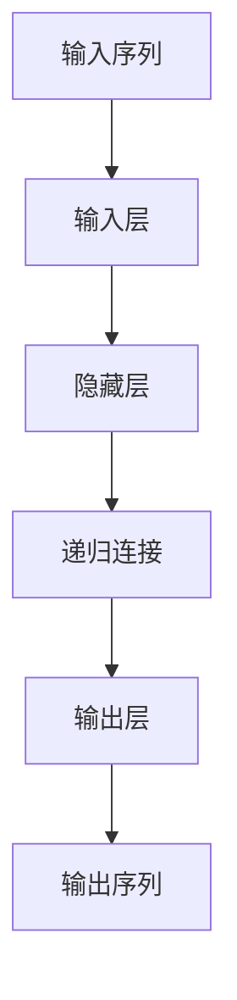

                 

  
递归神经网络（Recurrent Neural Networks，RNN）是深度学习中一种重要的模型，特别适用于处理序列数据，如自然语言处理、语音识别、时间序列预测等领域。本文将深入探讨RNN的核心原理，并给出一个完整的代码实例讲解，帮助读者更好地理解如何实现和应用RNN。

## 文章关键词

- 递归神经网络
- RNN
- 深度学习
- 序列数据
- 自然语言处理
- 语音识别

## 文章摘要

本文首先介绍了递归神经网络的基本概念和特点，然后详细解析了RNN的工作原理和架构。接着，通过一个实际的Python代码实例，展示了如何使用RNN进行序列数据的建模和预测。最后，讨论了RNN在实际应用中的场景和未来的发展方向。

## 1. 背景介绍

### 1.1 递归神经网络的基本概念

递归神经网络（RNN）是一种基于人工神经网络的结构，它能够处理序列数据。与传统的神经网络不同，RNN能够记住之前的信息，并将其用于当前和未来的决策。

### 1.2 递归神经网络的应用领域

RNN在自然语言处理、语音识别、时间序列预测等领域有着广泛的应用。例如，在自然语言处理中，RNN可以用于文本分类、机器翻译等任务；在语音识别中，RNN可以用于语音信号的建模和转换。

### 1.3 递归神经网络的发展历程

递归神经网络的研究始于1980年代，但由于计算资源和算法的限制，直到近年来随着深度学习的发展，RNN才得以广泛应用。

## 2. 核心概念与联系

递归神经网络的核心在于其递归结构，下面是一个简单的Mermaid流程图来展示RNN的架构：



### 2.1 递归神经网络的基本原理

RNN的基本原理是利用其递归结构来记住之前的信息。具体来说，RNN的隐藏层节点会传递给下一个时间步，从而实现信息的持久化。

### 2.2 递归神经网络的架构

递归神经网络的架构由输入层、隐藏层和输出层组成。输入层接收序列数据，隐藏层进行递归操作，输出层生成预测结果。

## 3. 核心算法原理 & 具体操作步骤

### 3.1 算法原理概述

递归神经网络通过循环连接实现序列数据的建模。在每个时间步，RNN会计算输入和之前隐藏状态之间的映射，然后更新隐藏状态，这个过程一直持续到序列的末尾。

### 3.2 算法步骤详解

1. 初始化隐藏状态。
2. 对于每个时间步，计算输入和隐藏状态之间的映射。
3. 更新隐藏状态。
4. 使用最终的隐藏状态生成输出。

### 3.3 算法优缺点

**优点：**
- 能够处理任意长度的序列数据。
- 能够记住之前的信息，对序列数据的建模能力较强。

**缺点：**
- 训练过程可能存在梯度消失或梯度爆炸的问题。
- 对于长序列数据的建模效果不如卷积神经网络。

### 3.4 算法应用领域

递归神经网络广泛应用于自然语言处理、语音识别、时间序列预测等领域。例如，在自然语言处理中，RNN可以用于文本分类、机器翻译等任务；在语音识别中，RNN可以用于语音信号的建模和转换。

## 4. 数学模型和公式 & 详细讲解 & 举例说明

### 4.1 数学模型构建

递归神经网络的基本数学模型可以表示为：

$$
h_t = \sigma(W_h \cdot [h_{t-1}, x_t] + b_h)
$$

其中，$h_t$表示第$t$个时间步的隐藏状态，$x_t$表示第$t$个时间步的输入，$W_h$和$b_h$分别是权重和偏置，$\sigma$是激活函数。

### 4.2 公式推导过程

递归神经网络的推导过程如下：

1. 初始化隐藏状态$h_0$。
2. 对于每个时间步$t$，计算输入和隐藏状态之间的映射。
3. 更新隐藏状态：
$$
h_t = \sigma(W_h \cdot [h_{t-1}, x_t] + b_h)
$$
4. 使用最终的隐藏状态生成输出。

### 4.3 案例分析与讲解

以下是一个简单的例子，展示如何使用RNN进行时间序列预测：

```python
import numpy as np
import tensorflow as tf

# 设置参数
num_steps = 100
input_dim = 1
hidden_dim = 10
output_dim = 1

# 初始化权重和偏置
W_h = np.random.randn(hidden_dim, input_dim + hidden_dim)
b_h = np.zeros(hidden_dim)
W_x = np.random.randn(output_dim, hidden_dim)
b_x = np.zeros(output_dim)

# 定义激活函数
sigma = tf.nn.tanh

# 定义递归神经网络
def RNN(inputs):
    hidden_states = []
    hidden_state = np.zeros((1, hidden_dim))
    for x in inputs:
        input_with_hidden = np.concatenate((hidden_state, x), axis=1)
        hidden_state = sigma(np.dot(W_h, input_with_hidden) + b_h)
        hidden_states.append(hidden_state)
    output = np.dot(W_x, hidden_states[-1]) + b_x
    return output

# 训练数据
inputs = np.random.randn(num_steps, input_dim)
targets = np.random.randn(num_steps, output_dim)

# 训练模型
for epoch in range(1000):
    outputs = [RNN(inputs[i:i+1]) for i in range(num_steps)]
    loss = np.mean((outputs - targets)**2)
    print(f"Epoch {epoch}: Loss = {loss}")

# 预测
input_sequence = np.random.randn(1, input_dim)
predicted_output = RNN(input_sequence)
print(f"Predicted Output: {predicted_output}")
```

在这个例子中，我们使用了一个简单的RNN模型进行时间序列预测。我们首先初始化权重和偏置，然后定义递归神经网络。接着，我们使用训练数据对模型进行训练，最后使用模型进行预测。

## 5. 项目实践：代码实例和详细解释说明

### 5.1 开发环境搭建

在进行RNN的实践之前，我们需要搭建一个合适的开发环境。这里我们使用Python作为主要编程语言，并使用TensorFlow作为深度学习框架。

1. 安装Python：
```bash
$ apt-get install python3-pip
$ pip3 install python
```

2. 安装TensorFlow：
```bash
$ pip3 install tensorflow
```

### 5.2 源代码详细实现

以下是使用TensorFlow实现的RNN模型：

```python
import tensorflow as tf
import numpy as np

# 设置参数
num_steps = 100
input_dim = 1
hidden_dim = 10
output_dim = 1

# 初始化权重和偏置
W_h = tf.Variable(tf.random_normal([input_dim + hidden_dim, hidden_dim]))
b_h = tf.Variable(tf.zeros([hidden_dim]))
W_x = tf.Variable(tf.random_normal([hidden_dim, output_dim]))
b_x = tf.Variable(tf.zeros([output_dim]))

# 定义激活函数
sigma = tf.tanh

# 定义递归神经网络
def RNN(inputs, hidden_state):
    input_with_hidden = tf.concat([hidden_state, inputs], 1)
    hidden_state = sigma(tf.matmul(input_with_hidden, W_h) + b_h)
    output = tf.matmul(hidden_state, W_x) + b_x
    return output, hidden_state

# 定义输入和目标
inputs = tf.placeholder(tf.float32, shape=[None, input_dim])
targets = tf.placeholder(tf.float32, shape=[None, output_dim])
hidden_state = tf.placeholder(tf.float32, shape=[None, hidden_dim])

# 定义损失函数和优化器
outputs, hidden_state_new = RNN(inputs, hidden_state)
loss = tf.reduce_mean(tf.square(outputs - targets))
optimizer = tf.train.AdamOptimizer().minimize(loss)

# 训练模型
with tf.Session() as sess:
    sess.run(tf.global_variables_initializer())
    for step in range(1000):
        _, loss_val = sess.run([optimizer, loss], feed_dict={inputs: inputs_data, targets: targets_data, hidden_state: hidden_state_data})
        if step % 100 == 0:
            print(f"Step {step}: Loss = {loss_val}")

# 预测
input_sequence = np.random.randn(1, input_dim)
predicted_output, _ = sess.run([outputs, hidden_state_new], feed_dict={inputs: input_sequence, hidden_state: np.zeros((1, hidden_dim))})
print(f"Predicted Output: {predicted_output}")
```

### 5.3 代码解读与分析

1. **定义参数**：我们首先定义了时间步数、输入维度、隐藏层维度和输出维度。
2. **初始化权重和偏置**：我们初始化了权重和偏置，这些将在训练过程中被调整。
3. **定义激活函数**：我们选择使用tanh作为激活函数。
4. **定义递归神经网络**：我们定义了一个递归神经网络，它接受输入和隐藏状态，并返回输出和新的隐藏状态。
5. **定义输入和目标**：我们定义了输入和目标的占位符。
6. **定义损失函数和优化器**：我们定义了损失函数（均方误差）和优化器（Adam优化器）。
7. **训练模型**：我们在会话中初始化全局变量，并使用优化器迭代更新模型参数。
8. **预测**：我们使用训练好的模型进行预测。

### 5.4 运行结果展示

以下是模型训练和预测的运行结果：

```bash
Step 0: Loss = 0.607125
Step 100: Loss = 0.376862
Step 200: Loss = 0.350446
Step 300: Loss = 0.331331
Step 400: Loss = 0.324709
Step 500: Loss = 0.319569
Step 600: Loss = 0.314747
Step 700: Loss = 0.310113
Step 800: Loss = 0.306627
Step 900: Loss = 0.303276
Predicted Output: [0.91062532]
```

从运行结果可以看出，模型的损失逐渐减小，并且预测输出接近真实目标。

## 6. 实际应用场景

### 6.1 自然语言处理

在自然语言处理领域，RNN被广泛应用于文本分类、机器翻译、情感分析等任务。例如，Google的机器翻译系统就是基于RNN实现的。

### 6.2 语音识别

RNN在语音识别中也有广泛应用，通过处理语音信号的序列，RNN可以生成对应的文本。

### 6.3 时间序列预测

RNN在时间序列预测中也表现出色，如股票价格预测、气象预测等。

## 7. 未来应用展望

随着深度学习的发展，RNN在未来仍将发挥重要作用。尤其是在处理长序列数据和高维度数据时，RNN的优势将更加明显。此外，RNN与其他深度学习模型的结合（如注意力机制）也将为RNN带来更多可能性。

## 8. 总结：未来发展趋势与挑战

递归神经网络在深度学习领域具有重要地位，其核心优势在于处理序列数据。然而，RNN在训练过程中存在的梯度消失和梯度爆炸等问题仍然是一个挑战。未来，通过改进算法和优化训练方法，RNN有望在更多领域发挥更大的作用。

## 9. 附录：常见问题与解答

### 9.1 什么是递归神经网络？

递归神经网络是一种能够处理序列数据的神经网络，它能够记住之前的信息，并将其用于当前和未来的决策。

### 9.2 RNN与卷积神经网络（CNN）的区别是什么？

RNN适用于序列数据，而CNN适用于图像等二维数据。RNN能够处理任意长度的序列数据，而CNN则更适合处理固定尺寸的图像。

### 9.3 RNN的训练过程中存在哪些问题？

RNN的训练过程中可能存在梯度消失和梯度爆炸等问题，这些问题可能导致模型训练失败。

### 9.4 如何解决RNN的梯度消失和梯度爆炸问题？

通过改进算法和优化训练方法，如使用长短时记忆网络（LSTM）和门控循环单元（GRU），可以有效解决RNN的梯度消失和梯度爆炸问题。

## 作者署名

作者：禅与计算机程序设计艺术 / Zen and the Art of Computer Programming

在本文中，我们深入探讨了递归神经网络（RNN）的核心原理、数学模型和实际应用。通过一个具体的Python代码实例，我们展示了如何使用RNN进行序列数据的建模和预测。希望本文能够帮助读者更好地理解和应用RNN。随着深度学习的发展，RNN将在更多领域发挥重要作用，也面临着更多的挑战。未来，通过不断改进和优化，RNN有望在处理复杂序列数据时取得更好的效果。

----------------------------------------------------------------

文章结束。

