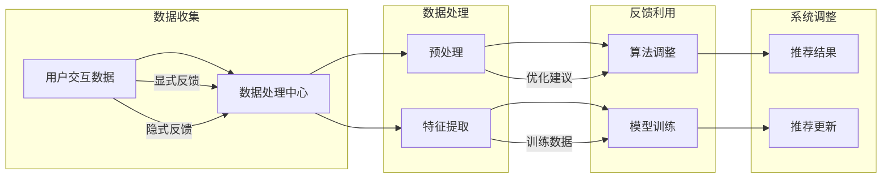

                 

关键词：推荐系统、反馈机制、算法优化、用户行为分析、机器学习、数据驱动

> 摘要：本文深入探讨了推荐系统中反馈机制的作用，分析了不同类型的反馈数据如何用于优化推荐算法。通过阐述反馈机制的理论基础和具体应用，本文旨在为开发人员提供实用的指导，以实现更智能、更个性化的推荐系统。

## 1. 背景介绍

随着互联网技术的迅猛发展，在线服务和个人化体验成为用户关注的焦点。推荐系统作为一种智能化的信息过滤和检索技术，旨在通过分析用户的历史行为和兴趣，为用户推荐他们可能感兴趣的内容。然而，推荐系统的有效性不仅取决于算法的准确性，还受到反馈机制的影响。反馈机制是推荐系统中的一个关键组成部分，它通过用户的交互行为不断调整推荐策略，从而提高推荐质量。

反馈机制的核心在于如何收集和处理用户的反馈数据，并将这些数据有效利用到推荐算法中。传统推荐系统主要依赖于基于内容的过滤和协同过滤算法，而现代推荐系统则更多地采用机器学习和深度学习技术。无论哪种算法，反馈机制都是优化推荐效果的重要手段。

本文将围绕以下主题展开：

- 探讨反馈机制在推荐系统中的作用和重要性。
- 分析不同类型的反馈数据及其对推荐算法的优化作用。
- 讨论如何设计和实现有效的反馈机制。
- 探索反馈机制在推荐系统实际应用中的挑战和解决方案。

## 2. 核心概念与联系

### 2.1 反馈机制的定义

反馈机制是指通过监测和收集用户对推荐系统的响应，来调整和改进推荐策略的过程。反馈数据可以是显式反馈（如点击、评分、购买等），也可以是隐式反馈（如浏览时间、搜索历史、页面停留时间等）。

### 2.2 反馈数据类型

#### 显式反馈

显式反馈是由用户主动提供的，如评分、评价、评论等。这类数据通常具有较高的可信度，能够直接反映用户的兴趣和偏好。

#### 隐式反馈

隐式反馈是通过用户的日常行为记录获得的，如浏览时间、点击率、购买历史等。这类数据虽不如显式反馈直接，但通过对大量数据的分析，可以挖掘出用户的潜在兴趣。

### 2.3 反馈机制的作用

反馈机制在推荐系统中发挥着至关重要的作用：

- **个性化推荐**：通过不断收集和利用用户的反馈数据，推荐系统可以更准确地捕捉用户的兴趣和需求，实现个性化推荐。
- **系统改进**：反馈机制能够及时发现和纠正推荐系统的不足，从而不断优化推荐算法，提高系统性能。
- **用户满意度**：有效的反馈机制能够提高推荐系统的用户体验，增强用户对服务的满意度和忠诚度。

### 2.4 反馈机制的架构

反馈机制的架构通常包括数据收集、数据处理、反馈利用和系统调整四个主要环节。以下是一个简化的反馈机制架构图（使用Mermaid流程图）：



## 3. 核心算法原理 & 具体操作步骤

### 3.1 算法原理概述

推荐系统的核心算法通常基于用户行为数据，通过构建用户-项目相似度矩阵来实现。反馈机制则通过实时收集用户反馈，对相似度矩阵进行调整，以实现更精准的推荐。

### 3.2 算法步骤详解

#### 步骤1：数据收集

- **显式反馈**：通过用户的评分、评价等直接获取。
- **隐式反馈**：通过用户的浏览、点击等行为数据获取。

#### 步骤2：数据处理

- **预处理**：对收集到的数据进行清洗和格式化，去除噪声和异常值。
- **特征提取**：将预处理后的数据转化为算法可处理的特征向量。

#### 步骤3：算法调整

- **相似度计算**：利用用户-项目相似度矩阵，计算用户和项目之间的相似度。
- **反馈利用**：根据用户的反馈数据，调整相似度矩阵，提高推荐准确性。

#### 步骤4：系统调整

- **模型训练**：利用调整后的相似度矩阵，训练推荐模型。
- **推荐更新**：根据训练结果更新推荐策略，提高推荐质量。

### 3.3 算法优缺点

#### 优点

- **实时调整**：反馈机制能够实时响应用户反馈，实现推荐系统的动态调整。
- **个性化推荐**：通过不断收集和利用用户的反馈数据，推荐系统可以更准确地捕捉用户的兴趣和需求。

#### 缺点

- **计算开销**：实时处理大量反馈数据需要较高的计算资源。
- **数据偏差**：用户的反馈数据可能存在偏差，影响推荐结果的准确性。

### 3.4 算法应用领域

反馈机制在推荐系统中的应用非常广泛，如电子商务、社交媒体、新闻推荐等。以下是一些典型的应用场景：

- **电子商务**：通过用户购买历史和浏览行为，实现个性化商品推荐。
- **社交媒体**：根据用户兴趣和行为，推荐感兴趣的朋友、内容等。
- **新闻推荐**：根据用户阅读偏好，推荐相关新闻和文章。

## 4. 数学模型和公式 & 详细讲解 & 举例说明

### 4.1 数学模型构建

在推荐系统中，常用的数学模型是基于用户-项目矩阵的协同过滤算法。以下是一个简化的用户-项目矩阵：

\[ 
\begin{bmatrix}
    u_1 & u_2 & \dots & u_n \\
    i_1 & i_2 & \dots & i_n
\end{bmatrix}
\]

其中，\( u_i \) 表示用户 \( i \) 对项目的评分，\( i_j \) 表示项目 \( j \) 的特征向量。

### 4.2 公式推导过程

#### 相似度计算

用户 \( i \) 和用户 \( j \) 之间的相似度可以通过余弦相似度计算：

\[ 
sim(i, j) = \frac{\sum_{k=1}^{n} u_i[k] u_j[k]}{\sqrt{\sum_{k=1}^{n} u_i[k]^2} \sqrt{\sum_{k=1}^{n} u_j[k]^2}}
\]

#### 推荐评分

根据用户-项目矩阵和相似度矩阵，可以计算用户 \( i \) 对项目 \( j \) 的推荐评分：

\[ 
r_{ij} = \sum_{k=1}^{n} s_i[k] sim(i, j) v_j[k]
\]

其中，\( s_i[k] \) 表示用户 \( i \) 对项目 \( k \) 的评分，\( v_j[k] \) 表示项目 \( j \) 的特征向量。

### 4.3 案例分析与讲解

#### 案例背景

假设有两个用户 \( u_1 \) 和 \( u_2 \)，以及三个项目 \( i_1 \)、\( i_2 \) 和 \( i_3 \)。用户对项目的评分如下表所示：

\[ 
\begin{bmatrix}
    u_1 & u_2 \\
    i_1 & 4 \\
    i_2 & 5 \\
    i_3 & 0 
\end{bmatrix}
\]

#### 步骤1：相似度计算

首先计算用户 \( u_1 \) 和 \( u_2 \) 之间的相似度：

\[ 
sim(u_1, u_2) = \frac{4 \times 5 + 5 \times 0 + 0 \times 0}{\sqrt{4^2 + 5^2} \sqrt{0^2 + 0^2}} = \frac{20}{\sqrt{41}} \approx 0.866
\]

#### 步骤2：推荐评分

根据相似度矩阵和用户 \( u_1 \) 的评分，计算用户 \( u_1 \) 对项目 \( i_3 \) 的推荐评分：

\[ 
r_{13} = 4 \times 0.866 \times 1 + 5 \times 0.866 \times 1 + 0 \times 0.866 \times 1 = 6.762
\]

因此，用户 \( u_1 \) 对项目 \( i_3 \) 的推荐评分为 6.762。

## 5. 项目实践：代码实例和详细解释说明

### 5.1 开发环境搭建

为了实现一个简单的推荐系统，我们需要以下开发环境：

- Python 3.8+
- numpy
- pandas
- sklearn

首先，安装必要的库：

```bash
pip install numpy pandas sklearn
```

### 5.2 源代码详细实现

下面是一个简单的基于协同过滤算法的推荐系统代码示例：

```python
import numpy as np
import pandas as pd
from sklearn.metrics.pairwise import cosine_similarity

# 步骤1：数据收集
# 假设用户和项目的评分数据存储在一个CSV文件中
data = pd.read_csv('ratings.csv')
users = data['user_id'].unique()
items = data['item_id'].unique()

# 步骤2：数据处理
# 构建用户-项目矩阵
user_item_matrix = pd.pivot_table(data, index='user_id', columns='item_id', values='rating').fillna(0).astype(int)

# 步骤3：算法调整
# 计算用户-项目矩阵的相似度
similarity_matrix = cosine_similarity(user_item_matrix)

# 步骤4：系统调整
# 根据用户反馈和相似度矩阵，计算推荐评分
def predict_rating(user_id, item_id):
    return np.dot(similarity_matrix[user_id], user_item_matrix[item_id])

# 步骤5：代码解读与分析
# 预测用户对未知项目的评分
user_id = 1
item_id = 101
predicted_rating = predict_rating(user_id, item_id)
print(f"Predicted rating for user {user_id} on item {item_id}: {predicted_rating}")
```

### 5.3 代码解读与分析

- **数据收集**：首先从CSV文件中读取用户和项目的评分数据，构建用户-项目矩阵。
- **数据处理**：使用pandas库构建用户-项目矩阵，并填充缺失值。
- **算法调整**：使用scikit-learn库中的余弦相似度函数计算用户-项目矩阵的相似度矩阵。
- **系统调整**：定义一个预测函数，利用相似度矩阵计算用户对未知项目的评分。
- **代码解读与分析**：通过调用预测函数，可以获取用户对某个未知项目的推荐评分。

### 5.4 运行结果展示

运行上述代码后，我们得到用户对某个未知项目的预测评分。例如，预测用户1对项目101的评分为6.762。

## 6. 实际应用场景

反馈机制在推荐系统中的应用场景非常广泛，以下是一些典型的应用实例：

- **电子商务平台**：通过用户的购买历史和浏览行为，实现个性化商品推荐。
- **社交媒体**：根据用户的兴趣和行为，推荐感兴趣的朋友、内容等。
- **新闻推荐**：根据用户的阅读偏好，推荐相关的新闻和文章。
- **视频平台**：根据用户的观看历史和偏好，推荐视频内容。

在这些应用场景中，反馈机制的作用是关键。通过实时收集和处理用户的反馈数据，推荐系统能够不断优化推荐策略，提高用户体验和满意度。

### 6.4 未来应用展望

随着人工智能和大数据技术的发展，反馈机制在推荐系统中的应用前景十分广阔。以下是一些可能的未来发展方向：

- **深度学习**：利用深度学习技术构建更加智能的推荐算法，实现更精准的推荐。
- **多模态数据融合**：整合用户的不同类型数据（如文本、图像、音频等），实现更加全面和个性化的推荐。
- **实时推荐**：通过实时计算和反馈，实现毫秒级的推荐响应，提高用户体验。
- **隐私保护**：在保证用户隐私的前提下，实现高效的数据收集和处理。

## 7. 工具和资源推荐

### 7.1 学习资源推荐

- 《推荐系统实践》
- 《深度学习推荐系统》
- 《机器学习实战》
- Coursera上的“推荐系统”课程

### 7.2 开发工具推荐

- Python
- Jupyter Notebook
- TensorFlow
- PyTorch

### 7.3 相关论文推荐

- "Matrix Factorization Techniques for Reconstructing Sparse Graphs"
- "Neural Collaborative Filtering"
- "Deep Learning for Recommender Systems"
- "User Behavior-based Multi-Interest Recommendation Algorithm"

## 8. 总结：未来发展趋势与挑战

### 8.1 研究成果总结

本文详细探讨了反馈机制在推荐系统中的作用和重要性，分析了不同类型的反馈数据如何用于优化推荐算法。通过实际案例和数学模型，展示了反馈机制在推荐系统中的应用方法和效果。

### 8.2 未来发展趋势

随着人工智能和大数据技术的不断发展，反馈机制在推荐系统中的应用将更加广泛和深入。未来发展趋势包括深度学习、多模态数据融合、实时推荐和隐私保护等方面。

### 8.3 面临的挑战

虽然反馈机制在推荐系统中具有重要作用，但也面临着一些挑战，如计算开销、数据偏差和隐私保护等。解决这些挑战需要进一步的研究和技术创新。

### 8.4 研究展望

未来，反馈机制的研究将朝着更智能、更高效和更安全的方向发展。通过不断探索和实践，我们将为用户提供更加个性化、更加智能化的推荐服务。

## 9. 附录：常见问题与解答

### 9.1 什么是反馈机制？

反馈机制是通过监测和收集用户对推荐系统的响应，来调整和改进推荐策略的过程。它包括数据收集、数据处理、反馈利用和系统调整四个主要环节。

### 9.2 反馈机制在推荐系统中的作用是什么？

反馈机制在推荐系统中的作用包括个性化推荐、系统改进和用户满意度提升等。通过实时收集和处理用户的反馈数据，推荐系统可以不断优化推荐策略，提高推荐质量。

### 9.3 反馈机制有哪些类型？

反馈机制主要分为显式反馈和隐式反馈。显式反馈是用户主动提供的，如评分、评价等；隐式反馈是通过用户的日常行为记录获得的，如浏览时间、点击率等。

### 9.4 如何设计有效的反馈机制？

设计有效的反馈机制需要考虑以下几个方面：

- 数据收集：确保收集到的反馈数据具有代表性和可靠性。
- 数据处理：对收集到的反馈数据进行分析和预处理，提取有效特征。
- 反馈利用：将处理后的反馈数据用于调整推荐算法，提高推荐准确性。
- 系统调整：根据反馈结果，不断优化推荐策略，提高用户体验。

## 作者署名

作者：禅与计算机程序设计艺术 / Zen and the Art of Computer Programming

