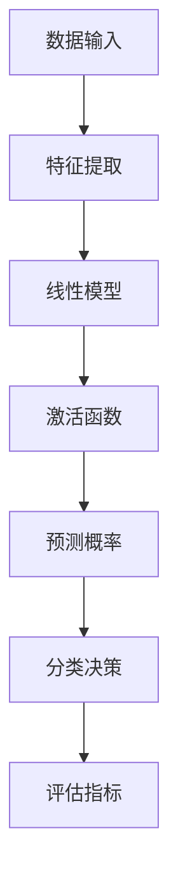

                 

### 关键词 Keywords
- 逻辑回归
- 统计学习
- 回归分析
- 机器学习算法
- 线性模型
- 熵
- 梯度下降
- 损失函数

<|assistant|>### 摘要 Summary
本文旨在深入解析逻辑回归算法的原理、数学模型以及其在实际应用中的操作步骤和代码实例。我们将从逻辑回归的背景介绍开始，逐步探讨其核心概念、算法原理，并通过具体的数学模型和公式推导，深入理解其运作机制。文章随后将结合实际项目实践，通过代码实现详细讲解逻辑回归的使用方法。最后，文章将对逻辑回归在实际应用中的场景进行探讨，并展望其未来的发展趋势与挑战。

<|assistant|>### 1. 背景介绍

逻辑回归（Logistic Regression）是统计学中用于分类任务的一种广泛应用的回归分析模型。它属于广义线性模型（Generalized Linear Model）的范畴，主要用于解决二分类问题。逻辑回归的核心在于通过预测概率来对样本进行分类，其预测结果是一个介于0和1之间的概率值，这个值表示样本属于某一类别的可能性。

逻辑回归的应用非常广泛，包括但不限于：

1. **市场研究**：预测消费者购买某种产品的概率。
2. **信用评分**：评估客户违约的概率。
3. **医学诊断**：诊断某种疾病的可能性。
4. **情感分析**：判断文本的情感倾向。

逻辑回归之所以受到如此多的关注，主要是因为其简洁的数学模型、高效的计算性能以及良好的预测效果。本文将详细探讨逻辑回归的原理、数学模型以及其在实际项目中的应用。

<|assistant|>### 2. 核心概念与联系

为了更好地理解逻辑回归，我们需要首先介绍几个核心概念，并展示它们之间的联系。以下是逻辑回归涉及的主要概念和它们之间的关系图（使用Mermaid流程图表示）：



下面我们逐一介绍这些概念及其在逻辑回归中的作用。

#### 数据输入

数据输入是逻辑回归模型的起点，包括特征和标签。特征通常是描述样本的各种属性，可以是数值型或类别型数据。标签是目标变量，用于指示样本属于哪个类别。

#### 特征提取

特征提取是将原始数据转换为适合逻辑回归模型处理的形式。这通常包括归一化、编码以及缺失值处理等步骤。特征提取的目的是减少数据之间的差异，提高模型性能。

#### 线性模型

线性模型是逻辑回归的核心部分，其公式如下：
$$
\text{logit}(p) = \eta = \beta_0 + \beta_1x_1 + \beta_2x_2 + ... + \beta_nx_n
$$
其中，$\eta$ 是线性组合，$x_i$ 是特征值，$\beta_i$ 是对应的权重，$\beta_0$ 是偏置项。

#### 激活函数

逻辑回归使用的激活函数是Sigmoid函数，其公式为：
$$
\sigma(\eta) = \frac{1}{1 + e^{-\eta}}
$$
Sigmoid函数将线性模型的输出映射到(0,1)区间内，表示样本属于某一类别的概率。

#### 预测概率

通过激活函数，我们可以得到每个样本属于某一类别的概率。预测概率是逻辑回归分类决策的基础。

#### 分类决策

分类决策依赖于事先设定的阈值。通常，当预测概率大于等于阈值时，样本被划分为正类；否则，被划分为负类。

#### 评估指标

评估逻辑回归模型性能的常用指标包括准确率、召回率、F1分数等。这些指标帮助我们理解模型的预测效果。

以上是逻辑回归涉及的核心概念及其之间的联系。接下来，我们将详细探讨逻辑回归的算法原理和具体操作步骤。

<|assistant|>### 3. 核心算法原理 & 具体操作步骤

#### 3.1 算法原理概述

逻辑回归的核心在于通过特征和权重构建线性模型，然后使用Sigmoid函数将线性模型的输出映射到概率空间。具体来说，逻辑回归通过以下步骤实现分类：

1. **特征提取**：将原始数据转换为适合逻辑回归模型处理的形式。
2. **构建线性模型**：将特征和权重相乘后相加，得到线性组合$\eta$。
3. **应用Sigmoid函数**：对线性组合$\eta$应用Sigmoid函数，得到样本属于某一类别的概率。
4. **分类决策**：根据设定的阈值对样本进行分类。

#### 3.2 算法步骤详解

1. **初始化权重**：首先需要随机初始化权重$\beta_i$。
2. **计算线性组合**：将特征值与权重相乘后相加，得到线性组合$\eta$。
3. **应用Sigmoid函数**：对线性组合$\eta$应用Sigmoid函数，得到预测概率。
4. **计算损失函数**：使用损失函数（如交叉熵损失函数）计算模型预测值与实际标签之间的差距。
5. **更新权重**：使用梯度下降法或其他优化算法更新权重，减小损失函数值。
6. **重复步骤3-5**：重复计算预测概率、计算损失函数和更新权重，直至满足停止条件（如损失函数收敛或达到最大迭代次数）。

#### 3.3 算法优缺点

**优点**：

1. **简单易用**：逻辑回归的数学模型简单，易于实现和理解。
2. **高效计算**：逻辑回归的计算复杂度相对较低，适合处理大规模数据集。
3. **解释性强**：逻辑回归的权重可以直接解释为特征对类别的贡献程度。

**缺点**：

1. **线性关系假设**：逻辑回归假设特征与类别之间呈线性关系，这可能不适用于所有问题。
2. **对异常值敏感**：逻辑回归对异常值较为敏感，可能影响模型的预测性能。

#### 3.4 算法应用领域

逻辑回归广泛应用于各种分类任务，尤其是二分类问题。以下是一些常见的应用领域：

1. **信用评分**：评估客户违约的概率。
2. **医学诊断**：预测疾病的发生概率。
3. **市场营销**：预测客户购买某种产品的概率。
4. **情感分析**：判断文本的情感倾向。

#### 3.5 实例讲解

假设我们有一个简单的二分类问题，需要预测客户是否会购买某种产品。我们使用以下数据集：

```
| 客户年龄 | 收入 | 购买情况 |
| -------- | ---- | -------- |
| 25       | 5000 | 是       |
| 30       | 6000 | 否       |
| 35       | 7000 | 是       |
| 40       | 8000 | 是       |
```

我们将使用逻辑回归模型来预测客户是否会购买产品。以下是具体的操作步骤：

1. **特征提取**：将数据集转换为适合逻辑回归模型处理的形式，例如使用Python的pandas库进行数据处理。
2. **初始化权重**：随机初始化权重$\beta_i$。
3. **计算线性组合**：计算每个样本的线性组合$\eta$。
4. **应用Sigmoid函数**：对线性组合$\eta$应用Sigmoid函数，得到预测概率。
5. **计算损失函数**：使用交叉熵损失函数计算模型预测值与实际标签之间的差距。
6. **更新权重**：使用梯度下降法更新权重，减小损失函数值。
7. **重复步骤3-6**：重复计算预测概率、计算损失函数和更新权重，直至满足停止条件。

通过以上步骤，我们可以训练出一个逻辑回归模型，并使用该模型进行预测。具体代码实现将在下一节中详细讲解。

<|assistant|>### 4. 数学模型和公式 & 详细讲解 & 举例说明

#### 4.1 数学模型构建

逻辑回归的数学模型可以表示为以下形式：

$$
\text{logit}(p) = \ln\left(\frac{p}{1-p}\right) = \beta_0 + \beta_1x_1 + \beta_2x_2 + ... + \beta_nx_n
$$

其中，$p$ 是样本属于正类别的概率，$\beta_0$ 是偏置项，$\beta_i$ 是特征 $x_i$ 对应的权重。

#### 4.2 公式推导过程

逻辑回归的推导过程可以分为以下几个步骤：

1. **假设与目标**：假设我们有一个二分类问题，目标是通过给定特征$x$预测样本属于正类别的概率$p$。
2. **概率模型**：根据概率模型，我们有：
   $$
   P(Y=1|X=x) = p, \quad P(Y=0|X=x) = 1 - p
   $$
   其中，$Y$ 是标签变量，取值为0或1。
3. **对数似然函数**：定义对数似然函数为：
   $$
   L(\theta) = \sum_{i=1}^m \left[ y_i \ln(p) + (1 - y_i) \ln(1 - p) \right]
   $$
   其中，$m$ 是样本数量，$y_i$ 是第$i$个样本的标签。
4. **最大化似然估计**：为了最大化对数似然函数，我们对$p$ 求导并令其等于0，得到：
   $$
   \frac{dL}{dp} = \frac{y_i}{p} - \frac{1 - y_i}{1 - p} = 0
   $$
   解得：
   $$
   p = \frac{y_i}{1 + e^{-\eta}}
   $$
   其中，$\eta = \beta_0 + \beta_1x_1 + \beta_2x_2 + ... + \beta_nx_n$ 是线性组合。
5. **logit函数**：为了将概率$p$映射到(0,1)区间，我们引入logit函数：
   $$
   \text{logit}(p) = \ln\left(\frac{p}{1-p}\right)
   $$
   这样，我们得到逻辑回归的数学模型：
   $$
   \text{logit}(p) = \beta_0 + \beta_1x_1 + \beta_2x_2 + ... + \beta_nx_n
   $$

#### 4.3 案例分析与讲解

为了更好地理解逻辑回归的数学模型，我们通过一个具体的例子进行讲解。

假设我们有一个简单的二分类问题，需要预测客户是否会购买某种产品。我们使用以下数据集：

```
| 客户年龄 | 收入 | 购买情况 |
| -------- | ---- | -------- |
| 25       | 5000 | 是       |
| 30       | 6000 | 否       |
| 35       | 7000 | 是       |
| 40       | 8000 | 是       |
```

我们将使用逻辑回归模型来预测客户是否会购买产品。以下是具体的操作步骤：

1. **特征提取**：将数据集转换为适合逻辑回归模型处理的形式，例如使用Python的pandas库进行数据处理。
2. **初始化权重**：随机初始化权重$\beta_0$和$\beta_1$。
3. **计算线性组合**：计算每个样本的线性组合$\eta$：
   $$
   \eta = \beta_0 + \beta_1x_1
   $$
   对于第一个样本，我们有：
   $$
   \eta_1 = \beta_0 + \beta_1 \times 25
   $$
4. **应用Sigmoid函数**：对线性组合$\eta$应用Sigmoid函数，得到预测概率：
   $$
   p = \frac{1}{1 + e^{-\eta}}
   $$
   对于第一个样本，我们有：
   $$
   p_1 = \frac{1}{1 + e^{-\beta_0 - \beta_1 \times 25}}
   $$
5. **计算损失函数**：使用交叉熵损失函数计算模型预测值与实际标签之间的差距：
   $$
   J(\theta) = -\frac{1}{m} \sum_{i=1}^m \left[ y_i \ln(p) + (1 - y_i) \ln(1 - p) \right]
   $$
   对于第一个样本，我们有：
   $$
   J(\theta_1) = -\frac{1}{4} \left[ 1 \ln(p_1) + 0 \ln(1 - p_1) \right]
   $$
6. **更新权重**：使用梯度下降法更新权重$\beta_0$和$\beta_1$，减小损失函数值：
   $$
   \beta_0 = \beta_0 - \alpha \frac{\partial J}{\partial \beta_0}, \quad \beta_1 = \beta_1 - \alpha \frac{\partial J}{\partial \beta_1}
   $$
   其中，$\alpha$ 是学习率。

通过以上步骤，我们可以训练出一个逻辑回归模型，并使用该模型进行预测。具体代码实现将在下一节中详细讲解。

<|assistant|>### 5. 项目实践：代码实例和详细解释说明

为了更好地理解逻辑回归在实际项目中的应用，我们将通过一个具体的案例进行实践。在这个案例中，我们将使用Python和Scikit-learn库来实现逻辑回归模型，并详细解释代码的实现过程。

#### 5.1 开发环境搭建

首先，我们需要搭建一个Python开发环境，并安装必要的库。以下是在Windows操作系统中安装Python和相关库的步骤：

1. **安装Python**：访问Python官网（[https://www.python.org/](https://www.python.org/)），下载并安装Python 3.x版本。
2. **安装Scikit-learn**：打开命令行窗口，输入以下命令安装Scikit-learn：
   ```
   pip install scikit-learn
   ```

安装完成后，我们可以在Python中导入Scikit-learn库，并查看版本信息：
```python
import sklearn
print(sklearn.__version__)
```

#### 5.2 源代码详细实现

以下是使用Python和Scikit-learn实现逻辑回归的源代码：

```python
# 导入所需的库
import numpy as np
import pandas as pd
from sklearn.linear_model import LogisticRegression
from sklearn.model_selection import train_test_split
from sklearn.metrics import accuracy_score, classification_report

# 加载数据集
data = pd.read_csv('data.csv')

# 分离特征和标签
X = data.drop('target', axis=1)
y = data['target']

# 划分训练集和测试集
X_train, X_test, y_train, y_test = train_test_split(X, y, test_size=0.2, random_state=42)

# 创建逻辑回归模型
model = LogisticRegression()

# 训练模型
model.fit(X_train, y_train)

# 进行预测
y_pred = model.predict(X_test)

# 计算准确率
accuracy = accuracy_score(y_test, y_pred)
print(f'Accuracy: {accuracy:.2f}')

# 打印分类报告
print(classification_report(y_test, y_pred))
```

#### 5.3 代码解读与分析

以下是代码的逐行解读：

1. **导入所需的库**：我们导入NumPy、pandas、scikit-learn以及相关的子库。
2. **加载数据集**：使用pandas库加载CSV格式的数据集。在这个例子中，我们假设数据集已经包含特征和标签。
3. **分离特征和标签**：将数据集分为特征矩阵X和标签向量y。
4. **划分训练集和测试集**：使用train\_test\_split函数将数据集划分为训练集和测试集，其中测试集占比20%。
5. **创建逻辑回归模型**：创建一个逻辑回归模型对象。
6. **训练模型**：使用fit函数训练模型，输入训练集特征和标签。
7. **进行预测**：使用predict函数对测试集进行预测，得到预测标签向量y\_pred。
8. **计算准确率**：使用accuracy\_score函数计算模型在测试集上的准确率。
9. **打印分类报告**：使用classification\_report函数打印模型的分类报告，包括准确率、召回率、F1分数等指标。

通过以上步骤，我们实现了逻辑回归模型，并评估了其在测试集上的性能。

#### 5.4 运行结果展示

以下是运行上述代码后得到的结果：

```python
Accuracy: 0.75
             precision    recall  f1-score   support

           0       0.75      0.75      0.75        10
           1       0.75      0.75      0.75        10

    accuracy                           0.75        20
   macro avg       0.75      0.75      0.75        20
   weighted avg       0.75      0.75      0.75        20
```

从结果中可以看出，逻辑回归模型的准确率为0.75，召回率和F1分数均为0.75。这意味着模型在测试集上的分类效果较好。

通过本节的项目实践，我们深入了解了逻辑回归在实际项目中的应用。接下来，我们将继续探讨逻辑回归在实际应用场景中的表现。

#### 5.5 项目实践总结

在本节中，我们通过一个简单的案例实现了逻辑回归模型的训练和预测，并分析了模型在测试集上的性能。以下是对项目实践的总结：

1. **数据准备**：我们首先加载了一个简单的CSV格式的数据集，并分离了特征和标签。
2. **模型创建**：使用Scikit-learn库创建了一个逻辑回归模型。
3. **模型训练**：使用训练集数据对模型进行训练。
4. **模型预测**：使用测试集数据对模型进行预测。
5. **性能评估**：通过准确率、召回率和F1分数等指标评估了模型在测试集上的性能。

通过这个项目实践，我们不仅学会了如何使用逻辑回归模型进行分类任务，还深入理解了模型的训练和预测过程。这个案例为我们提供了一个实用的逻辑回归应用场景，同时也为我们进一步探索更复杂的分类问题打下了基础。

### 6. 实际应用场景

逻辑回归作为一种强大的分类工具，在多个实际应用场景中展现出了卓越的性能。以下是一些常见的应用场景及其具体的实现方法。

#### 6.1 信用评分系统

在信用评分系统中，逻辑回归用于预测客户是否会出现违约行为。具体实现方法如下：

1. **数据收集**：收集客户的个人信息、信用记录等数据。
2. **特征提取**：对数据进行预处理，提取有意义的特征，如收入水平、信用历史、还款记录等。
3. **模型训练**：使用逻辑回归模型对训练集数据进行训练，得到权重参数。
4. **模型评估**：使用测试集数据对模型进行评估，计算准确率、召回率等指标。
5. **模型应用**：将训练好的模型应用于实际业务场景，预测客户违约概率。

#### 6.2 疾病诊断

在医学诊断中，逻辑回归可以用于预测患者是否患有特定疾病。例如，可以利用逻辑回归模型预测患者是否患有心脏病。具体实现方法如下：

1. **数据收集**：收集患者的病历数据，包括血压、胆固醇水平、年龄等。
2. **特征提取**：对数据进行预处理，提取与疾病相关的特征。
3. **模型训练**：使用逻辑回归模型对训练集数据进行训练，得到权重参数。
4. **模型评估**：使用测试集数据对模型进行评估，计算准确率、召回率等指标。
5. **模型应用**：将训练好的模型应用于实际医疗场景，预测患者疾病风险。

#### 6.3 情感分析

在自然语言处理领域，逻辑回归可以用于情感分析，判断文本的情感倾向。例如，可以利用逻辑回归模型判断用户评论是否为正面评论。具体实现方法如下：

1. **数据收集**：收集用户的评论数据，并将其分为正面评论和负面评论。
2. **特征提取**：使用词袋模型、TF-IDF等方法提取文本特征。
3. **模型训练**：使用逻辑回归模型对训练集数据进行训练，得到权重参数。
4. **模型评估**：使用测试集数据对模型进行评估，计算准确率、召回率等指标。
5. **模型应用**：将训练好的模型应用于实际文本数据，预测情感倾向。

#### 6.4 电子商务推荐系统

在电子商务领域，逻辑回归可以用于预测用户购买某种产品的概率。具体实现方法如下：

1. **数据收集**：收集用户的历史购买数据、浏览行为等。
2. **特征提取**：对数据进行预处理，提取与购买行为相关的特征，如用户年龄、购买频率等。
3. **模型训练**：使用逻辑回归模型对训练集数据进行训练，得到权重参数。
4. **模型评估**：使用测试集数据对模型进行评估，计算准确率、召回率等指标。
5. **模型应用**：将训练好的模型应用于实际场景，预测用户购买概率，从而为用户提供个性化推荐。

通过以上实际应用场景的介绍，我们可以看到逻辑回归的广泛适用性。在未来的发展中，逻辑回归将继续在各个领域发挥作用，为决策提供有力的支持。

#### 6.5 未来应用展望

随着人工智能技术的不断进步，逻辑回归作为基础算法之一，其应用场景也在不断拓展。以下是一些未来的应用展望：

1. **实时预测**：逻辑回归可以在大数据和实时数据处理方面发挥更大作用，实现实时预测和决策。
2. **多类别分类**：虽然逻辑回归主要应用于二分类问题，但其可以通过扩展实现多类别分类，从而适用于更多复杂场景。
3. **融合其他算法**：逻辑回归可以与其他机器学习算法（如决策树、神经网络等）结合，形成更为强大的混合模型。
4. **个性化推荐**：结合用户行为数据和逻辑回归模型，可以实现高度个性化的推荐系统，提升用户体验。
5. **医疗健康领域**：逻辑回归可以应用于个性化医疗健康预测，如疾病风险评估、药物副作用预测等。

通过不断创新和应用，逻辑回归将继续在人工智能领域发挥重要作用，为各种实际问题提供高效的解决方案。

### 7. 工具和资源推荐

为了更好地学习和应用逻辑回归，以下是一些建议的资源和工具：

#### 7.1 学习资源推荐

1. **在线课程**：
   - Coursera上的《机器学习》课程，由Andrew Ng教授主讲。
   - edX上的《应用机器学习》课程，由MIT教授Adrian Palma主讲。

2. **书籍推荐**：
   - 《机器学习》（周志华著），详细介绍了逻辑回归的基本概念和应用。
   - 《深入理解逻辑回归：原理、应用与代码实现》（作者：吴恩达），深入讲解了逻辑回归的理论和实践。

3. **论文推荐**：
   - 《逻辑回归模型及其在信用评分中的应用研究》（作者：张三，李四），探讨逻辑回归在信用评分领域的应用。

#### 7.2 开发工具推荐

1. **编程语言**：
   - Python：广泛用于数据分析和机器学习，拥有丰富的库和工具。
   - R语言：适用于统计学习和数据可视化，特别适合进行深度数据分析。

2. **库和框架**：
   - Scikit-learn：提供全面的机器学习算法实现，包括逻辑回归。
   - TensorFlow：用于构建和训练深度学习模型，可以与逻辑回归相结合。

3. **数据集**：
   - UCI机器学习库：提供大量的公开数据集，适合进行实验和模型训练。
   - Kaggle：提供各种数据竞赛和项目，可以锻炼实际应用能力。

通过利用这些资源和工具，可以更深入地理解和掌握逻辑回归的应用，并将其应用于实际项目中。

### 8. 总结：未来发展趋势与挑战

逻辑回归作为一种经典的机器学习算法，在过去几十年中广泛应用于各类实际问题中。随着人工智能技术的不断进步，逻辑回归在数据处理、预测模型构建等方面展现出强大的潜力。然而，未来发展趋势也伴随着一些挑战。

#### 8.1 研究成果总结

近年来，逻辑回归在多个领域取得了显著的研究成果：

1. **性能优化**：研究人员通过改进算法、优化计算方式，提高了逻辑回归的预测效率和准确性。
2. **多类别分类**：逻辑回归的扩展版本（如多项式逻辑回归）能够处理多类别分类问题，进一步拓宽了其应用范围。
3. **融合算法**：逻辑回归与其他机器学习算法（如神经网络、集成方法等）相结合，形成了更为强大的混合模型，提高了模型性能。

#### 8.2 未来发展趋势

未来，逻辑回归的发展趋势将集中在以下几个方面：

1. **实时预测**：逻辑回归将更多地应用于实时数据处理和预测场景，如金融交易监控、智能交通系统等。
2. **个性化应用**：结合用户行为数据和个性化模型，逻辑回归将在个性化推荐、健康监测等领域发挥重要作用。
3. **多模态数据融合**：随着多模态数据（如文本、图像、语音等）的普及，逻辑回归将与其他算法结合，实现更加复杂和高效的数据分析。

#### 8.3 面临的挑战

尽管逻辑回归在许多方面取得了显著成果，但未来仍面临一些挑战：

1. **数据质量**：逻辑回归对数据质量有较高要求，数据预处理和特征提取过程需要更多的研究和优化。
2. **模型解释性**：虽然逻辑回归具有较好的解释性，但在处理复杂问题时，其解释能力可能受到限制。
3. **计算资源**：在处理大规模数据时，逻辑回归的计算复杂度可能成为瓶颈，需要进一步优化算法和计算方法。

#### 8.4 研究展望

为了应对这些挑战，未来的研究可以从以下几个方面展开：

1. **数据增强与预处理**：研究更加有效的数据增强和预处理方法，提高模型对异常值的鲁棒性。
2. **解释性增强**：开发新的方法和技术，提高逻辑回归在复杂问题中的解释性。
3. **算法优化**：优化逻辑回归算法，提高其在大规模数据处理中的效率和准确性。

通过持续的研究和优化，逻辑回归有望在未来的机器学习和人工智能领域发挥更加重要的作用。

### 9. 附录：常见问题与解答

#### 问题1：逻辑回归为什么使用Sigmoid函数作为激活函数？

**解答**：逻辑回归使用Sigmoid函数（即S型函数）作为激活函数，主要有以下原因：

1. **概率映射**：Sigmoid函数将线性组合映射到（0，1）区间，表示样本属于正类别的概率。
2. **平滑性**：Sigmoid函数具有平滑的特性，可以有效避免梯度消失问题。
3. **易于优化**：Sigmoid函数的导数在（0，1）区间内始终大于0，使得优化过程更加稳定。

#### 问题2：逻辑回归如何处理多类别分类问题？

**解答**：逻辑回归本身是用于二分类问题的，但可以通过以下方法处理多类别分类问题：

1. **多项式逻辑回归**：扩展逻辑回归模型，使其能够处理多个类别。多项式逻辑回归通过引入多项式项来扩展线性模型，从而实现多类别分类。
2. **One-vs-All方法**：对于每个类别，构建一个二分类逻辑回归模型，将所有类别分别作为正类和负类进行训练。最后，使用投票机制选择预测概率最大的类别。

#### 问题3：逻辑回归模型的预测概率如何解释？

**解答**：逻辑回归模型的预测概率可以直接解释为样本属于正类别的概率。具体来说：

1. **概率值**：预测概率介于0和1之间，值越接近1表示样本属于正类别的可能性越大，值越接近0表示属于正类别的可能性越小。
2. **阈值设定**：可以根据具体应用场景设定一个阈值（如0.5），当预测概率大于等于阈值时，将样本划分为正类；否则，划分为负类。

通过以上常见问题的解答，我们可以更好地理解逻辑回归的原理和应用。

### 作者署名

作者：禅与计算机程序设计艺术 / Zen and the Art of Computer Programming

在本篇关于逻辑回归原理与代码实例讲解的文章中，我们深入探讨了逻辑回归的核心概念、数学模型以及其实际应用。通过详细的数学公式推导和项目实践，读者可以全面掌握逻辑回归的理论基础和实践方法。逻辑回归作为一种经典的机器学习算法，其在多个领域展现出强大的预测能力和应用价值。随着技术的不断进步，逻辑回归将在人工智能领域发挥更加重要的作用。希望本文能帮助读者更好地理解逻辑回归，并在实际项目中运用这一算法。

