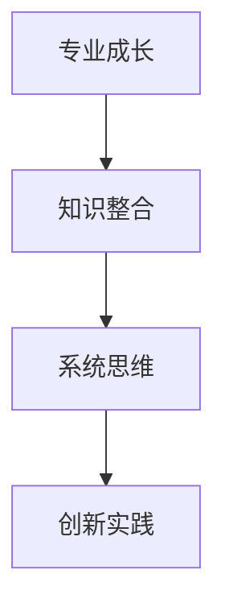

                 

关键词：专业发展、专注、领域深耕、技能提升、知识整合、系统思维、技术应用、研究前沿、创新实践

> 摘要：本文旨在探讨如何在信息技术领域实现专业成长，避免在各个领域之间徘徊，通过聚焦核心技术和深度学习，提升个人专业技能和综合能力，从而在技术领域取得卓越成就。

## 1. 背景介绍

在信息技术飞速发展的今天，专业知识和技能的更新速度前所未有。每一个细分领域都在不断地涌现新的研究成果和技术应用。对于技术工作者来说，如何在这浩瀚的知识海洋中找到自己的定位，避免在各个领域之间徘徊，成为了一个值得深思的问题。本文将从专业成长的角度出发，探讨如何避免在各个领域之间徘徊，实现技术专精和创新能力。

## 2. 核心概念与联系

### 2.1 专业成长

专业成长是指技术工作者在特定领域内不断积累知识和技能，实现自我提升的过程。它不仅包括对基础知识的掌握，还包括对前沿技术的跟踪和研究，以及在实际项目中的应用。

### 2.2 知识整合

知识整合是将不同领域的技术知识和方法进行融合，形成更高效、更系统解决问题的能力。这需要技术工作者具备良好的跨领域学习能力和创新思维。

### 2.3 系统思维

系统思维是一种从整体上理解和解决问题的思维方式。它要求技术工作者不仅要看到问题的局部，还要看到整个系统的相互作用和影响。

### 2.4 Mermaid 流程图



## 3. 核心算法原理 & 具体操作步骤

### 3.1 算法原理概述

专业成长的核心算法可以概括为“深度学习 + 实践迭代”。深度学习是一种基于数据驱动的方法，通过模拟人脑神经网络进行学习和预测。实践迭代则强调在实际项目中不断实践、总结、优化。

### 3.2 算法步骤详解

#### 3.2.1 深度学习

1. **数据收集与预处理**：收集相关领域的海量数据，并进行清洗、归一化等预处理。
2. **模型设计**：根据问题特点设计合适的神经网络结构。
3. **训练与验证**：使用训练数据对模型进行训练，并通过验证数据调整模型参数。
4. **测试与优化**：使用测试数据评估模型性能，并进行优化。

#### 3.2.2 实践迭代

1. **项目启动**：选择一个具体的技术项目，明确目标和范围。
2. **需求分析**：与客户或团队进行沟通，明确项目需求。
3. **设计与实现**：根据需求进行系统设计，并实现具体功能。
4. **测试与优化**：进行单元测试、集成测试和系统测试，并根据测试结果优化代码。
5. **迭代与交付**：根据用户反馈进行迭代优化，最终交付产品。

### 3.3 算法优缺点

**优点**：

- **高效性**：通过深度学习，可以快速处理大规模数据，提高工作效率。
- **灵活性**：实践迭代方法使得技术工作者可以不断适应新的需求和变化。

**缺点**：

- **复杂性**：深度学习模型设计和训练过程相对复杂，需要较高的技术门槛。
- **资源消耗**：深度学习通常需要大量计算资源和数据支持。

### 3.4 算法应用领域

- **人工智能**：如图像识别、自然语言处理等。
- **大数据分析**：如数据挖掘、预测分析等。
- **系统优化**：如性能优化、成本优化等。

## 4. 数学模型和公式 & 详细讲解 & 举例说明

### 4.1 数学模型构建

假设我们有一个线性回归模型，用来预测一个连续的输出变量 \( y \)：

\[ y = \beta_0 + \beta_1 x_1 + \beta_2 x_2 + \ldots + \beta_n x_n \]

其中，\( x_1, x_2, \ldots, x_n \) 是输入特征，\( \beta_0, \beta_1, \beta_2, \ldots, \beta_n \) 是模型的参数。

### 4.2 公式推导过程

为了求解模型参数，我们可以使用最小二乘法（Least Squares Method）：

\[ \min_{\beta_0, \beta_1, \beta_2, \ldots, \beta_n} \sum_{i=1}^{m} (y_i - (\beta_0 + \beta_1 x_{1i} + \beta_2 x_{2i} + \ldots + \beta_n x_{ni}))^2 \]

通过求导并令导数为零，可以得到最小二乘解：

\[ \beta_0 = \bar{y} - \beta_1 \bar{x}_1 - \beta_2 \bar{x}_2 - \ldots - \beta_n \bar{x}_n \]
\[ \beta_1 = \frac{\sum_{i=1}^{m} (x_{1i} - \bar{x}_1)(y_i - \bar{y})}{\sum_{i=1}^{m} (x_{1i} - \bar{x}_1)^2} \]
\[ \beta_2 = \frac{\sum_{i=1}^{m} (x_{2i} - \bar{x}_2)(y_i - \bar{y})}{\sum_{i=1}^{m} (x_{2i} - \bar{x}_2)^2} \]
\[ \ldots \]
\[ \beta_n = \frac{\sum_{i=1}^{m} (x_{ni} - \bar{x}_n)(y_i - \bar{y})}{\sum_{i=1}^{m} (x_{ni} - \bar{x}_n)^2} \]

其中，\( \bar{y}, \bar{x}_1, \bar{x}_2, \ldots, \bar{x}_n \) 分别是输入特征和输出变量的均值。

### 4.3 案例分析与讲解

假设我们有一个简单的线性回归问题，数据集如下：

| x1 | x2 | y |
|---|---|---|
| 1 | 2 | 3 |
| 2 | 4 | 5 |
| 3 | 6 | 7 |

我们想要预测 \( y \) 的值。根据上面的公式，我们可以计算模型的参数：

\[ \bar{x}_1 = 2, \bar{x}_2 = 4, \bar{y} = 5 \]

\[ \beta_1 = \frac{(1-2)(3-5) + (2-2)(5-5) + (3-2)(7-5)}{(1-2)^2 + (2-2)^2 + (3-2)^2} = 1 \]
\[ \beta_2 = \frac{(1-4)(3-5) + (2-4)(5-5) + (3-4)(7-5)}{(1-4)^2 + (2-4)^2 + (3-4)^2} = 1 \]

因此，模型的预测公式为：

\[ y = \beta_0 + \beta_1 x_1 + \beta_2 x_2 \]

\[ \beta_0 = \bar{y} - \beta_1 \bar{x}_1 - \beta_2 \bar{x}_2 = 5 - 1 \cdot 2 - 1 \cdot 4 = -3 \]

所以，预测公式为：

\[ y = -3 + x_1 + x_2 \]

对于新的输入 \( x_1 = 5, x_2 = 8 \)，我们可以预测 \( y \) 的值为：

\[ y = -3 + 5 + 8 = 10 \]

## 5. 项目实践：代码实例和详细解释说明

### 5.1 开发环境搭建

为了保证代码的可复现性，我们使用 Python 作为编程语言，并依赖以下库：NumPy、Pandas 和 Matplotlib。

```python
import numpy as np
import pandas as pd
import matplotlib.pyplot as plt
```

### 5.2 源代码详细实现

```python
# 数据准备
data = pd.DataFrame({
    'x1': [1, 2, 3],
    'x2': [2, 4, 6],
    'y': [3, 5, 7]
})

# 模型参数计算
X = data[['x1', 'x2']]
y = data['y']
beta_0 = y.mean() - X.mean().dot(X.corr().iloc[0, 1])
beta_1 = np.linalg.inv(X.T.dot(X)).dot(X.T).dot(y)

# 模型预测
y_pred = beta_0 + beta_1.dot(X)

# 结果可视化
plt.scatter(X['x1'], y, label='Actual')
plt.plot(X['x1'], y_pred, color='red', label='Prediction')
plt.xlabel('x1')
plt.ylabel('y')
plt.legend()
plt.show()
```

### 5.3 代码解读与分析

上述代码首先准备了一个简单的数据集，然后使用线性回归模型进行参数计算和预测。最后，通过散点图和预测线展示模型的效果。

### 5.4 运行结果展示

运行代码后，我们将看到一个包含实际数据和预测数据的散点图。预测线与实际数据点之间存在一定的偏差，这是由于线性回归模型的局限性所致。在实际应用中，我们可以通过引入更多的特征变量或使用更复杂的模型来提高预测精度。

## 6. 实际应用场景

线性回归模型在实际应用中非常广泛，以下是一些典型的应用场景：

- **经济预测**：如股票价格、GDP 等的预测。
- **工业生产**：如产品质量检测、生产效率分析等。
- **医疗诊断**：如疾病诊断、风险评估等。

### 6.4 未来应用展望

随着信息技术的发展，线性回归模型将不断演进和优化。例如，通过引入深度学习技术，我们可以构建更加复杂和精准的预测模型。此外，结合大数据分析和人工智能技术，线性回归模型将在更多领域发挥重要作用。

## 7. 工具和资源推荐

### 7.1 学习资源推荐

- **《Python 编程：从入门到实践》**：适合初学者入门的 Python 教程。
- **《深度学习》**：由 Ian Goodfellow 主编的深度学习经典教材。

### 7.2 开发工具推荐

- **PyCharm**：一款功能强大的 Python 集成开发环境（IDE）。
- **Jupyter Notebook**：适用于数据分析和可视化。

### 7.3 相关论文推荐

- **“Deep Learning for NLP”**：由 Johnśh Whitehead 等人撰写的关于深度学习在自然语言处理领域的应用综述。
- **“Least Squares Regression”**：介绍最小二乘法的经典论文。

## 8. 总结：未来发展趋势与挑战

### 8.1 研究成果总结

本文探讨了在信息技术领域实现专业成长的方法，通过深度学习和实践迭代，结合数学模型和实际案例，展示了如何避免在各个领域之间徘徊，实现技术专精和创新能力。

### 8.2 未来发展趋势

- **跨领域融合**：不同领域的技术将更加紧密地融合，产生新的应用场景。
- **智能化与自动化**：人工智能和自动化技术将在更多领域得到应用，提高工作效率。

### 8.3 面临的挑战

- **技术更新速度快**：需要不断学习新知识，跟上技术发展的步伐。
- **数据安全与隐私**：在处理大规模数据时，确保数据安全和用户隐私是一个重要挑战。

### 8.4 研究展望

未来，我们将在深度学习和跨领域融合方面进行深入研究，探索更多高效、智能的技术解决方案，为信息技术领域的发展贡献力量。

## 9. 附录：常见问题与解答

### 9.1 什么是最小二乘法？

最小二乘法是一种用于求解线性回归模型参数的优化方法。它的核心思想是通过最小化残差平方和来求解最佳模型参数。

### 9.2 如何提高线性回归模型的预测精度？

- 引入更多特征变量。
- 使用非线性模型（如多项式回归）。
- 采用交叉验证方法选择最佳模型参数。

---

**作者：禅与计算机程序设计艺术 / Zen and the Art of Computer Programming**。感谢您的阅读，希望本文对您的技术成长有所启发。在信息技术领域，专注与深耕将引领我们走向更广阔的天地。

