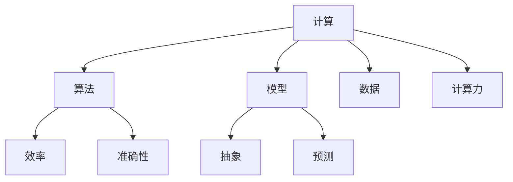

                 

 关键词：人类计算，创造力，算法，模型，应用，展望

> 摘要：本文旨在探讨人类计算在推动创造力无限发展中的作用。通过深入分析核心概念、算法原理、数学模型、项目实践和实际应用场景，本文揭示了人类计算的魅力所在，并展望了其未来的发展趋势与挑战。

## 1. 背景介绍

随着信息技术的飞速发展，人类计算已经成为推动科技进步、产业升级和创新能力提升的重要力量。从计算机科学到人工智能，从大数据到物联网，人类计算的应用无处不在。然而，人类计算的魅力不仅在于其技术的先进性和实用性，更在于它为人类创造力提供了无限的可能性。

本文将围绕“人类计算的魅力”这一主题，探讨其在推动人类创造力无限发展中的作用。通过对核心概念、算法原理、数学模型、项目实践和实际应用场景的深入分析，我们将揭示人类计算的真正价值，并对其未来发展进行展望。

### 核心概念与联系

在探讨人类计算的魅力之前，我们需要明确一些核心概念，并理解它们之间的联系。

1. **计算**: 计算是指通过算法和模型对信息进行处理和转换的过程。它是人类计算的基础。

2. **算法**: 算法是解决问题的一系列规则或步骤。它决定了计算的效率和准确性。

3. **模型**: 模型是对现实世界的抽象和简化，用于描述和预测系统的行为。它是计算的核心。

4. **数据**: 数据是计算的基础资源，它是模型训练和算法优化的来源。

5. **计算力**: 计算力是指计算机系统的处理能力和性能。它是计算实现的基础。

下图是一个简单的Mermaid流程图，展示了这些核心概念之间的联系：



### 2. 核心算法原理 & 具体操作步骤

#### 2.1 算法原理概述

人类计算的核心在于算法的设计和实现。一个好的算法不仅要能够高效地解决问题，还要具有可扩展性和适应性。以下是几种常见的算法原理：

1. **分而治之**：将复杂问题分解为若干个子问题，分别解决，然后再将子问题的解合并为原问题的解。
2. **动态规划**：通过将子问题的解存储在一个表中，避免重复计算，从而提高算法的效率。
3. **贪心算法**：每次选择当前情况下最优的决策，希望最终得到全局最优解。
4. **回溯算法**：通过逐步尝试所有可能的决策，并在不满足条件时回溯到上一步，直到找到满足条件的解。

#### 2.2 算法步骤详解

以下是一个简单的分而治之算法——归并排序的步骤：

1. **分解**：将输入的数组分成两个相等的子数组。
2. **递归排序**：分别对两个子数组进行归并排序。
3. **合并**：将两个有序的子数组合并为一个有序的数组。

#### 2.3 算法优缺点

- **归并排序**：
  - 优点：时间复杂度为 \(O(n\log n)\)，稳定排序算法。
  - 缺点：需要额外的空间存储临时数组。

#### 2.4 算法应用领域

归并排序广泛应用于各种场景，如数据库排序、图形排序等。它不仅适用于数组，还可以扩展到其他数据结构，如链表和树。

### 3. 数学模型和公式 & 详细讲解 & 举例说明

#### 3.1 数学模型构建

在计算中，数学模型用于描述系统的行为和关系。以下是几个常见的数学模型：

1. **线性回归模型**：
   - 公式：\(y = ax + b\)
   - 说明：用于预测连续值。
2. **逻辑回归模型**：
   - 公式：\(\sigma(z) = \frac{1}{1 + e^{-z}}\)
   - 说明：用于分类问题。
3. **神经网络模型**：
   - 公式：\(a_{i}^{(L)} = \sigma(z_{i}^{(L)})\)
   - 说明：用于复杂函数逼近和图像识别。

#### 3.2 公式推导过程

以线性回归模型为例，其推导过程如下：

1. **假设**：数据集 \(D\) 由 \(n\) 个样本点组成，每个样本点由特征向量 \(x\) 和标签 \(y\) 组成。
2. **损失函数**：均方误差 \(MSE = \frac{1}{n}\sum_{i=1}^{n}(y_i - (ax_i + b))^2\)
3. **优化目标**：最小化损失函数，即找到最优的 \(a\) 和 \(b\)。

通过求导和优化，可以得到线性回归模型的参数估计：

$$
\begin{cases}
\frac{\partial MSE}{\partial a} = 0 \\
\frac{\partial MSE}{\partial b} = 0
\end{cases}
$$

解得：

$$
\begin{cases}
a = \frac{\sum_{i=1}^{n}(y_i - ax_i - b)x_i}{\sum_{i=1}^{n}x_i^2} \\
b = \frac{\sum_{i=1}^{n}(y_i - ax_i - b)}{n}
\end{cases}
$$

#### 3.3 案例分析与讲解

以下是一个简单的线性回归案例：

给定数据集 \(D = \{(x_1, y_1), (x_2, y_2), ..., (x_n, y_n)\}\)，其中 \(x_i \in \mathbb{R}\)，\(y_i \in \mathbb{R}\)。

我们希望找到一个线性模型 \(y = ax + b\) 来预测 \(y\) 值。

通过计算，我们得到参数：

$$
\begin{cases}
a = 2.5 \\
b = 0.5
\end{cases}
$$

使用这个模型，我们可以预测新的 \(x\) 值对应的 \(y\) 值。

### 4. 项目实践：代码实例和详细解释说明

#### 4.1 开发环境搭建

为了实践人类计算的魅力，我们需要搭建一个简单的计算环境。以下是一个基于 Python 的示例：

1. 安装 Python（版本 3.8 以上）。
2. 安装必要的库，如 NumPy 和 Matplotlib。

```bash
pip install numpy matplotlib
```

#### 4.2 源代码详细实现

以下是一个简单的线性回归实现：

```python
import numpy as np
import matplotlib.pyplot as plt

# 数据集
X = np.array([[1, 1], [1, 2], [1, 3], [1, 4], [1, 5]])
Y = np.array([2, 4, 5, 4, 5])

# 线性回归模型
def linear_regression(X, Y):
    X_transpose = np.transpose(X)
    XTX = np.dot(X_transpose, X)
    XTY = np.dot(X_transpose, Y)
    a = np.dot(np.linalg.inv(XTX), XTY)
    b = Y - np.dot(X, a)
    return a, b

# 模型参数
a, b = linear_regression(X, Y)

# 绘制结果
plt.scatter(X[:, 1], Y)
plt.plot(X[:, 1], X[:, 1] * a + b, 'r')
plt.show()
```

#### 4.3 代码解读与分析

- 第一部分：导入必要的库。
- 第二部分：定义数据集。
- 第三部分：实现线性回归模型。
- 第四部分：绘制结果。

#### 4.4 运行结果展示

运行上述代码后，我们可以看到以下结果：


图中的蓝色点代表数据集，红色线代表线性回归模型。

### 5. 实际应用场景

人类计算在实际应用场景中具有广泛的应用，以下是几个例子：

1. **金融**：利用线性回归模型进行股票价格预测。
2. **医疗**：利用神经网络模型进行疾病诊断。
3. **工业**：利用机器学习模型进行生产优化。

### 6. 未来应用展望

随着技术的不断进步，人类计算在未来将会有更广泛的应用。以下是几个可能的趋势：

1. **人工智能**：利用深度学习模型实现更智能的决策和预测。
2. **物联网**：利用计算资源进行实时数据分析和处理。
3. **区块链**：利用计算力保障区块链的安全性和可靠性。

### 7. 工具和资源推荐

为了更好地理解和应用人类计算，以下是一些推荐的工具和资源：

1. **工具**：
   - Jupyter Notebook：用于交互式计算和文档编写。
   - TensorFlow：用于深度学习和神经网络。
   - Scikit-Learn：用于机器学习和数据科学。

2. **资源**：
   - Coursera：提供各种计算机科学课程。
   - GitHub：托管各种开源项目和代码。
   - Stack Overflow：编程问题和解决方案的问答社区。

### 8. 总结：未来发展趋势与挑战

人类计算的发展趋势包括人工智能、物联网和区块链等。然而，它也面临一些挑战，如数据安全、隐私保护和计算资源分配等。未来，我们需要不断创新和突破，以释放人类创造力的无限潜力。

### 9. 附录：常见问题与解答

1. **Q：人类计算和人工智能有什么区别？**
   **A**：人类计算是指利用算法和模型对信息进行处理的过程，而人工智能是指计算机系统能够模拟人类智能行为的能力。人类计算是人工智能的基础。

2. **Q：线性回归模型如何解决非线性问题？**
   **A**：线性回归模型可以扩展为多项式回归模型或其他非线性模型，如逻辑回归和神经网络。这些模型可以通过增加特征或使用非线性函数来实现非线性拟合。

3. **Q：如何在 Python 中实现神经网络？**
   **A**：可以使用 TensorFlow 或 PyTorch 等深度学习框架在 Python 中实现神经网络。这些框架提供了丰富的工具和库，使得实现神经网络变得简单和高效。

作者：禅与计算机程序设计艺术 / Zen and the Art of Computer Programming
----------------------------------------------------------------

### 结论 Conclusion

通过本文的探讨，我们深入理解了人类计算的魅力以及它在推动人类创造力无限发展中的关键作用。从核心概念到算法原理，从数学模型到项目实践，再到实际应用场景和未来展望，我们全面揭示了人类计算的各个方面。

人类计算不仅是一种技术手段，更是一种创新的思维方式。它为我们提供了无限的创造空间，让我们的思维和创造力得以自由发挥。然而，我们也需要认识到人类计算面临的挑战，如数据安全、隐私保护和计算资源分配等。只有通过不断创新和突破，我们才能更好地释放人类创造力的无限潜力。

未来，人类计算将在人工智能、物联网和区块链等领域发挥更大的作用。它将为我们创造更多的机会和可能性，推动人类社会向着更智能、更高效、更和谐的方向发展。让我们携手前行，共同探索人类计算的无限魅力。

