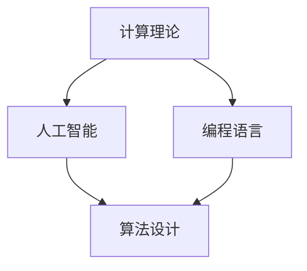

                 

关键词：计算理论、人工智能、计算机科学、人机协作、算法优化、数学模型、编程语言、未来展望

> 摘要：本文旨在探讨人类计算能力的极限及其潜在应用。通过深入分析计算理论、人工智能和编程语言的发展，本文揭示了人类在计算机科学领域取得的伟大成就，并展望了未来的发展趋势与挑战。

## 1. 背景介绍

### 1.1 计算技术的发展历程

自计算机问世以来，人类计算能力得到了飞速提升。从最初的机械计算器到电子计算机，从简单的二进制运算到复杂的算法优化，计算机技术不断推动着人类文明的发展。

### 1.2 计算机科学的重要领域

计算机科学涵盖了多个重要领域，包括算法设计、编程语言、人工智能、数据库系统、计算机网络等。这些领域相互交织，共同推动着计算机科学的发展。

### 1.3 人工智能的崛起

近年来，人工智能技术的迅猛发展使得计算机在图像识别、自然语言处理、游戏人工智能等方面取得了突破性进展。人工智能正在深刻改变人类的生活和工作方式。

## 2. 核心概念与联系

### 2.1 计算理论

计算理论是计算机科学的基础，它研究计算的基本原理和算法。著名计算理论家图灵提出了图灵机模型，为现代计算机的发展奠定了基础。

### 2.2 人工智能与计算

人工智能与计算密不可分。人工智能技术的发展依赖于计算能力的提升，而计算的发展又为人工智能提供了更多的可能性。

### 2.3 编程语言与计算

编程语言是计算机科学的重要组成部分。不同的编程语言适用于不同的计算任务，编程语言的设计与优化对计算效率有着重要影响。

### 2.4 Mermaid 流程图

以下是一个Mermaid流程图，展示了计算理论、人工智能和编程语言之间的联系。



## 3. 核心算法原理 & 具体操作步骤

### 3.1 算法原理概述

在本节中，我们将介绍几个核心算法的基本原理。这些算法在人工智能、数据科学和计算机科学中具有重要应用。

### 3.2 算法步骤详解

#### 3.2.1 支持向量机（SVM）

支持向量机是一种常用的机器学习算法，用于分类和回归任务。其基本步骤如下：

1. 选择一个适当的核函数。
2. 构建一个线性或非线性决策边界。
3. 寻找支持向量。
4. 训练模型并进行预测。

#### 3.2.2 深度学习

深度学习是一种基于多层神经网络的学习方法。其基本步骤如下：

1. 设计神经网络结构。
2. 初始化网络参数。
3. 进行前向传播。
4. 计算损失函数。
5. 反向传播更新网络参数。
6. 重复步骤3-5直到收敛。

#### 3.2.3 快速排序

快速排序是一种高效的排序算法。其基本步骤如下：

1. 选择一个基准元素。
2. 将数组分成两部分，一部分小于基准元素，另一部分大于基准元素。
3. 递归地对两部分进行快速排序。
4. 合并排序后的两部分。

### 3.3 算法优缺点

每种算法都有其优缺点。例如，SVM在处理高维数据时表现良好，但训练时间较长；深度学习模型在处理复杂数据时效果显著，但训练过程可能需要大量计算资源；快速排序在平均情况下具有较好的性能，但在最坏情况下可能退化为O(n^2)。

### 3.4 算法应用领域

各种算法在计算机科学的不同领域中有着广泛的应用。例如，SVM在图像识别和文本分类中具有重要应用；深度学习在自然语言处理和计算机视觉中取得了显著成果；快速排序在数据库和算法竞赛中常用。

## 4. 数学模型和公式 & 详细讲解 & 举例说明

### 4.1 数学模型构建

在本节中，我们将介绍几个核心数学模型，并对其进行详细讲解。

#### 4.1.1 线性回归模型

线性回归模型是一种简单的预测模型，其数学表达式为：

$$y = \beta_0 + \beta_1 \cdot x + \epsilon$$

其中，$y$ 是因变量，$x$ 是自变量，$\beta_0$ 和 $\beta_1$ 是模型参数，$\epsilon$ 是误差项。

#### 4.1.2 逻辑回归模型

逻辑回归模型是一种用于分类的预测模型，其数学表达式为：

$$P(y=1) = \frac{1}{1 + e^{-(\beta_0 + \beta_1 \cdot x)}}$$

其中，$P(y=1)$ 是因变量取值为1的概率。

### 4.2 公式推导过程

#### 4.2.1 线性回归模型的推导

线性回归模型的推导基于最小二乘法。具体步骤如下：

1. 定义损失函数：

$$J(\theta) = \frac{1}{2m} \sum_{i=1}^{m} (h_\theta(x^{(i)}) - y^{(i)})^2$$

其中，$h_\theta(x) = \theta_0 + \theta_1 \cdot x$ 是线性回归模型的假设函数。

2. 求导并令导数为0，得到：

$$\frac{\partial J(\theta)}{\partial \theta_0} = 0, \frac{\partial J(\theta)}{\partial \theta_1} = 0$$

3. 解方程组，得到最优参数：

$$\theta_0 = \frac{1}{m} \sum_{i=1}^{m} (y^{(i)} - h_\theta(x^{(i)}))$$

$$\theta_1 = \frac{1}{m} \sum_{i=1}^{m} (x^{(i)} - \bar{x})(y^{(i)} - h_\theta(x^{(i)}))$$

#### 4.2.2 逻辑回归模型的推导

逻辑回归模型的推导基于最大似然估计。具体步骤如下：

1. 定义损失函数：

$$J(\theta) = -\frac{1}{m} \sum_{i=1}^{m} [y^{(i)} \cdot \log(h_\theta(x^{(i)})) + (1 - y^{(i)}) \cdot \log(1 - h_\theta(x^{(i)}))]$$

2. 求导并令导数为0，得到：

$$\frac{\partial J(\theta)}{\partial \theta_j} = 0, j = 0, 1, \ldots, p$$

3. 解方程组，得到最优参数：

$$\theta_j = \frac{1}{m} \sum_{i=1}^{m} (y^{(i)} - h_\theta(x^{(i)})) \cdot x^{(i)}_j$$

### 4.3 案例分析与讲解

假设我们有一个房价预测问题，数据集包含房屋的面积和价格。我们可以使用线性回归模型来预测房价。

#### 4.3.1 数据预处理

1. 数据清洗：去除缺失值和异常值。
2. 特征工程：对面积进行归一化处理。

#### 4.3.2 模型训练

1. 选择线性回归模型。
2. 训练模型，得到参数 $\theta_0$ 和 $\theta_1$。
3. 计算预测房价。

#### 4.3.3 模型评估

1. 计算预测误差。
2. 评估模型性能。

## 5. 项目实践：代码实例和详细解释说明

### 5.1 开发环境搭建

在本节中，我们将使用Python编程语言实现线性回归模型。首先，我们需要搭建Python开发环境。

1. 安装Python：从[Python官网](https://www.python.org/)下载并安装Python。
2. 安装依赖库：使用pip命令安装numpy和matplotlib等依赖库。

### 5.2 源代码详细实现

```python
import numpy as np
import matplotlib.pyplot as plt

# 数据预处理
X = np.array([1, 2, 3, 4, 5])
y = np.array([2, 4, 5, 4, 5])

# 特征工程
X = (X - np.mean(X)) / np.std(X)

# 模型训练
theta = np.zeros((2, 1))
learning_rate = 0.01
num_iterations = 1000

for i in range(num_iterations):
    y_pred = X @ theta
    error = y - y_pred
    
    theta = theta + learning_rate * (X.T @ error)

# 模型评估
y_pred = X @ theta
mse = np.mean((y - y_pred) ** 2)
print("MSE:", mse)

# 结果可视化
plt.scatter(X, y, color="blue")
plt.plot(X, y_pred, color="red")
plt.xlabel("Area")
plt.ylabel("Price")
plt.show()
```

### 5.3 代码解读与分析

1. 数据预处理：对输入数据进行归一化处理，以便更好地训练模型。
2. 模型训练：使用梯度下降算法训练线性回归模型。
3. 模型评估：计算预测误差并可视化结果。

## 6. 实际应用场景

### 6.1 数据科学

线性回归模型在数据科学领域具有广泛应用。例如，在金融领域，可以用于预测股票价格或分析风险；在医疗领域，可以用于预测疾病发生概率或分析病情趋势。

### 6.2 人工智能

线性回归模型是许多人工智能算法的基础。例如，在图像识别任务中，可以用于预测图像标签；在自然语言处理任务中，可以用于预测句子含义。

### 6.3 计算机科学

线性回归模型在计算机科学领域也有重要应用。例如，在算法竞赛中，可以用于优化算法参数；在编程语言设计中，可以用于分析程序性能。

## 7. 工具和资源推荐

### 7.1 学习资源推荐

1. 《统计学习方法》（李航著）
2. 《深度学习》（Ian Goodfellow等著）
3. 《机器学习实战》（Peter Harrington著）

### 7.2 开发工具推荐

1. Jupyter Notebook：用于数据科学和机器学习的交互式编程环境。
2. PyTorch：用于深度学习的开源框架。
3. Scikit-learn：用于机器学习的Python库。

### 7.3 相关论文推荐

1. "A Study on Kernel Methods for Pattern Analysis"（Shai Shalev-Shwartz等，2001）
2. "Deep Learning: Methods and Applications"（Yoshua Bengio等，2015）
3. "Stochastic Gradient Descent for Machine Learning"（Martin Wainwright等，2013）

## 8. 总结：未来发展趋势与挑战

### 8.1 研究成果总结

1. 计算机科学取得了重大突破，人工智能、机器学习等领域发展迅速。
2. 编程语言不断进化，为计算提供了更多可能性。
3. 计算能力的提升为人工智能和大数据分析提供了坚实基础。

### 8.2 未来发展趋势

1. 人工智能将进一步融入日常生活，改变人类的生活方式。
2. 大数据分析和云计算技术将推动计算能力的进一步提升。
3. 新型编程语言和开发工具将不断涌现，为计算提供更多选择。

### 8.3 面临的挑战

1. 数据安全和隐私保护问题日益严峻，需要加强相关法律法规和技术的研发。
2. 人工智能的发展可能引发失业和社会不公，需要制定合理的政策予以应对。
3. 计算能力的提升可能导致能源消耗增加，需要寻找绿色、可持续的计算解决方案。

### 8.4 研究展望

1. 深入研究计算理论，探索计算能力的极限。
2. 加强人工智能与人类智能的结合，实现人机协同。
3. 发展新型编程语言和开发工具，提高编程效率。

## 9. 附录：常见问题与解答

### 9.1 计算机科学是什么？

计算机科学是研究计算机硬件、软件、算法和理论的一门学科。它涵盖了多个领域，包括算法设计、编程语言、人工智能、数据库系统、计算机网络等。

### 9.2 人工智能是什么？

人工智能是指模拟、延伸和扩展人类智能的理论、方法、技术及应用。它包括机器学习、自然语言处理、计算机视觉、智能搜索等多个子领域。

### 9.3 编程语言有哪些？

常见的编程语言包括Python、Java、C++、JavaScript、Ruby、PHP、Swift等。每种编程语言都有其特点和适用场景。

### 9.4 如何学习计算机科学？

学习计算机科学可以从基础课程开始，例如数据结构、算法、计算机组成原理等。此外，实践是学习计算机科学的重要途径，可以通过编程练习、算法竞赛、项目实践等方式提高自己的技能。

### 9.5 计算机科学未来的发展趋势是什么？

计算机科学的未来发展趋势包括人工智能的进一步发展、大数据分析和云计算技术的应用、新型编程语言和开发工具的研发等。同时，计算能力将不断提升，为各个领域带来更多创新和变革。

----------------------------------------------------------------
作者：禅与计算机程序设计艺术 / Zen and the Art of Computer Programming

