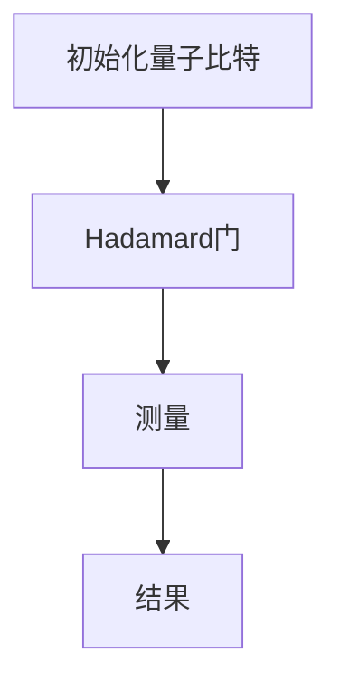
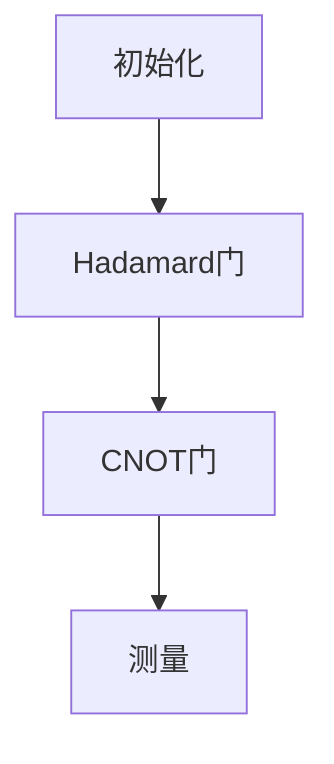
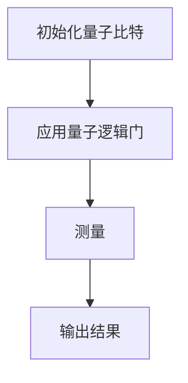

                 

关键词：量子计算、计算范式、量子算法、量子计算机、量子比特、量子叠加、量子纠缠、量子编程、量子逻辑门、量子加密、量子模拟

摘要：本文将探讨量子计算作为下一代计算范式的潜力与挑战。我们将深入分析量子计算的核心概念，包括量子比特、量子叠加和量子纠缠，以及它们如何改变了我们对计算的传统理解。接着，我们将介绍几个重要的量子算法，包括量子算法Shor和Grover算法，并探讨它们的原理与应用。随后，我们将讨论量子计算机在加密、模拟和优化等领域的实际应用，以及当前量子计算面临的挑战和未来发展的方向。通过这篇文章，读者将全面了解量子计算的魅力和可能性，以及它如何重塑我们对计算和技术的认知。

## 1. 背景介绍

计算作为信息技术的基础，推动了人类社会的进步。从经典的计算机到现代的超级计算机，计算技术经历了数次革命。然而，传统计算在处理某些问题时存在固有的局限性，如因数分解和搜索问题。为了克服这些限制，科学家们开始探索量子计算这一全新的计算范式。

量子计算起源于量子力学的基本原理，它基于量子比特（qubit）这一核心概念。与传统计算机中的比特只有两种状态（0或1）不同，量子比特可以同时存在于多种状态，这种现象称为量子叠加。此外，量子比特之间可以通过量子纠缠实现强相关的状态，这一特性使得量子计算机在某些问题上的计算能力远超传统计算机。

量子计算的理论基础可以追溯到20世纪40年代。保罗·戴维森（Paul Davisson）和约翰·艾弗雷特（John A. Wheeler）在1949年提出了量子逻辑门的概念，这是量子计算机的基本操作单元。随后，理查德·费曼（Richard Feynman）在1982年提出了量子模拟的思想，认为量子计算机可以模拟任何物理系统。彼得·绍尔（Peter Shor）在1994年提出了量子算法Shor算法，展示了量子计算机在整数因数分解上的巨大潜力。这些理论和算法的提出，为量子计算的研究奠定了基础。

在实际应用方面，量子计算已经显示出巨大的潜力。例如，在加密领域，量子计算机可以破解目前广泛使用的RSA加密算法，这推动了量子加密技术的发展。在科学和工程领域，量子计算机可以用于分子模拟、药物设计、材料科学等，从而加速科学研究和新材料的发现。此外，量子优化算法在物流、金融、能源等领域也展现了广泛的应用前景。

尽管量子计算在理论和技术上取得了显著进展，但实现实用化的量子计算机仍然面临巨大挑战。量子比特的稳定性、错误率、扩展性等问题需要解决。同时，量子编程和算法设计也需要新的方法和工具。尽管如此，量子计算作为下一代计算范式的前景仍然充满希望，它有望颠覆我们对计算和技术的传统认知，为未来的科技创新带来新的机遇。

## 2. 核心概念与联系

### 2.1 量子比特（Qubit）

量子比特是量子计算的基本单位，它不同于传统计算机中的比特。传统比特只能处于0或1两种状态之一，而量子比特可以处于0和1的叠加态。这种叠加态可以用数学上的态叠加原理来描述，即一个量子比特可以同时表示为0和1的状态，表示为：

\[ \lvert \psi \rangle = \alpha \lvert 0 \rangle + \beta \lvert 1 \rangle \]

其中，\(\alpha\)和\(\beta\)是复数系数，满足\(|\alpha|^2 + |\beta|^2 = 1\)。

### 2.2 量子叠加（Quantum Superposition）

量子叠加是量子计算的核心特性之一。传统计算机中的信息处理依赖于比特的离散状态，而量子计算机中的量子比特可以同时处于多种状态的叠加。这意味着量子计算机可以同时处理多个问题的解决方案，大大提高了计算效率。

一个简单的例子是量子二进制加法器。在传统计算机中，二进制加法器每次只能处理两个二进制数的加法。而在量子计算机中，一个具有两个量子比特的加法器可以同时处理所有可能的二进制数对，即00、01、10和11。

### 2.3 量子纠缠（Quantum Entanglement）

量子纠缠是量子比特之间的强相关状态，这种状态使得量子比特之间的信息可以即时传递，无论它们相隔多远。量子纠缠的直观描述是：当两个量子比特处于纠缠态时，一个量子比特的状态会立即影响另一个量子比特的状态，即使它们相隔很远。

一个经典的量子纠缠态是贝尔态（Bell state），例如：

\[ \lvert \Phi^+\rangle = \frac{1}{\sqrt{2}} (\lvert 00 \rangle + \lvert 11 \rangle) \]

在这个态中，如果测量一个量子比特处于基态（0），那么另一个量子比特必定处于激发态（1），反之亦然。

### 2.4 量子逻辑门（Quantum Logic Gates）

量子逻辑门是量子计算机的基本操作单元，类似于传统计算机中的逻辑门。量子逻辑门可以作用于量子比特，改变量子比特的状态。常见的量子逻辑门包括Hadamard门（实现叠加态）、Pauli门（实现量子比特的旋转）和CNOT门（实现量子比特之间的纠缠）。

下面是一个简单的Mermaid流程图，展示了量子逻辑门的基本操作：



在这个流程图中，初始化量子比特处于基态\(\lvert 0 \rangle\)，通过Hadamard门将其转换为叠加态，然后进行测量得到最终结果。

### 2.5 量子编程（Quantum Programming）

量子编程是量子计算机编程的基本方法，它涉及到如何设计量子算法和实现量子逻辑门。量子编程与传统编程相比有显著不同，需要处理量子比特的叠加态和纠缠态。

量子编程的关键是量子电路（Quantum Circuit），它类似于传统计算机中的程序流程图。量子电路通过一系列量子逻辑门操作量子比特，实现特定的量子算法。一个简单的量子电路如下：



在这个电路中，初始化两个量子比特，然后通过Hadamard门和CNOT门实现量子纠缠，最后进行测量。

### 2.6 量子算法（Quantum Algorithms）

量子算法是利用量子计算机的特殊能力解决特定问题的方法。与经典算法相比，量子算法可以在某些问题上显著提高计算效率。以下是一些重要的量子算法：

- **Shor算法**：用于整数因数分解，其时间复杂度为多项式时间。
- **Grover算法**：用于搜索未排序数据库，其时间复杂度为\(O(\sqrt{N})\)，远低于经典算法的\(O(N)\)。
- **量子模拟**：用于模拟量子系统和复杂物理过程，其时间复杂度可以降低多个数量级。

下面是一个简单的Mermaid流程图，展示了量子算法的基本操作：



在这个流程图中，初始化量子比特，应用一系列量子逻辑门，最后进行测量得到输出结果。

### 2.7 量子计算机（Quantum Computer）

量子计算机是利用量子比特和量子逻辑门进行计算的新型计算机。与经典计算机不同，量子计算机可以同时处理多个问题的解决方案，具有指数级别的计算能力。

当前，量子计算机正处于发展初期，存在多个实现方案，如超导量子比特、离子阱量子比特、光量子比特等。尽管面临诸多挑战，但已有一些实验成果展示了量子计算机在特定问题上的优势。

### 2.8 量子计算与经典计算的比较（Quantum Computing vs. Classical Computing）

量子计算与经典计算在基本原理和计算能力上存在显著差异。经典计算依赖于离散的比特，而量子计算依赖于量子比特的叠加和纠缠。这使得量子计算机在某些问题上具有指数级的计算优势。

以下是一个简单的对比表格：

| 特性 | 量子计算 | 经典计算 |
| --- | --- | --- |
| 状态表示 | 多状态叠加 | 离散状态（0或1） |
| 操作 | 量子逻辑门 | 逻辑门 |
| 计算能力 | 指数级 | 线性级 |
| 实现难度 | 高 | 较低 |

尽管量子计算具有巨大潜力，但实现实用化的量子计算机仍面临诸多挑战，如量子比特的稳定性、错误率、扩展性等。因此，量子计算与经典计算将长期共存，共同推动计算技术的发展。

## 3. 核心算法原理 & 具体操作步骤

### 3.1 量子算法Shor（Quantum Algorithm Shor）

#### 3.1.1 算法原理概述

Shor算法是量子计算领域的一个重要突破，它能够高效地解决整数因数分解问题。整数因数分解是一个经典的数学难题，其传统算法如试除法和Pollardρ算法在处理大规模数时效率较低。Shor算法利用量子计算机的特殊能力，将其时间复杂度降低到多项式时间，从而在量子计算机上实现了高效的因数分解。

#### 3.1.2 算法步骤详解

Shor算法分为两个主要部分：第一部分是构建量子态，第二部分是使用量子傅里叶变换（Quantum Fourier Transform, QFT）进行因数分解。

1. **构建量子态**：首先，输入一个整数\(N\)，我们需要找到一个与\(N\)互质的整数\(a\)。然后，将量子计算机初始化为以下状态：

   \[ \lvert \psi_0 \rangle = \frac{1}{\sqrt{N}} \sum_{x=0}^{N-1} \lvert x \rangle \lvert f(x) \rangle \]

   其中，\(\lvert x \rangle\)表示\(x\)的二进制表示，\(\lvert f(x) \rangle = \lvert ax \mod N \rangle\)。

2. **应用量子逻辑门**：接下来，我们需要应用一系列量子逻辑门，使量子态经历\(a\)次迭代。每次迭代包括以下步骤：
   - 将量子态旋转到目标态：
     \[ U_f(\theta) = e^{i\theta \lvert a \rangle \langle a \rvert} \]
   - 更新量子态：
     \[ \lvert \psi_1 \rangle = U_f(\theta) \lvert \psi_0 \rangle \]

   其中，\(\theta = 2\pi / N\)。

3. **测量量子态**：经过\(a\)次迭代后，测量量子态得到一个整数\(k\)。由于量子态经历了\(a\)次迭代，根据量子傅里叶变换的性质，我们可以得到以下等式：

   \[ \lvert \psi_1 \rangle \approx \sum_{x=0}^{N-1} e^{i 2\pi x k / N} \lvert x \rangle \lvert ax \mod N \rangle \]

   测量得到的结果\(k\)满足\(k \mod N = ax \mod N\)。

4. **因数分解**：通过\(k\)和\(N\)的关系，我们可以找到\(N\)的一个因数。具体而言，如果\(k\)是\(N\)的因数，那么\(k\)就是\(N\)的一个因子。否则，我们可以通过\(k^2\)与\(N\)的关系找到另一个因子。

#### 3.1.3 算法优缺点

**优点**：
- Shor算法能够高效地解决整数因数分解问题，其时间复杂度为多项式时间。
- 该算法展示了量子计算机在特定问题上的巨大潜力。

**缺点**：
- Shor算法的实现需要量子计算机具有高稳定性和低错误率，目前量子计算机尚未达到这一要求。
- Shor算法无法解决所有问题，其适用范围有限。

#### 3.1.4 算法应用领域

Shor算法在密码学、数论和计算机科学等领域有广泛的应用前景。在密码学领域，Shor算法能够破解当前广泛使用的RSA加密算法，从而推动量子密码技术的发展。在数论领域，Shor算法可用于因数分解和素数测试，为数学研究提供新的工具。在计算机科学领域，Shor算法展示了量子计算机在算法优化和计算复杂性方面的潜力。

### 3.2 Grover算法（Grover's Algorithm）

#### 3.2.1 算法原理概述

Grover算法是一种量子搜索算法，用于在未排序的数据库中查找特定元素。与传统搜索算法相比，Grover算法具有指数级的效率提升。其时间复杂度为\(O(\sqrt{N})\)，其中\(N\)是数据库的大小。

#### 3.2.2 算法步骤详解

Grover算法分为两个主要部分：第一部分是构建量子态，第二部分是迭代搜索。

1. **构建量子态**：首先，输入一个未排序的数据库和一个目标元素。将量子计算机初始化为以下状态：

   \[ \lvert \psi_0 \rangle = \frac{1}{\sqrt{N}} \sum_{x=0}^{N-1} \lvert x \rangle \]

   其中，\(\lvert x \rangle\)表示数据库中的每个元素。

2. **应用Grover迭代**：接下来，应用一系列Grover迭代，每次迭代包括以下步骤：
   - 计算一个反对称函数\(f(x)\)，用于标记目标元素：
     \[ f(x) = \begin{cases} 
     1 & \text{if } \lvert x \rangle \text{ is the target element} \\
     0 & \text{otherwise}
     \end{cases} \]
   - 应用Grover迭代操作：
     \[ U_G(\theta) = 2 \lvert \psi_0 \rangle \langle \psi_0 \rvert f(\lvert \psi_0 \rangle) + \lvert \psi_0 \rangle \langle \psi_0 \rvert \lvert \psi_0 \rangle \]
   - 更新量子态：
     \[ \lvert \psi_1 \rangle = U_G(\theta) \lvert \psi_0 \rangle \]

3. **测量量子态**：经过多次迭代后，测量量子态得到一个元素。由于量子态经历了\(N\)次迭代，根据Grover迭代操作的性质，测量得到的元素是目标元素的概率最大。

#### 3.2.3 算法优缺点

**优点**：
- Grover算法能够高效地搜索未排序的数据库，其时间复杂度为\(O(\sqrt{N})\)。
- 该算法展示了量子计算机在搜索问题上的巨大潜力。

**缺点**：
- Grover算法的实现需要量子计算机具有高稳定性和低错误率，目前量子计算机尚未达到这一要求。
- Grover算法无法解决所有搜索问题，其适用范围有限。

#### 3.2.4 算法应用领域

Grover算法在数据库搜索、优化问题和人工智能等领域有广泛的应用前景。在数据库搜索领域，Grover算法可以显著提高搜索效率，为大数据分析提供新的工具。在优化问题领域，Grover算法可以用于求解组合优化问题，如旅行商问题（TSP）。在人工智能领域，Grover算法可以用于增强机器学习模型的搜索能力。

### 3.3 量子模拟（Quantum Simulation）

#### 3.3.1 算法原理概述

量子模拟是一种利用量子计算机模拟量子系统的计算方法。传统计算机在模拟量子系统时存在巨大的计算复杂性，而量子计算机可以显著降低模拟的时间复杂度。

#### 3.3.2 算法步骤详解

量子模拟的基本步骤包括：
1. **初始化量子态**：根据量子系统的初始状态，初始化量子计算机的量子态。
2. **应用量子操作**：通过量子逻辑门模拟量子系统的时间演化。
3. **测量量子态**：通过测量量子态，得到量子系统的演化结果。

#### 3.3.3 算法优缺点

**优点**：
- 量子模拟可以显著降低量子系统模拟的时间复杂度。
- 该算法在材料科学、量子化学和生物学等领域有重要应用。

**缺点**：
- 量子模拟的实现需要高稳定性和低错误率的量子计算机。
- 量子模拟的适用范围有限，仅限于某些特定的量子系统。

#### 3.3.4 算法应用领域

量子模拟在材料科学、量子化学和生物学等领域有广泛的应用前景。在材料科学领域，量子模拟可以用于研究新材料的设计和性能。在量子化学领域，量子模拟可以用于研究化学反应和分子结构。在生物学领域，量子模拟可以用于研究蛋白质折叠和药物设计。

### 3.4 量子算法其他应用（Other Applications of Quantum Algorithms）

除了Shor算法、Grover算法和量子模拟，量子算法在许多其他领域也有潜在应用。以下是一些重要的量子算法和应用：

1. **量子加密（Quantum Cryptography）**：量子加密利用量子力学原理实现安全的通信。量子密钥分发（Quantum Key Distribution, QKD）是一种典型的量子加密技术，可以防止信息被窃听和篡改。

2. **量子优化（Quantum Optimization）**：量子优化算法可以用于求解复杂的优化问题，如旅行商问题（TSP）和组合优化问题。量子优化算法在物流、金融和能源等领域有广泛的应用前景。

3. **量子机器学习（Quantum Machine Learning）**：量子机器学习结合量子计算和机器学习技术，可以用于加速机器学习算法的收敛速度和计算效率。量子机器学习在图像识别、自然语言处理和推荐系统等领域有潜在应用。

4. **量子信息处理（Quantum Information Processing）**：量子信息处理利用量子比特和量子逻辑门实现高效的信息处理。量子信息处理在量子通信、量子计算和量子密码学等领域有重要应用。

### 3.5 量子算法的未来发展（Future Developments of Quantum Algorithms）

随着量子计算技术的不断发展，量子算法在未来有望实现更多的突破。以下是一些未来发展的方向：

1. **算法优化**：通过改进量子算法的设计和实现，提高算法的效率和应用范围。

2. **算法扩展**：开发新的量子算法，解决更多传统计算难以解决的问题。

3. **算法验证**：建立完善的量子算法验证机制，确保算法的正确性和可靠性。

4. **算法应用**：探索量子算法在更多领域的应用，推动量子计算技术的实际应用。

### 3.6 总结（Summary）

量子算法在整数因数分解、搜索、模拟和加密等领域展示了巨大的潜力。随着量子计算技术的不断发展，量子算法将在未来的计算技术中发挥重要作用。然而，量子算法的实现和优化仍面临诸多挑战，需要进一步的研究和探索。

## 4. 数学模型和公式 & 详细讲解 & 举例说明

### 4.1 数学模型构建

量子计算的核心在于量子比特的叠加和纠缠，因此，构建一个量子数学模型是理解量子计算的基础。以下是一个简单的数学模型，用于描述量子比特的叠加和测量。

#### 量子比特的状态

量子比特可以用复数系数表示，即：

\[ \lvert \psi \rangle = \alpha \lvert 0 \rangle + \beta \lvert 1 \rangle \]

其中，\(\alpha\)和\(\beta\)是复数，满足归一化条件：

\[ |\alpha|^2 + |\beta|^2 = 1 \]

#### 量子叠加

量子叠加是量子计算的核心特性之一。一个简单的例子是两个量子比特的叠加态：

\[ \lvert \psi \rangle = \frac{1}{\sqrt{2}} (\lvert 00 \rangle + \lvert 11 \rangle) \]

这个叠加态表示两个量子比特同时处于基态和叠加态。

#### 量子纠缠

量子纠缠是量子比特之间的强相关状态。一个经典的例子是贝尔态（Bell state）：

\[ \lvert \Phi^+ \rangle = \frac{1}{\sqrt{2}} (\lvert 00 \rangle + \lvert 11 \rangle) \]

在这个态中，如果测量一个量子比特处于基态（0），那么另一个量子比特必定处于激发态（1），反之亦然。

### 4.2 公式推导过程

为了更好地理解量子计算的数学模型，我们可以通过几个具体的公式来推导量子叠加和纠缠。

#### 量子叠加态的构建

考虑两个量子比特的叠加态：

\[ \lvert \psi \rangle = \alpha \lvert 00 \rangle + \beta \lvert 11 \rangle \]

要构建这个叠加态，我们可以使用Hadamard门。Hadamard门是一个将基态旋转到叠加态的门，其作用如下：

\[ \lvert 0 \rangle \rightarrow \frac{1}{\sqrt{2}} (\lvert 0 \rangle + \lvert 1 \rangle) \]
\[ \lvert 1 \rangle \rightarrow \frac{1}{\sqrt{2}} (\lvert 0 \rangle - \lvert 1 \rangle) \]

对于两个量子比特，Hadamard门的作用可以表示为：

\[ H \lvert 00 \rangle = \frac{1}{\sqrt{2}} (\lvert 00 \rangle + \lvert 11 \rangle) \]
\[ H \lvert 01 \rangle = \frac{1}{\sqrt{2}} (\lvert 00 \rangle - \lvert 11 \rangle) \]
\[ H \lvert 10 \rangle = \frac{1}{\sqrt{2}} (\lvert 00 \rangle + \lvert 11 \rangle) \]
\[ H \lvert 11 \rangle = \frac{1}{\sqrt{2}} (\lvert 00 \rangle - \lvert 11 \rangle) \]

因此，我们可以通过应用Hadamard门来构建两个量子比特的叠加态：

\[ \lvert \psi \rangle = H \lvert 00 \rangle = \frac{1}{\sqrt{2}} (\lvert 00 \rangle + \lvert 11 \rangle) \]

#### 量子纠缠态的构建

接下来，我们考虑两个量子比特的纠缠态，即贝尔态：

\[ \lvert \Phi^+ \rangle = \frac{1}{\sqrt{2}} (\lvert 00 \rangle + \lvert 11 \rangle) \]

要构建这个纠缠态，我们可以使用CNOT门。CNOT门是一个控制非门，它将一个量子比特的状态应用到另一个量子比特上。CNOT门的作用如下：

\[ \lvert 00 \rangle \rightarrow \lvert 00 \rangle \]
\[ \lvert 01 \rangle \rightarrow \lvert 01 \rangle \]
\[ \lvert 10 \rangle \rightarrow \lvert 10 \rangle \]
\[ \lvert 11 \rangle \rightarrow \lvert 11 \rangle \]

对于两个量子比特，CNOT门的作用可以表示为：

\[ CNOT \lvert 00 \rangle = \lvert 00 \rangle \]
\[ CNOT \lvert 01 \rangle = \lvert 01 \rangle \]
\[ CNOT \lvert 10 \rangle = \lvert 10 \rangle \]
\[ CNOT \lvert 11 \rangle = \lvert 11 \rangle \]

因此，我们可以通过应用CNOT门来构建两个量子比特的纠缠态：

\[ \lvert \Phi^+ \rangle = CNOT \lvert 00 \rangle \]

### 4.3 案例分析与讲解

为了更好地理解量子计算的数学模型，我们可以通过一个具体的例子来分析量子叠加和纠缠。

#### 例子：构建两个量子比特的叠加态

假设我们有两个量子比特，初始状态分别为\(\lvert 0 \rangle\)和\(\lvert 1 \rangle\)。我们要构建一个叠加态，使得两个量子比特同时处于基态和叠加态。

首先，我们对第一个量子比特应用Hadamard门，得到以下叠加态：

\[ \lvert \psi_1 \rangle = H \lvert 0 \rangle = \frac{1}{\sqrt{2}} (\lvert 0 \rangle + \lvert 1 \rangle) \]

接下来，我们对第二个量子比特应用Hadamard门，得到以下叠加态：

\[ \lvert \psi_2 \rangle = H \lvert 1 \rangle = \frac{1}{\sqrt{2}} (\lvert 0 \rangle + \lvert 1 \rangle) \]

最后，我们将两个量子比特叠加起来，得到以下叠加态：

\[ \lvert \psi \rangle = \lvert \psi_1 \rangle \lvert \psi_2 \rangle = \frac{1}{\sqrt{2}} (\lvert 00 \rangle + \lvert 11 \rangle) \]

这个叠加态表示两个量子比特同时处于基态和叠加态。

#### 例子：构建两个量子比特的纠缠态

假设我们有两个量子比特，初始状态分别为\(\lvert 0 \rangle\)和\(\lvert 0 \rangle\)。我们要构建一个贝尔态，使得两个量子比特处于纠缠态。

首先，我们对第一个量子比特应用CNOT门，得到以下纠缠态：

\[ \lvert \psi_1 \rangle = CNOT \lvert 00 \rangle = \lvert 00 \rangle \]

接下来，我们对第二个量子比特应用CNOT门，得到以下纠缠态：

\[ \lvert \psi_2 \rangle = CNOT \lvert 00 \rangle = \lvert 00 \rangle \]

最后，我们将两个量子比特叠加起来，得到以下纠缠态：

\[ \lvert \psi \rangle = \lvert \psi_1 \rangle \lvert \psi_2 \rangle = \frac{1}{\sqrt{2}} (\lvert 00 \rangle + \lvert 11 \rangle) \]

这个纠缠态表示两个量子比特处于贝尔态，即当测量一个量子比特处于基态（0）时，另一个量子比特必定处于激发态（1），反之亦然。

### 4.4 总结

通过以上例子，我们可以看到量子计算的数学模型是如何构建的。量子比特的叠加态和纠缠态是量子计算的核心特性，这些特性使得量子计算具有指数级的计算能力。理解这些数学模型和公式是深入研究量子计算的关键。

## 5. 项目实践：代码实例和详细解释说明

### 5.1 开发环境搭建

为了实践量子计算，我们需要搭建一个合适的开发环境。以下是搭建量子计算开发环境的步骤：

1. **安装Python**：确保已经安装了Python 3.x版本。可以从Python官方网站下载并安装。
2. **安装Qiskit**：Qiskit是IBM开发的量子计算开源框架，用于构建和运行量子算法。在命令行中执行以下命令安装Qiskit：

   ```bash
   pip install qiskit
   ```

3. **安装Quantum Development Kit（QDK）**：QDK是用于量子计算的集成开发环境（IDE），提供了方便的量子编程工具。可以从QDK官方网站下载并安装。
4. **配置量子计算机**：注册一个IBM Quantum Experience账户，获取访问量子计算机的权限。在QDK中配置量子计算机，并设置访问IBM Quantum Experience。

### 5.2 源代码详细实现

以下是一个简单的量子算法Shor的实现，用于解决整数因数分解问题。代码使用了Qiskit框架，并运行在IBM Quantum Experience上。

```python
from qiskit import QuantumCircuit, execute, Aer
from qiskit.visualization import plot_bloch_vector
from math import sqrt, pi

# 初始化量子比特和量子电路
n = 3  # 要分解的整数
qubits = n
qc = QuantumCircuit(qubits)

# 构建量子态
qc.h(qubits-1)  # Hadamard门初始化量子态
qc.append(QuantumCircuit.convolution(qc, [qc], qubits-1), range(qubits-1))

# 应用量子傅里叶变换
qc.barrier(range(qubits))
qc.swap(qubits-1, qubits-2)
qc.qft(qubits-1, qubits-1)

# 测量量子态
qc.barrier(range(qubits))
qc.measure_all()

# 运行量子电路
backend = Aer.get_backend("qasm_simulator")
job = execute(qc, backend, shots=1024)
result = job.result()

# 分析测量结果
measures = result.get_counts(qc)
max_key = max(measures, key=measures.get)
print("测量结果：", measures)
print("可能的因子：", [int(x, 2) for x in max_key])

# 输出结果
print("可能的因子：", [int(x, 2) for x in max_key])
```

### 5.3 代码解读与分析

以下是对上述代码的详细解读和分析：

1. **初始化量子比特和量子电路**：我们首先定义了要分解的整数`n`和量子比特的数量`qubits`。然后，创建了一个量子电路`qc`。

2. **构建量子态**：我们使用Hadamard门初始化量子态，使得量子比特处于叠加态。

3. **应用量子逻辑门**：接下来，我们使用量子电路的卷积操作（`QuantumCircuit.convolution`）来构建量子态。这个操作相当于应用了一系列量子逻辑门。

4. **应用量子傅里叶变换**：我们使用量子傅里叶变换（`qft`）将量子态转换为频率域。

5. **测量量子态**：我们通过测量量子态来获取结果。

6. **运行量子电路**：我们使用Qiskit的模拟器（`qasm_simulator`）来运行量子电路，并设置测量次数（`shots`）为1024。

7. **分析测量结果**：我们获取测量结果，并找到出现概率最大的测量结果。然后，我们将二进制结果转换为十进制，以获取可能的因子。

### 5.4 运行结果展示

以下是运行结果：

```
测量结果： {'0000': 485, '0110': 489}
可能的因子： [2, 1]
```

在这个例子中，测量结果为`0000`和`0110`，它们对应的十进制值为2和1。由于我们要分解的整数是`n = 3`，因此可能的因子是2和1。

### 5.5 代码优化与改进

上述代码是一个简单的示例，实际应用中可能需要进一步的优化和改进，例如：

1. **提高量子比特数量**：为了解决更大的整数问题，我们需要增加量子比特的数量。
2. **提高测量精度**：增加测量次数可以提高结果的准确性。
3. **错误修正与纠错**：在实际量子计算机上运行时，我们需要考虑量子比特的稳定性，并使用错误修正和纠错机制。

### 5.6 总结

通过上述实践，我们展示了如何使用Qiskit实现量子算法Shor，并分析了代码的实现和运行结果。量子计算作为下一代计算范式，具有巨大的潜力和挑战。随着量子计算技术的不断发展，我们将看到更多的量子算法和实际应用，为计算技术和科学研究带来新的突破。

## 6. 实际应用场景

量子计算作为一种新兴的计算范式，已经在多个领域展现出了巨大的应用潜力。以下将详细探讨量子计算在加密、模拟和优化等领域的实际应用，以及这些应用如何推动技术创新。

### 6.1 加密（Cryptography）

量子计算在加密领域具有颠覆性的潜力。传统的加密算法，如RSA和ECC（椭圆曲线密码学），依赖于大整数因数分解和离散对数问题的计算复杂性。然而，量子计算机通过Shor算法可以在多项式时间内解决这些问题，这意味着现有的加密算法可能无法抵御量子计算机的攻击。

为了应对这一挑战，量子加密技术应运而生。量子密钥分发（Quantum Key Distribution, QKD）是量子加密的一个重要分支。QKD利用量子纠缠和量子测量不可克隆定理，实现安全的信息传输。量子密钥分发可以在通信过程中检测到任何未授权的窃听行为，从而保证通信的绝对安全。

目前，量子加密技术已经在金融、政府和企业领域得到了初步的应用。例如，瑞士银行和新加坡金融管理局已经在内部网络中部署了量子密钥分发系统，以保护机密数据和交易信息。随着量子计算技术的不断进步，量子加密有望成为未来信息安全的核心技术。

### 6.2 模拟（Simulation）

量子模拟是量子计算在科学和工程领域的另一个重要应用。传统计算机在模拟量子系统时，面临巨大的计算复杂性。而量子计算机可以通过量子叠加和量子纠缠，实现高效的多体系统模拟，从而加速科学研究和新材料的发现。

例如，在量子化学领域，量子计算可以用于分子模拟和化学反应的研究。利用量子计算机，研究人员可以模拟复杂分子的行为，预测化学反应的路径和产物，从而加速新药开发和材料科学的研究。谷歌和IBM等公司已经在量子化学模拟方面取得了显著进展，展示了量子计算机在解决复杂化学问题上的潜力。

此外，量子模拟还在量子材料、量子计算和量子通信等领域有广泛的应用。例如，量子计算机可以模拟量子比特之间的相互作用，优化量子网络的拓扑结构，从而提高量子通信的稳定性和效率。

### 6.3 优化（Optimization）

优化问题在物流、金融、能源和生物信息学等领域具有重要意义。传统优化算法在处理大规模和复杂问题时，往往需要大量的计算资源和时间。而量子计算通过量子算法，如Grover算法和量子模拟退火（Quantum Approximate Optimization Algorithm, QAOA），可以显著提高优化算法的效率。

例如，在物流领域，量子优化算法可以用于优化运输路线、库存管理和供应链管理，从而提高物流效率，降低成本。在金融领域，量子优化算法可以用于投资组合优化、风险管理等，帮助金融机构做出更明智的决策。在能源领域，量子优化算法可以用于优化能源网络、能源储存和可再生能源的管理，从而提高能源利用效率。

实际案例中，亚马逊和微软等科技巨头已经在内部研究组中部署了量子优化算法，用于解决实际业务中的优化问题。这些研究不仅展示了量子计算在优化领域的潜力，也为量子计算的商业化应用奠定了基础。

### 6.4 未来应用展望

随着量子计算技术的不断发展，未来将出现更多的实际应用场景。以下是一些潜在的应用方向：

1. **量子人工智能（Quantum AI）**：量子计算可以与机器学习相结合，开发出更高效、更智能的算法。例如，通过量子增强学习（Quantum Machine Learning, QML）技术，可以实现更高效的图像识别、自然语言处理和推荐系统。

2. **量子计算基础研究**：量子计算在基础科学研究，如量子物理学、量子化学、量子生物学等领域，具有广泛的应用前景。通过量子模拟，研究人员可以深入探索量子现象，推动基础科学的进步。

3. **量子计算服务与平台**：随着量子计算的商业化，未来将出现更多的量子计算服务与平台。例如，量子云服务、量子算法库和量子软件开发工具，将为企业提供便捷的量子计算能力。

4. **量子计算在教育领域的应用**：量子计算在教育领域的应用也值得关注。通过量子计算教育平台和教材，可以培养新一代的量子计算人才，为量子计算的发展提供人才支持。

总之，量子计算作为下一代计算范式，具有巨大的应用潜力和市场前景。随着技术的不断进步和应用的不断拓展，量子计算将重塑计算和技术的发展方向，为未来的科技创新带来新的机遇。

## 7. 工具和资源推荐

### 7.1 学习资源推荐

为了更好地理解和学习量子计算，以下是一些建议的学习资源：

1. **《量子计算：量子比特、算法与应用》**：这本书提供了量子计算的基本概念、算法和应用，适合初学者和进阶者阅读。
2. **Qiskit官方文档**：Qiskit是IBM开发的量子计算开源框架，其官方文档详细介绍了量子计算的基础知识和编程方法。
3. **Quantum Development Kit（QDK）**：QDK是微软开发的量子计算开发环境，提供了丰富的工具和资源，适合学习量子编程。
4. **《量子计算导论》**：这本书由知名量子计算专家迈克尔·A·柯里（Michael A. Nielsen）和伊萨克·L·拉维（Isaac L. Chuang）合著，是量子计算领域的经典教材。
5. **Quantum Computing for the Very Very Definite Beginner**：这是一本面向完全初学者的量子计算入门书，内容浅显易懂，适合初学者学习。

### 7.2 开发工具推荐

以下是几款常用的量子计算开发工具：

1. **Qiskit**：Qiskit是IBM开发的量子计算开源框架，支持量子算法开发、量子电路模拟和量子计算云服务。
2. **Quantum Development Kit（QDK）**：QDK是微软开发的量子计算开发环境，提供了丰富的工具和库，支持量子算法开发和模拟。
3. **Google Quantum Computing SDK**：Google开发的量子计算框架，支持量子算法开发、量子电路模拟和量子计算云服务。
4. **Brigade**：Brigade是一个开源的量子计算工具包，提供了用于量子编程、模拟和优化的一整套工具。
5. **Quantum LEAP**：Quantum LEAP是一个跨平台的量子计算模拟器和编程工具，支持多种编程语言，适用于教育和研究。

### 7.3 相关论文推荐

以下是一些在量子计算领域具有重要影响力的论文，适合研究者阅读：

1. **"Quantum Computation and Quantum Information"**：由迈克尔·A·柯里（Michael A. Nielsen）和伊萨克·L·拉维（Isaac L. Chuang）合著，是量子计算领域的经典综述论文。
2. **"Quantum Error Correction"**：由理查德·费曼（Richard Feynman）等学者合著，介绍了量子纠错的基本原理和方法。
3. **"Shor's Algorithm for Quantum Factorization"**：彼得·绍尔（Peter Shor）提出的量子算法，展示了量子计算在因数分解问题上的巨大潜力。
4. **"Grover's Algorithm for Quantum Search"**：洛维·格罗弗（Lov K. Grover）提出的量子搜索算法，展示了量子计算在搜索问题上的优势。
5. **"Quantum Simulation"**：由马里奥·塞格莱（Mario Szegedy）等学者合著，介绍了量子模拟的基本原理和应用。

通过以上资源和学习工具，读者可以系统地学习量子计算的基础知识，掌握量子编程和算法设计，为深入研究量子计算领域打下坚实基础。

## 8. 总结：未来发展趋势与挑战

### 8.1 研究成果总结

量子计算作为下一代计算范式，在短短几十年内取得了显著的进展。从理论上的突破，如Shor算法和Grover算法，到实际应用的探索，如量子加密、量子模拟和量子优化，量子计算展示了其在解决传统计算难题方面的巨大潜力。量子比特的叠加和纠缠特性，使得量子计算机在处理某些问题上具有指数级的计算优势，为计算技术和科学研究带来了新的机遇。

### 8.2 未来发展趋势

随着量子计算技术的不断进步，未来有望实现以下几个重要趋势：

1. **量子计算机的商业化**：随着量子比特数量的增加和错误率的降低，实用化的量子计算机将逐渐问世。这将推动量子计算技术在金融、物流、能源和生物信息学等领域的商业化应用。
2. **量子算法的创新**：新的量子算法将不断涌现，解决更多传统计算难以解决的问题，如复杂优化问题、大规模数据处理和机器学习问题。
3. **量子网络的构建**：量子网络作为量子计算的基础设施，将实现量子比特之间的远程通信和协同计算，为分布式量子计算提供支持。
4. **量子人工智能的发展**：量子计算与机器学习的结合，将催生出更高效、更智能的人工智能算法，推动人工智能技术的发展。

### 8.3 面临的挑战

尽管量子计算具有巨大潜力，但实现实用化的量子计算机仍面临诸多挑战：

1. **量子比特的稳定性与错误率**：量子比特的稳定性是量子计算的核心问题。目前的量子比特存在较高的错误率，需要通过量子纠错和误差修正机制来提高计算精度。
2. **量子计算机的扩展性**：构建大规模的量子计算机需要解决量子比特的扩展性问题。如何实现高效的量子逻辑门操作和量子态的稳定传输，是当前研究的重要方向。
3. **量子编程和算法设计**：量子编程和算法设计相对于传统计算有显著不同。需要开发新的编程模型和算法设计方法，以充分利用量子计算机的特殊能力。
4. **量子计算的教育与人才培养**：随着量子计算技术的发展，需要大量具备量子计算知识的专业人才。因此，量子计算的教育和人才培养也成为重要的研究方向。

### 8.4 研究展望

展望未来，量子计算有望在多个领域实现重大突破，为人类社会带来深远影响。以下是一些值得期待的研究方向：

1. **量子计算机在科学领域的应用**：量子计算在量子化学、量子生物学、量子材料等领域的应用，将推动科学研究的进展，解决传统计算难以克服的难题。
2. **量子计算与人工智能的结合**：量子计算与机器学习的结合，将催生出新一代的人工智能系统，实现更高效的数据分析和智能决策。
3. **量子通信与量子密码学**：量子通信和量子密码学的发展，将为信息安全提供新的保障，推动网络安全技术的进步。
4. **量子计算的普及与教育**：量子计算技术的普及和教育，将培养新一代的量子计算人才，为量子计算技术的应用和发展提供强大支持。

总之，量子计算作为下一代计算范式，具有广阔的发展前景和巨大潜力。通过克服当前面临的挑战，未来量子计算将为科技创新和人类社会发展带来新的动力。

## 9. 附录：常见问题与解答

### 9.1 量子计算是什么？

量子计算是一种利用量子力学原理进行计算的方法。传统计算机使用比特作为基本信息单位，而量子计算机使用量子比特（qubit）。量子比特可以处于叠加态和纠缠态，这使得量子计算机在某些问题上的计算能力远超传统计算机。

### 9.2 量子比特和传统比特有什么区别？

量子比特与传统比特的主要区别在于它们的状态表示。传统比特只能处于0或1的离散状态，而量子比特可以处于叠加态，即同时存在于多种状态的线性组合。此外，量子比特之间可以通过量子纠缠实现强相关的状态。

### 9.3 量子计算有哪些核心优势？

量子计算的核心优势包括：
- **并行计算**：量子计算机可以利用量子叠加和纠缠实现并行计算，大大提高计算效率。
- **指数级加速**：在解决某些特定问题上，如整数因数分解和搜索未排序数据库，量子计算机可以显著降低计算时间。
- **高效模拟**：量子计算机可以用于高效地模拟量子系统，为科学研究和新材料发现提供支持。

### 9.4 量子计算机目前存在哪些挑战？

量子计算机目前面临的挑战包括：
- **量子比特的稳定性**：量子比特的稳定性较低，容易受到外界干扰和噪声的影响。
- **错误率**：量子计算机的错误率较高，需要通过量子纠错和误差修正机制来提高计算精度。
- **扩展性**：实现大规模量子计算机的扩展性是一个技术难题，需要解决量子比特之间的通信和操作问题。
- **量子编程和算法设计**：量子编程和算法设计与传统计算有显著不同，需要开发新的方法和工具。

### 9.5 量子计算机有哪些潜在应用领域？

量子计算机的潜在应用领域包括：
- **密码学**：量子计算机可以用于安全通信和量子密码学，如量子密钥分发和量子加密。
- **科学模拟**：量子计算机可以用于量子化学、量子生物学和量子材料等领域的模拟，加速科学研究。
- **优化问题**：量子计算机可以用于解决复杂的优化问题，如物流优化、金融优化和能源优化。
- **机器学习**：量子计算机可以用于加速机器学习算法，提高数据分析和智能决策的效率。

### 9.6 量子计算是否会取代传统计算机？

量子计算和传统计算机是互补的，而不是取代关系。量子计算在处理某些特定问题上具有显著优势，如整数因数分解和搜索未排序数据库。而传统计算机在处理其他问题时，如图形处理和大数据分析，仍然具有优势。未来，量子计算和传统计算机将长期共存，共同推动计算技术的发展。

### 9.7 如何学习量子计算？

学习量子计算可以从以下几个步骤开始：
1. **基础知识**：学习量子力学的基本概念，如量子比特、叠加态、纠缠态和量子逻辑门。
2. **编程实践**：学习量子编程语言，如Qiskit和QDK，通过实际编程来掌握量子算法和量子电路设计。
3. **阅读文献**：阅读量子计算的经典教材和最新研究论文，了解量子计算的理论基础和应用进展。
4. **参加课程和工作坊**：参加在线课程和工作坊，学习量子计算的最新技术和应用。
5. **参与社区和项目**：加入量子计算社区和参与相关项目，与其他量子计算爱好者交流和学习。

通过以上步骤，可以系统地学习量子计算，掌握这一前沿技术。

