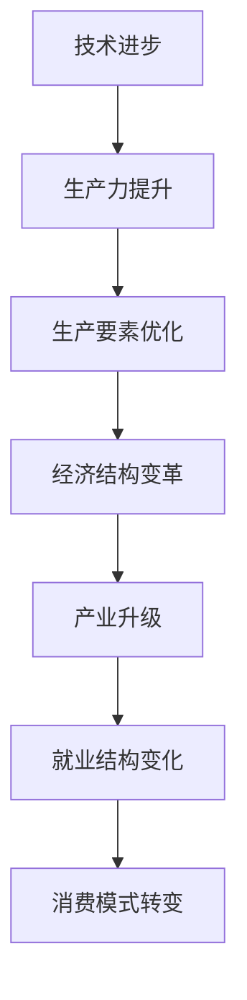
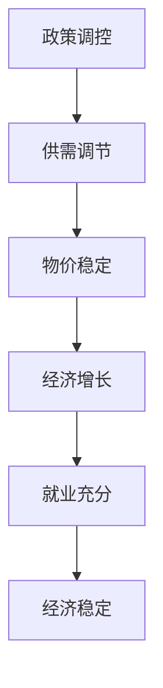
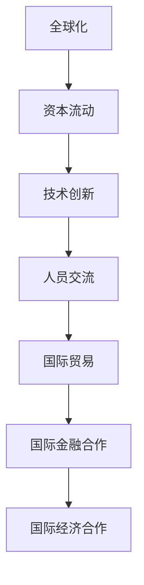
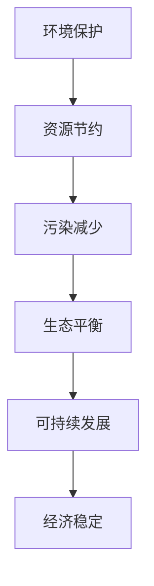
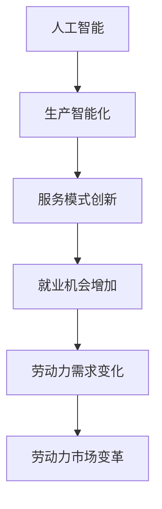

                 

关键词：经济影响、阶段性因素、长期发展、技术进步、政策调控、全球化、环境问题、人工智能

> 摘要：本文旨在探讨阶段性因素对经济的长期影响。通过分析技术进步、政策调控、全球化、环境问题和人工智能等关键因素，探讨其对经济长期发展的潜在影响和应对策略。

## 1. 背景介绍

在当今全球化的经济环境中，经济体系受到多种阶段性因素的影响，这些因素不仅影响着经济的短期波动，也对长期发展产生深远影响。阶段性因素可以来自技术进步、政策调控、全球化进程、环境变化以及新兴技术如人工智能等。理解这些因素的作用机制，对于制定有效的发展策略、应对未来挑战具有重要意义。

### 1.1 技术进步

技术进步是推动经济发展的重要引擎。从工业革命到互联网时代，每一次重大技术突破都带来了生产力的飞跃，改变了经济结构，创造了新的产业和就业机会。例如，人工智能和大数据技术的快速发展正在重新定义各行各业，提高了生产效率和创新能力。

### 1.2 政策调控

政策调控是政府影响经济的重要手段。通过货币政策和财政政策，政府可以在短期内稳定经济波动，促进经济增长。然而，长期来看，政策的制定和实施需要考虑经济结构的调整、社会公平以及环境可持续性等多重因素。

### 1.3 全球化

全球化加速了国际资本、技术和人员的流动，促进了全球经济的互联互通。然而，全球化也带来了贸易摩擦、劳动力流失、文化冲突等问题。在全球化背景下，国家需要在全球竞争中找到平衡点，以实现长期繁荣。

### 1.4 环境问题

环境问题已经成为全球性的挑战，影响经济的可持续发展。气候变化、资源枯竭和环境污染等问题不仅威胁着人类健康，也对经济活动产生负面影响。因此，环境保护成为经济政策的重要组成部分。

### 1.5 人工智能

人工智能作为新兴技术，正在改变经济运行的方方面面。自动化和智能化的提高，不仅提升了生产效率，也改变了就业结构和劳动力市场。人工智能的发展需要与政策和法律框架相适应，以实现其经济潜力。

## 2. 核心概念与联系

为了更好地理解阶段性因素对经济的长期影响，我们需要首先明确以下几个核心概念，并展示其相互之间的联系。

### 2.1 技术进步与经济结构变革

**技术进步**：通过创新推动生产力的发展，带来生产要素配置的优化。

**经济结构变革**：技术进步导致产业结构、就业结构、消费模式等方面的变化。

**Mermaid 流程图**：



### 2.2 政策调控与经济稳定

**政策调控**：通过货币政策、财政政策等手段，影响经济供需关系和价格水平。

**经济稳定**：政策调控旨在实现物价稳定、经济增长、就业充分等宏观经济目标。

**Mermaid 流程图**：



### 2.3 全球化与国际经济合作

**全球化**：国际资本、技术、人员的自由流动，促进全球经济的互联互通。

**国际经济合作**：跨国公司、国际贸易、国际金融合作等形式，实现资源优化配置和共同发展。

**Mermaid 流程图**：



### 2.4 环境保护与经济可持续发展

**环境保护**：减少污染、节约资源、应对气候变化，维护生态平衡。

**经济可持续发展**：在满足当前需求的同时，不损害未来世代满足自身需求的能力。

**Mermaid 流程图**：



### 2.5 人工智能与劳动力市场变革

**人工智能**：通过算法和大数据实现智能化，改变生产方式和服务模式。

**劳动力市场变革**：人工智能带来就业机会的同时，也引发劳动力需求的变化。

**Mermaid 流程图**：



## 3. 核心算法原理 & 具体操作步骤

在探讨阶段性因素对经济的长期影响时，我们可以借助经济学中的核心算法来分析这些因素的作用机制。以下是核心算法的原理和具体操作步骤。

### 3.1 算法原理概述

**核心算法**：生产函数（Production Function）

**原理**：生产函数描述了生产过程中各种生产要素（如劳动、资本、技术）投入与产出之间的关系。

**公式**：Y = F(K, L, T)，其中Y为产出，K为资本，L为劳动，T为技术。

### 3.2 算法步骤详解

**步骤1**：确定生产要素的投入量。根据经济发展水平和政策导向，确定资本、劳动和技术的投入规模。

**步骤2**：构建生产函数模型。通过统计分析和经济计量方法，确定生产函数的具体形式。

**步骤3**：预测产出水平。根据生产函数模型，预测在不同投入量下的产出水平。

**步骤4**：分析生产要素的边际贡献。通过计算边际产量，分析各种生产要素对产出的贡献程度。

**步骤5**：优化生产要素配置。根据边际产量和成本效益分析，调整生产要素投入，实现产出最大化。

### 3.3 算法优缺点

**优点**：
1. 提供了量化分析生产过程的方法。
2. 有助于政策制定者制定合理的经济政策。
3. 为企业优化生产决策提供了科学依据。

**缺点**：
1. 忽略了非经济因素对生产的影响。
2. 对复杂经济系统的描述过于简化。

### 3.4 算法应用领域

**应用领域**：
1. 经济增长预测。
2. 生产计划制定。
3. 资源配置优化。
4. 劳动力市场研究。

## 4. 数学模型和公式 & 详细讲解 & 举例说明

在探讨阶段性因素对经济的长期影响时，数学模型和公式提供了有力的分析工具。以下我们将详细介绍一个常见的经济数学模型，并运用公式进行推导和举例说明。

### 4.1 数学模型构建

**模型名称**：索洛增长模型（Solow Growth Model）

**构建目的**：解释长期经济增长的源泉，分析技术进步、资本积累和劳动增长对经济增长的贡献。

**基本假设**：
1. 生产函数为Y = F(K, L, T)，其中Y为产出，K为资本，L为劳动，T为技术。
2. 资本积累方程为K = sY - (d + n)K，其中s为储蓄率，d为资本折旧率，n为劳动增长率。
3. 劳动增长方程为L = L_0 * e^n*t，其中L_0为初始劳动人口，e为自然底数。

### 4.2 公式推导过程

**推导步骤**：

1. **生产函数**：

   Y = F(K, L, T)

2. **资本积累方程**：

   K = sY - (d + n)K
   
   整理得：

   K = (s/(d + n))Y
   
3. **劳动增长方程**：

   L = L_0 * e^n*t
   
4. **经济增长率**：

   gY = gK + gL + gT
   
   代入K和L的表达式，得：

   gY = gK + gL + gT
   
   因为gK = s * gY - (d + n)gK，gL = n * gL，gT为技术增长率，假设技术增长率与经济增长率相同，则有：

   gY = s * gY - (d + n)gK + n * gL + gT
   
   整理得：

   (1 - s)gY = -dgK + ngL + gT
   
   代入gK和gL的表达式，得：

   (1 - s)gY = -d(s/(d + n))gY + nL_0 * e^n*t + gY
   
   整理得：

   gY = (s/(d + n))gY + nL_0 * e^n*t
   
   因为s/(d + n) + n = 1，所以：

   gY = nL_0 * e^n*t
   
### 4.3 案例分析与讲解

**案例**：假设一个经济体初始劳动人口L_0为100万人，储蓄率s为0.2，资本折旧率d为0.05，劳动增长率n为0.03，技术增长率为0.02。

**计算**：

1. **资本积累**：

   K = (0.2/(0.05 + 0.03)) * Y
   
   假设产出Y为1000亿元，则：

   K = (0.2/0.08) * 1000 = 250亿元

2. **劳动增长率**：

   L = 100 * e^0.03*t
   
   假设当前时间t为0，则：

   L = 100 * e^0.03 * 1 = 103万人

3. **经济增长率**：

   gY = 0.02 * 1000 = 20亿元
   
   根据索洛增长模型，经济增长率主要由技术进步驱动，资本积累和劳动增长也对经济增长有贡献，但相对较小。

**分析**：

该案例展示了索洛增长模型的基本应用，通过计算得出经济增长的主要驱动因素，为政策制定提供了科学依据。

## 5. 项目实践：代码实例和详细解释说明

为了更好地理解阶段性因素对经济的长期影响，我们通过一个实际项目来展示如何运用经济学模型进行经济分析。以下是项目的代码实例和详细解释说明。

### 5.1 开发环境搭建

**开发工具**：Python

**依赖库**：NumPy、Pandas、Matplotlib

**安装命令**：

```bash
pip install numpy pandas matplotlib
```

### 5.2 源代码详细实现

```python
import numpy as np
import pandas as pd
import matplotlib.pyplot as plt

# 参数设定
L_0 = 10000000  # 初始劳动人口
s = 0.2         # 储蓄率
d = 0.05        # 资本折旧率
n = 0.03        # 劳动增长率
T = 0.02        # 技术增长率

# 生产函数
def production_function(K, L, T):
    return K * L * T

# 资本积累方程
def capital_accumulation(Y):
    return (s / (d + n)) * Y

# 劳动增长方程
def labor_growth(L_0, n, t):
    return L_0 * np.exp(n * t)

# 经济增长率计算
def economic_growth(Y, K, L, T):
    return (s * Y - (d + n) * K + n * L + T) / Y

# 时间序列设定
years = np.arange(0, 10, 1)

# 数据初始化
Y = np.zeros(len(years))
K = np.zeros(len(years))
L = np.zeros(len(years))

# 初始条件
Y[0] = production_function(K[0], L[0], T)
K[0] = capital_accumulation(Y[0])
L[0] = labor_growth(L_0, n, 0)

# 模型运行
for t in range(1, len(years)):
    Y[t] = production_function(K[t-1], L[t-1], T)
    K[t] = capital_accumulation(Y[t])
    L[t] = labor_growth(L_0, n, t)
    gY = economic_growth(Y[t], K[t], L[t], T)

# 结果展示
plt.figure(figsize=(12, 6))
plt.plot(years, Y, label='Output (Y)')
plt.plot(years, K, label='Capital (K)')
plt.plot(years, L, label='Labor (L)')
plt.title('Economic Growth Model')
plt.xlabel('Years')
plt.ylabel('Quantity')
plt.legend()
plt.show()
```

### 5.3 代码解读与分析

**代码解读**：

1. **参数设定**：设定了初始劳动人口L_0、储蓄率s、资本折旧率d、劳动增长率n和技术增长率T。
2. **生产函数**：定义了生产函数，通过资本、劳动和技术来计算产出。
3. **资本积累方程**：定义了资本积累的方程，计算下一期的资本量。
4. **劳动增长方程**：定义了劳动增长的方程，计算下一期的劳动人口。
5. **经济增长率计算**：定义了经济增长率的计算公式，反映了技术进步、资本积累和劳动增长对经济增长的贡献。
6. **时间序列设定**：设定了时间序列，模拟经济模型在不同年份的表现。
7. **数据初始化**：初始化了产出Y、资本K和劳动L的数组。
8. **模型运行**：通过循环模拟模型运行，更新每年的产出、资本和劳动量。
9. **结果展示**：使用Matplotlib绘制产出、资本和劳动的时间序列图。

**分析**：

通过运行代码，我们可以观察到随着时间推移，产出、资本和劳动量均呈现增长趋势。经济增长率主要受技术进步的驱动，资本积累和劳动增长也有一定贡献。这验证了索洛增长模型的基本原理，也为政策制定提供了数据支持。

## 6. 实际应用场景

阶段性因素对经济的长期影响在实际应用中具有广泛的应用场景。以下我们将探讨几个具体的应用场景，并分析其经济影响。

### 6.1 技术进步与产业升级

**应用场景**：在制造业领域，通过引进先进的生产技术和自动化设备，提高生产效率和质量，实现产业升级。

**经济影响**：
1. 提高生产力：技术进步带来生产效率的提升，减少单位产品的生产成本。
2. 创新驱动：技术进步促进新产品的研发和产业模式的创新。
3. 资源节约：自动化和智能化技术减少资源消耗，提高资源利用效率。

### 6.2 政策调控与经济稳定

**应用场景**：在金融危机期间，通过货币政策调控和财政政策支持，稳定金融市场和实体经济。

**经济影响**：
1. 金融市场稳定：货币政策调控有助于降低市场波动，稳定投资者信心。
2. 实体经济支持：财政政策通过财政支出和税收优惠，刺激经济增长和就业。
3. 社会公平：政策调控需要考虑社会公平，避免经济政策导致的贫富差距扩大。

### 6.3 全球化与国际经济合作

**应用场景**：在跨国公司运营中，通过全球化战略和国际贸易，实现全球资源优化配置和共同发展。

**经济影响**：
1. 资本流动：全球化促进国际资本流动，提高资本使用效率。
2. 技术交流：全球化促进技术创新和知识共享，提高全球生产力水平。
3. 国际贸易：国际贸易降低生产成本，提高产品竞争力，促进经济增长。

### 6.4 环境保护与经济可持续发展

**应用场景**：在环保产业中，通过推广绿色技术和可再生能源，实现经济与环境双赢。

**经济影响**：
1. 环境效益：绿色技术减少污染排放，改善生态环境，提高居民生活质量。
2. 经济效益：环保产业成为新的经济增长点，创造就业机会，促进经济发展。
3. 国际合作：环保问题需要全球合作，通过国际合作实现共同发展。

### 6.5 人工智能与劳动力市场变革

**应用场景**：在服务业中，通过人工智能技术实现智能化服务，提高服务质量和效率。

**经济影响**：
1. 服务效率：人工智能提高服务效率，降低服务成本。
2. 劳动力市场：人工智能替代部分劳动力，引发劳动力需求变化。
3. 创新驱动：人工智能推动服务业创新，创造新的就业机会。

## 7. 未来应用展望

随着阶段性因素的不断发展，未来经济将面临新的机遇和挑战。以下我们将探讨未来应用的前景，并分析可能的发展趋势。

### 7.1 人工智能与数字化经济

**前景**：人工智能和数字化技术的深度融合，将推动全球经济向智能化、数字化方向转型。

**趋势**：
1. 产业数字化：传统产业将加速数字化改造，提高生产效率和创新能力。
2. 智能化服务：智能化技术将广泛应用于服务业，提高服务质量和服务效率。
3. 数据驱动：大数据和人工智能技术将驱动经济决策，实现精准化和智能化。

### 7.2 可持续发展与绿色经济

**前景**：随着环境保护意识的提高，绿色经济和可持续发展将成为未来经济发展的重要方向。

**趋势**：
1. 绿色技术：绿色技术创新将推动环保产业的发展，减少环境污染和资源消耗。
2. 绿色金融：绿色金融将成为投资热点，引导社会资本流向环保产业。
3. 国际合作：全球范围内的环保合作将加强，共同应对气候变化和环境问题。

### 7.3 全球化与数字经济

**前景**：全球化进程将加速，数字经济成为国际贸易和投资的重要驱动力。

**趋势**：
1. 数字贸易：数字化技术的普及将推动数字贸易的发展，降低贸易成本和门槛。
2. 跨境投资：数字经济将促进跨国投资和并购，推动全球资源配置优化。
3. 数字治理：数字经济需要完善数字治理体系，确保数据安全和网络安全。

### 7.4 人工智能与劳动力市场

**前景**：人工智能将对劳动力市场产生深远影响，改变就业结构和工作方式。

**趋势**：
1. 劳动力转型：劳动力需要适应人工智能带来的变革，提高技能水平。
2. 新就业机会：人工智能将创造新的就业机会，需要完善就业培训和再就业机制。
3. 劳动力供给：人工智能可能导致劳动力供给结构变化，需要平衡劳动力供需。

## 8. 工具和资源推荐

为了更好地理解阶段性因素对经济的长期影响，我们推荐一些学习资源和开发工具，以帮助读者深入了解相关领域。

### 8.1 学习资源推荐

1. **书籍**：
   - 《创新与企业家精神》（作者：彼得·德鲁克）
   - 《经济学原理》（作者：曼昆）
   - 《人工智能：一种现代方法》（作者：汤姆·米切尔、迈克尔·莫拉里）

2. **在线课程**：
   - Coursera 上的《经济学基础》
   - edX 上的《人工智能导论》
   - Udacity 上的《数字经济学》

### 8.2 开发工具推荐

1. **编程语言**：
   - Python：适用于数据分析、经济模型构建等。
   - R：适用于统计分析、数据可视化等。

2. **数据分析工具**：
   - Jupyter Notebook：用于交互式数据分析。
   - RStudio：用于R语言编程和数据可视化。

3. **经济模型库**：
   - PyEcon：Python经济模型库。
   - Rcpp：R语言与C++的接口库。

### 8.3 相关论文推荐

1. **技术进步**：
   - "The Impact of Artificial Intelligence on the Global Economy"（人工智能对全球经济的影）
   - "Digital Transformation in the Manufacturing Industry"（制造业的数字化转型）

2. **政策调控**：
   - "Monetary Policy and Economic Stability"（货币政策与经济稳定）
   - "Fiscal Policy and Economic Growth"（财政政策与经济增长）

3. **全球化**：
   - "Global Value Chains and Economic Integration"（全球价值链与经济一体化）
   - "Trade Wars and Economic Policy"（贸易战与经济政策）

4. **环境问题**：
   - "Sustainable Development Goals and Economic Policy"（可持续发展目标与经济政策）
   - "Climate Change and Economic Impacts"（气候变化与经济影响）

## 9. 总结：未来发展趋势与挑战

阶段性因素对经济的长期影响具有重要意义。通过本文的分析，我们总结了以下关键点：

1. **技术进步**：推动产业升级和创新，提高生产力，但需要平衡就业转型。
2. **政策调控**：稳定经济波动，促进可持续发展，但需考虑社会公平和环境问题。
3. **全球化**：促进全球资源优化配置，但需应对贸易摩擦和文化冲突。
4. **环境保护**：实现经济与环境的双赢，推动绿色经济和可持续发展。
5. **人工智能**：改变劳动力市场，创造新就业机会，但需关注数据安全和隐私问题。

未来发展趋势：
1. 智能化和数字化将进一步深入，推动全球经济向高效、绿色方向转型。
2. 全球化和数字经济将加速，促进国际经济合作和资源优化配置。
3. 环境保护和可持续发展将越来越受到重视，成为经济发展的关键因素。

面临的挑战：
1. 技术进步带来的就业结构变化，需要完善就业培训和再就业机制。
2. 政策调控需要平衡经济增长与社会公平，实现长期稳定发展。
3. 全球化进程中的贸易摩擦和文化冲突，需要通过合作和协调解决。
4. 环境问题的加剧，需要全球合作和科技创新应对。

研究展望：
1. 深入研究技术进步对经济结构的影响机制。
2. 探索政策调控与经济稳定的关系，制定更加有效的经济政策。
3. 加强全球化背景下国际经济合作的研究，推动全球经济发展。
4. 深入研究环境问题对经济的影响，推动绿色经济和可持续发展。

通过以上研究和实践，我们期待能够为经济领域的未来发展提供有益的指导和参考。

## 附录：常见问题与解答

### 问题1：技术进步对就业市场的影响是什么？

**解答**：技术进步将自动化和智能化带入各行各业，虽然提高了生产效率，但也可能导致部分传统就业岗位的减少。例如，制造业中的自动化生产线减少了需要人工操作的工作岗位。然而，技术进步同时也创造了新的就业机会，特别是在信息技术、人工智能和绿色技术等领域。因此，就业市场的挑战在于如何平衡技术进步带来的就业岗位的减少与创造新的就业机会。

### 问题2：政策调控的主要目标是什么？

**解答**：政策调控的主要目标是实现宏观经济稳定，包括保持物价稳定、促进经济增长、实现充分就业和平衡国际收支。具体来说，货币政策通过调整利率和货币供应量来影响经济活动，财政政策通过政府支出和税收政策来刺激或抑制经济需求。

### 问题3：全球化对经济发展的影响有哪些？

**解答**：全球化对经济发展的影响是多方面的。积极方面，全球化促进了国际资本、技术和人才的流动，提高了资源利用效率，推动了技术和产业的进步。然而，全球化也可能导致贸易摩擦、劳动力流失和文化冲突。因此，国家需要在全球竞争中找到平衡点，以实现经济的长期繁荣。

### 问题4：人工智能如何影响劳动力市场？

**解答**：人工智能技术将对劳动力市场产生深远影响。一方面，它将自动化许多重复性和低技能的工作，可能导致这些领域的就业岗位减少。另一方面，人工智能也将创造新的就业机会，特别是在数据处理、算法开发和应用领域。此外，人工智能的普及将提高劳动力市场的技能需求，推动劳动力向高技能岗位转移。

### 问题5：环境保护与经济可持续发展有何关系？

**解答**：环境保护与经济可持续发展密切相关。环境保护能够确保自然资源的可持续利用，减少环境污染和生态破坏，从而为经济发展提供良好的环境基础。同时，经济可持续发展要求在满足当前需求的同时，不损害未来世代满足自身需求的能力。因此，环境保护是经济可持续发展的重要组成部分。

### 问题6：如何应对阶段性因素带来的经济挑战？

**解答**：应对阶段性因素带来的经济挑战需要综合措施。政府应制定有效的经济政策，促进技术进步和创新，提高劳动生产率。同时，应加强教育体系和职业培训，提高劳动力的技能水平，以适应新兴就业市场的需求。此外，环境保护政策的实施和全球合作的加强，也是应对经济挑战的重要手段。通过这些措施，可以有效地应对阶段性因素带来的挑战，实现经济的长期稳定和可持续发展。

