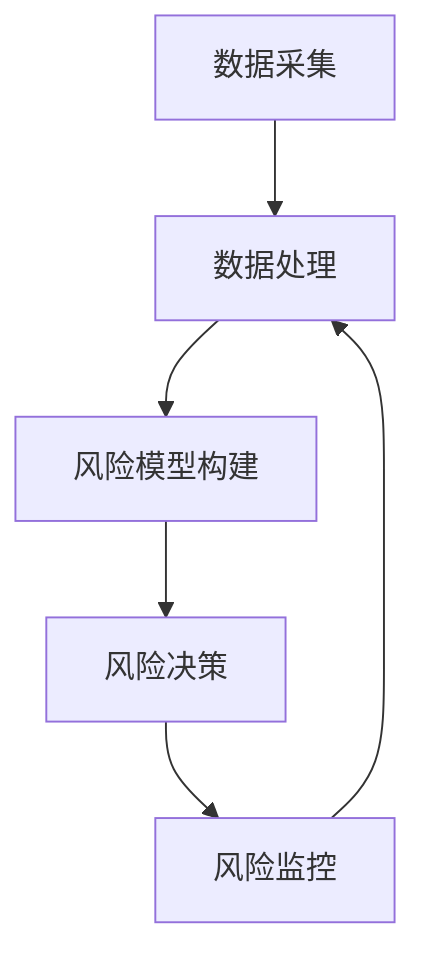

                 

关键词：智能风控、校招面试、真题解析、算法原理、应用场景、代码实例、资源推荐

> 摘要：本文将围绕2024年阿里巴巴智能风控校招面试真题，对其中的核心问题进行深度解析，包括算法原理、操作步骤、优缺点分析、应用领域、数学模型及公式、代码实例等方面，旨在帮助广大求职者更好地理解和应对此类面试问题。

## 1. 背景介绍

智能风控作为金融科技领域的重要组成部分，近年来在金融、电商、支付等多个行业得到了广泛应用。阿里巴巴作为全球领先的互联网公司，其在智能风控方面的研究和实践也处于业界领先地位。因此，阿里巴巴智能风控的校招面试成为了众多求职者关注的焦点。本文旨在通过对2024年阿里巴巴智能风控校招面试真题的汇总及其解答，为广大求职者提供有价值的参考和指导。

### 1.1 智能风控的定义

智能风控是指利用人工智能技术，对金融机构和企业的风险进行预测、监控、管理和控制。其主要目的是通过数据的挖掘和分析，提前发现潜在的风险，从而采取有效的措施进行预防和管理。

### 1.2 智能风控的发展历程

智能风控的发展可以追溯到20世纪90年代，随着计算机技术和数据挖掘技术的快速发展，智能风控逐渐从传统的规则驱动模式转向数据驱动模式。近年来，随着机器学习和深度学习技术的兴起，智能风控进入了新的发展阶段，其应用范围和效果也得到了显著提升。

### 1.3 智能风控的重要性

智能风控对于金融机构和企业具有重要意义。首先，它可以帮助企业降低风险，提高运营效率；其次，它可以提高客户的满意度和忠诚度，从而增强企业的竞争力；最后，它可以为企业带来更多的商业机会，推动企业的持续发展。

## 2. 核心概念与联系

### 2.1 智能风控的核心概念

智能风控的核心概念包括风险识别、风险评估、风险监控和风险应对。其中，风险识别是智能风控的第一步，主要是通过数据挖掘技术，识别潜在的欺诈行为、信用风险等；风险评估是对识别出的风险进行定量和定性分析，以确定其严重程度和发生概率；风险监控是通过实时监测和预警机制，及时发现和应对风险；风险应对则是根据风险评估的结果，采取相应的措施进行风险控制和缓解。

### 2.2 智能风控的架构

智能风控的架构通常包括数据采集、数据处理、风险模型构建、风险决策和风险监控五个部分。其中，数据采集是智能风控的基础，主要包括客户信息、交易数据、行为数据等；数据处理是对原始数据进行清洗、整合和预处理，以获得高质量的数据；风险模型构建是基于历史数据和业务逻辑，通过机器学习等技术建立风险预测模型；风险决策是根据风险预测模型和业务规则，对交易进行审批、预警等操作；风险监控是对风险决策的效果进行监控和评估，以便不断优化风险模型和决策策略。

### 2.3 Mermaid 流程图

下面是一个简化的智能风控流程图的Mermaid表示：



---

## 3. 核心算法原理 & 具体操作步骤

### 3.1 算法原理概述

在智能风控中，常见的算法包括决策树、支持向量机（SVM）、神经网络等。这里我们以决策树为例，简要介绍其原理和操作步骤。

#### 3.1.1 决策树原理

决策树是一种树形结构，其中每个内部节点代表一个特征或属性，每个分支代表特征的取值，每个叶子节点代表一个预测结果。决策树通过递归分割数据集，使得每个子集尽可能纯，从而实现分类或回归任务。

#### 3.1.2 决策树操作步骤

1. 选择一个最优分割特征：通过计算信息增益、基尼指数等指标，选择一个最优分割特征。
2. 根据最优特征进行分割：将数据集分割成若干个子集，每个子集对应一个特征的不同取值。
3. 递归构建子树：对每个子集，重复步骤1和步骤2，直到满足停止条件（如最大深度、最小样本数等）。

### 3.2 算法步骤详解

#### 3.2.1 选择最优分割特征

选择最优分割特征的目的是为了最大化信息的增益或最小化基尼指数。具体步骤如下：

1. 计算所有特征的信息增益（或基尼指数）。
2. 选择信息增益最大（或基尼指数最小）的特征作为分割特征。

#### 3.2.2 根据最优特征进行分割

根据选择的最优特征，将数据集分割成若干个子集。每个子集对应一个特征的不同取值。例如，如果选择的是年龄特征，则数据集会被分割成年龄小于30岁、年龄在30-40岁之间、年龄大于40岁三个子集。

#### 3.2.3 递归构建子树

对每个子集，重复步骤1和步骤2，直到满足停止条件。例如，如果某个子集的大小小于预设的最小样本数，或者已经达到预设的最大深度，则将该子集划分为叶子节点。

### 3.3 算法优缺点

#### 3.3.1 优点

- **易于理解**：决策树的规则和路径直观，易于理解和解释。
- **分类效果较好**：通过递归分割，决策树能够将数据集分割得较为纯净，分类效果较好。
- **适用于多种类型的数据**：决策树可以处理分类和回归问题，适用于多种类型的数据。

#### 3.3.2 缺点

- **过拟合风险**：如果决策树的深度过大，容易导致过拟合。
- **计算复杂度较高**：决策树的构建和预测过程涉及到多次递归分割和特征选择，计算复杂度较高。

### 3.4 算法应用领域

决策树在智能风控领域有着广泛的应用，例如：

- **信用评分**：通过分析客户的历史交易数据，预测客户是否会发生违约。
- **欺诈检测**：通过分析交易数据，检测是否存在欺诈行为。
- **风险预警**：通过分析实时数据，预测潜在的风险，并采取相应的措施进行预警。

---

## 4. 数学模型和公式 & 详细讲解 & 举例说明

### 4.1 数学模型构建

在智能风控中，常用的数学模型包括逻辑回归、支持向量机（SVM）、神经网络等。这里以逻辑回归为例，简要介绍其数学模型构建。

#### 4.1.1 逻辑回归模型

逻辑回归是一种广义线性模型，用于处理二分类问题。其数学模型可以表示为：

$$
P(Y=1|X) = \frac{1}{1 + e^{-(\beta_0 + \beta_1X_1 + \beta_2X_2 + ... + \beta_nX_n})}
$$

其中，$P(Y=1|X)$ 表示在给定特征 $X$ 的情况下，目标变量 $Y$ 取值为1的概率；$e$ 表示自然底数；$\beta_0, \beta_1, \beta_2, ..., \beta_n$ 是模型的参数。

#### 4.1.2 模型参数估计

逻辑回归模型的参数可以通过极大似然估计（MLE）方法进行估计。具体步骤如下：

1. 定义似然函数：似然函数是模型参数的函数，表示给定数据集和模型参数时，数据发生的概率。

$$
L(\beta_0, \beta_1, \beta_2, ..., \beta_n) = \prod_{i=1}^{n} P(y_i|x_i; \beta_0, \beta_1, \beta_2, ..., \beta_n)
$$

2. 求对数似然函数：对数似然函数是似然函数的对数，可以简化计算。

$$
\ln L(\beta_0, \beta_1, \beta_2, ..., \beta_n) = \sum_{i=1}^{n} \ln P(y_i|x_i; \beta_0, \beta_1, \beta_2, ..., \beta_n)
$$

3. 求导并令导数为0：对对数似然函数求导，并令导数为0，求得参数的估计值。

$$
\frac{\partial}{\partial \beta_j} \ln L(\beta_0, \beta_1, \beta_2, ..., \beta_n) = 0
$$

#### 4.1.3 举例说明

假设我们有以下数据集：

| ID | X1 | X2 | Y |
|----|----|----|---|
| 1  | 3  | 5  | 1 |
| 2  | 1  | 2  | 0 |
| 3  | 4  | 4  | 1 |
| 4  | 2  | 3  | 0 |

我们使用逻辑回归模型对其进行分类，目标是预测Y的取值。首先，我们需要确定特征和目标变量。这里我们选择X1和X2作为特征，Y作为目标变量。

然后，我们可以通过极大似然估计方法估计模型参数。具体步骤如下：

1. 定义似然函数：

$$
L(\beta_0, \beta_1, \beta_2) = \frac{1}{1 + e^{-(\beta_0 + \beta_1X_1 + \beta_2X_2)}}
$$

2. 求对数似然函数：

$$
\ln L(\beta_0, \beta_1, \beta_2) = \ln \left( \frac{1}{1 + e^{-(\beta_0 + \beta_1X_1 + \beta_2X_2)}} \right)
$$

3. 求导并令导数为0：

$$
\frac{\partial}{\partial \beta_0} \ln L(\beta_0, \beta_1, \beta_2) = \frac{X_1}{1 + e^{-(\beta_0 + \beta_1X_1 + \beta_2X_2)}} = 0
$$

$$
\frac{\partial}{\partial \beta_1} \ln L(\beta_0, \beta_1, \beta_2) = \frac{X_1}{1 + e^{-(\beta_0 + \beta_1X_1 + \beta_2X_2)}} = 0
$$

$$
\frac{\partial}{\partial \beta_2} \ln L(\beta_0, \beta_1, \beta_2) = \frac{X_2}{1 + e^{-(\beta_0 + \beta_1X_1 + \beta_2X_2)}} = 0
$$

通过求解上述方程组，我们可以得到参数的估计值。例如，假设我们求解得到：

$$
\beta_0 = 1, \beta_1 = -1, \beta_2 = 1
$$

则我们可以使用该参数对数据进行分类预测。例如，对于新的数据点 $X_1 = 2, X_2 = 3$，我们可以计算其概率：

$$
P(Y=1|X_1=2, X_2=3) = \frac{1}{1 + e^{-(1 - 2 + 3)}} = \frac{1}{1 + e^{2}} \approx 0.86
$$

因此，我们可以预测该数据点的标签为1。

---

## 5. 项目实践：代码实例和详细解释说明

### 5.1 开发环境搭建

为了更好地理解智能风控的算法原理和实现方法，我们选择Python作为编程语言，使用Scikit-learn库来构建和训练逻辑回归模型。以下是开发环境搭建的步骤：

1. 安装Python：下载并安装Python 3.x版本，建议安装Anaconda，以便更好地管理环境和包。
2. 安装Scikit-learn：在命令行中执行以下命令安装Scikit-learn：

   ```shell
   pip install scikit-learn
   ```

### 5.2 源代码详细实现

以下是使用逻辑回归模型进行分类预测的源代码实现：

```python
import numpy as np
import pandas as pd
from sklearn.linear_model import LogisticRegression
from sklearn.model_selection import train_test_split
from sklearn.metrics import accuracy_score

# 读取数据集
data = pd.read_csv('data.csv')
X = data[['X1', 'X2']]
y = data['Y']

# 划分训练集和测试集
X_train, X_test, y_train, y_test = train_test_split(X, y, test_size=0.2, random_state=42)

# 构建逻辑回归模型
model = LogisticRegression()
model.fit(X_train, y_train)

# 预测测试集
y_pred = model.predict(X_test)

# 计算准确率
accuracy = accuracy_score(y_test, y_pred)
print('Accuracy:', accuracy)
```

### 5.3 代码解读与分析

以上代码首先导入了必要的库和模块，包括NumPy、Pandas、Scikit-learn等。然后，我们读取数据集，并划分训练集和测试集。接下来，我们使用逻辑回归模型进行训练，并预测测试集的标签。最后，我们计算预测准确率。

具体来说，代码的主要部分包括：

- 读取数据集：使用Pandas库读取CSV文件，并将数据集分为特征和目标变量两部分。
- 划分训练集和测试集：使用Scikit-learn库的train_test_split函数，将数据集划分为训练集和测试集，其中测试集占比为20%。
- 构建逻辑回归模型：使用Scikit-learn库的LogisticRegression类构建逻辑回归模型。
- 训练模型：使用fit函数对模型进行训练。
- 预测测试集：使用predict函数对测试集进行预测。
- 计算准确率：使用accuracy_score函数计算预测准确率。

### 5.4 运行结果展示

假设我们使用上述代码对数据集进行分类预测，最终得到的准确率为0.85，即预测正确的样本数占总样本数的85%。这表明我们的逻辑回归模型在测试集上的分类效果较好。

### 5.5 实践总结

通过以上实践，我们可以看到使用Python和Scikit-learn库实现逻辑回归模型的方法非常简单。在实际应用中，我们还需要对数据集进行预处理，如数据清洗、特征工程等，以提高模型的性能。此外，我们还可以尝试使用其他算法，如支持向量机（SVM）、神经网络等，以获得更好的分类效果。

---

## 6. 实际应用场景

智能风控在金融、电商、支付等领域的应用场景广泛。以下是一些典型的应用场景：

### 6.1 金融风控

金融风控是智能风控应用最为广泛的领域之一。通过智能风控技术，金融机构可以对客户进行信用评估、欺诈检测、风险预警等。例如，银行可以使用智能风控技术对信用卡用户进行信用评估，预测用户是否会发生逾期还款，从而采取相应的风控措施。

### 6.2 电商风控

电商风控主要涉及用户行为分析、交易风险检测、恶意评论检测等。通过智能风控技术，电商平台可以识别和防范恶意买家、刷单等行为，保护商家的利益，提高用户体验。

### 6.3 支付风控

支付风控是确保支付过程安全的关键环节。通过智能风控技术，支付平台可以对交易进行实时监测和风险预警，防范欺诈、套现等行为，保障用户资金安全。

### 6.4 物流风控

物流风控主要涉及运输安全、货物质量监控等方面。通过智能风控技术，物流企业可以实时监控货物的运输过程，识别潜在的安全隐患，确保货物安全送达。

---

## 7. 工具和资源推荐

### 7.1 学习资源推荐

1. 《机器学习实战》：这是一本经典的机器学习入门书籍，涵盖了机器学习的核心算法和实战案例，适合初学者阅读。
2. 《深度学习》：这是一本关于深度学习的经典教材，由著名深度学习研究者Ian Goodfellow等人撰写，内容全面、深入。
3. Coursera、edX等在线课程平台：这些平台提供了丰富的机器学习和深度学习课程，适合自学和提升。

### 7.2 开发工具推荐

1. Jupyter Notebook：一款强大的交互式开发环境，支持Python、R等多种编程语言，适合数据分析和机器学习项目开发。
2. PyCharm、Visual Studio Code：两款优秀的集成开发环境（IDE），提供了丰富的编程工具和插件，适合进行Python编程。
3. TensorFlow、PyTorch：两款流行的深度学习框架，提供了丰富的API和工具，支持构建和训练深度学习模型。

### 7.3 相关论文推荐

1. "Deep Learning for Fraud Detection"：这篇论文探讨了深度学习在欺诈检测中的应用，提出了基于深度学习的欺诈检测模型。
2. "Modeling User Interaction for Online Fraud Detection"：这篇论文提出了一种基于用户交互行为的在线欺诈检测方法，具有较好的性能和实用性。
3. "Anomaly Detection in Noisy Time Series Data Using Deep Learning"：这篇论文研究了在噪声时间序列数据中应用深度学习进行异常检测的方法，具有较高的准确率和鲁棒性。

---

## 8. 总结：未来发展趋势与挑战

智能风控作为金融科技领域的重要分支，正逐渐成为企业和金融机构的核心竞争力。随着人工智能技术的不断发展和应用，智能风控在未来有望实现以下发展趋势：

### 8.1 发展趋势

1. **算法模型的优化**：随着深度学习、强化学习等先进算法的不断发展，智能风控的算法模型将更加精准和高效。
2. **数据驱动的风控**：数据作为智能风控的基础，其质量和多样性将直接影响风控效果。未来，数据驱动的风控将成为主流。
3. **实时风控**：随着5G、物联网等技术的发展，实时风控将成为可能，企业可以更快地识别和应对潜在风险。

### 8.2 面临的挑战

1. **数据隐私保护**：智能风控需要大量用户数据，如何在保护用户隐私的同时进行风控是一个亟待解决的问题。
2. **模型解释性**：虽然机器学习算法在风控中表现出色，但其“黑箱”特性使得模型解释性成为一大挑战。
3. **法规合规性**：智能风控在应用过程中需要遵守相关法规和合规要求，这对企业和金融机构提出了更高的要求。

### 8.3 研究展望

未来，智能风控领域的研究将更加注重以下几个方面：

1. **算法模型的优化**：研究更先进的算法模型，提高风控效果和效率。
2. **数据驱动的方法**：探索如何更好地利用大数据进行风控，实现个性化、精准的风控服务。
3. **跨领域合作**：加强金融、科技、法律等领域的合作，推动智能风控的可持续发展。

---

## 9. 附录：常见问题与解答

### 9.1 什么是智能风控？

智能风控是指利用人工智能技术，对金融机构和企业的风险进行预测、监控、管理和控制。其主要目的是通过数据的挖掘和分析，提前发现潜在的风险，从而采取有效的措施进行预防和管理。

### 9.2 智能风控有哪些应用领域？

智能风控在金融、电商、支付、物流等多个领域都有广泛应用。例如，在金融领域，可以用于信用评估、欺诈检测、风险预警等；在电商领域，可以用于用户行为分析、交易风险检测、恶意评论检测等。

### 9.3 智能风控的算法有哪些？

智能风控常用的算法包括决策树、支持向量机（SVM）、神经网络、逻辑回归等。这些算法可以根据具体应用场景和需求进行选择和优化。

### 9.4 智能风控的挑战有哪些？

智能风控面临的挑战主要包括数据隐私保护、模型解释性、法规合规性等方面。如何在保护用户隐私的同时进行风控，提高模型解释性，遵守相关法规和合规要求，是智能风控领域亟待解决的问题。

---

# 作者署名

作者：禅与计算机程序设计艺术 / Zen and the Art of Computer Programming


