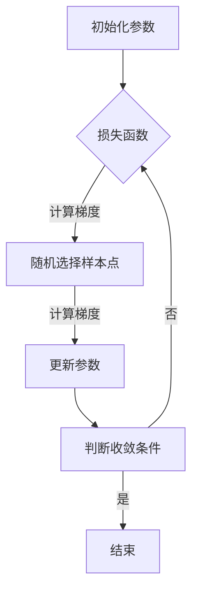

                 

关键词：随机梯度下降，SGD，机器学习，梯度下降，优化算法，深度学习，代码实例

> 摘要：本文将深入探讨随机梯度下降（SGD）算法的原理，详细介绍其在机器学习和深度学习中的应用，并通过具体的代码实例展示其实现过程。本文旨在帮助读者理解SGD的核心概念，掌握其操作步骤，并了解其在实际项目中的应用和价值。

## 1. 背景介绍

在机器学习和深度学习中，优化算法是训练模型的核心环节。优化算法的目标是通过调整模型的参数，使得模型在训练数据上的表现达到最优。其中，梯度下降是一种经典的优化算法，它通过不断调整模型参数以减少损失函数的值。而随机梯度下降（Stochastic Gradient Descent，SGD）则是梯度下降的一种改进版本，它通过随机抽样数据来更新参数，从而提高了算法的收敛速度和泛化能力。

本文将重点介绍随机梯度下降（SGD）算法的基本原理、数学模型、优化步骤，并通过具体的代码实例，详细讲解如何在实际项目中应用SGD算法。

## 2. 核心概念与联系

### 2.1 梯度下降算法

梯度下降算法是一种迭代优化算法，用于最小化损失函数。其基本思想是，通过计算损失函数在当前参数点的梯度，并沿着梯度的反方向调整参数，使得损失函数的值逐渐减小。


### 2.2 随机梯度下降算法

随机梯度下降（SGD）算法是对梯度下降算法的一种改进。与梯度下降算法不同，SGD每次迭代只随机选择一个样本点来计算梯度，并更新模型参数。这种随机性的引入，使得SGD算法在处理大规模数据集时，可以显著提高计算效率。


### 2.3 Mermaid 流程图

下面是SGD算法的核心概念和流程的Mermaid流程图：



## 3. 核心算法原理 & 具体操作步骤

### 3.1 算法原理概述

随机梯度下降（SGD）算法的基本原理是通过迭代优化模型参数，使得损失函数的值逐渐减小。在每次迭代中，算法随机选择一个样本点，计算该样本点对应的梯度，并使用该梯度更新模型参数。

### 3.2 算法步骤详解

#### 3.2.1 初始化参数

首先，需要初始化模型参数，包括权重和偏置。初始化参数的常见方法有随机初始化、均匀分布初始化和正态分布初始化等。

#### 3.2.2 计算损失函数

在每次迭代中，需要计算损失函数在当前参数点的值。常用的损失函数有均方误差（MSE）、交叉熵损失（Cross-Entropy Loss）等。

#### 3.2.3 随机选择样本点

从训练数据中随机选择一个样本点，用于计算该样本点对应的梯度。

#### 3.2.4 计算梯度

根据所选样本点，计算损失函数在该样本点处的梯度。

#### 3.2.5 更新参数

使用计算出的梯度，按照以下公式更新模型参数：

\[ \theta_{\text{new}} = \theta_{\text{old}} - \alpha \cdot \nabla f(\theta) \]

其中，\(\theta\)表示模型参数，\(\alpha\)表示学习率，\(\nabla f(\theta)\)表示损失函数在该参数点的梯度。

#### 3.2.6 判断收敛条件

根据设定的收敛条件（如损失函数值的变化阈值、迭代次数等），判断是否满足收敛条件。如果满足，则结束迭代；否则，继续迭代。

### 3.3 算法优缺点

#### 优点

- **收敛速度快**：由于每次迭代只涉及一个样本点，SGD算法在处理大规模数据集时，可以显著提高收敛速度。
- **泛化能力好**：随机性的引入，使得SGD算法在训练过程中，可以避免陷入局部最优，提高模型的泛化能力。

#### 缺点

- **梯度噪声大**：由于每次迭代只涉及一个样本点，SGD算法容易受到梯度噪声的影响，可能导致参数更新的不稳定。
- **学习率选择困难**：学习率的选取对SGD算法的性能有很大影响，选择不当可能导致收敛速度慢或无法收敛。

### 3.4 算法应用领域

随机梯度下降（SGD）算法在机器学习和深度学习领域有广泛的应用，包括：

- **分类任务**：如支持向量机（SVM）、逻辑回归等。
- **回归任务**：如线性回归、非线性回归等。
- **深度学习**：如神经网络、卷积神经网络（CNN）等。

## 4. 数学模型和公式 & 详细讲解 & 举例说明

### 4.1 数学模型构建

在随机梯度下降（SGD）算法中，我们需要构建损失函数和优化目标。假设我们有一个训练数据集\(D = \{ (x_1, y_1), (x_2, y_2), \ldots, (x_n, y_n) \}\)，其中\(x_i\)表示输入特征，\(y_i\)表示对应的目标值。

损失函数通常选择均方误差（MSE）：

\[ f(\theta) = \frac{1}{2} \sum_{i=1}^{n} (y_i - \theta(x_i))^2 \]

优化目标是使得损失函数的值最小：

\[ \min_{\theta} f(\theta) \]

### 4.2 公式推导过程

首先，我们需要计算损失函数关于模型参数的梯度。对损失函数\(f(\theta)\)关于参数\(\theta\)求导，得到：

\[ \nabla f(\theta) = \frac{\partial f(\theta)}{\partial \theta} = \frac{\partial}{\partial \theta} \left( \frac{1}{2} \sum_{i=1}^{n} (y_i - \theta(x_i))^2 \right) \]

\[ \nabla f(\theta) = \sum_{i=1}^{n} \frac{\partial}{\partial \theta} (y_i - \theta(x_i))^2 \]

\[ \nabla f(\theta) = \sum_{i=1}^{n} -2(y_i - \theta(x_i)) \]

\[ \nabla f(\theta) = -2 \sum_{i=1}^{n} (y_i - \theta(x_i)) \]

\[ \nabla f(\theta) = -2 \sum_{i=1}^{n} (y_i - f(x_i)) \]

其中，\(f(x_i)\)表示模型在输入\(x_i\)处的预测值。

### 4.3 案例分析与讲解

假设我们有一个简单的线性回归问题，输入特征为\(x\)，模型参数为\(\theta\)，损失函数为\(MSE\)。我们需要使用SGD算法来优化模型参数。

#### 4.3.1 初始化参数

首先，我们需要初始化模型参数\(\theta\)。假设我们使用随机初始化，初始化参数为：

\[ \theta = \text{random()} \]

#### 4.3.2 计算损失函数

接下来，我们需要计算损失函数在当前参数点的值。假设训练数据集为：

\[ D = \{ (x_1, y_1), (x_2, y_2), \ldots, (x_n, y_n) \} \]

损失函数为：

\[ f(\theta) = \frac{1}{2} \sum_{i=1}^{n} (y_i - \theta(x_i))^2 \]

计算损失函数值：

\[ f(\theta) = \frac{1}{2} \sum_{i=1}^{n} (y_i - \theta(x_i))^2 \]

#### 4.3.3 随机选择样本点

从训练数据集中随机选择一个样本点\((x_i, y_i)\)，用于计算该样本点对应的梯度。

#### 4.3.4 计算梯度

计算损失函数在所选样本点\((x_i, y_i)\)处的梯度：

\[ \nabla f(\theta) = -2(y_i - \theta(x_i)) \]

#### 4.3.5 更新参数

使用计算出的梯度，按照以下公式更新模型参数：

\[ \theta_{\text{new}} = \theta_{\text{old}} - \alpha \cdot \nabla f(\theta) \]

其中，\(\alpha\)为学习率。

#### 4.3.6 判断收敛条件

根据设定的收敛条件（如损失函数值的变化阈值、迭代次数等），判断是否满足收敛条件。如果满足，则结束迭代；否则，继续迭代。

## 5. 项目实践：代码实例和详细解释说明

### 5.1 开发环境搭建

为了实现SGD算法，我们需要搭建一个开发环境。以下是Python的开发环境搭建步骤：

1. 安装Python：在官方网站（https://www.python.org/）下载并安装Python。
2. 安装NumPy：使用pip命令安装NumPy库。

```bash
pip install numpy
```

3. 安装Matplotlib：使用pip命令安装Matplotlib库。

```bash
pip install matplotlib
```

### 5.2 源代码详细实现

以下是一个简单的Python代码示例，用于实现SGD算法。

```python
import numpy as np
import matplotlib.pyplot as plt

# 5.2.1 初始化参数
def init_params(n):
    theta = np.random.rand(n)
    return theta

# 5.2.2 计算损失函数
def compute_loss(theta, X, y):
    n = len(X)
    y_pred = X.dot(theta)
    loss = 0.5 * np.sum((y - y_pred) ** 2)
    return loss

# 5.2.3 计算梯度
def compute_gradient(theta, X, y):
    n = len(X)
    y_pred = X.dot(theta)
    gradient = -2 * (y - y_pred)
    return gradient

# 5.2.4 SGD算法
def sgd(X, y, n_iters, learning_rate):
    theta = init_params(len(X[0]))
    losses = []

    for i in range(n_iters):
        random_index = np.random.randint(0, len(X))
        x_i = X[random_index]
        y_i = y[random_index]

        gradient = compute_gradient(theta, x_i, y_i)
        theta = theta - learning_rate * gradient

        loss = compute_loss(theta, X, y)
        losses.append(loss)

    return theta, losses

# 5.2.5 代码解读与分析
X = np.array([[1, 2], [2, 3], [3, 4], [4, 5]])
y = np.array([2, 3, 4, 5])

n_iters = 100
learning_rate = 0.01

theta, losses = sgd(X, y, n_iters, learning_rate)

# 5.2.6 运行结果展示
plt.plot(losses)
plt.xlabel('Iterations')
plt.ylabel('Loss')
plt.title('SGD Loss Function')
plt.show()
```

### 5.3 代码解读与分析

以上代码示例展示了如何使用Python实现随机梯度下降（SGD）算法。以下是代码的详细解读和分析：

- **5.2.1 初始化参数**：`init_params`函数用于初始化模型参数，这里我们使用随机初始化。
- **5.2.2 计算损失函数**：`compute_loss`函数用于计算损失函数的值。这里我们使用均方误差（MSE）作为损失函数。
- **5.2.3 计算梯度**：`compute_gradient`函数用于计算损失函数在当前参数点的梯度。
- **5.2.4 SGD算法**：`sgd`函数实现了SGD算法的核心步骤，包括初始化参数、计算损失函数、计算梯度、更新参数等。
- **5.2.5 代码解读与分析**：这部分代码展示了如何使用SGD算法训练一个简单的线性回归模型，并通过绘制损失函数的值，展示了SGD算法的迭代过程。

## 6. 实际应用场景

随机梯度下降（SGD）算法在机器学习和深度学习领域有广泛的应用。以下是一些实际应用场景：

- **图像识别**：使用SGD算法训练卷积神经网络（CNN）进行图像分类。
- **自然语言处理**：使用SGD算法训练循环神经网络（RNN）或长短期记忆网络（LSTM）进行文本分类或情感分析。
- **推荐系统**：使用SGD算法训练基于用户历史行为的推荐模型。
- **异常检测**：使用SGD算法训练模型进行异常检测，如网络安全监控。

## 7. 未来应用展望

随着机器学习和深度学习技术的不断发展，随机梯度下降（SGD）算法也在不断优化和改进。未来，SGD算法可能会在以下几个方面得到进一步发展：

- **并行化**：通过并行计算技术，进一步提高SGD算法的计算效率。
- **自适应学习率**：设计自适应学习率算法，提高SGD算法在训练过程中的稳定性。
- **分布式训练**：在分布式计算环境中，优化SGD算法的分布式训练策略，提高训练效率。

## 8. 工具和资源推荐

为了更好地学习和应用随机梯度下降（SGD）算法，以下是一些建议的工具和资源：

- **书籍**：
  - 《深度学习》（Goodfellow, I., Bengio, Y., & Courville, A.）
  - 《机器学习》（Tom Mitchell）
- **在线课程**：
  - [Coursera](https://www.coursera.org/)：深度学习专项课程
  - [edX](https://www.edx.org/)：机器学习专项课程
- **开源库**：
  - [TensorFlow](https://www.tensorflow.org/)
  - [PyTorch](https://pytorch.org/)

## 9. 总结：未来发展趋势与挑战

随机梯度下降（SGD）算法在机器学习和深度学习领域具有广泛的应用前景。未来，随着计算技术的发展，SGD算法可能会在并行计算、自适应学习率、分布式训练等方面取得更多突破。然而，SGD算法也面临一些挑战，如梯度噪声、学习率选择等。因此，深入研究SGD算法的优化策略和改进方法，对于提高机器学习和深度学习模型的性能具有重要意义。

## 10. 附录：常见问题与解答

### Q1. 什么是随机梯度下降（SGD）算法？

A1. 随机梯度下降（SGD）算法是一种优化算法，用于最小化损失函数。与梯度下降算法不同，SGD算法每次迭代只使用一个样本点来计算梯度，从而提高了算法的计算效率。

### Q2. 随机梯度下降算法有哪些优点？

A2. 随机梯度下降算法的优点包括：

- **收敛速度快**：由于每次迭代只涉及一个样本点，SGD算法在处理大规模数据集时，可以显著提高收敛速度。
- **泛化能力好**：随机性的引入，使得SGD算法在训练过程中，可以避免陷入局部最优，提高模型的泛化能力。

### Q3. 随机梯度下降算法有哪些缺点？

A3. 随机梯度下降算法的缺点包括：

- **梯度噪声大**：由于每次迭代只涉及一个样本点，SGD算法容易受到梯度噪声的影响，可能导致参数更新的不稳定。
- **学习率选择困难**：学习率的选取对SGD算法的性能有很大影响，选择不当可能导致收敛速度慢或无法收敛。

### Q4. 随机梯度下降算法适用于哪些应用场景？

A4. 随机梯度下降算法适用于以下应用场景：

- **图像识别**：使用SGD算法训练卷积神经网络（CNN）进行图像分类。
- **自然语言处理**：使用SGD算法训练循环神经网络（RNN）或长短期记忆网络（LSTM）进行文本分类或情感分析。
- **推荐系统**：使用SGD算法训练基于用户历史行为的推荐模型。
- **异常检测**：使用SGD算法训练模型进行异常检测，如网络安全监控。

### Q5. 如何选择学习率？

A5. 选择合适的学习率是SGD算法的关键步骤。以下是一些选择学习率的建议：

- **小批量学习率**：对于小批量数据集，选择较小的学习率，如0.01。
- **大批量学习率**：对于大批量数据集，选择较大的学习率，如0.1。
- **自适应学习率**：使用自适应学习率算法，如AdaGrad、RMSProp等，自动调整学习率。

## 作者署名

作者：禅与计算机程序设计艺术 / Zen and the Art of Computer Programming
----------------------------------------------------------------


