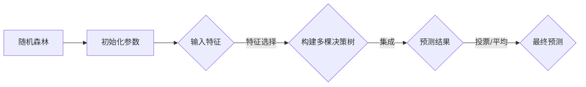

                 

关键词：机器学习、随机森林、决策树、集成算法、预测模型、数据分析、算法优化

> 摘要：本文将深入探讨随机森林（Random Forest）这一机器学习中的经典集成算法。首先介绍其背景和基本概念，然后详细解析算法原理、数学模型，并提供项目实践和实际应用场景的实例分析，最后展望其未来发展趋势和面临的挑战。

## 1. 背景介绍

随着数据规模的扩大和多样性的增加，单棵决策树（Decision Tree）的预测性能逐渐暴露出局限性，例如过拟合（Overfitting）问题和可解释性降低等问题。为了解决这些问题，研究者们提出了集成学习方法，其中随机森林（Random Forest）作为一种经典的集成算法，因其强大的预测能力和良好的泛化性能在许多领域得到了广泛应用。

随机森林由 Breiman 于 2001 年提出，它通过构建多棵决策树，并利用随机性来组合这些决策树的结果，从而达到提高预测性能和降低过拟合风险的目的。随机森林不仅继承了决策树的优势，如易于理解和实现，而且通过集成策略大大提升了模型的鲁棒性和准确性。

## 2. 核心概念与联系

### 2.1 核心概念

- **决策树（Decision Tree）**：一种树形结构，每个节点代表一个特征，每个分支代表该特征的一个取值，每个叶子节点代表一个类别或者数值。
- **随机森林（Random Forest）**：由多棵决策树组成的集成模型，每棵树都在训练数据上独立构建，通过投票或者平均值来决定最终预测结果。

### 2.2 基本原理

随机森林通过以下几个策略来提高模型的性能：

- **特征选择**：在构建每棵树时，从多个特征中随机选择一部分特征用于决策，从而避免过拟合。
- **随机分割**：在每个节点上随机选择一个分割点，而不是全局最优的分割点，进一步降低模型的复杂性。
- **集成策略**：通过多棵树的组合来提高模型的泛化能力。

### 2.3 架构流程图



## 3. 核心算法原理 & 具体操作步骤

### 3.1 算法原理概述

随机森林通过以下步骤实现：

1. **特征选择**：从原始特征集合中随机选择m个特征。
2. **分割点选择**：在每个节点上，从m个特征中随机选择一个特征，并从该特征的所有可能取值中随机选择一个分割点。
3. **构建决策树**：重复上述过程，构建一棵独立的决策树。
4. **集成**：对于新的输入数据，将它们分别传递给每一棵决策树，得到多棵树的预测结果。
5. **投票/平均**：根据不同的集成策略（如多数投票或者平均值），得出最终预测结果。

### 3.2 算法步骤详解

1. **初始化参数**：设定树的最大深度、每棵树的数量、特征选择的数量等参数。
2. **构建每棵树**：
   - 对于每个节点，从m个特征中随机选择一个特征。
   - 从该特征的所有可能取值中随机选择一个分割点。
   - 根据分割点将数据集分割为子集。
   - 重复以上过程，直到达到最大深度或子集大小小于预设阈值。
3. **集成**：将所有树的预测结果进行投票或平均。
4. **最终预测**：根据集成策略，确定最终预测类别或数值。

### 3.3 算法优缺点

**优点**：

- **强泛化能力**：通过集成多棵树，提高了模型的泛化能力，减少了过拟合的风险。
- **易于实现**：随机森林相对简单，易于理解和实现。
- **高预测性能**：在实际应用中，随机森林通常表现出较高的预测性能。

**缺点**：

- **计算复杂度**：随机森林的计算复杂度较高，特别是当特征数量和树的数量增加时。
- **可解释性降低**：随着树的数量增加，模型的可解释性会逐渐降低。

### 3.4 算法应用领域

随机森林在多个领域都有广泛应用，包括：

- **分类任务**：如文本分类、图像分类等。
- **回归任务**：如房屋价格预测、股票价格预测等。
- **异常检测**：如金融欺诈检测、网络入侵检测等。

## 4. 数学模型和公式 & 详细讲解 & 举例说明

### 4.1 数学模型构建

随机森林的核心在于其集成策略，我们可以用以下公式来表示：

$$
\hat{y} = \text{ Voting }\left( \hat{y}_1, \hat{y}_2, ..., \hat{y}_n \right)
$$

其中，$\hat{y}_i$ 表示第 $i$ 棵树的预测结果，$n$ 表示决策树的数量。

### 4.2 公式推导过程

随机森林的预测结果是通过多棵决策树的集成得到的。每棵决策树的预测结果可以表示为：

$$
\hat{y}_i = g(x; \theta_i)
$$

其中，$g(x; \theta_i)$ 表示第 $i$ 棵决策树在输入 $x$ 下的预测结果，$\theta_i$ 表示决策树的参数。

为了得到最终预测结果，我们需要对每棵树的预测结果进行集成。集成策略通常有两种：多数投票和平均值。

#### 多数投票

对于分类任务，我们可以使用多数投票来集成多棵树的预测结果：

$$
\hat{y} = \text{ Majority Vote }\left( \hat{y}_1, \hat{y}_2, ..., \hat{y}_n \right)
$$

其中，$\hat{y}$ 表示最终预测结果，$\hat{y}_i$ 表示第 $i$ 棵决策树的预测结果。

#### 平均值

对于回归任务，我们可以使用平均值来集成多棵树的预测结果：

$$
\hat{y} = \frac{1}{n} \sum_{i=1}^{n} \hat{y}_i
$$

### 4.3 案例分析与讲解

#### 分类任务

假设我们有一组训练数据，其中每个样本有 $n$ 个特征，我们需要对每个样本进行分类。我们可以构建 $m$ 棵决策树，并使用多数投票来集成这些决策树的预测结果。

1. **构建决策树**：对于每个样本，我们将其传递给每一棵决策树，得到 $m$ 个预测结果。
2. **集成预测结果**：使用多数投票来决定最终预测结果。

#### 回归任务

假设我们有一组训练数据，其中每个样本有 $n$ 个特征，我们需要对每个样本进行回归预测。我们可以构建 $m$ 棵决策树，并使用平均值来集成这些决策树的预测结果。

1. **构建决策树**：对于每个样本，我们将其传递给每一棵决策树，得到 $m$ 个预测结果。
2. **集成预测结果**：使用平均值来计算最终预测结果。

## 5. 项目实践：代码实例和详细解释说明

### 5.1 开发环境搭建

为了实现随机森林算法，我们需要搭建一个合适的开发环境。以下是所需的工具和步骤：

- **Python**：Python 是一种广泛使用的编程语言，具有丰富的机器学习库。
- **Scikit-learn**：Scikit-learn 是一个流行的 Python 机器学习库，提供了随机森林的实现。

### 5.2 源代码详细实现

下面是一个简单的随机森林分类任务的实现示例：

```python
from sklearn.datasets import load_iris
from sklearn.model_selection import train_test_split
from sklearn.ensemble import RandomForestClassifier
from sklearn.metrics import accuracy_score

# 加载 iris 数据集
iris = load_iris()
X, y = iris.data, iris.target

# 划分训练集和测试集
X_train, X_test, y_train, y_test = train_test_split(X, y, test_size=0.2, random_state=42)

# 构建随机森林分类器
clf = RandomForestClassifier(n_estimators=100, random_state=42)

# 训练模型
clf.fit(X_train, y_train)

# 预测测试集
y_pred = clf.predict(X_test)

# 计算准确率
accuracy = accuracy_score(y_test, y_pred)
print(f"Accuracy: {accuracy}")
```

### 5.3 代码解读与分析

上述代码实现了一个简单的随机森林分类任务。以下是代码的详细解读：

- **加载数据集**：我们使用 iris 数据集作为示例，这是一个经典的分类问题。
- **划分数据集**：我们将数据集划分为训练集和测试集，以便评估模型的性能。
- **构建分类器**：我们使用 Scikit-learn 的 RandomForestClassifier 类来构建随机森林分类器，并设置每棵树的数量为 100。
- **训练模型**：我们使用训练集数据来训练随机森林分类器。
- **预测结果**：我们使用测试集数据来预测类别，并计算准确率。

### 5.4 运行结果展示

运行上述代码，我们可以得到随机森林分类器的准确率。在实际应用中，我们还可以通过调整参数来优化模型的性能，例如调整树的数量、最大深度等。

## 6. 实际应用场景

### 6.1 金融领域

在金融领域，随机森林被广泛应用于信用评分、欺诈检测、股票市场预测等任务。例如，随机森林可以用于预测客户的信用评级，通过分析客户的财务状况、历史交易记录等多维度数据，为银行提供可靠的信用评估依据。

### 6.2 医疗领域

在医疗领域，随机森林被用于疾病预测、诊断辅助等任务。例如，可以使用随机森林来预测患者的疾病风险，通过分析患者的病史、生物标记等多维度数据，为医生提供诊断辅助。

### 6.3 零售业

在零售业，随机森林被用于客户行为分析、个性化推荐等任务。例如，可以使用随机森林来预测客户的购买意向，通过分析客户的购物行为、历史交易记录等多维度数据，为商家提供精准的个性化推荐。

## 7. 工具和资源推荐

### 7.1 学习资源推荐

- **书籍**：《随机森林：理论与实践》（Random Forests: A Concise Technical Overview）
- **在线课程**：Coursera 上的“机器学习”（Machine Learning）课程，包括随机森林等内容。
- **论文**：Breiman 的原始论文“Random Forests”（2001年），详细介绍了随机森林的原理和应用。

### 7.2 开发工具推荐

- **Python**：Python 是实现随机森林算法的首选语言，拥有丰富的机器学习库。
- **Scikit-learn**：Scikit-learn 是 Python 中实现随机森林算法的主要库，提供了简洁的接口和高效的实现。

### 7.3 相关论文推荐

- Breiman, L. (2001). *Random Forests*. Machine Learning, 45(1), 5-32.
- Liaw, A., & Wiener, M. (2002). *Classification and Regression by randomForest*. R News, 2(3), 18-22.
- Cutler, D. R., &adienski, R. J. (2018). *Random Forest Class Size Selection Methods for Biomedical Data Sets*. Journal of Biomedical Informatics, 84, 178-188.

## 8. 总结：未来发展趋势与挑战

### 8.1 研究成果总结

随机森林作为一种经典的集成算法，已经在多个领域取得了显著的研究成果。其强大的预测性能和良好的泛化能力使其成为许多应用场景的首选算法。

### 8.2 未来发展趋势

1. **算法优化**：随着计算能力的提升，研究者们将继续优化随机森林算法，提高其计算效率和预测性能。
2. **多模态数据融合**：随机森林在处理多模态数据时表现出色，未来将会有更多研究关注如何利用多模态数据提升预测性能。
3. **模型可解释性**：尽管随机森林的可解释性较单个决策树有所降低，但研究者们仍在探索如何提高其可解释性，以满足实际应用需求。

### 8.3 面临的挑战

1. **计算复杂度**：随着特征数量和树的数量增加，随机森林的计算复杂度显著提升，这需要高效的算法和硬件支持。
2. **数据隐私**：在处理敏感数据时，如何保护数据隐私成为随机森林应用的一大挑战，研究者们需探索隐私保护机制。

### 8.4 研究展望

随机森林在未来将继续发挥重要作用，特别是在复杂、高维数据的预测任务中。随着算法的优化和应用场景的拓展，随机森林有望在更多领域取得突破性成果。

## 9. 附录：常见问题与解答

### 9.1 什么是随机森林？

随机森林是一种集成学习算法，它通过构建多棵决策树，并利用随机性来组合这些决策树的结果，从而提高预测性能和降低过拟合风险。

### 9.2 随机森林有哪些优点？

随机森林的优点包括：

1. **强泛化能力**：通过集成多棵树，提高了模型的泛化能力，减少了过拟合的风险。
2. **易于实现**：随机森林相对简单，易于理解和实现。
3. **高预测性能**：在实际应用中，随机森林通常表现出较高的预测性能。

### 9.3 随机森林有哪些缺点？

随机森林的缺点包括：

1. **计算复杂度**：随机森林的计算复杂度较高，特别是当特征数量和树的数量增加时。
2. **可解释性降低**：随着树的数量增加，模型的可解释性会逐渐降低。

### 9.4 随机森林适用于哪些任务？

随机森林适用于多种机器学习任务，包括：

1. **分类任务**：如文本分类、图像分类等。
2. **回归任务**：如房屋价格预测、股票价格预测等。
3. **异常检测**：如金融欺诈检测、网络入侵检测等。

### 9.5 如何优化随机森林的性能？

要优化随机森林的性能，可以从以下几个方面进行：

1. **特征选择**：选择重要的特征，减少特征数量，提高模型效率。
2. **树的数量**：适当增加树的数量，但需要注意计算复杂度。
3. **树的最大深度**：调整树的最大深度，避免过拟合。

---

**作者：禅与计算机程序设计艺术 / Zen and the Art of Computer Programming**

