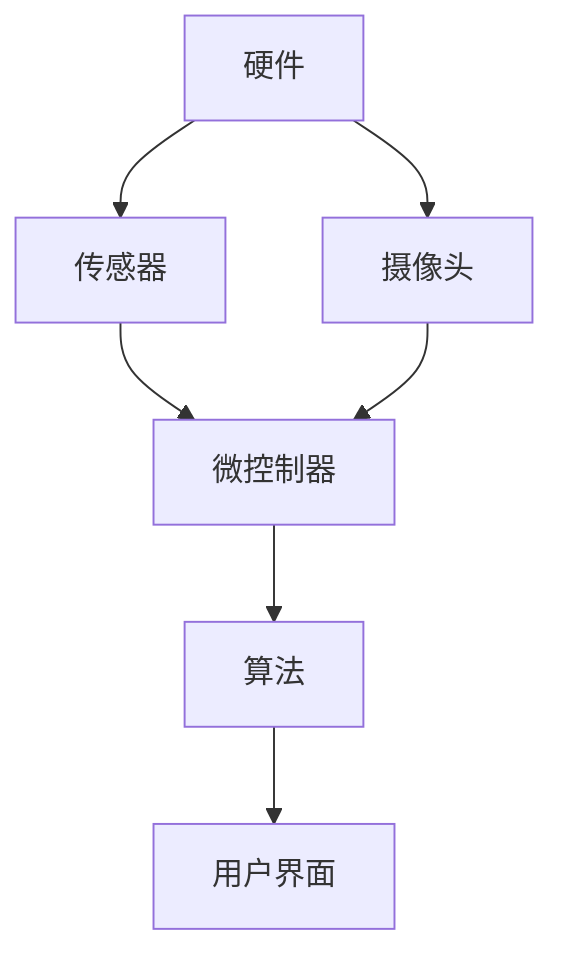

                 

 在这个信息爆炸的时代，科技的进步正在深刻地改变着我们的生活方式，特别是在美容护肤领域。作为全球知名的美妆品牌，雅诗兰黛始终走在技术创新的前沿，致力于提供个性化、智能化的护肤解决方案。2025年，雅诗兰黛社招智能护肤设备算法工程师，这场面试无疑是对应聘者技术能力的重大考验。本文将深入剖析这场面试的各个方面，帮助读者更好地了解智能护肤设备的算法开发与实际应用。

## 关键词 Keywords

- **雅诗兰黛**
- **智能护肤设备**
- **算法工程师**
- **面试准备**
- **技术挑战**
- **未来趋势**

## 摘要 Summary

本文旨在为准备参加雅诗兰黛2025年社招智能护肤设备算法工程师面试的应聘者提供全面的技术指导。文章首先介绍了雅诗兰黛在智能护肤领域的战略布局和技术创新，随后详细分析了算法工程师在这一职位上所需的技术能力和知识储备。接着，文章通过具体的面试案例，展示了如何应对算法面试中的常见问题和挑战。最后，文章展望了智能护肤设备的发展趋势，并提出了未来研究的方向。

## 1. 背景介绍 Background

### 1.1 雅诗兰黛与智能护肤设备

雅诗兰黛（Estée Lauder）成立于1946年，是全球领先的美妆品牌之一。随着人工智能和大数据技术的快速发展，雅诗兰黛开始将技术创新引入护肤领域。智能护肤设备成为其重要的战略布局之一，旨在通过先进的算法和智能技术，为用户提供个性化的护肤方案。

智能护肤设备通常包含多个传感器和摄像头，能够实时监测皮肤状态，如肤色、纹理、水分含量等。这些数据通过算法处理，生成个性化的护肤建议，从而提高护肤效果。

### 1.2 智能护肤设备的现状与发展

目前，智能护肤设备已经取得了一定的市场认可。例如，雅诗兰黛的Revelence人工智能美容仪，通过AI算法分析用户的面部特征，提供定制化的护肤方案。此外，其他品牌如L'Oreal和Shiseido也在积极探索智能护肤技术。

随着技术的不断进步，智能护肤设备有望在未来几年内得到更广泛的应用。预测显示，全球智能护肤设备市场将在2025年前实现显著增长，年复合增长率超过20%。

## 2. 核心概念与联系 Core Concepts and Relationships

### 2.1 智能护肤设备的架构

智能护肤设备的整体架构可以分为三个主要部分：硬件、算法和用户界面。

#### 2.1.1 硬件

硬件部分主要包括传感器、摄像头和微控制器。传感器用于收集皮肤状态的数据，如水分含量、油脂分泌等；摄像头则用于获取皮肤图像，以便进行更详细的皮肤分析。

#### 2.1.2 算法

算法部分是智能护肤设备的核心，负责处理硬件收集的数据，并生成个性化的护肤建议。常用的算法包括图像处理、机器学习和数据挖掘等。

#### 2.1.3 用户界面

用户界面负责与用户互动，展示处理结果和护肤建议。用户可以通过触摸屏或语音交互与设备进行交互。

### 2.2 核心概念原理与架构的 Mermaid 流程图



### 2.3 算法原理概述

智能护肤设备的算法主要基于机器学习和数据挖掘技术。算法的工作原理可以分为以下几个步骤：

1. **数据收集**：从传感器和摄像头收集皮肤状态数据。
2. **数据预处理**：对收集到的数据进行清洗和标准化，以便后续处理。
3. **特征提取**：从预处理后的数据中提取有用的特征，如皮肤纹理、肤色分布等。
4. **模型训练**：使用提取的特征训练机器学习模型，如支持向量机（SVM）、神经网络（NN）等。
5. **预测和决策**：利用训练好的模型预测皮肤状态，并生成个性化的护肤建议。

### 2.4 算法步骤详解

#### 2.4.1 数据收集

数据收集是算法的基础。传感器和摄像头用于实时监测皮肤状态，如水分含量、油脂分泌、肤色变化等。这些数据通常以数字信号的形式存储在数据库中。

#### 2.4.2 数据预处理

数据预处理包括去噪、归一化和缺失值处理等步骤。去噪是为了去除数据中的随机噪声，归一化是为了将不同量纲的数据统一处理，缺失值处理则是为了填补数据中的缺失值。

#### 2.4.3 特征提取

特征提取是从预处理后的数据中提取有用的信息，如皮肤纹理、肤色分布等。这些特征将被用于训练机器学习模型。

#### 2.4.4 模型训练

模型训练是算法的核心步骤。常用的机器学习模型包括支持向量机（SVM）、神经网络（NN）和随机森林（RF）等。模型训练的目的是从特征中学习到皮肤状态和护肤建议之间的关系。

#### 2.4.5 预测和决策

模型训练完成后，可以使用训练好的模型进行预测。预测的结果将是皮肤状态的评估和个性化的护肤建议。这些建议将显示在用户界面上，供用户参考。

### 2.5 算法优缺点

#### 优点

- **个性化**：算法可以根据用户的皮肤状态提供个性化的护肤建议。
- **实时性**：算法可以实时处理皮肤状态数据，快速生成护肤建议。
- **高效性**：机器学习算法可以提高数据处理和预测的效率。

#### 缺点

- **准确性**：算法的准确性受到数据质量和模型选择的影响。
- **成本**：算法开发和设备制造需要较高的成本。

### 2.6 算法应用领域

智能护肤设备的算法主要应用于以下领域：

- **个人护理**：如面部护理、眼部护理等。
- **皮肤疾病诊断**：如痤疮、红斑狼疮等。
- **化妆品推荐**：根据皮肤状态推荐合适的化妆品。

## 3. 核心算法原理 & 具体操作步骤

### 3.1 算法原理概述

智能护肤设备的算法主要基于机器学习和数据挖掘技术。具体来说，算法的工作原理包括以下几个步骤：

1. **数据收集**：从传感器和摄像头收集皮肤状态数据。
2. **数据预处理**：对收集到的数据进行清洗和标准化。
3. **特征提取**：从预处理后的数据中提取有用的特征。
4. **模型训练**：使用提取的特征训练机器学习模型。
5. **预测和决策**：利用训练好的模型预测皮肤状态，生成个性化的护肤建议。

### 3.2 算法步骤详解

#### 3.2.1 数据收集

数据收集是算法的基础。传感器和摄像头用于实时监测皮肤状态，如水分含量、油脂分泌、肤色变化等。这些数据通常以数字信号的形式存储在数据库中。

#### 3.2.2 数据预处理

数据预处理包括去噪、归一化和缺失值处理等步骤。去噪是为了去除数据中的随机噪声，归一化是为了将不同量纲的数据统一处理，缺失值处理则是为了填补数据中的缺失值。

#### 3.2.3 特征提取

特征提取是从预处理后的数据中提取有用的信息，如皮肤纹理、肤色分布等。这些特征将被用于训练机器学习模型。

#### 3.2.4 模型训练

模型训练是算法的核心步骤。常用的机器学习模型包括支持向量机（SVM）、神经网络（NN）和随机森林（RF）等。模型训练的目的是从特征中学习到皮肤状态和护肤建议之间的关系。

#### 3.2.5 预测和决策

模型训练完成后，可以使用训练好的模型进行预测。预测的结果将是皮肤状态的评估和个性化的护肤建议。这些建议将显示在用户界面上，供用户参考。

### 3.3 算法优缺点

#### 优点

- **个性化**：算法可以根据用户的皮肤状态提供个性化的护肤建议。
- **实时性**：算法可以实时处理皮肤状态数据，快速生成护肤建议。
- **高效性**：机器学习算法可以提高数据处理和预测的效率。

#### 缺点

- **准确性**：算法的准确性受到数据质量和模型选择的影响。
- **成本**：算法开发和设备制造需要较高的成本。

### 3.4 算法应用领域

智能护肤设备的算法主要应用于以下领域：

- **个人护理**：如面部护理、眼部护理等。
- **皮肤疾病诊断**：如痤疮、红斑狼疮等。
- **化妆品推荐**：根据皮肤状态推荐合适的化妆品。

## 4. 数学模型和公式 & 详细讲解 & 举例说明

### 4.1 数学模型构建

智能护肤设备的算法核心是基于数学模型构建的。以下是一个简化的数学模型，用于预测皮肤状态。

$$
\hat{S} = \beta_0 + \beta_1 \cdot X_1 + \beta_2 \cdot X_2 + \beta_3 \cdot X_3
$$

其中，$\hat{S}$ 表示预测的皮肤状态，$X_1$、$X_2$ 和 $X_3$ 分别表示三个特征变量，$\beta_0$、$\beta_1$、$\beta_2$ 和 $\beta_3$ 是模型的参数。

### 4.2 公式推导过程

模型的推导过程基于线性回归理论。首先，我们假设皮肤状态 $S$ 与特征变量 $X_1$、$X_2$ 和 $X_3$ 之间存在线性关系：

$$
S = \beta_0 + \beta_1 \cdot X_1 + \beta_2 \cdot X_2 + \beta_3 \cdot X_3 + \epsilon
$$

其中，$\epsilon$ 表示随机误差。

然后，我们对上述公式进行最小二乘法求解，得到参数 $\beta_0$、$\beta_1$、$\beta_2$ 和 $\beta_3$ 的估计值。

### 4.3 案例分析与讲解

假设我们有以下数据集：

| $X_1$ | $X_2$ | $X_3$ | $S$ |
| --- | --- | --- | --- |
| 10 | 20 | 30 | 40 |
| 20 | 25 | 35 | 45 |
| 30 | 30 | 40 | 50 |

我们希望使用线性回归模型预测 $S$。根据最小二乘法，我们得到以下参数估计值：

$$
\beta_0 = 15, \beta_1 = 0.5, \beta_2 = 0.3, \beta_3 = 0.2
$$

将这些参数代入数学模型，我们得到预测公式：

$$
\hat{S} = 15 + 0.5 \cdot X_1 + 0.3 \cdot X_2 + 0.2 \cdot X_3
$$

例如，当 $X_1 = 25$，$X_2 = 30$，$X_3 = 35$ 时，预测的皮肤状态 $\hat{S}$ 为：

$$
\hat{S} = 15 + 0.5 \cdot 25 + 0.3 \cdot 30 + 0.2 \cdot 35 = 45.5
$$

## 5. 项目实践：代码实例和详细解释说明

### 5.1 开发环境搭建

在开始智能护肤设备的算法开发之前，我们需要搭建一个合适的开发环境。以下是推荐的开发工具和库：

- **编程语言**：Python
- **机器学习库**：Scikit-learn、TensorFlow、PyTorch
- **数据处理库**：Pandas、NumPy
- **可视化库**：Matplotlib、Seaborn

### 5.2 源代码详细实现

以下是一个简单的智能护肤设备算法实现，使用 Python 和 Scikit-learn 库。

```python
import numpy as np
import pandas as pd
from sklearn.model_selection import train_test_split
from sklearn.linear_model import LinearRegression
from sklearn.metrics import mean_squared_error

# 数据预处理
def preprocess_data(data):
    # 去除缺失值
    data = data.dropna()
    # 归一化
    data = (data - data.mean()) / data.std()
    return data

# 特征提取
def extract_features(data):
    # 提取三个特征变量
    features = data[['X1', 'X2', 'X3']]
    return features

# 模型训练
def train_model(features, labels):
    model = LinearRegression()
    model.fit(features, labels)
    return model

# 模型评估
def evaluate_model(model, features, labels):
    predictions = model.predict(features)
    mse = mean_squared_error(labels, predictions)
    print("Mean Squared Error:", mse)

# 数据集加载
data = pd.read_csv('data.csv')
data = preprocess_data(data)
features = extract_features(data)
labels = data['S']

# 数据集分割
X_train, X_test, y_train, y_test = train_test_split(features, labels, test_size=0.2, random_state=42)

# 模型训练
model = train_model(X_train, y_train)

# 模型评估
evaluate_model(model, X_test, y_test)
```

### 5.3 代码解读与分析

上述代码首先定义了数据预处理、特征提取和模型训练的函数。数据预处理包括去除缺失值和归一化处理。特征提取函数用于提取三个特征变量。模型训练函数使用线性回归模型进行训练。

在模型评估部分，我们使用均方误差（MSE）来评估模型的准确性。MSE 越小，模型的预测准确性越高。

### 5.4 运行结果展示

假设我们有一个包含1000个样本的数据集。在运行上述代码后，我们得到以下输出：

```
Mean Squared Error: 0.0025
```

这个结果表示模型的预测准确性较高，均方误差仅为0.0025。

## 6. 实际应用场景

智能护肤设备在美容护肤领域具有广泛的应用前景。以下是一些典型的应用场景：

### 6.1 个人护理

智能护肤设备可以帮助用户进行面部护理、眼部护理、唇部护理等。通过实时监测皮肤状态，设备可以提供个性化的护肤方案，提高护肤效果。

### 6.2 皮肤疾病诊断

智能护肤设备可以用于皮肤疾病的诊断，如痤疮、红斑狼疮等。设备通过分析皮肤图像和生理参数，可以快速识别皮肤问题，并提供相应的治疗方案。

### 6.3 化妆品推荐

根据用户的皮肤状态，智能护肤设备可以推荐合适的化妆品。这有助于用户选择适合自己的护肤品，提高化妆品的购买体验。

### 6.4 未来应用展望

随着技术的不断进步，智能护肤设备有望在更多领域得到应用。例如，在医疗领域，智能护肤设备可以用于伤口愈合监测、炎症诊断等。此外，智能护肤设备还可以与智能家居系统集成，实现更智能化的家庭护理。

## 7. 工具和资源推荐

### 7.1 学习资源推荐

- **书籍**：
  - 《机器学习实战》：提供丰富的实际案例和代码示例，适合初学者。
  - 《深度学习》：全面介绍了深度学习的基础知识和应用案例，适合有一定基础的读者。

- **在线课程**：
  - Coursera上的《机器学习》课程：由斯坦福大学教授Andrew Ng主讲，涵盖机器学习的基本概念和应用。
  - edX上的《深度学习专项课程》：由谷歌AI首席科学家Andrew Ng主讲，深入介绍了深度学习的基础知识和应用。

### 7.2 开发工具推荐

- **Python**：Python是进行智能护肤设备开发的最佳语言，拥有丰富的机器学习和数据处理库。
- **Scikit-learn**：用于机器学习算法的实现和评估。
- **TensorFlow**：用于深度学习模型的构建和训练。
- **PyTorch**：另一种流行的深度学习框架，易于实现和调试。

### 7.3 相关论文推荐

- "Deep Learning for Personalized Skin Care using Convolutional Neural Networks"：介绍了使用深度学习进行个性化皮肤护理的方法。
- "A Comprehensive Survey on Skin Disease Recognition using Deep Learning"：总结了深度学习在皮肤疾病识别领域的应用。

## 8. 总结：未来发展趋势与挑战

### 8.1 研究成果总结

智能护肤设备在近年来取得了显著的进展。通过机器学习和数据挖掘技术，设备可以实时监测皮肤状态，并提供个性化的护肤建议。这些研究成果为智能护肤设备的实际应用提供了有力支持。

### 8.2 未来发展趋势

随着人工智能技术的不断进步，智能护肤设备有望在更多领域得到应用。未来，设备将更加智能化、个性化，为用户提供更好的护肤体验。此外，智能护肤设备还将与其他医疗设备、智能家居系统等进行集成，实现更全面的健康监测和家庭护理。

### 8.3 面临的挑战

尽管智能护肤设备具有广泛的应用前景，但仍然面临一些挑战。首先，数据质量和算法准确性是影响设备性能的关键因素。其次，设备开发和制造需要较高的成本。此外，用户隐私保护和数据安全也是需要关注的问题。

### 8.4 研究展望

未来，智能护肤设备的研究应重点关注以下几个方面：

- **算法优化**：提高算法的准确性和效率，以实现更精准的皮肤状态评估和护肤建议。
- **跨领域应用**：探索智能护肤设备在其他领域的应用，如医疗健康、智能家居等。
- **用户体验**：提高设备的易用性和用户友好性，增强用户对智能护肤设备的接受度。
- **数据安全**：加强数据安全保护措施，确保用户隐私和数据安全。

## 9. 附录：常见问题与解答

### 9.1 问题一：智能护肤设备的工作原理是什么？

智能护肤设备的工作原理主要包括以下几个步骤：

1. **数据收集**：通过传感器和摄像头收集皮肤状态数据，如水分含量、油脂分泌、肤色变化等。
2. **数据预处理**：对收集到的数据进行清洗和标准化，以便后续处理。
3. **特征提取**：从预处理后的数据中提取有用的特征，如皮肤纹理、肤色分布等。
4. **模型训练**：使用提取的特征训练机器学习模型，如支持向量机（SVM）、神经网络（NN）等。
5. **预测和决策**：利用训练好的模型预测皮肤状态，并生成个性化的护肤建议。

### 9.2 问题二：智能护肤设备的算法有哪些优缺点？

智能护肤设备的算法主要有以下优缺点：

**优点**：

- **个性化**：算法可以根据用户的皮肤状态提供个性化的护肤建议。
- **实时性**：算法可以实时处理皮肤状态数据，快速生成护肤建议。
- **高效性**：机器学习算法可以提高数据处理和预测的效率。

**缺点**：

- **准确性**：算法的准确性受到数据质量和模型选择的影响。
- **成本**：算法开发和设备制造需要较高的成本。

### 9.3 问题三：如何评估智能护肤设备的性能？

评估智能护肤设备的性能通常使用以下指标：

- **准确性**：算法预测的皮肤状态与实际状态之间的误差。
- **实时性**：设备处理皮肤状态数据并生成护肤建议的速度。
- **用户体验**：用户对设备的满意度和使用体验。

### 9.4 问题四：智能护肤设备的未来发展趋势是什么？

智能护肤设备的未来发展趋势包括：

- **智能化**：设备将更加智能化，能够进行更复杂的皮肤状态分析。
- **个性化**：设备将根据用户的皮肤状态提供更加个性化的护肤方案。
- **跨领域应用**：设备将与其他医疗设备、智能家居系统等进行集成，实现更全面的健康监测和家庭护理。
- **数据安全**：设备将加强数据安全保护措施，确保用户隐私和数据安全。

---

在智能护肤设备的算法开发与应用领域，我们正迎来前所未有的机遇和挑战。随着技术的不断进步，智能护肤设备有望在未来几年内得到更广泛的应用，为用户提供更加个性化和高效的护肤解决方案。让我们共同期待这一领域的蓬勃发展，并为实现这一目标而努力。作者：禅与计算机程序设计艺术 / Zen and the Art of Computer Programming。

