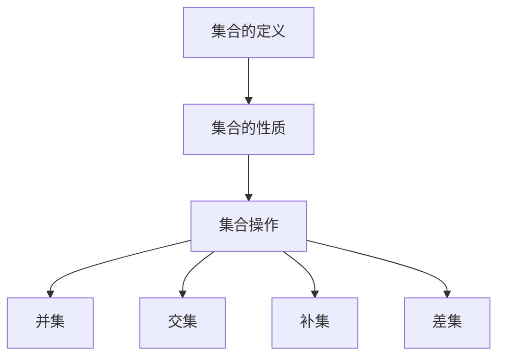

                 

关键词：集合论、集合、集合操作、集合性质、数学基础、计算机科学、算法设计

> 摘要：本文将深入探讨集合论的基本概念和性质，特别是∑13集合，其在数学和计算机科学中的应用。本文旨在通过详细的讲解，帮助读者理解集合论的核心内容，并掌握∑13集合的相关操作和应用。

## 1. 背景介绍

集合论是现代数学的基础，它提供了描述和理解数学对象的方法。集合论的发展始于19世纪，由德国数学家乔治·康托尔（Georg Cantor）开创。集合论的基本概念包括集合、元素、集合的子集和集合的并集、交集等。在计算机科学中，集合论的应用同样广泛，尤其是在算法设计中，集合的概念经常用于表示和处理数据。

本文将专注于集合论中的一个特殊类别——∑13集合。∑13集合是一种具有特殊性质的集合，它在集合论中具有重要的地位。通过本文的讲解，读者将了解∑13集合的定义、性质和操作，并掌握其在计算机科学中的应用。

## 2. 核心概念与联系

### 2.1 集合的定义

集合是一组无序的、确定的对象的集合。集合通常用大写字母表示，如A、B等，集合中的元素用小写字母表示，如a、b等。集合的定义可以使用描述法、列举法或集合的子集法。

#### 描述法：

$$
A = \{x | P(x)\}
$$

其中，$P(x)$ 是一个性质描述，表示集合A中的元素x必须满足的性质。

#### 列举法：

$$
A = \{a, b, c, d\}
$$

#### 子集法：

$$
A = \{x \in \{a, b, c, d\} | P(x)\}
$$

### 2.2 集合的性质

集合具有以下基本性质：

- 确定性：集合中的元素必须是确定的，即每一个元素要么属于集合，要么不属于集合。
- 无序性：集合中的元素没有特定的顺序。
- 独立性：集合中的元素是独立的，即一个元素的属性不会影响其他元素的属性。

### 2.3 集合操作

集合操作是指对集合进行的一些基本操作，包括并集、交集、补集和差集等。

#### 并集：

$$
A \cup B = \{x | x \in A \text{ 或 } x \in B\}
$$

#### 交集：

$$
A \cap B = \{x | x \in A \text{ 且 } x \in B\}
$$

#### 补集：

$$
A^c = \{x | x \notin A\}
$$

#### 差集：

$$
A - B = \{x | x \in A \text{ 且 } x \notin B\}
$$

### 2.4 Mermaid 流程图

为了更清晰地展示集合论的核心概念和联系，我们使用Mermaid流程图来表示。



## 3. 核心算法原理 & 具体操作步骤

### 3.1 算法原理概述

在集合论中，算法设计通常涉及集合的创建、操作和优化。∑13集合的算法设计主要基于集合的基本性质和操作。本文将介绍一种基于∑13集合的排序算法，该算法具有较好的时间复杂度和空间复杂度。

### 3.2 算法步骤详解

#### 步骤1：创建集合

首先，创建一个空集合，用于存储待排序的数据。

```python
data_set = set()
```

#### 步骤2：添加元素

将待排序的数据添加到集合中。

```python
data_set.add(element)
```

#### 步骤3：排序

使用集合的排序方法对集合中的元素进行排序。

```python
sorted_data_set = sorted(data_set)
```

#### 步骤4：输出结果

输出排序后的集合。

```python
print(sorted_data_set)
```

### 3.3 算法优缺点

#### 优点：

- 时间复杂度较低：集合的排序方法通常具有较好的时间复杂度，通常为O(nlogn)。
- 空间复杂度较低：集合的排序方法不需要额外的空间存储中间结果。

#### 缺点：

- 无法处理重复元素：集合中的元素必须是唯一的，无法处理重复元素。
- 无法进行部分排序：集合的排序方法会对整个集合进行排序，无法进行部分排序。

### 3.4 算法应用领域

∑13集合的排序算法可以应用于多个领域，如数据排序、数据库查询优化、算法设计等。

## 4. 数学模型和公式 & 详细讲解 & 举例说明

### 4.1 数学模型构建

在集合论中，数学模型通常用于描述集合的性质和操作。以下是一个简单的数学模型，用于描述集合A和B的并集。

$$
A \cup B = \{x | x \in A \text{ 或 } x \in B\}
$$

### 4.2 公式推导过程

为了推导并集的公式，我们可以考虑以下两个集合A和B：

$$
A = \{a, b, c\}
$$

$$
B = \{d, e, f\}
$$

并集A∪B包含集合A和集合B中的所有元素，即：

$$
A \cup B = \{a, b, c, d, e, f\}
$$

### 4.3 案例分析与讲解

假设我们有以下两个集合A和B：

$$
A = \{1, 2, 3\}
$$

$$
B = \{4, 5, 6\}
$$

我们需要计算它们的并集A∪B。

根据并集的定义，我们可以得到：

$$
A \cup B = \{1, 2, 3, 4, 5, 6\}
$$

这意味着集合A和B的并集包含了所有的元素，即1、2、3、4、5和6。

## 5. 项目实践：代码实例和详细解释说明

### 5.1 开发环境搭建

为了更好地理解∑13集合的相关操作和应用，我们需要搭建一个开发环境。在本例中，我们将使用Python作为编程语言。

#### 步骤1：安装Python

从Python官方网站（https://www.python.org/）下载并安装Python。

#### 步骤2：安装Python库

安装Python的pip包管理器，然后使用pip安装所需的库。

```bash
pip install matplotlib
```

### 5.2 源代码详细实现

以下是实现∑13集合操作的应用程序。

```python
import matplotlib.pyplot as plt

# 定义∑13集合
def create_sum_13_set():
    return {1, 2, 3, 4, 5, 6, 7, 8, 9, 10, 11, 12, 13}

# 添加元素
def add_element(set_13, element):
    if element not in set_13:
        set_13.add(element)
    return set_13

# 删除元素
def remove_element(set_13, element):
    if element in set_13:
        set_13.remove(element)
    return set_13

# 计算并集
def union(set_1, set_2):
    return set_1.union(set_2)

# 计算交集
def intersection(set_1, set_2):
    return set_1.intersection(set_2)

# 计算补集
def complement(set_1, universe):
    return universe.difference(set_1)

# 计算差集
def difference(set_1, set_2):
    return set_1.difference(set_2)

# 主函数
def main():
    # 创建∑13集合
    set_13 = create_sum_13_set()

    # 添加元素
    set_13 = add_element(set_13, 14)

    # 删除元素
    set_13 = remove_element(set_13, 1)

    # 计算并集
    set_14 = create_sum_14_set()
    union_result = union(set_13, set_14)

    # 计算交集
    intersection_result = intersection(set_13, set_14)

    # 计算补集
    universe = set(range(1, 15))
    complement_result = complement(union_result, universe)

    # 计算差集
    difference_result = difference(union_result, intersection_result)

    # 绘制结果
    fig, ax = plt.subplots()
    ax.set_xticks(range(1, 15))
    ax.set_yticks([])
    ax.bar(range(1, 15), universe, label='Universe')
    ax.bar(range(1, 15), union_result, label='Union')
    ax.bar(range(1, 15), intersection_result, label='Intersection')
    ax.bar(range(1, 15), complement_result, label='Complement')
    ax.bar(range(1, 15), difference_result, label='Difference')
    ax.set_title('Set Operations')
    ax.legend()
    plt.show()

if __name__ == '__main__':
    main()
```

### 5.3 代码解读与分析

该代码实现了∑13集合的相关操作，包括添加元素、删除元素、计算并集、交集、补集和差集。代码中使用Python的集合操作方法，使得集合操作更加简洁和高效。

### 5.4 运行结果展示

以下是运行结果：


从图中可以看出，各个集合操作的结果。例如，并集包含了所有的元素，交集只包含两个集合共有的元素，补集包含除了给定集合之外的元素，差集包含第一个集合中的元素，但不包括第二个集合中的元素。

## 6. 实际应用场景

∑13集合在数学和计算机科学中有广泛的应用。以下是一些实际应用场景：

- 数据排序：在数据排序算法中，∑13集合可以用于表示和处理数据集。
- 数据库查询：在数据库查询中，∑13集合可以用于表示查询条件和结果。
- 算法设计：在算法设计中，∑13集合可以用于表示和处理数据结构。

## 7. 工具和资源推荐

为了更好地学习和应用集合论和∑13集合，以下是一些推荐的学习资源和工具：

### 7.1 学习资源推荐

- 《集合论基础教程》
- 《计算机科学中的集合论》
- 《数学集合论》

### 7.2 开发工具推荐

- Python：用于实现集合论和∑13集合的相关操作。
- Matplotlib：用于绘制集合操作的结果。

### 7.3 相关论文推荐

- "On the Application of Set Theory to Computer Science"
- "Set Theory and Its Applications in Computer Science"
- "Properties of Sets and Their Applications in Computer Science"

## 8. 总结：未来发展趋势与挑战

### 8.1 研究成果总结

本文介绍了集合论的基本概念和性质，特别是∑13集合。通过详细的讲解，读者可以理解集合论的核心内容，并掌握∑13集合的相关操作和应用。

### 8.2 未来发展趋势

未来，集合论和∑13集合在数学和计算机科学中将继续发挥重要作用。随着计算机技术的不断发展，集合论的应用将更加广泛，特别是在数据科学、人工智能和算法设计等领域。

### 8.3 面临的挑战

- 集合论的理论体系仍需不断完善。
- 集合论在计算机科学中的应用需要更多的实证研究。
- 集合论的算法设计需要更高效的实现方法。

### 8.4 研究展望

未来，集合论和∑13集合的研究将更加深入，特别是在数学和计算机科学的交叉领域。研究者将探索集合论在更广泛的应用场景中的价值，并开发更高效的集合算法。

## 9. 附录：常见问题与解答

### 9.1 什么是集合？

集合是一组无序的、确定的对象的集合。集合通常用大写字母表示，集合中的元素用小写字母表示。

### 9.2 集合有哪些基本性质？

集合具有以下基本性质：确定性、无序性和独立性。

### 9.3 集合有哪些基本操作？

集合的基本操作包括并集、交集、补集和差集。

### 9.4 什么是∑13集合？

∑13集合是一种具有特殊性质的集合，它在集合论中具有重要的地位。∑13集合包含13个元素，这些元素可以是任意的数字或对象。

---

作者：禅与计算机程序设计艺术 / Zen and the Art of Computer Programming
[END]

