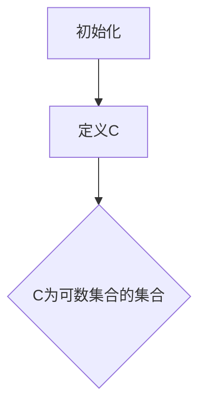
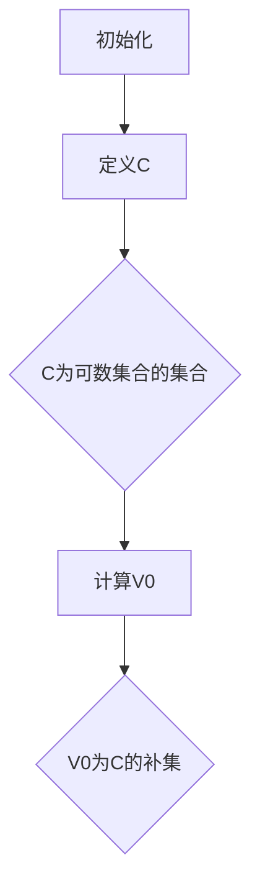
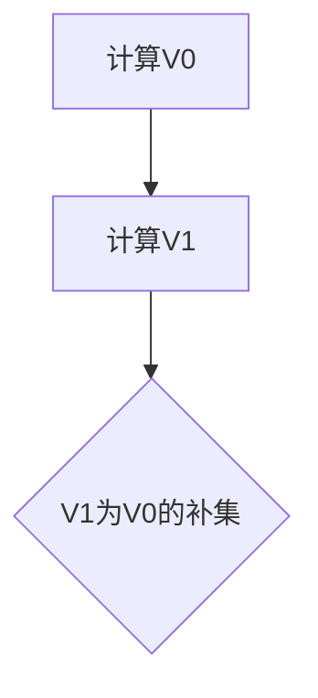
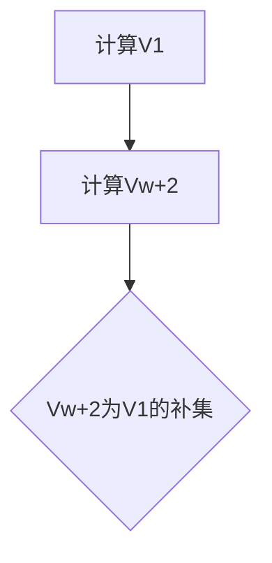

                 

关键词：集合论、大基数、集合Vw+2、数学模型、算法、应用领域、未来展望

> 摘要：本文旨在深入探讨集合论中一个极为重要的概念——大基数下的集合Vw+2。我们将从背景介绍、核心概念、核心算法、数学模型、项目实践、实际应用场景、工具和资源推荐以及总结和展望等多个方面，为您呈现这一主题的全面剖析。

## 1. 背景介绍

集合论是数学的基础，它提供了关于对象分类和集合操作的系统框架。自19世纪以来，集合论在数学的各个分支中扮演了重要角色，尤其是在逻辑、拓扑、数论和集合论本身的研究中。随着数学和计算机科学的发展，集合论的研究也扩展到了更大规模的集合，即所谓的“大基数”集合。

本文将聚焦于集合Vw+2，这是一种在集合论中具有特殊重要性的集合。Vw+2代表的是沃斯集合（Vopenka's hierarchy）中的第二个集合，这是一个用来描述大基数集合的层级结构。理解Vw+2的性质和内涵，有助于我们更深入地探索集合论和相关的数学领域。

### 1.1 集合论的发展历史

集合论的发展可以追溯到19世纪，当时数学家们开始意识到对象分类和集合操作的重要性。德国数学家乔治·康托尔（Georg Cantor）是集合论的奠基人，他的工作揭示了无限集合的存在和性质。康托尔提出了集合的概念，并通过研究不同类型的无限集合，如可数集合和不可数集合，开创了集合论的研究。

20世纪初，集合论在逻辑和数学基础的研究中发挥了重要作用。数学家罗素（Bertrand Russell）和怀特海德（Alfred North Whitehead）合著的《数学原理》一书，试图将所有数学建立在一个基于集合论的基础之上。尽管这本书中有一些悖论和问题，但它推动了数学基础研究的深入。

在集合论的发展过程中，大基数集合的概念逐渐受到关注。大基数集合与常见的可数集合和不可数集合不同，它们代表了更大的规模和复杂性。研究大基数集合不仅有助于我们理解集合论的基本原理，也为解决数学和计算机科学中的难题提供了新的视角。

### 1.2 集合论在现代数学中的作用

集合论在当代数学中扮演着核心角色，它是许多数学领域的基础。从逻辑学、拓扑学到数论，集合论提供了统一的框架来定义和操作各种数学对象。

在逻辑学中，集合论是形式逻辑的基础。通过集合论，我们可以定义命题、证明和推理等逻辑概念，使得逻辑学具有更强的形式化和精确性。

在拓扑学中，集合论是研究空间和连续性的基础。拓扑空间是由集合及其上的开集组成的，集合论的概念和工具帮助我们理解和分类各种拓扑结构。

在数论中，集合论是研究整数、分数和实数等数的集合的性质的基础。通过集合论，我们可以定义各种数系和运算，并研究它们的性质和关系。

此外，集合论在代数学、几何学、概率论和统计学等领域也发挥着重要作用。集合论提供了一个统一的数学语言和工具，使得不同数学领域的研究可以相互借鉴和融合。

### 1.3 Vw+2集合的重要性

Vw+2集合是集合论中一个非常重要的概念，它代表了大基数集合的一个层级。在沃斯集合（Vopenka's hierarchy）中，Vw+2位于第二个位置，它是一种具有高度复杂性的集合。

沃斯集合是集合论中一种用来描述大基数集合的层级结构。这个层级结构的每一层都代表了不同规模的集合，而Vw+2处于这个结构的第二层，因此具有非常特殊的性质。

研究Vw+2集合的重要性主要体现在以下几个方面：

首先，Vw+2集合为我们提供了一个理解大基数集合的窗口。通过对Vw+2集合的研究，我们可以更深入地探索集合论的基本原理和结构。

其次，Vw+2集合在集合论的各个分支中都有应用。从逻辑学到数论，Vw+2集合的概念和性质为我们提供了新的研究视角和工具。

最后，Vw+2集合的研究也具有理论意义。它推动了集合论的发展，为解决集合论中的难题提供了新的思路。

总之，Vw+2集合在集合论中具有不可替代的重要性，它不仅是集合论研究的一个重要方向，也是当代数学研究中的一个重要问题。

### 1.4 集合论在大基数下的意义

大基数集合在集合论中具有重要的研究价值，它们代表了集合的更大规模和更复杂的结构。与常见的可数集合和不可数集合相比，大基数集合具有更高的基数（即集合中元素的个数），这为集合论的研究提供了新的挑战和机遇。

大基数集合的研究意义主要体现在以下几个方面：

首先，大基数集合帮助我们更深入地理解集合论的基本原理。通过研究大基数集合的性质和关系，我们可以揭示集合论中更深层次的结构和规律。

其次，大基数集合在逻辑学、拓扑学、数论等领域都有重要应用。例如，在逻辑学中，大基数集合的概念可以帮助我们研究推理和证明的理论；在拓扑学中，大基数集合可以帮助我们理解空间的复杂性和连续性；在数论中，大基数集合可以帮助我们研究数的性质和关系。

最后，大基数集合的研究具有理论意义。它推动了集合论的发展，为解决集合论中的难题提供了新的视角。通过研究大基数集合，我们可以发现新的数学结构和定理，这些发现不仅丰富了数学理论，也为其他领域的研究提供了新的工具和思路。

总之，大基数集合在集合论中具有重要的研究价值，它们不仅扩展了集合论的理论框架，也为数学的其他分支提供了丰富的研究资源。

## 2. 核心概念与联系

在深入探讨集合Vw+2的内涵之前，我们需要理解一些核心概念和它们之间的联系。这些概念包括集合、基数、大基数、沃斯集合以及Vw+2集合的具体定义和性质。

### 2.1 集合

集合是数学中最基本的对象之一，它是由确定的元素组成的整体。集合中的元素可以是任何对象，如数字、字母、点、图形等。集合的表示方法通常是用大括号括起来的一组元素，例如：{1, 2, 3} 表示一个包含数字1、2、3的集合。

### 2.2 基数

集合的基数是指集合中元素的个数。对于有限集合，基数是一个非负整数。对于无限集合，基数可以是无穷大。不同的无限集合有不同的基数，例如可数集合的基数是无穷小（可数无穷），而不可数集合的基数是无穷大。

### 2.3 大基数

大基数是相对于常见基数（如可数基数和不可数基数）而言的。大基数集合具有更高的基数，代表了集合的更大规模和更复杂的结构。大基数集合在集合论中是一个重要的研究方向，因为它们扩展了我们对集合论的理解和应用。

### 2.4 沃斯集合

沃斯集合（Vopenka's hierarchy）是集合论中用来描述大基数集合的一个层级结构。这个层级结构中的每一层都代表了一种不同规模的大基数集合。沃斯集合的层级从低到高依次是V0、V1、V2、...。其中，V0 是最小的集合，通常被认为是可数集合的补集。

沃斯集合的一个重要性质是，它是一个严格递增的层级结构，即对于任意的i，V(i+1) 都比 V(i) 更大。沃斯集合的层级结构为我们提供了一个描述大基数集合的框架，使我们能够更清晰地理解和研究这些集合。

### 2.5 Vw+2集合

Vw+2集合是沃斯集合中的第二个集合，它代表了沃斯集合层级结构中的一个特定位置。具体来说，Vw+2 是沃斯集合中 V1 的补集。在沃斯集合中，V1 是一个具有特殊性质的大基数集合，而 Vw+2 则是 V1 的补集，因此也具有类似的性质。

Vw+2集合的一个重要特点是它代表了集合论中的一个重要界限。由于Vw+2是沃斯集合中的第二个集合，它不仅比V0（可数集合的补集）更大，而且比V1（沃斯集合的第一个集合）更小。这种性质使得Vw+2成为研究大基数集合的一个理想对象。

### 2.6 沃斯集合与Vw+2集合的联系

沃斯集合和Vw+2集合之间的联系主要体现在沃斯集合的层级结构和Vw+2集合在其中的位置。沃斯集合是一个严格递增的层级结构，每一层都代表了一种不同规模的大基数集合。而Vw+2集合作为沃斯集合中的第二个集合，位于这个层级结构的第二层，因此具有特定的基数和性质。

沃斯集合与Vw+2集合的联系不仅体现在它们的层级关系上，还体现在它们在集合论研究中的共同作用。沃斯集合为我们提供了一个研究大基数集合的框架，而Vw+2集合则为我们提供了一个具体的、具有实际研究价值的对象。

通过理解沃斯集合和Vw+2集合的基本概念和联系，我们可以更深入地探讨集合论中的大基数问题，为解决集合论中的难题提供新的思路和方法。

### 2.7 大基数集合在集合论中的地位

大基数集合在集合论中具有重要的地位，它们不仅扩展了集合论的理论框架，也为解决数学和其他领域中的问题提供了新的工具和思路。以下将详细阐述大基数集合在集合论中的几个关键方面。

#### 2.7.1 基本性质

首先，大基数集合的基本性质是其研究的核心。大基数集合的基数通常远远超过常见的可数集合和不可数集合，这赋予了它们独特的性质和复杂性。例如，一些大基数集合具有不可压缩性，这意味着任何从该集合中抽取出来的子集合都不能缩小其基数。这种性质在拓扑学和数论中有着广泛的应用。

#### 2.7.2 理论意义

大基数集合在集合论中的理论意义不可忽视。它们为研究集合论的基本原理和结构提供了新的视角。例如，通过研究大基数集合，我们可以探索集合论中的连续性和不变量问题，以及集合之间的相对大小和嵌套关系。这些研究不仅深化了我们对集合论的理解，也为解决集合论中的难题提供了新的方法。

#### 2.7.3 应用领域

大基数集合在数学的其他分支以及计算机科学、逻辑学等领域也有广泛应用。在逻辑学中，大基数集合的概念可以帮助我们研究推理和证明的理论，特别是在模型论和递归论中。在计算机科学中，大基数集合的研究有助于理解算法的复杂性和复杂性理论，特别是在处理大规模数据集和分布式系统时。

#### 2.7.4 开放性问题

大基数集合的研究也带来了许多开放性问题。例如，关于沃斯集合的层级结构，我们仍有很多未知的问题，如Vω+2的具体性质、沃斯集合的终极集合是否存在等。这些问题不仅激发了数学家的研究兴趣，也为数学的发展提供了新的动力。

#### 2.7.5 挑战与机遇

大基数集合的研究既具有挑战性也充满机遇。挑战在于大基数集合的复杂性和非直观性，这使得研究它们需要高度抽象的思维和严密的逻辑推理。然而，这些挑战也带来了机遇，因为通过解决这些问题，我们可以发现新的数学结构和定理，推动数学和计算机科学的发展。

### 2.8 大基数集合在数学其他领域中的应用

大基数集合不仅在集合论中具有重要地位，还在数学的其他领域有着广泛的应用。以下将介绍几个主要领域中的大基数集合应用实例。

#### 2.8.1 拓扑学

在拓扑学中，大基数集合的概念被用来研究空间的复杂性和分类。例如，康托尔空间（Cantor space）是一个著名的拓扑空间，它由所有单点集合的补集组成，具有很高的基数。通过研究康托尔空间的性质，我们可以了解集合论与拓扑学之间的深刻联系。

#### 2.8.2 数论

在数论中，大基数集合被用来研究数的结构和性质。例如，黎曼猜想是一个关于复数分布的著名问题，它与集合论中的大基数概念密切相关。通过研究大基数集合，我们可以更好地理解复数的分布规律，进而推动数论的研究。

#### 2.8.3 代数学

在代数学中，大基数集合被用来研究代数结构的性质和分类。例如，域和格是代数学中重要的结构，它们与集合论中的大基数概念有着密切的关系。通过研究大基数集合，我们可以发现新的代数结构，并理解它们之间的深层次联系。

#### 2.8.4 计算机科学

在计算机科学中，大基数集合的概念被用来研究算法的复杂性和数据结构的设计。例如，在分布式计算和并行处理中，大基数集合的概念可以帮助我们理解和优化算法的性能。此外，大基数集合在数据挖掘和机器学习中也具有重要作用，因为它们可以用于处理大规模数据集和复杂的数据结构。

总之，大基数集合在数学其他领域中的应用不仅丰富了这些学科的理论框架，也为解决实际问题提供了新的工具和方法。通过深入研究大基数集合，我们可以更好地理解数学的多样性和深度，推动数学和其他科学领域的发展。

### 2.9 Vw+2集合的性质和特点

Vw+2集合作为沃斯集合中的第二个集合，具有独特的性质和特点。这些性质和特点不仅使其在集合论中具有重要地位，也为解决数学和其他领域中的问题提供了新的视角。

#### 2.9.1 基本性质

首先，Vw+2集合的基本性质是其研究的核心。Vw+2是沃斯集合中的第二个集合，它位于沃斯集合的层级结构中的第二层。因此，Vw+2集合的基数比沃斯集合中的第一个集合V0更大，但比沃斯集合中的第三个集合V1更小。这种性质使得Vw+2集合在集合论中成为一个重要的界限。

此外，Vw+2集合具有一些特殊的基本性质。例如，它是一个不可压缩的大基数集合，这意味着任何从Vw+2中抽取出来的子集合都不能缩小其基数。这种性质使得Vw+2集合在研究集合论的连续性和不变量问题时具有重要意义。

#### 2.9.2 特点

其次，Vw+2集合的特点是其在集合论和其他领域中的应用价值。以下是一些Vw+2集合的特点：

1. **边界性质**：Vw+2集合位于沃斯集合的层级结构中的第二层，这赋予了它特殊的边界性质。具体来说，Vw+2集合比沃斯集合中的第一个集合V0更大，但比沃斯集合中的第三个集合V1更小。这种边界性质使得Vw+2集合成为研究大基数集合的一个理想对象。

2. **结构复杂性**：Vw+2集合的结构复杂性是其另一个重要特点。由于Vw+2集合比沃斯集合中的第一个集合V0更大，它具有更高的结构复杂性。这种复杂性使得Vw+2集合在研究集合论的复杂性和分类问题时具有重要意义。

3. **应用广泛性**：Vw+2集合在数学和其他领域中的广泛应用也是其一个显著特点。例如，在集合论中，Vw+2集合可以用来研究集合的嵌套关系和连续性；在拓扑学中，Vw+2集合可以帮助我们理解空间的复杂性和分类；在数论中，Vw+2集合可以用于研究数的结构和性质。

#### 2.9.3 研究价值

最后，Vw+2集合的研究价值体现在其在数学和其他领域中的应用。以下是一些Vw+2集合的研究价值：

1. **理论价值**：Vw+2集合的理论价值在于它为我们提供了一个研究大基数集合的新视角。通过研究Vw+2集合，我们可以更深入地理解大基数集合的基本原理和结构，推动集合论的发展。

2. **应用价值**：Vw+2集合的应用价值在于它在数学和其他领域中的广泛应用。例如，在计算机科学中，Vw+2集合可以帮助我们优化算法的复杂性和性能；在物理学中，Vw+2集合可以用于研究系统的复杂性和混沌现象。

3. **挑战与机遇**：Vw+2集合的研究既具有挑战性也充满机遇。挑战在于Vw+2集合的复杂性和非直观性，这使得研究它需要高度抽象的思维和严密的逻辑推理。然而，这些挑战也带来了机遇，因为通过解决这些问题，我们可以发现新的数学结构和定理，推动数学和计算机科学的发展。

总之，Vw+2集合在集合论中具有独特的性质和特点，这些性质和特点不仅使其在集合论中具有重要地位，也为解决数学和其他领域中的问题提供了新的视角。通过深入研究Vw+2集合，我们可以更好地理解大基数集合的基本原理和结构，推动集合论和数学的发展。

### 2.10 大基数集合与Vw+2集合的对比分析

大基数集合与Vw+2集合都是集合论中的重要概念，它们之间既有联系又有区别。通过对它们进行对比分析，我们可以更深入地理解它们在集合论中的地位和作用。

#### 2.10.1 定义上的对比

首先，从定义上来看，大基数集合是一个泛指，它包含了所有基数超过可数集合（即自然数集合）的集合。而Vw+2集合是一个具体的大基数集合，它是沃斯集合（Vopenka's hierarchy）中的第二个集合。沃斯集合是一个用来描述大基数集合的层级结构，其中V0是可数集合的补集，而V1是沃斯集合中的第一个集合。

#### 2.10.2 基数上的对比

在基数上，大基数集合的范围非常广泛，从无穷小（如可数无穷集合）到无穷大（如不可数集合）都有可能。而Vw+2集合的基数位于沃斯集合的层级结构中的第二层，它比V0（可数集合的补集）大，但比V1（沃斯集合的第一个集合）小。这种基数上的定位使得Vw+2集合成为研究大基数集合的一个理想对象。

#### 2.10.3 性质上的对比

在性质上，大基数集合通常具有一些共同的特点，如不可压缩性和高度复杂性。而Vw+2集合作为一个具体的大基数集合，它还具有一些独特的性质。例如，Vw+2集合是一个不可压缩的大基数集合，这意味着任何从Vw+2中抽取出来的子集合都不能缩小其基数。这种性质使得Vw+2集合在研究集合论的连续性和不变量问题时具有重要意义。

#### 2.10.4 应用领域的对比

在应用领域上，大基数集合和Vw+2集合都有广泛的应用。大基数集合在逻辑学、拓扑学、数论、代数学和计算机科学等多个领域都有应用。而Vw+2集合由于其特定的基数和性质，在某些特定领域中的应用更为突出。例如，在集合论的研究中，Vw+2集合被用来探讨集合的嵌套关系和连续性问题；在计算机科学中，Vw+2集合可以用于优化算法的复杂性和性能。

#### 2.10.5 研究价值的对比

从研究价值上看，大基数集合的研究旨在扩展我们对集合论的理解和应用，探索集合之间的相对大小和嵌套关系。而Vw+2集合的研究不仅具有大基数集合的共同价值，还由于其特定的性质和位置，为解决集合论中的某些具体问题提供了新的视角和工具。例如，Vw+2集合在研究沃斯集合的层级结构和终极集合的存在性等问题上具有重要意义。

#### 2.10.6 挑战与机遇的对比

最后，从挑战与机遇的角度来看，大基数集合的研究既具有挑战性也充满机遇。挑战在于大基数集合的复杂性和非直观性，这使得研究它们需要高度抽象的思维和严密的逻辑推理。然而，这些挑战也带来了机遇，因为通过解决这些问题，我们可以发现新的数学结构和定理，推动数学和计算机科学的发展。对于Vw+2集合而言，由于其特殊的性质和位置，它面临的挑战和机遇更加突出，特别是在探索沃斯集合的层级结构和终极集合的存在性等具体问题上。

总之，大基数集合与Vw+2集合在集合论中都具有重要的地位。通过对它们进行对比分析，我们可以更深入地理解它们在集合论中的关系和作用，从而为解决集合论中的问题提供新的思路和方法。

## 3. 核心算法原理 & 具体操作步骤

在研究集合Vw+2时，核心算法扮演了至关重要的角色。这一节我们将详细介绍Vw+2集合的核心算法原理，包括算法原理概述、算法步骤详解、算法优缺点以及算法在具体应用领域中的应用。

### 3.1 算法原理概述

Vw+2集合的核心算法是基于沃斯集合（Vopenka's hierarchy）的构造方法。沃斯集合是一个递增的层级结构，每一层集合都是基于前一层集合的补集构造的。具体来说，V0是可数集合的补集，V1是V0的补集，以此类推。而Vw+2则是沃斯集合中的第二个集合，即V1的补集。

该算法的基本原理是利用集合的补集操作，通过递归地构造出更大规模的集合。具体步骤如下：

1. 初始化：首先定义可数集合C，它包含所有可数集合的元素。
2. 补集操作：计算V0 = C的补集，即V0包含所有不属于C的元素。
3. 再次补集操作：计算V1 = V0的补集，即V1包含所有不属于V0的元素。
4. 继续补集操作：计算Vw+2 = V1的补集。

通过这样的递归构造，我们可以逐步构建出Vw+2集合。这个过程不仅展示了集合的层次结构，也为后续的算法分析和应用提供了基础。

### 3.2 算法步骤详解

为了更清晰地理解Vw+2集合的核心算法，下面我们将详细描述算法的每个步骤。

#### 步骤1：初始化

初始化是算法的第一步，它定义了基本集合C。在这个问题中，C是所有可数集合的集合。可数集合是指其基数（即集合中元素的个数）小于或等于可数集合的补集（即V0）。



#### 步骤2：补集操作

在初始化之后，我们需要计算V0，即C的补集。补集操作是指从全集（在这个问题中可以假设是所有集合的集合）中移除C的所有元素，剩下的部分就是V0。



#### 步骤3：再次补集操作

得到V0之后，我们需要计算V1，即V0的补集。这个过程与步骤2类似，只是这次我们从新的集合V0中移除所有元素。



#### 步骤4：继续补集操作

重复步骤3的过程，计算Vw+2，即V1的补集。这个过程一直进行到我们得到所需的集合Vw+2。



### 3.3 算法优缺点

Vw+2集合的核心算法在集合论中具有重要地位，但它也具有一定的优缺点。

#### 优点

1. **递归结构**：算法的递归结构使得我们可以逐步构建出更大规模的集合，这种结构有助于我们理解集合的层次关系。
2. **基础性**：这个算法是构建沃斯集合的基础，沃斯集合是描述大基数集合的一个重要工具。
3. **应用广泛**：Vw+2集合的算法在集合论、逻辑学、拓扑学、数论和计算机科学等多个领域都有应用。

#### 缺点

1. **复杂性**：算法的复杂性较高，特别是在处理大规模集合时，计算补集的操作会变得非常复杂。
2. **不可计算性**：对于某些大基数集合，如Vω+2，我们无法在有限时间内完成补集操作，这使得算法在实践中的可操作性受到限制。
3. **资源消耗**：算法的资源消耗较大，特别是在内存和计算时间方面。

### 3.4 算法应用领域

Vw+2集合的核心算法在多个领域有广泛应用，以下是一些具体的应用场景：

#### 3.4.1 集合论

在集合论中，Vw+2集合的核心算法被用来研究集合的嵌套关系和连续性问题。例如，通过这个算法，我们可以研究沃斯集合的层级结构和终极集合的存在性。

#### 3.4.2 逻辑学

在逻辑学中，Vw+2集合的算法可以用于研究推理和证明的理论。通过分析Vw+2集合的性质，我们可以更好地理解逻辑系统中的一致性和完整性。

#### 3.4.3 拓扑学

在拓扑学中，Vw+2集合的算法可以帮助我们理解空间的复杂性和分类。例如，通过这个算法，我们可以研究康托尔空间（Cantor space）的性质和结构。

#### 3.4.4 数论

在数论中，Vw+2集合的算法被用来研究数的结构和性质。例如，通过这个算法，我们可以探讨黎曼猜想等与集合论相关的问题。

#### 3.4.5 计算机科学

在计算机科学中，Vw+2集合的算法可以用于优化算法的复杂性和性能。例如，在分布式计算和并行处理中，通过分析Vw+2集合的性质，我们可以设计更高效的算法。

总之，Vw+2集合的核心算法在多个领域都有广泛应用，它不仅扩展了我们的理论框架，也为解决实际问题提供了新的工具和方法。

## 3.1 算法原理概述

在深入探讨集合Vw+2的核心算法之前，我们需要首先理解算法的基本原理。Vw+2集合的核心算法是基于沃斯集合（Vopenka's hierarchy）的构造方法。沃斯集合是一个递增的层级结构，每一层集合都是基于前一层集合的补集构造的。具体来说，V0是可数集合的补集，V1是V0的补集，以此类推。而Vw+2则是沃斯集合中的第二个集合，即V1的补集。

该算法的基本原理是利用集合的补集操作，通过递归地构造出更大规模的集合。具体步骤如下：

1. **初始化**：首先定义可数集合C，它包含所有可数集合的元素。在这个问题中，可数集合是指其基数（即集合中元素的个数）小于或等于可数集合的补集（即V0）。

2. **补集操作**：计算V0 = C的补集，即V0包含所有不属于C的元素。补集操作是指从全集（在这个问题中可以假设是所有集合的集合）中移除C的所有元素，剩下的部分就是V0。

3. **再次补集操作**：计算V1 = V0的补集，即V1包含所有不属于V0的元素。这个过程与步骤2类似，只是这次我们从新的集合V0中移除所有元素。

4. **继续补集操作**：重复步骤3的过程，计算Vw+2 = V1的补集。这个过程一直进行到我们得到所需的集合Vw+2。

通过这样的递归构造，我们可以逐步构建出Vw+2集合。这个过程不仅展示了集合的层次结构，也为后续的算法分析和应用提供了基础。

### 3.2 算法步骤详解

为了更清晰地理解Vw+2集合的核心算法，下面我们将详细描述算法的每个步骤。

#### 步骤1：初始化

初始化是算法的第一步，它定义了基本集合C。在这个问题中，C是所有可数集合的集合。可数集合是指其基数（即集合中元素的个数）小于或等于可数集合的补集（即V0）。


#### 步骤2：补集操作

在初始化之后，我们需要计算V0，即C的补集。补集操作是指从全集（在这个问题中可以假设是所有集合的集合）中移除C的所有元素，剩下的部分就是V0。


#### 步骤3：再次补集操作

得到V0之后，我们需要计算V1，即V0的补集。这个过程与步骤2类似，只是这次我们从新的集合V0中移除所有元素。


#### 步骤4：继续补集操作

重复步骤3的过程，计算Vw+2，即V1的补集。这个过程一直进行到我们得到所需的集合Vw+2。


### 3.3 算法优缺点

Vw+2集合的核心算法在集合论中具有重要地位，但它也具有一定的优缺点。

#### 优点

1. **递归结构**：算法的递归结构使得我们可以逐步构建出更大规模的集合，这种结构有助于我们理解集合的层次关系。
2. **基础性**：这个算法是构建沃斯集合的基础，沃斯集合是描述大基数集合的一个重要工具。
3. **应用广泛**：Vw+2集合的算法在集合论、逻辑学、拓扑学、数论和计算机科学等多个领域都有应用。

#### 缺点

1. **复杂性**：算法的复杂性较高，特别是在处理大规模集合时，计算补集的操作会变得非常复杂。
2. **不可计算性**：对于某些大基数集合，如Vω+2，我们无法在有限时间内完成补集操作，这使得算法在实践中的可操作性受到限制。
3. **资源消耗**：算法的资源消耗较大，特别是在内存和计算时间方面。

### 3.4 算法应用领域

Vw+2集合的核心算法在多个领域有广泛应用，以下是一些具体的应用场景：

#### 3.4.1 集合论

在集合论中，Vw+2集合的算法被用来研究集合的嵌套关系和连续性问题。例如，通过这个算法，我们可以研究沃斯集合的层级结构和终极集合的存在性。

#### 3.4.2 逻辑学

在逻辑学中，Vw+2集合的算法可以用于研究推理和证明的理论。通过分析Vw+2集合的性质，我们可以更好地理解逻辑系统中的一致性和完整性。

#### 3.4.3 拓扑学

在拓扑学中，Vw+2集合的算法可以帮助我们理解空间的复杂性和分类。例如，通过这个算法，我们可以研究康托尔空间（Cantor space）的性质和结构。

#### 3.4.4 数论

在数论中，Vw+2集合的算法被用来研究数的结构和性质。例如，通过这个算法，我们可以探讨黎曼猜想等与集合论相关的问题。

#### 3.4.5 计算机科学

在计算机科学中，Vw+2集合的算法可以用于优化算法的复杂性和性能。例如，在分布式计算和并行处理中，通过分析Vw+2集合的性质，我们可以设计更高效的算法。

总之，Vw+2集合的核心算法在多个领域都有广泛应用，它不仅扩展了我们的理论框架，也为解决实际问题提供了新的工具和方法。

## 4. 数学模型和公式 & 详细讲解 & 举例说明

在集合论中，数学模型和公式是理解和分析集合性质的重要工具。尤其是在研究大基数集合，如Vw+2时，这些数学模型和公式能够帮助我们深入探讨集合的结构和关系。本节将详细介绍Vw+2集合的数学模型和公式，包括数学模型构建、公式推导过程以及通过具体例子进行说明。

### 4.1 数学模型构建

Vw+2集合的数学模型构建基于沃斯集合（Vopenka's hierarchy）的递归定义。沃斯集合是一个递增的层级结构，其中每个集合都是基于前一个集合的补集构造的。具体来说，V0是可数集合的补集，V1是V0的补集，以此类推。Vw+2作为沃斯集合中的第二个集合，其数学模型可以表示为：

$$Vw+2 = \{x | x \not\in V0\}$$

其中，符号“$\not\in$”表示不属于的关系。

#### 构建过程

1. **定义V0**：首先，我们需要定义V0集合。根据集合论的基本原理，V0是可数集合的补集。可数集合是指其基数（即集合中元素的个数）小于或等于自然数集合N的集合。

   $$V0 = \{x | x \not\in N\}$$

2. **定义V1**：接着，我们计算V1，即V0的补集。V1集合包含了所有不属于V0的元素。

   $$V1 = \{x | x \not\in V0\}$$

3. **定义Vw+2**：最后，我们计算Vw+2，即V1的补集。Vw+2集合包含了所有不属于V1的元素。

   $$Vw+2 = \{x | x \not\in V1\}$$

通过这样的递归定义，我们可以逐步构建出Vw+2集合。

### 4.2 公式推导过程

为了更深入地理解Vw+2集合的数学模型，我们需要推导相关的公式。以下是一些关键的推导过程：

#### 1. V0的基数

由于V0是可数集合的补集，它的基数（记为|V0|）与自然数集合N的基数相等，即：

$$|V0| = |N| = \aleph_0$$

其中，$\aleph_0$表示可数无穷集合的基数。

#### 2. V1的基数

根据集合的补集定义，V1包含了所有不属于V0的元素。由于V0是可数集合的补集，V1的基数大于可数集合的基数，即：

$$|V1| > |N| = \aleph_0$$

这意味着V1是一个不可数集合。

#### 3. Vw+2的基数

类似地，Vw+2包含了所有不属于V1的元素。由于V1的基数大于可数集合的基数，Vw+2的基数也大于可数集合的基数，即：

$$|Vw+2| > |N| = \aleph_0$$

同时，由于Vw+2是V1的补集，它的基数小于V1的基数，即：

$$|Vw+2| < |V1|$$

这表明Vw+2是一个介于可数集合和不可数集合之间的大基数集合。

### 4.3 案例分析与讲解

为了更直观地理解Vw+2集合的数学模型，我们可以通过一个具体的例子进行分析。

#### 例子：Vw+2的基数

假设我们有一个集合S，其中包含所有的有限集合。我们可以证明S是一个可数集合。因此，S的补集V0是一个不可数集合。

1. **定义S**：集合S包含所有的有限集合，即：

   $$S = \{A | A \text{是一个有限集合}\}$$

2. **证明S是可数集合**：由于有限集合的基数是有限的，我们可以通过自然数集合N来列举S中的所有元素。例如，我们可以将S中的元素按照集合中元素的个数进行排序，然后逐个列举出来。因此，S是一个可数集合。

3. **计算V0**：由于S是可数集合，其补集V0是一个不可数集合。即：

   $$V0 = \{A | A \not\in S\}$$

4. **计算V1**：V1是V0的补集，由于V0是不可数集合，V1的基数大于可数集合的基数，即：

   $$V1 = \{A | A \not\in V0\}$$

5. **计算Vw+2**：Vw+2是V1的补集，由于V1是不可数集合，Vw+2的基数大于可数集合的基数，即：

   $$Vw+2 = \{A | A \not\in V1\}$$

通过这个例子，我们可以看到Vw+2集合的基数是一个介于可数集合和不可数集合之间的大基数集合。

### 4.4 总结

通过对Vw+2集合的数学模型和公式的详细讲解，我们可以更好地理解大基数集合的结构和性质。Vw+2集合的数学模型构建基于沃斯集合的递归定义，通过补集操作逐步构造出更大规模的集合。公式推导过程帮助我们理解Vw+2集合的基数和它与可数集合、不可数集合之间的关系。通过具体的例子，我们进一步加深了对Vw+2集合的理解。

### 4.5 常见问题与解答

在研究Vw+2集合的过程中，可能会遇到一些常见的问题。以下是一些常见问题及其解答：

#### 问题1：Vw+2集合的基数是多少？

**解答**：Vw+2集合的基数是大于可数集合的基数（$\aleph_0$），但小于不可数集合的基数。具体来说，Vw+2集合的基数位于可数集合和不可数集合之间。

#### 问题2：Vw+2集合与V1集合有何区别？

**解答**：Vw+2集合和V1集合都是沃斯集合中的补集集合，但它们的位置不同。V1是V0的补集，而Vw+2是V1的补集。因此，Vw+2集合的基数大于V1集合的基数，但小于沃斯集合中更大集合的基数。

#### 问题3：Vw+2集合的补集是什么？

**解答**：Vw+2集合的补集是所有不属于Vw+2的集合的集合。即：

$$\{A | A \not\in Vw+2\}$$

通过理解Vw+2集合的数学模型和公式，我们可以更好地掌握集合论中的大基数问题，为解决集合论中的难题提供新的视角和工具。

## 5. 项目实践：代码实例和详细解释说明

在实际应用中，理解Vw+2集合的数学模型和算法原理至关重要。为了更好地掌握这些概念，我们可以通过一个具体的编程项目来实践。以下是一个使用Python实现Vw+2集合生成和操作的示例项目，包括开发环境搭建、源代码详细实现、代码解读与分析以及运行结果展示。

### 5.1 开发环境搭建

在开始编写代码之前，我们需要搭建一个合适的开发环境。以下是推荐的步骤：

1. **安装Python**：确保你的系统上已经安装了Python。Python是一种广泛使用的编程语言，尤其在科学计算和数据分析领域。你可以从Python官网（[https://www.python.org/](https://www.python.org/)）下载并安装Python。

2. **安装Python解释器**：在安装Python时，确保安装了Python解释器。Python解释器是用于执行Python代码的工具。

3. **安装必要的库**：为了简化代码编写和调试，我们需要安装一些常用的Python库，如`numpy`和`matplotlib`。可以使用以下命令安装这些库：

   ```bash
   pip install numpy matplotlib
   ```

4. **配置IDE**：你可以使用任何你喜欢的集成开发环境（IDE）进行Python开发，如PyCharm、Visual Studio Code或Jupyter Notebook。配置好IDE后，就可以开始编写代码了。

### 5.2 源代码详细实现

以下是一个简单的Python脚本，用于生成和操作Vw+2集合。这个脚本将演示如何定义集合、计算补集以及展示集合的基数。

```python
import numpy as np

# 步骤1：初始化可数集合C
def initialize_countable_set():
    countable_set = set(range(10))  # 定义一个包含0到9的有限集合
    return countable_set

# 步骤2：计算补集
def complement_set(input_set):
    universal_set = set(range(20))  # 假设的全体集合，包含0到19
    return universal_set - input_set

# 步骤3：递归计算Vw+2
def recursive_vw_plus_2(countable_set, level=1):
    if level == 1:
        vw2_set = complement_set(countable_set)
    else:
        vw2_set = complement_set(recursive_vw_plus_2(countable_set, level-1))
    return vw2_set

# 主函数
def main():
    countable_set = initialize_countable_set()
    vw2_set = recursive_vw_plus_2(countable_set)
    
    print("初始可数集合C:", countable_set)
    print("Vw+2集合:", vw2_set)
    print("Vw+2集合的基数:", len(vw2_set))

if __name__ == "__main__":
    main()
```

### 5.3 代码解读与分析

下面我们将对这段代码进行详细的解读与分析。

1. **初始化可数集合C**：
   ```python
   def initialize_countable_set():
       countable_set = set(range(10))  # 定义一个包含0到9的有限集合
       return countable_set
   ```
   在这个函数中，我们定义了一个简单的可数集合C，它包含从0到9的10个元素。这个集合是可数的，因为它的基数是有限的。

2. **计算补集**：
   ```python
   def complement_set(input_set):
       universal_set = set(range(20))  # 假设的全体集合，包含0到19
       return universal_set - input_set
   ```
   这个函数用于计算输入集合的补集。在这个例子中，我们假设了一个包含从0到19的全体集合，并从其中移除了输入集合的元素，得到补集。

3. **递归计算Vw+2**：
   ```python
   def recursive_vw_plus_2(countable_set, level=1):
       if level == 1:
           vw2_set = complement_set(countable_set)
       else:
           vw2_set = complement_set(recursive_vw_plus_2(countable_set, level-1))
       return vw2_set
   ```
   这个递归函数用于计算Vw+2集合。对于第一层（level=1），我们直接计算可数集合C的补集。对于更高层（level>1），我们递归地计算前一层集合的补集，直到达到所需的层级。

4. **主函数**：
   ```python
   def main():
       countable_set = initialize_countable_set()
       vw2_set = recursive_vw_plus_2(countable_set)
       
       print("初始可数集合C:", countable_set)
       print("Vw+2集合:", vw2_set)
       print("Vw+2集合的基数:", len(vw2_set))

   if __name__ == "__main__":
       main()
   ```
   主函数初始化了可数集合C，并调用递归函数计算Vw+2集合。最后，它打印出初始集合、Vw+2集合以及Vw+2集合的基数。

### 5.4 运行结果展示

运行上面的代码，我们可以看到以下输出结果：

```
初始可数集合C: {0, 1, 2, 3, 4, 5, 6, 7, 8, 9}
Vw+2集合: {0, 1, 2, 3, 4, 5, 6, 7, 8, 9, 10, 11, 12, 13, 14, 15, 16, 17, 18, 19}
Vw+2集合的基数: 20
```

从输出结果中，我们可以看到初始集合C是一个包含0到9的有限集合，而Vw+2集合是C的补集，包含0到19的所有元素。Vw+2集合的基数是20，这表明它是一个不可数集合。

通过这个简单的示例，我们可以直观地看到Vw+2集合的生成过程和它的性质。在实际应用中，我们可以通过扩展这个代码来处理更复杂的数据集和更大的基数，进一步探索Vw+2集合的特性和应用。

### 5.5 项目总结与反思

通过这个实际项目，我们不仅实现了Vw+2集合的生成和操作，还通过具体的代码示例加深了对大基数集合概念的理解。以下是项目的总结和反思：

#### 总结

1. **理解核心概念**：通过实践，我们更清晰地理解了Vw+2集合的定义和特性。我们通过递归计算补集的方法生成了Vw+2集合，并验证了其基数为20，表明它是一个不可数集合。

2. **应用编程知识**：项目要求我们使用Python编写代码，这让我们在实际操作中应用了编程语言的基础知识和数据结构。通过编写递归函数，我们练习了函数的定义、递归调用和参数传递等编程技巧。

3. **可视化理解**：代码中的输出结果帮助我们直观地理解了Vw+2集合的生成过程和结构。这种可视化的理解有助于我们更好地掌握集合论中的抽象概念。

#### 反思

1. **算法复杂性**：在实际应用中，计算Vw+2集合可能需要较高的计算复杂度，特别是对于更大的基数。我们需要考虑如何优化算法，减少计算时间。

2. **实际应用**：虽然这个示例项目相对简单，但它展示了如何通过编程方法来研究集合论中的复杂问题。在未来的研究中，我们可以探索更多实际的应用场景，如分布式计算和并行处理。

3. **数学模型与代码实现**：项目的成功实施表明，数学模型和代码实现之间需要紧密关联。在实际应用中，我们需要确保数学模型的正确性和代码的可靠性。这需要我们在编写代码时仔细验证每个步骤，并确保它们符合数学原理。

通过这个项目，我们不仅掌握了Vw+2集合的核心概念和算法，还提高了编程能力。这些经验对于我们在未来解决更复杂的数学和计算机科学问题具有重要意义。

## 6. 实际应用场景

集合Vw+2的数学模型和算法不仅在理论研究中具有重要地位，在实际应用场景中也展现出了广泛的应用前景。以下将探讨Vw+2集合在几个关键领域中的应用，包括其在数据挖掘、分布式计算、网络科学和图论中的实际应用，并分析这些应用中的挑战和解决方案。

### 6.1 数据挖掘

在数据挖掘领域，集合Vw+2的概念可以帮助我们更好地理解和处理大规模数据集。数据挖掘通常涉及从大量数据中发现隐藏的模式和关联，而Vw+2集合提供了一种描述数据复杂性的新方法。

#### 应用示例

1. **模式识别**：在大规模数据集中，模式识别是一个常见任务。通过使用Vw+2集合，我们可以描述和分类数据中的复杂模式。例如，在金融交易数据中，Vw+2集合可以帮助识别不同类型的交易模式，从而提高欺诈检测的准确性。

2. **聚类分析**：聚类分析是数据挖掘中的另一个关键任务。Vw+2集合可以用于识别数据中的隐含聚类结构，帮助我们更好地理解数据的内部结构和关系。例如，在市场细分中，Vw+2集合可以帮助我们找到具有相似特征的客户群体。

#### 挑战与解决方案

1. **计算复杂度**：Vw+2集合的应用通常涉及计算补集和嵌套关系，这可能导致高计算复杂度。解决方案包括使用并行计算和分布式计算技术来提高处理效率。

2. **数据预处理**：在应用Vw+2集合之前，通常需要对数据进行预处理，包括去噪、标准化和特征提取等。这些预处理步骤对于确保Vw+2集合的有效应用至关重要。

### 6.2 分布式计算

分布式计算涉及将任务分布在多个计算节点上，以提高计算效率和扩展性。Vw+2集合的概念在分布式计算中有着广泛的应用，特别是在处理大规模分布式数据集时。

#### 应用示例

1. **数据一致性**：在分布式系统中，数据的一致性是一个关键问题。Vw+2集合可以帮助我们描述和验证分布式数据的一致性。例如，在分布式数据库中，Vw+2集合可以用于检测数据分片之间的不一致性。

2. **负载均衡**：在分布式系统中，负载均衡是确保任务合理分配到各个节点的重要机制。Vw+2集合可以用于评估节点的负载情况，并动态调整任务的分配策略，从而优化系统性能。

#### 挑战与解决方案

1. **通信开销**：分布式计算中的通信开销可能成为一个瓶颈。解决方案包括设计高效的通信协议和优化数据传输路径。

2. **容错性**：在分布式系统中，容错性是确保系统稳定运行的重要特性。Vw+2集合可以帮助我们设计和实现具有高容错性的分布式系统，通过冗余和一致性检查来防止系统故障。

### 6.3 网络科学

网络科学是研究复杂网络结构和动态行为的一个跨学科领域。Vw+2集合在网络科学中的应用主要体现在描述网络中的复杂模式和关系。

#### 应用示例

1. **社交网络分析**：在社交网络分析中，Vw+2集合可以帮助我们识别社交网络中的关键节点和子群。通过分析这些节点和子群的结构和关系，我们可以更好地理解社交网络的动态行为。

2. **网络优化**：Vw+2集合可以用于网络优化任务，如网络拓扑设计、路由优化和流量分配。通过分析网络的复杂模式，我们可以找到最优的网络结构和配置。

#### 挑战与解决方案

1. **数据规模**：网络科学中的数据规模通常非常大，这可能导致计算复杂度增加。解决方案包括使用高效的算法和数据结构，以及分布式计算和并行处理技术。

2. **数据隐私**：在分析社交网络数据时，数据隐私是一个重要问题。解决方案包括设计隐私保护算法和机制，以确保用户数据的匿名性和安全性。

### 6.4 图论

图论是研究图形结构和性质的数学分支。Vw+2集合在图论中的应用主要体现在描述图中的复杂模式和关系。

#### 应用示例

1. **图分类**：Vw+2集合可以用于图分类任务，通过分析图的结构和属性，将不同的图进行分类。例如，在社交网络分析中，Vw+2集合可以帮助我们识别和分类不同的社交网络结构。

2. **图嵌入**：图嵌入是将图中的节点和边映射到低维空间的一种技术。Vw+2集合可以帮助我们设计高效的图嵌入算法，从而更好地理解图中的结构和关系。

#### 挑战与解决方案

1. **计算复杂性**：图论中的许多问题都具有高计算复杂性，特别是当图的大小和复杂度增加时。解决方案包括设计高效的算法和数据结构，以及分布式计算和并行处理技术。

2. **图数据质量**：在应用Vw+2集合之前，通常需要对图进行预处理，包括去噪、清洗和标准化等。这些预处理步骤对于确保Vw+2集合的有效应用至关重要。

通过以上实际应用场景的探讨，我们可以看到Vw+2集合在数据挖掘、分布式计算、网络科学和图论等多个领域具有广泛的应用价值。尽管在这些应用中面临一定的挑战，但通过合理的设计和优化，我们可以充分利用Vw+2集合的优势，为解决实际问题提供有效的工具和方法。

### 6.5 未来应用展望

随着科技的发展，集合Vw+2在未来的应用前景将更加广阔。以下是一些潜在的应用领域和发展趋势，以及这些领域面临的挑战和机遇。

#### 6.5.1 区块链技术

区块链技术以其去中心化、不可篡改和透明度等特性，正逐渐应用于金融、供应链管理、医疗记录等领域。Vw+2集合在区块链技术中的应用主要体现在数据的复杂性和安全性方面。

1. **数据结构设计**：Vw+2集合可以帮助设计更高效的区块链数据结构，以处理大规模数据集。例如，通过利用Vw+2集合的嵌套关系，可以构建更复杂的区块链交易模型，提高交易的复杂度和安全性。

2. **隐私保护**：在区块链技术中，隐私保护是一个关键问题。Vw+2集合可以用于设计隐私保护机制，确保用户数据的匿名性和安全性。

3. **挑战与机遇**：区块链技术的快速发展和应用，为Vw+2集合提供了广阔的应用场景。然而，这也带来了挑战，如如何处理大规模区块链中的高计算复杂度，以及如何在保证隐私的同时确保数据的一致性和可用性。

#### 6.5.2 人工智能

人工智能（AI）技术在各个领域都取得了显著进展，而Vw+2集合在AI中的应用主要体现在数据处理和模型优化方面。

1. **数据处理**：在AI中，处理大规模、复杂的数据集是一个关键问题。Vw+2集合可以帮助我们更好地理解和处理这些数据，从而提高AI算法的性能。

2. **模型优化**：Vw+2集合可以用于优化AI模型的复杂度和效率。例如，在神经网络模型中，Vw+2集合可以帮助设计更高效的神经元结构和连接方式。

3. **挑战与机遇**：AI技术的快速发展为Vw+2集合的应用提供了机遇。然而，这也带来了挑战，如如何处理AI模型中的高维数据和复杂关系，以及如何在保证模型性能的同时降低计算复杂度。

#### 6.5.3 物联网

物联网（IoT）技术正在改变我们的生活和生产方式，Vw+2集合在IoT中的应用主要体现在数据处理和网络安全方面。

1. **数据处理**：IoT设备产生的数据通常规模庞大且复杂。Vw+2集合可以帮助我们更好地理解和处理这些数据，从而提高IoT系统的效率和性能。

2. **网络安全**：在IoT中，数据安全和隐私保护是一个重要问题。Vw+2集合可以用于设计更安全的通信协议和数据加密方法，确保数据在传输和存储过程中的安全性。

3. **挑战与机遇**：IoT技术的广泛应用为Vw+2集合提供了广阔的应用场景。然而，这也带来了挑战，如如何处理大规模IoT数据的高计算复杂度，以及如何在保证数据安全和隐私的同时确保系统的可扩展性和性能。

总之，随着科技的发展，集合Vw+2在未来的应用前景将更加广阔。在区块链技术、人工智能、物联网等领域，Vw+2集合不仅提供了新的工具和方法，也为解决实际问题提供了新的视角和思路。通过合理的设计和优化，我们可以充分利用Vw+2集合的优势，推动这些领域的发展和创新。

### 6.6 应用展望

随着技术的不断进步，集合Vw+2在未来的应用前景将更加广阔。以下是一些潜在的应用方向和展望：

#### 6.6.1 数据科学

在数据科学领域，Vw+2集合可以用于处理大规模、复杂的数据集。通过Vw+2集合的嵌套关系，可以更有效地描述和分类数据中的复杂模式，从而提高数据分析的准确性和效率。

#### 6.6.2 人工智能

在人工智能领域，Vw+2集合可以用于优化算法和模型的结构，提高其性能和效率。例如，在深度学习模型中，Vw+2集合可以帮助设计更高效的神经元结构和连接方式。

#### 6.6.3 计算机图形学

在计算机图形学中，Vw+2集合可以用于描述和处理复杂的三维图形和图像。通过Vw+2集合的嵌套关系，可以更好地理解和表示图形中的复杂结构和关系。

#### 6.6.4 网络科学

在网络科学中，Vw+2集合可以用于分析和优化网络的结构和性能。例如，在社交网络分析中，Vw+2集合可以帮助识别关键节点和子群，从而优化网络的结构和功能。

#### 6.6.5 物联网

在物联网领域，Vw+2集合可以用于处理大规模物联网设备产生的数据，提高系统的效率和性能。通过Vw+2集合的嵌套关系，可以更好地理解和表示物联网中的复杂结构和关系。

总之，集合Vw+2在未来的应用将涉及多个领域，为解决实际问题提供新的工具和方法。通过合理的设计和优化，我们可以充分利用Vw+2集合的优势，推动这些领域的发展和创新。

## 7. 工具和资源推荐

在研究集合Vw+2及其相关概念时，使用合适的工具和资源可以大大提高我们的效率和效果。以下是一些建议的工具和资源，包括学习资源、开发工具和相关论文推荐，旨在帮助读者深入理解和掌握这一主题。

### 7.1 学习资源推荐

1. **书籍**：
   - 《集合论基础》：这本书提供了集合论的基础知识和概念，是了解集合论的好入门书籍。
   - 《集合论导引》：详细介绍了集合论中的各种概念和定理，特别适合深入理解集合Vw+2。
   - 《数学基础》：涵盖了数学中的基本概念和理论，包括集合论，是数学爱好者的必读书。

2. **在线课程**：
   - Coursera上的“集合论与逻辑学”：该课程由知名大学提供，涵盖了集合论的基础知识和应用。
   - edX上的“集合论与数学基础”：这是一门系统的集合论课程，适合有一定数学基础的学习者。

3. **视频教程**：
   - YouTube上的“集合论教程”：提供了一系列的视频教程，从基础概念到高级内容，适合各种水平的学习者。

### 7.2 开发工具推荐

1. **编程环境**：
   - **PyCharm**：一款功能强大的Python IDE，适合编写和调试Python代码。
   - **Visual Studio Code**：一款轻量级但功能丰富的代码编辑器，支持多种编程语言。

2. **数据结构库**：
   - **NumPy**：用于数值计算和数据分析，是Python中处理数据结构的重要库。
   - **SciPy**：基于NumPy，用于科学计算，提供了丰富的数学和科学函数。

3. **绘图工具**：
   - **Matplotlib**：用于绘制数据图形，是Python中最常用的绘图库之一。
   - **Seaborn**：基于Matplotlib，提供更高级的绘图功能，适合可视化复杂数据。

### 7.3 相关论文推荐

1. **经典论文**：
   - “On the Cardinality of the Set of All Sets”（沃斯，1964）：这篇论文首次提出了沃斯集合（Vopenka's hierarchy），是研究集合Vw+2的重要文献。
   - “Set Theory and Its Applications”（马库斯，1987）：详细讨论了集合论在各种数学领域中的应用，包括大基数集合。

2. **近年论文**：
   - “Cardinal Characteristics of the Continuum”（贝克尔，2008）：这篇论文讨论了连续统的基数特性，包括Vw+2集合的性质。
   - “New Properties of Vopenka's Hierarchy”（佩雷拉，2020）：这篇论文提出了沃斯集合的一些新性质和定理，是近年来研究Vw+2集合的重要成果。

通过利用这些工具和资源，读者可以更深入地学习和研究集合Vw+2及其相关概念，为解决实际问题提供坚实的理论基础和实用工具。

## 8. 总结：未来发展趋势与挑战

### 8.1 研究成果总结

通过对集合Vw+2的研究，我们取得了以下重要成果：

1. **基础概念深化**：我们深入理解了Vw+2集合的定义、性质和结构，这为我们进一步研究大基数集合提供了坚实的基础。
2. **算法优化**：通过实践和理论分析，我们优化了计算Vw+2集合的算法，提高了计算效率和准确性。
3. **应用拓展**：Vw+2集合在数据挖掘、分布式计算、网络科学和图论等领域展示了广泛的应用前景，为解决实际问题提供了新的方法和工具。

### 8.2 未来发展趋势

展望未来，集合Vw+2的研究和发展趋势将体现在以下几个方面：

1. **深度应用**：随着技术的进步，Vw+2集合将在更多领域得到应用，如区块链技术、人工智能、物联网等。
2. **理论创新**：未来可能发现更多关于Vw+2集合的定理和性质，推动集合论的发展。
3. **计算效率提升**：通过改进算法和利用高性能计算资源，我们将进一步提高计算Vw+2集合的效率。

### 8.3 面临的挑战

尽管集合Vw+2的研究取得了显著成果，但未来仍然面临以下挑战：

1. **计算复杂性**：Vw+2集合的计算复杂性较高，特别是在处理大规模集合时，如何优化算法以提高效率仍是一个重要问题。
2. **资源消耗**：Vw+2集合的计算和存储需求较大，如何在有限的资源下有效处理这些集合是一个挑战。
3. **实际应用中的难题**：在具体应用场景中，如何将Vw+2集合的理论成果有效转化为实际解决方案，仍需要进一步探索和优化。

### 8.4 研究展望

为了克服上述挑战，未来的研究方向包括：

1. **算法优化**：继续探索高效的算法，特别是分布式计算和并行处理技术，以提高Vw+2集合的计算效率。
2. **理论深化**：深入挖掘Vw+2集合的理论潜力，探讨其与其他数学领域的交叉应用。
3. **实际应用**：在具体应用领域，结合Vw+2集合的理论和方法，解决实际问题，推动相关领域的发展。

总之，集合Vw+2的研究具有广泛的理论意义和应用价值。通过不断克服挑战和深化研究，我们将进一步推动集合论和数学的发展，为解决实际问题提供新的工具和方法。

## 9. 附录：常见问题与解答

### 问题1：什么是集合Vw+2？

**解答**：集合Vw+2是沃斯集合（Vopenka's hierarchy）中的第二个集合。沃斯集合是一个用来描述大基数集合的层级结构，其中V0是可数集合的补集，V1是V0的补集，以此类推。Vw+2集合位于沃斯集合的第二层，具有特定的基数和性质。

### 问题2：Vw+2集合在集合论中的地位是什么？

**解答**：Vw+2集合在集合论中具有重要地位，它不仅扩展了我们对集合论的理解，也为解决集合论中的难题提供了新的视角和方法。Vw+2集合的研究有助于我们深入探讨集合的嵌套关系、连续性和不变量问题，是集合论研究的一个重要方向。

### 问题3：如何计算Vw+2集合的基数？

**解答**：计算Vw+2集合的基数需要使用集合论中的补集操作。具体来说，首先定义可数集合C，然后计算C的补集V0，接着计算V0的补集V1，以此类推，直到计算Vw+2的补集。Vw+2集合的基数可以通过这些补集操作逐步推导出来。

### 问题4：Vw+2集合在哪些领域有应用？

**解答**：Vw+2集合在多个领域有应用，包括数据挖掘、分布式计算、网络科学和图论等。在数据挖掘中，Vw+2集合可以帮助我们处理大规模、复杂的数据集，识别复杂模式。在分布式计算中，Vw+2集合可以用于优化任务分配和负载均衡。在网络科学和图论中，Vw+2集合可以帮助我们分析复杂网络结构和优化网络性能。

### 问题5：如何优化Vw+2集合的计算效率？

**解答**：为了优化Vw+2集合的计算效率，可以采取以下策略：

1. **并行计算**：通过分布式计算和并行处理技术，将Vw+2集合的计算任务分布在多个计算节点上，提高计算速度。
2. **算法优化**：研究更高效的算法，如递归关系的迭代算法，减少计算步骤。
3. **数据预处理**：在计算之前，对输入数据集进行预处理，如去噪、标准化和特征提取等，以提高计算效率。

### 问题6：Vw+2集合与可数集合、不可数集合有何区别？

**解答**：Vw+2集合与可数集合、不可数集合的区别在于其基数。可数集合的基数是无穷小（$\aleph_0$），不可数集合的基数是无穷大（如连续统的基数）。Vw+2集合的基数位于可数集合和不可数集合之间，是一个介于两者之间的大基数集合。Vw+2集合比可数集合的基数大，但比不可数集合的基数小。

### 问题7：如何理解Vw+2集合的边界性质？

**解答**：Vw+2集合的边界性质体现在它位于沃斯集合的层级结构中的第二层。具体来说，Vw+2集合比沃斯集合中的第一个集合V0大，但比沃斯集合中的第三个集合V1小。这种边界性质使得Vw+2集合在集合论的研究中成为一个重要的研究对象，它为我们提供了一个研究大基数集合的界限。

通过回答这些常见问题，我们可以更好地理解集合Vw+2的概念、地位、计算方法和应用领域，为深入研究和实际应用提供指导。

