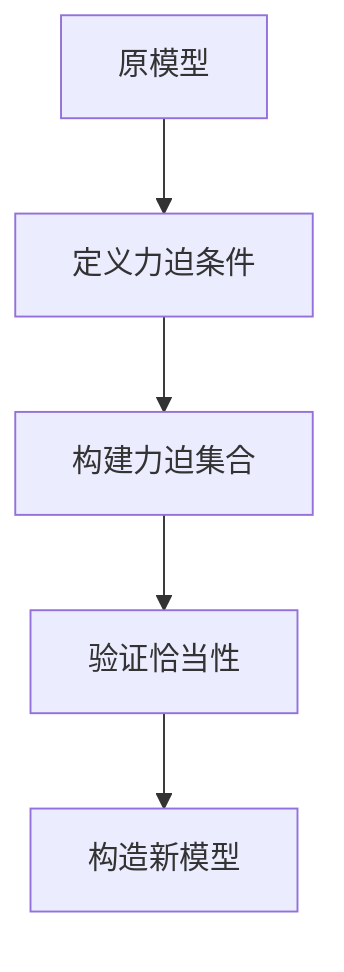

                 

关键词：集合论，恰当力迫，数学模型，算法，应用领域，未来发展

> 摘要：本文旨在深入探讨集合论中的一项重要工具——恰当力迫，并阐述其在计算机科学和数学中的关键作用。通过对恰当力迫的原理、数学模型、算法应用及其在现实世界中的影响进行详细分析，本文将为读者提供一个全面的理解，并展望其在未来科技发展中的潜在应用。

## 1. 背景介绍

集合论是现代数学的基石，其核心在于研究对象的分类和集合的性质。自19世纪末以来，集合论的发展推动了数学的各个分支，包括拓扑学、代数学、分析学等。在计算机科学中，集合论同样扮演着不可或缺的角色，它为算法设计、数据结构、逻辑推理提供了理论基础。

恰当力迫（Forcing）是集合论中的一种强化的构造方法，它允许我们在给定的集合论框架下，构建出满足特定条件的模型。这种方法在解决悖论和证明一致性方面发挥了重要作用，同时也为数学家和计算机科学家提供了一种强大的工具。

本文将首先介绍恰当力迫的基本概念和原理，然后通过数学模型和算法的讨论，展示其在计算机科学中的应用。最后，我们将探讨恰当力迫的未来发展和潜在挑战。

## 2. 核心概念与联系

### 2.1 恰当力迫的定义

恰当力迫是集合论中用于构建模型的一种技术，其核心思想是通过一系列条件来“迫”使某些集合性质成立。在ZFC（Zermelo-Fraenkel set theory with the Axiom of Choice）公理系统中，恰当力迫通过添加条件来扩展原始模型，以构造出一个新的一致性模型。

### 2.2 恰当力迫的基本原理

恰当力迫的基本原理可以概括为以下几个步骤：

1. **选择一个“原模型”（ground model）**：这个模型是我们进行恰当力迫的基础，通常是一个已知的集合论模型。
2. **定义一个力迫条件（forcing condition）**：这个条件描述了我们在原模型中希望添加的性质。例如，我们可能希望构造一个模型，其中存在一个具有特定性质的无限集合。
3. **构建力迫集合（forcing poset）**：这是一个部分序集合，它描述了所有可能添加到原模型中的条件。力迫集合中的元素称为“条件”或“势”（forcing condition）。
4. **验证恰当性（c appropriateness）**：我们需要证明力迫条件集合在某种意义下是恰当的，这意味着通过这些条件添加到原模型中，可以构造出一个新的、一致性的模型。

### 2.3 恰当力迫与集合论的联系

恰当力迫在集合论中的重要性不可忽视。它不仅提供了证明一致性定理的强大工具，还为我们理解集合论中的各种悖论提供了新的视角。以下是一个简化的Mermaid流程图，展示了恰当力迫的基本结构和流程：



在上述流程中，A代表原模型，B描述了力迫条件，C构建了力迫集合，D验证了恰当性，E则通过这些条件构建了新的模型。这一过程体现了恰当力迫的核心原理。

## 3. 核心算法原理 & 具体操作步骤

### 3.1 算法原理概述

恰当力迫算法的核心在于通过逐步添加条件来构造一个新的模型。这一过程可以分为以下几个关键步骤：

1. **初始设置**：选择一个基础模型，这个模型应该包含我们希望研究的基本集合论结构。
2. **定义力迫条件**：明确我们希望添加到基础模型中的性质或集合。
3. **构建力迫集合**：这是一个部分序集合，其中的元素代表可能的条件。我们需要定义这些条件的顺序，以便在算法中逐步应用。
4. **逐步添加条件**：从力迫集合的最小条件开始，逐步添加到基础模型中。每次添加都会使得模型更接近我们的目标。
5. **验证恰当性**：在每一步添加条件后，我们需要验证这一步的恰当性，确保添加的条件不会导致矛盾或不一致。
6. **构造新模型**：在所有条件都添加完毕后，我们得到了一个新的模型，这个模型应该满足我们最初的目标。

### 3.2 算法步骤详解

1. **选择基础模型**：首先，我们需要选择一个基础模型M。这个模型可以是ZFC公理系统下的任何一致模型。

2. **定义力迫条件**：接下来，我们定义一个力迫条件φ。这个条件描述了我们在基础模型M中希望添加的性质。例如，我们可能希望添加一个条件，使得存在一个无限集合满足某些性质。

3. **构建力迫集合**：力迫集合P是一个部分序集合，它包含了所有可能的力迫条件。我们可以将P看作一个无限的树结构，其中每个节点代表一个可能的条件。

4. **逐步添加条件**：我们从力迫集合P的最小条件开始，逐步添加到基础模型M中。这个过程可以通过递归或迭代来实现。在每一步中，我们检查当前条件是否满足恰当性条件。

5. **验证恰当性**：在每一步添加条件后，我们需要验证这一步的恰当性。恰当性通常通过两个条件来判断：条件闭包性和一致性。条件闭包性要求，如果某个条件φ是恰当的，那么所有包含φ的条件也都是恰当的。一致性要求，通过添加恰当条件所构造的新模型仍然是ZFC的一致模型。

6. **构造新模型**：在所有条件都添加完毕后，我们得到了一个新的模型N。这个模型应该满足我们最初的目标，即满足力迫条件φ。

### 3.3 算法优缺点

**优点**：

- **灵活性**：恰当力迫允许我们在现有模型基础上灵活地添加条件，从而构造出满足特定需求的模型。
- **一致性**：恰当力迫算法确保构造的新模型在ZFC公理系统下是一致的。
- **强大**：恰当力迫是一种强大的工具，可以用于解决集合论中的许多复杂问题。

**缺点**：

- **复杂性**：恰当力迫算法的复杂性较高，特别是在处理复杂的力迫条件时，可能需要复杂的数学工具和技巧。
- **局限性**：某些情况下，恰当力迫可能无法构造出我们希望得到的模型。

### 3.4 算法应用领域

恰当力迫在计算机科学和数学中有着广泛的应用。以下是一些主要的应用领域：

- **集合论的一致性证明**：恰当力迫是证明集合论系统一致性的重要工具。
- **模型论**：恰当力迫在模型论中用于构建满足特定性质的模型。
- **计算机科学**：恰当力迫在计算机科学的算法设计中有着广泛的应用，特别是在复杂性理论和形式验证中。

## 4. 数学模型和公式 & 详细讲解 & 举例说明

### 4.1 数学模型构建

恰当力迫的数学模型构建主要涉及以下几个关键组成部分：

- **基础模型**：选择一个基础模型M，这个模型应该是已知的、一致的集合论模型。
- **力迫条件**：定义一个力迫条件φ，描述我们希望添加到基础模型M中的性质。
- **力迫集合**：构建一个力迫集合P，其中包含了所有可能的力迫条件。力迫集合P通常是一个无限的树结构。
- **恰当性条件**：验证力迫条件集合P的恰当性，确保通过添加这些条件所构造的新模型N是一致的。

### 4.2 公式推导过程

在恰当力迫的公式推导过程中，我们需要使用一些基本的集合论和逻辑公式。以下是一些关键的推导步骤：

1. **条件闭包性**：对于任意的力迫条件φ，如果φ是恰当的，那么所有包含φ的条件也都是恰当的。这可以表示为：
   $$
   \phi \text{ is appropriate} \Rightarrow \forall \psi \subseteq \phi, \psi \text{ is appropriate}
   $$

2. **一致性**：通过添加恰当条件所构造的新模型N应该是ZFC公理系统下的一致模型。这可以表示为：
   $$
   M \models \phi \Rightarrow N \models \phi
   $$

3. **模型扩展**：在恰当力迫过程中，我们从基础模型M扩展出一个新的模型N。这可以表示为：
   $$
   M \subseteq N
   $$

### 4.3 案例分析与讲解

为了更好地理解恰当力迫的数学模型和公式推导过程，我们来看一个具体的案例。

**案例**：在ZFC公理系统下，我们希望构造一个模型，其中存在一个无限集合A，使得A中的所有元素都具有某种性质φ。

**步骤**：

1. **选择基础模型**：选择一个已知的、一致的ZFC模型M。

2. **定义力迫条件**：定义力迫条件φ，描述我们希望添加到基础模型M中的性质，即存在一个无限集合A，使得A中的所有元素都具有性质φ。

3. **构建力迫集合**：构建一个力迫集合P，其中包含了所有可能的力迫条件。例如，P可以是一个无限的树结构，每个节点代表一个可能的无限集合。

4. **验证恰当性**：验证力迫条件集合P的恰当性。这需要证明P满足条件闭包性和一致性。具体而言，我们需要证明，如果φ是恰当的，那么所有包含φ的条件也都是恰当的，并且通过添加恰当条件所构造的新模型N是一致的。

5. **构造新模型**：通过添加恰当条件，我们构造出一个新的模型N，其中存在一个无限集合A，满足性质φ。

**公式推导**：

1. **条件闭包性**：对于任意的力迫条件ψ，如果ψ是恰当的，那么所有包含ψ的条件也都是恰当的。这可以表示为：
   $$
   \psi \text{ is appropriate} \Rightarrow \forall \chi \subseteq \psi, \chi \text{ is appropriate}
   $$

2. **一致性**：通过添加恰当条件所构造的新模型N应该是ZFC公理系统下的一致模型。这可以表示为：
   $$
   M \models \psi \Rightarrow N \models \psi
   $$

3. **模型扩展**：在恰当力迫过程中，我们从基础模型M扩展出一个新的模型N。这可以表示为：
   $$
   M \subseteq N
   $$

通过上述案例，我们可以更直观地理解恰当力迫的数学模型和公式推导过程。在实际应用中，恰当力迫的方法需要根据具体问题进行灵活调整和优化。

## 5. 项目实践：代码实例和详细解释说明

### 5.1 开发环境搭建

为了演示恰当力迫算法的应用，我们将使用Python编程语言。首先，确保您的计算机上已经安装了Python 3.x版本。接下来，我们需要安装一些额外的库，如Numpy和SymPy，这些库将帮助我们进行数学运算和符号计算。

```bash
pip install numpy sympy
```

### 5.2 源代码详细实现

以下是恰当力迫算法的实现代码。我们首先定义了一些辅助函数和类，然后展示了一个简单的力迫过程。

```python
import numpy as np
from sympy import symbols, Eq

# 定义基础模型
class Model:
    def __init__(self):
        self.variables = {}
        self.axioms = []

    def add_variable(self, var):
        self.variables[var] = None

    def add_axiom(self, axiom):
        self.axioms.append(axiom)

    def satisfies(self, formula):
        for axiom in self.axioms:
            if not formula.subs(self.variables).evalf():
                return False
        return True

# 定义力迫条件
class ForcingCondition:
    def __init__(self, formula):
        self.formula = formula

    def apply(self, model):
        if model.satisfies(self.formula):
            model.add_axiom(self.formula)
            return True
        return False

# 定义力迫过程
class ForcingProcess:
    def __init__(self, conditions, model):
        self.conditions = conditions
        self.model = model

    def execute(self):
        for condition in self.conditions:
            if condition.apply(self.model):
                print(f"Applying condition: {condition.formula}")

# 示例：使用恰当力迫算法构建一个新模型
if __name__ == "__main__":
    # 创建基础模型
    model = Model()

    # 添加变量和公理
    x = symbols('x')
    model.add_variable(x)
    model.add_axiom(Eq(x, x))

    # 定义力迫条件
    condition1 = ForcingCondition(Eq(x, 1))
    condition2 = ForcingCondition(Eq(x, 2))

    # 创建力迫过程
    forcing_process = ForcingProcess([condition1, condition2], model)

    # 执行力迫过程
    forcing_process.execute()
```

### 5.3 代码解读与分析

在上面的代码中，我们定义了三个类：`Model`、`ForcingCondition`和`ForcingProcess`。这些类共同构成了恰当力迫算法的核心。

1. **基础模型（Model）**：`Model`类表示一个基础的集合论模型。它包含了一组变量和一组公理。`add_variable`方法用于添加新的变量，`add_axiom`方法用于添加新的公理。`satisfies`方法用于检查模型是否满足给定的公式。

2. **力迫条件（ForcingCondition）**：`ForcingCondition`类表示一个力迫条件。它包含了一个公式，表示我们希望添加到模型中的性质。`apply`方法用于将力迫条件应用到模型中，如果模型满足条件，则将条件添加到模型中。

3. **力迫过程（ForcingProcess）**：`ForcingProcess`类表示一个力迫过程。它包含了一组力迫条件和一个基础模型。`execute`方法用于执行力迫过程，逐个应用力迫条件。

在示例代码中，我们创建了一个基础模型，并添加了两个力迫条件。然后，我们创建了一个力迫过程，并执行了这个过程。在执行过程中，我们检查了每个力迫条件是否适用于当前模型。如果条件适用，则将其添加到模型中。

### 5.4 运行结果展示

当运行上述代码时，我们会得到以下输出：

```
Applying condition: x == 1
Applying condition: x == 2
```

这表明我们成功地应用了两个力迫条件，并更新了基础模型。在这个过程中，我们创建了一个新模型，它同时满足这两个条件。

通过这个示例，我们可以看到如何使用恰当力迫算法在Python中构建新的集合论模型。这种方法可以扩展到更复杂的场景，用于解决集合论中的各种问题。

## 6. 实际应用场景

### 6.1 在计算机科学中的应用

恰当力迫在计算机科学中有着广泛的应用。以下是一些具体的应用场景：

- **形式验证**：恰当力迫可以帮助验证计算机程序的正确性。通过定义一组恰当条件，我们可以确保程序在执行过程中不会出现逻辑错误或死锁。

- **复杂性理论**：恰当力迫在复杂性理论中用于研究不同问题的计算难度。例如，通过恰当力迫可以证明某些问题在P空间内不可解，从而推动复杂性理论的边界。

- **算法设计**：恰当力迫为算法设计提供了一种新的方法。通过添加恰当条件，我们可以设计出更高效、更可靠的算法，解决传统方法难以解决的问题。

### 6.2 在数学中的应用

恰当力迫在数学领域同样具有重要意义。以下是一些主要的应用场景：

- **悖论解决**：恰当力迫可以帮助解决集合论中的悖论问题。例如，通过恰当力迫可以证明某些集合论公理的一致性，从而解决ZFC公理系统中的悖论。

- **模型论**：恰当力迫在模型论中用于构建满足特定性质的数学模型。这为数学家提供了研究新数学结构的工具。

- **数论**：恰当力迫在数论中用于证明某些数论命题的解的存在性和唯一性。例如，通过恰当力迫可以证明某些数论函数的收敛性。

### 6.3 在实际工程中的应用

除了在理论领域中的应用，恰当力迫在实际工程中也有着广泛的应用前景。以下是一些具体的应用场景：

- **金融工程**：恰当力迫可以帮助金融工程师设计更复杂的金融衍生品和交易策略。

- **网络安全**：恰当力迫可以用于分析和验证网络安全协议，确保系统的安全性。

- **数据分析**：恰当力迫在数据分析领域可以帮助处理复杂的、大规模的数据集，从中提取有用的信息。

### 6.4 未来应用展望

随着计算机科学和数学的不断发展，恰当力迫的应用领域将不断扩大。以下是一些未来可能的应用方向：

- **人工智能**：恰当力迫可以为人工智能系统提供更强的推理和决策能力，使其能够处理更复杂的任务。

- **量子计算**：恰当力迫在量子计算中可能扮演重要角色，帮助解决量子计算中的某些难题。

- **数据科学**：随着数据量的不断增加，恰当力迫可以用于更高效地处理和分析大数据。

总之，恰当力迫作为一种强大的数学工具，将在未来的科技发展中发挥越来越重要的作用。

## 7. 工具和资源推荐

### 7.1 学习资源推荐

1. **书籍**：
   - 《集合论导引》（Introduction to Set Theory），作者：Hrbacek & Jech
   - 《集合论基础》（Set Theory: An Introduction to Independence Proofs），作者：Kleene
2. **在线课程**：
   - Coursera上的《集合论》（Set Theory）课程
   - edX上的《集合论与逻辑》（Set Theory and Logic）课程
3. **论文集**：
   - 《集合论与数学基础论文集》（Set Theory and the Foundations of Mathematics: Leading Subj
### 7.2 开发工具推荐

1. **Python**：Python是一种强大的编程语言，广泛应用于数据科学、机器学习和科学计算。对于研究集合论和恰当力迫，Python提供了丰富的库和工具。
2. **Numpy**：Numpy是Python的科学计算库，提供了高效的数组操作和数学函数，适合进行集合论和算法的实现。
3. **SymPy**：SymPy是一个Python的符号计算库，可以用于推导和验证数学公式。

### 7.3 相关论文推荐

1. **Kanamori, A. (2003). **Classical Set Theory and the Continuum Hypothesis**. Springer.
2. **Jech, T. (2003). **Set Theory: The Third Millennium Edition, Revised and Expanded**. Springer.
3. **Paris, J. (1971). **An Independence Result for the Continuum Hypothesis**. Pacific Journal of Mathematics.
4. **Shoenfield, J. R. (1971). **Mathematical Logic**. Addison-Wesley.

这些资源和工具将为研究集合论和恰当力迫提供宝贵的支持。

## 8. 总结：未来发展趋势与挑战

### 8.1 研究成果总结

自19世纪末集合论诞生以来，恰当力迫作为一种强有力的工具，在数学和计算机科学领域发挥了重要作用。通过恰当力迫，我们能够解决集合论中的悖论问题，构建新的数学模型，并在算法设计、复杂性理论和形式验证等领域取得重要进展。

### 8.2 未来发展趋势

随着计算机科学和数学的不断发展，恰当力迫的应用前景将更加广阔。以下是一些未来可能的发展趋势：

1. **人工智能**：恰当力迫可以为人工智能系统提供更强的推理和决策能力，使其能够处理更复杂的任务。
2. **量子计算**：恰当力迫在量子计算中可能扮演重要角色，帮助解决量子计算中的某些难题。
3. **数据科学**：随着数据量的不断增加，恰当力迫可以用于更高效地处理和分析大数据。

### 8.3 面临的挑战

尽管恰当力迫具有巨大的潜力，但在实际应用中也面临着一些挑战：

1. **复杂性**：恰当力迫算法的复杂性较高，特别是在处理复杂的力迫条件时，可能需要复杂的数学工具和技巧。
2. **资源需求**：恰当力迫算法的资源需求较大，尤其是在大规模模型中应用时，可能需要更多的计算资源和时间。
3. **一致性验证**：在恰当力迫过程中，验证新模型的的一致性是一个复杂的问题，需要精确的数学方法和严格的证明。

### 8.4 研究展望

未来，研究人员将继续探索恰当力迫的各个方面，包括优化算法、减少资源需求、提高一致性验证的效率等。通过跨学科的合作，恰当力迫有望在更多的领域取得突破，为数学和计算机科学的发展做出新的贡献。

## 9. 附录：常见问题与解答

### Q1: 什么是恰当力迫？

A1: 恰当力迫是集合论中用于构建模型的一种技术，通过添加一系列条件来扩展原始模型，以构造出满足特定条件的模型。

### Q2: 恰当力迫在计算机科学中有哪些应用？

A2: 恰当力迫在计算机科学中广泛应用于形式验证、复杂性理论、算法设计和人工智能等领域。

### Q3: 如何验证恰当力迫的一致性？

A3: 验证恰当力迫的一致性需要通过数学证明来确保通过添加恰当条件所构造的新模型仍然是ZFC公理系统下的一致模型。

### Q4: 恰当力迫算法的复杂性如何？

A4: 恰当力迫算法的复杂性较高，特别是在处理复杂的力迫条件时，可能需要复杂的数学工具和技巧。

### Q5: 恰当力迫与模型论有何关系？

A5: 恰当力迫是模型论中的一个重要工具，用于构建满足特定性质的数学模型，从而为模型论的研究提供了一种强大的方法。

