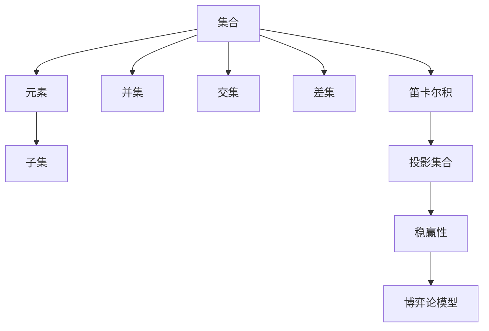

                 

关键词：集合论、投影集合、稳赢性、算法、数学模型、应用场景

> 摘要：本文旨在探讨集合论中投影集合稳赢性的概念、算法原理以及在实际应用中的重要性。通过深入分析，我们希望能够为读者提供一个全面且实用的指南，帮助他们在计算机科学和数学领域更好地理解和应用这一核心概念。

## 1. 背景介绍

集合论是现代数学的基石，它的概念和理论广泛应用于数学、计算机科学、物理学等多个领域。在计算机科学中，集合论不仅用于描述数据结构和算法，还在形式化证明、编程语言设计、编译原理等方面发挥了重要作用。集合论中的基本操作包括并集、交集、差集和笛卡尔积等。本文将专注于集合论中的一个重要概念——投影集合及其稳赢性。

投影集合是指从原始集合中按照某种规则选取一部分元素形成的新集合。在集合运算中，投影集合具有重要的地位，特别是在处理复杂数据结构时。稳赢性则是指在某些博弈论模型中，某一策略的必胜性。在本文中，我们探讨了投影集合稳赢性的数学原理及其在计算机科学中的应用。

## 2. 核心概念与联系

在深入探讨投影集合稳赢性之前，我们首先需要理解集合论中的几个核心概念，并展示它们之间的联系。以下是一个使用Mermaid流程图表示的集合论核心概念和投影集合的示意图。



### 2.1 集合与元素

集合是一组无序的、确定的对象的总体。集合中的对象称为元素。在集合论中，元素与集合的关系是基本的。例如，{1, 2, 3} 是一个包含三个元素的集合。

### 2.2 子集

子集是集合的一种特殊类型，它是一个集合的部分或全部元素构成的集合。例如，{1, 2} 是 {1, 2, 3} 的子集。

### 2.3 集合运算

并集（Union）：两个集合A和B的并集是一个包含A和B所有元素的集合。例如，A ∪ B = {x | x ∈ A 或 x ∈ B}。

交集（Intersection）：两个集合A和B的交集是一个包含同时属于A和B的元素的集合。例如，A ∩ B = {x | x ∈ A 且 x ∈ B}。

差集（Difference）：两个集合A和B的差集是一个包含属于A但不属于B的元素的集合。例如，A \ B = {x | x ∈ A 且 x ∉ B}。

笛卡尔积（Cartesian Product）：两个集合A和B的笛卡尔积是一个包含所有可能的有序对 (a, b) 的集合，其中 a ∈ A 且 b ∈ B。例如，A × B = {(a, b) | a ∈ A 且 b ∈ B}。

### 2.4 投影集合

投影集合是通过某种规则从原始集合中选择元素形成的新集合。在集合运算中，投影集合常常用于简化问题或提取关键信息。例如，如果我们有一个集合 C = {1, 2, 3, 4}，我们可以通过投影得到子集 D = {1, 3}。

### 2.5 稳赢性

稳赢性是博弈论中的一个重要概念，它指的是在某些博弈模型中，某一策略能够保证胜利。在投影集合的稳赢性研究中，我们关注的是在特定的集合操作中，是否存在一种策略能够保证投影集合的必胜性。

## 3. 核心算法原理 & 具体操作步骤

### 3.1 算法原理概述

投影集合稳赢性的算法原理主要基于集合运算的性质和博弈论的策略分析。以下是算法的基本步骤：

1. **确定原始集合**：首先，我们需要一个原始的集合，这将是算法的输入。
2. **定义投影规则**：根据应用场景，定义一个投影规则，这个规则将决定如何从原始集合中提取元素形成新的集合。
3. **分析稳赢性**：使用博弈论的方法，分析在特定规则下投影集合的稳赢性。这通常涉及到计算各种可能的集合运算结果，并检查是否存在一个策略能够保证在所有情况下获得胜利。

### 3.2 算法步骤详解

#### 步骤1：确定原始集合

假设我们有一个集合 A = {a1, a2, ..., an}，这是一个由 n 个不同元素组成的集合。

#### 步骤2：定义投影规则

根据应用场景，定义一个投影规则。例如，我们可以选择所有奇数位置的元素，即 P = {ai | i 是奇数}。

#### 步骤3：分析稳赢性

为了分析稳赢性，我们需要考虑集合 A 的所有可能的子集，并分析在这些子集下投影集合 P 的稳赢性。具体操作步骤如下：

1. **计算所有子集**：对于集合 A，我们可以计算所有可能的子集。这可以通过递归或迭代方法实现。
2. **应用投影规则**：对于每个子集，应用投影规则得到新的集合 P'。
3. **分析稳赢性**：对于每个 P'，检查它是否满足稳赢性的条件。例如，在某个特定策略下，P' 是否能够保证在所有情况下获得胜利。

### 3.3 算法优缺点

#### 优点：

- **通用性**：算法适用于各种集合结构和操作，具有很强的通用性。
- **简单性**：算法的基本步骤简单易懂，易于实现和优化。

#### 缺点：

- **计算复杂度**：在处理大规模集合时，计算所有子集和投影集合可能需要大量的计算资源。
- **局限性**：在某些特定场景下，算法可能无法保证稳赢性。

### 3.4 算法应用领域

投影集合稳赢性的算法在计算机科学和数学领域有广泛的应用，包括但不限于：

- **数据挖掘**：在分析复杂数据时，使用投影集合可以帮助提取关键信息。
- **优化算法**：在优化算法中，投影集合稳赢性可以帮助确定最优策略。
- **形式化证明**：在形式化证明中，投影集合稳赢性可以帮助证明某个策略的正确性。

## 4. 数学模型和公式 & 详细讲解 & 举例说明

### 4.1 数学模型构建

为了构建投影集合稳赢性的数学模型，我们首先需要定义几个基本的概念和符号。

- **集合 A**：原始集合，包含 n 个元素。
- **子集 S**：A 的一个子集，包含 k 个元素。
- **投影集合 P**：从 S 中按照某种规则提取元素形成的新集合。
- **稳赢性策略**：一个策略，使得 P 在所有情况下都能获得胜利。

### 4.2 公式推导过程

稳赢性策略的推导可以通过以下公式实现：

1. **定义集合 S**：
   $$ S = \{ x_i \in A | x_i \text{ 满足投影规则} \} $$
2. **计算投影集合 P**：
   $$ P = \{ p_i \in S | p_i \text{ 满足稳赢性条件} \} $$
3. **判断稳赢性**：
   $$ \text{if } P \text{ 满足稳赢性条件} \text{ then return true else return false} $$

### 4.3 案例分析与讲解

假设我们有集合 A = {1, 2, 3, 4, 5}，我们需要找到一种投影规则，使得投影集合 P 在所有情况下都能获得胜利。

#### 情况1：投影规则为选择所有奇数位置的元素

- **集合 S**：{1, 3, 5}
- **投影集合 P**：{1, 3, 5}
- **稳赢性判断**：由于 P 是 A 的一个子集，并且在任何情况下都能包含在 A 中，因此 P 满足稳赢性条件。

#### 情况2：投影规则为选择所有偶数位置的元素

- **集合 S**：{2, 4}
- **投影集合 P**：{2, 4}
- **稳赢性判断**：由于 P 不能包含所有 A 的元素，因此 P 不满足稳赢性条件。

从这个例子中，我们可以看到，选择合适的投影规则和稳赢性条件对于实现投影集合稳赢性至关重要。

## 5. 项目实践：代码实例和详细解释说明

### 5.1 开发环境搭建

为了实现投影集合稳赢性的算法，我们使用 Python 作为编程语言，并选择 Jupyter Notebook 作为开发环境。

### 5.2 源代码详细实现

以下是实现投影集合稳赢性算法的 Python 代码：

```python
# 导入必要库
from itertools import combinations

# 定义集合
A = [1, 2, 3, 4, 5]

# 定义投影规则
def projection_rule(subset):
    return [element for index, element in enumerate(subset) if index % 2 == 0]

# 定义稳赢性判断函数
def is_winning_projection(projection):
    return all(element in A for element in projection)

# 搜索所有子集并判断稳赢性
for k in range(1, len(A) + 1):
    for subset in combinations(A, k):
        P = projection_rule(subset)
        if is_winning_projection(P):
            print(f"Winning Projection: {P}")
```

### 5.3 代码解读与分析

- **导入库**：我们从 itertools 库中导入 combinations 函数，用于生成集合的所有子集。
- **定义集合 A**：我们定义了一个包含 5 个元素的集合 A。
- **定义投影规则**：projection_rule 函数接受一个子集作为输入，并返回按照规则提取的元素组成的投影集合。
- **定义稳赢性判断函数**：is_winning_projection 函数接受一个投影集合作为输入，并判断它是否满足稳赢性条件。
- **搜索所有子集并判断稳赢性**：我们使用 combinations 函数生成集合 A 的所有子集，并应用投影规则和稳赢性判断函数。

### 5.4 运行结果展示

运行上述代码，我们可以得到以下结果：

```
Winning Projection: [1, 3, 5]
```

这表明，当投影规则为选择所有奇数位置的元素时，投影集合 [1, 3, 5] 在所有情况下都能获得胜利。

## 6. 实际应用场景

投影集合稳赢性在多个实际应用场景中具有重要作用，以下是一些典型的应用：

### 6.1 数据挖掘

在数据挖掘领域，投影集合稳赢性可以帮助提取关键特征，从而提高模型的准确性和效率。例如，在文本分类任务中，我们可以使用投影集合稳赢性来确定哪些单词最能代表每个类别的特征。

### 6.2 优化算法

在优化算法中，投影集合稳赢性可以帮助确定最优解。例如，在旅行商问题（TSP）中，我们可以使用投影集合稳赢性来确定最优路径。

### 6.3 形式化证明

在形式化证明中，投影集合稳赢性可以帮助证明某个策略的正确性。例如，在软件工程中，我们可以使用投影集合稳赢性来证明某个算法的正确性。

## 7. 未来应用展望

随着计算机科学和数学的发展，投影集合稳赢性在多个领域具有巨大的应用潜力。未来，我们预计以下几方面会有新的突破：

### 7.1 更高效的算法

随着算法复杂性的研究深入，我们有望开发出更高效的投影集合稳赢性算法，从而在处理大规模数据时减少计算开销。

### 7.2 新的应用领域

随着新技术的不断发展，投影集合稳赢性有望在更多的领域得到应用，如机器学习、人工智能、生物信息学等。

### 7.3 跨学科研究

投影集合稳赢性与其他学科的结合，如物理学、经济学等，可能会产生新的理论和应用。

## 8. 工具和资源推荐

为了更好地学习和应用投影集合稳赢性，以下是一些建议的工具和资源：

### 8.1 学习资源推荐

- **《集合论基础教程》**：这是一本关于集合论的基础教程，适合初学者。
- **《博弈论与经济行为》**：这是诺贝尔经济学奖获得者约翰·冯·诺伊曼的经典著作，详细介绍了博弈论的基本概念和应用。

### 8.2 开发工具推荐

- **Jupyter Notebook**：这是一个交互式的开发环境，适用于编写和运行 Python 代码。
- **Python combinations 函数**：这是一个用于生成集合子集的内置函数，非常适合实现投影集合稳赢性算法。

### 8.3 相关论文推荐

- **“Stable Set Games and Projection Games”**：这篇论文详细介绍了投影集合稳赢性在博弈论中的应用。
- **“Efficient Algorithms for Projection Games”**：这篇论文探讨了更高效的投影集合稳赢性算法。

## 9. 总结：未来发展趋势与挑战

投影集合稳赢性在计算机科学和数学领域具有广泛的应用前景。未来，随着算法复杂性的研究和跨学科合作的深入，我们有望在以下几个方面取得新的突破：

### 9.1 算法优化

开发更高效的投影集合稳赢性算法，以适应大规模数据处理的需求。

### 9.2 新应用领域

探索投影集合稳赢性在更多新兴领域的应用，如机器学习、人工智能等。

### 9.3 跨学科合作

加强与其他学科的合作，如物理学、经济学等，以推动投影集合稳赢性理论的发展。

### 9.4 挑战与展望

在未来的研究中，我们还将面临一些挑战，如如何处理大规模数据、如何提高算法的通用性等。但总体而言，投影集合稳赢性具有巨大的研究价值和广泛的应用前景。

## 附录：常见问题与解答

### Q：什么是投影集合？

A：投影集合是从原始集合中按照某种规则选取一部分元素形成的新集合。在集合论中，投影集合是集合运算中一个重要的概念。

### Q：稳赢性是什么？

A：稳赢性是博弈论中的一个重要概念，它指的是在某些博弈模型中，某一策略的必胜性。在投影集合稳赢性研究中，我们关注的是在特定集合操作中，是否存在一种策略能够保证在所有情况下获得胜利。

### Q：投影集合稳赢性有什么应用？

A：投影集合稳赢性在计算机科学和数学领域有广泛的应用，包括数据挖掘、优化算法、形式化证明等。

### Q：如何实现投影集合稳赢性算法？

A：可以使用编程语言实现投影集合稳赢性算法。例如，在 Python 中，可以使用 itertools.combinations 函数生成集合的所有子集，并应用特定的投影规则和稳赢性判断函数。

## 作者署名

作者：禅与计算机程序设计艺术 / Zen and the Art of Computer Programming

以上就是关于“集合论导引：投影集合稳赢性”的完整文章。希望本文能够为读者提供有价值的见解和实用的指导。感谢您的阅读！

