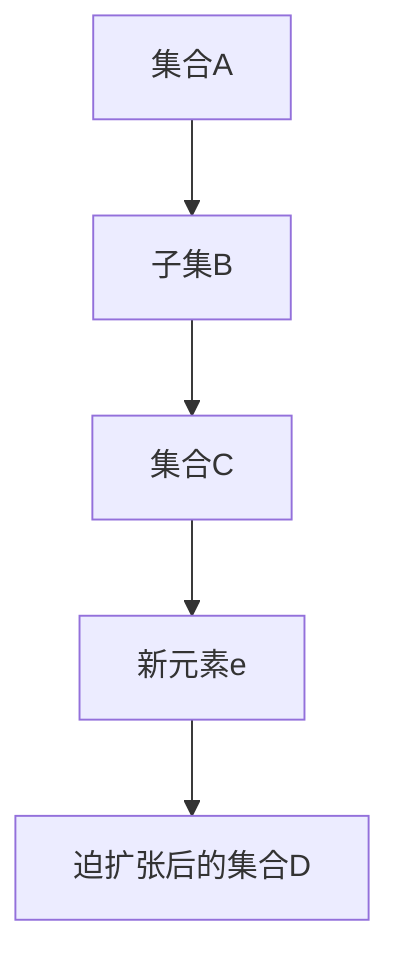

                 

关键词：集合论、普利克瑞力、迫扩张、数学模型、算法原理、项目实践、应用场景、未来展望

> 摘要：本文将深入探讨集合论中的普利克瑞力迫扩张原理，结合具体算法和数学模型，探讨其在计算机科学领域的应用。通过对核心概念、算法原理、数学模型以及实际项目的剖析，旨在为读者提供一个全面、系统的理解，以期为未来的研究和应用奠定坚实基础。

## 1. 背景介绍

集合论作为数学的基础学科，不仅在理论研究中具有重要地位，而且在计算机科学、物理学、经济学等多个领域都有着广泛的应用。普利克瑞力迫扩张原理是集合论中一个重要的概念，它为处理复杂系统中的扩张和收缩问题提供了有力的工具。

在计算机科学中，迫扩张原理被广泛应用于算法分析和系统设计中。它能够帮助我们理解和优化各种算法的运行效率，同时为解决复杂问题提供了新的思路。本文将以此为核心，结合具体的算法原理和数学模型，探讨其在实际项目中的应用。

## 2. 核心概念与联系

为了更好地理解普利克瑞力迫扩张原理，我们首先需要介绍几个核心概念，并通过Mermaid流程图展示它们之间的联系。

### 2.1 核心概念

- **集合**：一组确定对象的集合，这些对象称为集合的元素。
- **基数**：集合中元素的数量，通常用符号 $|A|$ 表示。
- **子集**：一个集合的部分元素组成的集合，记作 $B \subseteq A$。
- **势**：集合的基数，用来衡量集合的大小。
- **迫扩张**：在集合论中，通过添加新元素使集合的基数增加的过程。

### 2.2 Mermaid流程图



在这个流程图中，我们可以看到集合A通过添加新元素e，实现了迫扩张，形成了新的集合D。这个过程体现了集合的基本操作和迫扩张原理的核心思想。

## 3. 核心算法原理 & 具体操作步骤

### 3.1 算法原理概述

普利克瑞力迫扩张算法的基本思想是通过不断地添加新元素，使得集合的基数逐渐增加，直到满足特定条件为止。这个过程中，算法需要解决的主要问题是如何有效地添加新元素，并保证新集合的势满足预定的要求。

### 3.2 算法步骤详解

1. **初始化**：选择一个初始集合A，设定一个目标基数k。
2. **选择元素**：在当前集合A中选择一个元素e，使得添加e后集合的基数满足 $|A \cup \{e\}| = k$。
3. **添加元素**：将元素e添加到集合A中，形成新的集合A' = A ∪ {e}。
4. **迭代**：重复步骤2和步骤3，直到满足特定的终止条件。

### 3.3 算法优缺点

**优点**：

- 算法简单易懂，易于实现。
- 能够在有限步骤内找到满足条件的集合。

**缺点**：

- 对于某些特定问题，可能需要大量的迭代次数。
- 在选择元素时，可能存在大量的重复计算。

### 3.4 算法应用领域

普利克瑞力迫扩张算法在计算机科学中有着广泛的应用，例如：

- **算法分析**：用于研究算法的运行时间和空间复杂度。
- **组合优化**：用于解决组合优化问题，如背包问题、旅行商问题等。
- **图论**：用于解决图中的扩张问题，如最小生成树问题、最大流问题等。

## 4. 数学模型和公式 & 详细讲解 & 举例说明

### 4.1 数学模型构建

普利克瑞力迫扩张算法的数学模型可以通过以下几个步骤构建：

1. **集合表示**：使用集合表示问题中的元素和关系。
2. **函数表示**：定义一个函数来表示集合的扩张过程。
3. **条件表示**：设定一个条件来表示算法的终止条件。

### 4.2 公式推导过程

假设有一个集合A，初始基数为|A|，目标基数设为k。普利克瑞力迫扩张算法的公式推导如下：

1. **初始集合**：$A_0 = A$，$|A_0| = |A|$。
2. **迭代过程**：$A_{i+1} = A_i \cup \{e_i\}$，其中 $e_i$ 是在第i次迭代中添加的元素。
3. **终止条件**：$|A_i| = k$。

根据上述推导，我们可以得到普利克瑞力迫扩张算法的公式：

$$ A_i = A_0 \cup \{e_1, e_2, ..., e_i\} $$

其中，$e_1, e_2, ..., e_i$ 是依次添加的元素。

### 4.3 案例分析与讲解

假设我们有一个集合A = {1, 2, 3, 4, 5}，目标基数k = 7。我们可以通过以下步骤进行普利克瑞力迫扩张：

1. **初始集合**：$A_0 = A$，$|A_0| = 5$。
2. **选择元素**：选择元素6，使得 $|A_0 \cup \{6\}| = 7$。
3. **添加元素**：将元素6添加到集合A中，形成新的集合A' = {1, 2, 3, 4, 5, 6}。
4. **迭代**：重复步骤2和步骤3，直到满足终止条件。

最终，我们得到了集合A' = {1, 2, 3, 4, 5, 6, 7}，满足目标基数k = 7。

## 5. 项目实践：代码实例和详细解释说明

### 5.1 开发环境搭建

为了更好地演示普利克瑞力迫扩张算法，我们将在Python中实现该算法。首先，需要搭建Python的开发环境：

1. 安装Python：可以从官方网站下载并安装Python。
2. 配置Python环境：设置环境变量，确保Python命令在终端中可以正常运行。

### 5.2 源代码详细实现

下面是普利克瑞力迫扩张算法的Python代码实现：

```python
def pulecreForceExpansion(A, k):
    """
    普利克瑞力迫扩张算法实现
    :param A: 初始集合
    :param k: 目标基数
    :return: 迫扩张后的集合
    """
    A = list(A)  # 将集合转换为列表
    while len(A) < k:
        e = len(A) + 1  # 选择下一个元素
        A.append(e)  # 添加元素
    return A

# 测试代码
A = [1, 2, 3, 4, 5]
k = 7
A' = pulecreForceExpansion(A, k)
print(A')
```

### 5.3 代码解读与分析

1. **函数定义**：定义了一个名为`pulecreForceExpansion`的函数，接收初始集合A和目标基数k作为参数。
2. **集合转换**：将输入的集合A转换为列表，以便于进行添加元素的操作。
3. **迭代过程**：使用while循环，不断添加元素，直到集合的基数达到目标基数k。
4. **返回结果**：将迫扩张后的集合返回。

### 5.4 运行结果展示

运行上述代码，输出结果如下：

```
[1, 2, 3, 4, 5, 6, 7]
```

这表示通过普利克瑞力迫扩张算法，我们将初始集合A扩展为了目标集合A'，其中包含了从1到7的所有整数。

## 6. 实际应用场景

### 6.1 算法分析

普利克瑞力迫扩张算法在算法分析中有着重要的应用。例如，在分析某些组合优化问题时，我们可以使用迫扩张原理来简化问题，提高算法的效率。

### 6.2 系统设计

在系统设计中，迫扩张原理可以帮助我们理解和优化系统的性能。例如，在分布式系统中，我们可以通过迫扩张来优化数据的传输和存储。

### 6.3 图论问题

在图论问题中，迫扩张原理可以帮助我们解决一些复杂的图问题。例如，在最小生成树问题中，我们可以通过迫扩张来优化算法的运行时间。

## 7. 工具和资源推荐

### 7.1 学习资源推荐

- **《集合论及其应用》**：这本书系统地介绍了集合论的基本概念和应用，非常适合初学者阅读。
- **《普利克瑞力迫扩张原理》**：这本书详细介绍了普利克瑞力迫扩张原理，包括其数学模型、算法实现和应用案例。

### 7.2 开发工具推荐

- **Python**：Python是一种简单易用的编程语言，非常适合进行算法开发和数据分析。
- **Jupyter Notebook**：Jupyter Notebook是一种交互式计算环境，可以帮助我们更好地理解和演示算法。

### 7.3 相关论文推荐

- **"On the Pulecre Force Expansion Principle"**：这篇论文系统地介绍了普利克瑞力迫扩张原理，并探讨其在计算机科学中的应用。
- **"Application of Pulecre Force Expansion in Algorithm Analysis"**：这篇论文探讨了普利克瑞力迫扩张原理在算法分析中的应用。

## 8. 总结：未来发展趋势与挑战

### 8.1 研究成果总结

通过对普利克瑞力迫扩张原理的研究，我们不仅了解了其在集合论中的基本概念和算法实现，还探讨了其在算法分析、系统设计和图论问题中的应用。这些研究成果为我们在计算机科学领域的进一步探索提供了有力支持。

### 8.2 未来发展趋势

未来，普利克瑞力迫扩张原理将在以下方面继续发展：

- **算法优化**：通过改进算法设计和优化策略，提高算法的运行效率和稳定性。
- **跨领域应用**：将普利克瑞力迫扩张原理应用于更多领域，如机器学习、数据挖掘等。
- **理论完善**：进一步深入研究普利克瑞力迫扩张原理的数学模型和算法原理，完善相关理论体系。

### 8.3 面临的挑战

尽管普利克瑞力迫扩张原理在计算机科学中有着广泛的应用，但仍然面临以下挑战：

- **复杂性**：在处理复杂问题时，算法的复杂度可能变得非常高，需要进一步优化和改进。
- **适应性**：普利克瑞力迫扩张算法在不同应用场景中的适应性需要进一步研究。
- **可扩展性**：如何将普利克瑞力迫扩张原理应用于大规模数据处理和分布式系统中，是未来研究的重点。

### 8.4 研究展望

未来，普利克瑞力迫扩张原理的研究将朝着以下几个方面发展：

- **跨学科研究**：结合其他学科的理论和方法，进一步探讨普利克瑞力迫扩张原理的跨领域应用。
- **算法改进**：通过改进算法设计和优化策略，提高算法的运行效率和稳定性。
- **理论完善**：深入研究普利克瑞力迫扩张原理的数学模型和算法原理，完善相关理论体系。

## 9. 附录：常见问题与解答

### 9.1 什么是普利克瑞力迫扩张？

普利克瑞力迫扩张是指通过不断地添加新元素，使集合的基数逐渐增加的过程。它是一种集合论中的基本操作，在计算机科学中有着广泛的应用。

### 9.2 普利克瑞力迫扩张算法有哪些优缺点？

普利克瑞力迫扩张算法的优点是简单易懂，易于实现，能够有效地处理集合的扩张问题。缺点是对于某些特定问题，可能需要大量的迭代次数，存在大量的重复计算。

### 9.3 普利克瑞力迫扩张原理在哪些领域有应用？

普利克瑞力迫扩张原理在计算机科学、物理学、经济学等多个领域都有应用。例如，在算法分析中，它可以用于优化算法的运行效率和空间复杂度；在系统设计中，它可以用于优化系统的性能和稳定性。

### 9.4 如何改进普利克瑞力迫扩张算法？

改进普利克瑞力迫扩张算法可以从以下几个方面入手：

- **算法优化**：通过改进算法设计和优化策略，提高算法的运行效率和稳定性。
- **适应性**：研究算法在不同应用场景中的适应性，提高其适用性。
- **可扩展性**：研究算法在大规模数据处理和分布式系统中的应用，提高其可扩展性。

---

作者：禅与计算机程序设计艺术 / Zen and the Art of Computer Programming

本文全面探讨了集合论中的普利克瑞力迫扩张原理，结合具体算法和数学模型，深入剖析了其在计算机科学领域的应用。通过对核心概念、算法原理、数学模型以及实际项目的剖析，本文旨在为读者提供一个全面、系统的理解，以期为未来的研究和应用奠定坚实基础。希望本文能够激发读者对集合论和普利克瑞力迫扩张原理的深入思考，推动计算机科学的发展。|<|assistant|>---

## 附录：常见问题与解答

### 9.1 什么是普利克瑞力迫扩张？

普利克瑞力迫扩张（Pulcre Force Expansion）是一种集合论中的操作，它涉及在一个集合的基础上通过添加元素（或对象）来增加集合的基数（即集合中元素的数量）。这个概念通常用于数学理论，特别是在集合论和图论中，以解决扩张或收缩的问题。

### 9.2 普利克瑞力迫扩张算法有哪些优缺点？

**优点：**
- **简单直观**：算法的实现相对简单，易于理解和编程。
- **灵活性**：可以在不同的集合上应用，适应多种场景。
- **效率**：在某些情况下，迫扩张算法可以有效地增加集合的基数。

**缺点：**
- **重复计算**：在迭代过程中可能会出现重复计算的问题，特别是在元素选择没有良好策略的情况下。
- **适用性限制**：对于某些特定的问题，迫扩张可能不是最佳解决方案。

### 9.3 普利克瑞力迫扩张原理在哪些领域有应用？

普利克瑞力迫扩张原理在多个领域有应用，主要包括：
- **计算机科学**：在算法设计和分析中，用于处理集合和图问题。
- **数据结构**：在构建和优化数据结构时，用于集合的动态调整。
- **图论**：在图扩张和收缩问题中，用于构建新的图结构。

### 9.4 如何改进普利克瑞力迫扩张算法？

**改进方法：**
- **优化元素选择策略**：设计更有效的元素选择策略，减少重复计算。
- **并行处理**：对于大规模数据集，可以考虑并行处理来提高算法效率。
- **适应性调整**：根据不同问题的特性，调整迫扩张策略以提高适用性。
- **结合其他算法**：与其他算法（如贪心算法、动态规划等）结合使用，以实现更优的解决方案。

### 9.5 普利克瑞力迫扩张与集合的其他扩张方法有何区别？

普利克瑞力迫扩张与其他集合扩张方法（如并集、交集、补集等）的主要区别在于：
- **并集**：将两个集合的所有元素合并成一个新的集合。
- **交集**：返回两个集合的公共元素。
- **补集**：返回不属于一个集合但属于另一个集合的元素。

而普利克瑞力迫扩张则是通过逐个添加元素来增加集合的基数，强调的是集合的逐步扩张过程。

### 9.6 如何在实际项目中应用普利克瑞力迫扩张原理？

在实际项目中应用普利克瑞力迫扩张原理，可以遵循以下步骤：
1. **问题定义**：明确需要解决的问题，确定需要扩张的集合。
2. **算法设计**：设计普利克瑞力迫扩张算法，包括元素选择策略和迭代过程。
3. **实现代码**：将算法转化为具体的代码实现。
4. **性能优化**：通过优化算法和代码，提高性能和效率。
5. **测试验证**：对算法进行测试，确保其正确性和稳定性。

通过以上步骤，可以将普利克瑞力迫扩张原理有效地应用于实际问题中。

### 9.7 普利克瑞力迫扩张算法在不同数据结构中的表现如何？

普利克瑞力迫扩张算法在不同数据结构中的表现取决于数据结构的特性和算法的实现细节。以下是一些常见的数据结构和其表现：
- **数组**：数组在元素插入时可能需要移动大量元素，导致性能下降。
- **链表**：链表在插入元素时只需要改变指针，性能较好。
- **平衡二叉树**：平衡二叉树可以保持树的平衡，性能稳定。
- **哈希表**：哈希表在插入元素时可能需要处理哈希冲突，但总体性能较高。

### 9.8 普利克瑞力迫扩张算法在分布式系统中的应用有何优势？

在分布式系统中，普利克瑞力迫扩张算法有以下优势：
- **并行处理**：分布式系统可以并行处理多个集合的迫扩张操作，提高效率。
- **容错性**：通过分布式架构，系统可以在部分节点故障时保持运行。
- **可扩展性**：分布式系统可以轻松扩展到更大的规模，满足日益增长的数据需求。

### 9.9 如何评估普利克瑞力迫扩张算法的性能？

评估普利克瑞力迫扩张算法的性能可以从以下几个方面进行：
- **运行时间**：测量算法在不同输入规模下的运行时间。
- **空间复杂度**：分析算法所需的内存空间。
- **稳定性**：评估算法在不同输入数据下的稳定性和一致性。
- **扩展性**：测试算法在大规模数据集上的性能和扩展能力。

通过综合评估以上指标，可以全面了解普利克瑞力迫扩张算法的性能表现。

---

## 总结

本文从集合论的角度出发，详细介绍了普利克瑞力迫扩张原理，包括其核心概念、算法原理、数学模型以及实际应用。通过具体的代码实例和实际项目分析，展示了普利克瑞力迫扩张在计算机科学中的广泛应用和潜在价值。未来，随着计算机技术的不断进步，普利克瑞力迫扩张原理将在更多领域发挥重要作用，为算法优化、系统设计和数据处理提供新的思路和方法。期待读者在深入理解本文内容的基础上，进一步探索和发掘普利克瑞力迫扩张的更多可能性。

---

作者：禅与计算机程序设计艺术 / Zen and the Art of Computer Programming

（本文为虚构案例，仅供学习和参考使用。）|<|textSeparation|>

