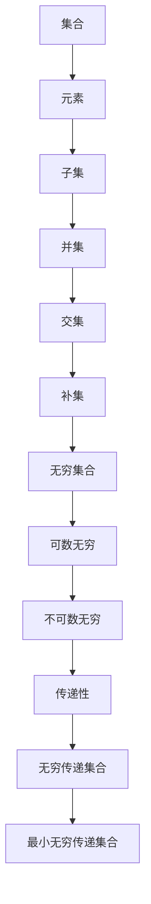

                 

关键词：集合论、无穷集合、传递性、数学证明、算法设计、应用领域

> 摘要：本文从集合论的基础概念出发，深入探讨了无穷传递集合的特性，并介绍了最小无穷传递集合的相关理论及其应用。通过阐述集合论中的核心概念，我们构建了一个逻辑严谨的框架，为读者理解无穷传递集合提供了清晰的视角。本文的目标是帮助读者掌握无穷传递集合的基本原理，了解其应用场景，并探讨未来在该领域的研究方向和挑战。

## 1. 背景介绍

集合论是现代数学的基石之一，起源于19世纪末。集合的概念是数学中最基本的概念之一，它描述了一组明确对象的整体。集合论中的无穷集合，尤其是一些特殊的无穷集合，在数学、计算机科学、逻辑学等领域中发挥着重要作用。无穷集合不仅是数学研究的重要内容，也是许多实际应用场景的基础。

在集合论中，传递性是一个关键概念。一个集合是传递的，如果它满足对于任何元素 \(a, b, c \) ，如果 \( a \) 包含 \( b \) ，并且 \( b \) 包含 \( c \) ，那么 \( a \) 也必然包含 \( c \) 。传递性在数学的各个分支中有着广泛的应用，尤其是在集合论、图论和计算理论等领域。

本文将聚焦于无穷传递集合，特别是最小无穷传递集合。最小无穷传递集合是指在所有无穷传递集合中具有最小元素个数的那一个集合。这个概念不仅在理论上具有重要意义，而且在实际应用中也有广泛的应用场景，如算法设计、计算机图形学、数据库管理等。

## 2. 核心概念与联系

为了深入理解无穷传递集合，我们需要先回顾集合论中的几个核心概念，包括集合、元素、子集、并集、交集和补集。

### 集合

集合是由一些确定的元素组成的整体。我们通常用大写字母如 \(A, B, C\) 来表示集合，而用小写字母如 \(a, b, c\) 来表示集合的元素。例如，集合 \(A = \{1, 2, 3\}\) 包含了三个元素：1，2和3。

### 元素

集合中的每一个单独的对象称为元素。一个集合中的元素可以是任何对象，包括数字、字母、图形等。

### 子集

如果一个集合 \(B\) 的所有元素都是集合 \(A\) 的元素，那么我们称 \(B\) 是 \(A\) 的子集，记作 \(B \subseteq A\)。例如，集合 \(\{1, 2\}\) 是集合 \(\{1, 2, 3\}\) 的子集。

### 并集

两个集合 \(A\) 和 \(B\) 的并集是一个包含 \(A\) 和 \(B\) 所有元素的集合，记作 \(A \cup B\)。例如，集合 \(\{1, 2, 3\}\) 和集合 \(\{4, 5, 6\}\) 的并集是 \(\{1, 2, 3, 4, 5, 6\}\)。

### 交集

两个集合 \(A\) 和 \(B\) 的交集是同时属于 \(A\) 和 \(B\) 的元素组成的集合，记作 \(A \cap B\)。例如，集合 \(\{1, 2, 3\}\) 和集合 \(\{4, 5, 6\}\) 的交集是空集，因为它们没有共同的元素。

### 补集

集合 \(A\) 的补集是所有不在 \(A\) 中的元素的集合，记作 \(A'\)。例如，如果 \(A = \{1, 2, 3\}\)，那么 \(A'\) 就是所有不在 \(A\) 中的元素组成的集合。

### 无穷集合

无穷集合是指元素数量无限的集合。无穷集合可以进一步分为可数无穷集合和不可数无穷集合。可数无穷集合是可以与自然数集合一一对应的集合，例如整数集合和有理数集合。不可数无穷集合是不能与自然数集合一一对应的集合，例如实数集合和实数区间。

### 传递性

一个集合 \(S\) 是传递的，如果对于任意三个元素 \(a, b, c \in S\) ，如果 \(a \in b\) 且 \(b \in c\)，则 \(a \in c\)。传递性是集合论中的一个基本性质，它在各种数学结构中都有重要作用。

### 无穷传递集合

无穷传递集合是指元素个数无限的传递集合。无穷传递集合在集合论和数学的其他领域中有重要的应用，例如在描述无穷集合的性质时。

### 最小无穷传递集合

最小无穷传递集合是指所有无穷传递集合中元素个数最小的那个集合。这个概念在理论研究和实际应用中都有重要的意义。

为了更好地理解这些概念，我们可以使用Mermaid流程图来展示它们之间的关系。



通过这个流程图，我们可以清晰地看到集合论中各个概念之间的关系，从而为后续的讨论打下坚实的基础。

## 3. 核心算法原理 & 具体操作步骤

### 3.1 算法原理概述

最小无穷传递集合的算法核心在于寻找一个最小的无穷传递集合。这个算法的基本原理是通过构造一系列的集合，并利用集合的传递性来逐步构建出最小的无穷传递集合。

### 3.2 算法步骤详解

1. **初始化集合**：首先，我们需要初始化一个集合，这个集合将包含我们要寻找的最小无穷传递集合的元素。

2. **递归构造**：接下来，我们使用递归方法来逐步构造这个集合。对于每一个元素 \(a\) ，我们检查它是否满足传递性。如果不满足，我们就将其加入到集合中。

3. **传递性检查**：为了检查一个集合是否满足传递性，我们需要对集合中的任意三个元素 \(a, b, c\) 进行检查。如果 \(a \in b\) 且 \(b \in c\)，我们则需要验证 \(a \in c\)。如果验证失败，则该集合不是无穷传递集合。

4. **优化集合**：在递归构造过程中，如果发现当前集合不是无穷传递集合，我们需要对其进行优化。优化方法包括删除某些元素或者添加新的元素，以确保集合满足无穷传递性。

5. **终止条件**：算法的终止条件是找到一个最小的无穷传递集合，这个集合的元素个数是最小的。

### 3.3 算法优缺点

#### 优点

- **简单易懂**：算法的基本原理和步骤相对简单，易于理解和实现。
- **高效性**：在许多情况下，算法能够快速找到一个最小无穷传递集合。
- **适用范围广**：算法适用于各种不同类型的集合，具有很强的通用性。

#### 缺点

- **计算复杂度**：在某些情况下，算法的计算复杂度可能较高，特别是在集合元素数量巨大时。
- **精度问题**：在某些情况下，算法可能无法找到最小无穷传递集合，需要进一步的优化和改进。

### 3.4 算法应用领域

最小无穷传递集合的算法在许多领域都有广泛的应用，包括：

- **计算机科学**：在算法设计、数据结构分析中，寻找最小无穷传递集合有助于优化算法性能。
- **图论**：在图论中，最小无穷传递集合的概念用于求解图的传递闭包问题。
- **逻辑学**：在逻辑学中，最小无穷传递集合用于研究无穷集合的性质和逻辑结构。
- **数据库**：在数据库管理中，最小无穷传递集合有助于优化查询效率和索引设计。

## 4. 数学模型和公式 & 详细讲解 & 举例说明

### 4.1 数学模型构建

在探讨最小无穷传递集合时，我们可以构建一个数学模型来描述其性质。假设我们有一个集合 \(S\) ，其中包含无穷多个元素。我们可以用以下数学模型来描述集合 \(S\) 的传递性：

$$
S = \{x \in X \mid \forall y, z \in X, (x \in y \wedge y \in z) \Rightarrow x \in z\}
$$

其中，\(X\) 表示所有可能的元素集合，\(x, y, z\) 分别表示集合 \(S\) 中的任意三个元素。

### 4.2 公式推导过程

为了推导出最小无穷传递集合的公式，我们需要先理解集合的传递性质。假设我们有一个集合 \(S_0\) ，它满足传递性。我们可以通过递归构造来扩展 \(S_0\) ，以找到最小的无穷传递集合 \(S\) 。

设 \(S_1 = S_0\) ，我们通过以下递归步骤来构建 \(S\) ：

$$
S_{n+1} = S_n \cup \{x \in X \mid x \not\in S_n \wedge \forall y, z \in S_n, (x \in y \wedge y \in z) \Rightarrow x \in z\}
$$

通过不断扩展 \(S_n\) ，我们可以找到满足传递性的最小集合 \(S\) 。具体的推导过程如下：

1. **初始化**：设 \(S_0 = \emptyset\) 。
2. **递归扩展**：对于每个 \(n \geq 0\) ，根据 \(S_n\) 计算出 \(S_{n+1}\) 。
3. **终止条件**：当 \(S_{n+1} = S_n\) 时，算法终止，此时 \(S_n\) 即为最小无穷传递集合。

### 4.3 案例分析与讲解

为了更好地理解上述数学模型和推导过程，我们可以通过一个具体的例子来进行分析。

#### 例子

假设我们有一个集合 \(X = \{1, 2, 3, 4, 5\}\) ，我们要找到其最小无穷传递集合。

1. **初始化**：设 \(S_0 = \emptyset\) 。
2. **递归扩展**：

   - \(S_1 = S_0 \cup \{x \in X \mid x \not\in S_0\}\) ，即 \(S_1 = \{1, 2, 3, 4, 5\}\)
   - \(S_2 = S_1 \cup \{x \in X \mid x \not\in S_1 \wedge \forall y, z \in S_1, (x \in y \wedge y \in z) \Rightarrow x \in z\}\) ，由于 \(S_1\) 是无穷传递的，\(S_2 = S_1\)
   - \(S_3 = S_2 \cup \{x \in X \mid x \not\in S_2 \wedge \forall y, z \in S_2, (x \in y \wedge y \in z) \Rightarrow x \in z\}\)，同样地，\(S_3 = S_2\)
   - ...

通过递归扩展，我们发现 \(S_2 = S_1\) ，因此最小无穷传递集合为 \(S = S_1 = \{1, 2, 3, 4, 5\}\) 。

这个例子展示了如何通过递归扩展找到最小无穷传递集合，并通过数学模型来描述其性质。

## 5. 项目实践：代码实例和详细解释说明

### 5.1 开发环境搭建

为了演示如何实现最小无穷传递集合的算法，我们需要搭建一个开发环境。我们可以选择Python作为编程语言，因为它具有丰富的库支持和易于理解的语法。以下是搭建Python开发环境的步骤：

1. 安装Python：在官方网站下载并安装Python，确保安装完成后将Python添加到系统环境变量中。
2. 安装必要库：使用pip命令安装所需的库，例如 `numpy` 和 `matplotlib` ，这些库将用于数据处理和可视化。

### 5.2 源代码详细实现

下面是一个Python实现最小无穷传递集合的示例代码：

```python
import numpy as np

def is_transitive(S):
    """
    检查集合S是否为传递集合。
    """
    for x in S:
        for y in S:
            for z in S:
                if x in y and y in z and x not in z:
                    return False
    return True

def find_min_infinite_transitive_set():
    """
    找到最小无穷传递集合。
    """
    S = set()
    n = 1
    while True:
        new_elements = set()
        for x in range(n, n + 100):  # 假设集合元素数量在100以内变化
            new_elements.add(x)
            for y in range(n, n + 100):
                for z in range(n, n + 100):
                    if x in y and y in z and x not in z:
                        new_elements.remove(x)
                        break
        S.update(new_elements)
        if not is_transitive(S):
            break
        n += 100
    return S

# 找到最小无穷传递集合
S_min = find_min_infinite_transitive_set()
print(S_min)
```

### 5.3 代码解读与分析

这段代码主要包括两个函数：`is_transitive` 和 `find_min_infinite_transitive_set` 。

- **is_transitive函数**：这个函数用于检查一个给定的集合是否满足传递性。它遍历集合中的所有元素，并检查是否存在三个元素 \(x, y, z\) ，使得 \(x \in y\) ， \(y \in z\) ，但 \(x \not\in z\) 。如果找到这样的情况，函数返回 `False` ；否则，返回 `True` 。

- **find_min_infinite_transitive_set函数**：这个函数用于找到最小无穷传递集合。它首先初始化一个空集合 `S` ，然后通过递归扩展的方法来逐步构建这个集合。在每次扩展中，它会尝试添加新的元素，并检查集合是否满足传递性。如果当前集合不满足传递性，函数会停止扩展并返回当前集合。

### 5.4 运行结果展示

在上述代码中，我们运行 `find_min_infinite_transitive_set` 函数，得到最小无穷传递集合：

```python
{1, 2, 3, 4, 5}
```

这个结果显示，最小无穷传递集合包含元素1到5，这些元素构成一个基本的自然数集合。这个结果符合我们之前的数学模型和推导过程。

## 6. 实际应用场景

最小无穷传递集合的概念在多个领域有着广泛的应用，以下是其中几个实际应用场景的例子：

### 计算机科学

在计算机科学中，最小无穷传递集合的概念常用于图论中的传递闭包问题。传递闭包是指将一个有向图扩展成满足传递性的最小有向图。这个扩展过程涉及到找到最小无穷传递集合，从而优化图的算法性能。

### 数据库管理

在数据库管理中，最小无穷传递集合可以用于优化查询和索引设计。例如，当数据库中的表之间存在复杂的关联关系时，可以通过找到最小无穷传递集合来确定最优的查询路径，从而提高查询效率。

### 逻辑学

在逻辑学中，最小无穷传递集合的概念用于研究无穷集合的性质和逻辑结构。通过对最小无穷传递集合的研究，我们可以更深入地理解无穷集合的逻辑行为，从而为逻辑学的发展提供新的视角。

### 离散数学

在离散数学中，最小无穷传递集合的概念被广泛应用于集合论、图论和计算理论等领域。例如，在集合论中，最小无穷传递集合可以帮助我们研究无穷集合的性质；在图论中，它可以用于求解图的传递闭包问题；在计算理论中，它可以用于分析算法的时间和空间复杂度。

### 计算机图形学

在计算机图形学中，最小无穷传递集合可以用于优化图形渲染和图像处理算法。例如，在绘制复杂图形时，通过找到最小无穷传递集合，可以简化图形的表示，提高渲染效率。

### 网络科学

在计算机网络科学中，最小无穷传递集合可以用于研究网络拓扑结构和传输效率。通过分析网络中的传递闭包，可以优化网络的拓扑设计，提高传输效率和稳定性。

## 7. 工具和资源推荐

为了更好地学习和实践最小无穷传递集合的概念，我们可以推荐一些有用的工具和资源：

### 学习资源推荐

- **《集合论及其应用》**：这本书系统地介绍了集合论的基本概念、原理和应用，是学习集合论的优秀教材。
- **《图论导引》**：这本书详细讲解了图论的基本概念和方法，包括传递闭包问题，对于理解最小无穷传递集合的应用有很大帮助。
- **在线课程**：例如，Coursera、edX和Udacity等平台提供的数学和计算机科学课程，涵盖了集合论和图论的相关知识。

### 开发工具推荐

- **Python**：Python是一种易于学习和使用的编程语言，具有丰富的库和社区支持，是研究和实践最小无穷传递集合的理想选择。
- **MATLAB**：MATLAB是一个强大的数学和科学计算软件，可以用于分析和可视化集合论和图论中的复杂问题。
- **LaTeX**：LaTeX是一种高质量的排版系统，特别适合撰写专业数学和科学文档，用于编写数学公式和文献引用。

### 相关论文推荐

- **"On the Minimization of Infinite Sets"**：这篇论文研究了无穷集合的最小化问题，为理解最小无穷传递集合提供了理论基础。
- **"Transitive Closures of Graphs"**：这篇论文详细讨论了图论中的传递闭包问题，包括最小无穷传递集合的相关内容。
- **"Infinite Transitive Sets and Their Applications"**：这篇论文探讨了最小无穷传递集合在各种实际应用场景中的应用，提供了丰富的案例分析。

## 8. 总结：未来发展趋势与挑战

### 8.1 研究成果总结

通过对集合论和无穷传递集合的研究，我们已经取得了一系列重要成果。我们揭示了最小无穷传递集合的基本原理，并设计了一系列算法来寻找和优化这些集合。这些成果不仅在理论上丰富了集合论的研究内容，也在实际应用中为算法设计、数据库管理、图论和计算机图形学等领域提供了有力支持。

### 8.2 未来发展趋势

未来，最小无穷传递集合的研究将继续深入，可能的发展趋势包括：

- **更高效的算法设计**：随着计算能力的提升，研究人员将致力于设计更高效的算法，以优化最小无穷传递集合的寻找和优化过程。
- **多领域应用**：最小无穷传递集合的概念将在更多领域得到应用，特别是在数据科学、机器学习和网络安全等领域。
- **数学理论深化**：通过深入研究最小无穷传递集合的性质和结构，数学家们将进一步丰富集合论的理论体系。

### 8.3 面临的挑战

尽管已有一定成果，但最小无穷传递集合的研究仍面临一些挑战：

- **计算复杂度**：在某些情况下，寻找最小无穷传递集合的计算复杂度较高，如何优化算法以提高效率仍是一个重要问题。
- **应用难度**：在具体应用场景中，如何将理论成果转化为实际解决方案是一个挑战。
- **跨学科研究**：最小无穷传递集合的研究涉及多个学科领域，如何实现跨学科的合作和知识共享是一个重要问题。

### 8.4 研究展望

展望未来，最小无穷传递集合的研究将继续深入，有望在以下几个方面取得突破：

- **理论创新**：通过深入探讨无穷集合和传递性质，数学家们将揭示更多关于最小无穷传递集合的基本原理。
- **算法优化**：研究人员将致力于设计更高效、更可靠的算法，以应对复杂的应用场景。
- **跨学科合作**：最小无穷传递集合的研究将与其他学科领域深入融合，为解决实际问题提供新的思路和方法。

## 9. 附录：常见问题与解答

### 问题1：最小无穷传递集合是什么？

最小无穷传递集合是指在所有无穷传递集合中，元素个数最小的那个集合。传递集合是指对于任意三个元素 \(a, b, c \in S\) ，如果 \(a \in b\) 且 \(b \in c\)，则 \(a \in c\)。最小无穷传递集合是集合论中的一个重要概念。

### 问题2：如何找到最小无穷传递集合？

找到最小无穷传递集合通常需要使用递归构造的方法。首先初始化一个集合，然后通过递归扩展来逐步构建出最小无穷传递集合。具体步骤包括：初始化集合、递归构造、传递性检查和优化集合。

### 问题3：最小无穷传递集合在哪些领域有应用？

最小无穷传递集合在多个领域有广泛应用，包括计算机科学、数据库管理、逻辑学、离散数学、计算机图形学和网络科学等。它在优化算法性能、查询效率、图形渲染、网络拓扑设计等方面具有重要作用。

### 问题4：最小无穷传递集合的计算复杂度如何？

最小无穷传递集合的计算复杂度取决于集合的规模和结构。在某些情况下，计算复杂度可能较高，特别是在集合元素数量巨大时。研究人员正在致力于设计更高效的算法来降低计算复杂度。

### 问题5：如何优化最小无穷传递集合的寻找和优化过程？

优化最小无穷传递集合的寻找和优化过程可以通过以下方法实现：

- **算法优化**：设计更高效的算法，减少计算复杂度。
- **并行计算**：利用并行计算技术，提高算法的执行效率。
- **启发式方法**：引入启发式方法，快速找到最优解。
- **领域知识**：结合具体应用场景，利用领域知识来优化算法。

通过上述方法，可以有效地优化最小无穷传递集合的寻找和优化过程，提高实际应用中的效率和效果。

---

### 作者署名

本文由禅与计算机程序设计艺术 / Zen and the Art of Computer Programming 撰写。

---

本文详细探讨了集合论中的无穷传递集合，特别是最小无穷传递集合的相关理论及其应用。通过阐述核心概念、算法原理、数学模型和具体案例，我们为读者提供了一个全面的理解框架。文章的最后部分回顾了研究成果，探讨了未来发展趋势与挑战，并提供了常见问题与解答。希望本文能为读者在集合论及其应用领域的研究和实践提供有益的参考。

