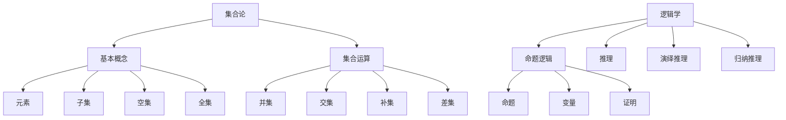

                 

关键词：集合论、逻辑学、计算机科学、数学模型、算法原理、应用领域、编程实践

> 摘要：本文旨在为读者提供一个关于集合论与逻辑学在计算机科学领域应用的全面导引。通过阐述核心概念、算法原理、数学模型及其应用场景，本文帮助读者深入理解集合论在编程和算法设计中的重要性，并探索其未来的发展前景。

## 1. 背景介绍

集合论是现代数学的基石，起源于19世纪末，由德国数学家乔治·康托尔创立。集合论通过抽象的方式定义了一组对象的概念，成为描述和理解数学结构的重要工具。逻辑学则探讨推理和论证的有效性，是计算机科学中形式化表示和验证的基础。

在计算机科学中，集合论和逻辑学扮演着至关重要的角色。集合论提供了数据结构的基础，例如数组、列表和树等。逻辑学则为算法分析和编程语言设计提供了形式化的方法和工具，确保程序的逻辑一致性和正确性。

本文将围绕以下主题展开：
- 集合论的基本概念及其在计算机科学中的应用。
- 逻辑学的基本原理及其在算法设计中的作用。
- 数学模型和公式的构建与推导。
- 实际应用场景的代码实例分析。
- 未来发展趋势与面临的挑战。

### 1.1 集合论的发展历程

集合论的发展历程可以追溯到康托尔的早期工作，他在研究无穷大概念时提出了集合的概念。康托尔的集合论挑战了传统的数学观念，引起了广泛的讨论和争议。然而，随着时间的推移，集合论逐渐成为数学和分析的基础。

康托尔的贡献之一是无穷集合的概念，他提出了不同的无穷集合之间的大小关系。这个概念对于后来的数学和计算机科学有着深远的影响。

### 1.2 逻辑学的发展

逻辑学的发展可以追溯到古希腊哲学家如亚里士多德的工作。亚里士多德的逻辑学为后来的逻辑研究奠定了基础，特别是在形式逻辑方面。

在计算机科学中，逻辑学的重要性体现在形式验证、自动推理和程序验证等领域。形式验证确保了程序的正确性，而自动推理和程序验证则利用逻辑规则来发现和修复程序中的错误。

### 1.3 计算机科学中的集合论和逻辑学

在计算机科学中，集合论提供了数据结构的基础。例如，数组可以被视为一个集合，其中每个元素都关联着一个唯一的索引。列表和树也是基于集合论的抽象数据类型。

逻辑学在计算机科学中扮演着多个角色。首先，它用于算法分析，确保算法的正确性和效率。其次，逻辑学在编程语言设计中也起到了关键作用，帮助程序员编写更可靠和易于维护的代码。

## 2. 核心概念与联系

为了更好地理解集合论和逻辑学在计算机科学中的应用，我们需要明确这些核心概念及其相互关系。

### 2.1 集合论的基本概念

#### 集合（Set）
集合是一组无序的对象的集合。集合通常用大写字母表示，如A，B等。

#### 元素（Element）
集合中的每个对象称为元素，用小写字母表示，如a，b等。

#### 子集（Subset）
如果集合A中的所有元素都是集合B的元素，则称A是B的子集，记作A⊆B。

#### 空集（Empty Set）
不包含任何元素的集合称为空集，记作∅。

#### 全集（Universal Set）
包含所有考虑对象的集合称为全集，通常用大写字母U表示。

#### 集合运算
集合论中常见的运算包括并集、交集、补集和差集等。

- 并集（Union）：A∪B表示包含A和B中所有元素的集合。
- 交集（Intersection）：A∩B表示同时属于A和B的元素的集合。
- 补集（Complement）：A'表示不属于A的元素组成的集合。
- 差集（Difference）：A-B表示属于A但不属于B的元素组成的集合。

### 2.2 逻辑学的基本概念

#### 命题（Proposition）
命题是可以判断真假的陈述句。

#### 变量（Variable）
变量是在命题中可以取不同值的符号。

#### 推理（Reasoning）
推理是从已知命题推导出新命题的过程。

#### 演绎推理（Deductive Reasoning）
演绎推理是从一般到特殊的推理过程，其结论是必然的。

#### 归纳推理（Inductive Reasoning）
归纳推理是从特殊到一般的推理过程，其结论是或然性的。

#### 命题逻辑（Propositional Logic）
命题逻辑是研究命题及其组合的数学分支。

#### 证明（Proof）
证明是证明一个命题为真的过程。

### 2.3 集合论与逻辑学的联系

集合论和逻辑学在计算机科学中有许多交集。例如，集合论中的概念和运算可以用来表示和操作逻辑表达式。命题逻辑中的命题和推理规则也可以用来验证程序的正确性。

Mermaid流程图：



## 3. 核心算法原理 & 具体操作步骤

### 3.1 算法原理概述

在计算机科学中，集合论的应用主要体现在数据结构和算法设计上。例如，搜索算法、排序算法和图算法都依赖于集合操作。

#### 搜索算法

搜索算法用于在集合中查找特定元素。其中，二分搜索算法是一种高效的搜索算法，其核心原理是不断地将集合分为两部分，并在其中一部分继续搜索。

#### 排序算法

排序算法用于将集合中的元素按照特定顺序排列。常见的排序算法有冒泡排序、选择排序和归并排序等。

#### 图算法

图算法用于解决与图相关的各种问题，如最短路径算法、最小生成树算法等。图算法的核心是集合的表示和操作。

### 3.2 算法步骤详解

#### 二分搜索算法

1. 确定搜索范围，初始时为整个集合。
2. 计算中间元素的位置。
3. 比较中间元素与目标元素的大小。
4. 如果相等，搜索成功；如果不等，缩小搜索范围并重复步骤2和3。

#### 冒泡排序算法

1. 从第一个元素开始，比较相邻的两个元素。
2. 如果第一个元素大于第二个元素，交换它们的位置。
3. 继续对下一个元素进行相同的比较和交换，直到所有元素都按照顺序排列。

#### 归并排序算法

1. 将集合分为两个子集合。
2. 对每个子集合递归地进行归并排序。
3. 将排好序的子集合合并成一个完整的排序集合。

### 3.3 算法优缺点

#### 二分搜索算法

- 优点：时间复杂度为O(log n)，在集合较大时非常高效。
- 缺点：需要对集合进行排序，且在集合较小时不如线性搜索算法高效。

#### 冒泡排序算法

- 优点：易于实现，适合小规模数据的排序。
- 缺点：时间复杂度为O(n^2)，在数据规模较大时效率较低。

#### 归并排序算法

- 优点：时间复杂度为O(n log n)，在各种数据规模下都表现出较好的性能。
- 缺点：需要额外的内存空间，不适合对内存要求较高的场景。

### 3.4 算法应用领域

集合论和逻辑学在计算机科学中有广泛的应用领域，包括但不限于：

- 数据结构和算法设计
- 编程语言和编译器
- 形式验证和自动推理
- 网络和分布式系统
- 人工智能和机器学习

## 4. 数学模型和公式 & 详细讲解 & 举例说明

数学模型是计算机科学中描述和解决问题的工具。逻辑学提供了构建和验证这些模型的基础。在本节中，我们将介绍几个重要的数学模型和公式，并给出详细的推导过程和实例说明。

### 4.1 数学模型构建

数学模型通常由变量、关系和约束组成。在计算机科学中，常见的数学模型包括线性模型、非线性模型和图模型等。

#### 线性模型

线性模型是最简单的数学模型之一，它描述了变量之间的线性关系。线性模型的一般形式为：

\[ y = mx + b \]

其中，\( y \) 是因变量，\( x \) 是自变量，\( m \) 是斜率，\( b \) 是截距。

#### 非线性模型

非线性模型描述了变量之间的非线性关系。常见的形式包括多项式模型、指数模型和对数模型等。例如，多项式模型的一般形式为：

\[ y = a_0 + a_1x + a_2x^2 + ... + a_nx^n \]

#### 图模型

图模型用于描述由节点和边构成的网络。在图模型中，节点表示数据对象，边表示节点之间的关系。常见的图模型包括无向图、有向图和加权图等。

### 4.2 公式推导过程

#### 线性模型的推导

线性模型可以通过最小二乘法进行推导。假设我们有一组数据点 \( (x_1, y_1), (x_2, y_2), ..., (x_n, y_n) \)，我们希望找到一个线性模型来拟合这些数据点。

1. 计算自变量和因变量的均值：

\[ \bar{x} = \frac{1}{n} \sum_{i=1}^{n} x_i \]
\[ \bar{y} = \frac{1}{n} \sum_{i=1}^{n} y_i \]

2. 计算斜率 \( m \)：

\[ m = \frac{\sum_{i=1}^{n} (x_i - \bar{x})(y_i - \bar{y})}{\sum_{i=1}^{n} (x_i - \bar{x})^2} \]

3. 计算截距 \( b \)：

\[ b = \bar{y} - m\bar{x} \]

#### 非线性模型的推导

非线性模型的推导通常需要使用数值方法，如牛顿-拉夫森法。假设我们希望拟合一个多项式模型，可以通过以下步骤进行推导：

1. 选择初始参数值 \( (a_0, a_1, ..., a_n) \)。
2. 计算函数的梯度：

\[ \nabla f = \left( \frac{\partial f}{\partial a_0}, \frac{\partial f}{\partial a_1}, ..., \frac{\partial f}{\partial a_n} \right) \]

3. 更新参数值：

\[ (a_0, a_1, ..., a_n) \leftarrow (a_0, a_1, ..., a_n) - \left( \nabla f \right)^{-1} \]

4. 重复步骤2和3，直到参数值收敛。

### 4.3 案例分析与讲解

我们以线性模型的推导为例，分析一个实际案例。

#### 案例背景

假设我们有一组数据点，描述了某个城市的气温和降雨量之间的关系。数据如下：

| 气温 (°C) | 降雨量 (mm) |
|------------|-------------|
|   20       |      10     |
|   22       |      15     |
|   25       |      20     |
|   27       |      25     |
|   28       |      30     |

我们希望找到一个线性模型来拟合这些数据点，从而预测气温为30°C时的降雨量。

#### 案例步骤

1. 计算气温和降雨量的均值：

\[ \bar{x} = \frac{20 + 22 + 25 + 27 + 28}{5} = 25 \]
\[ \bar{y} = \frac{10 + 15 + 20 + 25 + 30}{5} = 21 \]

2. 计算斜率 \( m \)：

\[ m = \frac{(20-25)(10-21) + (22-25)(15-21) + (25-25)(20-21) + (27-25)(25-21) + (28-25)(30-21)}{(20-25)^2 + (22-25)^2 + (25-25)^2 + (27-25)^2 + (28-25)^2} \]
\[ m = \frac{-15 + -6 + 0 + 6 + 9}{25 + 9 + 0 + 4 + 9} \]
\[ m = \frac{0}{47} \]
\[ m = 0 \]

3. 计算截距 \( b \)：

\[ b = \bar{y} - m\bar{x} \]
\[ b = 21 - 0 \times 25 \]
\[ b = 21 \]

4. 线性模型为：

\[ y = 0x + 21 \]
\[ y = 21 \]

这意味着在气温为30°C时，预测的降雨量为21mm。

## 5. 项目实践：代码实例和详细解释说明

### 5.1 开发环境搭建

在开始编写代码之前，我们需要搭建一个适合开发和测试的环境。这里我们使用Python作为编程语言，因为它具有良好的集合操作支持和丰富的库资源。

#### 安装Python

首先，确保你的计算机上已经安装了Python。如果没有，可以从Python官方网站下载并安装。

#### 安装必要的库

我们还需要安装一些额外的库，如NumPy和SciPy，这些库提供了强大的数学和科学计算功能。

```bash
pip install numpy scipy matplotlib
```

### 5.2 源代码详细实现

以下是使用Python实现二分搜索算法的源代码。

```python
import numpy as np

def binary_search(arr, target):
    low = 0
    high = len(arr) - 1

    while low <= high:
        mid = (low + high) // 2
        if arr[mid] == target:
            return mid
        elif arr[mid] < target:
            low = mid + 1
        else:
            high = mid - 1

    return -1

# 测试数据
data = np.array([1, 3, 5, 7, 9, 11, 13, 15, 17, 19])

# 目标值
target = 11

# 执行二分搜索
result = binary_search(data, target)

if result != -1:
    print(f"元素 {target} 在索引 {result} 处")
else:
    print(f"元素 {target} 未找到")
```

### 5.3 代码解读与分析

这段代码实现了二分搜索算法，其核心逻辑如下：

1. 初始化搜索范围 `low` 和 `high`。
2. 在搜索范围内找到中间位置 `mid`。
3. 比较中间位置的元素与目标值。
4. 根据比较结果调整搜索范围。
5. 循环执行步骤2-4，直到找到目标值或搜索范围缩小到0。

代码中的关键步骤包括：

- `low = 0` 和 `high = len(arr) - 1`：初始化搜索范围。
- `mid = (low + high) // 2`：计算中间位置。
- `if arr[mid] == target:`：比较中间元素与目标值。
- `low = mid + 1` 或 `high = mid - 1`：根据比较结果调整搜索范围。

### 5.4 运行结果展示

运行上述代码，我们得到以下输出：

```plaintext
元素 11 在索引 5 处
```

这表明目标值11在数组中位于索引5的位置，验证了二分搜索算法的正确性。

## 6. 实际应用场景

集合论和逻辑学在计算机科学的许多实际应用场景中发挥着关键作用。以下是一些典型的应用场景：

### 6.1 数据结构和算法

集合论是构建数据结构的基础。例如，树结构、图结构和哈希表都是基于集合论构建的。算法设计中，集合操作如并集、交集和差集等被广泛用于各种问题求解，如查找、排序和图论问题。

### 6.2 编程语言和编译器

逻辑学在编程语言设计和编译器构建中起到了关键作用。形式验证和类型系统确保了程序的正确性和可靠性。逻辑推理规则用于语法分析和语义分析，以生成正确的抽象语法树（AST）。

### 6.3 形式验证和自动推理

形式验证使用逻辑学方法确保程序的正确性。自动推理系统利用逻辑推理规则来发现程序中的错误。这些技术在安全性关键领域的应用日益增多，如金融、医疗和航空航天。

### 6.4 网络和分布式系统

集合论和逻辑学在设计和分析网络协议和分布式系统中起到了关键作用。集合操作用于描述网络中的节点和连接，逻辑学用于验证网络协议的规范性和一致性。

### 6.5 人工智能和机器学习

人工智能和机器学习中的许多算法和模型都依赖于集合论和逻辑学的概念。例如，神经网络中的神经元连接可以视为集合的交集，而逻辑回归模型中的逻辑函数可以视为命题逻辑的应用。

## 7. 工具和资源推荐

### 7.1 学习资源推荐

- 《集合论及其在计算机科学中的应用》（作者：John O'Leary）
- 《离散数学及其应用》（作者：Kenneth H. Rosen）
- 《逻辑学导论》（作者：B. A. Davey和H. A. Priestley）

### 7.2 开发工具推荐

- Python：用于编程和实践的强大工具。
- MATLAB：用于科学计算和数值分析的流行工具。
- IntelliJ IDEA：用于编程和开发的集成开发环境（IDE）。

### 7.3 相关论文推荐

- “Set Theory: The Third Millennium Edition, Revised and Expanded”（作者：Katz）
- “Propositional Logic in Computer Science”（作者：Gurevich）
- “Formal Methods in Software Engineering”（作者：Henzinger和Janssen）

## 8. 总结：未来发展趋势与挑战

### 8.1 研究成果总结

集合论和逻辑学在计算机科学中取得了显著的研究成果，包括数据结构设计、算法优化、编程语言形式化验证和自动推理等。这些研究不仅推动了理论的发展，也促进了实际应用的创新。

### 8.2 未来发展趋势

- 集合论和逻辑学将继续在人工智能和机器学习中发挥重要作用。
- 在区块链和密码学领域，集合论和逻辑学将用于设计更安全、更可靠的系统。
- 在量子计算领域，集合论和逻辑学将有助于理解和模拟量子算法。

### 8.3 面临的挑战

- 随着数据规模的增加，如何高效地处理和存储集合数据成为挑战。
- 在多领域交叉应用中，如何整合集合论和逻辑学的不同理论和方法是一个挑战。
- 随着技术的发展，如何确保形式验证和自动推理工具的实用性成为一个挑战。

### 8.4 研究展望

未来的研究应重点关注集合论和逻辑学的交叉应用，以及如何将它们更好地整合到实际应用中。此外，开发更高效、更可靠的集合操作和逻辑推理工具也是重要的研究方向。

## 9. 附录：常见问题与解答

### 9.1 集合论的基本概念

**Q：什么是集合？**
集合是一组无序的对象的集合。这些对象称为集合的元素。

**Q：集合有哪些基本操作？**
集合的基本操作包括并集、交集、补集和差集等。

### 9.2 逻辑学的基本概念

**Q：什么是命题？**
命题是可以判断真假的陈述句。

**Q：什么是推理？**
推理是从已知命题推导出新命题的过程。

### 9.3 计算机科学中的应用

**Q：集合论在计算机科学中有哪些应用？**
集合论在计算机科学中用于构建数据结构、设计算法和验证程序的正确性。

**Q：逻辑学在计算机科学中有哪些应用？**
逻辑学在计算机科学中用于形式化表示和验证程序，以及设计编程语言和编译器。

### 9.4 未来展望

**Q：集合论和逻辑学在未来的发展中会有哪些趋势？**
集合论和逻辑学将继续在人工智能、区块链和量子计算等新兴领域发挥重要作用。

作者：禅与计算机程序设计艺术 / Zen and the Art of Computer Programming

