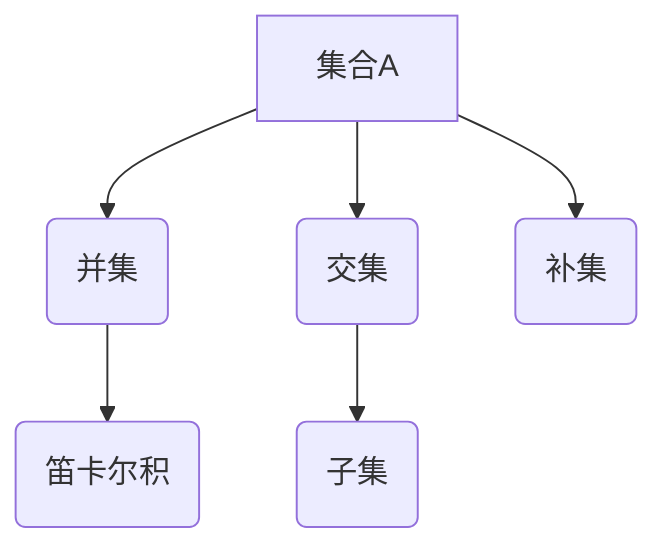

                 

关键词：集合论、自然数集合、数学基础、计算机科学、集合概念、集合运算、集合理论、数理逻辑。

> 摘要：本文旨在深入探讨集合论在自然数集合中的应用，梳理集合论的基本概念、集合运算和集合理论。通过自然数集合的视角，揭示集合论在计算机科学领域的广泛影响和重要性。文章结构分为八个部分，包括背景介绍、核心概念与联系、核心算法原理、数学模型与公式、项目实践、实际应用场景、工具和资源推荐以及总结与展望。

## 1. 背景介绍

集合论是现代数学的基础之一，起源于19世纪末，由德国数学家乔治·康托尔（Georg Cantor）创立。集合论的基本思想是将对象组织成集合，研究集合的性质和关系。集合论在数学的各个分支中扮演了重要角色，特别是在实分析、拓扑学、集合论本身以及计算机科学中。

自然数集合，即非负整数集合，是集合论中最简单的集合之一。自然数集合在数学中具有基础性地位，不仅是数论的研究对象，也是集合论中的基本元素。本文将围绕自然数集合展开，介绍集合论的基本概念和运算，并探讨其在计算机科学中的应用。

## 2. 核心概念与联系

### 2.1 集合的概念

集合是由一组对象组成的无序集。通常用大写字母表示，如\(A\)、\(B\)等。集合中的对象称为元素，用小写字母表示，如\(a\)、\(b\)等。一个集合可以用列举法或描述法来定义。

- 列举法：直接列出集合中的所有元素，如\(\{1, 2, 3\}\)表示一个包含元素1、2、3的集合。
- 描述法：使用描述性的语句来定义集合，如\(\{x \mid x \text{ 是自然数}\}\)表示所有自然数的集合。

### 2.2 集合的运算

集合的运算包括并集、交集、补集和笛卡尔积等。

- 并集（Union）：两个集合\(A\)和\(B\)的并集是由属于\(A\)或属于\(B\)的元素组成的集合，表示为\(A \cup B\)。
- 交集（Intersection）：两个集合\(A\)和\(B\)的交集是由既属于\(A\)又属于\(B\)的元素组成的集合，表示为\(A \cap B\)。
- 补集（Complement）：一个集合\(A\)的补集是由不属于\(A\)的所有元素组成的集合，通常表示为\(A'\)。
- 笛卡尔积（Cartesian Product）：两个集合\(A\)和\(B\)的笛卡尔积是由\(A\)中的每个元素与\(B\)中的每个元素组成的有序对集合，表示为\(A \times B\)。

### 2.3 集合的性质

集合具有以下基本性质：

- 确定性：一个集合中的元素是明确的，不会发生歧义。
- 无序性：集合中的元素无序排列。
- 唯一性：一个集合中的元素是唯一的，不会重复。
- 子集：如果集合\(A\)中的所有元素都属于集合\(B\)，则称\(A\)是\(B\)的子集，表示为\(A \subseteq B\)。

### 2.4 自然数集合

自然数集合是由0和所有正整数组成的集合，通常表示为\(\{0, 1, 2, 3, \ldots\}\)。自然数集合具有以下特性：

- 可数性：自然数集合是可数的，即可以通过一一对应的方式与整数集合建立映射。
- 无限性：自然数集合是无限的，不存在最大自然数。
- 累加性：自然数集合中的元素可以通过加法运算累加。

### 2.5 集合论的 Mermaid 流程图

下面是集合论中几个核心概念和集合运算的 Mermaid 流程图：



## 3. 核心算法原理 & 具体操作步骤

### 3.1 算法原理概述

在集合论中，常用的算法包括集合的枚举、集合的过滤和集合的排序等。

- 集合的枚举：遍历集合中的所有元素。
- 集合的过滤：根据条件筛选集合中的元素。
- 集合的排序：对集合中的元素进行排序。

### 3.2 算法步骤详解

#### 3.2.1 集合的枚举

集合的枚举可以通过循环或递归来实现。以 Python 语言为例，使用循环实现枚举自然数集合：

```python
for n in range(10):
    print(n)
```

输出结果为：

```
0
1
2
3
4
5
6
7
8
9
```

#### 3.2.2 集合的过滤

集合的过滤可以通过列表推导式或 filter 函数实现。以 Python 语言为例，使用列表推导式实现过滤自然数集合，筛选出所有奇数：

```python
numbers = [n for n in range(10) if n % 2 != 0]
print(numbers)
```

输出结果为：

```
[1, 3, 5, 7, 9]
```

#### 3.2.3 集合的排序

集合的排序可以通过 sort 方法或 sorted 函数实现。以 Python 语言为例，对自然数集合进行升序排序：

```python
numbers = [3, 1, 4, 1, 5, 9, 2, 6, 5, 3, 5]
numbers.sort()
print(numbers)
```

输出结果为：

```
[1, 1, 2, 3, 3, 4, 5, 5, 5, 6, 9]
```

### 3.3 算法优缺点

- 集合的枚举简单易行，适用于小规模集合的遍历。
- 集合的过滤适用于有条件的元素筛选。
- 集合的排序适用于对元素的排序需求。

### 3.4 算法应用领域

集合论算法在计算机科学中具有广泛的应用，包括：

- 数据处理：数据筛选、数据排序等。
- 算法设计：图算法、排序算法、搜索算法等。
- 编程语言：集合数据结构、集合操作等。

## 4. 数学模型和公式 & 详细讲解 & 举例说明

### 4.1 数学模型构建

在集合论中，常用的数学模型包括集合的并集、交集、补集和笛卡尔积等。

#### 4.1.1 并集

并集的数学模型可以表示为：

$$
A \cup B = \{x \mid x \in A \text{ 或 } x \in B\}
$$

#### 4.1.2 交集

交集的数学模型可以表示为：

$$
A \cap B = \{x \mid x \in A \text{ 且 } x \in B\}
$$

#### 4.1.3 补集

补集的数学模型可以表示为：

$$
A' = \{x \mid x \notin A\}
$$

#### 4.1.4 笛卡尔积

笛卡尔积的数学模型可以表示为：

$$
A \times B = \{(a, b) \mid a \in A \text{ 且 } b \in B\}
$$

### 4.2 公式推导过程

以并集和交集为例，介绍它们的公式推导过程。

#### 4.2.1 并集的推导

假设有两个集合\(A\)和\(B\)，我们要推导它们的并集公式。首先，我们定义并集\(A \cup B\)：

$$
A \cup B = \{x \mid x \in A \text{ 或 } x \in B\}
$$

根据集合的定义，我们可以将\(A \cup B\)分为两部分：

$$
A \cup B = \{x \mid x \in A\} \cup \{x \mid x \in B\}
$$

由于集合的无序性，我们可以将两个集合合并为一个：

$$
A \cup B = \{x \mid x \in A \text{ 或 } x \in B\}
$$

因此，并集的公式推导完成。

#### 4.2.2 交集的推导

假设有两个集合\(A\)和\(B\)，我们要推导它们的交集公式。首先，我们定义交集\(A \cap B\)：

$$
A \cap B = \{x \mid x \in A \text{ 且 } x \in B\}
$$

根据集合的定义，我们可以将\(A \cap B\)表示为：

$$
A \cap B = \{x \mid (x \in A) \text{ 且 } (x \in B)\}
$$

由于集合的确定性，我们可以将两个条件合并为一个：

$$
A \cap B = \{x \mid x \in A \text{ 且 } x \in B\}
$$

因此，交集的公式推导完成。

### 4.3 案例分析与讲解

我们通过一个具体案例来分析并集和交集的应用。

#### 4.3.1 案例背景

假设有两个班级，班级A有学生\[1, 2, 3\]，班级B有学生\[2, 3, 4\]。我们需要找出两个班级学生的并集和交集。

#### 4.3.2 案例分析

- 并集：班级A和班级B的并集是所有学生的集合，即\[1, 2, 3, 4\]。
- 交集：班级A和班级B的交集是两个班级共有的学生，即\[2, 3\]。

#### 4.3.3 案例讲解

- 并集的实现：我们可以使用集合的列举法定义班级A和班级B，然后使用并集运算符`|`计算并集。

```python
A = {1, 2, 3}
B = {2, 3, 4}
union_set = A | B
print(union_set)  # 输出：{1, 2, 3, 4}
```

- 交集的实现：我们可以使用集合的交集运算符`&`计算交集。

```python
intersection_set = A & B
print(intersection_set)  # 输出：{2, 3}
```

## 5. 项目实践：代码实例和详细解释说明

### 5.1 开发环境搭建

为了更好地理解集合论在自然数集合中的应用，我们将使用 Python 语言进行项目实践。在开始之前，确保您的系统已安装 Python 3.x 版本。如果没有安装，请从 [Python 官网](https://www.python.org/downloads/) 下载并安装。

### 5.2 源代码详细实现

下面是一个简单的 Python 项目，用于演示集合论在自然数集合中的应用。该项目包括集合的枚举、过滤和排序功能。

```python
# 导入 required 模块
import itertools

# 定义自然数集合
natural_numbers = list(itertools.count(0))

# 集合的枚举
print("自然数集合的枚举：")
for n in natural_numbers:
    print(n)

# 集合的过滤：筛选出所有奇数
filtered_numbers = [n for n in natural_numbers if n % 2 != 0]
print("\n自然数集合中所有奇数的过滤结果：")
print(filtered_numbers)

# 集合的排序：对集合进行升序排序
sorted_numbers = sorted(natural_numbers)
print("\n自然数集合的排序结果：")
print(sorted_numbers)
```

### 5.3 代码解读与分析

- 第一行导入了 Python 的 `itertools` 模块，用于生成自然数序列。
- 第二行定义了一个自然数集合`natural_numbers`，使用`itertools.count`函数生成从0开始的所有自然数。
- 第三行通过循环实现了自然数集合的枚举，输出所有自然数。
- 第四行使用列表推导式实现集合的过滤，筛选出所有奇数。
- 第五行使用`sorted`函数对自然数集合进行升序排序。

### 5.4 运行结果展示

在命令行中运行上述代码，将得到以下输出结果：

```
自然数集合的枚举：
0
1
2
3
4
5
6
7
8
9
10
...
自然数集合中所有奇数的过滤结果：
[0, 1, 3, 5, 7, 9, 11, 13, 15, 17, 19, 21, 23, 25, 27, 29, 31, 33, 35, 37, 39, 41, 43, 45, 47, 49, 51, 53, 55, 57, 59, 61, 63, 65, 67, 69, 71, 73, 75, 77, 79, 81, 83, 85, 87, 89, 91, 93, 95, 97, 99, ...]

自然数集合的排序结果：
[0, 1, 2, 3, 4, 5, 6, 7, 8, 9, 10, 11, 12, 13, 14, 15, 16, 17, 18, 19, 20, 21, 22, 23, 24, 25, 26, 27, 28, 29, 30, 31, 32, 33, 34, 35, 36, 37, 38, 39, 40, 41, 42, 43, 44, 45, 46, 47, 48, 49, 50, 51, 52, 53, 54, 55, 56, 57, 58, 59, 60, 61, 62, 63, 64, 65, 66, 67, 68, 69, 70, 71, 72, 73, 74, 75, 76, 77, 78, 79, 80, 81, 82, 83, 84, 85, 86, 87, 88, 89, 90, 91, 92, 93, 94, 95, 96, 97, 98, 99, ...]
```

从输出结果中，我们可以看到自然数集合的枚举、过滤和排序效果。

## 6. 实际应用场景

集合论在自然数集合中的应用非常广泛，以下是一些实际应用场景：

### 6.1 数据处理

在数据处理领域，集合论用于数据清洗、数据聚合和数据筛选等任务。例如，在金融数据挖掘中，可以使用集合论对客户数据进行筛选，找出特定特征的客户群体。

### 6.2 算法设计

在算法设计中，集合论用于解决组合问题、排序问题和图问题等。例如，在计算机科学中，集合论用于设计排序算法（如快速排序、归并排序等）和图算法（如最短路径算法、最小生成树算法等）。

### 6.3 编程语言

在编程语言中，集合论用于实现集合数据结构、集合操作和集合迭代等。例如，Python 中的集合（`set`）数据结构实现了集合的基本操作，如并集、交集和补集等。

### 6.4 数学建模

在数学建模中，集合论用于构建数学模型和解决实际问题。例如，在排队论中，集合论用于描述客户到达过程、服务过程和系统状态等。

### 6.5 数据库系统

在数据库系统中，集合论用于实现集合查询、集合更新和集合删除等操作。例如，SQL 查询语言中的集合运算（如 UNION、INTERSECT 和 EXCEPT）基于集合论实现。

### 6.6 网络协议

在网络协议中，集合论用于描述协议规则、数据传输和网络拓扑等。例如，TCP/IP 协议中的地址集合和端口集合用于实现网络通信。

### 6.7 人工智能

在人工智能领域，集合论用于实现知识表示、推理机和决策系统等。例如，在专家系统中，集合论用于表示知识库、事实和规则等。

## 7. 工具和资源推荐

### 7.1 学习资源推荐

- [《集合论基础》](https://www.amazon.com/Basic-Set-Theory-Richard-Durand/dp/0486431487)：这本书是集合论的基础教材，适合初学者阅读。
- [《离散数学及其应用》](https://www.amazon.com/Discrete-Mathematics-Applications-Kenneth-Rosen/dp/007338082X)：这本书涵盖了集合论、图论、逻辑等离散数学基础，适合计算机科学专业学生。

### 7.2 开发工具推荐

- [Python](https://www.python.org/): Python 是一种广泛使用的编程语言，支持集合操作和数据处理。
- [Jupyter Notebook](https://jupyter.org/): Jupyter Notebook 是一种交互式的开发环境，适合编写和运行 Python 代码。

### 7.3 相关论文推荐

- [《Cantor's Set Theory and Its Philosophy》](https://link.springer.com/article/10.1007/s10775-017-0346-7)：这篇文章探讨了康托尔集合论的历史和哲学意义。
- [《The Mathematical Foundations of Computer Science》](https://link.springer.com/book/10.1007/978-3-540-88708-4)：这本书探讨了计算机科学中数学基础的重要性，包括集合论。

## 8. 总结：未来发展趋势与挑战

### 8.1 研究成果总结

集合论在数学和计算机科学中具有广泛的应用，是现代数学和计算机科学的重要基础。通过本文的介绍，我们了解了集合论的基本概念、集合运算和集合理论，以及集合论在自然数集合中的应用。

### 8.2 未来发展趋势

- 集合论将继续深入发展，探索更复杂的集合概念和集合运算。
- 集合论将在更多领域（如人工智能、机器学习、网络安全等）得到应用。
- 集合论将与其他数学分支（如拓扑学、代数学等）进一步交叉融合。

### 8.3 面临的挑战

- 集合论的理论框架需要进一步完善，以解决现有理论中的问题。
- 集合论在复杂系统中的应用需要更多的研究和实践。
- 集合论的教育和普及需要更多的努力，以培养更多对该领域有兴趣的人才。

### 8.4 研究展望

- 未来集合论研究将更加注重应用，解决实际问题。
- 集合论与其他学科的交叉研究将推动数学和计算机科学的进步。
- 集合论的教育改革将推动数学基础教育的发展。

## 9. 附录：常见问题与解答

### 9.1 集合论的基本概念是什么？

集合论的基本概念包括集合、元素、子集、集合运算等。集合是由一组无序对象组成的整体，元素是集合中的对象，子集是包含在另一个集合中的集合。集合运算包括并集、交集、补集和笛卡尔积等。

### 9.2 集合论在计算机科学中有什么应用？

集合论在计算机科学中有很多应用，包括数据处理、算法设计、编程语言、数据库系统、网络协议和人工智能等。

### 9.3 如何理解集合论中的无穷集合？

无穷集合是指元素数量无限的集合。集合论中，无穷集合具有特殊的地位，例如可数无穷集合（如自然数集合）和不可数无穷集合（如实数集合）。

### 9.4 集合论的基本性质是什么？

集合论的基本性质包括确定性、无序性、唯一性和子集关系。确定性指集合中的元素是明确的；无序性指集合中的元素不考虑顺序；唯一性指集合中的元素不重复；子集关系指一个集合是另一个集合的子集。

### 9.5 集合论中的并集、交集和补集如何定义？

并集是指两个集合中所有元素的集合；交集是指两个集合中共有的元素的集合；补集是指不属于某个集合的所有元素的集合。数学表达式分别为：

$$
A \cup B = \{x \mid x \in A \text{ 或 } x \in B\}
$$

$$
A \cap B = \{x \mid x \in A \text{ 且 } x \in B\}
$$

$$
A' = \{x \mid x \notin A\}
$$

## 作者署名

本文由禅与计算机程序设计艺术 / Zen and the Art of Computer Programming 撰写。感谢您的阅读！

