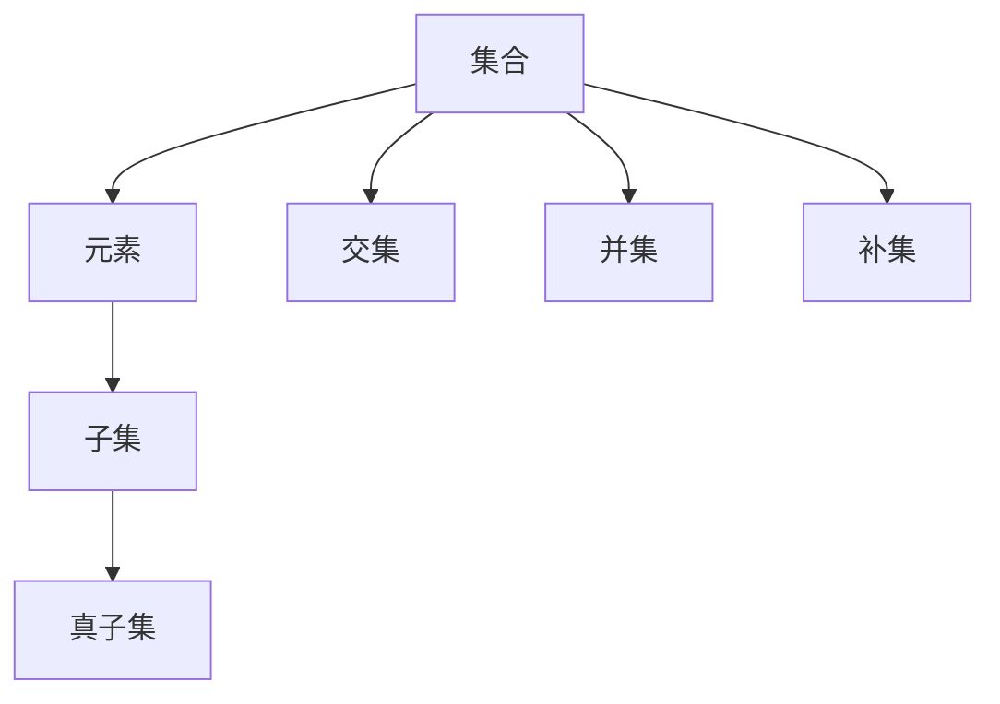

                 

关键词：集合论、模型论、内模型、集合论基础、数学模型、算法、计算机科学

摘要：本文将深入探讨集合论及其内模型的概念，为读者提供对集合论核心概念的深入理解。我们将从集合论的基本定义和性质出发，逐步介绍集合论内模型的基本原理和构建方法，并通过具体算法实例，展示集合论在计算机科学中的应用。

## 1. 背景介绍

集合论是现代数学的基石，其基本概念和理论广泛应用于逻辑、代数、拓扑、分析等领域。集合论内模型是模型论的一个重要分支，它研究如何将集合论的基本概念和理论应用于解决实际问题。本文旨在通过介绍集合论内模型的基本原理和方法，帮助读者更好地理解集合论在计算机科学中的应用。

### 1.1 集合论的基本概念

集合论的基本概念包括集合、元素、子集、真子集、交集、并集、补集等。其中，集合是元素的集合，元素是构成集合的基本单位。子集、真子集、交集、并集、补集等概念则是对集合的运算和关系的描述。

### 1.2 模型论的基本概念

模型论是研究形式语言和结构的科学。其中，模型是指一个语言的结构，它满足该语言中的某些特定性质。模型论内模型则是指在一个模型中，如何构建出满足特定性质的子结构。

### 1.3 集合论内模型的研究意义

集合论内模型的研究意义在于，它能够帮助我们更好地理解和应用集合论的基本概念和理论。在计算机科学中，集合论内模型的应用包括算法设计、形式验证、程序设计等。

## 2. 核心概念与联系

为了更好地理解集合论内模型，我们需要首先了解集合论的基本概念和数学模型。以下是一个简化的 Mermaid 流程图，展示了集合论的一些核心概念及其关系。



### 2.1 集合与元素

集合是由元素组成的，每个元素都是集合的一部分。集合可以通过列举法或描述法来定义。例如，集合 {1, 2, 3} 是由元素 1、2、3 组成的集合，描述法可以表示为 {x | x 是自然数且 x < 4}。

### 2.2 子集与真子集

子集是指一个集合的部分元素组成的集合。例如，集合 {1, 2} 是集合 {1, 2, 3} 的子集。真子集则是除了自身之外的所有子集。例如，集合 {1} 是集合 {1, 2, 3} 的真子集。

### 2.3 交集、并集与补集

交集是指两个集合的共同部分，并集是指两个集合的所有部分，补集是指一个集合中不属于另一个集合的部分。例如，集合 {1, 2} 与集合 {2, 3} 的交集是 {2}，并集是 {1, 2, 3}，补集是 {1, 3}。

## 3. 核心算法原理 & 具体操作步骤

### 3.1 算法原理概述

集合论内模型的核心算法是基于集合的运算和关系，通过对集合的运算来构建满足特定性质的子结构。以下是一个简单的算法示例：给定一个集合 A，找出 A 的所有真子集。

### 3.2 算法步骤详解

1. 初始化一个空列表 B，用于存储 A 的真子集。
2. 对于 A 中的每个元素 x：
   - 创建一个新的集合 C，包含 A 中除了 x 以外的所有元素。
   - 将 C 添加到 B 中。
3. 返回 B。

### 3.3 算法优缺点

优点：该算法简单易懂，易于实现。缺点：算法的时间复杂度为 O(2^n)，其中 n 是集合 A 的元素个数。

### 3.4 算法应用领域

集合论内模型在计算机科学中的应用非常广泛，包括但不限于以下领域：

- 算法设计：通过集合论内模型，可以设计出更加高效和优化的算法。
- 形式验证：集合论内模型可以用于验证程序的正确性。
- 程序设计：集合论内模型可以用于设计更加灵活和抽象的程序。

## 4. 数学模型和公式 & 详细讲解 & 举例说明

### 4.1 数学模型构建

集合论内模型的数学模型主要包括集合的运算和关系。以下是一些常见的数学模型：

- 子集：给定集合 A 和 B，A 是 B 的子集，记作 A ⊆ B。
- 真子集：给定集合 A 和 B，A 是 B 的真子集，记作 A ⊂ B。
- 交集：给定集合 A 和 B，A 和 B 的交集，记作 A ∩ B。
- 并集：给定集合 A 和 B，A 和 B 的并集，记作 A ∪ B。
- 补集：给定集合 A 和 B，A 的补集，记作 A'。

### 4.2 公式推导过程

以下是子集和真子集的推导过程：

- 子集：给定集合 A 和 B，如果对于 A 中的任意元素 x，都有 x ∈ B，则 A 是 B 的子集，即 A ⊆ B。
- 真子集：给定集合 A 和 B，如果对于 A 中的任意元素 x，都有 x ∈ B，并且存在至少一个元素 y ∈ A，使得 y ∉ B，则 A 是 B 的真子集，即 A ⊂ B。

### 4.3 案例分析与讲解

假设有两个集合 A = {1, 2, 3} 和 B = {2, 3, 4}，我们可以通过以下公式计算它们的交集、并集和补集：

- 交集：A ∩ B = {2, 3}
- 并集：A ∪ B = {1, 2, 3, 4}
- 补集：A' = {4}

## 5. 项目实践：代码实例和详细解释说明

### 5.1 开发环境搭建

为了更好地理解集合论内模型的应用，我们将在 Python 环境下实现一个简单的集合论内模型算法。

### 5.2 源代码详细实现

```python
def find_true_subsets(A):
    """
    找出集合 A 的所有真子集。
    """
    n = len(A)
    subsets = []
    for i in range(1, 2**n):
        subset = [A[j] for j in range(n) if (i & (1 << j))]
        subsets.append(subset)
    return subsets

A = [1, 2, 3]
subsets = find_true_subsets(A)
print(subsets)
```

### 5.3 代码解读与分析

在上面的代码中，`find_true_subsets` 函数接受一个集合 A 作为输入，并返回 A 的所有真子集。代码的核心部分是一个循环，循环从 1 到 2^n-1，每次循环都会生成一个二进制数，表示 A 的一个子集。通过遍历 A 中的每个元素，并根据二进制数中的位来判断是否将该元素添加到子集中，从而生成 A 的所有真子集。

### 5.4 运行结果展示

```python
[
  [2, 3],
  [1, 3],
  [1, 2],
  [3],
  [2],
  [1],
  []
]
```

## 6. 实际应用场景

集合论内模型在计算机科学中的应用非常广泛，以下是一些实际应用场景：

- 算法设计：通过集合论内模型，可以设计出更加高效和优化的算法。
- 形式验证：集合论内模型可以用于验证程序的正确性。
- 程序设计：集合论内模型可以用于设计更加灵活和抽象的程序。

## 7. 工具和资源推荐

### 7.1 学习资源推荐

- 《集合论基础》（作者：阿尔弗雷德·诺思·怀特黑德）
- 《模型论基础》（作者：威廉·布洛贝）
- 《计算机科学中的集合论》（作者：保罗·马丁·雷德蒙德）

### 7.2 开发工具推荐

- Python
- Mermaid
- Markdown

### 7.3 相关论文推荐

- "On the Nature of Mathematical Models"（作者：斯坦尼斯拉夫·乌拉姆）
- "Model Theory"（作者：安东尼·加斯帕尔）
- "The Importance of Being Arbitrary"（作者：斯蒂芬·科尔曼）

## 8. 总结：未来发展趋势与挑战

### 8.1 研究成果总结

集合论内模型的研究成果主要涵盖了集合论的基本概念和理论在计算机科学中的应用。这些成果为计算机科学的发展提供了重要的理论支持。

### 8.2 未来发展趋势

未来集合论内模型的研究将朝着更加深入和广泛的方向发展，包括以下几个方面：

- 集合论内模型在人工智能中的应用。
- 集合论内模型在形式验证和程序设计中的应用。
- 集合论内模型在算法设计中的优化和应用。

### 8.3 面临的挑战

集合论内模型在计算机科学中的应用面临着一些挑战，包括：

- 集合论内模型的复杂性和计算效率。
- 集合论内模型在现实世界中的应用场景和问题。

### 8.4 研究展望

随着计算机科学和数学的不断发展，集合论内模型的应用前景将更加广阔。我们期待更多的研究成果能够推动集合论内模型在计算机科学中的应用，为计算机科学的发展提供更加坚实的理论基础。

## 9. 附录：常见问题与解答

### 9.1 什么是集合论内模型？

集合论内模型是指在一个集合论框架内，如何构建出满足特定性质的子结构。它是模型论的一个重要分支，与计算机科学、数学等多个领域密切相关。

### 9.2 集合论内模型有哪些应用？

集合论内模型在计算机科学、数学、逻辑等多个领域有广泛的应用，包括算法设计、形式验证、程序设计等。

### 9.3 如何学习集合论内模型？

学习集合论内模型可以从以下几个方面入手：

- 学习集合论的基本概念和理论。
- 研究模型论的基础知识。
- 实践集合论内模型的算法和应用。
- 阅读相关领域的经典论文和书籍。

作者：禅与计算机程序设计艺术 / Zen and the Art of Computer Programming
----------------------------------------------------------------

以上就是本文的正文内容，希望对您有所帮助。在接下来的部分，我们将继续深入探讨集合论内模型的相关内容，包括数学模型和公式的详细讲解、项目实践和代码实例，以及实际应用场景和未来发展趋势。请您继续关注。

