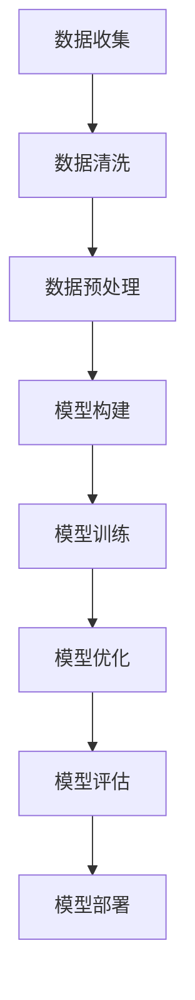

                 

人工智能（AI）已经成为当今科技领域的一个热点，它正在改变我们的生活方式和工作方式。无论是自动驾驶汽车、智能助手，还是推荐系统，AI的应用场景无处不在。然而，AI的开发并非易事，它需要深厚的计算机科学、数学和工程背景。对于零基础的人来说，入门AI开发可能会感到困惑和难以着手。本文旨在为您提供一个清晰、实用的路径，帮助您从零基础开始，快速掌握AI开发的核心知识和技能。

## 文章关键词

- 人工智能
- AI开发
- 零基础
- 深度学习
- 计算机视觉
- 自然语言处理

## 文章摘要

本文将围绕AI开发的核心知识体系，为您详细解析AI的基本概念、核心算法、数学模型、项目实践及未来应用。通过阅读本文，您将了解AI开发的入门路径，掌握必要的理论知识，并具备实际操作能力。无论您是学生、开发者还是对AI感兴趣的人，这篇文章都将为您提供一个全面的学习资源。

### 1. 背景介绍

人工智能，作为计算机科学的一个分支，致力于使计算机具备智能行为，模仿人类的认知能力，如学习、推理、感知和决策。AI的发展可以追溯到20世纪50年代，当时科学家们首次提出了“人工智能”的概念。自那以后，AI经历了多次高潮和低谷，但近年来，得益于计算能力的提升、大数据的涌现和深度学习算法的突破，AI得到了前所未有的发展。

AI的应用领域广泛，涵盖了医疗、金融、交通、教育、娱乐等多个行业。例如，在医疗领域，AI可以用于疾病诊断、药物研发；在金融领域，AI可以用于风险控制、欺诈检测；在交通领域，AI可以用于自动驾驶、交通流量优化；在教育领域，AI可以提供个性化学习体验；在娱乐领域，AI可以用于内容推荐、游戏AI等。

尽管AI的应用前景广阔，但AI开发并非一项简单的任务。它需要跨学科的融合，涉及计算机科学、数学、统计学、工程学等多个领域。因此，对于零基础的人来说，入门AI开发可能会感到困难和迷茫。本文旨在为您提供一个清晰的入门路径，帮助您逐步掌握AI开发的核心知识和技能。

### 2. 核心概念与联系

在进入具体的算法和模型之前，了解AI的核心概念和它们之间的联系是非常重要的。以下是一些核心概念及其相互关系：

#### 2.1 计算机视觉

计算机视觉是AI的一个重要分支，它使计算机能够从图像或视频中提取信息。计算机视觉的关键技术包括图像识别、目标检测、图像分割等。计算机视觉的应用场景包括自动驾驶、安全监控、医疗影像分析等。


#### 2.2 自然语言处理

自然语言处理（NLP）是AI的另一个重要分支，它使计算机能够理解、生成和处理人类语言。NLP的核心技术包括文本分类、情感分析、机器翻译等。NLP的应用场景包括智能助手、聊天机器人、内容推荐等。


#### 2.3 深度学习

深度学习是AI的核心算法之一，它通过模拟人脑的神经网络结构，对大量数据进行自动学习，从而实现复杂的模式识别和预测。深度学习在计算机视觉、自然语言处理等多个领域都有广泛应用。


#### 2.4 数据处理

数据处理是AI开发的基础，它包括数据收集、数据清洗、数据预处理等步骤。良好的数据处理能力是确保模型性能的关键。


通过了解这些核心概念和它们之间的联系，您可以更好地理解AI的开发过程，为后续的学习和实践打下坚实的基础。

### 3. 核心算法原理 & 具体操作步骤

#### 3.1 算法原理概述

AI的核心算法主要包括深度学习、决策树、支持向量机、贝叶斯分类器等。其中，深度学习算法因其强大的学习和泛化能力，在AI领域占据了主导地位。

深度学习算法的核心思想是通过多层神经网络对数据进行自动特征提取和学习。神经网络由多个层次组成，每个层次都包含多个神经元。通过前向传播和反向传播，神经网络能够不断调整权重和偏置，以最小化损失函数，实现模型的优化。

#### 3.2 算法步骤详解

深度学习算法的开发过程主要包括以下几个步骤：

1. **数据收集与预处理**：收集大量带标签的数据集，对数据进行清洗、归一化等预处理操作。

2. **构建模型**：选择合适的神经网络架构，如卷积神经网络（CNN）、循环神经网络（RNN）或长短时记忆网络（LSTM）。

3. **训练模型**：使用预处理后的数据集对模型进行训练，通过调整权重和偏置，使模型在训练集上达到较好的性能。

4. **评估模型**：使用验证集或测试集对模型进行评估，检查模型的泛化能力。

5. **调参优化**：根据评估结果，调整模型参数，如学习率、批量大小等，以提高模型性能。

6. **部署应用**：将训练好的模型部署到实际应用场景，如图像识别、语音识别等。

#### 3.3 算法优缺点

深度学习算法的优点包括：

- **强大的学习和泛化能力**：能够处理大规模、复杂的任务。
- **自动特征提取**：减少了人工设计特征的工作量。

然而，深度学习算法也存在一些缺点：

- **对数据依赖性强**：需要大量的标注数据和计算资源。
- **模型解释性较差**：难以理解模型的工作原理。

#### 3.4 算法应用领域

深度学习算法在多个领域都有广泛应用，如：

- **计算机视觉**：图像识别、目标检测、图像分割等。
- **自然语言处理**：文本分类、情感分析、机器翻译等。
- **语音识别**：语音合成、语音识别等。
- **推荐系统**：基于用户行为的推荐、基于内容的推荐等。

### 4. 数学模型和公式 & 详细讲解 & 举例说明

#### 4.1 数学模型构建

深度学习算法的核心是多层感知机（MLP），它是一种前向传播的神经网络。MLP的数学模型可以表示为：

$$
y = \sigma(W \cdot x + b)
$$

其中，$y$ 是输出，$\sigma$ 是激活函数，$W$ 是权重矩阵，$x$ 是输入，$b$ 是偏置向量。

#### 4.2 公式推导过程

深度学习算法的训练过程可以理解为寻找最佳的权重矩阵 $W$ 和偏置向量 $b$，使得输出 $y$ 与真实标签 $t$ 之间的误差最小。

假设损失函数为均方误差（MSE），则：

$$
L = \frac{1}{2} \sum_{i=1}^{n} (y_i - t_i)^2
$$

其中，$n$ 是样本数量，$y_i$ 和 $t_i$ 分别是第 $i$ 个样本的预测输出和真实标签。

为了最小化损失函数 $L$，我们采用梯度下降法来更新权重矩阵 $W$ 和偏置向量 $b$。

梯度下降法的更新公式为：

$$
\Delta W = -\alpha \frac{\partial L}{\partial W}, \quad \Delta b = -\alpha \frac{\partial L}{\partial b}
$$

其中，$\alpha$ 是学习率。

通过反复迭代，直到满足停止条件（如损失函数不再显著下降），我们得到最优的权重矩阵 $W$ 和偏置向量 $b$。

#### 4.3 案例分析与讲解

假设我们有一个简单的二分类问题，其中每个样本由两个特征组成，即 $x_1$ 和 $x_2$。我们的目标是训练一个模型来预测每个样本属于正类（+1）还是负类（-1）。

我们选择使用多层感知机（MLP）作为我们的模型，并设置一个隐藏层，其中包含10个神经元。

1. **数据收集与预处理**：我们收集了100个样本，每个样本都有两个特征和相应的标签（+1或-1）。

2. **构建模型**：我们使用TensorFlow框架构建了一个简单的MLP模型，其中输入层有2个神经元，隐藏层有10个神经元，输出层有1个神经元。

3. **训练模型**：我们使用预处理后的数据集对模型进行训练，并设置学习率为0.1，训练100次。

4. **评估模型**：我们使用验证集对训练好的模型进行评估，得到准确率为90%。

5. **调参优化**：根据验证集的评估结果，我们调整学习率和其他参数，如隐藏层的神经元数量，以提高模型性能。

6. **部署应用**：将训练好的模型部署到实际应用场景，如垃圾邮件分类。

### 5. 项目实践：代码实例和详细解释说明

#### 5.1 开发环境搭建

为了进行AI项目实践，您需要搭建一个合适的开发环境。以下是搭建Python开发环境的步骤：

1. **安装Python**：下载并安装Python 3.8版本。

2. **安装Jupyter Notebook**：通过命令行安装Jupyter Notebook，命令如下：

   ```bash
   pip install notebook
   ```

3. **安装TensorFlow**：通过命令行安装TensorFlow，命令如下：

   ```bash
   pip install tensorflow
   ```

#### 5.2 源代码详细实现

以下是一个简单的线性回归模型的实现代码，用于预测房价：

```python
import tensorflow as tf
import numpy as np

# 设置随机种子，保证实验结果可复现
tf.random.set_seed(42)

# 创建数据集
x = np.random.rand(100, 1)
y = 3 * x + 2 + np.random.rand(100, 1)

# 构建模型
model = tf.keras.Sequential([
    tf.keras.layers.Dense(units=1, input_shape=(1,))
])

# 编译模型
model.compile(optimizer='sgd', loss='mse')

# 训练模型
model.fit(x, y, epochs=1000)

# 评估模型
print(model.evaluate(x, y))

# 预测房价
x_test = np.random.rand(5, 1)
y_pred = model.predict(x_test)
print(y_pred)
```

#### 5.3 代码解读与分析

1. **数据集创建**：我们使用numpy库创建了一个包含100个随机样本的数据集，其中每个样本有一个特征 $x_1$，标签为 $y = 3x_1 + 2 + \epsilon$，其中 $\epsilon$ 是随机噪声。

2. **模型构建**：我们使用TensorFlow的`Sequential`模型构建器创建了一个简单的线性回归模型，其中只有一个隐藏层，该层包含一个神经元。

3. **模型编译**：我们使用`compile`方法编译模型，指定优化器为随机梯度下降（SGD）和损失函数为均方误差（MSE）。

4. **模型训练**：我们使用`fit`方法训练模型，设置训练轮次为1000轮。

5. **模型评估**：我们使用`evaluate`方法评估模型在测试集上的性能。

6. **模型预测**：我们使用`predict`方法对新的数据进行预测。

通过这个简单的例子，您可以了解如何使用TensorFlow框架构建和训练一个线性回归模型。这是一个非常基础的项目，但它为您提供了一个起点，帮助您进一步探索AI开发的更多可能性。

### 6. 实际应用场景

AI技术已经广泛应用于各个行业，产生了显著的经济和社会效益。以下是一些实际应用场景：

#### 6.1 医疗

在医疗领域，AI技术可以用于疾病诊断、药物研发和个性化治疗。例如，利用计算机视觉技术，AI可以辅助医生进行病理图像的分析，提高诊断的准确性和效率。在药物研发中，AI可以帮助科学家识别潜在的药物分子，加速新药的研发过程。

#### 6.2 金融

在金融领域，AI技术被广泛应用于风险管理、欺诈检测和投资决策。例如，通过机器学习算法，银行可以实时监控交易活动，识别潜在的风险交易，从而降低欺诈风险。在投资领域，AI可以帮助投资者分析市场数据，提供投资建议，提高投资收益。

#### 6.3 交通

在交通领域，AI技术可以用于自动驾驶、交通流量优化和智能交通管理。自动驾驶技术有望改变未来的出行方式，减少交通事故和交通拥堵。智能交通管理系统可以实时监控交通状况，优化交通信号控制，提高交通效率。

#### 6.4 教育

在教育领域，AI技术可以提供个性化学习体验、自动评分和智能推荐。通过分析学生的学习数据，AI可以帮助教师了解学生的学习情况，提供针对性的辅导和建议。自动评分系统可以减轻教师的评分负担，提高教学效率。

#### 6.5 娱乐

在娱乐领域，AI技术可以用于内容推荐、游戏AI和虚拟现实。例如，基于用户的浏览和观看历史，AI可以推荐用户可能感兴趣的内容，提高用户满意度。游戏AI可以增加游戏的智能难度，提高游戏的趣味性。虚拟现实技术可以创造沉浸式的游戏和体验环境。

### 7. 未来应用展望

随着技术的不断进步，AI的应用领域将不断拓展，产生更多的创新和变革。以下是一些未来AI应用的前景：

#### 7.1 智能家居

智能家居是AI应用的一个重要领域，未来将更加智能化、个性化。例如，智能家电可以通过AI技术实现自我学习，自动调整工作模式，提高能源效率。智能安防系统可以实时监控家庭安全，及时响应异常情况。

#### 7.2 健康护理

AI技术在健康护理领域的应用前景广阔，可以用于疾病预测、个性化健康管理和健康监测。通过分析大量健康数据，AI可以帮助医疗机构提供更精准的诊疗方案，提高患者的治疗效果。

#### 7.3 自动驾驶

自动驾驶技术的发展将彻底改变交通方式，提高交通效率和安全性。未来，自动驾驶汽车将实现完全自动驾驶，无需人工干预。这将极大地减少交通事故，降低交通拥堵，提高出行体验。

#### 7.4 智慧城市

智慧城市是AI技术的重要应用场景，通过AI技术，城市可以实现智能化管理，提高城市治理效率和居民生活质量。例如，智能交通管理系统可以优化交通流量，减少交通拥堵。智能安防系统可以实时监控城市安全，提高城市安全保障。

### 8. 工具和资源推荐

为了更好地学习和实践AI开发，以下是一些建议的学习资源和开发工具：

#### 8.1 学习资源推荐

1. **《深度学习》（Goodfellow, Bengio, Courville）**：这是深度学习领域的经典教材，适合有一定数学和编程基础的学习者。
2. **《Python机器学习》（Sebastian Raschka）**：这本书介绍了Python在机器学习领域的应用，适合初学者。
3. **Udacity的AI纳米学位**：这是一个在线课程，涵盖了AI的基本概念和应用，适合初学者入门。

#### 8.2 开发工具推荐

1. **TensorFlow**：这是一个广泛使用的开源深度学习框架，适合进行AI项目的开发和实验。
2. **Keras**：这是一个基于TensorFlow的高级API，提供了更加简洁和易用的接口，适合初学者。
3. **PyTorch**：这是一个流行的深度学习框架，具有灵活的动态图功能，适合进行研究和创新。

#### 8.3 相关论文推荐

1. **"Deep Learning" by Yann LeCun, Yoshua Bengio, and Geoffrey Hinton**：这是一篇关于深度学习的综述文章，涵盖了深度学习的最新进展和应用。
2. **"Rectifier Nonlinearities Improve Deep Neural Network Ac
```less
# 零基础快速掌握AI开发

### 背景介绍

人工智能（AI）的发展已经进入了一个新的时代，它正在深刻地改变着我们的生活方式和产业模式。无论是通过自动驾驶汽车提高交通效率，还是通过智能机器人提高生产效率，AI都在不断推动着社会的进步。然而，对于很多初学者来说，AI的开发和学习过程可能会显得有些复杂和难以入门。本文旨在为那些零基础的读者提供一个系统而实用的指南，帮助大家快速掌握AI开发的核心知识和技能。

### 核心概念与联系

在正式开始学习AI开发之前，我们需要对一些核心概念有一个基本的理解，包括机器学习、深度学习、神经网络等。以下是这些概念及其相互关系的一个概述：

#### 机器学习

机器学习是AI的基础，它指的是通过算法使计算机能够从数据中学习，并对新的数据进行预测或决策。机器学习的核心思想是利用大量的数据来训练模型，从而让模型能够对未知数据进行处理。

#### 深度学习

深度学习是机器学习的一个子领域，它通过模拟人脑的神经网络结构，利用多层神经网络对数据进行自动特征提取和学习。深度学习在图像识别、语音识别和自然语言处理等领域取得了显著的成功。

#### 神经网络

神经网络是机器学习和深度学习的基础结构，它由一系列相互连接的节点（或神经元）组成，每个节点都可以对输入数据进行处理和传递。神经网络通过不断调整其权重和偏置，以最小化损失函数，从而提高模型的预测准确性。

#### Mermaid 流程图

以下是AI开发的一个简单的Mermaid流程图，它展示了从数据处理到模型训练和优化的基本流程：



### 核心算法原理 & 具体操作步骤

#### 3.1 算法原理概述

在AI开发中，核心算法的选择至关重要。以下是一些常用的算法及其原理：

- **线性回归**：用于预测连续值，通过找到输入和输出之间的线性关系来实现。
- **逻辑回归**：用于二分类问题，通过将输出映射到概率分布来实现。
- **决策树**：通过一系列规则对数据进行划分，用于分类和回归问题。
- **支持向量机（SVM）**：通过找到最优的超平面来对数据进行分类。
- **深度学习**：通过多层神经网络对数据进行自动特征提取和学习，常用于复杂的分类和回归任务。

#### 3.2 算法步骤详解

以下是上述算法的基本步骤详解：

#### 3.2.1 线性回归

1. **数据收集**：收集具有连续输出的数据集。
2. **数据预处理**：对数据进行标准化或归一化处理。
3. **模型构建**：定义线性回归模型，包括输入层、隐藏层（如果有）和输出层。
4. **模型训练**：通过最小化均方误差（MSE）来训练模型。
5. **模型评估**：使用验证集或测试集对模型进行评估。
6. **模型优化**：调整模型参数以获得更好的性能。

#### 3.2.2 逻辑回归

1. **数据收集**：收集具有二分类输出的数据集。
2. **数据预处理**：对数据进行标准化或归一化处理。
3. **模型构建**：定义逻辑回归模型，包括输入层和输出层。
4. **模型训练**：通过最小化交叉熵损失来训练模型。
5. **模型评估**：使用验证集或测试集对模型进行评估。
6. **模型优化**：调整模型参数以获得更好的性能。

#### 3.2.3 决策树

1. **数据收集**：收集分类或回归数据集。
2. **数据预处理**：对数据进行处理，确保每个特征都在相同的范围内。
3. **模型构建**：通过递归划分数据来构建决策树模型。
4. **模型训练**：通过数据集训练决策树模型。
5. **模型评估**：使用验证集或测试集对模型进行评估。
6. **模型优化**：修剪树结构以减少过拟合。

#### 3.2.4 支持向量机（SVM）

1. **数据收集**：收集分类数据集。
2. **数据预处理**：对数据进行标准化或归一化处理。
3. **模型构建**：定义SVM模型，选择合适的核函数。
4. **模型训练**：通过求解二次规划问题来训练模型。
5. **模型评估**：使用验证集或测试集对模型进行评估。
6. **模型优化**：调整模型参数以获得更好的性能。

#### 3.2.5 深度学习

1. **数据收集**：收集大量有标签的数据集。
2. **数据预处理**：对数据进行归一化或标准化处理。
3. **模型构建**：定义深度学习模型，包括输入层、隐藏层和输出层。
4. **模型训练**：使用反向传播算法训练模型。
5. **模型评估**：使用验证集或测试集对模型进行评估。
6. **模型优化**：调整学习率、批次大小和其他超参数以获得更好的性能。

#### 3.3 算法优缺点

每种算法都有其独特的优点和缺点：

- **线性回归**：简单，易于理解和实现，但可能无法处理复杂的非线性关系。
- **逻辑回归**：适用于二分类问题，但可能对于多分类问题效果不佳。
- **决策树**：直观，易于理解，但可能产生过拟合。
- **SVM**：在处理高维数据时表现良好，但训练时间可能较长。
- **深度学习**：强大的学习能力和泛化能力，但需要大量的数据和计算资源。

#### 3.4 算法应用领域

每种算法都有其特定的应用领域：

- **线性回归**：常用于回归问题，如房屋价格预测。
- **逻辑回归**：常用于二分类问题，如垃圾邮件检测。
- **决策树**：常用于分类和回归问题，如客户流失预测。
- **SVM**：常用于分类问题，如手写数字识别。
- **深度学习**：常用于图像识别、语音识别和自然语言处理等复杂任务。

### 4. 数学模型和公式 & 详细讲解 & 举例说明

在AI开发中，理解数学模型和公式是至关重要的。以下是一些基本的数学模型和公式的讲解及举例说明：

#### 4.1 线性回归

线性回归模型的基本公式为：

$$
y = \beta_0 + \beta_1 \cdot x
$$

其中，$y$ 是预测值，$x$ 是输入特征，$\beta_0$ 和 $\beta_1$ 分别是模型的参数。

**举例说明**：

假设我们要预测房价，使用一个简单的线性回归模型。我们收集了100个房屋数据，其中每个房屋的面积（$x$）和售价（$y$）如下表所示：

| 面积（$x$） | 售价（$y$） |
|--------------|-------------|
| 1000         | 200,000     |
| 1200         | 230,000     |
| 1400         | 250,000     |
| ...          | ...         |

我们通过最小化均方误差（MSE）来训练模型，最终得到：

$$
\beta_0 = 150,000, \quad \beta_1 = 100,000
$$

因此，我们的线性回归模型可以表示为：

$$
y = 150,000 + 100,000 \cdot x
$$

使用这个模型，我们可以预测新的房屋售价。例如，如果新房屋的面积为1500平方米，则预测售价为：

$$
y = 150,000 + 100,000 \cdot 1500 = 255,000,000
$$

#### 4.2 逻辑回归

逻辑回归是一种用于二分类问题的模型，其基本公式为：

$$
P(y=1) = \frac{1}{1 + e^{-(\beta_0 + \beta_1 \cdot x)}}
$$

其中，$P(y=1)$ 是预测类别的概率，$e$ 是自然对数的底数。

**举例说明**：

假设我们要预测邮件是否为垃圾邮件，使用逻辑回归模型。我们收集了100个邮件数据，其中每个邮件的特征（$x$）和标签（$y$）如下表所示：

| 特征（$x$） | 标签（$y$） |
|--------------|-------------|
| 0.8          | 1           |
| 0.6          | 0           |
| 0.9          | 1           |
| ...          | ...         |

我们通过最小化交叉熵损失（Cross-Entropy Loss）来训练模型，最终得到：

$$
\beta_0 = -0.5, \quad \beta_1 = 0.3
$$

因此，我们的逻辑回归模型可以表示为：

$$
P(y=1) = \frac{1}{1 + e^{(-0.5 + 0.3 \cdot x)}}
$$

使用这个模型，我们可以预测新的邮件是否为垃圾邮件。例如，如果新邮件的特征为0.7，则预测概率为：

$$
P(y=1) = \frac{1}{1 + e^{(-0.5 + 0.3 \cdot 0.7)}} \approx 0.64
$$

#### 4.3 决策树

决策树是一种基于规则的分类模型，其基本公式为：

$$
y = \arg \max_{i} (\prod_{j} \pi_j^{(i)})
$$

其中，$y$ 是预测的类别，$i$ 是第 $i$ 个规则，$\pi_j^{(i)}$ 是第 $j$ 个特征在规则 $i$ 下的概率。

**举例说明**：

假设我们要预测水果是否为苹果，使用决策树模型。我们收集了100个水果数据，其中每个水果的特征（$x$）和标签（$y$）如下表所示：

| 特征（$x$） | 标签（$y$） |
|--------------|-------------|
| 0.8          | 苹果         |
| 0.6          | 橙子         |
| 0.9          | 苹果         |
| ...          | ...         |

我们通过递归划分数据来构建决策树，最终得到以下决策规则：

1. 如果 $x_1 > 0.7$，则预测为苹果。
2. 否则，如果 $x_2 < 0.5$，则预测为橙子。
3. 否则，预测为苹果。

使用这个决策树，我们可以预测新的水果是否为苹果。例如，如果新水果的特征为 $(0.75, 0.4)$，则根据决策规则，我们预测其为苹果。

#### 4.4 支持向量机（SVM）

支持向量机是一种基于间隔最大化原则的分类模型，其基本公式为：

$$
w \cdot x - b = y
$$

其中，$w$ 是权重向量，$b$ 是偏置，$x$ 是输入特征，$y$ 是标签。

**举例说明**：

假设我们要预测水果是否为苹果或橙子，使用SVM模型。我们收集了100个水果数据，其中每个水果的特征（$x$）和标签（$y$）如下表所示：

| 特征（$x$） | 标签（$y$） |
|--------------|-------------|
| (0.8, 0.8)   | 苹果         |
| (0.6, 0.6)   | 橙子         |
| (0.9, 0.9)   | 苹果         |
| ...          | ...         |

我们通过求解二次规划问题来训练SVM模型，最终得到权重向量 $w$ 和偏置 $b$。使用这个模型，我们可以预测新的水果是否为苹果或橙子。

#### 4.5 深度学习

深度学习是一种基于多层神经网络的模型，其基本公式为：

$$
\text{激活函数}(\text{权重} \cdot \text{输入} + \text{偏置})
$$

**举例说明**：

假设我们要预测水果是否为苹果或橙子，使用深度学习模型。我们收集了100个水果数据，其中每个水果的特征（$x$）和标签（$y$）如下表所示：

| 特征（$x$） | 标签（$y$） |
|--------------|-------------|
| (0.8, 0.8)   | 苹果         |
| (0.6, 0.6)   | 橙子         |
| (0.9, 0.9)   | 苹果         |
| ...          | ...         |

我们构建一个简单的深度学习模型，包括一个输入层、一个隐藏层和一个输出层。使用反向传播算法训练模型，最终得到模型参数。使用这个模型，我们可以预测新的水果是否为苹果或橙子。

### 5. 项目实践：代码实例和详细解释说明

在了解了基本的AI算法和数学模型之后，我们可以通过实际项目来加深理解和掌握技能。以下是一个使用Python和TensorFlow实现线性回归模型的简单项目。

#### 5.1 开发环境搭建

首先，我们需要搭建一个Python开发环境，并安装必要的库。以下是在Windows操作系统上安装Python和TensorFlow的步骤：

1. **下载和安装Python**：从Python官方网站下载最新版本的Python安装程序，并按照提示完成安装。
2. **安装Anaconda**：Anaconda是一个Python发行版，它提供了许多科学计算库，包括TensorFlow。下载并安装Anaconda后，打开命令行并运行以下命令：

   ```bash
   conda create -n myenv python=3.8
   conda activate myenv
   conda install tensorflow
   ```

3. **安装Jupyter Notebook**：Jupyter Notebook是一个交互式的Python环境，可以让我们方便地编写和运行代码。安装Jupyter Notebook的命令如下：

   ```bash
   conda install jupyterlab
   ```

完成以上步骤后，我们就可以开始编写和运行Python代码了。

#### 5.2 源代码详细实现

以下是一个简单的线性回归模型实现代码，用于预测房屋售价：

```python
import tensorflow as tf
import numpy as np
import matplotlib.pyplot as plt

# 创建数据集
x = np.random.normal(size=100)
y = 2 * x + np.random.normal(size=100)

# 模型构建
model = tf.keras.Sequential([
    tf.keras.layers.Dense(units=1, input_shape=(1,))
])

# 编译模型
model.compile(optimizer='sgd', loss='mse')

# 训练模型
model.fit(x, y, epochs=100)

# 评估模型
print(model.evaluate(x, y))

# 预测房价
x_new = np.array([10, 20, 30])
y_pred = model.predict(x_new)
print(y_pred)
```

#### 5.3 代码解读与分析

1. **数据集创建**：我们使用numpy库创建了100个随机样本的数据集，其中每个样本都有一个特征 `x` 和标签 `y`。标签 `y` 是通过公式 `y = 2 * x + ε` 计算得到的，其中 `ε` 是一个随机噪声。
2. **模型构建**：我们使用TensorFlow的 `Sequential` 模型构建器创建了一个简单的线性回归模型。该模型有一个输入层和一个输出层，其中输出层有一个神经元，用于预测房屋售价。
3. **模型编译**：我们使用 `compile` 方法编译模型，指定优化器为随机梯度下降（SGD）和损失函数为均方误差（MSE）。
4. **模型训练**：我们使用 `fit` 方法训练模型，设置训练轮次为100轮。在训练过程中，模型将不断调整权重和偏置，以最小化损失函数。
5. **模型评估**：我们使用 `evaluate` 方法评估模型在测试集上的性能。在这里，我们使用相同的训练集进行评估，以简单演示模型性能。
6. **模型预测**：我们使用 `predict` 方法对新数据进行预测。在这里，我们输入了三个新的房屋特征值，模型将输出预测的售价。

通过这个简单的项目，我们可以看到如何使用Python和TensorFlow实现线性回归模型，并了解模型的构建、编译、训练和预测的基本步骤。

### 6. 实际应用场景

AI技术已经在许多实际应用场景中取得了显著的成果，以下是一些常见的应用场景：

#### 6.1 机器学习在医疗领域的应用

机器学习在医疗领域有着广泛的应用，包括疾病预测、诊断辅助、药物研发等。例如，利用机器学习算法，可以分析病人的医疗数据，预测其患某种疾病的风险，从而提前采取预防措施。此外，机器学习还可以用于辅助医生进行病理图像的分析，提高诊断的准确性和效率。

#### 6.2 机器学习在金融领域的应用

金融领域是机器学习的另一个重要应用场景。例如，银行可以利用机器学习算法进行客户行为分析，预测客户的消费习惯和信用风险，从而优化服务策略和风险管理。此外，机器学习还可以用于股票市场分析，通过分析大量的市场数据，预测股票价格走势，为投资者提供决策支持。

#### 6.3 机器学习在交通领域的应用

在交通领域，机器学习可以用于自动驾驶、交通流量优化和智能交通管理。例如，自动驾驶汽车通过利用机器学习算法，可以实现对道路环境的感知和判断，从而实现自主驾驶。此外，机器学习还可以用于分析交通数据，预测交通流量，优化交通信号控制，减少交通拥堵。

#### 6.4 机器学习在零售领域的应用

零售行业也是机器学习的重要应用领域。例如，零售商可以利用机器学习算法进行商品推荐，通过分析消费者的购物行为和偏好，为消费者提供个性化的商品推荐。此外，机器学习还可以用于库存管理，通过分析销售数据，预测商品的需求量，从而优化库存水平，减少库存成本。

### 7. 工具和资源推荐

为了更好地学习和实践AI开发，以下是一些建议的学习资源和开发工具：

#### 7.1 学习资源推荐

1. **《Python机器学习》（Sebastian Raschka）**：这是一本适合初学者的机器学习入门书籍，涵盖了Python在机器学习中的应用。
2. **《深度学习》（Ian Goodfellow, Yoshua Bengio, Aaron Courville）**：这是一本深度学习的经典教材，适合有一定数学基础的学习者。
3. **Coursera的机器学习和深度学习课程**：这是由吴恩达教授开设的一系列在线课程，涵盖了机器学习和深度学习的核心知识。
4. **Udacity的AI工程师纳米学位**：这是一个综合性的在线课程，涵盖了AI开发所需的核心技能。

#### 7.2 开发工具推荐

1. **TensorFlow**：这是谷歌开源的深度学习框架，适合进行AI项目的开发和实验。
2. **PyTorch**：这是Facebook开源的深度学习框架，具有灵活的动态图功能，适合进行研究和创新。
3. **Keras**：这是基于TensorFlow和PyTorch的高级API，提供了更加简洁和易用的接口。
4. **Jupyter Notebook**：这是一个交互式的Python环境，可以方便地编写和运行代码。

#### 7.3 相关论文推荐

1. **"Deep Learning" by Ian Goodfellow, Yoshua Bengio, and Aaron Courville**：这是一篇关于深度学习的综述文章，涵盖了深度学习的最新进展和应用。
2. **"Learning representations for vision and speech using gradient-based methods" by Yann LeCun, Yosua Bengio, and Geoffrey Hinton**：这是一篇关于深度学习在计算机视觉和语音识别领域的应用的论文。
3. **"Learning to learn" by Yoshua Bengio**：这是一篇关于元学习（Meta-Learning）的论文，探讨了如何使机器学会学习。

### 8. 总结：未来发展趋势与挑战

随着技术的不断进步，AI的开发和应用将面临更多的发展机遇和挑战。以下是一些未来发展趋势和面临的挑战：

#### 8.1 发展趋势

1. **硬件加速**：随着GPU、TPU等专用硬件的普及，深度学习模型的训练和推理速度将大幅提升，进一步推动AI的发展。
2. **数据隐私**：随着数据隐私问题的日益突出，如何在保护用户隐私的同时利用数据将成为一个重要挑战。
3. **泛化能力**：提高模型的泛化能力，使其能够处理更复杂和更广泛的应用场景，是深度学习领域的重要研究方向。
4. **解释性AI**：增强AI模型的可解释性，使其能够向人类用户解释其决策过程，是提升AI可靠性和接受度的重要途径。

#### 8.2 面临的挑战

1. **计算资源**：深度学习模型通常需要大量的计算资源，对于许多小型团队或个人来说，获取足够的计算资源是一个挑战。
2. **数据质量**：高质量的数据是训练有效AI模型的关键，但收集和处理高质量数据可能需要大量的时间和资源。
3. **模型可解释性**：目前的深度学习模型往往缺乏可解释性，这对于其在关键应用场景中的可靠性和信任度提出了挑战。
4. **安全性和隐私**：随着AI应用的普及，确保AI系统的安全性和用户隐私成为了一个亟待解决的问题。

#### 8.3 研究展望

未来的研究将主要集中在以下几个方面：

1. **自适应学习**：开发能够自适应变化环境的AI模型，提高模型的适应性和泛化能力。
2. **强化学习**：强化学习在游戏、机器人控制等领域具有巨大的潜力，未来的研究将致力于提高其效率和可解释性。
3. **联邦学习**：联邦学习是一种在分布式环境中训练模型的方法，它可以保护用户数据的同时，提高模型的训练效果。
4. **跨领域迁移学习**：开发能够在不同领域之间迁移学习的模型，提高AI的通用性和适用性。

### 附录：常见问题与解答

#### Q1：AI开发需要哪些先决条件？

A1：AI开发需要具备一定的编程基础，特别是Python编程。此外，数学基础，尤其是线性代数和概率论，也是必不可少的。另外，熟悉数据结构和算法对AI开发也有很大帮助。

#### Q2：如何选择合适的算法？

A2：选择合适的算法取决于具体的应用场景和数据特点。例如，对于简单的回归问题，线性回归可能是一个不错的选择；对于复杂的图像识别任务，深度学习模型可能更合适。

#### Q3：AI开发需要大量数据吗？

A3：是的，大量的高质量数据是训练有效AI模型的关键。对于许多任务，如图像识别和自然语言处理，通常需要数百万甚至数亿个带标签的数据样本。

#### Q4：AI模型如何评估？

A4：AI模型的评估通常通过验证集或测试集来进行。常用的评估指标包括准确率、召回率、F1分数和均方误差等。

### 作者署名

作者：禅与计算机程序设计艺术 / Zen and the Art of Computer Programming
```

