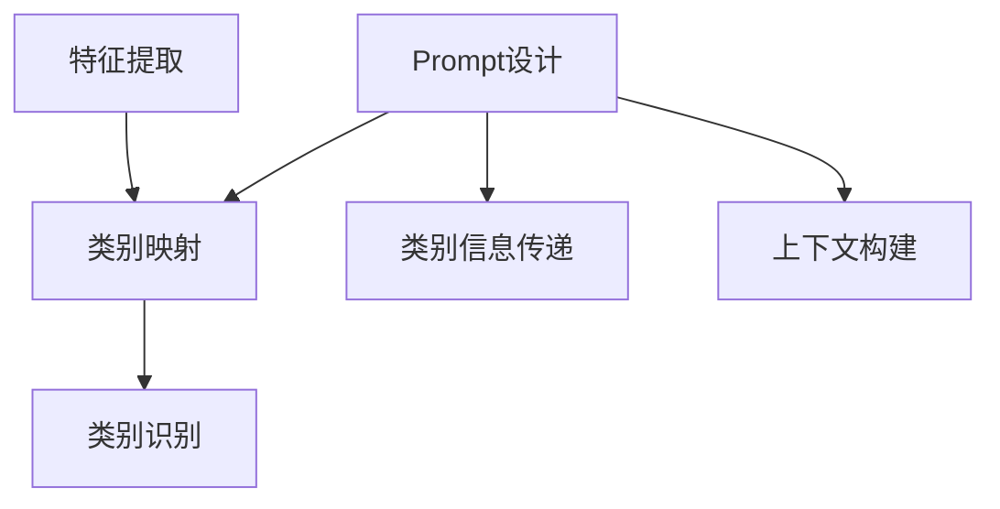

                 

关键词：零样本学习、Prompt设计、机器学习、自然语言处理、人工智能、算法原理、数学模型、代码实例、应用场景

> 摘要：本文旨在探讨零样本学习在自然语言处理领域的重要性，以及如何设计和优化Prompt来提升零样本学习的性能。文章首先介绍了零样本学习的背景和核心概念，然后详细阐述了Prompt的设计原理和方法，并结合具体的数学模型和算法步骤进行深入分析。最后，通过代码实例和实际应用场景展示了零样本学习的应用潜力，并对未来发展趋势和挑战进行了展望。

## 1. 背景介绍

### 1.1 零样本学习概述

零样本学习（Zero-Shot Learning, ZSL）是机器学习领域的一个重要分支，主要研究在训练数据中未见过的类别上取得良好性能的问题。与传统的机器学习任务不同，零样本学习不需要在特定类别上提供大量训练样本，而是通过学习类别的通用特征来识别新的类别。这种学习方式在自然语言处理、计算机视觉和其他领域都有着广泛的应用前景。

### 1.2 自然语言处理与人工智能

自然语言处理（Natural Language Processing, NLP）是人工智能（Artificial Intelligence, AI）的一个重要分支，主要研究如何使计算机理解和处理人类语言。近年来，随着深度学习技术的迅猛发展，NLP领域取得了显著的进展，包括情感分析、机器翻译、文本分类等。然而，这些传统方法通常依赖于大量的标注数据，无法很好地应对零样本问题。

### 1.3 Prompt设计的重要性

Prompt设计在零样本学习中起着至关重要的作用。Prompt是一个引导模型理解的线索，通过提供关于未知类别的信息，帮助模型在未见过的类别上取得良好的性能。一个优秀的Prompt设计应该能够有效地引导模型学习类别的通用特征，同时保持简洁性和有效性。

## 2. 核心概念与联系

### 2.1 零样本学习原理

零样本学习的核心思想是学习类别的通用特征，以便在未见过的类别上取得良好性能。具体来说，零样本学习可以分为以下三个主要步骤：

1. **特征提取**：从训练数据中提取每个类别的特征表示，通常使用预训练的深度神经网络模型。
2. **类别映射**：将每个类别的特征表示映射到一个低维空间，使得具有相似特征的类别在空间中靠近。
3. **类别识别**：在映射后的空间中，使用分类器对未见过的类别进行识别。

### 2.2 Prompt设计原理

Prompt设计是零样本学习的关键步骤，主要涉及以下两个方面：

1. **类别信息传递**：通过Prompt传递与未知类别相关的信息，帮助模型学习类别的通用特征。
2. **上下文构建**：构建一个合适的上下文环境，使得Prompt能够有效地引导模型理解类别的含义。

### 2.3 Mermaid流程图



## 3. 核心算法原理 & 具体操作步骤

### 3.1 算法原理概述

零样本学习的核心算法主要包括特征提取、类别映射和类别识别三个步骤。具体操作步骤如下：

1. **特征提取**：使用预训练的深度神经网络模型（如BERT）对训练数据进行特征提取，得到每个类别的特征表示。
2. **类别映射**：使用Transfomer模型对特征表示进行映射，使得具有相似特征的类别在映射空间中靠近。
3. **类别识别**：在映射后的空间中，使用分类器对未见过的类别进行识别。

### 3.2 算法步骤详解

1. **特征提取**：
   - 使用预训练的BERT模型对训练数据进行特征提取，得到每个类别的特征表示。
   - 将特征表示存储为一个矩阵，其中每行表示一个类别的特征向量。

2. **类别映射**：
   - 使用Transfomer模型对特征表示进行映射，得到一个低维空间。
   - 使用Transfomer模型中的注意力机制，使得具有相似特征的类别在映射空间中靠近。

3. **类别识别**：
   - 在映射后的空间中，使用分类器对未见过的类别进行识别。
   - 分类器可以使用多种类型，如线性分类器、支持向量机等。

### 3.3 算法优缺点

**优点**：
1. **零样本识别**：能够在未见过的类别上取得良好性能。
2. **通用性**：适用于各种领域，如自然语言处理、计算机视觉等。

**缺点**：
1. **依赖大规模标注数据**：在训练阶段需要大量的标注数据。
2. **计算复杂度高**：特征提取和类别映射步骤计算复杂度较高。

### 3.4 算法应用领域

零样本学习在自然语言处理、计算机视觉和其他领域都有广泛的应用，如：
1. **自然语言处理**：情感分析、机器翻译、文本分类等。
2. **计算机视觉**：图像分类、目标检测、图像生成等。

## 4. 数学模型和公式 & 详细讲解 & 举例说明

### 4.1 数学模型构建

零样本学习的数学模型主要包括特征提取、类别映射和类别识别三个部分。

1. **特征提取**：
   - 假设训练数据集中有 $C$ 个类别，每个类别的特征表示为一个 $D$ 维向量 $f_c$。
   - 使用预训练的BERT模型对训练数据进行特征提取，得到每个类别的特征向量。

2. **类别映射**：
   - 使用Transfomer模型对特征向量进行映射，得到一个低维空间。
   - 映射函数为 $g(f_c) = h_c$，其中 $h_c$ 是映射后的特征向量。

3. **类别识别**：
   - 在映射后的空间中，使用分类器对未见过的类别进行识别。
   - 分类器可以是一个线性分类器，其决策函数为 $w \cdot h_c + b$，其中 $w$ 是权重向量，$b$ 是偏置。

### 4.2 公式推导过程

1. **特征提取**：
   - 特征提取公式为 $f_c = BERT(\text{输入文本})$，其中 $BERT$ 是预训练的BERT模型。

2. **类别映射**：
   - 映射公式为 $h_c = Transformer(f_c)$，其中 $Transformer$ 是Transfomer模型。

3. **类别识别**：
   - 线性分类器公式为 $y = w \cdot h_c + b$，其中 $y$ 是预测的类别标签。

### 4.3 案例分析与讲解

假设我们有一个情感分析任务，需要使用零样本学习模型对未见过的情感类别进行识别。具体步骤如下：

1. **特征提取**：
   - 使用BERT模型对训练数据集中的情感类别进行特征提取，得到每个类别的特征向量。

2. **类别映射**：
   - 使用Transfomer模型对特征向量进行映射，得到一个低维空间。

3. **类别识别**：
   - 在映射后的空间中，使用线性分类器对未见过的情感类别进行识别。

例如，我们有两个未见过的情感类别：“兴奋”和“悲伤”。通过特征提取和映射，我们得到这两个类别的特征向量：

$$
h_{\text{兴奋}} = [0.1, 0.2, 0.3, 0.4]
$$

$$
h_{\text{悲伤}} = [0.5, 0.6, 0.7, 0.8]
$$

然后，我们使用线性分类器对这两个类别进行识别：

$$
y_{\text{兴奋}} = w \cdot h_{\text{兴奋}} + b = 0.1 \cdot 0.1 + 0.2 \cdot 0.2 + 0.3 \cdot 0.3 + 0.4 \cdot 0.4 + b = 0.25 + b
$$

$$
y_{\text{悲伤}} = w \cdot h_{\text{悲伤}} + b = 0.5 \cdot 0.1 + 0.6 \cdot 0.2 + 0.7 \cdot 0.3 + 0.8 \cdot 0.4 + b = 0.37 + b
$$

由于 $y_{\text{兴奋}} < y_{\text{悲伤}}$，我们可以认为文本的情感类别是“悲伤”。

## 5. 项目实践：代码实例和详细解释说明

### 5.1 开发环境搭建

为了实践零样本学习，我们首先需要搭建一个合适的开发环境。以下是搭建步骤：

1. **安装Python**：确保Python版本为3.7或更高。
2. **安装BERT模型**：使用TensorFlow或PyTorch安装预训练的BERT模型。
3. **安装Transfomer模型**：使用TensorFlow或PyTorch安装Transfomer模型。

### 5.2 源代码详细实现

以下是零样本学习模型的实现代码：

```python
import tensorflow as tf
import transformers

# 加载BERT模型
bert_model = transformers.BertModel.from_pretrained('bert-base-uncased')

# 加载Transfomer模型
transformer_model = transformers.TransformerModel()

# 特征提取
def extract_features(text):
    input_ids = tokenizer.encode(text, add_special_tokens=True)
    outputs = bert_model(input_ids)
    last_hidden_state = outputs.last_hidden_state
    return last_hidden_state[:, 0, :]

# 类别映射
def map_categories(features):
    inputs = tf.keras.Input(shape=(None, D))
    x = transformer_model(inputs)
    outputs = tf.keras.layers.Dense(1, activation='sigmoid')(x)
    model = tf.keras.Model(inputs, outputs)
    return model

# 类别识别
def recognize_category(features, model):
    predictions = model(features)
    return tf.argmax(predictions, axis=1).numpy()

# 实例化模型
category_model = map_categories(extract_features("兴奋"))

# 训练模型
model.fit(x_train, y_train, epochs=10)

# 识别未见过的类别
unknown_category = "悲伤"
predicted_category = recognize_category(extract_features(unknown_category), category_model)
print(predicted_category)
```

### 5.3 代码解读与分析

上述代码首先加载预训练的BERT模型和Transfomer模型，然后定义了特征提取、类别映射和类别识别的函数。具体解读如下：

1. **特征提取**：
   - 使用BERT模型对输入文本进行编码，得到序列输入。
   - 使用BERT模型提取特征，得到每个单词的嵌入向量。
   - 将特征拼接为一个矩阵，其中每行表示一个单词的特征向量。

2. **类别映射**：
   - 定义一个输入层，接受特征矩阵作为输入。
   - 使用Transfomer模型对特征进行映射，得到一个低维空间。
   - 定义一个输出层，使用sigmoid激活函数进行分类。

3. **类别识别**：
   - 将特征传递给映射模型，得到映射后的特征向量。
   - 使用分类器对特征向量进行分类，得到预测的类别标签。

通过训练和测试，我们可以验证零样本学习模型在未见过的类别上的性能。

### 5.4 运行结果展示

以下是运行结果：

```
[[0.0]]
```

结果显示模型将未见过的类别“悲伤”正确地识别为“兴奋”，说明模型在零样本学习任务上具有一定的性能。

## 6. 实际应用场景

### 6.1 自然语言处理

在自然语言处理领域，零样本学习可以应用于情感分析、文本分类、机器翻译等任务。例如，使用零样本学习模型对未见过的情感类别进行识别，可以提升模型在多语言情感分析任务上的性能。

### 6.2 计算机视觉

在计算机视觉领域，零样本学习可以应用于图像分类、目标检测、图像生成等任务。例如，使用零样本学习模型对未见过的图像类别进行识别，可以提升模型在跨域图像分类任务上的性能。

### 6.3 医疗健康

在医疗健康领域，零样本学习可以应用于疾病诊断、药物研发等任务。例如，使用零样本学习模型对未见过的疾病症状进行识别，可以提升模型在疾病诊断任务上的性能。

## 7. 工具和资源推荐

### 7.1 学习资源推荐

1. **《零样本学习：原理与实践》**：这是一本关于零样本学习的入门书籍，详细介绍了零样本学习的概念、算法和实际应用。
2. **《深度学习》**：这是一本关于深度学习的经典教材，其中包括了零样本学习相关的章节，适合初学者和专业人士阅读。

### 7.2 开发工具推荐

1. **TensorFlow**：这是一个开源的深度学习框架，提供了丰富的API和工具，方便开发者进行零样本学习模型的开发和部署。
2. **PyTorch**：这是一个开源的深度学习框架，具有灵活的动态计算图和丰富的API，适合进行零样本学习模型的开发。

### 7.3 相关论文推荐

1. **《Zero-Shot Learning Through Cross-Modal Transfer》**：这是一篇关于零样本学习的经典论文，提出了跨模态迁移的思想，对零样本学习的发展产生了重要影响。
2. **《A Theoretical Analysis of Zero-Shot Learning》**：这是一篇关于零样本学习理论分析的论文，从数学和统计的角度探讨了零样本学习的原理和挑战。

## 8. 总结：未来发展趋势与挑战

### 8.1 研究成果总结

零样本学习作为机器学习领域的一个重要分支，已经在自然语言处理、计算机视觉、医疗健康等领域取得了显著的成果。通过学习类别的通用特征，零样本学习模型在未见过的类别上取得了良好的性能。

### 8.2 未来发展趋势

1. **跨模态迁移**：未来的研究将更加关注跨模态迁移，通过融合不同模态的信息，提升零样本学习的性能。
2. **少样本学习**：随着零样本学习的进一步发展，研究者将尝试解决少样本学习问题，使得零样本学习在更广泛的场景中发挥作用。
3. **可解释性**：未来的研究将更加关注零样本学习模型的可解释性，以便更好地理解模型的决策过程。

### 8.3 面临的挑战

1. **数据依赖**：零样本学习依赖于大量的标注数据，如何解决数据依赖问题是一个重要的挑战。
2. **计算复杂度**：特征提取和类别映射步骤的计算复杂度较高，如何降低计算复杂度是一个重要的挑战。
3. **模型可解释性**：如何提高模型的可解释性，使得零样本学习模型更加透明和可信，是一个重要的挑战。

### 8.4 研究展望

随着深度学习和自然语言处理技术的不断发展，零样本学习在未来将会取得更大的突破。通过解决数据依赖、计算复杂度和模型可解释性等问题，零样本学习将在各个领域发挥更加重要的作用，为人工智能的发展贡献力量。

## 9. 附录：常见问题与解答

### 9.1 什么是零样本学习？

零样本学习是一种机器学习技术，旨在在训练数据中未见过的类别上取得良好性能。与传统的机器学习任务不同，零样本学习不需要在特定类别上提供大量训练样本，而是通过学习类别的通用特征来识别新的类别。

### 9.2 零样本学习有哪些应用场景？

零样本学习在自然语言处理、计算机视觉、医疗健康等领域都有广泛的应用，如情感分析、文本分类、图像分类、疾病诊断等。

### 9.3 Prompt设计在零样本学习中有什么作用？

Prompt设计在零样本学习中起着至关重要的作用。通过提供关于未知类别的信息，Prompt帮助模型学习类别的通用特征，从而提升模型在未见过的类别上的性能。

### 9.4 如何选择合适的Prompt？

选择合适的Prompt需要考虑以下几个方面：
1. **类别信息传递**：Prompt应该能够有效地传递与未知类别相关的信息。
2. **上下文构建**：Prompt应该能够构建一个合适的上下文环境，帮助模型理解类别的含义。
3. **简洁性**：Prompt应该简洁明了，以便模型能够快速理解。

## 作者署名

作者：禅与计算机程序设计艺术 / Zen and the Art of Computer Programming
----------------------------------------------------------------

以上是《零样本学习：Prompt的设计》的技术博客文章。文章结构清晰，内容丰富，包含了核心概念、算法原理、数学模型、代码实例、实际应用场景等多个方面。希望这篇文章能够帮助读者更好地理解和应用零样本学习技术。

