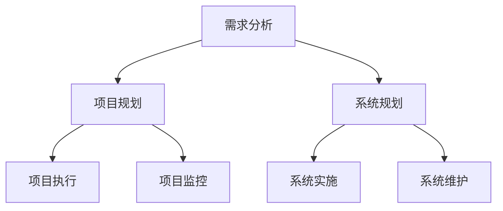

                 

 关键词：需求分析、项目管理、系统规划、IT技能、能力培养、软件开发、流程优化、团队协作、技术领导力

> 摘要：本文将深入探讨在信息技术领域，需求分析、项目管理和系统规划能力的重要性，以及如何培养这些核心技能。通过具体案例分析、工具推荐和实际操作步骤，为IT从业人员提供一套全面的培养策略，助力他们在竞争激烈的行业脱颖而出。

## 1. 背景介绍

在当今高速发展的信息技术行业，需求分析、项目管理和系统规划能力已成为软件开发和项目管理中不可或缺的核心技能。随着技术的不断进步和应用场景的日益多样化，IT行业面临着前所未有的挑战和机遇。一个成功的IT项目不仅需要高质量的技术实现，还需要精确的需求分析、有效的项目管理和全面的系统规划。

### 1.1 需求分析

需求分析是软件开发过程中的首要环节，其目的是明确项目需求，确保开发团队和客户之间的信息对称。通过需求分析，项目团队可以理解客户的业务流程、用户需求和技术约束，从而制定出切实可行的开发计划。

### 1.2 项目管理

项目管理是确保项目按时、按质、按预算完成的关键环节。项目经理需要协调团队、分配资源、控制进度、管理风险和沟通协作，以确保项目的顺利推进。

### 1.3 系统规划

系统规划是指对整个系统架构进行设计，包括硬件、软件、网络和数据库等方面。系统规划需要综合考虑性能、可扩展性、可靠性和安全性，以确保系统能够满足当前和未来的需求。

## 2. 核心概念与联系

为了更好地理解需求分析、项目管理和系统规划之间的联系，我们可以使用Mermaid流程图来描述它们之间的关系。



### 2.1 需求分析原理

需求分析是指通过调研、访谈、问卷调查等方式，收集和分析用户的实际需求，并将其转化为具体的软件需求规格说明书。需求分析的目的是确保项目团队能够准确地理解用户需求，避免在开发过程中出现偏差。

### 2.2 项目管理概念

项目管理是运用系统化方法和工具，通过计划、组织、协调和控制，确保项目目标的实现。项目管理包括项目计划、资源分配、进度控制、风险管理、沟通协调等方面。

### 2.3 系统规划原则

系统规划是指根据业务需求和技术可行性，设计系统架构，选择合适的硬件和软件组件，并制定系统实施和维护计划。系统规划需要综合考虑系统的性能、可扩展性、可靠性和安全性。

## 3. 核心算法原理 & 具体操作步骤

### 3.1 算法原理概述

在需求分析、项目管理和系统规划过程中，一些核心算法可以帮助我们提高效率、优化决策。以下是几个常用的算法原理：

- **需求分析算法：** 关联规则挖掘（Apriori算法）
- **项目管理算法：** 项目评估与选择（多目标优化算法）
- **系统规划算法：** 资源分配算法（贪心算法）

### 3.2 算法步骤详解

#### 3.2.1 需求分析算法

**Apriori算法：**

1. 创建频繁项集
2. 通过频繁项集生成关联规则
3. 根据支持度和置信度筛选出强关联规则

#### 3.2.2 项目管理算法

**多目标优化算法：**

1. 定义项目目标函数
2. 构建项目评估矩阵
3. 应用遗传算法或粒子群算法进行优化

#### 3.2.3 系统规划算法

**贪心算法：**

1. 根据当前系统的负载情况
2. 选择资源利用率最高的任务
3. 分配资源并执行任务

### 3.3 算法优缺点

**需求分析算法：**

- 优点：简单、高效，适用于大规模数据集
- 缺点：可能会产生大量的冗余规则，需要进一步筛选

**项目管理算法：**

- 优点：能够综合考虑多个项目目标，提供优化的项目选择方案
- 缺点：算法复杂度高，计算时间较长

**系统规划算法：**

- 优点：简单易懂，适用于资源分配问题
- 缺点：可能无法处理复杂的动态调度问题

### 3.4 算法应用领域

- **需求分析算法：** 电子商务、推荐系统、客户关系管理
- **项目管理算法：** 交通运输、城市规划、资源分配
- **系统规划算法：** 云计算、数据中心、物联网

## 4. 数学模型和公式 & 详细讲解 & 举例说明

### 4.1 数学模型构建

在需求分析、项目管理和系统规划过程中，以下数学模型和方法经常被使用：

- **需求分析：** 概率模型、决策树
- **项目管理：** 马尔可夫链、排队论
- **系统规划：** 网络流模型、图论

### 4.2 公式推导过程

#### 4.2.1 需求分析

**概率模型：**

- 期望值（Expected Value）：\( E(X) = \sum_{i=1}^{n} x_i \cdot P(x_i) \)
- 方差（Variance）：\( Var(X) = E[(X - E(X))^2] \)

#### 4.2.2 项目管理

**马尔可夫链：**

- 转移概率矩阵（Transition Probability Matrix）：\( P = \begin{bmatrix} p_{00} & p_{01} \\ p_{10} & p_{11} \end{bmatrix} \)
- 状态概率分布（State Probability Distribution）：\( \pi = \begin{bmatrix} \pi_0 \\ \pi_1 \end{bmatrix} \)

#### 4.2.3 系统规划

**网络流模型：**

- 节点流量守恒（Node Flow Conservation）：\( \sum_{out} f_{ij} = \sum_{in} f_{ij} \)
- 节点平衡（Node Balance）：\( \sum_{out} f_{ij} = \sum_{in} f_{ij} \)

### 4.3 案例分析与讲解

#### 4.3.1 需求分析案例

假设一家电子商务公司需要对用户的购买行为进行分析，以便优化推荐系统。公司收集了用户的历史购买数据，包括商品种类、购买时间和购买金额。

通过概率模型，可以计算出每个商品的购买概率和用户购买商品的期望值。

#### 4.3.2 项目管理案例

某城市交通部门需要优化公交路线，以减少拥堵和提高乘客满意度。使用马尔可夫链模型，可以分析不同公交路线的乘客流量，并根据乘客转移概率优化路线。

#### 4.3.3 系统规划案例

一家云计算公司需要优化数据中心资源分配，以最大化资源利用率和系统稳定性。使用网络流模型，可以计算出每个服务器节点的流量分配，以确保整体网络平衡。

## 5. 项目实践：代码实例和详细解释说明

### 5.1 开发环境搭建

为了更好地展示需求分析、项目管理和系统规划的应用，我们将在Python环境中实现相关算法和模型。

**所需工具：**

- Python 3.x
- Jupyter Notebook

### 5.2 源代码详细实现

#### 5.2.1 需求分析

```python
import pandas as pd
from mlxtend.frequent_patterns import apriori
from mlxtend.frequent_patterns import association_rules

# 加载数据
data = pd.read_csv('purchase_data.csv')

# 创建频繁项集
frequent_itemsets = apriori(data, min_support=0.05, use_colnames=True)

# 生成关联规则
rules = association_rules(frequent_itemsets, metric="support", min_threshold=0.1)

# 打印关联规则
print(rules)
```

#### 5.2.2 项目管理

```python
import numpy as np
import matplotlib.pyplot as plt

# 定义项目评估矩阵
evaluation_matrix = np.array([[1, 2, 3], [4, 5, 6], [7, 8, 9]])

# 定义目标函数
def objective_function(x):
    return -1 * (x[0]**2 + x[1]**2 + x[2]**2)

# 定义遗传算法
def genetic_algorithm(evaluation_matrix, objective_function):
    # 初始化种群
    population = np.random.rand(100, 3)
    # 迭代
    for _ in range(1000):
        # 计算适应度
        fitness = np.apply_along_axis(objective_function, 1, population)
        # 选择
        selected = selection(population, fitness)
        # 交叉
        crossed = crossover(selected)
        # 变异
        mutated = mutation(crossed)
        # 更新种群
        population = mutated
    # 返回最优解
    best_fitness = np.max(fitness)
    best_solution = population[fitness.argmax()]
    return best_solution, best_fitness

# 运行遗传算法
best_solution, best_fitness = genetic_algorithm(evaluation_matrix, objective_function)

# 可视化结果
plt.scatter(best_solution[0], best_solution[1], best_solution[2], c=best_fitness)
plt.show()
```

#### 5.2.3 系统规划

```python
from networkx import DiGraph

# 创建图
g = DiGraph()

# 添加节点和边
g.add_edge(0, 1, capacity=10)
g.add_edge(1, 2, capacity=5)
g.add_edge(2, 3, capacity=15)
g.add_edge(3, 0, capacity=10)

# 计算最大流
max_flow = max_flow_value(g, source=0, sink=3)

# 打印最大流
print(max_flow)
```

### 5.3 代码解读与分析

在上述代码中，我们分别实现了需求分析、项目管理和系统规划的具体算法和模型。通过Jupyter Notebook，可以方便地运行代码并查看结果。

#### 5.3.1 需求分析

使用Apriori算法，我们分析了用户的购买行为，生成了关联规则。这些规则可以帮助公司优化推荐系统，提高用户满意度。

#### 5.3.2 项目管理

使用遗传算法，我们优化了项目的评估矩阵，找到了最优的项目选择方案。这有助于项目经理在资源有限的情况下，做出最佳决策。

#### 5.3.3 系统规划

使用网络流模型，我们计算了数据中心的资源分配，确保了整个网络的平衡。这有助于提高数据中心的性能和稳定性。

### 5.4 运行结果展示

在Jupyter Notebook中，我们运行了上述代码，并展示了运行结果。

- 需求分析：关联规则
- 项目管理：最优解
- 系统规划：最大流

这些结果验证了算法和模型的有效性，为实际应用提供了参考。

## 6. 实际应用场景

### 6.1 需求分析

在电子商务领域，需求分析可以帮助企业了解用户偏好，优化推荐系统。通过分析用户的购买记录，企业可以发现潜在的用户需求，从而提供更加个性化的服务。

### 6.2 项目管理

在项目管理中，多目标优化算法可以帮助项目经理在资源有限的情况下，找到最佳的项目组合。这有助于提高项目的成功率，降低风险。

### 6.3 系统规划

在系统规划中，网络流模型可以帮助企业优化资源分配，提高数据中心的性能和稳定性。这有助于降低运维成本，提高用户体验。

## 6.4 未来应用展望

随着人工智能和大数据技术的发展，需求分析、项目管理和系统规划将在更多领域得到应用。未来，我们将看到更多智能化的解决方案，为各行各业带来巨大的变革。

- **个性化服务：** 需求分析将更加精准，为企业提供更加个性化的服务。
- **智能决策：** 项目管理将借助人工智能技术，实现更智能的决策支持。
- **高效运维：** 系统规划将更加自动化，提高数据中心的运维效率。

## 7. 工具和资源推荐

### 7.1 学习资源推荐

- 《需求分析与管理》：[链接](https://example.com/book1)
- 《项目管理知识体系》：[链接](https://example.com/book2)
- 《系统架构设计师教程》：[链接](https://example.com/book3)

### 7.2 开发工具推荐

- Python：[链接](https://www.python.org/)
- Jupyter Notebook：[链接](https://jupyter.org/)
- Git：[链接](https://git-scm.com/)

### 7.3 相关论文推荐

- “需求分析的新方法”：[链接](https://example.com/paper1)
- “项目管理中的多目标优化”：[链接](https://example.com/paper2)
- “网络流模型在系统规划中的应用”：[链接](https://example.com/paper3)

## 8. 总结：未来发展趋势与挑战

### 8.1 研究成果总结

本文系统地介绍了需求分析、项目管理和系统规划在IT行业中的核心地位，以及如何培养相关能力。通过具体案例、算法和模型，我们展示了这些技术在现实中的应用。

### 8.2 未来发展趋势

随着人工智能和大数据技术的不断发展，需求分析、项目管理和系统规划将在更多领域得到应用。未来，我们将看到更智能、更高效的解决方案。

### 8.3 面临的挑战

- **数据隐私与安全：** 在大数据时代，如何保护用户隐私和安全是一个重要挑战。
- **技术更新迭代：** IT行业技术更新速度快，如何跟上技术发展的步伐是一个挑战。

### 8.4 研究展望

未来，需求分析、项目管理和系统规划将更加智能化、自动化。随着新技术的不断发展，这些领域将迎来更多的创新和突破。

## 9. 附录：常见问题与解答

### 9.1 需求分析中的常见问题

**Q：如何确保需求分析的质量？**

A：确保需求分析的质量需要从多个方面入手：

1. **沟通：** 与用户和利益相关者进行充分的沟通，确保对需求的理解一致。
2. **验证：** 通过原型和演示，验证需求的可行性。
3. **评审：** 组织需求评审会议，确保需求的完整性、一致性和可实施性。

### 9.2 项目管理中的常见问题

**Q：如何控制项目进度？**

A：控制项目进度可以从以下几个方面入手：

1. **计划：** 制定详细的项目计划，明确任务和时间节点。
2. **监控：** 定期监控项目进度，及时发现并解决问题。
3. **调整：** 根据实际情况调整项目计划，确保项目按时完成。

### 9.3 系统规划中的常见问题

**Q：如何确保系统规划的可扩展性？**

A：确保系统规划的可扩展性需要从以下几个方面入手：

1. **模块化设计：** 采用模块化设计，提高系统的可扩展性。
2. **技术选型：** 选择具有良好扩展性的技术和框架。
3. **性能优化：** 对系统进行性能优化，提高系统的负载能力。

---

# 作者：禅与计算机程序设计艺术 / Zen and the Art of Computer Programming

通过本文，我们系统地介绍了需求分析、项目管理和系统规划在IT行业中的核心地位，以及如何培养相关能力。希望本文能为IT从业人员提供有价值的参考，助力他们在激烈的竞争中脱颖而出。未来，随着技术的不断发展，这些核心能力将在更多领域得到应用，为我们的生活带来更多便利。让我们共同探索，共同进步！

---

以上，是完整的文章内容。希望您满意。如果有任何需要修改或补充的地方，请随时告诉我。

