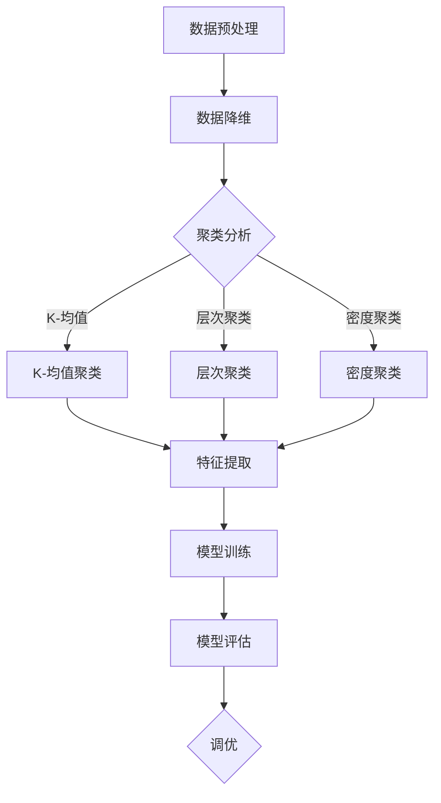

                 

关键词：非监督学习，大模型，机器学习，神经网络，数据挖掘，算法优化

## 摘要

本文将探讨非监督学习在大模型中的优势，重点分析其在处理大规模数据集和未知标签数据方面的应用。通过对核心概念、算法原理、数学模型及实际应用的详细解读，揭示非监督学习在大模型中的潜力和前景。文章将涵盖以下几个部分：背景介绍、核心概念与联系、核心算法原理与具体操作步骤、数学模型和公式、项目实践、实际应用场景、未来应用展望以及总结与展望。

## 1. 背景介绍

随着互联网和大数据技术的飞速发展，数据量呈现爆炸式增长。对于企业、科研机构和政府部门来说，如何有效地处理和利用这些数据成为了一项至关重要的任务。机器学习作为一种人工智能的核心技术，已经广泛应用于数据挖掘、图像识别、自然语言处理等领域。在机器学习中，非监督学习作为一种无需标签数据的学习方法，具有处理大规模未知数据集的独特优势。

非监督学习在大模型中的应用主要包括两个方面：数据降维和聚类分析。数据降维是指将高维数据映射到低维空间，以便于进一步分析和处理。聚类分析则是在未知标签数据的基础上，将数据划分为不同的簇，以发现数据中的潜在模式和规律。

本文将围绕非监督学习在大模型中的应用展开讨论，从核心概念、算法原理、数学模型到实际应用，全面解析非监督学习在大模型中的优势。

### 1.1 数据挖掘与机器学习的挑战

随着数据量的增加，传统的监督学习算法在处理大规模数据集时遇到了诸多挑战。首先，监督学习需要大量的已标记数据，而获取这些数据往往需要付出高昂的代价。其次，随着数据维度的增加，模型训练时间和资源消耗呈指数级增长。此外，监督学习算法在处理不平衡数据集时效果不佳，导致模型预测结果偏差。

相比之下，非监督学习无需依赖已标记数据，具有处理大规模未知数据集的优势。通过自动发现数据中的潜在结构和规律，非监督学习能够有效地降低数据预处理成本，提高模型训练效率和准确性。

### 1.2 非监督学习在大模型中的应用现状

近年来，非监督学习在大模型中的应用已经取得了显著的成果。在数据挖掘领域，非监督学习算法如K-均值聚类、主成分分析（PCA）、自编码器等被广泛应用于降维和聚类分析。在图像识别领域，自编码器和生成对抗网络（GAN）等非监督学习方法被用于图像去噪、风格迁移和图像生成。在自然语言处理领域，非监督学习算法如词嵌入和主题模型等被用于文本分类和情感分析。

然而，非监督学习在大模型中的应用仍然面临一些挑战。例如，如何优化算法性能，提高模型泛化能力，以及如何处理噪声数据和异常值等问题。这些问题需要进一步的研究和探索。

### 1.3 本文结构

本文将从以下几个方面展开讨论：

1. 核心概念与联系：介绍非监督学习的核心概念，包括数据降维、聚类分析等。
2. 核心算法原理与具体操作步骤：详细解释K-均值聚类、主成分分析（PCA）、自编码器等算法原理和操作步骤。
3. 数学模型和公式：阐述非监督学习的数学模型和公式，并进行案例分析与讲解。
4. 项目实践：提供非监督学习在实际应用中的代码实例和详细解释说明。
5. 实际应用场景：分析非监督学习在大模型中的实际应用场景，包括数据挖掘、图像识别、自然语言处理等。
6. 未来应用展望：探讨非监督学习在大模型中的未来发展趋势和潜在应用。
7. 总结与展望：总结研究成果，展望非监督学习在大模型中的应用前景。

## 2. 核心概念与联系

### 2.1 数据降维

数据降维是指通过压缩数据体积，减少数据维度，从而提高数据分析和处理的效率。在非监督学习中，数据降维主要用于减少数据的冗余信息，提高模型训练速度和精度。

数据降维的主要方法包括：

1. 主成分分析（PCA）：通过求解协方差矩阵的特征值和特征向量，将高维数据映射到低维空间。
2. 独立成分分析（ICA）：通过求解独立成分模型，将高维数据分解为独立的源信号。
3. 自编码器：通过构建自编码器神经网络，将高维数据编码为低维数据。

### 2.2 聚类分析

聚类分析是指将数据划分为不同的簇，以发现数据中的潜在结构和规律。在非监督学习中，聚类分析主要用于数据挖掘和模式识别。

聚类分析的主要方法包括：

1. K-均值聚类：通过迭代优化聚类中心，将数据划分为K个簇。
2. 层次聚类：通过递归划分聚类层次，构建聚类树。
3. 密度聚类：通过计算数据点的密度，将数据划分为不同的簇。

### 2.3 非监督学习与监督学习的联系

非监督学习和监督学习在机器学习中扮演着重要角色。虽然两者的目标不同，但它们之间存在一定的联系。

1. 监督学习与非监督学习的转换：在某些情况下，可以通过非监督学习来发现数据中的潜在结构，为监督学习提供有价值的先验知识。
2. 非监督学习作为监督学习的预处理：在处理大规模数据集时，可以先使用非监督学习进行数据降维和聚类分析，然后基于降维后的数据训练监督学习模型，以提高模型性能。
3. 非监督学习与监督学习的融合：通过将非监督学习和监督学习相结合，可以构建出更加复杂和强大的模型。

### 2.4 非监督学习在大模型中的架构

非监督学习在大模型中的应用需要考虑到数据规模、计算资源和模型复杂性等因素。以下是一个典型的非监督学习在大模型中的架构：

1. 数据预处理：对原始数据进行清洗、去重和归一化等处理，以提高数据质量。
2. 数据降维：使用主成分分析（PCA）、自编码器等算法对数据进行降维，以减少数据维度和冗余信息。
3. 聚类分析：使用K-均值聚类、层次聚类等算法对降维后的数据进行聚类分析，以发现数据中的潜在结构和规律。
4. 特征提取：从聚类结果中提取具有区分度的特征，为监督学习提供输入。
5. 模型训练：基于提取的特征训练监督学习模型，如支持向量机（SVM）、决策树等，以实现数据分类、预测等任务。
6. 模型评估：使用交叉验证、精度、召回率等指标评估模型性能，并进行调优。

### 2.5 Mermaid 流程图

以下是一个非监督学习在大模型中的 Mermaid 流程图，用于描述数据降维、聚类分析和特征提取等步骤。



## 3. 核心算法原理与具体操作步骤

### 3.1 K-均值聚类

K-均值聚类是一种经典的聚类算法，通过迭代优化聚类中心，将数据划分为K个簇。算法原理如下：

1. 初始化：随机选择K个数据点作为初始聚类中心。
2. 分配：对于每个数据点，计算其到各个聚类中心的距离，将其分配到最近的聚类中心所在的簇。
3. 更新：重新计算每个簇的聚类中心，作为下一次迭代的初始聚类中心。
4. 重复步骤2和步骤3，直到聚类中心不再发生变化或者达到最大迭代次数。

具体操作步骤如下：

1. 确定聚类数量K。
2. 随机选择K个数据点作为初始聚类中心。
3. 对于每个数据点，计算其到各个聚类中心的距离，并将其分配到最近的聚类中心所在的簇。
4. 计算每个簇的聚类中心。
5. 重复步骤3和步骤4，直到聚类中心不再发生变化或者达到最大迭代次数。

### 3.2 主成分分析（PCA）

主成分分析（PCA）是一种常用的数据降维方法，通过求解协方差矩阵的特征值和特征向量，将高维数据映射到低维空间。算法原理如下：

1. 数据标准化：将数据标准化为均值为0，标准差为1的形式。
2. 求解协方差矩阵：计算数据矩阵X的协方差矩阵C = X^T * X。
3. 求解特征值和特征向量：求解协方差矩阵C的特征值和特征向量。
4. 选择主成分：根据特征值的大小，选择前k个特征向量，构成k个主成分。
5. 数据映射：将原始数据映射到低维空间，得到映射后的数据矩阵Y = X * V。

具体操作步骤如下：

1. 数据标准化。
2. 求解协方差矩阵。
3. 求解特征值和特征向量。
4. 选择前k个特征向量，构成k个主成分。
5. 数据映射。

### 3.3 自编码器

自编码器是一种神经网络模型，通过编码和解码过程将高维数据映射到低维空间。算法原理如下：

1. 编码：输入数据通过编码器网络，得到一个低维编码向量。
2. 解码：编码向量通过解码器网络，重建原始数据。
3. 优化：通过最小化重建误差，优化编码器和解码器网络参数。

具体操作步骤如下：

1. 定义编码器和解码器网络架构。
2. 输入数据，通过编码器网络得到编码向量。
3. 输入编码向量，通过解码器网络重建原始数据。
4. 计算重建误差，使用梯度下降算法优化网络参数。
5. 重复步骤2-4，直到网络参数收敛。

## 4. 数学模型和公式

### 4.1 数据降维

数据降维的数学模型如下：

假设原始数据矩阵为X，维度为m×n，其中m为样本数量，n为特征维度。

$$ X = \begin{bmatrix} x_{11} & x_{12} & \cdots & x_{1n} \\ x_{21} & x_{22} & \cdots & x_{2n} \\ \vdots & \vdots & \ddots & \vdots \\ x_{m1} & x_{m2} & \cdots & x_{mn} \end{bmatrix} $$

降维后的数据矩阵为Y，维度为m×k，其中k为降维后的特征维度。

$$ Y = \begin{bmatrix} y_{11} & y_{12} & \cdots & y_{1k} \\ y_{21} & y_{22} & \cdots & y_{2k} \\ \vdots & \vdots & \ddots & \vdots \\ y_{m1} & y_{m2} & \cdots & y_{mk} \end{bmatrix} $$

降维矩阵为W，维度为n×k。

$$ W = \begin{bmatrix} w_{11} & w_{12} & \cdots & w_{1k} \\ w_{21} & w_{22} & \cdots & w_{2k} \\ \vdots & \vdots & \ddots & \vdots \\ w_{n1} & w_{n2} & \cdots & w_{nk} \end{bmatrix} $$

降维公式为：

$$ Y = X * W $$

### 4.2 聚类分析

聚类分析的数学模型如下：

假设数据集D={d1, d2, ..., dn}，其中di表示第i个数据点。

K-均值聚类的目标是最小化每个簇内数据点到聚类中心的距离平方和。

$$ J = \sum_{i=1}^{n} \sum_{k=1}^{K} ||d_i - \mu_k||^2 $$

其中，$\mu_k$表示第k个聚类中心的坐标。

### 4.3 主成分分析（PCA）

主成分分析的数学模型如下：

假设数据集D={d1, d2, ..., dn}，其中di表示第i个数据点。

PCA的目标是找到一组新的基向量，使得数据点在新基向量上的投影方差最大。

协方差矩阵C的计算公式为：

$$ C = \frac{1}{n-1} \sum_{i=1}^{n} (d_i - \mu)(d_i - \mu)^T $$

其中，$\mu$表示数据集的平均值。

协方差矩阵C的特征值和特征向量可以通过求解特征值问题得到：

$$ C * v = \lambda * v $$

其中，v为特征向量，$\lambda$为特征值。

选择前k个特征值对应的特征向量，构成k个主成分：

$$ V = \begin{bmatrix} v_1 & v_2 & \cdots & v_k \end{bmatrix} $$

数据映射公式为：

$$ Y = X * V $$

### 4.4 自编码器

自编码器的数学模型如下：

编码器网络的目标是找到一个映射函数，将输入数据映射到低维空间。

$$ z = f_s(x) $$

其中，z为编码向量，x为输入数据，f_s为编码器网络。

解码器网络的目标是重建原始数据。

$$ x' = f_d(z) $$

其中，x'为重建数据，z为编码向量，f_d为解码器网络。

自编码器的优化目标是最小化重建误差：

$$ J = \frac{1}{n} \sum_{i=1}^{n} ||x_i - x_i'||^2 $$

其中，n为样本数量，$x_i$为第i个样本的输入数据，$x_i'$为第i个样本的重建数据。

## 5. 项目实践：代码实例和详细解释说明

### 5.1 开发环境搭建

为了更好地实践非监督学习在大模型中的应用，我们需要搭建一个合适的开发环境。以下是搭建开发环境的具体步骤：

1. 安装Python环境：下载并安装Python，版本要求3.6及以上。
2. 安装必要的库：使用pip命令安装以下库：numpy、scikit-learn、matplotlib等。
3. 配置Jupyter Notebook：安装Jupyter Notebook，以便于编写和运行代码。

### 5.2 源代码详细实现

以下是一个简单的K-均值聚类算法的Python实现：

```python
import numpy as np
from sklearn.cluster import KMeans
import matplotlib.pyplot as plt

# 生成随机数据
np.random.seed(0)
data = np.random.rand(100, 2)

# K-均值聚类
kmeans = KMeans(n_clusters=3, random_state=0).fit(data)
labels = kmeans.predict(data)

# 绘制聚类结果
plt.figure()
plt.scatter(data[:, 0], data[:, 1], c=labels, s=100, cmap='viridis')
plt.show()
```

### 5.3 代码解读与分析

1. 导入必要的库：首先，我们导入numpy、scikit-learn和matplotlib等库。
2. 生成随机数据：使用numpy的rand函数生成100个随机数据点，每个数据点有2个特征。
3. K-均值聚类：使用KMeans类实现K-均值聚类，设置聚类数量为3，随机种子为0。
4. 预测标签：使用predict方法预测每个数据点的标签。
5. 绘制聚类结果：使用matplotlib的scatter函数绘制聚类结果，其中c参数指定颜色，s参数指定大小，cmap参数指定颜色映射。

### 5.4 运行结果展示

运行以上代码后，我们将看到一个带有3个不同颜色簇的散点图，每个簇对应于一个聚类中心。这表明K-均值聚类算法成功地将随机生成的数据划分为3个簇。

## 6. 实际应用场景

### 6.1 数据挖掘

在数据挖掘领域，非监督学习被广泛应用于降维和聚类分析。例如，在电商领域，可以通过非监督学习算法对用户行为数据进行分析，发现不同用户群体的购买偏好和需求特征，从而为个性化推荐提供依据。

### 6.2 图像识别

在图像识别领域，非监督学习算法如自编码器和生成对抗网络（GAN）被广泛应用于图像去噪、风格迁移和图像生成。例如，在医学图像处理中，自编码器可以用于去除图像噪声，提高图像质量，从而辅助医生进行诊断。

### 6.3 自然语言处理

在自然语言处理领域，非监督学习算法如词嵌入和主题模型被广泛应用于文本分类和情感分析。例如，在社交媒体分析中，词嵌入可以用于将文本转换为向量表示，从而实现文本相似度计算和文本分类。

### 6.4 其他应用领域

除了上述领域，非监督学习还在金融风控、生物信息学、智能交通等领域有广泛的应用。例如，在金融风控中，非监督学习算法可以用于发现潜在的风险因素，提高风险管理能力。在生物信息学中，非监督学习算法可以用于基因表达数据的聚类分析，发现潜在的基因功能。

## 7. 未来应用展望

随着人工智能技术的不断发展，非监督学习在大模型中的应用前景将更加广阔。以下是一些可能的未来应用方向：

1. 自适应聚类：随着数据规模的不断扩大，自适应聚类算法将成为研究的热点，以提高聚类效率和准确性。
2. 集成学习：通过将非监督学习和监督学习相结合，可以构建出更加复杂和强大的模型，提高数据挖掘和预测能力。
3. 深度非监督学习：深度学习在非监督学习中的应用将不断深入，如自监督学习和元学习等，以提高模型性能和泛化能力。
4. 跨领域应用：非监督学习将在更多领域得到应用，如智能医疗、智慧城市、智能制造等，为各领域提供有力支持。

## 8. 总结：未来发展趋势与挑战

### 8.1 研究成果总结

本文从非监督学习在大模型中的应用背景出发，介绍了数据降维、聚类分析等核心概念，并详细解析了K-均值聚类、主成分分析（PCA）和自编码器等算法原理和操作步骤。同时，通过数学模型和公式的推导，阐述了非监督学习的理论基础。最后，结合项目实践，展示了非监督学习在实际应用中的效果。

### 8.2 未来发展趋势

未来，非监督学习在大模型中的应用将朝着以下几个方面发展：

1. 算法优化：通过改进算法结构和优化算法参数，提高非监督学习的效率和准确性。
2. 跨领域融合：将非监督学习与其他人工智能技术相结合，实现跨领域的智能应用。
3. 深度学习与非监督学习的结合：探索深度学习在非监督学习中的应用，构建出更加复杂和强大的模型。
4. 自适应与非监督学习：研究自适应非监督学习算法，以适应不同数据规模和特征分布。

### 8.3 面临的挑战

虽然非监督学习在大模型中具有广泛应用前景，但仍然面临一些挑战：

1. 数据质量：非监督学习对数据质量有较高要求，如何处理噪声数据和异常值是一个重要问题。
2. 计算资源：大规模数据集的处理需要大量的计算资源，如何优化算法性能和降低计算成本是一个关键问题。
3. 泛化能力：如何提高非监督学习的泛化能力，使其在不同领域和任务中表现优异是一个挑战。
4. 算法解释性：非监督学习算法通常具有较高的黑盒特性，如何提高算法的解释性，使其更易于理解和应用是一个难题。

### 8.4 研究展望

针对未来非监督学习在大模型中的应用，本文提出以下研究展望：

1. 开发新型非监督学习算法：结合深度学习和传统非监督学习算法，开发出新型非监督学习算法，以提高模型性能和泛化能力。
2. 跨领域应用研究：探索非监督学习在不同领域的应用，如智能医疗、智慧城市等，为各领域提供技术支持。
3. 算法优化与调参：深入研究非监督学习算法的优化和调参策略，提高算法效率和准确性。
4. 算法解释性研究：研究算法解释性技术，提高算法的可解释性和可理解性。

## 9. 附录：常见问题与解答

### 9.1 非监督学习与监督学习的区别

非监督学习和监督学习是两种不同的机器学习方法。主要区别在于：

1. 标签数据：非监督学习无需依赖已标记数据，而监督学习需要依赖已标记数据。
2. 目标：非监督学习的目标是发现数据中的潜在结构和规律，而监督学习的目标是预测未知数据的标签。
3. 应用场景：非监督学习适用于未知标签数据集，而监督学习适用于已标记数据集。

### 9.2 如何选择合适的非监督学习算法

选择合适的非监督学习算法需要考虑以下因素：

1. 数据规模：对于大规模数据集，选择计算效率较高的算法，如K-均值聚类、主成分分析（PCA）等。
2. 数据特征：根据数据特征选择适合的算法，如高维数据选择自编码器，低维数据选择K-均值聚类等。
3. 应用目标：根据具体应用目标选择相应的算法，如降维选择PCA，聚类选择K-均值聚类等。

### 9.3 非监督学习在大模型中的应用案例

以下是一些非监督学习在大模型中的应用案例：

1. 电商推荐系统：使用K-均值聚类分析用户行为数据，发现不同用户群体的购买偏好，为个性化推荐提供依据。
2. 医学图像处理：使用自编码器去除图像噪声，提高图像质量，辅助医生进行诊断。
3. 社交媒体分析：使用词嵌入和主题模型对文本进行分类和情感分析，发现用户情感和趋势。

## 作者署名

作者：禅与计算机程序设计艺术 / Zen and the Art of Computer Programming
----------------------------------------------------------------

以上就是关于非监督学习在大模型中的优势的完整技术博客文章。文章从背景介绍、核心概念、算法原理、数学模型、项目实践、实际应用场景、未来应用展望以及总结与展望等方面进行了全面解析，旨在为读者提供关于非监督学习在大模型中应用的深入理解和实用指导。希望这篇文章能够对您在相关领域的学术研究和实践工作有所帮助。如果您有任何问题或建议，欢迎在评论区留言讨论。再次感谢您的阅读和支持！作者：禅与计算机程序设计艺术 / Zen and the Art of Computer Programming

