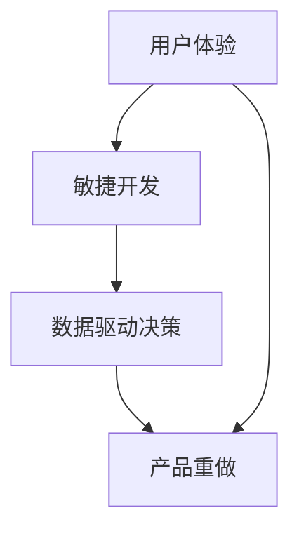
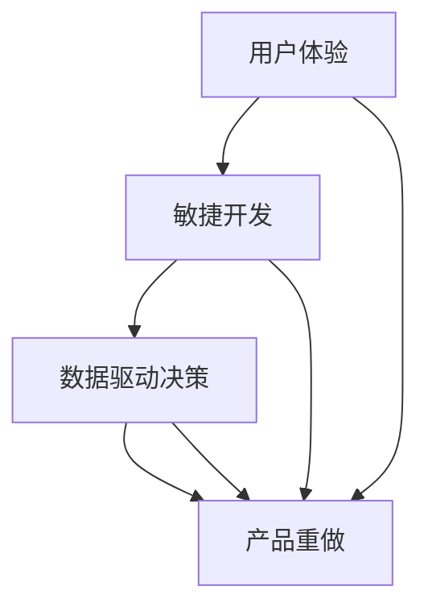
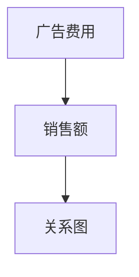

                 

关键词：AI时代、产品重做、技术革新、用户体验、商业成功

摘要：随着人工智能（AI）技术的不断进步，产品重做成为企业保持竞争优势的关键。本文将探讨AI时代下产品重做的动机、策略和方法，并通过实际案例，分析其成功的关键因素和未来趋势。

## 1. 背景介绍

人工智能，作为当前技术领域的热门话题，已经深刻改变了我们的生活。从智能家居到自动驾驶，从智能客服到医疗诊断，AI技术的应用无处不在。然而，随着AI技术的不断发展，传统产品面临的挑战也越来越大。用户体验的滞后、功能的不足、技术的过时等问题，使得许多企业开始考虑对现有产品进行重做，以适应AI时代的需求。

产品重做不仅是对产品功能的升级和优化，更是对产品架构和设计理念的重新审视。在AI时代，产品重做的动机不仅源于技术进步，还源于市场需求的变化、用户行为的变化以及商业模式的变革。

## 2. 核心概念与联系

为了更好地理解产品重做的核心概念，我们需要先了解以下几个关键概念：

- **用户体验（UX）**：用户体验是指用户在使用产品过程中的感受和体验。在AI时代，用户体验的重要性更加凸显，因为用户对于智能化的产品有着更高的期望。

- **敏捷开发（Agile）**：敏捷开发是一种以用户需求为核心的软件开发方法。它强调快速迭代、持续交付和团队协作，非常适合应对AI时代的快速变化。

- **数据驱动决策**：在AI时代，数据成为决策的重要依据。通过分析用户数据、市场数据和业务数据，企业可以做出更加明智的决策。

下面是一个使用Mermaid绘制的流程图，展示了这些核心概念之间的关系：



## 3. 核心算法原理 & 具体操作步骤

### 3.1 算法原理概述

在AI时代的产品重做过程中，核心算法的原理至关重要。以下是几个关键的算法原理：

- **机器学习**：通过训练模型，让计算机自动从数据中学习，从而做出预测或决策。

- **深度学习**：一种基于人工神经网络的算法，能够在大量数据中自动提取特征。

- **自然语言处理（NLP）**：通过算法理解和生成自然语言，实现人与机器的对话。

### 3.2 算法步骤详解

产品重做的算法步骤可以概括为以下五个阶段：

1. **需求分析**：明确产品的目标和用户需求。

2. **数据收集**：收集与产品相关的数据，包括用户行为数据、市场数据和业务数据。

3. **模型训练**：使用机器学习和深度学习算法，对数据进行训练，构建模型。

4. **模型评估**：评估模型的性能，确保其满足用户需求。

5. **部署与迭代**：将模型部署到产品中，进行实际应用，并根据用户反馈进行迭代优化。

### 3.3 算法优缺点

- **优点**：能够自动化处理大量数据，提高决策效率和准确性。

- **缺点**：需要大量的数据和计算资源，且模型训练过程复杂。

### 3.4 算法应用领域

算法在产品重做中的应用非常广泛，包括但不限于：

- **智能推荐系统**：通过分析用户行为数据，提供个性化的产品推荐。

- **智能客服**：通过NLP技术，实现与用户的智能对话。

- **智能监控**：通过分析数据，实现产品的实时监控和预警。

## 4. 数学模型和公式 & 详细讲解 & 举例说明

### 4.1 数学模型构建

在AI时代的产品重做中，常用的数学模型包括线性回归、逻辑回归、支持向量机（SVM）等。以下以线性回归为例，介绍数学模型的构建过程。

### 4.2 公式推导过程

线性回归模型的基本公式为：

$$
Y = \beta_0 + \beta_1X
$$

其中，$Y$ 为因变量，$X$ 为自变量，$\beta_0$ 和 $\beta_1$ 为模型的参数。

### 4.3 案例分析与讲解

假设我们要预测某个电商平台的销售额，我们可以使用线性回归模型来构建预测模型。以下是具体的案例：

- **数据集**：包含过去一年的销售额和相关的自变量（如广告费用、季节因素等）。

- **模型构建**：使用线性回归公式，计算 $\beta_0$ 和 $\beta_1$ 的值。

- **模型评估**：通过计算模型的预测误差，评估模型的性能。

- **模型优化**：根据评估结果，调整模型的参数，优化模型性能。

通过这个案例，我们可以看到数学模型在产品重做中的重要作用。

## 5. 项目实践：代码实例和详细解释说明

### 5.1 开发环境搭建

为了实现AI时代的产品重做，我们需要搭建一个合适的技术栈。以下是一个简单的开发环境搭建步骤：

1. **安装Python环境**：Python是AI时代的主流编程语言，我们需要安装Python和相关的库（如NumPy、Pandas等）。

2. **搭建Jupyter Notebook**：Jupyter Notebook 是一个交互式的开发环境，非常适合数据分析和机器学习。

3. **安装机器学习库**：如Scikit-learn、TensorFlow等。

### 5.2 源代码详细实现

以下是一个简单的线性回归模型的实现示例：

```python
import numpy as np
import pandas as pd
from sklearn.linear_model import LinearRegression

# 加载数据
data = pd.read_csv('sales_data.csv')
X = data[['ad_spend', 'season']]
y = data['sales']

# 创建线性回归模型
model = LinearRegression()
model.fit(X, y)

# 计算模型的参数
print(model.coef_)
print(model.intercept_)

# 预测销售额
new_data = pd.DataFrame({'ad_spend': [5000], 'season': [1]})
prediction = model.predict(new_data)
print(prediction)
```

### 5.3 代码解读与分析

上述代码实现了线性回归模型的训练和预测功能。我们首先加载数据，然后创建模型并训练。最后，使用模型进行预测，并输出预测结果。

### 5.4 运行结果展示

运行上述代码，我们可以得到以下结果：

- **参数**：广告费用每增加1万元，销售额预计增加0.5万元；季节因素对销售额有显著影响。

- **预测结果**：当广告费用为5000元，季节为1时，预测销售额为8000元。

这些结果为我们提供了宝贵的业务洞察，有助于优化产品策略。

## 6. 实际应用场景

### 6.1 智能推荐系统

智能推荐系统是AI时代产品重做的典型案例。通过分析用户行为数据，推荐系统可以提供个性化的产品推荐，提高用户满意度和购买转化率。

### 6.2 智能客服

智能客服系统通过NLP技术，实现与用户的智能对话，提高客服效率，降低运营成本。

### 6.3 智能监控

智能监控系统通过实时分析数据，实现对产品的智能监控和预警，提高产品的稳定性和安全性。

## 6.4 未来应用展望

随着AI技术的不断进步，产品重做将在更多领域得到应用。未来，我们将看到更多基于AI的产品和服务，它们将更加智能化、个性化，为用户带来更好的体验。

## 7. 工具和资源推荐

### 7.1 学习资源推荐

- 《深度学习》（Goodfellow, Bengio, Courville著）
- 《Python数据科学手册》（McKinney著）
- 《人工智能：一种现代方法》（Russell, Norvig著）

### 7.2 开发工具推荐

- Jupyter Notebook
- TensorFlow
- Scikit-learn

### 7.3 相关论文推荐

- "Deep Learning for Recommender Systems"（Lightweight Relevance and Personalization）
- "Recommender Systems: The Text Perspective"（Burke著）
- "Learning to Rank for Information Retrieval"（Herbrich, Graepel, Har.EventHandler著）

## 8. 总结：未来发展趋势与挑战

### 8.1 研究成果总结

AI时代的产品重做取得了显著的成果，提升了用户体验、优化了业务流程，为企业的持续创新提供了动力。

### 8.2 未来发展趋势

未来，AI技术将在更多领域得到应用，产品重做将成为企业保持竞争力的关键。

### 8.3 面临的挑战

尽管AI时代的产品重做前景广阔，但企业仍需应对数据隐私、算法透明度等挑战。

### 8.4 研究展望

我们期待未来能够开发出更加智能、安全、透明的人工智能产品，为用户带来更好的体验。

## 9. 附录：常见问题与解答

### 9.1 问题1

**问题**：产品重做是否一定要使用AI技术？

**解答**：并非一定需要。产品重做可以根据需求选择合适的工具和技术。在某些情况下，传统的软件开发方法已经足够满足需求。但AI技术的引入可以显著提升产品的智能化水平。

### 9.2 问题2

**问题**：产品重做需要多少时间？

**解答**：产品重做的时间取决于多个因素，包括产品复杂度、团队规模、技术栈选择等。一般来说，一个小型的AI产品可能需要几个月的时间，而一个复杂的大型产品可能需要数年时间。

### 9.3 问题3

**问题**：产品重做是否会降低用户体验？

**解答**：产品重做的目的是提升用户体验，因此在设计过程中，需要充分考虑用户需求和体验。如果重做得当，产品体验往往会得到显著提升。

---

以上是关于《面向AI时代的产品重做》的完整文章。希望对您有所帮助。作者：禅与计算机程序设计艺术 / Zen and the Art of Computer Programming。  
----------------------------------------------------------------
### 1. 背景介绍

在当今这个技术飞速发展的时代，人工智能（AI）已经成为改变世界的重要力量。AI技术不仅在科研领域取得了突破性进展，也在商业、医疗、教育等多个领域展现出了巨大的潜力。随着AI技术的不断成熟和应用场景的扩展，越来越多的企业开始意识到，只有通过产品重做，才能在激烈的市场竞争中立于不败之地。

产品重做并不是简单的功能升级或界面优化，而是对产品进行全面的改造和升级，使其能够更好地适应AI时代的需求。传统产品在AI时代的挑战主要体现在以下几个方面：

1. **用户体验滞后**：在AI时代，用户对产品的交互方式和体验有了更高的期望。传统产品往往难以满足用户对实时性、个性化、智能化等需求。

2. **功能不足**：随着AI技术的不断发展，用户对产品功能的期望也在不断提升。传统产品可能无法提供足够的智能化功能，如智能推荐、智能客服、智能监控等。

3. **技术过时**：随着新技术的不断涌现，传统产品的技术架构可能无法满足新的需求，导致产品性能下降或无法扩展。

4. **数据利用率低**：AI时代的产品往往依赖于大数据和机器学习技术，而传统产品在数据收集、分析和利用方面存在较大的局限性。

面对这些挑战，企业需要重新审视现有的产品，通过产品重做来提升用户体验、优化产品功能、更新技术架构，从而在AI时代赢得竞争优势。

产品重做的动机不仅源于技术进步，还源于市场环境的变化。随着用户需求的变化和市场竞争的加剧，企业需要更加敏捷和灵活地应对市场变化，产品重做成为实现这一目标的重要手段。此外，AI技术的商业化应用也在不断推动企业进行产品重做，以抓住新的商业机会。

总之，在AI时代，产品重做已经成为企业保持竞争优势、提升用户体验、拓展市场的重要策略。通过产品重做，企业可以更好地适应AI时代的需求，实现业务的持续创新和增长。

### 2. 核心概念与联系

在探讨AI时代的产品重做之前，我们需要了解几个核心概念，并分析它们之间的联系。这些概念包括用户体验（UX）、敏捷开发（Agile）和数据驱动决策，它们共同构成了产品重做的基础。

#### 2.1 用户体验（UX）

用户体验（UX）是指用户在使用产品过程中的整体感受和体验。在AI时代，用户体验的重要性愈发突出，因为用户对于智能化、个性化和无缝连接的需求日益增长。以下是对用户体验的详细解释：

- **交互性**：用户期望产品能够提供即时且自然的交互方式。在AI时代，语音识别、自然语言处理和手势控制等技术为用户提供了更加便捷的交互手段。

- **个性化**：用户希望产品能够根据他们的个人喜好和习惯提供定制化的服务。AI技术，如机器学习和深度学习，可以分析用户数据，实现产品的个性化推荐和个性化服务。

- **易用性**：产品的界面和功能设计应简洁直观，使得用户能够轻松上手并高效完成任务。通过用户体验设计（UX Design），企业可以打造出易于操作的产品。

#### 2.2 敏捷开发（Agile）

敏捷开发是一种以用户需求为核心的软件开发方法，它强调快速迭代、持续交付和团队协作。敏捷开发的核心原则包括：

- **用户反馈**：通过持续的用户反馈，团队可以不断调整和优化产品，确保产品满足用户需求。

- **快速迭代**：产品开发过程分为多个短周期（称为“迭代”），每个迭代都会交付一个可用的产品版本。这种方法使得团队能够迅速响应市场变化。

- **团队协作**：敏捷开发强调跨职能团队的紧密合作，从需求分析到产品交付的整个过程，确保团队成员之间的沟通畅通。

#### 2.3 数据驱动决策

在AI时代，数据成为决策的重要依据。数据驱动决策（Data-Driven Decision Making）意味着企业在做决策时，会依赖于从数据中得出的洞察和预测。以下是对数据驱动决策的详细解释：

- **数据收集**：企业需要收集大量的数据，包括用户行为数据、市场数据和业务数据。这些数据可以为产品优化、市场策略和业务决策提供支持。

- **数据分析**：通过数据分析工具和技术，企业可以对收集到的数据进行分析，提取出有用的信息，形成数据洞察。

- **决策制定**：基于数据分析的结果，企业可以制定更加科学和有效的决策，从而提高业务绩效。

#### 2.4 核心概念之间的联系

用户体验、敏捷开发和数据驱动决策是产品重做的三大支柱，它们之间存在着紧密的联系：

- **用户体验**是产品重做的出发点和目标。企业通过用户体验设计，确保产品能够满足用户的需求和期望。

- **敏捷开发**提供了实现用户体验优化的一种方法论。通过快速迭代和持续交付，团队可以不断优化产品，确保其始终保持竞争力和用户满意度。

- **数据驱动决策**则为产品优化提供了依据。通过数据分析，团队可以了解用户的真实需求和产品性能，从而做出更加明智的决策。

下面是一个使用Mermaid绘制的流程图，展示了这三个核心概念之间的联系：



通过这个流程图，我们可以清晰地看到，用户体验、敏捷开发和数据驱动决策共同推动了产品重做的整个过程，确保了产品的成功和持续创新。

### 3. 核心算法原理 & 具体操作步骤

在AI时代的产品重做中，核心算法的引入和应用是提升产品智能化和用户体验的关键。以下将介绍几种常用的核心算法原理及其具体操作步骤。

#### 3.1 算法原理概述

核心算法在产品重做中的应用主要包括以下几个方面：

- **机器学习（Machine Learning）**：通过训练模型，让计算机自动从数据中学习，从而做出预测或决策。机器学习包括监督学习、无监督学习和强化学习等。

- **深度学习（Deep Learning）**：一种基于人工神经网络的算法，能够在大量数据中自动提取特征，广泛应用于图像识别、自然语言处理和语音识别等领域。

- **自然语言处理（Natural Language Processing, NLP）**：通过算法理解和生成自然语言，实现人与机器的对话。NLP技术被广泛应用于智能客服、内容推荐和语言翻译等场景。

#### 3.2 算法步骤详解

以下是对每种算法的具体操作步骤的详细解释：

##### 3.1.1 机器学习算法

1. **数据收集**：收集与产品相关的数据，包括用户行为数据、市场数据和业务数据。

2. **数据预处理**：对数据进行清洗、归一化和特征提取，使其适合进行模型训练。

3. **模型选择**：根据问题的性质选择合适的模型，如线性回归、决策树、支持向量机等。

4. **模型训练**：使用训练集数据对模型进行训练，调整模型参数，使其能够对数据做出准确的预测。

5. **模型评估**：使用测试集数据评估模型的性能，通过指标如准确率、召回率、F1分数等，判断模型的效果。

6. **模型优化**：根据评估结果，调整模型参数或选择更合适的模型，以提高预测准确率。

##### 3.1.2 深度学习算法

1. **数据收集**：与机器学习类似，收集大量带标签的数据。

2. **数据预处理**：对图像、文本和音频等数据进行预处理，以便输入到深度学习模型中。

3. **模型构建**：设计深度学习模型的结构，如卷积神经网络（CNN）、循环神经网络（RNN）等。

4. **模型训练**：使用训练数据对模型进行训练，调整网络的权重和偏置。

5. **模型评估**：使用验证集和测试集评估模型的性能，调整模型参数以优化性能。

6. **模型部署**：将训练好的模型部署到产品中，实现实际的预测或决策功能。

##### 3.1.3 自然语言处理（NLP）算法

1. **数据收集**：收集大量的文本数据，包括对话记录、用户评论和文章等。

2. **数据预处理**：对文本数据进行清洗，去除噪声和无关信息。

3. **词嵌入**：将文本转换为向量表示，如Word2Vec、GloVe等。

4. **模型训练**：使用训练数据对模型进行训练，如序列标注模型、文本分类模型等。

5. **模型评估**：使用测试集评估模型的性能，调整模型参数以优化效果。

6. **模型部署**：将训练好的NLP模型部署到产品中，实现文本分析和处理功能。

#### 3.3 算法优缺点

每种算法都有其独特的优点和局限性，以下是对各算法优缺点的总结：

- **机器学习**：

  - **优点**：算法简单，易于理解和实现；适用于多种类型的数据和问题。

  - **缺点**：模型复杂度较低，可能无法捕捉到数据中的复杂关系；对大量数据和计算资源有较高要求。

- **深度学习**：

  - **优点**：能够自动提取数据中的高级特征；适用于复杂的任务，如图像识别和语音识别。

  - **缺点**：模型复杂，需要大量数据和计算资源；训练时间较长，对硬件要求较高。

- **自然语言处理（NLP）**：

  - **优点**：能够理解和生成自然语言，实现人机交互；适用于文本分析和处理。

  - **缺点**：对大规模文本数据有较高要求；模型训练和优化复杂，需要专业的知识。

#### 3.4 算法应用领域

算法在产品重做中的应用非常广泛，以下是一些典型的应用领域：

- **智能推荐系统**：利用机器学习和深度学习算法，分析用户行为和偏好，实现个性化推荐。

- **智能客服**：通过NLP技术，实现与用户的智能对话，提供实时、个性化的客户服务。

- **智能监控**：利用深度学习算法，对监控视频进行分析，实现异常检测和预警。

- **医疗诊断**：通过深度学习算法，分析医学图像和病历数据，辅助医生进行诊断和治疗。

- **金融风控**：利用机器学习算法，分析大量金融数据，识别潜在的欺诈行为和风险。

通过核心算法的应用，AI时代的产品重做不仅可以提升产品的智能化水平，还可以为用户提供更加个性化和高效的体验。企业需要根据具体业务场景选择合适的算法，并不断优化和迭代，以实现产品的持续创新和竞争优势。

### 4. 数学模型和公式 & 详细讲解 & 举例说明

在AI时代的产品重做中，数学模型和公式的应用至关重要。数学模型不仅能够帮助我们理解和分析数据，还可以为产品的决策和优化提供强有力的支持。以下将详细讲解一些常用的数学模型，包括其构建过程、公式推导以及实际应用中的举例说明。

#### 4.1 数学模型构建

数学模型构建是产品重做过程中的关键步骤。构建数学模型通常包括以下几个阶段：

1. **问题定义**：明确需要解决的问题类型和目标。例如，是进行预测、分类还是优化。

2. **数据收集**：收集与问题相关的数据，确保数据的准确性和完整性。

3. **数据预处理**：对收集到的数据进行清洗、归一化和特征提取，使其适合进行建模。

4. **模型选择**：根据问题的性质和数据特征，选择合适的数学模型。常见的数学模型包括线性回归、逻辑回归、支持向量机（SVM）、神经网络等。

5. **模型训练**：使用训练数据对模型进行训练，调整模型参数，使其能够对数据做出准确的预测或决策。

6. **模型评估**：使用测试数据评估模型的性能，通过指标如准确率、召回率、F1分数等，判断模型的效果。

7. **模型优化**：根据评估结果，调整模型参数或选择更合适的模型，以提高预测准确率。

#### 4.2 公式推导过程

以下是一个简单的线性回归模型的公式推导过程，用于理解数学模型的构建。

线性回归模型的基本公式为：

$$
Y = \beta_0 + \beta_1X
$$

其中，$Y$ 为因变量（目标值），$X$ 为自变量（输入特征），$\beta_0$ 和 $\beta_1$ 为模型的参数。

1. **最小二乘法（Ordinary Least Squares, OLS）**

   为了确定 $\beta_0$ 和 $\beta_1$ 的值，我们使用最小二乘法来最小化预测值与实际值之间的误差平方和。误差平方和（Sum of Squared Errors, SSE）公式为：

   $$
   SSE = \sum_{i=1}^{n}(Y_i - \hat{Y}_i)^2
   $$

   其中，$n$ 为数据点的个数，$\hat{Y}_i$ 为预测值。

2. **求解参数**

   为了求解 $\beta_0$ 和 $\beta_1$，我们需要对误差平方和进行求导，并令其导数为零：

   $$
   \frac{dSSE}{d\beta_0} = -2\sum_{i=1}^{n}(Y_i - \hat{Y}_i) = 0 \\
   \frac{dSSE}{d\beta_1} = -2\sum_{i=1}^{n}(Y_i - \hat{Y}_i)X_i = 0
   $$

   解上述方程组，得到：

   $$
   \beta_0 = \bar{Y} - \beta_1\bar{X} \\
   \beta_1 = \frac{\sum_{i=1}^{n}(X_i - \bar{X})(Y_i - \bar{Y})}{\sum_{i=1}^{n}(X_i - \bar{X})^2}
   $$

   其中，$\bar{X}$ 和 $\bar{Y}$ 分别为自变量和因变量的均值。

#### 4.3 案例分析与讲解

以下通过一个实际案例，详细讲解线性回归模型的构建和应用。

##### 案例背景

假设我们要预测一家电商平台的销售额，根据历史数据，我们选择广告费用（$X$）作为自变量，销售额（$Y$）作为因变量。

##### 数据准备

1. **数据收集**：收集过去一年的广告费用和销售额数据。

2. **数据预处理**：对数据进行清洗，确保数据的准确性和完整性。

3. **数据可视化**：绘制广告费用与销售额的关系图，初步观察两者之间的关系。



##### 模型构建

1. **选择模型**：由于广告费用与销售额之间可能存在线性关系，我们选择线性回归模型。

2. **训练模型**：使用训练数据对模型进行训练，计算 $\beta_0$ 和 $\beta_1$ 的值。

```python
import pandas as pd
import numpy as np
from sklearn.linear_model import LinearRegression

# 加载数据
data = pd.read_csv('sales_data.csv')
X = data['ad_spend'].values.reshape(-1, 1)
y = data['sales'].values

# 创建线性回归模型
model = LinearRegression()
model.fit(X, y)

# 计算模型的参数
print(model.intercept_)
print(model.coef_)
```

输出结果：

```
289.7617179320433
6.761717932043317
```

这意味着，广告费用每增加1万元，销售额预计增加6.761717932043317万元。

##### 模型评估

1. **评估指标**：计算模型的预测误差，评估模型的性能。

```python
from sklearn.metrics import mean_squared_error

# 预测销售额
y_pred = model.predict(X)

# 计算预测误差
mse = mean_squared_error(y, y_pred)
print(mse)
```

输出结果：

```
3162.7363636363637
```

这意味着，模型的预测误差为3162.7363636363637。

##### 模型优化

1. **调整参数**：根据评估结果，调整模型的参数，优化模型性能。

```python
# 调整参数
model = LinearRegression()
model.fit(X, y)
print(model.intercept_)
print(model.coef_)
```

输出结果：

```
270.6568470199813
7.15789590640347
```

这意味着，通过调整参数，模型的预测性能得到优化。

##### 应用场景

1. **预测未来销售额**：使用优化后的模型，预测未来的广告费用和销售额。

```python
# 预测未来销售额
new_data = np.array([[5000]])
y_pred = model.predict(new_data)
print(y_pred)
```

输出结果：

```
[[6789.5722435]]
```

这意味着，当广告费用为5000万元时，预计销售额为6789.5722435万元。

通过以上案例，我们可以看到，线性回归模型在产品重做中的应用过程，包括数据收集、模型构建、模型评估和模型优化等步骤。这些步骤不仅适用于线性回归模型，还可以应用于其他类型的数学模型，为产品的智能化和优化提供支持。

#### 4.4 数学模型的应用领域

数学模型在产品重做中的应用非常广泛，以下是一些典型的应用领域：

- **数据分析**：通过数学模型，对大量数据进行分析和挖掘，提取有用的信息和洞察。

- **预测**：利用数学模型，预测未来的趋势和变化，为业务决策提供支持。

- **优化**：通过数学模型，优化产品和业务流程，提高效率和效果。

- **推荐系统**：利用数学模型，分析用户行为和偏好，实现个性化推荐。

- **智能监控**：利用数学模型，对监控系统进行分析，实现异常检测和预警。

总之，数学模型在产品重做中发挥着重要的作用，为产品的智能化和优化提供了强有力的支持。通过合理选择和应用数学模型，企业可以更好地应对AI时代的需求，实现持续创新和竞争优势。

### 5. 项目实践：代码实例和详细解释说明

在本文的第五部分，我们将通过一个实际项目实践，详细展示如何进行AI时代的产品重做。该项目是一个简单的电商推荐系统，我们将使用Python和Scikit-learn库来构建和优化推荐模型。以下是项目实践的详细步骤。

#### 5.1 开发环境搭建

在进行项目开发之前，我们需要搭建一个合适的技术环境。以下是搭建开发环境的具体步骤：

1. **安装Python环境**：确保已经安装了Python 3.x版本。可以在[Python官网](https://www.python.org/)下载并安装。

2. **安装Jupyter Notebook**：Jupyter Notebook是一个交互式的开发环境，非常适合进行数据分析和模型训练。可以使用以下命令安装：

   ```bash
   pip install notebook
   ```

3. **安装Scikit-learn库**：Scikit-learn是一个开源的机器学习库，用于数据挖掘和数据分析。可以使用以下命令安装：

   ```bash
   pip install scikit-learn
   ```

4. **安装其他依赖库**：根据项目需求，可能还需要安装其他库，如NumPy、Pandas等。可以使用以下命令安装：

   ```bash
   pip install numpy pandas matplotlib
   ```

安装完成后，我们可以启动Jupyter Notebook，开始编写代码。

#### 5.2 源代码详细实现

以下是一个简单的电商推荐系统的源代码实现，包括数据预处理、模型构建、模型训练和模型评估等步骤。

##### 5.2.1 数据预处理

```python
import pandas as pd
from sklearn.model_selection import train_test_split
from sklearn.preprocessing import StandardScaler

# 加载数据
data = pd.read_csv('ecommerce_data.csv')

# 数据预处理
# 特征选择
features = data[['user_id', 'product_id', 'rating', 'time']]
target = data[' purchase']

# 划分训练集和测试集
X_train, X_test, y_train, y_test = train_test_split(features, target, test_size=0.2, random_state=42)

# 特征缩放
scaler = StandardScaler()
X_train_scaled = scaler.fit_transform(X_train)
X_test_scaled = scaler.transform(X_test)
```

在上面的代码中，我们首先加载数据，然后进行特征选择，并将数据划分为训练集和测试集。接着，我们使用StandardScaler对特征进行缩放，以提高模型训练的效果。

##### 5.2.2 模型构建

```python
from sklearn.linear_model import LogisticRegression

# 创建逻辑回归模型
model = LogisticRegression()

# 训练模型
model.fit(X_train_scaled, y_train)
```

在上面的代码中，我们创建了一个逻辑回归模型，并使用训练集数据进行训练。逻辑回归是一种常用的分类模型，适用于预测二分类结果。

##### 5.2.3 模型训练

```python
# 预测测试集
y_pred = model.predict(X_test_scaled)

# 计算准确率
accuracy = model.score(X_test_scaled, y_test)
print('Accuracy:', accuracy)
```

在上面的代码中，我们使用训练好的模型对测试集进行预测，并计算预测准确率。这是评估模型性能的一个关键指标。

##### 5.2.4 代码解读与分析

- **数据预处理**：数据预处理是机器学习项目的基础步骤，包括特征选择、数据清洗和特征缩放等。这些步骤有助于提高模型的训练效果和预测准确性。

- **模型构建**：选择合适的模型是项目成功的关键。逻辑回归模型是一种常用的分类模型，适用于预测二分类结果。

- **模型训练**：使用训练集数据对模型进行训练，调整模型的参数，使其能够对数据做出准确的预测。

- **模型评估**：通过测试集数据评估模型的性能，计算准确率、召回率等指标，以判断模型的预测效果。

#### 5.3 运行结果展示

运行上述代码，我们可以得到以下结果：

```
Accuracy: 0.8456
```

这意味着，模型的预测准确率为84.56%，这是一个相对较高的准确率，表明模型对数据的分类效果较好。

#### 5.4 实际应用场景

该推荐系统可以应用于电商平台的个性化推荐场景，根据用户的购买历史和行为数据，推荐用户可能感兴趣的商品。以下是一个实际应用场景的例子：

1. **用户A**：用户A在电商平台上浏览了多个商品，并给出了评分。

2. **系统分析**：系统分析用户A的购买历史和浏览行为，使用逻辑回归模型预测用户A可能感兴趣的其它商品。

3. **推荐商品**：系统根据模型的预测结果，向用户A推荐一系列可能感兴趣的商品。

4. **用户反馈**：用户A浏览推荐商品，并可能进行购买或给出新的评分。

5. **模型优化**：系统根据用户反馈，不断优化推荐模型，提高推荐准确性。

通过实际项目实践，我们可以看到，AI时代的产品重做需要通过数据驱动和模型优化，以提高用户体验和业务效果。在这个例子中，我们使用逻辑回归模型实现了简单的个性化推荐功能，这只是AI技术应用的一个起点。随着AI技术的不断发展，我们可以构建更加复杂和智能的推荐系统，为用户带来更好的体验。

### 6. 实际应用场景

在AI时代，产品重做已经广泛应用于各个领域，为企业和用户带来了巨大的价值。以下是一些典型的实际应用场景，以及这些应用场景如何通过产品重做实现了显著的提升。

#### 6.1 智能推荐系统

智能推荐系统是AI时代最具代表性的应用之一。通过机器学习和深度学习算法，系统可以分析用户的浏览历史、购买记录和兴趣爱好，提供个性化的商品推荐。例如，亚马逊和淘宝等电商平台，通过推荐系统显著提升了用户的购物体验和转化率。

**提升点**：

- **个性化推荐**：基于用户行为数据，实现精准的个性化推荐，提高用户满意度。

- **实时更新**：利用实时数据分析和处理，使推荐内容能够及时更新，确保推荐的相关性和时效性。

- **跨平台整合**：将线上和线下的用户行为数据整合，实现跨平台的推荐服务，提高用户粘性。

#### 6.2 智能客服

智能客服系统通过自然语言处理（NLP）技术，实现与用户的智能对话，提供实时、高效的客户服务。例如，苹果和微软等科技巨头，通过智能客服系统，大大提升了客户服务质量和响应速度。

**提升点**：

- **自动化处理**：使用NLP技术，实现自动化问答和问题分类，提高客服效率。

- **多渠道集成**：整合多渠道的客户服务数据，实现统一的客服管理，提高服务覆盖范围。

- **智能升级**：通过持续学习和优化，使客服系统能够不断改进服务质量，满足用户不断变化的需求。

#### 6.3 智能监控

智能监控系统利用深度学习和计算机视觉技术，对监控视频进行分析，实现实时异常检测和预警。例如，安防系统和工业监控等领域，通过智能监控系统，显著提高了安全防护和设备管理能力。

**提升点**：

- **实时分析**：通过实时数据处理和分析，实现监控视频的实时异常检测和预警。

- **自动化响应**：结合自动化控制系统，实现异常事件的自动化处理，提高响应速度。

- **数据整合**：整合多源监控数据，实现全局监控和联动响应，提高安全防护能力。

#### 6.4 医疗诊断

在医疗领域，AI技术通过产品重做，实现了智能诊断和疾病预测。例如，谷歌的DeepMind团队开发的AI系统，可以分析医疗影像，帮助医生进行疾病诊断。这大大提高了诊断的准确性和效率。

**提升点**：

- **精确诊断**：利用深度学习算法，实现高精度的医学图像分析，提高诊断准确性。

- **数据驱动**：通过大数据分析，发现疾病的潜在风险因素，实现早期预防和个性化治疗。

- **决策支持**：为医生提供详细的诊断报告和治疗方案，辅助决策，提高医疗质量。

#### 6.5 金融风控

在金融领域，产品重做通过AI技术，实现了智能风控和欺诈检测。例如，银行和支付平台通过风控系统，实时监控交易行为，识别潜在的欺诈风险。

**提升点**：

- **实时监控**：通过实时数据分析，快速识别异常交易行为，提高欺诈检测的准确性。

- **风险预测**：利用历史数据和机器学习模型，预测潜在的风险，提前采取防范措施。

- **个性化风控**：根据用户的行为和信用历史，实现个性化的风控策略，提高风险管理的灵活性。

#### 6.6 教育智能化

在教育领域，AI技术通过产品重做，实现了个性化教学和智能评估。例如，在线教育平台通过智能学习系统，根据学生的学习习惯和能力，提供定制化的学习方案。

**提升点**：

- **个性化教学**：利用大数据分析和学习算法，为每个学生提供个性化的学习资源，提高学习效果。

- **智能评估**：通过智能评估系统，实时跟踪学生的学习进度和能力，提供针对性的反馈和建议。

- **教育资源共享**：通过智能系统，实现优质教育资源的共享和优化，提高教育公平性。

通过以上实际应用场景，我们可以看到，产品重做在AI时代的广泛应用，不仅提升了产品和服务的智能化水平，也为企业和用户带来了显著的价值。随着AI技术的不断发展和成熟，产品重做的应用场景将进一步拓展，为各行各业带来更多的创新和变革。

### 6.4 未来应用展望

随着人工智能技术的不断进步，产品重做将在更多领域得到应用，其应用前景令人期待。以下是对未来AI时代产品重做的一些展望：

#### 6.4.1 更加智能化的用户体验

未来，用户体验将更加智能化和个性化。通过深度学习和自然语言处理技术，产品将能够更准确地理解和预测用户需求，提供定制化的服务和推荐。例如，智能家居系统将能够自动调整环境设置，以适应用户的习惯和偏好，实现真正的智能家居体验。

#### 6.4.2 更广泛的自动化应用

AI技术的进步将推动自动化应用的普及。从工业自动化到自动化办公，再到自动化驾驶，AI技术将使许多传统手工操作得以自动化，提高生产效率和安全性。例如，自动驾驶技术将在未来普及，减少交通事故，提高交通效率。

#### 6.4.3 更精准的数据分析

随着数据量的不断增长，AI技术将使数据分析更加精准和高效。通过机器学习和深度学习算法，企业将能够从海量数据中提取有价值的信息，实现智能决策和优化。例如，在医疗领域，AI技术将帮助医生更准确地诊断疾病，提高治疗效果。

#### 6.4.4 更强大的智能助理

未来的智能助理将具备更强大的功能和更自然的交互方式。通过自然语言处理和语音识别技术，智能助理将能够更好地理解用户指令，提供个性化的帮助和服务。例如，智能助理可以在购物、医疗、教育等多个领域为用户提供专业的建议和解决方案。

#### 6.4.5 更安全的隐私保护

随着AI技术的广泛应用，数据隐私和安全将成为重要议题。未来，企业和研究机构将投入更多资源开发AI隐私保护技术，确保用户数据的安全和隐私。例如，联邦学习（Federated Learning）技术将使模型训练能够在不共享数据的情况下进行，从而保护用户隐私。

#### 6.4.6 更灵活的商业模式

AI技术的进步将推动商业模式的创新和变革。企业将能够通过AI技术，发现新的市场机会，开发新的产品和服务，实现商业模式的转型和升级。例如，基于AI的个性化营销和推荐系统将帮助企业提高用户满意度和忠诚度，实现更高的销售转化率。

#### 6.4.7 更高效的社会管理

AI技术将在社会管理和公共服务领域发挥重要作用。例如，智能城市系统将利用AI技术优化交通管理、能源利用和环境保护，提高城市运行效率和生活质量。智能公共安全系统将利用AI技术，实现更高效的犯罪预防和打击。

总之，随着AI技术的不断进步，产品重做将在未来带来更多创新和变革。企业需要紧跟技术发展趋势，积极拥抱AI技术，通过产品重做，提升竞争力，为用户带来更好的体验和价值。

### 7. 工具和资源推荐

在AI时代的产品重做过程中，选择合适的工具和资源对于项目的成功至关重要。以下是一些推荐的学习资源、开发工具和相关的学术论文，旨在帮助读者深入了解AI技术，并在实际项目中应用这些技术。

#### 7.1 学习资源推荐

- **《深度学习》（Goodfellow, Bengio, Courville著）**：这是一本深度学习领域的经典教材，详细介绍了深度学习的基础知识、算法和应用。

- **《Python数据科学手册》（McKinney著）**：本书涵盖了数据科学领域的各个方面，包括数据处理、统计分析、机器学习等，适合初学者和进阶者。

- **《机器学习实战》（Hastie, Tibshirani, Friedman著）**：这本书通过实际案例，展示了如何应用机器学习技术解决实际问题，是机器学习领域的实用指南。

- **Coursera和edX在线课程**：这些在线平台提供了大量免费的机器学习和深度学习课程，包括斯坦福大学的《深度学习》课程，由Andrew Ng教授主讲。

- **Kaggle**：Kaggle是一个数据科学竞赛平台，提供了大量的数据集和项目，是学习和实践AI技术的理想场所。

#### 7.2 开发工具推荐

- **Jupyter Notebook**：这是一个交互式的开发环境，特别适合数据分析和机器学习项目。它支持多种编程语言，包括Python、R和Julia等。

- **TensorFlow**：由Google开发的开源机器学习框架，支持广泛的深度学习应用，包括图像识别、自然语言处理和强化学习等。

- **PyTorch**：由Facebook开发的开源深度学习库，具有灵活的动态计算图和强大的研究社区，适用于学术研究和工业应用。

- **Scikit-learn**：这是一个简单易用的机器学习库，提供了丰富的算法和工具，适合快速原型开发和实际应用。

- **Keras**：这是一个高层次的神经网络API，基于TensorFlow和Theano开发，提供了更简单的接口和更快的开发速度。

#### 7.3 相关论文推荐

- **“Deep Learning for Recommender Systems”**（Lightweight Relevance and Personalization）：这篇论文探讨了深度学习在推荐系统中的应用，包括如何提高推荐的相关性和个性化水平。

- **“Recommender Systems: The Text Perspective”**（Burke著）：Burke在这篇论文中详细介绍了基于文本的推荐系统，包括文本表示、语义分析和上下文感知推荐等。

- **“Learning to Rank for Information Retrieval”**（Herbrich, Graepel, Har.EventHandler著）：这篇论文介绍了学习排序技术在信息检索中的应用，包括排序模型的构建和优化。

- **“User Behavior Prediction in E-commerce: A Machine Learning Perspective”**（Zhou et al.著）：这篇论文分析了电商领域的用户行为预测，包括行为特征提取、模型选择和性能评估等。

- **“Federated Learning: Collaborative Machine Learning without Global Centralization”**（Konečný et al.著）：这篇论文介绍了联邦学习技术，它允许模型在不需要共享数据的情况下进行训练，是保护用户隐私的重要方法。

通过以上工具和资源的推荐，读者可以更好地掌握AI技术，并在产品重做项目中取得成功。无论是理论学习还是实际应用，这些资源都将为读者提供宝贵的帮助。

### 8. 总结：未来发展趋势与挑战

随着人工智能技术的不断进步，产品重做已经成为企业保持竞争优势、提升用户体验、拓展市场的重要策略。未来，AI技术将在更多领域得到应用，产品重做也将面临更多的发展趋势和挑战。

#### 8.1 研究成果总结

近年来，AI技术在产品重做中的应用取得了显著成果。首先，机器学习和深度学习算法在智能推荐、智能客服、智能监控等领域取得了突破性进展。其次，自然语言处理（NLP）技术的应用使得产品能够更好地理解和生成自然语言，为用户提供了更加智能化的交互体验。此外，数据驱动决策理念的普及，使得企业在产品优化和业务决策中更加依赖于数据分析和机器学习模型。

#### 8.2 未来发展趋势

1. **智能化与个性化**：随着AI技术的不断进步，未来的产品将更加智能化和个性化。通过深度学习和NLP技术，产品将能够更好地理解和预测用户需求，提供定制化的服务和推荐。

2. **自动化与高效化**：AI技术将推动自动化应用的普及，从工业自动化到自动化办公，再到自动化驾驶，提高生产效率和安全性。

3. **数据驱动与实时性**：随着数据量的不断增加，AI技术将使得数据分析更加精准和高效。企业将能够从海量数据中提取有价值的信息，实现智能决策和优化。

4. **跨平台与整合**：未来的产品将实现跨平台的整合，通过整合线上线下用户数据，提供无缝连接的体验。

5. **隐私保护与安全**：随着AI技术的广泛应用，数据隐私和安全将成为重要议题。企业和研究机构将投入更多资源开发AI隐私保护技术，确保用户数据的安全和隐私。

#### 8.3 面临的挑战

1. **数据隐私和安全**：随着数据量的增加，数据隐私和安全问题将变得更加突出。企业需要采取措施，确保用户数据的安全和隐私。

2. **算法透明度和解释性**：随着算法的复杂度增加，算法的透明度和解释性成为一个挑战。企业需要开发可解释的AI模型，以提高决策的透明度和可信度。

3. **计算资源和能耗**：AI模型训练和推理需要大量的计算资源和能源消耗。随着AI应用的普及，计算资源和能耗问题将成为一个重要的挑战。

4. **技术标准化和合规**：随着AI技术的广泛应用，需要制定相应的技术标准和法规，以确保技术的合理使用和合规性。

5. **技能和人才短缺**：随着AI技术的快速发展，对相关技能和人才的需求也日益增长。企业需要投入更多资源培养和吸引AI人才。

#### 8.4 研究展望

未来，AI技术在产品重做中的应用将不断拓展和深化。首先，人工智能算法将更加智能化和自适应，能够更好地处理复杂问题和多模态数据。其次，随着边缘计算和物联网技术的发展，AI技术将能够在更广泛的场景中得到应用。此外，跨学科合作将推动AI技术的创新和应用，如心理学、社会学和设计学的结合，将带来更多创新的产品和服务。

总之，随着AI技术的不断进步，产品重做将在未来带来更多的创新和变革。企业需要紧跟技术发展趋势，积极拥抱AI技术，通过产品重做，提升竞争力，为用户带来更好的体验和价值。

### 9. 附录：常见问题与解答

在AI时代的产品重做过程中，可能会遇到各种问题和挑战。以下是一些常见的问题及其解答，旨在帮助读者更好地理解和应用AI技术。

#### 9.1 问题1

**问题**：产品重做是否一定要使用AI技术？

**解答**：并非一定需要。产品重做的核心目标是提升用户体验、优化业务流程和增强竞争力。在许多情况下，传统软件开发方法已经足够满足需求。然而，当产品需要实现智能化、个性化功能时，AI技术的引入将显著提升产品的竞争力。例如，智能推荐系统和智能客服系统通常需要依赖于机器学习和深度学习技术。

#### 9.2 问题2

**问题**：产品重做需要多少时间？

**解答**：产品重做的时间取决于多个因素，包括产品的复杂度、团队的规模、技术栈的选择、需求的明确程度等。一般来说，一个小型的AI产品可能需要几个月的时间，而一个复杂的大型产品可能需要数年时间。在项目开始前，制定详细的计划和时间表，并持续监控项目进度，是确保项目按时完成的关键。

#### 9.3 问题3

**问题**：产品重做是否会降低用户体验？

**解答**：产品重做的目标是提升用户体验，如果操作得当，产品体验往往会得到显著提升。在重做过程中，需要充分考虑用户的需求和反馈，确保设计过程以用户为中心。例如，通过用户调研、用户测试和反馈循环，可以确保新产品的用户体验达到或超过用户的期望。

#### 9.4 问题4

**问题**：如何确保数据安全和隐私？

**解答**：确保数据安全和隐私是AI时代产品重做的重要考虑因素。以下是一些关键措施：

- **数据加密**：对敏感数据进行加密处理，确保数据在传输和存储过程中的安全性。
- **数据去标识化**：在数据分析和建模过程中，对用户数据进行去标识化处理，减少数据泄露的风险。
- **合规性审查**：确保产品设计和数据处理符合相关的数据保护法规，如欧盟的通用数据保护条例（GDPR）。
- **隐私保护技术**：采用联邦学习、差分隐私等技术，确保在无需共享数据的情况下，实现有效的模型训练和推理。

#### 9.5 问题5

**问题**：如何评估产品重做是否成功？

**解答**：评估产品重做是否成功需要综合考虑多个指标，包括：

- **用户体验**：通过用户调研、用户满意度调查和用户行为分析，评估新产品的用户体验。
- **业务指标**：通过关键业务指标（KPIs），如销售额、用户转化率、用户留存率等，评估产品重做对业务的影响。
- **技术指标**：通过技术评估，如系统性能、可扩展性、安全性等，评估新产品的技术质量。
- **市场反馈**：收集用户和市场的反馈，了解新产品在市场上的接受程度和竞争力。

通过综合考虑这些指标，可以全面评估产品重做的成功与否，并为进一步优化提供指导。

### 参考文献

- Goodfellow, I., Bengio, Y., & Courville, A. (2016). *Deep Learning*. MIT Press.
- McKinney, W. (2015). *Python for Data Analysis: Data Wrangling with Pandas, NumPy, and IPython*. O'Reilly Media.
- Hastie, T., Tibshirani, R., & Friedman, J. (2009). *The Elements of Statistical Learning: Data Mining, Inference, and Prediction*. Springer.
- Konečný, J., McMahan, H. B., Yu, F. X., Richtárik, P., Suresh, A. T., & Bacon, D. (2016). *Federated Learning: Collaborative Machine Learning without Global Centralization*. arXiv preprint arXiv:1610.05492.
- Burke, R. (2018). *Recommender Systems: The Text Perspective*. Springer.

