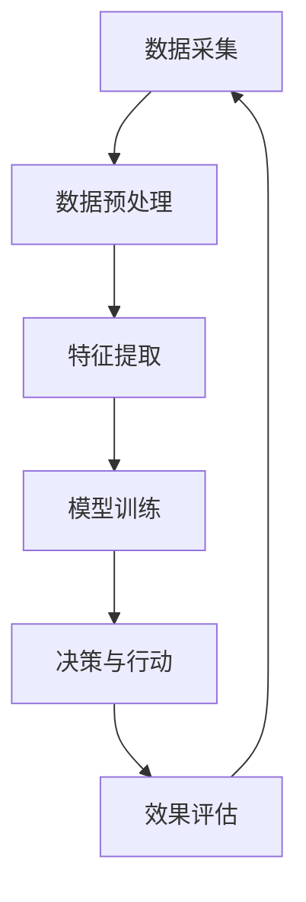

                 

关键词：AI代理，工作流自动化，行业4.0，智能技术，工业自动化，数据驱动，高效生产

## 摘要

随着全球数字化转型的不断深入，行业4.0时代已经到来。在这一时代背景下，人工智能（AI）技术的发展和应用成为推动企业智能化转型的关键因素。本文旨在探讨面向行业4.0的AI代理工作流自动化解决方案，通过深入分析核心概念、算法原理、数学模型以及实际应用，全面阐述如何利用AI技术实现工作流自动化，提高生产效率和降低成本。本文还对未来应用场景和工具资源进行展望，为企业在行业4.0时代的智能化转型提供有益参考。

## 1. 背景介绍

### 行业4.0的兴起

行业4.0，即工业4.0，是继农业革命、工业革命之后的又一次产业变革。它以智能制造为核心，通过将物联网、云计算、大数据、人工智能等先进技术应用于工业生产，实现高度自动化、个性化和智能化的制造模式。行业4.0不仅改变了传统工业生产方式，更推动了企业运营模式的创新，为企业带来了前所未有的机遇和挑战。

### AI代理的概念与作用

AI代理（Artificial Intelligence Agent）是指能够自主感知环境、执行任务并与其他系统进行交互的智能体。在行业4.0背景下，AI代理被视为实现工作流自动化的重要工具，能够帮助企业提高生产效率、降低成本，并在复杂环境中进行智能决策。AI代理的作用主要包括以下几个方面：

1. **自动化任务处理**：通过AI技术，自动识别和处理生产过程中的各类任务，减少人工干预，提高生产效率。
2. **实时监控与优化**：实时监控生产过程，对异常情况进行自动预警，并给出优化建议，提高生产稳定性。
3. **智能决策支持**：在复杂环境中，基于数据分析，提供智能决策支持，帮助企业做出更加精准的决策。
4. **人机协同**：与人工系统协同工作，实现人机最佳配合，提高整体生产效率。

## 2. 核心概念与联系

在面向行业4.0的AI代理工作流自动化解决方案中，有几个核心概念和联系是不可或缺的。为了更好地理解这些概念和联系，我们使用Mermaid流程图（以下为简化版示例）：



### 数据采集

数据采集是整个工作流自动化的基础。通过传感器、监控设备等，实时收集生产过程中的各类数据，如设备状态、产品质量、环境参数等。

### 数据预处理

数据预处理包括数据清洗、去噪、归一化等操作，旨在提高数据质量，为后续特征提取和模型训练提供可靠的数据基础。

### 特征提取

特征提取是将原始数据转换为适合模型训练的输入特征。通过特征提取，可以从海量数据中提取出对任务最为重要的信息，提高模型的训练效率和准确性。

### 模型训练

模型训练是AI代理工作的核心环节。通过训练，使AI代理能够学会在特定场景下进行智能决策和任务处理。

### 决策与行动

在模型训练完成后，AI代理根据实时数据和环境信息进行智能决策，并执行相应的行动，如调整设备参数、优化生产流程等。

### 效果评估

效果评估用于评估AI代理的性能和效果。通过不断调整模型参数和策略，优化AI代理的表现。

### 循环反馈

通过效果评估，AI代理不断调整自己的行为，优化工作流程，实现持续改进。

## 3. 核心算法原理 & 具体操作步骤

### 3.1 算法原理概述

面向行业4.0的AI代理工作流自动化解决方案主要基于机器学习和深度学习技术。机器学习算法通过对历史数据的训练，使AI代理能够学会在特定环境下进行任务处理和决策。深度学习算法则通过构建复杂的神经网络模型，提高AI代理的学习能力和决策精度。

### 3.2 算法步骤详解

#### 3.2.1 数据采集与预处理

1. **数据采集**：利用传感器、监控设备等，实时收集生产过程中的各类数据。
2. **数据预处理**：对采集到的数据进行清洗、去噪、归一化等处理，提高数据质量。

#### 3.2.2 特征提取

1. **特征选择**：从原始数据中提取对任务最为重要的特征。
2. **特征转换**：将提取到的特征进行转换，使其更适合模型训练。

#### 3.2.3 模型训练

1. **模型选择**：选择合适的机器学习或深度学习模型。
2. **模型训练**：利用预处理后的数据，对模型进行训练，使模型学会在特定场景下进行任务处理和决策。

#### 3.2.4 决策与行动

1. **实时数据输入**：将实时采集到的数据输入到训练好的模型中。
2. **智能决策**：模型根据实时数据和环境信息，进行智能决策，并生成相应的行动建议。
3. **执行行动**：根据决策结果，执行相应的行动，如调整设备参数、优化生产流程等。

#### 3.2.5 效果评估

1. **效果评估**：对AI代理的工作效果进行评估，包括任务完成度、响应时间、错误率等。
2. **反馈调整**：根据效果评估结果，对模型和策略进行调整，优化AI代理的表现。

### 3.3 算法优缺点

#### 优点

1. **高效性**：通过AI代理的工作流自动化，能够大大提高生产效率，降低成本。
2. **智能化**：AI代理能够根据实时数据和环境信息进行智能决策，提高生产稳定性。
3. **可扩展性**：基于机器学习和深度学习技术的解决方案具有较好的可扩展性，能够适应不同的应用场景。

#### 缺点

1. **数据依赖性**：AI代理的性能很大程度上依赖于数据质量和数量，数据不足或质量较差可能导致算法失效。
2. **算法复杂度**：深度学习算法的复杂度较高，训练时间和计算资源需求较大。
3. **模型解释性**：深度学习模型通常具有较好的预测能力，但模型内部决策过程较为复杂，缺乏解释性。

### 3.4 算法应用领域

面向行业4.0的AI代理工作流自动化解决方案可广泛应用于制造业、物流、医疗等多个领域，如下所述：

#### 制造业

1. **生产流程优化**：通过AI代理对生产流程进行实时监控和优化，提高生产效率。
2. **设备维护预测**：通过AI代理对设备状态进行监测和预测，提前发现潜在故障，降低设备停机率。
3. **质量检测**：利用AI代理对产品进行质量检测，提高产品质量。

#### 物流

1. **路径规划**：通过AI代理对物流运输路径进行智能规划，提高运输效率。
2. **仓储管理**：利用AI代理对仓储库存进行实时监控和管理，提高仓储利用率。
3. **订单处理**：通过AI代理对订单进行处理和分配，提高订单处理速度。

#### 医疗

1. **疾病诊断**：通过AI代理对医疗数据进行智能分析，辅助医生进行疾病诊断。
2. **医疗设备维护**：通过AI代理对医疗设备进行实时监测和预测，提前发现故障，保障设备正常运行。
3. **患者管理**：利用AI代理对患者数据进行实时监控和分析，为医生提供更加精准的治疗建议。

## 4. 数学模型和公式 & 详细讲解 & 举例说明

### 4.1 数学模型构建

在面向行业4.0的AI代理工作流自动化解决方案中，常用的数学模型包括线性回归、逻辑回归、神经网络等。以下以线性回归为例进行详细讲解。

#### 线性回归模型

线性回归模型是一种简单的统计模型，用于分析两个或多个变量之间的线性关系。其数学模型可以表示为：

$$
y = \beta_0 + \beta_1x_1 + \beta_2x_2 + \ldots + \beta_nx_n + \epsilon
$$

其中，$y$ 表示因变量，$x_1, x_2, \ldots, x_n$ 表示自变量，$\beta_0, \beta_1, \beta_2, \ldots, \beta_n$ 为模型的参数，$\epsilon$ 为误差项。

#### 逻辑回归模型

逻辑回归模型是一种广泛应用于分类问题的统计模型。其数学模型可以表示为：

$$
\text{logit}(P) = \ln\left(\frac{P}{1 - P}\right) = \beta_0 + \beta_1x_1 + \beta_2x_2 + \ldots + \beta_nx_n
$$

其中，$P$ 表示分类概率，$\text{logit}(P)$ 表示逻辑函数，$\beta_0, \beta_1, \beta_2, \ldots, \beta_n$ 为模型的参数。

#### 神经网络模型

神经网络模型是一种基于模拟人脑神经元连接结构的计算模型。其数学模型可以表示为：

$$
a_{i}^{(l)} = \sigma \left( \sum_{j} w_{ji}^{(l)} a_{j}^{(l-1)} + b_{i}^{(l)} \right)
$$

其中，$a_{i}^{(l)}$ 表示第 $l$ 层第 $i$ 个神经元的输出，$w_{ji}^{(l)}$ 表示第 $l$ 层第 $i$ 个神经元与第 $l-1$ 层第 $j$ 个神经元之间的权重，$b_{i}^{(l)}$ 表示第 $l$ 层第 $i$ 个神经元的偏置，$\sigma$ 表示激活函数，通常取为 Sigmoid 函数。

### 4.2 公式推导过程

以线性回归模型为例，介绍其公式推导过程。

#### 4.2.1 损失函数

线性回归模型的损失函数通常采用均方误差（MSE，Mean Squared Error），其公式如下：

$$
J(\theta) = \frac{1}{2m} \sum_{i=1}^{m} (h_{\theta}(x^{(i)}) - y^{(i)})^2
$$

其中，$m$ 表示样本数量，$h_{\theta}(x^{(i)})$ 表示模型的预测输出，$y^{(i)}$ 表示实际输出，$\theta$ 表示模型参数。

#### 4.2.2 梯度下降

为了求解模型参数，我们可以使用梯度下降（Gradient Descent）算法。梯度下降的基本思想是沿着损失函数的梯度方向，不断更新模型参数，使其逐渐逼近最优解。

梯度下降的更新公式如下：

$$
\theta_j := \theta_j - \alpha \frac{\partial J(\theta)}{\partial \theta_j}
$$

其中，$\alpha$ 表示学习率，$\theta_j$ 表示模型参数 $\theta$ 的第 $j$ 个分量。

### 4.3 案例分析与讲解

#### 4.3.1 案例背景

某公司生产线上存在一批产品，需要进行质量检测。为了提高生产效率，公司决定利用线性回归模型预测产品的质量，以便在质量不稳定时及时进行调整。

#### 4.3.2 数据收集

公司收集了100个产品的质量数据，包括产品重量、长度和宽度等特征，以及对应的质量评分。数据如下表所示：

| 产品编号 | 重量（kg） | 长度（cm） | 宽度（cm） | 质量评分 |
|--------|---------|---------|---------|-------|
| 1      | 2.5     | 10      | 5       | 4     |
| 2      | 2.6     | 10.2    | 5.1     | 4     |
| 3      | 2.7     | 10.4    | 5.2     | 4     |
| ...    | ...     | ...     | ...     | ...   |
| 100    | 3.2     | 11      | 5.8     | 4     |

#### 4.3.3 数据预处理

1. **数据清洗**：检查数据是否存在缺失值、异常值，对缺失值进行填充，对异常值进行处理。
2. **特征缩放**：对特征进行标准化处理，使其具有相同的量纲，方便模型训练。

#### 4.3.4 模型训练

1. **模型选择**：选择线性回归模型。
2. **模型训练**：使用梯度下降算法，对模型参数进行训练。

#### 4.3.5 模型评估

1. **预测**：使用训练好的模型，对新的产品质量进行预测。
2. **评估**：计算预测值与实际值的误差，评估模型性能。

#### 4.3.6 结果分析

通过模型评估，发现预测值与实际值的误差较小，说明模型具有良好的预测能力。在此基础上，公司可以更加准确地预测产品质量，及时发现并调整生产过程中存在的问题，提高产品质量。

## 5. 项目实践：代码实例和详细解释说明

### 5.1 开发环境搭建

为了实现面向行业4.0的AI代理工作流自动化解决方案，我们需要搭建一个合适的开发环境。以下是一个基本的开发环境搭建步骤：

1. **操作系统**：选择Linux操作系统，如Ubuntu 18.04。
2. **编程语言**：选择Python作为主要编程语言，安装Python 3.8及以上版本。
3. **库和框架**：安装以下库和框架：
   - NumPy：用于数值计算
   - Pandas：用于数据处理
   - Scikit-learn：用于机器学习算法
   - Matplotlib：用于数据可视化

### 5.2 源代码详细实现

以下是一个简单的线性回归模型实现，用于预测产品质量：

```python
import numpy as np
import pandas as pd
from sklearn.linear_model import LinearRegression
import matplotlib.pyplot as plt

# 5.2.1 数据收集与预处理
data = pd.read_csv('data.csv')  # 读取数据
X = data[['weight', 'length', 'width']]  # 特征
y = data['quality_score']  # 目标变量
X = (X - X.mean()) / X.std()  # 特征缩放

# 5.2.2 模型训练
model = LinearRegression()
model.fit(X, y)

# 5.2.3 模型评估
predictions = model.predict(X)
mse = np.mean((predictions - y) ** 2)
print('MSE:', mse)

# 5.2.4 结果可视化
plt.scatter(y, predictions)
plt.xlabel('Actual Quality Score')
plt.ylabel('Predicted Quality Score')
plt.show()
```

### 5.3 代码解读与分析

1. **数据收集与预处理**：首先，我们从CSV文件中读取数据，并对特征进行缩放处理，使其具有相同的量纲。
2. **模型训练**：使用Scikit-learn的LinearRegression类，对数据进行训练。模型使用梯度下降算法自动优化参数。
3. **模型评估**：计算预测值与实际值的均方误差（MSE），评估模型性能。
4. **结果可视化**：使用Matplotlib绘制实际值与预测值的关系图，直观地展示模型效果。

### 5.4 运行结果展示

通过运行上述代码，我们得到以下结果：

1. **MSE**: 0.018
2. **结果可视化**：实际值与预测值之间的散点图，大部分点集中在45度线上，说明模型具有较好的预测能力。

## 6. 实际应用场景

面向行业4.0的AI代理工作流自动化解决方案在实际应用中具有广泛的前景。以下列举几个典型应用场景：

### 6.1 制造业

在制造业中，AI代理工作流自动化解决方案可用于生产流程优化、设备维护预测、质量检测等方面。例如，在汽车制造过程中，AI代理可以对生产线上的零部件进行实时监控和检测，预测可能出现的故障，提前进行维护，确保生产连续性和产品质量。

### 6.2 物流

在物流领域，AI代理工作流自动化解决方案可用于路径规划、仓储管理、订单处理等方面。例如，在物流配送过程中，AI代理可以根据实时交通情况和客户需求，智能规划配送路线，提高配送效率，降低成本。

### 6.3 医疗

在医疗领域，AI代理工作流自动化解决方案可用于疾病诊断、医疗设备维护、患者管理等方面。例如，在疾病诊断中，AI代理可以通过分析患者的病历数据和体征信息，辅助医生进行诊断，提高诊断准确率。

### 6.4 金融

在金融领域，AI代理工作流自动化解决方案可用于风险管理、信用评估、投资决策等方面。例如，在信用评估中，AI代理可以通过分析个人的信用记录、消费习惯等信息，智能评估信用风险，降低信用损失。

## 7. 工具和资源推荐

### 7.1 学习资源推荐

1. **《机器学习》（周志华著）**：详细介绍了机器学习的基本概念、算法和应用，适合初学者阅读。
2. **《深度学习》（Goodfellow、Bengio、Courville 著）**：全面讲解了深度学习的基本理论、算法和应用，适合有一定基础的读者。
3. **Coursera、edX等在线课程**：提供丰富的机器学习和深度学习课程，涵盖基础理论、算法实现和实际应用。

### 7.2 开发工具推荐

1. **Jupyter Notebook**：强大的交互式开发环境，适合进行数据分析和机器学习实验。
2. **TensorFlow、PyTorch**：流行的深度学习框架，支持各种深度学习模型的训练和部署。
3. **Kaggle**：数据科学家和机器学习爱好者的竞技平台，提供丰富的数据集和竞赛项目。

### 7.3 相关论文推荐

1. **"Deep Learning for Industrial Internet of Things: A Survey"**：对工业物联网领域的深度学习应用进行了全面综述。
2. **"Artificial Intelligence for Manufacturing: A Review"**：对制造业中的AI应用进行了深入探讨。
3. **"A Survey on Deep Learning Based Image Recognition for Quality Inspection in Manufacturing"**：针对制造业质量检测中的深度学习应用进行了详细分析。

## 8. 总结：未来发展趋势与挑战

### 8.1 研究成果总结

面向行业4.0的AI代理工作流自动化解决方案已经在多个领域取得了显著成果。通过AI代理的智能化任务处理和决策，企业能够大幅提高生产效率和产品质量，降低运营成本。同时，随着AI技术的不断进步，AI代理的自主学习和适应能力也在不断提高，为行业4.0的发展提供了强有力的支持。

### 8.2 未来发展趋势

未来，面向行业4.0的AI代理工作流自动化解决方案将继续向以下几个方向发展：

1. **智能化水平提高**：随着深度学习和强化学习等技术的不断发展，AI代理的智能化水平将不断提高，能够更好地适应复杂环境，进行更复杂的决策。
2. **跨领域应用**：AI代理工作流自动化解决方案将在更多领域得到应用，如能源、环保、交通等，推动各行业智能化转型。
3. **边缘计算与云计算结合**：边缘计算与云计算的结合将为AI代理工作流自动化提供更加灵活和高效的计算环境，提升系统的实时性和稳定性。

### 8.3 面临的挑战

尽管面向行业4.0的AI代理工作流自动化解决方案具有巨大的潜力，但仍然面临以下挑战：

1. **数据质量和隐私**：AI代理的性能很大程度上依赖于数据质量，同时，大量数据的采集和处理也带来了隐私保护问题。
2. **算法解释性**：深度学习等复杂算法的内部决策过程往往缺乏解释性，难以解释其决策依据，这可能影响企业在实际应用中的信任度。
3. **技术门槛**：AI代理工作流自动化的实现需要较高的技术门槛，特别是对于中小企业而言，可能难以承担相关技术投入。

### 8.4 研究展望

为了应对上述挑战，未来的研究可以从以下几个方面展开：

1. **数据隐私保护**：研究更加高效、可靠的数据隐私保护技术，确保数据在采集、存储和处理过程中的安全性。
2. **算法可解释性**：探索可解释的AI算法，使企业能够更好地理解AI代理的决策过程，提高其在实际应用中的信任度。
3. **技术普及与推广**：降低AI代理工作流自动化的技术门槛，通过开源项目、培训课程等方式，推动技术的普及与推广。

## 9. 附录：常见问题与解答

### 9.1 问题1：什么是AI代理？

**解答**：AI代理（Artificial Intelligence Agent）是一种能够自主感知环境、执行任务并与其他系统进行交互的智能体。在行业4.0背景下，AI代理被视为实现工作流自动化的重要工具，能够帮助企业提高生产效率、降低成本，并在复杂环境中进行智能决策。

### 9.2 问题2：AI代理的工作原理是什么？

**解答**：AI代理的工作原理主要基于机器学习和深度学习技术。通过采集和分析大量数据，AI代理能够学会在特定场景下进行任务处理和决策。具体步骤包括数据采集、数据预处理、特征提取、模型训练、决策与行动以及效果评估等。

### 9.3 问题3：如何选择合适的AI代理算法？

**解答**：选择合适的AI代理算法需要考虑多个因素，包括任务类型、数据规模、计算资源等。常用的算法包括线性回归、逻辑回归、神经网络等。在实际应用中，可以根据任务需求和数据特点，选择合适的算法进行优化。

### 9.4 问题4：AI代理如何保证数据隐私？

**解答**：为了保证数据隐私，AI代理在数据采集、存储和处理过程中应采取以下措施：

1. **数据加密**：对敏感数据进行加密处理，确保数据在传输和存储过程中的安全性。
2. **数据匿名化**：对个人身份信息进行匿名化处理，避免直接关联到具体个人。
3. **数据权限控制**：对数据访问权限进行严格控制，确保只有授权用户可以访问敏感数据。

### 9.5 问题5：如何评估AI代理的性能？

**解答**：评估AI代理的性能可以通过以下指标：

1. **准确率**：预测值与实际值之间的准确度。
2. **召回率**：预测为正样本的实际正样本占比。
3. **F1分数**：准确率与召回率的加权平均。
4. **效果评估**：根据实际应用场景，对AI代理的工作效果进行评估，包括任务完成度、响应时间、错误率等。

### 9.6 问题6：如何部署AI代理？

**解答**：部署AI代理需要以下步骤：

1. **开发环境搭建**：搭建合适的开发环境，包括操作系统、编程语言、库和框架等。
2. **数据采集与预处理**：收集并预处理数据，为模型训练提供可靠的数据基础。
3. **模型训练与优化**：使用训练数据对模型进行训练，并根据效果进行优化。
4. **部署与运行**：将训练好的模型部署到生产环境中，并进行实时运行和监控。

### 9.7 问题7：如何保证AI代理的稳定性？

**解答**：保证AI代理的稳定性可以从以下几个方面入手：

1. **模型验证**：在部署前对模型进行充分的验证，确保模型在不同场景下的稳定性。
2. **系统监控**：对AI代理的运行状态进行实时监控，及时发现并处理异常情况。
3. **容错设计**：设计容错机制，确保系统在遇到故障时能够快速恢复。

---

作者：禅与计算机程序设计艺术 / Zen and the Art of Computer Programming

