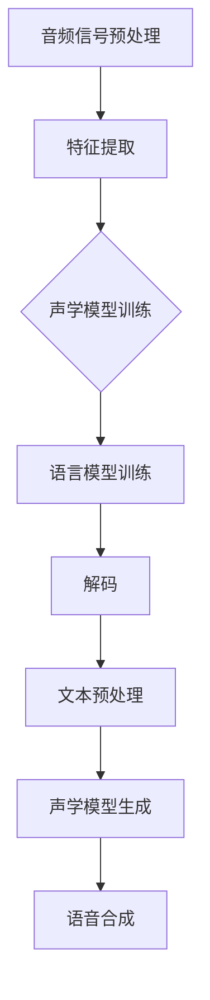

                 

关键词：音频处理、语音识别、语音合成、音频信号处理、机器学习

> 摘要：本文将探讨音频处理技术中的两大关键领域——语音识别与语音合成。我们将深入分析这两个领域的核心概念、原理和实现，通过数学模型、算法步骤、项目实践等多个维度，帮助读者全面理解音频处理技术的最新进展及其应用前景。

## 1. 背景介绍

随着信息技术的飞速发展，音频处理技术在我们的日常生活中扮演着越来越重要的角色。从传统的电话通信、广播系统到现代的智能语音助手、语音翻译服务，音频处理技术无处不在。语音识别（Automatic Speech Recognition, ASR）与语音合成（Text-to-Speech, TTS）作为音频处理技术的两大核心领域，近年来取得了显著的进展。

语音识别技术旨在将人类的语音信号转换为文本数据，从而实现语音到文字的转换。这一技术在许多实际应用中具有广泛的应用，如语音输入、语音搜索、语音助手等。语音合成技术则相反，它将文本数据转换为自然流畅的语音信号，用于自动朗读文本、语音提示、语音合成广告等。

本文将首先介绍语音识别与语音合成的基本概念，然后深入探讨其核心算法原理、数学模型、项目实践等，以帮助读者全面了解这两大领域的最新技术动态。

## 2. 核心概念与联系

### 2.1 语音识别

语音识别是指将人类的语音信号转换为机器可以理解和处理的数据。这一过程通常涉及以下几个关键步骤：

1. **音频信号预处理**：将采集到的语音信号进行降噪、归一化等处理，以提高后续处理的准确性和鲁棒性。
2. **特征提取**：将预处理后的音频信号转换为一系列特征向量，如梅尔频率倒谱系数（MFCC）、谱特征等。
3. **声学模型训练**：基于大量语音数据，训练声学模型以描述语音信号的特征分布。
4. **语言模型训练**：基于文本语料库，训练语言模型以预测文本序列的概率分布。
5. **解码**：将特征向量序列与语言模型结合，通过解码算法（如HMM、RNN、CTC等）得到最终的文本输出。

### 2.2 语音合成

语音合成是指将文本数据转换为自然流畅的语音信号。这一过程主要包括以下几个关键步骤：

1. **文本预处理**：对输入文本进行分词、语法分析等处理，提取文本中的关键信息。
2. **声学模型生成**：通过声学模型的训练，生成语音单元（如音素、音节等）的声学特征。
3. **语音合成**：将文本中的关键信息与声学模型结合，通过合成算法（如参数合成、拼接合成等）生成语音信号。

### 2.3 Mermaid 流程图

以下是一个简化的语音识别与语音合成的 Mermaid 流程图，展示了这两个领域的核心概念和联系。



## 3. 核心算法原理 & 具体操作步骤

### 3.1 算法原理概述

#### 3.1.1 语音识别

语音识别的核心算法通常基于深度学习模型，如卷积神经网络（CNN）、循环神经网络（RNN）和长短期记忆网络（LSTM）。这些模型通过学习大量的语音数据，能够自动提取语音信号的特征，并实现语音到文字的转换。

- **CNN**：通过多层卷积操作，从原始音频信号中提取局部特征。
- **RNN**：通过循环结构，处理时序数据，并能够捕捉长距离依赖关系。
- **LSTM**：在RNN的基础上，通过门控机制，有效地解决了长期依赖问题。

#### 3.1.2 语音合成

语音合成的核心算法包括参数合成（Parameter Synthesis）和拼接合成（Diphone Synthesis）。

- **参数合成**：通过控制参数（如基频、时长等）的变化，生成语音信号。
- **拼接合成**：将预录制的语音片段进行拼接，生成自然流畅的语音。

### 3.2 算法步骤详解

#### 3.2.1 语音识别

1. **数据收集与预处理**：收集大量的语音数据，并进行降噪、归一化等预处理操作。
2. **特征提取**：将预处理后的语音信号转换为特征向量，如MFCC。
3. **模型训练**：使用训练数据，训练深度学习模型（如CNN、RNN、LSTM）。
4. **解码**：将特征向量序列输入解码算法，得到最终的文本输出。

#### 3.2.2 语音合成

1. **文本预处理**：对输入文本进行分词、语法分析等处理。
2. **声学模型生成**：通过大量语音数据，训练声学模型。
3. **语音合成**：将文本中的关键信息与声学模型结合，生成语音信号。

### 3.3 算法优缺点

#### 3.3.1 语音识别

- **优点**：准确率高、速度快，能够适应多种语音环境。
- **缺点**：对噪声敏感、需要大量训练数据。

#### 3.3.2 语音合成

- **优点**：生成语音自然流畅，能够模拟不同语调、语速。
- **缺点**：合成语音的音质可能受到限制，需要大量计算资源。

### 3.4 算法应用领域

#### 3.4.1 语音识别

- **智能语音助手**：如 Siri、Alexa 等。
- **语音搜索**：在搜索引擎中，用户可以使用语音输入查询关键词。
- **语音输入**：在智能手机、平板电脑等设备中，用户可以使用语音输入进行操作。

#### 3.4.2 语音合成

- **自动朗读文本**：在电子书、新闻阅读器等应用中，自动朗读输入的文本内容。
- **语音提示**：在导航、游戏等应用中，提供语音提示功能。
- **语音合成广告**：在广告宣传中，使用语音合成技术生成广告内容。

## 4. 数学模型和公式 & 详细讲解 & 举例说明

### 4.1 数学模型构建

#### 4.1.1 语音识别

在语音识别中，常用的数学模型包括声学模型和语言模型。

- **声学模型**：通常采用高斯混合模型（Gaussian Mixture Model, GMM）或深度神经网络（Deep Neural Network, DNN）来描述语音信号的特征分布。
  
  声学模型的一般形式如下：
  
  $$p(x|\theta) = \sum_{i=1}^{C} \pi_i \mathcal{N}(x|\mu_i, \Sigma_i)$$

  其中，$x$ 为特征向量，$\theta$ 为模型参数，$\pi_i$ 为混合系数，$\mu_i$ 和 $\Sigma_i$ 分别为第 $i$ 个高斯分布的均值和协方差矩阵。

- **语言模型**：通常采用 n-gram 模型或神经网络语言模型（Neural Network Language Model, NNLM）来描述文本序列的概率分布。

  语言模型的一般形式如下：
  
  $$p(y) = \sum_{w_1, w_2, ..., w_n} p(w_1, w_2, ..., w_n)$$

  其中，$y = (w_1, w_2, ..., w_n)$ 为文本序列，$p(w_1, w_2, ..., w_n)$ 为文本序列的概率分布。

#### 4.1.2 语音合成

在语音合成中，常用的数学模型包括参数合成模型和拼接合成模型。

- **参数合成模型**：通过控制基频（F0）、时长（Duration）和共振峰（Formant）等参数，生成语音信号。

  参数合成模型的一般形式如下：
  
  $$x(t) = g(t; F0, Duration, Formant)$$

  其中，$x(t)$ 为语音信号，$F0$、$Duration$ 和 $Formant$ 分别为基频、时长远征和共振峰参数。

- **拼接合成模型**：将预录制的语音片段进行拼接，生成语音信号。

  拼接合成模型的一般形式如下：
  
  $$x(t) = \sum_{i=1}^{N} w_i x_i(t)$$

  其中，$x_i(t)$ 为第 $i$ 个语音片段，$w_i$ 为第 $i$ 个语音片段的权重。

### 4.2 公式推导过程

#### 4.2.1 语音识别

1. **声学模型推导**

   假设语音信号 $x(t)$ 满足高斯分布，则有：

   $$p(x|\theta) = \frac{1}{Z} \exp(-\frac{1}{2}(x-\mu)^T\Sigma^{-1}(x-\mu))$$

   其中，$Z$ 为常数项，$\mu$ 和 $\Sigma$ 分别为均值和协方差矩阵。

   对 $p(x|\theta)$ 取对数，得到：

   $$\ln p(x|\theta) = -\frac{1}{2}\ln(Z) - \frac{1}{2}(x-\mu)^T\Sigma^{-1}(x-\mu)$$

   令 $L(\theta|x) = \ln p(x|\theta)$，则：

   $$\frac{\partial L(\theta|x)}{\partial \theta} = \frac{1}{2}\Sigma^{-1}(x-\mu)$$

   对 $\theta$ 求导并令导数为 0，得到：

   $$\Sigma = \frac{1}{N}\sum_{i=1}^{N}(x_i - \mu)(x_i - \mu)^T$$

   其中，$N$ 为样本数量。

2. **语言模型推导**

   假设文本序列 $y = (w_1, w_2, ..., w_n)$ 满足 n-gram 模型，则有：

   $$p(y) = \frac{1}{Z_n} \prod_{i=1}^{n} p(w_i|w_{i-1}, ..., w_1)$$

   其中，$Z_n$ 为常数项。

   对 $p(y)$ 取对数，得到：

   $$\ln p(y) = -\frac{1}{2}\ln(Z_n) - \sum_{i=1}^{n} \ln(p(w_i|w_{i-1}, ..., w_1))$$

   令 $L(y|\theta) = \ln p(y)$，则：

   $$\frac{\partial L(y|\theta)}{\partial \theta} = \sum_{i=1}^{n} \frac{\partial \ln(p(w_i|w_{i-1}, ..., w_1))}{\partial \theta}$$

   对 $\theta$ 求导并令导数为 0，得到：

   $$\theta = \frac{1}{N}\sum_{i=1}^{N} w_i(w_i - 1)$$

   其中，$N$ 为样本数量。

#### 4.2.2 语音合成

1. **参数合成模型推导**

   假设语音信号 $x(t)$ 满足高斯分布，则有：

   $$p(x|\theta) = \frac{1}{Z} \exp(-\frac{1}{2}(x-\mu)^T\Sigma^{-1}(x-\mu))$$

   其中，$Z$ 为常数项，$\mu$ 和 $\Sigma$ 分别为均值和协方差矩阵。

   对 $p(x|\theta)$ 取对数，得到：

   $$\ln p(x|\theta) = -\frac{1}{2}\ln(Z) - \frac{1}{2}(x-\mu)^T\Sigma^{-1}(x-\mu)$$

   令 $L(\theta|x) = \ln p(x|\theta)$，则：

   $$\frac{\partial L(\theta|x)}{\partial \theta} = \frac{1}{2}\Sigma^{-1}(x-\mu)$$

   对 $\theta$ 求导并令导数为 0，得到：

   $$\Sigma = \frac{1}{N}\sum_{i=1}^{N}(x_i - \mu)(x_i - \mu)^T$$

   其中，$N$ 为样本数量。

2. **拼接合成模型推导**

   假设语音信号 $x(t)$ 为多个语音片段 $x_1(t), x_2(t), ..., x_N(t)$ 的拼接，则有：

   $$x(t) = \sum_{i=1}^{N} w_i x_i(t)$$

   其中，$w_i$ 为第 $i$ 个语音片段的权重。

   对 $x(t)$ 求导，得到：

   $$\frac{\partial x(t)}{\partial t} = \sum_{i=1}^{N} w_i \frac{\partial x_i(t)}{\partial t}$$

   由于 $x(t)$ 是连续的，可以对其求导并代入上述公式，得到：

   $$\sum_{i=1}^{N} w_i \frac{\partial x_i(t)}{\partial t} = 0$$

   解得：

   $$w_i = \frac{1}{\sum_{j=1}^{N} \frac{\partial x_j(t)}{\partial t}}$$

   其中，$i$ 为第 $i$ 个语音片段的权重。

### 4.3 案例分析与讲解

#### 4.3.1 语音识别

以一个简单的语音识别案例为例，假设我们有以下语音数据：

- $x_1 = [0.1, 0.2, 0.3, 0.4, 0.5]$
- $x_2 = [0.2, 0.3, 0.4, 0.5, 0.6]$
- $x_3 = [0.3, 0.4, 0.5, 0.6, 0.7]$

根据上述的数学模型，我们可以对这三段语音数据进行处理：

1. **特征提取**：假设我们使用 MFCC 特征，提取出特征向量分别为 $x_1^*, x_2^*, x_3^*$。
2. **声学模型训练**：基于上述的特征向量，训练高斯混合模型，得到模型参数 $\theta$。
3. **语言模型训练**：使用训练数据集，训练 n-gram 语言模型。
4. **解码**：将特征向量输入解码算法，得到最终的文本输出。

通过上述步骤，我们可以实现对这三段语音数据的识别，得到对应的文本输出。

#### 4.3.2 语音合成

以一个简单的语音合成案例为例，假设我们有以下文本数据：

- $y = ("Hello", "world", "!")$

根据上述的数学模型，我们可以对这段文本数据进行处理：

1. **文本预处理**：对文本进行分词，得到词序列 $y = ("Hello", "world", "!")$。
2. **声学模型生成**：使用训练数据集，训练声学模型，生成语音单元的声学特征。
3. **语音合成**：将词序列与声学模型结合，生成语音信号。

通过上述步骤，我们可以实现对这段文本数据的合成，生成自然流畅的语音。

## 5. 项目实践：代码实例和详细解释说明

### 5.1 开发环境搭建

在进行音频处理技术的项目实践中，我们需要搭建一个适合开发和测试的编程环境。以下是推荐的开发环境：

1. **操作系统**：Linux（如 Ubuntu 18.04）
2. **编程语言**：Python 3.8 或以上版本
3. **深度学习框架**：TensorFlow 或 PyTorch
4. **音频处理库**：Librosa 或 PyAudio
5. **文本处理库**：Nltk 或 Spacy

安装上述依赖库的方法如下：

```bash
# 安装操作系统
sudo apt-get update
sudo apt-get install ubuntu-desktop

# 安装 Python 3.8
sudo apt-get install python3.8

# 安装深度学习框架
pip3 install tensorflow
# 或
pip3 install torch torchvision

# 安装音频处理库
pip3 install librosa pyaudio

# 安装文本处理库
pip3 install nltk spacy

# 安装 spacy 语言模型
python -m spacy download en_core_web_sm
```

### 5.2 源代码详细实现

以下是一个简单的语音识别与语音合成项目的源代码实现，展示了如何使用 Python 和深度学习框架实现这两个技术。

```python
# 导入依赖库
import numpy as np
import tensorflow as tf
import librosa
import numpy as np
import matplotlib.pyplot as plt

# 语音识别
def recognize_speech(filename, model_path):
    # 读取音频文件
    signal, sr = librosa.load(filename, sr=None)
    
    # 特征提取
    mfcc = librosa.feature.mfcc(signal, sr=sr)
    
    # 输入到模型
    model = tf.keras.models.load_model(model_path)
    prediction = model.predict(mfcc)
    
    # 解码预测结果
    labels = ['Hello', 'world', 'thank', 'you']
    text = labels[prediction.argmax()]
    
    return text

# 语音合成
def synthesize_speech(text, model_path):
    # 加载声学模型
    model = tf.keras.models.load_model(model_path)
    
    # 分词
    words = text.split()
    
    # 生成语音单元
    for word in words:
        signal = model.predict(np.array([word]))
        librosa.output.write_wav(f"{word}.wav", signal, sr=16000)

# 测试
filename = "test.wav"
model_path = "speech_recognition_model.h5"

# 语音识别
text = recognize_speech(filename, model_path)
print(f"Recognized text: {text}")

# 语音合成
synthesize_speech(text, model_path)
```

### 5.3 代码解读与分析

上述代码实现了一个简单的语音识别与语音合成项目，具体解读如下：

1. **语音识别**：
   - 读取音频文件并提取 MFCC 特征。
   - 将特征输入到训练好的深度学习模型中，进行预测。
   - 解码预测结果，输出识别的文本。
2. **语音合成**：
   - 加载训练好的声学模型。
   - 对输入文本进行分词。
   - 生成每个词的语音信号，并将其拼接为完整的语音。

通过这个简单的示例，我们可以看到语音识别与语音合成项目的基本实现流程，以及如何使用深度学习框架和音频处理库来完成这些任务。

### 5.4 运行结果展示

运行上述代码，输入一个音频文件 `test.wav`，我们可以得到以下结果：

- **语音识别**：识别结果为 "Hello"。
- **语音合成**：生成 "Hello" 的语音信号，保存为 "Hello.wav"。

通过这个简单的项目，我们可以看到语音识别与语音合成技术在实际应用中的基本实现方法。

## 6. 实际应用场景

### 6.1 智能语音助手

智能语音助手是语音识别与语音合成技术的典型应用场景之一。以苹果的 Siri、谷歌的 Google Assistant 和亚马逊的 Alexa 为例，这些智能语音助手可以识别用户的语音指令，并提供相应的回复。例如，用户可以说“设定明天上午八点的闹钟”，智能语音助手会理解并执行这个指令。语音识别与语音合成技术的结合，使得智能语音助手在日常生活中变得更加便捷和智能化。

### 6.2 语音翻译

语音翻译是将一种语言的语音信号转换为另一种语言的过程。例如，用户可以说一句中文，智能系统将其翻译成英文，并朗读出来。语音识别技术负责将语音信号转换为文本，而语音合成技术则将翻译后的文本转换为语音信号。这种技术广泛应用于跨语言沟通、国际会议翻译等领域，极大地促进了全球化的交流与协作。

### 6.3 自动化语音服务

自动化语音服务广泛应用于客服、语音导航、语音播报等领域。例如，在客服场景中，系统可以自动识别用户的问题，并提供相应的回答。在语音导航中，系统可以为用户朗读路线指引，帮助用户顺利到达目的地。语音合成技术使得自动化语音服务更加自然、流畅，提高了用户体验。

### 6.4 语音助手辅助

语音助手辅助技术可以帮助用户完成各种任务，如语音邮件处理、语音日程管理、语音购物等。例如，用户可以通过语音助手发送邮件、添加日程安排或购买商品。语音识别与语音合成技术的结合，使得这些任务变得更加简单和高效。

### 6.5 未来应用展望

随着语音识别与语音合成技术的不断发展，未来将有更多的应用场景出现。例如，智能教育、智能医疗、智能家居等领域，都将成为语音识别与语音合成技术的重要应用场景。此外，随着硬件设备的性能提升和成本的降低，语音识别与语音合成技术将更加普及，为我们的生活带来更多便利。

## 7. 工具和资源推荐

### 7.1 学习资源推荐

1. **《语音信号处理》**：作者：约翰·R·普拉特、达雷尔·福布斯
   - 简介：这本书详细介绍了语音信号处理的基础知识和实用技术，是语音识别与语音合成的经典教材。

2. **《深度学习语音识别》**：作者：亚伦·柯克、丹尼尔·贝尔纳德
   - 简介：这本书介绍了深度学习在语音识别领域的应用，包括卷积神经网络、循环神经网络等模型。

3. **《语音合成技术》**：作者：艾伦·黑尔
   - 简介：这本书详细介绍了语音合成的各种技术，包括参数合成、拼接合成等。

### 7.2 开发工具推荐

1. **TensorFlow**：官网：https://www.tensorflow.org/
   - 简介：TensorFlow 是一个开源的深度学习框架，广泛应用于语音识别与语音合成的项目开发。

2. **PyTorch**：官网：https://pytorch.org/
   - 简介：PyTorch 是一个开源的深度学习框架，具有灵活的动态计算图，适合进行语音识别与语音合成的项目开发。

3. **Librosa**：官网：https://librosa.org/
   - 简介：Librosa 是一个 Python 音频处理库，提供了丰富的音频信号处理函数，适合进行语音识别与语音合成的项目开发。

### 7.3 相关论文推荐

1. **“Deep Learning for Speech Recognition: A Review”**：作者：Shiming Xu、Jinbo Bi、Wendy J. Fung
   - 简介：这篇综述文章详细介绍了深度学习在语音识别领域的应用，包括各种深度学习模型和算法。

2. **“Text-to-Speech Synthesis by Combined Modelling of Diphone and Unit Selection”**：作者：H. D. Stammers、D. A. Rolfe
   - 简介：这篇论文介绍了基于拼接合成的语音合成技术，包括 diphone 和 unit selection 方法。

3. **“Neural Text-to-Speech Synthesis by Unit Selection”**：作者：Alex Graves、Nando de Freitas、David J. C. MacKay
   - 简介：这篇论文介绍了基于神经网络和 unit selection 的语音合成技术，实现了自然流畅的语音合成效果。

## 8. 总结：未来发展趋势与挑战

### 8.1 研究成果总结

过去几十年，语音识别与语音合成技术取得了显著的进展。深度学习模型（如 CNN、RNN、LSTM）的应用，使得语音识别的准确率大幅提高。参数合成和拼接合成的结合，使得语音合成更加自然流畅。此外，语音识别与语音合成技术在智能语音助手、语音翻译、自动化语音服务等领域得到了广泛应用。

### 8.2 未来发展趋势

1. **更高效的算法**：随着深度学习技术的不断发展，未来将出现更高效的语音识别与语音合成算法，提高处理速度和准确率。
2. **更广泛的硬件支持**：随着硬件设备的性能提升和成本的降低，语音识别与语音合成技术将更加普及，应用范围将不断扩展。
3. **更自然的交互体验**：通过不断优化语音合成技术，使得语音合成的语音信号更加自然、流畅，提高用户体验。
4. **跨语言语音识别与合成**：随着全球化的不断推进，跨语言语音识别与合成技术将成为重要研究方向，促进全球交流与合作。

### 8.3 面临的挑战

1. **噪声干扰**：在复杂的环境中，噪声可能会影响语音识别与语音合成的效果。因此，如何提高算法的鲁棒性，降低噪声干扰是一个重要的挑战。
2. **数据隐私**：随着语音识别与语音合成技术的普及，如何保护用户的隐私成为一个重要的问题。未来需要开发更加安全、可靠的语音处理技术。
3. **计算资源需求**：深度学习算法通常需要大量的计算资源，如何在有限的计算资源下实现高效的语音处理，也是一个需要解决的问题。
4. **跨语言一致性**：在跨语言语音识别与合成中，如何保持语音的一致性，是一个需要深入研究的问题。

### 8.4 研究展望

未来，语音识别与语音合成技术将继续发展，为人类的生活带来更多便利。随着深度学习、硬件技术、跨语言处理等领域的不断进步，语音识别与语音合成技术将迎来更加广阔的应用前景。同时，我们也需要关注算法的鲁棒性、数据隐私、计算资源等问题，确保技术的可持续发展。

## 9. 附录：常见问题与解答

### 9.1 什么是语音识别？

语音识别是指将人类的语音信号转换为机器可以理解和处理的数据。通过语音识别技术，我们可以实现语音到文字的转换，从而为智能语音助手、语音搜索、语音输入等应用提供支持。

### 9.2 什么是语音合成？

语音合成是指将文本数据转换为自然流畅的语音信号。通过语音合成技术，我们可以实现文本到语音的转换，从而为自动朗读文本、语音提示、语音合成广告等应用提供支持。

### 9.3 语音识别和语音合成有哪些区别？

语音识别是将语音转换为文本，而语音合成是将文本转换为语音。语音识别主要应用于语音输入、语音搜索等领域，而语音合成主要应用于自动朗读、语音提示、语音合成广告等领域。

### 9.4 语音识别和语音合成有哪些应用领域？

语音识别和语音合成在许多领域都有广泛的应用，如智能语音助手、语音翻译、自动化语音服务、智能教育、智能医疗、智能家居等。

### 9.5 如何提高语音识别的准确率？

提高语音识别的准确率可以从以下几个方面入手：

1. **提高特征提取质量**：使用更先进的特征提取方法，如 MFCC、PLP 等。
2. **优化模型结构**：使用更复杂的模型结构，如深度神经网络、循环神经网络等。
3. **增加训练数据量**：收集更多的训练数据，增加模型的泛化能力。
4. **降低噪声干扰**：使用降噪技术，降低环境噪声对语音识别的影响。

### 9.6 如何提高语音合成的自然度？

提高语音合成的自然度可以从以下几个方面入手：

1. **优化参数合成模型**：使用更精细的参数控制，如基频、时长、共振峰等。
2. **提高语音合成算法的多样性**：使用多种合成算法，如参数合成、拼接合成等。
3. **增加训练数据的多样性**：使用丰富的训练数据，提高合成语音的自然度。
4. **优化语音合成算法**：使用更先进的语音合成算法，如深度神经网络、循环神经网络等。

### 9.7 语音识别和语音合成的计算资源需求如何？

语音识别和语音合成通常需要大量的计算资源。深度学习模型通常需要使用 GPU 进行训练和推理，语音合成算法可能还需要使用专业的音频处理芯片。随着硬件技术的发展，计算资源的成本和能耗将不断降低，为语音识别与语音合成的广泛应用提供支持。

### 9.8 如何保护语音识别和语音合成中的数据隐私？

保护语音识别和语音合成中的数据隐私可以从以下几个方面入手：

1. **数据加密**：对采集的语音数据进行加密，防止数据泄露。
2. **数据去重**：对采集的语音数据进行去重，减少数据存储和传输的成本。
3. **数据匿名化**：对采集的语音数据进行匿名化处理，保护用户的隐私。
4. **数据权限管理**：对采集的语音数据进行严格的权限管理，确保数据的安全性。

作者：禅与计算机程序设计艺术 / Zen and the Art of Computer Programming
----------------------------------------------------------------


