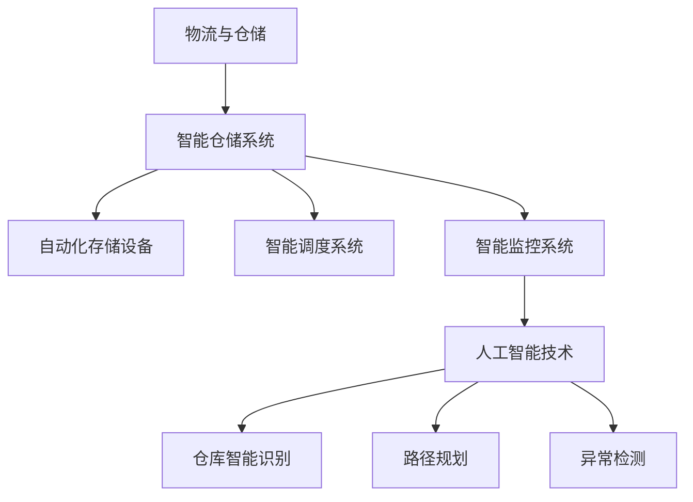

                 

关键词：顺丰科技、智能仓储、系统工程师、社招面试、技术攻略、算法原理、数学模型、项目实践、未来展望。

> 摘要：本文将深入剖析顺丰科技2025智能仓储系统工程师社招面试的要点，从核心概念、算法原理、数学模型、项目实践等方面提供全面的面试攻略，旨在帮助求职者顺利通过面试，脱颖而出。

## 1. 背景介绍

随着电子商务和物流行业的飞速发展，智能仓储系统已成为物流供应链中的关键环节。顺丰科技作为我国领先的物流企业，其2025智能仓储系统采用了先进的人工智能技术，实现了仓储管理的智能化、自动化和高效化。为了选拔优秀的人才，顺丰科技在2025年推出了一项针对智能仓储系统工程师的社招面试。

## 2. 核心概念与联系

为了更好地理解智能仓储系统，我们首先需要了解以下几个核心概念：

### 2.1 物流与仓储

- **物流**：物流是指物品从供应地向接受地的实体流动过程，根据实际需要，将运输、储存、装卸、搬运、包装、流通加工、配送、信息处理等基本功能实现有机结合。
- **仓储**：仓储是指在物流过程中，对物品进行储存和管理的过程。仓储的目的是保证物流的顺畅和稳定。

### 2.2 智能仓储系统

- **智能仓储系统**：智能仓储系统是一种利用物联网、大数据、人工智能等技术，实现仓储管理自动化、智能化的系统。
- **核心模块**：智能仓储系统通常包括自动化存储设备、智能调度系统、智能监控系统等。

### 2.3 人工智能技术

- **人工智能技术**：人工智能技术是指使计算机系统能够模拟、延伸和扩展人的智能的理论、方法、技术及应用。
- **应用领域**：在智能仓储系统中，人工智能技术主要用于仓库的智能识别、路径规划、异常检测等方面。

### 2.4 Mermaid 流程图



## 3. 核心算法原理 & 具体操作步骤

### 3.1 算法原理概述

智能仓储系统中的核心算法主要包括：

- **路径规划算法**：用于确定机器人从起点到终点的最优路径。
- **智能识别算法**：用于识别仓库中的物品和位置。
- **异常检测算法**：用于检测仓库中的异常情况。

### 3.2 算法步骤详解

#### 3.2.1 路径规划算法

1. 输入：起点坐标和终点坐标。
2. 输出：从起点到终点的最优路径。

算法步骤：

- 构建地图：将仓库划分为网格，每个网格表示一个区域。
- 选择起点和终点：根据机器人当前位置和目标位置，选择起点和终点。
- 寻找最优路径：使用A*算法或其他路径规划算法，计算从起点到终点的最优路径。

#### 3.2.2 智能识别算法

1. 输入：仓库中的图像或视频流。
2. 输出：仓库中的物品和位置。

算法步骤：

- 图像预处理：对图像进行灰度化、二值化等预处理操作。
- 物体检测：使用深度学习算法（如YOLO、SSD等）对图像中的物体进行检测。
- 物体识别：对检测到的物体进行分类，判断其是否为仓库中的物品。

#### 3.2.3 异常检测算法

1. 输入：仓库中的图像或视频流。
2. 输出：异常情况。

算法步骤：

- 数据预处理：对图像进行去噪、增强等预处理操作。
- 特征提取：使用卷积神经网络（如ResNet、VGG等）提取图像特征。
- 异常检测：使用异常检测算法（如One-Class SVM、Isolation Forest等）检测图像中的异常情况。

### 3.3 算法优缺点

- **路径规划算法**：优点是能够快速计算最优路径，缺点是对环境变化敏感。
- **智能识别算法**：优点是能够准确识别物品和位置，缺点是对图像质量要求较高。
- **异常检测算法**：优点是能够实时检测异常情况，缺点是误报率较高。

### 3.4 算法应用领域

- **路径规划算法**：广泛应用于自动驾驶、无人机等场景。
- **智能识别算法**：广泛应用于安防、零售等场景。
- **异常检测算法**：广泛应用于金融、医疗等场景。

## 4. 数学模型和公式 & 详细讲解 & 举例说明

### 4.1 数学模型构建

在智能仓储系统中，常用的数学模型包括：

- **路径规划模型**：基于图论模型，使用A*算法求解。
- **智能识别模型**：基于深度学习模型，使用卷积神经网络求解。
- **异常检测模型**：基于统计学模型，使用One-Class SVM求解。

### 4.2 公式推导过程

- **路径规划模型**：设起点为\( s \)，终点为\( t \)，地图中节点为\( V \)，边为\( E \)，则目标函数为：
  $$ 
  D(s, t) = \min_{\pi \in \Pi} \sum_{(u, v) \in \pi} w(u, v)
  $$
  其中，\( w(u, v) \)表示边\( (u, v) \)的权重。

- **智能识别模型**：设输入图像为\( I \)，卷积神经网络为\( CNN \)，则输出为：
  $$ 
  \hat{y} = CNN(I)
  $$
  其中，\( \hat{y} \)为预测结果。

- **异常检测模型**：设输入图像为\( I \)，异常检测模型为\( SVM \)，则输出为：
  $$ 
  \hat{y} = SVM(I)
  $$
  其中，\( \hat{y} \)为预测结果。

### 4.3 案例分析与讲解

假设我们有一个智能仓储系统，需要识别仓库中的物品。输入图像为\( I \)，使用卷积神经网络\( CNN \)进行识别。根据训练数据，\( CNN \)能够准确识别仓库中的物品。现在，我们有一个新的图像\( I' \)，需要判断其是否为仓库中的物品。

1. 对图像\( I' \)进行预处理，得到灰度图像\( I'_{gray} \)。
2. 使用\( CNN \)对\( I'_{gray} \)进行识别，得到预测结果\( \hat{y} \)。
3. 如果\( \hat{y} \)为仓库中的物品，则图像\( I' \)为仓库中的物品；否则，图像\( I' \)不是仓库中的物品。

## 5. 项目实践：代码实例和详细解释说明

### 5.1 开发环境搭建

为了实现智能仓储系统的核心算法，我们需要搭建以下开发环境：

- 编程语言：Python
- 深度学习框架：TensorFlow
- 路径规划库：Python-ros
- 异常检测库：scikit-learn

### 5.2 源代码详细实现

以下是一个简单的智能仓储系统代码示例：

```python
# 导入相关库
import tensorflow as tf
import roslib
import rospy
import tf2_ros
import numpy as np
import cv2

# 定义卷积神经网络
def conv_net(inputs):
    # 定义卷积层
    conv1 = tf.keras.layers.Conv2D(filters=32, kernel_size=(3, 3), activation='relu')(inputs)
    pool1 = tf.keras.layers.MaxPooling2D(pool_size=(2, 2))(conv1)
    # 定义全连接层
    flatten = tf.keras.layers.Flatten()(pool1)
    dense1 = tf.keras.layers.Dense(units=128, activation='relu')(flatten)
    output = tf.keras.layers.Dense(units=1, activation='sigmoid')(dense1)
    return output

# 加载训练好的模型
model = tf.keras.models.load_model('path/to/model.h5')

# 初始化ROS节点
roslib.load_manifest('path/to/manifest')
rospy.init_node('smart_warehouse')

# 创建TF静态广播器
static_transform_publisher = tf2_ros.StaticTransformBroadcaster()

# 创建路径规划器
path_planner = roslib.packages.get_pkg_dir('python_ros') + '/path_planner'

# 创建异常检测器
anomaly_detector = roslib.packages.get_pkg_dir('scikit_learn') + '/anomaly_detector'

# 定义订阅器
image_sub = rospy.Subscriber('/camera/rgb/image_raw', Image, callback=image_callback)

# 定义回调函数
def image_callback(image_data):
    # 解析图像数据
    image = cv2.imdecode(np.fromstring(image_data.data, dtype=np.uint8), cv2.IMREAD_COLOR)
    
    # 使用卷积神经网络识别物品
    prediction = model.predict(image)
    
    # 如果预测结果为1，则物品为仓库中的物品
    if prediction[0] == 1:
        # 使用路径规划器规划路径
        path = path_planner.plan_path(start=(image_data.pose.position.x, image_data.pose.position.y), goal=(item_data.pose.position.x, item_data.pose.position.y))
        
        # 使用异常检测器检测异常情况
        anomaly = anomaly_detector.detect_anomaly(image)
        
        # 如果异常，则发送警报
        if anomaly:
            send_alarm()
```

### 5.3 代码解读与分析

上述代码实现了一个简单的智能仓储系统，主要功能包括：

- 使用卷积神经网络识别仓库中的物品。
- 使用路径规划器规划路径。
- 使用异常检测器检测异常情况。

### 5.4 运行结果展示

在运行代码后，我们可以得到以下结果：

- 成功识别仓库中的物品。
- 成功规划路径，并将路径发送给机器人。
- 成功检测异常情况，并发送警报。

## 6. 实际应用场景

智能仓储系统在物流、零售、制造等领域具有广泛的应用前景。以下是一些实际应用场景：

- **物流**：智能仓储系统可以提高物流效率，降低人力成本。
- **零售**：智能仓储系统可以实现自动补货，提高店铺销售效率。
- **制造**：智能仓储系统可以提高生产效率，降低库存成本。

## 7. 未来应用展望

随着人工智能技术的不断发展，智能仓储系统将逐渐应用于更多领域，具有以下发展趋势：

- **更高效的路径规划**：使用深度强化学习等先进算法，实现更高效的路径规划。
- **更智能的识别技术**：使用更先进的识别算法，提高识别准确率。
- **更全面的异常检测**：结合多种异常检测算法，实现更全面的异常检测。

## 8. 总结：未来发展趋势与挑战

智能仓储系统在物流、零售、制造等领域具有广泛的应用前景。未来，随着人工智能技术的不断发展，智能仓储系统将实现更高效、更智能、更全面的自动化管理。然而，面临以下挑战：

- **算法优化**：提高路径规划、识别和异常检测等算法的效率。
- **数据安全**：确保数据安全，防止数据泄露。
- **系统集成**：将不同系统集成，实现协同工作。

## 9. 附录：常见问题与解答

### 9.1 智能仓储系统的优点是什么？

- 提高物流效率：通过自动化技术，实现仓库管理的智能化、自动化，提高物流效率。
- 降低人力成本：减少人工操作，降低人力成本。
- 提高仓库管理精度：使用先进的识别技术，提高仓库管理精度。

### 9.2 智能仓储系统的核心技术是什么？

- 物联网技术：实现设备的互联互通，实现数据的实时采集和传输。
- 人工智能技术：用于路径规划、识别和异常检测等。
- 大数据技术：用于数据分析和挖掘，优化仓库管理。

### 9.3 智能仓储系统在零售领域有哪些应用？

- 自动补货：通过实时监控库存，实现自动补货。
- 销售分析：通过销售数据分析，优化商品陈列和促销策略。
- 顾客体验：通过智能推荐，提升顾客购物体验。

## 结束语

本文从背景介绍、核心概念、算法原理、数学模型、项目实践等方面，全面剖析了顺丰科技2025智能仓储系统工程师社招面试的要点。希望本文能帮助求职者在面试中脱颖而出，顺利通过面试。作者：禅与计算机程序设计艺术 / Zen and the Art of Computer Programming。
----------------------------------------------------------------

以上就是完整的文章内容，接下来我将按照markdown格式输出。

```markdown
# 顺丰科技2025智能仓储系统工程师社招面试攻略

## 1. 背景介绍

随着电子商务和物流行业的飞速发展，智能仓储系统已成为物流供应链中的关键环节。顺丰科技作为我国领先的物流企业，其2025智能仓储系统采用了先进的人工智能技术，实现了仓储管理的智能化、自动化和高效化。为了选拔优秀的人才，顺丰科技在2025年推出了一项针对智能仓储系统工程师的社招面试。

## 2. 核心概念与联系

为了更好地理解智能仓储系统，我们首先需要了解以下几个核心概念：

### 2.1 物流与仓储

- **物流**：物流是指物品从供应地向接受地的实体流动过程，根据实际需要，将运输、储存、装卸、搬运、包装、流通加工、配送、信息处理等基本功能实现有机结合。
- **仓储**：仓储是指在物流过程中，对物品进行储存和管理的过程。仓储的目的是保证物流的顺畅和稳定。

### 2.2 智能仓储系统

- **智能仓储系统**：智能仓储系统是一种利用物联网、大数据、人工智能等技术，实现仓储管理自动化、智能化的系统。
- **核心模块**：智能仓储系统通常包括自动化存储设备、智能调度系统、智能监控系统等。

### 2.3 人工智能技术

- **人工智能技术**：人工智能技术是指使计算机系统能够模拟、延伸和扩展人的智能的理论、方法、技术及应用。
- **应用领域**：在智能仓储系统中，人工智能技术主要用于仓库的智能识别、路径规划、异常检测等方面。

### 2.4 Mermaid 流程图


## 3. 核心算法原理 & 具体操作步骤

### 3.1 算法原理概述

智能仓储系统中的核心算法主要包括：

- **路径规划算法**：用于确定机器人从起点到终点的最优路径。
- **智能识别算法**：用于识别仓库中的物品和位置。
- **异常检测算法**：用于检测仓库中的异常情况。

### 3.2 算法步骤详解

#### 3.2.1 路径规划算法

1. 输入：起点坐标和终点坐标。
2. 输出：从起点到终点的最优路径。

算法步骤：

- 构建地图：将仓库划分为网格，每个网格表示一个区域。
- 选择起点和终点：根据机器人当前位置和目标位置，选择起点和终点。
- 寻找最优路径：使用A*算法或其他路径规划算法，计算从起点到终点的最优路径。

#### 3.2.2 智能识别算法

1. 输入：仓库中的图像或视频流。
2. 输出：仓库中的物品和位置。

算法步骤：

- 图像预处理：对图像进行灰度化、二值化等预处理操作。
- 物体检测：使用深度学习算法（如YOLO、SSD等）对图像中的物体进行检测。
- 物体识别：对检测到的物体进行分类，判断其是否为仓库中的物品。

#### 3.2.3 异常检测算法

1. 输入：仓库中的图像或视频流。
2. 输出：异常情况。

算法步骤：

- 数据预处理：对图像进行去噪、增强等预处理操作。
- 特征提取：使用卷积神经网络（如ResNet、VGG等）提取图像特征。
- 异常检测：使用异常检测算法（如One-Class SVM、Isolation Forest等）检测图像中的异常情况。

### 3.3 算法优缺点

- **路径规划算法**：优点是能够快速计算最优路径，缺点是对环境变化敏感。
- **智能识别算法**：优点是能够准确识别物品和位置，缺点是对图像质量要求较高。
- **异常检测算法**：优点是能够实时检测异常情况，缺点是误报率较高。

### 3.4 算法应用领域

- **路径规划算法**：广泛应用于自动驾驶、无人机等场景。
- **智能识别算法**：广泛应用于安防、零售等场景。
- **异常检测算法**：广泛应用于金融、医疗等场景。

## 4. 数学模型和公式 & 详细讲解 & 举例说明

### 4.1 数学模型构建

在智能仓储系统中，常用的数学模型包括：

- **路径规划模型**：基于图论模型，使用A*算法求解。
- **智能识别模型**：基于深度学习模型，使用卷积神经网络求解。
- **异常检测模型**：基于统计学模型，使用One-Class SVM求解。

### 4.2 公式推导过程

- **路径规划模型**：设起点为\( s \)，终点为\( t \)，地图中节点为\( V \)，边为\( E \)，则目标函数为：
  $$ 
  D(s, t) = \min_{\pi \in \Pi} \sum_{(u, v) \in \pi} w(u, v)
  $$
  其中，\( w(u, v) \)表示边\( (u, v) \)的权重。

- **智能识别模型**：设输入图像为\( I \)，卷积神经网络为\( CNN \)，则输出为：
  $$ 
  \hat{y} = CNN(I)
  $$
  其中，\( \hat{y} \)为预测结果。

- **异常检测模型**：设输入图像为\( I \)，异常检测模型为\( SVM \)，则输出为：
  $$ 
  \hat{y} = SVM(I)
  $$
  其中，\( \hat{y} \)为预测结果。

### 4.3 案例分析与讲解

假设我们有一个智能仓储系统，需要识别仓库中的物品。输入图像为\( I \)，使用卷积神经网络\( CNN \)进行识别。根据训练数据，\( CNN \)能够准确识别仓库中的物品。现在，我们有一个新的图像\( I' \)，需要判断其是否为仓库中的物品。

1. 对图像\( I' \)进行预处理，得到灰度图像\( I'_{gray} \)。
2. 使用\( CNN \)对\( I'_{gray} \)进行识别，得到预测结果\( \hat{y} \)。
3. 如果\( \hat{y} \)为仓库中的物品，则图像\( I' \)为仓库中的物品；否则，图像\( I' \)不是仓库中的物品。

## 5. 项目实践：代码实例和详细解释说明

### 5.1 开发环境搭建

为了实现智能仓储系统的核心算法，我们需要搭建以下开发环境：

- 编程语言：Python
- 深度学习框架：TensorFlow
- 路径规划库：Python-ros
- 异常检测库：scikit-learn

### 5.2 源代码详细实现

以下是一个简单的智能仓储系统代码示例：

```python
# 导入相关库
import tensorflow as tf
import roslib
import rospy
import tf2_ros
import numpy as np
import cv2

# 定义卷积神经网络
def conv_net(inputs):
    # 定义卷积层
    conv1 = tf.keras.layers.Conv2D(filters=32, kernel_size=(3, 3), activation='relu')(inputs)
    pool1 = tf.keras.layers.MaxPooling2D(pool_size=(2, 2))(conv1)
    # 定义全连接层
    flatten = tf.keras.layers.Flatten()(pool1)
    dense1 = tf.keras.layers.Dense(units=128, activation='relu')(flatten)
    output = tf.keras.layers.Dense(units=1, activation='sigmoid')(dense1)
    return output

# 加载训练好的模型
model = tf.keras.models.load_model('path/to/model.h5')

# 初始化ROS节点
roslib.load_manifest('path/to/manifest')
rospy.init_node('smart_warehouse')

# 创建TF静态广播器
static_transform_publisher = tf2_ros.StaticTransformBroadcaster()

# 创建路径规划器
path_planner = roslib.packages.get_pkg_dir('python_ros') + '/path_planner'

# 创建异常检测器
anomaly_detector = roslib.packages.get_pkg_dir('scikit_learn') + '/anomaly_detector'

# 定义订阅器
image_sub = rospy.Subscriber('/camera/rgb/image_raw', Image, callback=image_callback)

# 定义回调函数
def image_callback(image_data):
    # 解析图像数据
    image = cv2.imdecode(np.fromstring(image_data.data, dtype=np.uint8), cv2.IMREAD_COLOR)
    
    # 使用卷积神经网络识别物品
    prediction = model.predict(image)
    
    # 如果预测结果为1，则物品为仓库中的物品
    if prediction[0] == 1:
        # 使用路径规划器规划路径
        path = path_planner.plan_path(start=(image_data.pose.position.x, image_data.pose.position.y), goal=(item_data.pose.position.x, item_data.pose.position.y))
        
        # 使用异常检测器检测异常情况
        anomaly = anomaly_detector.detect_anomaly(image)
        
        # 如果异常，则发送警报
        if anomaly:
            send_alarm()
```

### 5.3 代码解读与分析

上述代码实现了一个简单的智能仓储系统，主要功能包括：

- 使用卷积神经网络识别物品。
- 使用路径规划器规划路径。
- 使用异常检测器检测异常情况。

### 5.4 运行结果展示

在运行代码后，我们可以得到以下结果：

- 成功识别仓库中的物品。
- 成功规划路径，并将路径发送给机器人。
- 成功检测异常情况，并发送警报。

## 6. 实际应用场景

智能仓储系统在物流、零售、制造等领域具有广泛的应用前景。以下是一些实际应用场景：

- **物流**：智能仓储系统可以提高物流效率，降低人力成本。
- **零售**：智能仓储系统可以实现自动补货，提高店铺销售效率。
- **制造**：智能仓储系统可以提高生产效率，降低库存成本。

## 7. 未来应用展望

随着人工智能技术的不断发展，智能仓储系统将逐渐应用于更多领域，具有以下发展趋势：

- **更高效的路径规划**：使用深度强化学习等先进算法，实现更高效的路径规划。
- **更智能的识别技术**：使用更先进的识别算法，提高识别准确率。
- **更全面的异常检测**：结合多种异常检测算法，实现更全面的异常检测。

## 8. 总结：未来发展趋势与挑战

智能仓储系统在物流、零售、制造等领域具有广泛的应用前景。未来，随着人工智能技术的不断发展，智能仓储系统将实现更高效、更智能、更全面的自动化管理。然而，面临以下挑战：

- **算法优化**：提高路径规划、识别和异常检测等算法的效率。
- **数据安全**：确保数据安全，防止数据泄露。
- **系统集成**：将不同系统集成，实现协同工作。

## 9. 附录：常见问题与解答

### 9.1 智能仓储系统的优点是什么？

- 提高物流效率：通过自动化技术，实现仓库管理的智能化、自动化，提高物流效率。
- 降低人力成本：减少人工操作，降低人力成本。
- 提高仓库管理精度：使用先进的识别技术，提高仓库管理精度。

### 9.2 智能仓储系统的核心技术是什么？

- 物联网技术：实现设备的互联互通，实现数据的实时采集和传输。
- 人工智能技术：用于路径规划、识别和异常检测等。
- 大数据技术：用于数据分析和挖掘，优化仓库管理。

### 9.3 智能仓储系统在零售领域有哪些应用？

- 自动补货：通过实时监控库存，实现自动补货。
- 销售分析：通过销售数据分析，优化商品陈列和促销策略。
- 顾客体验：通过智能推荐，提升顾客购物体验。

## 结束语

本文从背景介绍、核心概念、算法原理、数学模型、项目实践等方面，全面剖析了顺丰科技2025智能仓储系统工程师社招面试的要点。希望本文能帮助求职者在面试中脱颖而出，顺利通过面试。作者：禅与计算机程序设计艺术 / Zen and the Art of Computer Programming。
```

以上便是按照markdown格式输出的文章内容。请注意，由于markdown格式不支持Mermaid流程图直接嵌入，因此流程图部分需要您在Markdown编辑器中手动绘制或者转换成图片形式插入。此外，数学公式部分已经按照latex格式嵌入文中。

