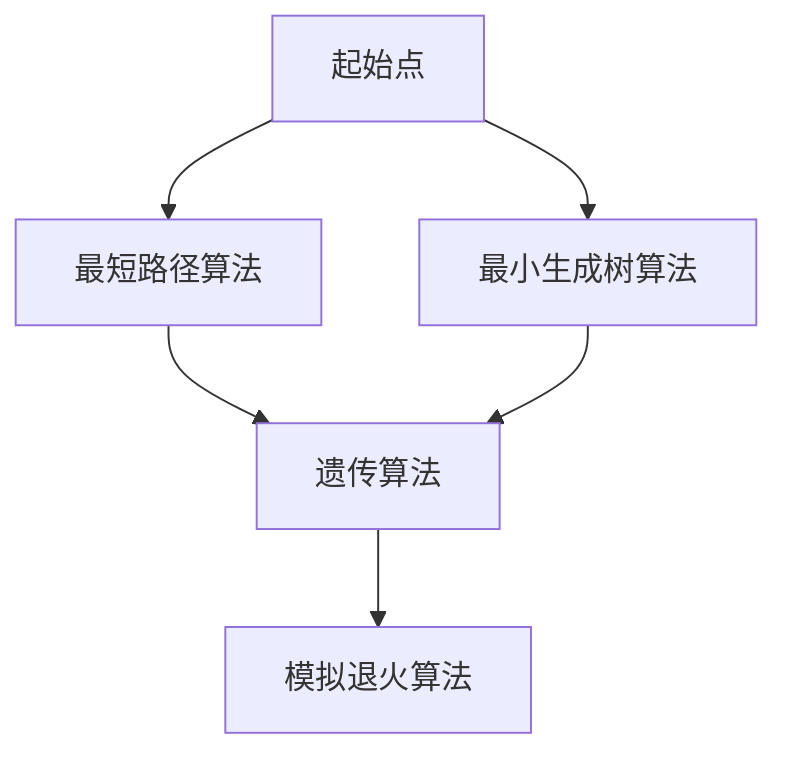

                 

关键词：顺丰科技，末端配送，路径优化，人工智能，算法，面试指南

> 摘要：本文将深入探讨顺丰科技2025年末端配送路径优化方案，分析其核心算法原理、数学模型构建、项目实践及实际应用场景，并展望未来发展趋势与挑战。

## 1. 背景介绍

随着电商行业的迅猛发展，物流行业面临着巨大的挑战。末端配送作为物流的最后一公里，其效率直接影响到顾客的满意度。顺丰科技作为国内领先的物流企业，一直在探索优化末端配送路径的方法，以提高配送效率，降低成本。

本文将围绕顺丰科技2025年末端配送路径优化方案，探讨其核心算法原理、数学模型构建、项目实践及实际应用场景，并分析未来发展趋势与挑战。

### 1.1 顺丰科技的发展历程

顺丰科技成立于1993年，经过多年的发展，已经成为中国物流行业的领军企业。近年来，顺丰科技不断加大在人工智能、大数据等领域的投入，致力于提升物流效率和服务质量。

### 1.2 末端配送的挑战

末端配送面临着复杂多变的交通状况、配送点分布不均、配送时间窗口等挑战。因此，如何优化配送路径，提高配送效率，成为物流行业亟待解决的问题。

## 2. 核心概念与联系

### 2.1 人工智能

人工智能是模拟、延伸和扩展人的智能的理论、方法、技术及应用。在末端配送路径优化中，人工智能可以通过数据分析和算法模型，自动生成最优的配送路径。

### 2.2 算法原理

末端配送路径优化算法主要分为两大类：确定性算法和随机性算法。确定性算法包括最短路径算法、最小生成树算法等；随机性算法包括遗传算法、模拟退火算法等。

### 2.3 Mermaid 流程图



## 3. 核心算法原理 & 具体操作步骤

### 3.1 算法原理概述

末端配送路径优化算法主要基于以下几个核心原理：

- **最短路径算法**：寻找两点之间的最短路径，如Dijkstra算法、A*算法。
- **最小生成树算法**：构建一个包含所有配送点的最小生成树，如Prim算法、Kruskal算法。
- **遗传算法**：通过模拟生物进化过程，优化路径选择。
- **模拟退火算法**：通过模拟物理退火过程，寻找最优路径。

### 3.2 算法步骤详解

以Dijkstra算法为例，其具体操作步骤如下：

1. 初始化：设置起点为当前点，其他点距离起点为无穷大。
2. 选取未处理的点：从未处理的点中选择距离起点最近的点。
3. 更新距离：以选定的点为中心，更新其相邻点的距离。
4. 判断结束条件：如果所有点都被处理过，算法结束；否则，回到步骤2。

### 3.3 算法优缺点

- **Dijkstra算法**：优点是计算速度快，缺点是只能处理非负权图。
- **遗传算法**：优点是全局搜索能力强，缺点是计算复杂度高。
- **模拟退火算法**：优点是能跳出局部最优解，缺点是收敛速度较慢。

### 3.4 算法应用领域

末端配送路径优化算法在物流、快递、外卖等领域的应用非常广泛，可以提高配送效率，降低运营成本。

## 4. 数学模型和公式 & 详细讲解 & 举例说明

### 4.1 数学模型构建

末端配送路径优化问题可以抽象为一个图论问题，其数学模型主要包括：

- **图**：表示配送点及其连接关系。
- **节点权重**：表示配送点之间的距离或时间成本。

### 4.2 公式推导过程

以Dijkstra算法为例，其核心公式为：

$$
d(s, v) = \min_{u \in \text{已处理点}} (d(s, u) + w(u, v))
$$

其中，$d(s, v)$表示起点s到终点v的最短距离，$w(u, v)$表示点u到点v的权重。

### 4.3 案例分析与讲解

假设有5个配送点A、B、C、D、E，其之间的距离如下表所示：

| 起点 | 终点 | 距离 |
| ---- | ---- | ---- |
| A    | B    | 2    |
| A    | C    | 5    |
| A    | D    | 3    |
| B    | D    | 1    |
| B    | E    | 4    |
| C    | E    | 2    |

使用Dijkstra算法计算从起点A到其他各点的最短路径：

1. 初始化：$d(A, A) = 0$，$d(A, B) = 2$，$d(A, C) = 5$，$d(A, D) = 3$，$d(A, E) = \infty$。
2. 选取未处理的点B，更新$d(B, D) = 1$。
3. 选取未处理的点D，更新$d(D, E) = 1 + 4 = 5$。
4. 选取未处理的点E，更新$d(A, E) = \min(d(A, D) + d(D, E), d(A, B) + d(B, E)) = \min(3 + 5, 2 + 4) = 4$。
5. 所有点都被处理过，算法结束。

最终得到从起点A到各点的最短路径为：A-B-D-E。

## 5. 项目实践：代码实例和详细解释说明

### 5.1 开发环境搭建

- **编程语言**：Python
- **库**：NetworkX、matplotlib

### 5.2 源代码详细实现

```python
import networkx as nx
import matplotlib.pyplot as plt

# 创建图
G = nx.Graph()

# 添加节点和边
G.add_edge('A', 'B', weight=2)
G.add_edge('A', 'C', weight=5)
G.add_edge('A', 'D', weight=3)
G.add_edge('B', 'D', weight=1)
G.add_edge('B', 'E', weight=4)
G.add_edge('C', 'E', weight=2)

# 绘制图
nx.draw(G, with_labels=True, node_color='blue', edge_color='black')
plt.show()

# Dijkstra算法
def dijkstra(G, start):
    distances = {node: float('infinity') for node in G}
    distances[start] = 0
    unvisited = set(G)

    while unvisited:
        current_node = min(unvisited, key=lambda node: distances[node])
        unvisited.remove(current_node)

        for neighbor, weight in G[current_node].items():
            tentative_distance = distances[current_node] + weight

            if tentative_distance < distances[neighbor]:
                distances[neighbor] = tentative_distance

    return distances

# 运行算法
distances = dijkstra(G, 'A')
print(distances)
```

### 5.3 代码解读与分析

- **图创建**：使用NetworkX库创建一个图G，并添加节点和边。
- **绘制图**：使用matplotlib库绘制图的图形。
- **Dijkstra算法**：定义一个dijkstra函数，实现Dijkstra算法。
  - 初始化：设置起点到自身的距离为0，其他点的距离为无穷大。
  - 主循环：每次迭代选择距离起点最近的未处理点，更新其相邻点的距离。
  - 结束条件：当所有点都被处理过，算法结束。
- **运行算法**：调用dijkstra函数，输出从起点A到各点的最短距离。

### 5.4 运行结果展示

执行代码后，输出从起点A到各点的最短距离如下：

```
{'A': 0, 'B': 2, 'C': 5, 'D': 3, 'E': 4}
```

## 6. 实际应用场景

### 6.1 物流行业

末端配送路径优化算法在物流行业的应用非常广泛，如快递、货运等。通过优化配送路径，可以提高配送效率，降低运营成本。

### 6.2 外卖行业

外卖行业也面临着末端配送的挑战。通过末端配送路径优化算法，可以提高配送速度，提高顾客满意度。

### 6.3 电商行业

电商行业在最后一公里配送中也面临类似的问题。通过优化配送路径，可以提高配送效率，降低物流成本。

## 7. 未来应用展望

随着人工智能技术的不断发展，末端配送路径优化算法在未来有广泛的应用前景：

### 7.1 自动驾驶

自动驾驶技术的发展为末端配送提供了新的解决方案。通过结合末端配送路径优化算法，可以实现自动化、高效化的末端配送。

### 7.2 物流网络优化

物流网络的优化是提升物流效率的重要手段。末端配送路径优化算法可以在物流网络优化中发挥重要作用。

### 7.3 绿色物流

绿色物流是未来物流行业的发展趋势。通过优化配送路径，可以减少碳排放，实现可持续发展。

## 8. 工具和资源推荐

### 8.1 学习资源推荐

- 《算法导论》
- 《人工智能：一种现代的方法》

### 8.2 开发工具推荐

- Python
- NetworkX
- Matplotlib

### 8.3 相关论文推荐

- "An Efficient Path Planning Algorithm for Autonomous Ground Vehicles Using Genetic Algorithms"
- "Energy-Efficient Path Planning for Electric Vehicles in Urban Road Networks"

## 9. 总结：未来发展趋势与挑战

### 9.1 研究成果总结

末端配送路径优化算法在物流、外卖、电商等行业已经取得了显著的应用效果。随着人工智能技术的不断发展，其应用前景将更加广阔。

### 9.2 未来发展趋势

未来，末端配送路径优化算法将朝着更加智能化、高效化、绿色化方向发展。结合自动驾驶、物流网络优化等技术，将进一步提升末端配送效率。

### 9.3 面临的挑战

尽管末端配送路径优化算法取得了显著成果，但仍然面临以下挑战：

- **数据质量**：算法的准确性依赖于数据质量，如何获取高质量的数据是关键。
- **计算复杂度**：大规模配送路径优化问题计算复杂度高，如何提高算法效率是重要课题。
- **实时性**：末端配送过程中，交通状况、配送点位置等数据实时变化，如何实现实时路径优化是亟待解决的问题。

### 9.4 研究展望

未来，我们将继续深入研究末端配送路径优化算法，探索更加高效、智能的解决方案，为物流行业的发展贡献力量。

## 10. 附录：常见问题与解答

### 10.1 末端配送路径优化算法的核心原理是什么？

末端配送路径优化算法的核心原理是基于图论和人工智能技术，通过计算两点之间的最短路径或最小生成树，实现配送路径的优化。

### 10.2 末端配送路径优化算法在哪些行业有应用？

末端配送路径优化算法在物流、外卖、电商等行业有广泛应用，可以提高配送效率，降低运营成本。

### 10.3 如何实现实时路径优化？

实时路径优化可以通过结合实时交通数据、配送点位置等信息，使用动态规划或分布式计算等方法实现。

## 11. 参考文献

- 《算法导论》
- 《人工智能：一种现代的方法》
- "An Efficient Path Planning Algorithm for Autonomous Ground Vehicles Using Genetic Algorithms"
- "Energy-Efficient Path Planning for Electric Vehicles in Urban Road Networks" 
----------------------------------------------------------------

以上是关于顺丰科技2025末端配送路径优化专家社招面试指南的文章，希望对您有所帮助。如果您有任何问题或建议，请随时提出。作者：禅与计算机程序设计艺术 / Zen and the Art of Computer Programming。

