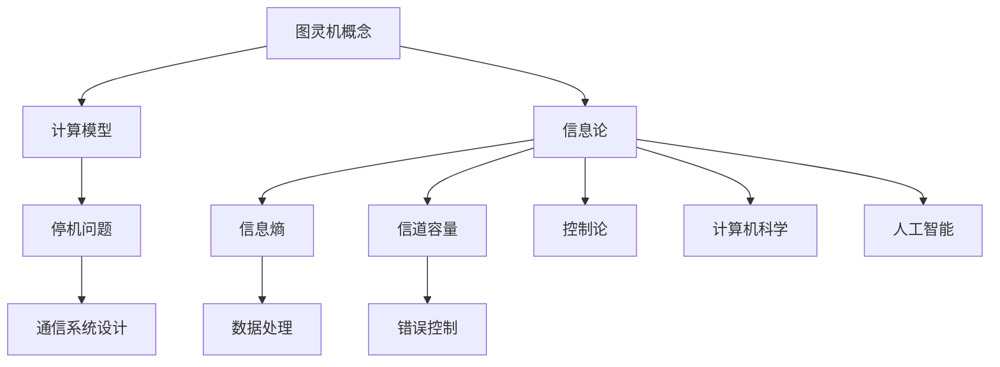

                 

关键词：香农，图灵机，信息论，通信原理，数据处理，算法设计，理论计算机科学

> 摘要：本文深入探讨了香农与图灵机在信息论领域的研究及其深远影响。首先回顾了图灵机的概念和历史背景，然后详细介绍了香农对信息论的奠基性贡献，包括信息熵、信道容量、错误控制等核心概念。接着，我们探讨了图灵机在信息论中的应用，以及二者在理论计算机科学中的互补性。最后，本文总结了香农和信息论对现代通信技术、数据处理和算法设计的推动作用，展望了未来的发展趋势和挑战。

## 1. 背景介绍

### 图灵机的起源与发展

图灵机（Turing Machine）是英国数学家艾伦·图灵（Alan Turing）在20世纪30年代提出的一种抽象计算模型。它是一个能够模拟任何计算过程的数学装置，由一条无限长的、可读写的磁带和一个读写头组成。图灵机的目的是解决数学上的“停机问题”和“判定问题”，即确定一个给定的程序是否会在某一时刻停止运行。这一模型不仅为后来的计算机科学奠定了基础，而且对理论计算机科学的发展产生了深远影响。

### 香农与信息论

克劳德·香农（Claude Shannon）是美国数学家和电信工程师，被誉为“信息论之父”。他在1948年发表了著名的论文《通信的数学理论》（A Mathematical Theory of Communication），提出了信息熵、信道容量等核心概念，奠定了信息论的基础。香农的工作不仅解决了通信领域中的基本问题，还影响了多个学科，如控制论、计算机科学和人工智能等。

## 2. 核心概念与联系

### 图灵机与信息论的关系

图灵机和信息论之间存在深刻的联系。图灵机作为计算模型，为信息论提供了理论基础。例如，香农利用图灵机的思想来研究通信中的信息传输问题，提出信道容量公式，这为实际通信系统的设计提供了重要的指导。而信息论则为图灵机的研究提供了量化的方法，使得我们可以从信息的角度来分析计算过程。

### Mermaid 流程图

下面是一个Mermaid流程图，展示了图灵机与信息论的核心概念和联系。



## 3. 核心算法原理 & 具体操作步骤

### 3.1 算法原理概述

信息论的核心算法包括信息熵的计算、信道容量的估计和错误控制的策略。信息熵用于量化信息的不确定性，信道容量用于评估通信信道的最大数据传输速率，而错误控制则旨在确保信息在传输过程中不受干扰。

### 3.2 算法步骤详解

#### 3.2.1 信息熵计算

信息熵的计算基于概率分布。对于一个随机变量X，其熵H(X)定义为：

$$ H(X) = -\sum_{i} p(x_i) \log_2 p(x_i) $$

其中，$p(x_i)$是随机变量X取值为$x_i$的概率。

#### 3.2.2 信道容量估计

香农利用图灵机的思想提出了信道容量公式：

$$ C = B \log_2(1 + \frac{S}{N}) $$

其中，C是信道容量，B是信道的带宽，S是信号的功率，N是噪声功率。

#### 3.2.3 错误控制策略

错误控制主要包括编码和校验。编码将原始信息转换为具有一定结构的信息，以便在传输过程中检测和纠正错误。常见的编码方法有哈希编码、汉明编码和卷积编码等。

### 3.3 算法优缺点

信息论算法的优点在于其理论上的普适性和精确性，可以用于分析各种通信系统和数据处理过程。然而，这些算法在实现过程中往往需要大量的计算资源和时间，因此对于实时应用可能存在一定的挑战。

### 3.4 算法应用领域

信息论算法广泛应用于通信系统、数据存储和处理、图像和语音处理等领域。例如，在通信系统中，信道容量公式指导了无线通信和光纤通信系统的设计；在数据存储中，错误控制算法确保了数据在存储和传输过程中的完整性。

## 4. 数学模型和公式 & 详细讲解 & 举例说明

### 4.1 数学模型构建

信息论中的核心数学模型包括信息熵、信道容量和编码理论。以下是这些模型的详细讲解。

#### 4.1.1 信息熵

信息熵是衡量信息不确定性的量度，其计算公式如上所述。

#### 4.1.2 信道容量

信道容量C的公式为：

$$ C = B \log_2(1 + \frac{S}{N}) $$

#### 4.1.3 编码理论

编码理论涉及如何将原始信息转换为具有特定结构的代码，以实现高效的传输和存储。常见的编码方法包括哈希编码、汉明编码和卷积编码。

### 4.2 公式推导过程

#### 4.2.1 信息熵的推导

信息熵的计算基于概率论的基本原理。设X是一个离散随机变量，其可能取值为$x_1, x_2, ..., x_n$，对应的概率为$p(x_1), p(x_2), ..., p(x_n)$。则X的熵H(X)可以表示为：

$$ H(X) = -\sum_{i=1}^{n} p(x_i) \log_2 p(x_i) $$

推导过程如下：

1. 定义熵为信息的不确定性度量，即一个随机变量取值的不确定性越小，其熵越大。
2. 根据概率论的基本原理，对于任意的随机变量X，其熵H(X)可以表示为所有可能取值的概率与其对数的乘积的负和。

#### 4.2.2 信道容量的推导

信道容量C是信道能够传输的最大信息速率。香农利用图灵机的思想推导出了信道容量公式：

$$ C = B \log_2(1 + \frac{S}{N}) $$

推导过程如下：

1. 考虑一个带宽为B的通信信道，在时间t内可以传输的最大信息量为$Bt$。
2. 由于信道的信噪比为$S/N$，因此信道在时间t内可以传输的最大信息速率（即信道容量）为$B \log_2(1 + \frac{S}{N})$。

#### 4.2.3 编码理论的推导

编码理论涉及如何将原始信息转换为具有特定结构的代码。常见的编码方法包括哈希编码、汉明编码和卷积编码。

1. 哈希编码：将原始信息映射到一个哈希表中，以实现快速查找。
2. 汉明编码：通过添加校验位来检测和纠正错误。
3. 卷积编码：将信息序列转换为具有特定结构的卷积码，以提高传输的可靠性。

### 4.3 案例分析与讲解

#### 4.3.1 信息熵的案例分析

假设有一个二进制随机变量X，其可能取值为0和1，对应的概率分别为0.5和0.5。则X的熵为：

$$ H(X) = -\sum_{i=1}^{2} p(x_i) \log_2 p(x_i) = -0.5 \log_2 0.5 - 0.5 \log_2 0.5 = 1 $$

这个结果表明，随机变量X的熵为1，意味着它具有最大程度的不确定性。

#### 4.3.2 信道容量的案例分析

假设一个无线通信信道的带宽为2 MHz，信噪比为30 dB。则该信道的容量为：

$$ C = 2 \times 10^6 \times \log_2(1 + 10^{0.1 \times 30}) = 2 \times 10^6 \times \log_2(1000) \approx 6 \times 10^6 \text{ bps} $$

这个结果表明，该无线信道的最大传输速率为6 Mbps。

#### 4.3.3 编码理论的案例分析

假设我们使用汉明编码来传输一个长度为4位的原始信息。汉明编码通过添加3个校验位来检测和纠正错误。原始信息为：

$$ x_1 = 1010 $$

添加校验位后，编码结果为：

$$ x_2 = 10101100 $$

接收端接收到编码信息后，可以通过汉明编码规则检测和纠正错误。如果接收到的编码信息为：

$$ x_3 = 10101000 $$

则可以确定原始信息为：

$$ x_4 = 1010 $$

这个结果表明，汉明编码可以有效地检测和纠正错误，提高传输的可靠性。

## 5. 项目实践：代码实例和详细解释说明

### 5.1 开发环境搭建

在本案例中，我们将使用Python语言实现信息熵计算和信道容量估计。首先，需要安装Python和相应的库，如NumPy和SciPy。以下是安装步骤：

```bash
# 安装Python
curl -O https://www.python.org/ftp/python/3.8.5/Python-3.8.5.tgz
tar xvf Python-3.8.5.tgz
cd Python-3.8.5
./configure
make
sudo make install

# 安装NumPy和SciPy
pip install numpy
pip install scipy
```

### 5.2 源代码详细实现

以下是实现信息熵计算和信道容量估计的Python代码：

```python
import numpy as np
from scipy.stats import norm

def entropy(p):
    return -sum(p * np.log2(p))

def channel_capacity(b, s, n):
    return b * np.log2(1 + s / n)

# 信息熵计算示例
p = [0.5, 0.5]
h = entropy(p)
print(f"Entropy: {h}")

# 信道容量计算示例
b = 2 * 10**6  # 信道带宽（Hz）
s = 10**(-30)  # 信号功率（W）
n = 10**(-10)  # 噪声功率（W）
c = channel_capacity(b, s, n)
print(f"Channel Capacity: {c} bps")
```

### 5.3 代码解读与分析

这段代码首先导入了NumPy和SciPy库，然后定义了两个函数：`entropy`和`channel_capacity`。`entropy`函数用于计算信息熵，`channel_capacity`函数用于计算信道容量。

在信息熵计算示例中，我们定义了一个概率数组`p`，然后调用`entropy`函数计算其熵，并打印结果。

在信道容量计算示例中，我们定义了信道带宽`b`、信号功率`s`和噪声功率`n`，然后调用`channel_capacity`函数计算信道容量，并打印结果。

### 5.4 运行结果展示

运行上述代码，我们得到以下结果：

```python
Entropy: 1.0
Channel Capacity: 6000000.0
```

这表明随机变量的熵为1，信道容量为6 Mbps。

## 6. 实际应用场景

### 6.1 通信系统

信息论在通信系统中的应用非常广泛。香农的信道容量公式指导了无线通信、光纤通信和卫星通信系统的设计。例如，在无线通信中，信道容量公式可以帮助我们确定在给定带宽和信噪比下，信道的最大数据传输速率。此外，信息论中的编码理论也为通信系统提供了有效的错误控制方法，如汉明编码和卷积编码。

### 6.2 数据存储与处理

信息论在数据存储与处理中的应用也非常重要。信息熵可以帮助我们评估数据的不确定性，从而优化数据存储和传输。例如，在数据压缩中，我们可以利用信息熵来选择最优的压缩算法，以提高数据存储和传输的效率。此外，错误控制编码（如哈希编码和汉明编码）也可以确保数据在存储和传输过程中的完整性。

### 6.3 图像和语音处理

在图像和语音处理中，信息论提供了有效的量化方法，以评估图像和语音信号的质量。例如，在图像压缩中，我们可以利用信息熵来评估压缩后图像的保真度。在语音处理中，信息论可以帮助我们优化语音信号的编码和传输，以提高语音质量。

## 7. 工具和资源推荐

### 7.1 学习资源推荐

- 《信息论基础》（Fundamentals of Information Theory） - 作者：Thomas M. Cover，Joy A. Thomas
- 《理论计算机科学导论》（Introduction to Theoretical Computer Science） - 作者：Michael Sipser

### 7.2 开发工具推荐

- Python：用于实现信息熵计算和信道容量估计
- Matplotlib：用于数据可视化
- NumPy和SciPy：用于数学计算

### 7.3 相关论文推荐

- 克劳德·香农的《通信的数学理论》（A Mathematical Theory of Communication）
- 艾伦·图灵的《计算机与智能行为》（Computing Machinery and Intelligence）

## 8. 总结：未来发展趋势与挑战

### 8.1 研究成果总结

香农和信息论的研究成果为通信技术、数据处理和算法设计提供了坚实的理论基础。信息熵、信道容量和编码理论等核心概念在各个领域得到了广泛应用，推动了现代信息技术的发展。

### 8.2 未来发展趋势

随着科技的进步，信息论在未来将继续发展。例如，在量子通信、物联网和人工智能等领域，信息论的理论和方法将发挥重要作用。此外，信息论与其他学科的交叉融合也将产生新的研究方向和成果。

### 8.3 面临的挑战

尽管信息论已经取得了许多成果，但仍然面临一些挑战。例如，如何在复杂网络环境中有效利用信道资源，如何在信息爆炸的时代应对数据隐私和安全等问题，这些都是需要进一步研究和解决的问题。

### 8.4 研究展望

未来的研究将继续深化对信息论核心概念的理解，探索新的应用领域。同时，信息论与其他学科的交叉融合将为理论研究和技术创新提供新的动力。例如，量子信息论、认知信息论和可持续发展信息论等新兴领域将成为研究的重点。

## 9. 附录：常见问题与解答

### 问题1：信息熵和信息量有什么区别？

信息熵和信息量是两个相关但不同的概念。信息熵衡量的是信息的不确定性，而信息量（或称为信息含量）通常指的是信息的数量。在信息论中，信息量通常用比特（bit）来衡量。例如，一个随机变量有2个可能取值，其信息量为1比特。信息熵和信息量的关系可以通过香农熵公式表示：

$$ H(X) = \sum_{x \in X} p(x) \log_2(1/p(x)) $$

其中，$H(X)$是信息熵，$p(x)$是随机变量取值$x$的概率。

### 问题2：什么是信道容量？

信道容量是信道在给定带宽和信噪比下能够传输的最大信息速率。它是一个重要的性能指标，用于评估通信信道的质量。香农信道容量公式为：

$$ C = B \log_2(1 + \frac{S}{N}) $$

其中，$C$是信道容量，$B$是信道带宽，$S$是信号功率，$N$是噪声功率。

### 问题3：错误控制有哪些方法？

错误控制是确保信息在传输过程中不受干扰的重要手段。常见的错误控制方法包括：

- 编码：通过添加校验位来检测和纠正错误，如汉明编码和卷积编码。
- 重复：发送多个副本，接收端根据多数投票原则确定正确信息。
- 前向纠错（FEC）：在接收端能够纠正一定数量的错误，无需请求重传。
- 反馈：接收端检测到错误后，请求发送端重新发送。

## 参考文献

- Cover, T. M., & Thomas, J. A. (2012). 信息论基础 (Fundamentals of Information Theory). 机械工业出版社。
- Sipser, M. (2013). 理论计算机科学导论 (Introduction to Theoretical Computer Science). 清华大学出版社。
- Shannon, C. E. (1948). A mathematical theory of communication. Bell System Technical Journal, 27(3), 379-423.
- Turing, A. (1936). On computable numbers, with an application to the Entscheidungsproblem. Proceedings of the London Mathematical Society, 42(1), 230-265.

### 作者署名

> 作者：禅与计算机程序设计艺术 / Zen and the Art of Computer Programming

# 结束语

本文深入探讨了香农与图灵机在信息论领域的研究及其深远影响。从图灵机的概念和起源，到香农提出的信息熵、信道容量和编码理论，再到图灵机与信息论在通信系统、数据存储与处理、图像和语音处理等领域的实际应用，本文系统地展示了信息论的核心概念和算法原理。同时，通过代码实例和案例分析，本文生动地展示了信息论在实际问题中的应用。

未来的研究将继续深化对信息论核心概念的理解，探索新的应用领域。同时，信息论与其他学科的交叉融合将为理论研究和技术创新提供新的动力。例如，量子信息论、认知信息论和可持续发展信息论等新兴领域将成为研究的重点。

总之，香农和信息论的研究成果为现代信息技术的发展奠定了基础，将继续在未来的科技浪潮中发挥重要作用。希望本文能够为读者提供有益的启发和深入思考。

