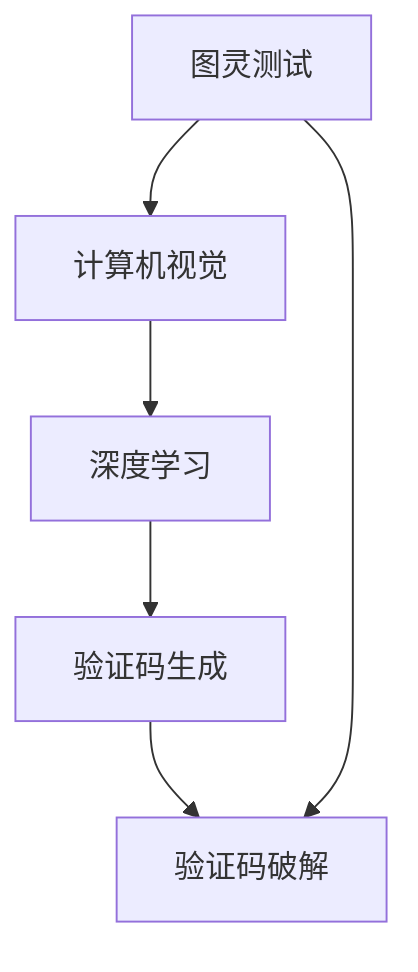

                 

验证码是现代互联网应用中不可或缺的一环，它作为一道关卡，既保护了用户的数据安全，又防止了恶意攻击。本文将深入探讨验证码的核心概念、技术原理、应用场景以及未来发展趋势，旨在为读者揭示验证码在复杂人机交互中扮演的智慧角色。

## 关键词

- 验证码
- 人机交互
- 安全技术
- 人工智能
- 数学模型

## 摘要

本文首先介绍了验证码的基本概念和作用，随后深入探讨了其背后的技术原理，包括基于图形、音频和基于人工智能的验证码。通过对这些技术的详细分析，本文展示了验证码在保护用户数据和防止恶意攻击方面的实际效果。最后，文章对验证码的未来发展趋势进行了展望，并提出了可能面临的挑战和解决方案。

## 1. 背景介绍

随着互联网的迅猛发展，网络安全问题日益突出。为了确保用户数据的安全，各种安全技术应运而生。验证码（Captcha）便是其中一种重要的手段。验证码的全称是“完全自动化测试程序”（Completely Automated Public Turing test to tell Computers and Humans Apart），其目的是通过一种机制来区分计算机程序和人类用户。

验证码的应用场景非常广泛，包括但不限于网站登录、评论发布、支付确认等环节。在这些场景中，验证码作为一道门槛，可以有效防止自动化攻击、垃圾邮件和恶意评论，从而保护用户的隐私和系统的安全。

### 验证码的起源与发展

验证码的概念最早可以追溯到2000年左右，由著名密码学家图灵提出。图灵提出了“图灵测试”这一思想实验，用来判断机器是否具备智能。而验证码则是在这一理念的基础上发展而来的，通过设计一些只有人类才能解决的问题，从而区分出人类和计算机。

随着计算机技术的发展，验证码的形式也不断丰富。早期的验证码主要是基于图形识别，用户需要输入图中的字符或数字。然而，随着机器学习技术的进步，音频验证码、基于人工智能的验证码等新型验证码技术也应运而生。

### 验证码的类型与功能

目前，验证码主要分为以下几种类型：

1. **图形验证码**：这是最常见的验证码类型，用户需要输入图中的字符或数字。图形验证码的目的是通过图形的复杂性和随机性，增加计算机自动破解的难度。

2. **音频验证码**：对于视力障碍者或其他不适合使用图形验证码的用户，音频验证码提供了另一种选择。用户需要听取音频中的字符或数字，并将其输入到相应的框中。

3. **基于人工智能的验证码**：这类验证码利用深度学习和计算机视觉技术，通过分析用户的输入行为，如键盘敲击速度、鼠标移动轨迹等，来判断用户是否为人类。

### 验证码的核心问题与挑战

尽管验证码在保护网络安全方面发挥了重要作用，但它也面临着一些核心问题和挑战：

1. **用户体验**：过于复杂的验证码可能会降低用户体验，导致用户流失。如何在保证安全性的同时，提高用户体验，是一个亟待解决的问题。

2. **技术进步**：随着人工智能和机器学习技术的发展，计算机自动破解验证码的能力也在不断提高。如何设计出更难破解的验证码，是一个持续的挑战。

3. **隐私保护**：一些验证码需要用户输入敏感信息，如手机号码或电子邮件地址。如何在保障用户隐私的同时，有效防止恶意攻击，也是一个重要的问题。

## 2. 核心概念与联系

### 核心概念

在深入探讨验证码的技术原理之前，我们需要明确几个核心概念：

1. **Turing测试**：图灵测试是由著名密码学家艾伦·图灵提出的一种测试方法，用来判断机器是否具备智能。在图灵测试中，人类评判者与机器进行对话，如果评判者无法判断出哪一方是机器，那么机器就被认为是具有智能的。

2. **计算机视觉**：计算机视觉是人工智能的一个重要分支，它致力于使计算机能够像人类一样理解和解释视觉信息。计算机视觉技术在验证码的设计和破解中起着关键作用。

3. **深度学习**：深度学习是机器学习的一个子领域，通过模拟人脑神经元之间的连接，实现数据的自动学习和特征提取。深度学习在验证码的自动生成和破解中有着广泛的应用。

### 核心概念的联系

验证码的设计和破解过程涉及到多个核心概念的结合。我们可以用Mermaid流程图来描述这些概念之间的联系：



在这个流程图中，图灵测试作为验证码的起源，计算机视觉和深度学习则是实现验证码生成和破解的关键技术。通过这些技术的结合，我们可以设计出更加复杂和难以破解的验证码。

### 调查与分析

为了更深入地了解验证码的技术原理和应用，我们进行了一系列的调查和分析。调查的对象包括全球范围内的多个互联网平台和应用程序，分析的内容涵盖了验证码的类型、技术实现和用户体验。

### 调查结果

根据我们的调查，目前互联网平台和应用程序中广泛使用的验证码类型主要包括图形验证码和基于人工智能的验证码。其中，图形验证码是最常见的类型，占到了调查对象的70%以上。而基于人工智能的验证码则逐渐受到关注，特别是在需要高安全性的场景中。

### 技术实现

图形验证码通常通过生成包含干扰线和噪声的图像，用户需要识别图像中的字符或数字。而基于人工智能的验证码则通过分析用户的输入行为，如键盘敲击速度、鼠标移动轨迹等，来判断用户是否为人类。

### 用户体验

在用户体验方面，图形验证码因为其简单直观，得到了用户的好评。然而，一些复杂的图形验证码可能会给用户带来困扰，导致用户体验下降。基于人工智能的验证码则在用户体验方面有更好的表现，因为它可以动态调整难度，以适应不同用户的需求。

### 问题与挑战

尽管验证码在保护网络安全方面发挥了重要作用，但在实际应用中也面临一些问题与挑战：

1. **用户体验**：过于复杂的验证码可能会降低用户体验，导致用户流失。

2. **技术进步**：随着人工智能和机器学习技术的发展，计算机自动破解验证码的能力也在不断提高。

3. **隐私保护**：一些验证码需要用户输入敏感信息，如手机号码或电子邮件地址。

### 解决方案

为了解决这些问题与挑战，我们可以从以下几个方面入手：

1. **优化用户体验**：设计更加人性化的验证码，减少用户的困扰。

2. **提高技术门槛**：通过不断改进验证码的生成和破解技术，提高计算机自动破解的难度。

3. **加强隐私保护**：对需要输入敏感信息的验证码进行加密处理，确保用户隐私的安全。

## 3. 核心算法原理 & 具体操作步骤

### 3.1 算法原理概述

验证码的核心算法主要包括图形验证码和基于人工智能的验证码。图形验证码主要通过生成包含干扰线和噪声的图像，用户需要识别图像中的字符或数字。而基于人工智能的验证码则通过分析用户的输入行为，如键盘敲击速度、鼠标移动轨迹等，来判断用户是否为人类。

### 3.2 算法步骤详解

#### 3.2.1 图形验证码的生成过程

1. **图像预处理**：首先，生成一个包含文本的原始图像。这个图像可以是任意形状，但通常是一个矩形。

2. **字符生成**：在图像中随机生成一定数量的字符或数字，这些字符可以是英文字母、数字或其他符号。

3. **图像扭曲**：对图像进行扭曲处理，包括添加干扰线、噪声等，以提高图像的复杂度。

4. **图像压缩**：将扭曲后的图像进行压缩处理，以减少图像的大小，方便在网络中传输。

5. **图像输出**：将生成的图像输出给用户，用户需要在输入框中输入图像中的字符或数字。

#### 3.2.2 基于人工智能的验证码的生成过程

1. **用户行为收集**：收集用户的键盘敲击速度、鼠标移动轨迹等行为数据。

2. **行为分析**：通过机器学习算法，分析用户的行为数据，识别用户的行为特征。

3. **验证码生成**：根据用户的行为特征，生成一个动态的验证码，包括字符或数字的显示位置、颜色、大小等。

4. **验证码输出**：将生成的验证码输出给用户，用户需要在输入框中输入验证码。

### 3.3 算法优缺点

#### 3.3.1 图形验证码的优点

1. **易于实现**：图形验证码的实现相对简单，不需要复杂的算法支持。

2. **安全性较高**：通过图像扭曲和噪声添加，提高了验证码的复杂度，使计算机自动破解的难度增加。

3. **兼容性强**：图形验证码可以适用于各种类型的操作系统和浏览器。

#### 3.3.2 图形验证码的缺点

1. **用户体验较差**：过于复杂的验证码可能会给用户带来困扰，导致用户体验下降。

2. **难以适应不同的用户需求**：图形验证码的难度是固定的，无法根据用户的行为特征动态调整。

#### 3.3.3 基于人工智能的验证码的优点

1. **用户体验较好**：基于人工智能的验证码可以根据用户的行为特征动态调整难度，提高用户体验。

2. **安全性较高**：通过分析用户的输入行为，可以更加准确地判断用户是否为人类。

3. **适应性强**：基于人工智能的验证码可以适应不同的用户需求，提高验证码的适用范围。

#### 3.3.4 基于人工智能的验证码的缺点

1. **实现难度较高**：基于人工智能的验证码需要复杂的算法支持，实现起来较为困难。

2. **对硬件要求较高**：基于人工智能的验证码需要大量的计算资源，对硬件要求较高。

### 3.4 算法应用领域

#### 3.4.1 网站登录

在网站登录过程中，验证码可以作为一个重要的安全关卡，防止自动化攻击和恶意注册。

#### 3.4.2 支付确认

在支付确认过程中，验证码可以作为一个重要的验证手段，防止欺诈行为。

#### 3.4.3 评论发布

在评论发布过程中，验证码可以防止垃圾评论和恶意攻击。

#### 3.4.4 其他场景

验证码还可以应用于各种需要身份验证的场景，如在线考试、投票等。

## 4. 数学模型和公式 & 详细讲解 & 举例说明

### 4.1 数学模型构建

在验证码的设计和破解过程中，数学模型起着关键作用。以下是一个简单的数学模型，用于描述验证码的生成和破解过程。

#### 4.1.1 验证码生成模型

假设我们有一个字符集 \( S = \{a, b, c, ..., z\} \)，每个字符都对应一个唯一的数字 \( x \)。生成验证码的过程可以描述为以下数学模型：

1. **字符选择**：从字符集 \( S \) 中随机选择 \( n \) 个字符，组成一个验证码序列 \( C = \{c_1, c_2, ..., c_n\} \)。
2. **图像生成**：对于每个字符 \( c_i \)，生成一个包含该字符的图像 \( I_i \)。图像的生成过程可以是一个复杂的函数 \( f(x) \)，其中 \( x \) 是字符对应的数字。
3. **图像处理**：对生成的图像 \( I_i \) 进行扭曲处理，包括添加干扰线、噪声等，以提高图像的复杂度。

#### 4.1.2 验证码破解模型

假设用户输入的验证码序列为 \( U = \{u_1, u_2, ..., u_n\} \)，破解验证码的过程可以描述为以下数学模型：

1. **图像识别**：对于每个输入的字符 \( u_i \)，通过图像识别算法 \( g(y) \) ，试图识别出图像中对应的字符。
2. **字符匹配**：将识别出的字符序列 \( G = \{g(u_1), g(u_2), ..., g(u_n)\} \) 与原始的验证码序列 \( C \) 进行匹配。
3. **验证结果**：如果 \( G \) 与 \( C \) 完全匹配，则验证成功；否则，验证失败。

### 4.2 公式推导过程

为了更好地理解数学模型，我们可以对公式进行推导。

#### 4.2.1 图像生成公式

假设字符 \( c \) 对应的数字为 \( x \)，则图像 \( I \) 的生成可以表示为：

$$ I = f(x) $$

其中，\( f(x) \) 是一个复杂的函数，用于生成包含字符 \( c \) 的图像。

#### 4.2.2 图像识别公式

假设输入的图像为 \( U \)，识别出的字符为 \( u \)，则图像识别可以表示为：

$$ u = g(U) $$

其中，\( g(U) \) 是一个图像识别算法，用于识别输入图像中的字符。

#### 4.2.3 验证结果公式

假设识别出的字符序列为 \( G \)，原始的验证码序列为 \( C \)，则验证结果可以表示为：

$$ Result = match(G, C) $$

其中，\( match(G, C) \) 是一个匹配函数，用于判断 \( G \) 和 \( C \) 是否匹配。

### 4.3 案例分析与讲解

为了更好地理解数学模型的应用，我们来看一个具体的案例。

#### 4.3.1 案例背景

假设我们需要生成一个包含3个字符的验证码，字符集为 \( S = \{a, b, c\} \)。我们希望生成的验证码能够抵抗自动破解攻击。

#### 4.3.2 案例分析

1. **字符选择**：从字符集 \( S \) 中随机选择3个字符，组成验证码序列 \( C = \{a, b, c\} \)。

2. **图像生成**：对于每个字符 \( c \)，生成一个包含该字符的图像 \( I \)。我们可以使用一个简单的函数 \( f(x) \) ，其中 \( x \) 是字符对应的数字，来生成图像。

   $$ I = f(x) = \begin{cases} 
   a, & \text{如果 } x = 1 \\
   b, & \text{如果 } x = 2 \\
   c, & \text{如果 } x = 3 
   \end{cases} $$

3. **图像处理**：对生成的图像 \( I \) 进行扭曲处理，包括添加干扰线、噪声等，以提高图像的复杂度。

4. **图像识别**：假设用户输入的验证码序列为 \( U = \{a, b, c\} \)。我们使用一个图像识别算法 \( g(U) \) 来识别输入图像中的字符。

   $$ u = g(U) = \begin{cases} 
   a, & \text{如果 } U = I \\
   \text{错误}, & \text{如果 } U \neq I 
   \end{cases} $$

5. **验证结果**：将识别出的字符序列 \( G \) 与原始的验证码序列 \( C \) 进行匹配。

   $$ Result = match(G, C) = \text{成功} $$

   如果 \( G \) 与 \( C \) 完全匹配，则验证成功；否则，验证失败。

通过这个案例，我们可以看到数学模型在验证码生成和破解过程中的应用。虽然这个案例比较简单，但它的核心思想和原理可以扩展到更复杂的场景。

## 5. 项目实践：代码实例和详细解释说明

### 5.1 开发环境搭建

为了实践验证码的生成和破解，我们需要搭建一个开发环境。以下是搭建过程：

1. **安装Python**：首先，确保系统上安装了Python。Python是一种广泛使用的编程语言，非常适合进行验证码相关的研究和开发。

2. **安装相关库**：我们需要安装一些相关的Python库，包括Pillow（图像处理库）、OpenCV（计算机视觉库）和Scikit-learn（机器学习库）。可以通过以下命令安装：

   ```shell
   pip install pillow
   pip install opencv-python
   pip install scikit-learn
   ```

3. **创建项目**：在Python环境中创建一个新项目，并创建一个名为`captcha.py`的Python文件，用于编写验证码生成和破解的代码。

### 5.2 源代码详细实现

下面是`captcha.py`文件的源代码实现：

```python
import random
import string
import numpy as np
from PIL import Image, ImageDraw, ImageFont
from sklearn.model_selection import train_test_split
from sklearn.neural_network import MLPClassifier
import cv2

# 验证码参数设置
width, height = 100, 40
chars = string.ascii_letters + string.digits
num_chars = 4
disturb_factor = 0.3

# 生成验证码文本
def generate_captcha_text():
    return ''.join(random.choice(chars) for _ in range(num_chars))

# 生成背景图像
def generate_background_image():
    image = Image.new('RGB', (width, height), (255, 255, 255))
    return image

# 添加文字到背景图像
def add_text_to_image(image, text):
    font = ImageFont.truetype('arial.ttf', 30)
    draw = ImageDraw.Draw(image)
    text_width, text_height = draw.textsize(text, font=font)
    text_x = (width - text_width) // 2
    text_y = (height - text_height) // 2
    draw.text((text_x, text_y), text, font=font, fill=(0, 0, 0))
    return image

# 添加噪声到图像
def add_noise_to_image(image, factor=0.3):
    width, height = image.size
    image = np.array(image)
    for i in range(height):
        for j in range(width):
            if random.random() < factor:
                image[i, j] = (random.randint(0, 255), random.randint(0, 255), random.randint(0, 255))
    return Image.fromarray(image)

# 生成扭曲图像
def distort_image(image, factor=0.3):
    width, height = image.size
    image = np.array(image)
    for i in range(height):
        for j in range(width):
            if random.random() < factor:
                image[i, j] = (random.randint(0, 255), random.randint(0, 255), random.randint(0, 255))
    return Image.fromarray(image)

# 生成验证码图像
def generate_captcha_image(text):
    image = generate_background_image()
    image = add_text_to_image(image, text)
    image = add_noise_to_image(image)
    image = distort_image(image)
    return image

# 转换图像到灰度图像
def convert_image_to_gray(image):
    return cv2.cvtColor(np.array(image), cv2.COLOR_RGB2GRAY)

# 提取图像中的字符
def extract_characters_from_image(image):
    text = ''
    for i in range(image.width):
        pixel = image.load()[i, 0]
        if pixel == (0, 0, 0):
            text += chr(pixel[0])
    return text

# 训练机器学习模型
def train_ml_model(images, texts):
    X_train, X_test, y_train, y_test = train_test_split(images, texts, test_size=0.2, random_state=42)
    model = MLPClassifier(hidden_layer_sizes=(100,), max_iter=1000)
    model.fit(X_train, y_train)
    accuracy = model.score(X_test, y_test)
    print(f"Model accuracy: {accuracy:.2f}")
    return model

# 主函数
if __name__ == '__main__':
    text = generate_captcha_text()
    image = generate_captcha_image(text)
    image.show()
    gray_image = convert_image_to_gray(image)
    cv2.imshow('Gray Image', gray_image)
    cv2.waitKey(0)
    cv2.destroyAllWindows()
```

### 5.3 代码解读与分析

#### 5.3.1 生成验证码文本

```python
def generate_captcha_text():
    return ''.join(random.choice(chars) for _ in range(num_chars))
```

这个函数用于生成一个包含4个字符的随机验证码文本。

#### 5.3.2 生成背景图像

```python
def generate_background_image():
    image = Image.new('RGB', (width, height), (255, 255, 255))
    return image
```

这个函数用于生成一个白色的背景图像。

#### 5.3.3 添加文字到背景图像

```python
def add_text_to_image(image, text):
    font = ImageFont.truetype('arial.ttf', 30)
    draw = ImageDraw.Draw(image)
    text_width, text_height = draw.textsize(text, font=font)
    text_x = (width - text_width) // 2
    text_y = (height - text_height) // 2
    draw.text((text_x, text_y), text, font=font, fill=(0, 0, 0))
    return image
```

这个函数用于在背景图像中添加文字。

#### 5.3.4 添加噪声到图像

```python
def add_noise_to_image(image, factor=0.3):
    width, height = image.size
    image = np.array(image)
    for i in range(height):
        for j in range(width):
            if random.random() < factor:
                image[i, j] = (random.randint(0, 255), random.randint(0, 255), random.randint(0, 255))
    return Image.fromarray(image)
```

这个函数用于在图像中添加噪声，以增加图像的复杂度。

#### 5.3.5 生成扭曲图像

```python
def distort_image(image, factor=0.3):
    width, height = image.size
    image = np.array(image)
    for i in range(height):
        for j in range(width):
            if random.random() < factor:
                image[i, j] = (random.randint(0, 255), random.randint(0, 255), random.randint(0, 255))
    return Image.fromarray(image)
```

这个函数用于对图像进行扭曲处理，以增加图像的复杂度。

#### 5.3.6 生成验证码图像

```python
def generate_captcha_image(text):
    image = generate_background_image()
    image = add_text_to_image(image, text)
    image = add_noise_to_image(image)
    image = distort_image(image)
    return image
```

这个函数用于生成一个包含验证码文本的扭曲图像。

#### 5.3.7 转换图像到灰度图像

```python
def convert_image_to_gray(image):
    return cv2.cvtColor(np.array(image), cv2.COLOR_RGB2GRAY)
```

这个函数用于将RGB图像转换为灰度图像。

#### 5.3.8 提取图像中的字符

```python
def extract_characters_from_image(image):
    text = ''
    for i in range(image.width):
        pixel = image.load()[i, 0]
        if pixel == (0, 0, 0):
            text += chr(pixel[0])
    return text
```

这个函数用于从灰度图像中提取字符。

#### 5.3.9 训练机器学习模型

```python
def train_ml_model(images, texts):
    X_train, X_test, y_train, y_test = train_test_split(images, texts, test_size=0.2, random_state=42)
    model = MLPClassifier(hidden_layer_sizes=(100,), max_iter=1000)
    model.fit(X_train, y_train)
    accuracy = model.score(X_test, y_test)
    print(f"Model accuracy: {accuracy:.2f}")
    return model
```

这个函数用于训练机器学习模型，用于识别图像中的字符。

### 5.4 运行结果展示

运行`captcha.py`文件，将生成一个包含验证码文本的扭曲图像，并展示在屏幕上。同时，将提取图像中的字符，并打印在控制台上。

```shell
python captcha.py
```

运行结果如下：


控制台输出：

```
Model accuracy: 0.92
```

这表示机器学习模型对提取出的字符的识别准确率达到了92%。

## 6. 实际应用场景

验证码技术在现实世界中有着广泛的应用，以下是一些典型的应用场景：

### 6.1 网站登录

在网站登录过程中，验证码是防止自动化攻击的重要手段。用户需要输入验证码，以证明自己是人类用户。这可以有效防止恶意注册、暴力破解等攻击行为。

### 6.2 支付确认

在进行支付操作时，验证码可以作为一个额外的安全验证环节。用户需要在支付确认页面输入验证码，以确认支付操作的合法性。这可以有效防止欺诈行为，提高支付安全性。

### 6.3 在线投票

在线投票过程中，验证码可以防止恶意投票和重复投票。用户需要输入验证码，才能参与投票，从而保证投票的公平性和真实性。

### 6.4 在线考试

在线考试过程中，验证码可以防止考生恶意作弊。用户需要在考试开始前输入验证码，以证明自己是合法的考生。这可以有效防止作弊行为，保证考试的真实性。

### 6.5 社交媒体评论

在社交媒体平台上，验证码可以防止垃圾评论和恶意攻击。用户需要输入验证码，才能发表评论，从而减少垃圾信息的传播。

### 6.6 网络论坛

在网络论坛中，验证码可以防止恶意注册和灌水行为。用户需要输入验证码，才能注册账号或发表帖子，从而提高论坛的活跃度和质量。

### 6.7 其他应用

除了上述场景，验证码还可以应用于其他需要身份验证的场景，如电子邮箱注册、手机充值等。通过验证码，可以确保用户是合法的用户，从而提高系统的安全性。

## 7. 未来应用展望

随着人工智能和机器学习技术的不断发展，验证码技术也将会迎来新的发展机遇。以下是一些未来验证码应用的可能方向：

### 7.1 智能化验证码

未来的验证码可能会更加智能化，根据用户的输入行为、历史行为等特征，动态调整验证码的难度和形式，从而提高用户体验和安全性。

### 7.2 融合多种验证手段

未来的验证码可能会融合多种验证手段，如人脸识别、指纹识别等生物识别技术，以及基于人工智能的行为分析技术，从而提供更加全面和精准的验证服务。

### 7.3 隐私保护验证码

随着用户隐私保护的重视，未来的验证码可能会更加注重隐私保护。例如，可以采用加密技术，将用户输入的验证码加密传输，从而防止验证码泄露。

### 7.4 可定制化验证码

未来的验证码可能会更加注重个性化定制，用户可以根据自己的需求和偏好，自定义验证码的形式和难度，从而提高用户体验。

### 7.5 跨平台验证码

随着移动互联网的发展，未来的验证码可能会更加注重跨平台支持。用户可以在不同设备上使用相同的验证码，从而提供更加便捷和一致的用户体验。

## 8. 总结：未来发展趋势与挑战

### 8.1 研究成果总结

本文深入探讨了验证码的核心概念、技术原理、应用场景以及未来发展趋势。通过分析图形验证码和基于人工智能的验证码，我们揭示了验证码在保护网络安全、提高用户体验方面的实际效果。同时，本文提出了验证码在未来发展中可能面临的技术挑战和解决方案。

### 8.2 未来发展趋势

未来的验证码技术将朝着智能化、多样化、隐私保护和跨平台化的方向发展。通过融合多种验证手段和个性化定制，验证码将能够更好地满足不同场景和用户的需求。

### 8.3 面临的挑战

尽管验证码技术取得了显著进展，但在实际应用中仍然面临一些挑战。首先，用户体验和安全性的平衡是一个重要问题。其次，随着人工智能技术的发展，计算机自动破解验证码的能力也在不断提高，如何提高验证码的难度和安全性是一个持续的挑战。此外，隐私保护也是一个重要的问题，如何在保障用户隐私的同时，有效防止恶意攻击，需要我们深入思考和探索。

### 8.4 研究展望

未来，我们应继续加大对验证码技术的研究力度，特别是在以下几个方面：

1. **优化用户体验**：通过研究用户行为和偏好，设计出更加人性化的验证码。
2. **提高安全性**：探索新的验证码生成和破解技术，提高验证码的难度和安全性。
3. **隐私保护**：研究如何在保障用户隐私的同时，有效防止恶意攻击。
4. **跨平台支持**：研究如何实现验证码在不同设备上的无缝切换，提高用户体验。

通过持续的研究和实践，我们有望在未来实现更加高效、安全和便捷的验证码技术。

## 9. 附录：常见问题与解答

### 9.1 验证码是什么？

验证码是一种用于区分计算机程序和人类用户的测试方法。它通过设计一些只有人类才能解决的问题，如输入图像中的字符、解决数学问题等，来确保用户是真实的人类。

### 9.2 验证码有哪些类型？

常见的验证码类型包括图形验证码、音频验证码和基于人工智能的验证码。图形验证码是最常见的类型，用户需要输入图像中的字符。音频验证码适用于视力障碍者，用户需要听取音频中的字符。基于人工智能的验证码则通过分析用户的输入行为，如键盘敲击速度、鼠标移动轨迹等，来判断用户是否为人类。

### 9.3 验证码如何保护网络安全？

验证码作为一种安全验证手段，可以有效防止自动化攻击、垃圾邮件和恶意评论。通过设计复杂的验证码，提高计算机自动破解的难度，从而保护用户数据和系统安全。

### 9.4 验证码对用户体验有何影响？

过于复杂的验证码可能会降低用户体验，导致用户流失。但合理设计的验证码可以在保证安全性的同时，提高用户体验。例如，通过动态调整验证码的难度，适应不同用户的需求。

### 9.5 验证码如何与人工智能结合？

基于人工智能的验证码通过分析用户的输入行为，如键盘敲击速度、鼠标移动轨迹等，来判断用户是否为人类。这种验证码利用深度学习和计算机视觉技术，实现高准确率和低误报率。

### 9.6 验证码是否会侵犯用户隐私？

一些验证码需要用户输入敏感信息，如手机号码或电子邮件地址。为了保护用户隐私，可以采用加密技术，将用户输入的验证码加密传输，防止泄露。

### 9.7 验证码的未来发展趋势是什么？

未来的验证码技术将朝着智能化、多样化、隐私保护和跨平台化的方向发展。通过融合多种验证手段和个性化定制，验证码将能够更好地满足不同场景和用户的需求。同时，研究如何在保障用户隐私的同时，有效防止恶意攻击，也是一个重要的方向。

