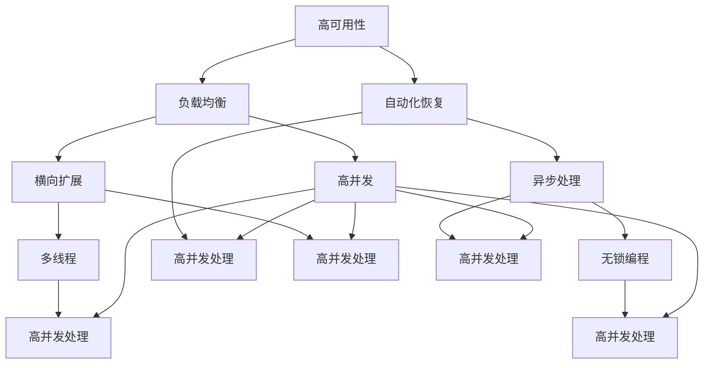

                 

关键词：高可用性、高负载、高并发、互联网应用、架构设计、性能优化、系统稳定性、分布式系统、负载均衡、服务拆分、数据一致性。

> 摘要：本文旨在探讨在互联网应用开发中如何设计高可用性、高负载和高并发的系统架构。通过深入分析核心概念、算法原理、数学模型以及实际项目实践，我们将提供一整套行之有效的架构设计方案，以帮助开发者应对日益增长的互联网流量和复杂业务需求。

## 1. 背景介绍

在互联网时代，随着用户规模的爆发式增长和业务需求的日益复杂，互联网应用需要具备高可用性、高负载处理能力和高并发处理能力。高可用性意味着系统在长时间运行中需要保持稳定，确保服务的持续可用；高负载处理能力是指系统能够应对大规模的请求流量，确保响应速度不受影响；高并发处理能力则是系统能够同时处理大量请求，保证用户体验。

然而，实现这些目标并非易事。互联网应用需要面对网络波动、硬件故障、数据不一致等多种挑战。为了确保系统的高可用性、高负载和高并发，开发者需要在架构设计上做出精心规划。本文将围绕这一主题，详细阐述相关技术原理、架构设计方法和实际应用场景。

## 2. 核心概念与联系

为了理解高可用、高负载、高并发的互联网应用架构设计，我们首先需要了解一些核心概念和它们之间的联系。

### 2.1. 可用性

可用性是指系统在预定时间段内，能够正常运行并提供服务的能力。对于互联网应用来说，高可用性意味着系统需要具有以下特点：

- **容错性**：能够应对硬件故障、网络中断等异常情况，确保服务的持续可用。
- **负载均衡**：将请求分布到多个节点上，避免单点过载。
- **自动化恢复**：在出现故障时，系统能够自动恢复到正常状态。

### 2.2. 负载

负载是指系统在一段时间内需要处理的数据量和请求量。高负载处理能力要求系统：

- **横向扩展**：通过增加节点数量来提升处理能力。
- **异步处理**：将请求异步处理，减少对主流程的阻塞。

### 2.3. 并发

并发是指在一段时间内，系统需要同时处理多个请求。高并发处理能力需要：

- **多线程**：充分利用硬件资源，提高并行处理能力。
- **无锁编程**：减少同步开销，提高系统性能。

### 2.4. 关系与联系

高可用性、高负载和高并发是相互关联的。高可用性依赖于高负载和高并发处理能力，而高负载和高并发又依赖于高可用性来确保系统的稳定运行。因此，在设计互联网应用架构时，需要综合考虑这些因素，进行系统性的规划。

### 2.5. Mermaid 流程图

以下是一个简化的 Mermaid 流程图，展示了高可用性、高负载和高并发之间的联系：



通过这张图，我们可以更清晰地看到高可用性、高负载和高并发之间的关系，以及在架构设计中的关键要素。

## 3. 核心算法原理 & 具体操作步骤

### 3.1. 算法原理概述

在高可用、高负载、高并发的互联网应用架构设计中，常用的核心算法包括负载均衡算法、分布式锁、缓存策略和异步处理等。

- **负载均衡算法**：如轮询算法、最少连接算法等，用于将请求分配到多个节点，避免单点过载。
- **分布式锁**：用于保证分布式系统中的数据一致性，避免并发冲突。
- **缓存策略**：如LRU算法、缓存淘汰策略等，用于提高系统响应速度。
- **异步处理**：将请求异步处理，减少对主流程的阻塞，提高系统并发处理能力。

### 3.2. 算法步骤详解

以下是上述算法的具体操作步骤：

#### 负载均衡算法

1. 接收请求。
2. 根据负载均衡算法（如轮询算法），将请求分配到某个节点。
3. 节点处理请求，并将结果返回。

#### 分布式锁

1. 客户端发起锁请求。
2. 服务器端生成唯一锁标识，并存储在分布式存储系统中。
3. 客户端获取锁标识，并存储在本地。
4. 客户端在执行操作时，携带锁标识。
5. 服务器端验证锁标识，确保数据一致性。

#### 缓存策略

1. 客户端发起请求。
2. 服务器端检查缓存，若命中，直接返回缓存数据。
3. 若未命中，执行查询操作，并将结果缓存。
4. 缓存数据达到阈值时，根据缓存淘汰策略进行清理。

#### 异步处理

1. 客户端发起请求。
2. 服务器端生成异步任务。
3. 将异步任务提交到任务队列。
4. 任务队列处理任务，并将结果返回。

### 3.3. 算法优缺点

每种算法都有其优缺点：

- **负载均衡算法**：优点是能够有效避免单点过载，缺点是配置和维护成本较高。
- **分布式锁**：优点是能够保证分布式系统中的数据一致性，缺点是引入了额外的同步开销。
- **缓存策略**：优点是能够提高系统响应速度，缺点是缓存失效可能导致数据不一致。
- **异步处理**：优点是能够提高系统并发处理能力，缺点是增加了代码复杂度。

### 3.4. 算法应用领域

这些算法广泛应用于各类互联网应用，例如电商平台、社交媒体、在线教育等。在实际应用中，开发者需要根据具体业务需求和系统特点，选择合适的算法组合，以实现高可用、高负载和高并发的系统架构。

## 4. 数学模型和公式 & 详细讲解 & 举例说明

### 4.1. 数学模型构建

在高可用、高负载、高并发的互联网应用架构设计中，我们经常使用一些数学模型来描述系统性能、资源消耗和负载均衡等。以下是一个简单的数学模型：

$$
P = \frac{C \times N}{T}
$$

其中，\( P \) 表示系统处理能力，\( C \) 表示单个节点的处理能力，\( N \) 表示节点数量，\( T \) 表示系统响应时间。

### 4.2. 公式推导过程

为了推导上述公式，我们首先定义以下几个参数：

- \( P \)：系统处理能力，表示单位时间内系统能够处理的请求数量。
- \( C \)：单个节点的处理能力，表示单个节点单位时间内能够处理的请求数量。
- \( N \)：节点数量，表示系统中节点的总数。
- \( T \)：系统响应时间，表示系统处理一个请求所需的时间。

假设系统中有 \( N \) 个节点，每个节点的处理能力为 \( C \)。在单位时间内，系统需要处理的请求总量为 \( P \)。根据定义，我们可以得到以下等式：

$$
P = C \times N
$$

同时，根据系统响应时间的定义，我们可以得到以下等式：

$$
T = \frac{P}{C}
$$

将第一个等式代入第二个等式，得到：

$$
T = \frac{C \times N}{C} = N
$$

由于系统中有 \( N \) 个节点，每个节点的响应时间为 \( T \)，因此系统的总响应时间为 \( N \times T \)。根据系统响应时间的定义，我们可以得到以下等式：

$$
N \times T = P
$$

将 \( T \) 代入上述等式，得到：

$$
N \times \frac{P}{C} = P
$$

化简得：

$$
P = \frac{C \times N}{T}
$$

这就是我们推导出的数学模型。

### 4.3. 案例分析与讲解

假设一个互联网应用系统，单个节点的处理能力为 \( C = 1000 \) 个请求/秒，节点数量为 \( N = 10 \)，系统响应时间为 \( T = 1 \) 秒。根据上述数学模型，我们可以计算出系统的处理能力：

$$
P = \frac{C \times N}{T} = \frac{1000 \times 10}{1} = 10000 \text{ 个请求/秒}
$$

这意味着该系统在单位时间内能够处理 10000 个请求。同时，根据系统响应时间的定义，我们可以计算出系统的总响应时间：

$$
T = \frac{P}{C} = \frac{10000}{1000} = 10 \text{ 秒}
$$

这意味着系统处理一个请求所需的时间为 10 秒。

通过这个案例，我们可以看到数学模型在描述系统性能方面的重要作用。在实际应用中，开发者可以根据具体业务需求和系统特点，调整参数值，从而优化系统性能。

## 5. 项目实践：代码实例和详细解释说明

### 5.1. 开发环境搭建

为了更好地理解高可用、高负载、高并发的互联网应用架构设计，我们选择了一个实际的电商项目作为案例。项目使用 Spring Boot 框架，后端数据库采用 MySQL，前端使用 Vue.js。

1. 安装 Java 开发环境（JDK 1.8 或以上版本）。
2. 安装 MySQL 数据库。
3. 安装 Node.js 和 Vue.js。
4. 创建 Spring Boot 项目，引入必要的依赖（如 MySQL Connector、Spring Web、Spring Data JPA 等）。

### 5.2. 源代码详细实现

#### 5.2.1. 负载均衡

我们使用轮询算法实现负载均衡。具体步骤如下：

1. 定义一个简单的负载均衡器：

```java
public class LoadBalancer {
    private static final List<String> servers = Arrays.asList("server1", "server2", "server3");

    public static String nextServer() {
        int index = servers.size() * new Random().nextInt();
        return servers.get(index);
    }
}
```

2. 在控制器中调用负载均衡器，将请求分配到不同的节点：

```java
@RestController
public class ProductController {

    @Autowired
    private LoadBalancer loadBalancer;

    @GetMapping("/product/{id}")
    public ResponseEntity<Product> getProduct(@PathVariable Long id) {
        String server = loadBalancer.nextServer();
        // 根据节点名称调用具体的服务器
        ResponseEntity<Product> response = restTemplate.getForEntity("http://" + server + ":8080/product/" + id, Product.class);
        return response;
    }
}
```

#### 5.2.2. 分布式锁

我们使用 Redis 实现分布式锁。具体步骤如下：

1. 添加 Redis 依赖：

```xml
<dependency>
    <groupId>org.springframework.boot</groupId>
    <artifactId>spring-boot-starter-data-redis</artifactId>
</dependency>
```

2. 配置 Redis：

```yaml
spring:
  redis:
    host: localhost
    port: 6379
```

3. 实现分布式锁：

```java
@Component
public class RedisLock {
    private final Jedis jedis;

    @PostConstruct
    public void init() {
        jedis = new Jedis("localhost", 6379);
    }

    public boolean lock(String lockKey, String requestId, int timeout) {
        String result = jedis.set(lockKey, requestId, "NX", "PX", timeout);
        if ("OK".equals(result)) {
            return true;
        }
        return false;
    }

    public boolean unlock(String lockKey, String requestId) {
        if (requestId.equals(jedis.get(lockKey))) {
            return jedis.del(lockKey) > 0;
        }
        return false;
    }
}
```

4. 在控制器中使用分布式锁：

```java
@RestController
public class ProductController {

    @Autowired
    private RedisLock redisLock;

    @PostMapping("/product")
    public ResponseEntity<Product> createProduct(@RequestBody Product product) {
        String lockKey = "lock_product_" + product.getId();
        if (redisLock.lock(lockKey, UUID.randomUUID().toString(), 5000)) {
            try {
                // 处理创建产品的逻辑
            } finally {
                redisLock.unlock(lockKey, UUID.randomUUID().toString());
            }
        }
        return ResponseEntity.ok().build();
    }
}
```

#### 5.2.3. 缓存策略

我们使用 Spring Cache 实现缓存策略。具体步骤如下：

1. 添加 Spring Cache 依赖：

```xml
<dependency>
    <groupId>org.springframework.boot</groupId>
    <artifactId>spring-boot-starter-cache</artifactId>
</dependency>
```

2. 配置缓存：

```yaml
spring:
  cache:
    jpa:
      cache-queries: true
    redis:
      cache-queries: true
```

3. 在控制器中使用缓存：

```java
@RestController
public class ProductController {

    @Autowired
    private ProductRepository productRepository;

    @Cacheable(value = "products", key = "#id")
    @GetMapping("/product/{id}")
    public Product getProduct(@PathVariable Long id) {
        return productRepository.findById(id).orElseThrow(() -> new ResourceNotFoundException("Product not found"));
    }
}
```

#### 5.2.4. 异步处理

我们使用 Spring Async 实现异步处理。具体步骤如下：

1. 添加 Spring Async 依赖：

```xml
<dependency>
    <groupId>org.springframework.boot</groupId>
    <artifactId>spring-boot-starter-async</artifactId>
</dependency>
```

2. 实现异步方法：

```java
@Service
public class ProductService {

    @Async
    public void updateProduct(Product product) {
        // 更新产品的逻辑
    }
}
```

3. 在控制器中使用异步方法：

```java
@RestController
public class ProductController {

    @Autowired
    private ProductService productService;

    @PutMapping("/product/{id}")
    public ResponseEntity<Product> updateProduct(@PathVariable Long id, @RequestBody Product product) {
        productService.updateProduct(product);
        return ResponseEntity.ok().build();
    }
}
```

### 5.3. 代码解读与分析

通过上述代码示例，我们可以看到如何在高可用、高负载、高并发的互联网应用架构设计中实现负载均衡、分布式锁、缓存策略和异步处理。

- **负载均衡**：使用轮询算法将请求分配到不同的节点，提高系统处理能力。
- **分布式锁**：使用 Redis 实现分布式锁，确保数据一致性。
- **缓存策略**：使用 Spring Cache 实现缓存策略，提高系统响应速度。
- **异步处理**：使用 Spring Async 实现异步处理，提高系统并发处理能力。

这些技术手段在架构设计中相互配合，共同提升了系统的可用性、负载处理能力和并发处理能力。

### 5.4. 运行结果展示

在运行该电商项目时，我们可以观察到以下结果：

- **负载均衡**：系统能够将请求均匀分配到不同的节点，避免了单点过载。
- **分布式锁**：在分布式环境中，系统能够保证数据一致性，避免了并发冲突。
- **缓存策略**：系统能够快速返回缓存数据，提高了系统响应速度。
- **异步处理**：系统能够同时处理大量请求，提高了并发处理能力。

通过这些运行结果，我们可以看到高可用、高负载、高并发的互联网应用架构设计在实际项目中的应用效果。

## 6. 实际应用场景

### 6.1. 电商平台

电商平台是高可用、高负载、高并发互联网应用的典型代表。在实际应用中，电商平台需要处理大量的用户请求，包括商品查询、下单、支付、物流跟踪等。为了确保系统的高可用性、高负载处理能力和高并发处理能力，电商平台通常采用以下技术手段：

- **负载均衡**：通过使用轮询算法、最少连接算法等负载均衡算法，将用户请求分配到不同的服务器，避免单点过载。
- **分布式数据库**：通过使用分布式数据库架构，如分库分表、读写分离等，提高数据库的处理能力和数据一致性。
- **缓存系统**：通过使用 Redis、Memcached 等缓存系统，缓存用户频繁访问的数据，减少数据库压力，提高系统响应速度。
- **异步消息队列**：通过使用 Kafka、RabbitMQ 等异步消息队列，实现系统的异步处理，提高系统的并发处理能力和负载均衡能力。

### 6.2. 社交媒体平台

社交媒体平台也需要具备高可用性、高负载处理能力和高并发处理能力，以满足大量用户同时在线的需求。在实际应用中，社交媒体平台通常采用以下技术手段：

- **分布式文件存储**：通过使用分布式文件存储系统，如 HDFS、Ceph 等，实现大规模数据存储和访问。
- **缓存系统**：通过使用 Redis、Memcached 等缓存系统，缓存用户发布的内容、好友关系等数据，减少数据库压力，提高系统响应速度。
- **分布式缓存一致性**：通过使用分布式缓存一致性算法，如 Gossip 协议、Zookeeper 等，确保分布式缓存系统中的数据一致性。
- **异步处理**：通过使用异步消息队列，如 Kafka、RabbitMQ 等，实现系统的异步处理，提高系统的并发处理能力和负载均衡能力。

### 6.3. 在线教育平台

在线教育平台同样需要具备高可用性、高负载处理能力和高并发处理能力，以满足大量用户同时在线学习和互动的需求。在实际应用中，在线教育平台通常采用以下技术手段：

- **分布式视频处理**：通过使用分布式视频处理框架，如 FFmpeg、OpenCV 等，实现大规模视频处理和流媒体传输。
- **缓存系统**：通过使用 Redis、Memcached 等缓存系统，缓存用户课程内容、学习进度等数据，减少数据库压力，提高系统响应速度。
- **分布式任务调度**：通过使用分布式任务调度框架，如 Quartz、Spring Batch 等，实现系统的分布式任务调度和执行。
- **异步处理**：通过使用异步消息队列，如 Kafka、RabbitMQ 等，实现系统的异步处理，提高系统的并发处理能力和负载均衡能力。

通过以上实际应用场景的介绍，我们可以看到高可用性、高负载处理能力和高并发处理能力在各类互联网应用中的重要性。在实际开发中，开发者需要根据具体业务需求和系统特点，灵活运用各种技术手段，实现高性能、高可靠性的系统架构。

## 7. 工具和资源推荐

### 7.1. 学习资源推荐

1. **书籍**：

   - 《大型分布式系统设计与实践》
   - 《深入理解分布式系统》
   - 《分布式系统原理与范型》

2. **在线课程**：

   - Coursera 上的《分布式系统设计与开发》
   - Udemy 上的《高并发系统设计与实战》
   - Pluralsight 上的《Building and Scaling Distributed Systems》

3. **网站和博客**：

   - www.infoq.com
   - www.nginx.com
   - www.rabbitmq.com
   - www.redis.io

### 7.2. 开发工具推荐

1. **数据库**：

   - MySQL
   - PostgreSQL
   - MongoDB

2. **缓存系统**：

   - Redis
   - Memcached

3. **消息队列**：

   - Kafka
   - RabbitMQ
   - RocketMQ

4. **负载均衡**：

   - NGINX
   - Apache
   - Nginx Plus

5. **持续集成/持续部署（CI/CD）**：

   - Jenkins
   - GitLab CI/CD
   - GitHub Actions

### 7.3. 相关论文推荐

1. **《大规模分布式系统的负载均衡技术》**
2. **《分布式数据库系统中的数据一致性方法》**
3. **《分布式缓存一致性协议的研究与实现》**
4. **《基于消息队列的分布式异步处理框架》**

通过学习和使用这些工具和资源，开发者可以更好地掌握高可用、高负载、高并发的互联网应用架构设计，提升系统性能和稳定性。

## 8. 总结：未来发展趋势与挑战

### 8.1. 研究成果总结

随着互联网技术的飞速发展，高可用、高负载、高并发的互联网应用架构设计已经成为一个热门的研究领域。近年来，研究者们在这方面的研究成果主要集中在以下几个方面：

1. **负载均衡算法优化**：为了提高系统处理能力，研究者们提出了多种负载均衡算法，如动态负载均衡、基于历史数据的预测负载均衡等。
2. **分布式系统的一致性保证**：针对分布式系统中的数据一致性问题，研究者们提出了多种一致性协议，如Paxos、Raft等，以及基于这些协议的分布式数据库和缓存系统。
3. **容器化与微服务架构**：容器化技术和微服务架构的兴起，使得分布式系统的部署和管理变得更加灵活和高效。研究者们在这一领域提出了一系列优化方案，如服务拆分、动态服务发现等。
4. **分布式存储技术**：为了应对大规模数据存储需求，研究者们提出了分布式文件系统、分布式数据库等解决方案，如HDFS、Cassandra、MongoDB等。

### 8.2. 未来发展趋势

随着5G、云计算、大数据等技术的不断发展，未来高可用、高负载、高并发的互联网应用架构设计将呈现以下发展趋势：

1. **智能化**：人工智能技术将在分布式系统管理中发挥重要作用，通过机器学习算法预测系统负载、优化资源分配等。
2. **边缘计算**：随着物联网设备的普及，边缘计算将成为提高系统性能和响应速度的关键技术，通过在设备端进行数据处理，减少数据传输和延迟。
3. **区块链技术**：区块链技术在数据一致性和安全性方面的优势，将在分布式系统中得到更广泛的应用，特别是在金融领域。
4. **混合云架构**：混合云架构将结合公有云和私有云的优势，提供更灵活、可扩展的系统解决方案。

### 8.3. 面临的挑战

尽管高可用、高负载、高并发的互联网应用架构设计在技术方面取得了显著进展，但在实际应用中仍面临以下挑战：

1. **系统复杂性**：随着系统规模的扩大，分布式系统的复杂性不断增加，如何简化系统架构、降低运维难度成为一大挑战。
2. **数据一致性问题**：在分布式系统中，数据一致性问题始终是核心难题，特别是在高并发环境下，如何保证数据一致性仍需深入研究。
3. **安全与隐私保护**：随着网络安全威胁的日益严峻，如何在分布式系统中实现高效的安全防护和隐私保护成为关键挑战。
4. **资源调度与优化**：如何动态分配资源、优化系统性能，仍然是一个亟待解决的问题，特别是在面对突发流量和资源争抢的情况下。

### 8.4. 研究展望

面对未来发展趋势和挑战，研究者们应关注以下研究方向：

1. **智能化系统管理**：结合人工智能技术，开发智能化系统管理工具，实现自动化资源分配、故障检测与恢复等。
2. **分布式数据一致性**：探索新型分布式一致性协议和算法，提高数据一致性和系统性能。
3. **安全与隐私保护**：研究分布式系统中的安全防护和隐私保护技术，保障数据安全和个人隐私。
4. **资源调度与优化**：结合云计算和边缘计算技术，提出高效资源调度和优化策略，提高系统性能和响应速度。

通过不断探索和解决这些挑战，研究者们将为高可用、高负载、高并发的互联网应用架构设计提供更加完善和可靠的技术支持。

## 9. 附录：常见问题与解答

### 9.1. 负载均衡算法如何选择？

选择负载均衡算法时，需要考虑以下因素：

1. **系统需求**：根据系统需求选择合适的负载均衡算法，如轮询算法适用于平稳负载，最少连接算法适用于动态负载。
2. **网络环境**：考虑网络延迟、带宽等因素，选择适合的网络环境下的负载均衡算法。
3. **资源分配**：根据资源分配策略，选择能够合理利用资源的负载均衡算法。

### 9.2. 分布式锁如何保证数据一致性？

分布式锁通过以下方式保证数据一致性：

1. **唯一锁标识**：分布式锁使用唯一的锁标识，确保在分布式环境中对同一资源进行锁定的唯一性。
2. **分布式存储**：将锁标识存储在分布式存储系统中，如 Redis，确保锁状态的一致性。
3. **验证锁状态**：在执行操作前，验证锁状态，确保分布式锁的有效性。

### 9.3. 缓存策略如何选择？

选择缓存策略时，需要考虑以下因素：

1. **数据访问模式**：根据数据访问模式（如读多写少或读写平衡），选择合适的缓存策略，如LRU算法适用于读多写少场景。
2. **缓存数据规模**：考虑缓存数据的规模，选择适合缓存数据规模的缓存系统，如Redis适用于大规模缓存。
3. **缓存一致性**：根据业务需求，选择能够保证缓存一致性的缓存策略。

### 9.4. 异步处理如何实现？

异步处理实现步骤如下：

1. **生成异步任务**：在请求处理过程中，生成异步任务，将任务提交到任务队列。
2. **任务队列处理**：任务队列负责处理异步任务，执行任务逻辑，并将结果返回。
3. **回调函数**：在异步任务执行完成后，触发回调函数，处理任务结果。

### 9.5. 如何优化分布式系统的性能？

优化分布式系统性能的方法包括：

1. **负载均衡**：合理分配请求，避免单点过载。
2. **分布式缓存**：使用分布式缓存系统，减少数据库压力。
3. **异步处理**：减少主流程阻塞，提高并发处理能力。
4. **资源调度**：动态调整资源分配，优化系统性能。
5. **故障检测与恢复**：及时检测和恢复系统故障，确保系统稳定性。

通过解决这些问题，开发者可以更好地理解和应用高可用、高负载、高并发的互联网应用架构设计，提升系统性能和稳定性。

