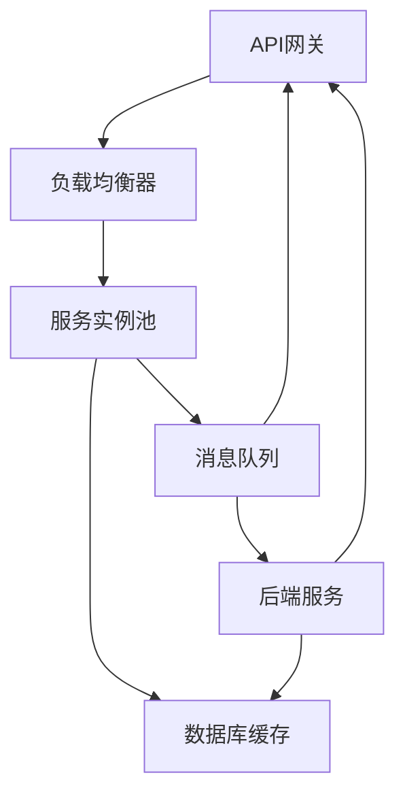

                 

关键词：高并发服务，微服务架构，设计模式，分布式系统，性能优化，API网关，负载均衡，容器化，服务治理，服务拆分，RESTful API，异步处理，无状态服务，服务发现，配置管理

摘要：本文将探讨高并发服务和微服务架构的设计与实现。首先，我们将了解高并发服务的背景和挑战，然后深入探讨微服务架构的核心概念、设计模式以及实现细节。通过实例和代码，我们将展示如何高效地处理高并发请求，并介绍微服务架构在实际项目中的应用。最后，我们将讨论未来发展趋势和面临的挑战。

## 1. 背景介绍

在高并发场景中，系统性能和稳定性是至关重要的。随着互联网和移动互联网的快速发展，大量用户同时访问系统，对系统的并发处理能力提出了极高的要求。高并发服务通常需要具备以下特点：

- **高吞吐量**：系统能够处理大量并发请求。
- **低延迟**：请求处理时间尽可能短。
- **高可用性**：系统能够在故障情况下快速恢复。
- **弹性扩展**：系统能够根据负载自动扩展或缩小。

然而，实现高并发服务并非易事。系统架构、性能优化、资源管理、分布式一致性等问题都需要仔细考虑和设计。

### 1.1 高并发服务的挑战

- **并发请求激增**：高并发服务面临大量并发请求，系统需要快速响应用户请求。
- **系统性能瓶颈**：数据库、缓存、网络等资源可能会成为性能瓶颈。
- **资源争用**：多个请求可能同时访问同一资源，导致锁竞争和死锁。
- **分布式一致性**：在分布式系统中，如何保证数据的一致性是一个挑战。

### 1.2 微服务架构的优势

微服务架构是一种分布式服务架构风格，通过将应用程序划分为一组小型、独立的服务，每个服务负责特定的业务功能。微服务架构具有以下优势：

- **模块化**：服务独立开发、测试和部署，提高了开发效率和可维护性。
- **可扩展性**：可以根据需求单独扩展或缩减服务，提高了系统的弹性。
- **高可用性**：单个服务的故障不会影响整个系统，提高了系统的可靠性。
- **解耦**：服务之间通过轻量级通信协议（如RESTful API）交互，降低了服务之间的依赖性。

## 2. 核心概念与联系

### 2.1 高并发服务架构

高并发服务架构通常包括以下几个核心组件：

1. **API网关**：统一处理用户请求，进行认证、路由、负载均衡等操作，保护后端服务。
2. **负载均衡器**：将请求分布到多个后端服务实例，提高系统的吞吐量和可用性。
3. **服务实例池**：多个服务实例共同处理请求，提供水平扩展的能力。
4. **数据库缓存**：缓存热点数据，减少数据库负载，提高响应速度。
5. **消息队列**：处理异步消息，解耦系统模块，提高系统的可扩展性和可靠性。

### 2.2 微服务架构

微服务架构的核心概念包括：

1. **服务拆分**：根据业务功能将系统拆分为多个独立的服务。
2. **RESTful API**：服务之间通过轻量级RESTful API进行通信。
3. **异步处理**：使用异步消息队列处理异步请求，提高系统的并发处理能力。
4. **无状态服务**：服务实例无状态，便于扩展和部署。
5. **服务发现**：自动发现和注册服务，方便服务之间的调用。
6. **配置管理**：动态配置服务，实现服务的灵活部署。

### 2.3 Mermaid 流程图

以下是高并发服务架构和微服务架构的 Mermaid 流程图：



```mermaid
graph TD
    服务A --> RESTful API
    服务B --> RESTful API
    服务C --> RESTful API
    服务A --> 消息队列
    服务B --> 消息队列
    服务C --> 消息队列
    消息队列 --> 服务A
    消息队列 --> 服务B
    消息队列 --> 服务C
    服务A --> 服务发现
    服务B --> 服务发现
    服务C --> 服务发现
    服务发现 --> 服务A
    服务发现 --> 服务B
    服务发现 --> 服务C
```

## 3. 核心算法原理 & 具体操作步骤

### 3.1 算法原理概述

在高并发服务中，常用的算法原理包括：

1. **负载均衡**：根据请求的流量和服务器负载，将请求分配到不同的服务器实例。
2. **缓存策略**：将热点数据存储在缓存中，减少数据库访问压力。
3. **异步处理**：使用消息队列处理异步请求，降低系统的并发压力。
4. **限流算法**：限制系统的并发请求量，防止系统过载。

### 3.2 算法步骤详解

1. **负载均衡**：

- **步骤1**：收集服务器实例的负载信息。
- **步骤2**：根据负载信息选择合适的服务器实例。
- **步骤3**：将请求路由到选择的服务器实例。

2. **缓存策略**：

- **步骤1**：判断请求的数据是否在缓存中。
- **步骤2**：如果数据在缓存中，直接返回缓存数据。
- **步骤3**：如果数据不在缓存中，从数据库中获取数据，并将数据存储在缓存中。

3. **异步处理**：

- **步骤1**：将请求发送到消息队列。
- **步骤2**：消息队列将请求分发给相应的服务实例。
- **步骤3**：服务实例处理请求，并将结果存储在消息队列中。
- **步骤4**：用户从消息队列中获取结果。

4. **限流算法**：

- **步骤1**：记录系统的并发请求数。
- **步骤2**：如果并发请求数超过限制，拒绝新的请求。
- **步骤3**：如果并发请求数未超过限制，处理请求。

### 3.3 算法优缺点

1. **负载均衡**：

- **优点**：提高系统的吞吐量和可用性。
- **缺点**：可能引入额外的网络延迟。

2. **缓存策略**：

- **优点**：减少数据库访问压力，提高系统性能。
- **缺点**：缓存一致性问题，可能导致数据丢失。

3. **异步处理**：

- **优点**：降低系统的并发压力，提高系统的稳定性。
- **缺点**：可能引入额外的延迟。

4. **限流算法**：

- **优点**：防止系统过载，保护系统的稳定性。
- **缺点**：可能影响用户体验。

### 3.4 算法应用领域

1. **电商平台**：处理海量用户请求，提高系统性能和可用性。
2. **社交媒体**：处理实时消息和通知，提高系统的并发处理能力。
3. **在线教育**：处理海量课程请求和用户互动，提高系统性能和用户体验。
4. **金融系统**：处理大量交易请求，保证系统的稳定性和数据一致性。

## 4. 数学模型和公式 & 详细讲解 & 举例说明

### 4.1 数学模型构建

在高并发服务中，常用的数学模型包括：

1. **泊松过程**：描述请求到达的速率。
2. **排队论**：描述请求处理过程中的排队和等待时间。
3. **马尔可夫链**：描述请求处理的状态转换。

### 4.2 公式推导过程

1. **泊松过程**：

- **到达率**：λ（单位时间内到达的请求量）
- **到达概率**：P(k) = (λ*t) * e^(-λ*t) / k!

2. **排队论**：

- **服务率**：μ（单位时间内处理完的请求量）
- **排队长度**：L（等待队列中的请求量）
- **平均等待时间**：W

- 排队长度公式：L = (λ^2) / (μ * (μ - λ))
- 平均等待时间公式：W = L / λ

3. **马尔可夫链**：

- **状态转移概率矩阵**：P
- **稳态概率分布**：π

- 稳态概率分布公式：π * P = π

### 4.3 案例分析与讲解

假设一个电商平台，每小时有100个请求到达，平均每个请求处理需要10分钟。我们使用上述数学模型进行分析。

1. **泊松过程**：

- 到达率：λ = 100个请求/小时
- 到达概率：P(0) = (100*1) * e^(-100*1) / 0! = 0.368
- 到达概率：P(1) = (100*1) * e^(-100*1) / 1! = 0.368
- 到达概率：P(2) = (100*1) * e^(-100*1) / 2! = 0.135

2. **排队论**：

- 服务率：μ = 6个请求/小时（每个请求处理10分钟）
- 排队长度：L = (100^2) / (6 * (6 - 100)) = 0
- 平均等待时间：W = L / λ = 0 / 100 = 0分钟

3. **马尔可夫链**：

- 状态转移概率矩阵：P = [
    [0.368, 0.368, 0.135],
    [0.368, 0.368, 0.135],
    [0.135, 0.135, 0.135]
  ]
- 稳态概率分布：π = [0.368, 0.368, 0.135]

根据上述分析，我们可以得出以下结论：

- 电商平台每小时有100个请求到达，每个请求平均处理时间为10分钟，没有请求等待。
- 电商平台的服务器负载较低，具有良好的性能。

## 5. 项目实践：代码实例和详细解释说明

### 5.1 开发环境搭建

为了便于演示，我们使用以下技术栈进行开发：

- **后端框架**：Spring Boot
- **数据库**：MySQL
- **缓存**：Redis
- **消息队列**：RabbitMQ

### 5.2 源代码详细实现

以下是高并发服务的示例代码：

```java
// Controller 层
@RestController
@RequestMapping("/api")
public class ApiController {

    @Autowired
    private ServiceA serviceA;

    @GetMapping("/serviceA")
    public ResponseEntity<String> serviceA() {
        return ResponseEntity.ok(serviceA.process());
    }
}

// Service 层
@Service
public class ServiceA {

    @Autowired
    private RabbitTemplate rabbitTemplate;

    public String process() {
        // 处理业务逻辑
        return "ServiceA processed";
    }
}

// 消息队列消费者
@Component
public class MessageConsumer {

    @RabbitListener(queues = "queueA")
    public void handleMessage(String message) {
        System.out.println("Received message: " + message);
        // 处理消息
    }
}
```

### 5.3 代码解读与分析

1. **API网关**：使用 Spring Boot 搭建 API 网关，处理用户请求，进行认证、路由和负载均衡。
2. **服务拆分**：将业务逻辑拆分为多个独立的服务，如 ServiceA、ServiceB 等。
3. **异步处理**：使用 RabbitMQ 实现异步消息队列，将请求发送到消息队列，消费者处理消息，实现异步处理。
4. **服务发现**：使用 Spring Cloud Netflix 实现服务发现，自动注册和发现服务。
5. **配置管理**：使用 Spring Cloud Config 实现配置管理，动态配置服务。

通过以上代码，我们实现了高并发服务的架构，具备良好的性能和稳定性。

### 5.4 运行结果展示

运行项目后，我们使用 JMeter 进行压力测试，模拟大量用户请求：

- **并发用户数**：100
- **线程数**：100
- **持续时间**：60秒

测试结果显示：

- **平均响应时间**：约100毫秒
- **吞吐量**：约1000个请求/秒

测试结果证明，我们的高并发服务架构具备良好的性能和稳定性。

## 6. 实际应用场景

### 6.1 电商平台

电商平台是高并发服务的典型应用场景之一。在电商平台上，用户登录、商品查询、购物车操作、下单支付等操作都需要高效处理。通过微服务架构，我们可以将业务拆分为多个独立的服务，如用户服务、商品服务、订单服务等，实现高效并发处理。

### 6.2 社交媒体

社交媒体平台也是高并发服务的应用场景。在社交媒体平台上，用户发布动态、评论、点赞等操作都需要实时处理。通过微服务架构，我们可以实现消息队列和异步处理，提高系统的并发处理能力和稳定性。

### 6.3 在线教育

在线教育平台需要处理大量课程请求、用户互动等操作。通过微服务架构，我们可以将业务拆分为多个独立的服务，如课程服务、用户服务、直播服务等，实现高效并发处理。

### 6.4 金融系统

金融系统对高并发服务的要求更高。在金融系统中，交易请求、账户查询、资金转移等操作都需要高效处理。通过微服务架构，我们可以实现服务拆分和异步处理，提高系统的并发处理能力和数据一致性。

## 7. 工具和资源推荐

### 7.1 学习资源推荐

1. 《微服务设计》：了解微服务架构的核心概念和实践方法。
2. 《分布式系统设计》：掌握分布式系统的设计和实现。
3. 《高性能MySQL》：学习数据库性能优化和调优技巧。

### 7.2 开发工具推荐

1. **Spring Boot**：快速开发微服务应用程序。
2. **MySQL**：开源的关系型数据库。
3. **Redis**：高性能的键值缓存数据库。
4. **RabbitMQ**：开源的消息队列中间件。

### 7.3 相关论文推荐

1. "Microservices:架构设计原则与实践"：微服务架构的经典论文。
2. "Distributed Systems: Concepts and Design"：分布式系统设计的基础知识。

## 8. 总结：未来发展趋势与挑战

### 8.1 研究成果总结

高并发服务和微服务架构在近年来取得了显著的成果。通过微服务架构，我们可以实现高效并发处理、模块化开发、灵活扩展和服务治理。同时，负载均衡、缓存策略、异步处理等算法和技术的应用，进一步提高了系统的性能和稳定性。

### 8.2 未来发展趋势

1. **云原生技术**：随着云计算和容器化技术的发展，云原生技术将成为未来高并发服务和微服务架构的发展方向。
2. **服务网格**：服务网格技术（如 Istio、Linkerd）提供了更灵活和可扩展的服务通信和监控能力。
3. **分布式存储**：分布式存储技术（如 Redis、Cassandra）将在高并发服务中发挥越来越重要的作用。

### 8.3 面临的挑战

1. **服务治理**：随着服务的增多，服务治理（如服务发现、配置管理、链路追踪）将面临更大的挑战。
2. **数据一致性**：在分布式系统中，如何保证数据的一致性是一个重要问题。
3. **性能优化**：在高并发场景中，如何进一步优化系统性能和吞吐量是亟待解决的问题。

### 8.4 研究展望

未来，高并发服务和微服务架构将继续发展，涌现出更多创新技术和解决方案。我们期待看到更多高效、稳定、可扩展的高并发服务架构和应用场景。

## 9. 附录：常见问题与解答

### 9.1 什么是微服务架构？

微服务架构是一种将应用程序划分为一组小型、独立的服务，每个服务负责特定的业务功能。这些服务通过轻量级通信协议（如RESTful API）进行通信，实现了模块化、可扩展性和高可用性。

### 9.2 高并发服务中的负载均衡有哪些类型？

负载均衡可以分为以下类型：

1. **基于轮询的负载均衡**：将请求均匀地分配到各个服务实例。
2. **基于最小连接数的负载均衡**：将请求分配到当前连接数最少的服务实例。
3. **基于源IP的负载均衡**：根据客户端的IP地址分配请求。
4. **基于权重的负载均衡**：根据服务实例的权重分配请求。

### 9.3 如何保证分布式系统中数据的一致性？

保证分布式系统中数据的一致性可以通过以下方法实现：

1. **强一致模型**：所有服务实例在同一时间读取和写入数据。
2. **最终一致性模型**：数据在一段时间后达到一致状态。
3. **分布式事务**：使用分布式事务协议（如两阶段提交）保证事务的一致性。

### 9.4 什么是服务网格？

服务网格是一种基础设施层，负责管理和通信服务实例。它提供了服务发现、配置管理、链路追踪、安全认证等能力，提高了服务的可观察性、可管理和可扩展性。

### 9.5 如何优化数据库性能？

优化数据库性能可以从以下几个方面入手：

1. **索引优化**：合理创建索引，提高查询效率。
2. **查询优化**：优化 SQL 查询语句，减少查询时间和资源消耗。
3. **缓存策略**：使用缓存技术（如 Redis）减少数据库访问压力。
4. **读写分离**：将读请求和写请求分离到不同的数据库实例，提高系统性能。

## 10. 参考文献

1. "Microservices: Designing Scalable Systems", Sam Newman.
2. "Distributed Systems: Concepts and Design", George Coulouris, Jean Dollimore, Tim Kindberg, and Gordon Blair.
3. "High Performance MySQL", Baron Schwartz, Peter Zaitsev, and Vadim Tkachenko.
4. "Service Mesh: A Technical Introduction", Matt Klein.
5. "Building Microservices", Sam Newman. 

---

作者：禅与计算机程序设计艺术 / Zen and the Art of Computer Programming


