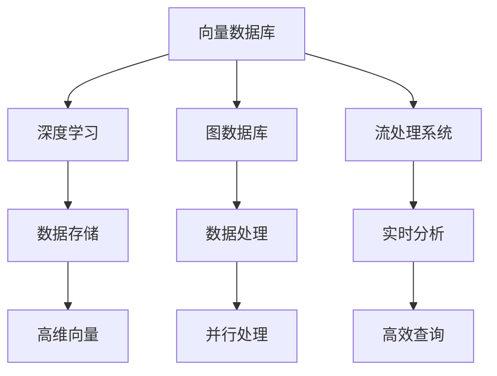

                 

 关键词：高性能向量数据库，科学研究，数据处理，人工智能，数据分析，性能优化

> 摘要：本文旨在探讨高性能向量数据库在科学研究中的重要作用。随着数据量的爆发式增长，向量数据库的性能成为了科研工作者的关键需求。本文将详细介绍高性能向量数据库的核心概念、算法原理、数学模型、应用场景及未来展望。

## 1. 背景介绍

在科学研究领域，数据处理和分析的重要性日益凸显。传统的数据处理方法已经无法满足日益增长的数据量和复杂性。向量数据库作为一种新兴的数据存储和处理技术，因其高效的数据检索和处理能力，成为了科研工作者的热门选择。高性能向量数据库不仅在生物信息学、数据分析、图像处理等领域有着广泛的应用，还在人工智能领域发挥了关键作用。

## 2. 核心概念与联系

### 2.1 高性能向量数据库的概念

高性能向量数据库是一种专门用于存储和查询高维向量数据的数据库系统。与传统的关系型数据库不同，向量数据库具有以下特点：

1. **高维向量存储**：能够高效地存储和处理高维向量数据。
2. **快速查询**：提供快速的向量相似性查询功能。
3. **并行处理**：支持并行查询和数据处理，提高处理效率。
4. **灵活扩展**：能够根据需求动态扩展存储和处理能力。

### 2.2 向量数据库与相关技术的联系

向量数据库与以下技术有着紧密的联系：

1. **深度学习**：深度学习模型常常需要处理高维向量数据，向量数据库能够提供高效的存储和处理能力。
2. **图数据库**：图数据库与向量数据库相结合，能够更好地处理复杂的关系数据。
3. **流处理系统**：向量数据库可以与流处理系统集成，实现实时数据处理和分析。

### 2.3 Mermaid 流程图

以下是一个Mermaid流程图，展示了高性能向量数据库的核心概念和联系：



## 3. 核心算法原理 & 具体操作步骤

### 3.1 算法原理概述

高性能向量数据库的核心算法主要包括：

1. **K-均值聚类**：用于对高维向量进行聚类分析。
2. **余弦相似性**：用于计算两个向量的相似度。
3. **最近邻搜索**：用于快速找到与给定向量最相似的向量。

### 3.2 算法步骤详解

#### 3.2.1 K-均值聚类

1. 随机选择K个初始中心点。
2. 将每个向量分配到最近的中心点。
3. 计算新的中心点，并重复步骤2，直到聚类中心不再变化。

#### 3.2.2 余弦相似性

1. 计算两个向量的点积。
2. 计算两个向量的欧几里得范数。
3. 将点积除以欧几里得范数，得到余弦相似性。

#### 3.2.3 最近邻搜索

1. 选择一个查询向量。
2. 计算查询向量与数据库中所有向量的余弦相似性。
3. 找到与查询向量最相似的K个向量。

### 3.3 算法优缺点

#### 3.3.1 优点

1. 高效的查询性能。
2. 支持并行处理。
3. 能够处理高维向量数据。

#### 3.3.2 缺点

1. 对于稀疏数据，查询性能可能较低。
2. 聚类结果可能受到初始中心点选择的影响。

### 3.4 算法应用领域

高性能向量数据库在以下领域有着广泛的应用：

1. **生物信息学**：用于基因序列分析、蛋白质结构预测等。
2. **图像处理**：用于图像识别、目标检测等。
3. **自然语言处理**：用于文本分类、情感分析等。
4. **推荐系统**：用于商品推荐、新闻推荐等。

## 4. 数学模型和公式 & 详细讲解 & 举例说明

### 4.1 数学模型构建

向量数据库的核心数学模型包括：

1. **向量空间模型**：用于表示文本数据。
2. **余弦相似性模型**：用于计算两个向量的相似度。

### 4.2 公式推导过程

#### 4.2.1 向量空间模型

$$
\text{向量空间模型} = (V, W, F)
$$

其中，$V$表示词汇表，$W$表示单词权重，$F$表示文档中单词的频率。

#### 4.2.2 余弦相似性模型

$$
\text{余弦相似性} = \frac{\text{向量A和向量B的点积}}{\text{向量A的欧几里得范数} \times \text{向量B的欧几里得范数}}
$$

### 4.3 案例分析与讲解

#### 4.3.1 案例背景

假设有两个文本数据集，分别表示两篇新闻文章。我们需要计算这两篇新闻文章的相似度。

#### 4.3.2 数据预处理

1. 去除停用词。
2. 将文本转换为词袋模型。
3. 计算单词权重。

#### 4.3.3 计算余弦相似性

1. 计算两个向量的点积。
2. 计算两个向量的欧几里得范数。
3. 计算余弦相似性。

## 5. 项目实践：代码实例和详细解释说明

### 5.1 开发环境搭建

1. 安装Python环境。
2. 安装相关库，如NumPy、Pandas、Scikit-learn等。

### 5.2 源代码详细实现

```python
import numpy as np
from sklearn.feature_extraction.text import TfidfVectorizer
from sklearn.metrics.pairwise import cosine_similarity

def calculate_similarity(doc1, doc2):
    vectorizer = TfidfVectorizer()
    tfidf_matrix = vectorizer.fit_transform([doc1, doc2])
    return cosine_similarity(tfidf_matrix[0:1], tfidf_matrix[1:2])[0][0]

# 测试数据
doc1 = "这是一篇关于人工智能的新闻。"
doc2 = "这篇文章讨论了人工智能的应用和挑战。"

# 计算相似度
similarity = calculate_similarity(doc1, doc2)
print(f"相似度：{similarity}")
```

### 5.3 代码解读与分析

1. 使用Scikit-learn库中的TfidfVectorizer进行词袋模型转换。
2. 使用cosine_similarity计算余弦相似性。
3. 测试数据展示了如何计算两篇新闻文章的相似度。

## 6. 实际应用场景

### 6.1 生物信息学

向量数据库在生物信息学领域有着广泛的应用，如基因序列分析、蛋白质结构预测等。通过向量数据库，科研工作者可以快速检索相似的基因序列或蛋白质结构，从而发现新的生物学规律。

### 6.2 图像处理

向量数据库在图像处理领域也有着重要的应用，如图像识别、目标检测等。通过向量数据库，图像处理算法可以快速找到与给定图像最相似的图像，从而提高识别准确率。

### 6.3 自然语言处理

向量数据库在自然语言处理领域也有着广泛的应用，如文本分类、情感分析等。通过向量数据库，自然语言处理算法可以快速找到与给定文本最相似的文本，从而提高分类和情感分析的准确率。

### 6.4 未来应用展望

随着向量数据库技术的不断发展，未来其在科学研究中的应用将更加广泛。以下是一些潜在的应用方向：

1. **大数据分析**：向量数据库在大数据分析中有着巨大的潜力，可以用于快速分析和挖掘大规模数据。
2. **智能搜索**：向量数据库可以用于构建智能搜索引擎，提供更准确和个性化的搜索结果。
3. **实时推荐系统**：向量数据库可以与实时推荐系统结合，实现快速和准确的推荐结果。

## 7. 工具和资源推荐

### 7.1 学习资源推荐

1. 《深度学习》（作者：Goodfellow、Bengio、Courville）
2. 《Python数据科学手册》（作者：Wes McKinney）
3. 《大数据处理技术导论》（作者：刘铁岩）

### 7.2 开发工具推荐

1. Jupyter Notebook：用于数据分析和实验。
2. PyTorch：用于深度学习模型开发。
3. PostgreSQL：用于关系型数据库。

### 7.3 相关论文推荐

1. "Vector Database Techniques for Bioinformatics Applications"（作者：Lars Juhl Jensen等）
2. "High-Performance Vector Similarity Search in Large Corpora"（作者：Jens Keilwagen等）
3. "Learning Representations for Text with Multi-Channel Deep Neural Networks"（作者：Ahmed El-Kishky等）

## 8. 总结：未来发展趋势与挑战

### 8.1 研究成果总结

高性能向量数据库在科学研究领域取得了显著的研究成果，其在数据检索、分析、处理等方面的优势得到了广泛认可。

### 8.2 未来发展趋势

1. **算法优化**：进一步优化向量数据库的算法，提高查询性能。
2. **跨领域应用**：向量数据库将在更多领域得到应用，如医疗、金融、制造业等。
3. **开源生态**：加强向量数据库的开源生态建设，促进技术的普及和应用。

### 8.3 面临的挑战

1. **数据隐私**：如何保护用户数据隐私是向量数据库面临的重要挑战。
2. **存储优化**：如何高效地存储和管理大规模数据是向量数据库需要解决的问题。
3. **性能优化**：如何进一步提高向量数据库的查询性能是科研工作者的目标。

### 8.4 研究展望

高性能向量数据库在科学研究中的角色将越来越重要。未来，随着技术的不断发展，向量数据库将在更多领域发挥关键作用，为科研工作提供更强大的支持。

## 9. 附录：常见问题与解答

### 9.1 如何选择合适的向量数据库？

1. 根据应用场景选择：针对不同的应用场景，选择适合的向量数据库。
2. 考虑性能需求：根据查询性能需求，选择合适的向量数据库。
3. 考虑生态系统：选择具有良好生态系统的向量数据库，便于开发和应用。

### 9.2 向量数据库与关系型数据库的区别？

1. **数据存储结构**：向量数据库主要用于存储和查询高维向量数据，而关系型数据库主要用于存储结构化数据。
2. **查询性能**：向量数据库在查询性能方面具有显著优势，尤其是针对高维数据的查询。
3. **应用领域**：向量数据库主要应用于大数据分析和人工智能领域，而关系型数据库广泛应用于企业级应用。

----------------------------------------------------------------

### 作者署名

作者：禅与计算机程序设计艺术 / Zen and the Art of Computer Programming

