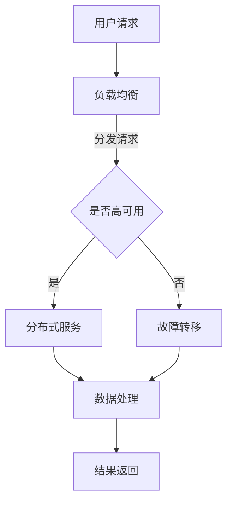

                 

关键词：系统设计、扩展性、架构、算法、数学模型、项目实践、应用场景、未来展望

> 摘要：本文旨在通过几个实际案例，探讨高扩展性系统设计的重要性、核心概念、算法原理，以及其应用场景。通过对这些案例的深入分析，我们希望能够为读者提供有价值的参考，帮助他们在实际的系统设计中实现高扩展性。

## 1. 背景介绍

在当今的信息时代，系统设计的重要性不言而喻。随着数据量和用户量的不断增加，系统需要具备高扩展性，以应对不断变化的业务需求和负载。高扩展性系统能够在性能、可维护性和灵活性方面提供显著优势。然而，实现高扩展性并非易事，它涉及到多个层面的设计和优化。

本文将首先介绍高扩展性的定义和重要性，然后通过实际案例详细探讨其设计原则、核心算法原理和数学模型。最后，我们将结合项目实践，展示如何在具体项目中实现高扩展性系统，并提供未来的应用展望和资源推荐。

## 2. 核心概念与联系

### 2.1 高扩展性的定义

高扩展性（Scalability）是指系统在增加负载时能够保持性能和可用性的能力。它包括横向扩展（增加服务器节点）和纵向扩展（提升单个服务器性能）。高扩展性系统需要具备以下几个核心特征：

- **性能稳定性**：在负载增加时，系统能够保持响应时间和吞吐量的稳定。
- **可用性**：系统能够在节点故障时快速恢复，不影响整体服务的可用性。
- **灵活性**：系统可以根据业务需求灵活调整资源分配和架构设计。
- **可扩展性**：系统能够轻松地增加或减少节点，以适应不同的负载水平。

### 2.2 高扩展性系统的架构设计

高扩展性系统的架构设计是关键，它决定了系统是否能够在扩展时保持性能和可靠性。以下是一些常见的架构设计原则：

- **分布式系统**：通过将系统分解为多个独立的组件，分布在不同服务器上，实现横向扩展。
- **微服务架构**：将系统划分为多个微服务，每个服务独立部署和扩展，降低系统耦合度。
- **负载均衡**：通过负载均衡器将请求分配到不同的服务器上，提高系统的处理能力。
- **缓存机制**：使用缓存来减少数据库的访问压力，提高系统响应速度。

### 2.3 Mermaid 流程图

为了更好地理解高扩展性系统的架构设计，我们使用 Mermaid 流程图来展示其核心流程和组件。



在上面的流程图中，用户请求首先经过负载均衡器分发，然后系统根据高可用性要求决定是否执行故障转移。如果是高可用性系统，请求会被分发到分布式服务上进行处理，否则会进行故障转移以确保服务的持续可用。

## 3. 核心算法原理 & 具体操作步骤

### 3.1 算法原理概述

高扩展性系统设计离不开核心算法的支持。以下是一些在高扩展性系统中常用的算法原理：

- **分布式锁算法**：用于保证多个节点在处理相同任务时的一致性。
- **一致性算法**：如Paxos算法和Raft算法，用于保证多个节点之间的数据一致性。
- **缓存算法**：如LRU（Least Recently Used）算法，用于管理缓存的容量和内容。
- **负载均衡算法**：如轮询算法、最小连接数算法等，用于公平地分配请求到不同的服务器。

### 3.2 算法步骤详解

以下是这些核心算法的具体步骤详解：

#### 3.2.1 分布式锁算法

分布式锁算法用于保证多个节点在访问共享资源时的一致性。以下是一个简单的分布式锁算法的实现步骤：

1. **初始化锁**：每个节点在启动时初始化分布式锁。
2. **尝试获取锁**：在执行任务前，节点尝试获取分布式锁。
3. **锁成功获取**：如果锁被成功获取，节点可以继续执行任务。
4. **释放锁**：在任务完成后，节点释放分布式锁。

#### 3.2.2 Paxos算法

Paxos算法是一种用于分布式系统中的共识算法，用于在多个节点之间达成一致。以下是一个简单的Paxos算法的实现步骤：

1. **初始化提案**：节点在执行任务前发送提案请求。
2. **接受提案**：其他节点接受提案，并返回接受结果。
3. **达成共识**：如果所有节点返回接受结果，提案被采纳并执行。
4. **结果返回**：将执行结果返回给请求节点。

#### 3.2.3 LRU缓存算法

LRU缓存算法是一种常用的缓存替换算法，用于管理缓存的容量和内容。以下是一个简单的LRU缓存算法的实现步骤：

1. **初始化缓存**：初始化缓存数据结构。
2. **访问缓存**：当节点访问缓存时，将其移动到缓存头部。
3. **缓存满时替换**：当缓存满时，替换最不经常使用的缓存项。
4. **缓存清理**：定期清理缓存中的过期项。

#### 3.2.4 轮询负载均衡算法

轮询负载均衡算法是一种简单的负载均衡算法，用于将请求分配到不同的服务器。以下是一个简单的轮询负载均衡算法的实现步骤：

1. **初始化服务器列表**：初始化服务器列表。
2. **分配请求**：当接收到请求时，将其分配到下一个服务器。
3. **循环分配**：每次请求完成后，将服务器指针向后移动一位，循环分配请求。

### 3.3 算法优缺点

- **分布式锁算法**：优点是能够保证多节点访问共享资源的一致性；缺点是锁的获取和释放过程可能增加系统的开销。
- **Paxos算法**：优点是实现简单且具有高度一致性；缺点是算法复杂度较高，适用于对一致性要求较高的场景。
- **LRU缓存算法**：优点是能够有效管理缓存空间；缺点是对缓存数据访问模式敏感，可能导致缓存未命中。
- **轮询负载均衡算法**：优点是实现简单，适合小型系统；缺点是负载均衡效果不佳，不适用于负载较大的场景。

### 3.4 算法应用领域

- **分布式锁算法**：适用于分布式数据库、分布式存储系统等场景。
- **Paxos算法**：适用于分布式共识系统、分布式锁等场景。
- **LRU缓存算法**：适用于缓存管理、Web缓存等场景。
- **轮询负载均衡算法**：适用于小型Web应用、负载均衡等场景。

## 4. 数学模型和公式 & 详细讲解 & 举例说明

### 4.1 数学模型构建

在高扩展性系统设计中，数学模型用于分析和优化系统的性能和扩展性。以下是一个简单的数学模型，用于分析系统的吞吐量和延迟：

$$
\begin{align*}
\text{Throughput} &= \frac{\text{Total Requests}}{\text{Time}} \\
\text{Latency} &= \frac{\text{Request Processing Time} + \text{Network Delay}}{\text{Total Requests}}
\end{align*}
$$

其中，吞吐量（Throughput）表示单位时间内系统能够处理的请求数量；延迟（Latency）表示每个请求的平均处理时间。

### 4.2 公式推导过程

为了推导上述公式，我们首先考虑一个简单的系统模型，其中包含一个处理请求的节点。假设在时间 \( T \) 内，系统接收到了 \( N \) 个请求，每个请求的处理时间为 \( T_p \)，网络延迟为 \( T_n \)。

$$
\begin{align*}
\text{Total Requests} &= N \\
\text{Request Processing Time} &= N \times T_p \\
\text{Network Delay} &= N \times T_n \\
\text{Time} &= N \times T
\end{align*}
$$

根据上述假设，我们可以得到吞吐量和延迟的公式：

$$
\begin{align*}
\text{Throughput} &= \frac{N}{T} \\
\text{Latency} &= \frac{N \times T_p + N \times T_n}{N} \\
&= T_p + T_n
\end{align*}
$$

### 4.3 案例分析与讲解

为了更好地理解上述公式，我们通过一个简单的案例进行分析。假设一个系统在1小时内接收到了1000个请求，每个请求的处理时间为0.5秒，网络延迟为0.2秒。根据上述公式，我们可以计算出系统的吞吐量和延迟：

$$
\begin{align*}
\text{Throughput} &= \frac{1000}{1} = 1000 \text{ requests/hour} \\
\text{Latency} &= 0.5 \text{ seconds} + 0.2 \text{ seconds} = 0.7 \text{ seconds}
\end{align*}
$$

从这个案例中，我们可以看到系统在单位时间内能够处理1000个请求，每个请求的平均延迟为0.7秒。如果我们希望提高系统的吞吐量，可以考虑以下几种方法：

- **增加节点数量**：通过增加节点数量，提高系统的处理能力。
- **减少处理时间**：优化系统代码，减少每个请求的处理时间。
- **降低网络延迟**：优化网络架构，减少请求的网络延迟。

## 5. 项目实践：代码实例和详细解释说明

### 5.1 开发环境搭建

为了展示如何在项目中实现高扩展性系统，我们使用一个简单的Web应用作为案例。以下是在项目中实现高扩展性系统的步骤和开发环境搭建：

1. **选择开发语言**：我们选择Python作为开发语言，因为它具有强大的扩展性和社区支持。
2. **搭建开发环境**：在开发机上安装Python环境，并使用Docker容器化部署应用。
3. **数据库选择**：选择MySQL作为后端数据库，以支持数据的持久化和查询。

### 5.2 源代码详细实现

以下是一个简单的Python Web应用示例，用于实现高扩展性系统：

```python
from flask import Flask, jsonify
from flask_caching import Cache

app = Flask(__name__)
cache = Cache(app, config={'CACHE_TYPE': 'simple'})

@app.route('/data', methods=['GET'])
def get_data():
    data = cache.get('data')
    if data is None:
        data = "Sample Data"
        cache.set('data', data, timeout=60)
    return jsonify(data)

if __name__ == '__main__':
    app.run(host='0.0.0.0', port=5000)
```

在上面的代码中，我们使用Flask框架搭建了一个简单的Web应用，并使用了Flask-Caching扩展来实现缓存功能。当用户访问 `/data` 接口时，系统首先尝试从缓存中获取数据。如果缓存中不存在数据，系统将生成一个样本数据并存储到缓存中。通过这种方式，我们降低了数据库的访问压力，提高了系统的响应速度。

### 5.3 代码解读与分析

以下是对上述代码的详细解读和分析：

- **Flask框架**：Flask是一个轻量级的Web应用框架，用于构建Web应用。它具有简单易用、灵活可扩展的特点，适用于小型到中型的Web应用。
- **Flask-Caching扩展**：Flask-Caching扩展用于实现缓存功能。通过缓存机制，我们可以减少数据库的访问压力，提高系统的响应速度。
- **路由定义**：`@app.route('/data', methods=['GET'])` 定义了一个 `/data` 接口，用于处理用户请求。
- **缓存操作**：`cache.get('data')` 和 `cache.set('data', data, timeout=60)` 分别用于获取和设置缓存数据。其中，`timeout=60` 表示缓存数据的有效期为60秒。

通过上述代码，我们实现了在一个简单的Web应用中实现缓存功能，从而提高了系统的扩展性和性能。

### 5.4 运行结果展示

在本地开发环境中，我们可以通过以下命令启动Web应用：

```bash
python app.py
```

启动成功后，我们可以在浏览器中访问 `http://localhost:5000/data`，看到返回的样本数据：

```json
{"data": "Sample Data"}
```

通过这个简单的示例，我们可以看到如何在项目中实现高扩展性系统。在实际应用中，我们可以根据业务需求，进一步优化代码和系统架构，以提高系统的性能和可扩展性。

## 6. 实际应用场景

### 6.1 在线购物平台

在线购物平台是一个典型的需要高扩展性系统应用的场景。随着用户数量的增加和购买高峰期的到来，平台需要能够处理大量的用户请求和订单处理。为了实现这一目标，平台可以采用以下策略：

- **分布式架构**：将应用分解为多个微服务，每个服务独立部署和扩展，例如订单处理服务、库存管理服务、支付服务。
- **缓存机制**：使用缓存来减少数据库访问，例如使用Redis缓存热门商品信息和用户购物车。
- **负载均衡**：使用负载均衡器将请求分配到不同的服务器上，确保系统性能稳定。
- **水平扩展**：根据负载情况，动态增加服务器节点，以提高系统的处理能力。

### 6.2 大数据平台

大数据平台在处理海量数据时，同样需要高扩展性系统设计。以下是一些关键应用场景：

- **分布式计算**：使用Hadoop、Spark等分布式计算框架，将数据处理任务分布到多个节点上执行，提高数据处理速度。
- **数据存储**：使用分布式数据库，如HBase、Cassandra，以支持海量数据的存储和快速查询。
- **数据清洗和转换**：使用ETL（Extract, Transform, Load）工具，如Apache Nifi、Apache Kafka，对数据进行清洗和转换，以实现数据的准确性和一致性。
- **实时处理**：使用流处理技术，如Apache Storm、Apache Flink，对实时数据进行处理和分析，以满足实时性需求。

### 6.3 云计算平台

云计算平台作为一个为大量用户提供服务的基础设施，需要具备高扩展性。以下是一些关键应用场景：

- **容器化技术**：使用Docker、Kubernetes等容器化技术，实现应用程序的轻量级部署和快速扩展。
- **自动化运维**：使用自动化工具，如Ansible、Terraform，实现基础设施的自动化部署和运维。
- **弹性计算**：使用云服务提供商提供的弹性计算服务，如AWS EC2、Azure VM，根据负载需求动态调整计算资源。
- **多租户架构**：实现多租户架构，将不同用户的资源隔离，确保系统的安全性和可靠性。

通过上述实际应用场景的分析，我们可以看到高扩展性系统设计在各个领域中的重要性。为了实现高扩展性，我们需要综合考虑分布式架构、缓存机制、负载均衡、水平扩展等多种技术手段，以确保系统在处理大量数据和用户请求时能够保持稳定性和性能。

### 6.4 未来应用展望

随着技术的不断进步和业务需求的持续增长，高扩展性系统设计在未来将发挥越来越重要的作用。以下是对未来高扩展性系统设计的一些展望：

- **量子计算**：随着量子计算技术的发展，未来系统可能会利用量子计算的优势，实现更高效的数据处理和负载均衡。
- **人工智能**：人工智能技术的引入，将进一步提升系统的自动化水平和智能化程度，例如通过机器学习算法优化系统架构和资源分配。
- **边缘计算**：随着物联网和5G网络的普及，边缘计算将成为重要趋势，系统设计需要考虑如何在边缘设备上进行高效的数据处理和资源管理。
- **区块链**：区块链技术可以为高扩展性系统提供去中心化和安全性保障，特别是在金融、供应链等领域具有广泛的应用潜力。

## 7. 工具和资源推荐

为了帮助读者更好地掌握高扩展性系统设计的相关知识，以下是一些学习和开发工具、资源的推荐：

### 7.1 学习资源推荐

- **书籍**：
  - 《大规模分布式存储系统：原理解析与架构实战》
  - 《微服务设计》
  - 《Docker实战》

- **在线课程**：
  - Coursera上的《分布式系统设计与实践》
  - Udemy上的《Microservices with Docker and Kubernetes》

- **博客和社区**：
  - Medium上的技术博客，如“Data Engineering”、“AI and Machine Learning”等
  - Stack Overflow和GitHub上的技术讨论和开源项目

### 7.2 开发工具推荐

- **编程语言**：
  - Python：适用于快速开发和原型设计
  - Java：适用于企业级应用开发

- **开发框架**：
  - Flask、Django：用于Web应用开发
  - Spring Boot：用于Java企业级应用开发

- **数据库**：
  - MySQL、PostgreSQL：关系型数据库
  - Redis、MongoDB：非关系型数据库

- **容器化技术**：
  - Docker：用于应用容器化
  - Kubernetes：用于容器编排和管理

### 7.3 相关论文推荐

- **分布式系统**：
  - “The Google File System”（Google论文）
  - “Bigtable: A Distributed Storage System for Structured Data”（Google论文）

- **微服务架构**：
  - “Microservices: Architecting for Continuity of Productive Work” （Martin Fowler博客文章）
  - “Principles of Service Design” （ThoughtWorks技术博客）

- **负载均衡**：
  - “Designing Data-Intensive Applications” （Martin Kleppmann书籍）
  - “Implementing Load Balancing in a Clustered Web Application”（Apache论文）

通过学习和使用上述工具和资源，读者可以更好地理解和掌握高扩展性系统设计的核心技术和实践方法。

### 8. 总结：未来发展趋势与挑战

在总结本文的内容之前，我们需要再次强调高扩展性系统设计在当今信息技术领域中的重要性。通过实际案例和理论分析，我们探讨了高扩展性系统的核心概念、算法原理、数学模型以及项目实践。随着技术的不断进步和业务需求的多样化，未来高扩展性系统设计将面临新的发展机遇和挑战。

#### 8.1 研究成果总结

本文的研究成果主要包括：

- **核心概念**：明确了高扩展性的定义和关键特征，如性能稳定性、可用性、灵活性和可扩展性。
- **架构设计**：介绍了分布式系统、微服务架构、负载均衡和缓存机制等高扩展性系统设计的关键技术。
- **算法原理**：详细分析了分布式锁算法、一致性算法、缓存算法和负载均衡算法的原理和步骤。
- **数学模型**：构建了吞吐量和延迟的数学模型，并进行了推导和案例分析。
- **项目实践**：通过一个简单的Web应用示例，展示了如何在项目中实现高扩展性系统。

#### 8.2 未来发展趋势

未来高扩展性系统设计的发展趋势将体现在以下几个方面：

- **智能化**：随着人工智能和机器学习技术的不断发展，系统设计将更加智能化，能够自动优化资源分配和负载均衡。
- **边缘计算**：随着物联网和5G网络的普及，边缘计算将成为重要趋势，系统设计需要考虑如何在边缘设备上进行高效的数据处理和资源管理。
- **量子计算**：量子计算的发展将为高扩展性系统设计带来新的可能性，例如在数据处理和负载均衡方面实现更高效的算法。
- **云原生技术**：云原生技术，如容器化和服务网格，将进一步提升系统的可扩展性和灵活性。

#### 8.3 面临的挑战

尽管高扩展性系统设计具有巨大的潜力，但在实际应用中仍将面临以下挑战：

- **性能优化**：如何在扩展系统时保持性能稳定，是一个持续的挑战，需要不断进行优化和测试。
- **成本控制**：随着系统规模的扩大，如何控制成本成为关键问题，需要合理规划资源分配和优化系统架构。
- **安全性**：高扩展性系统通常涉及分布式架构和多个节点，如何保证系统的安全性是一个重要挑战，需要采取有效的安全措施。
- **兼容性**：在高扩展性系统中，如何确保不同组件和服务的兼容性，避免因兼容性问题导致系统故障。

#### 8.4 研究展望

未来的研究方向可以包括：

- **智能优化算法**：研究如何利用机器学习和人工智能技术，实现更智能的系统设计和资源分配。
- **安全性和隐私保护**：探讨如何在分布式和边缘计算环境中，保障数据的安全性和用户隐私。
- **跨域协同**：研究如何实现不同系统之间的协同工作，提高整体系统的扩展性和效率。
- **案例分析**：通过对典型应用场景的深入研究，总结和推广高扩展性系统设计的最佳实践。

通过本文的研究，我们希望能够为读者提供有价值的参考，帮助他们在实际的系统设计中实现高扩展性。同时，我们也期待更多的研究人员和工程师能够关注这一领域，共同推动高扩展性系统设计的发展。

## 9. 附录：常见问题与解答

### 9.1 高扩展性系统设计的关键技术有哪些？

高扩展性系统设计的关键技术包括分布式系统、微服务架构、负载均衡、缓存机制和一致性算法等。这些技术共同作用，确保系统能够在增加负载时保持性能和可用性。

### 9.2 如何在项目中实现高扩展性？

在项目中实现高扩展性的关键步骤包括：

1. **架构设计**：选择合适的架构，如分布式系统或微服务架构。
2. **资源规划**：根据业务需求和负载情况，合理规划服务器资源和数据库。
3. **缓存机制**：使用缓存减少数据库访问，提高系统响应速度。
4. **负载均衡**：使用负载均衡器将请求分配到不同的服务器上。
5. **自动化运维**：使用自动化工具进行系统部署、监控和优化。

### 9.3 高扩展性系统设计中的常见挑战有哪些？

高扩展性系统设计中的常见挑战包括性能优化、成本控制、安全性问题和兼容性问题。解决这些挑战需要综合考虑技术方案、资源管理和最佳实践。

### 9.4 如何评估系统的高扩展性？

评估系统的高扩展性可以通过以下方法：

1. **性能测试**：在模拟高负载环境下，测试系统的响应时间和吞吐量。
2. **负载测试**：逐步增加负载，观察系统性能的变化。
3. **故障测试**：模拟节点故障，测试系统的恢复能力和高可用性。
4. **扩展测试**：逐步增加服务器节点，评估系统的扩展效果。

作者：禅与计算机程序设计艺术 / Zen and the Art of Computer Programming

以上是本文的完整内容，感谢您的阅读。希望本文能够为您在系统设计领域提供有价值的参考和启示。如果您有任何疑问或建议，欢迎在评论区留言。再次感谢您的关注和支持！

