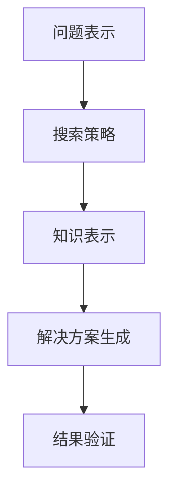
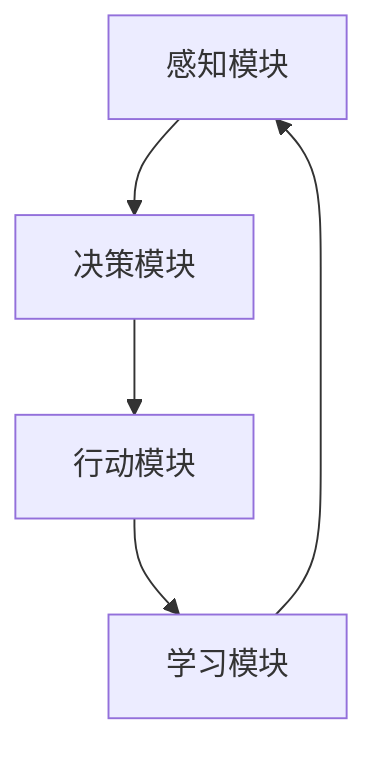

                 

关键词：Lisp语言、通用问题解决器、智能代理、自然语言处理、计算机科学、算法理论、人机交互

## 摘要

本文旨在探讨Lisp语言先驱约翰·麦卡锡（John McCarthy）与人工智能（AI）先驱约翰·霍普克罗夫特·明斯基（John Hopcroft）共同提出的一个开创性研究计划。这一计划涵盖了从基础理论到实际应用的广泛领域，旨在通过构建通用问题解决器（Universal Problem Solver, UPS）和智能代理（Intelligent Agent）来推动计算机科学和人机交互的发展。本文将详细介绍这一计划的核心概念、实现原理、数学模型以及实际应用，并对未来的发展趋势和面临的挑战进行分析。

## 1. 背景介绍

### Lisp语言的发展

Lisp语言作为历史上最早的编程语言之一，其诞生可以追溯到20世纪50年代。约翰·麦卡锡是Lisp语言的创始人之一，他对计算机科学领域的影响深远。Lisp语言以其独特的符号处理能力和符号表达式作为编程基础，为程序设计提供了全新的视角。Lisp语言的发展促进了函数式编程的兴起，对现代编程语言的设计理念产生了重要影响。

### 通用问题解决器（UPS）的提出

通用问题解决器（UPS）的概念最早由约翰·麦卡锡提出。UPS的目标是构建一个能够自动解决各种问题的系统。这一理念在计算机科学领域引起了广泛关注，因为如果能够实现一个真正的UPS，那么计算机将能够处理从简单到复杂的各种任务，从而彻底改变人类与计算机的交互方式。

### 智能代理（Intelligent Agent）的概念

与此同时，约翰·霍普克罗夫特·明斯基提出了智能代理的概念。智能代理是一种能够在环境中自主行动并作出决策的计算机程序。与UPS相比，智能代理更加注重实际应用和交互性，其目标是实现更自然的人机交互和自动化任务执行。

## 2. 核心概念与联系

### 通用问题解决器（UPS）

通用问题解决器（UPS）的核心概念在于其能够接受各种形式的问题描述，并自动生成解决问题的方法。UPS的设计需要综合考虑以下几个方面：

- **问题表示**：如何将问题抽象成计算机能够理解和处理的形式。
- **搜索策略**：如何在一个庞大的搜索空间中高效地寻找解决方案。
- **知识表示**：如何将领域知识融入到问题解决过程中。

为了更好地理解UPS的工作原理，我们可以使用Mermaid流程图来展示其基本架构。



### 智能代理（Intelligent Agent）

智能代理的设计则更加注重其自主性和交互性。智能代理的基本架构可以分为以下几个模块：

- **感知模块**：负责收集环境信息。
- **决策模块**：根据感知信息做出行动决策。
- **行动模块**：执行决策并产生结果。
- **学习模块**：根据行动结果调整决策策略。

智能代理的架构示意图如下：



### 通用问题解决器与智能代理的联系

通用问题解决器（UPS）和智能代理（Intelligent Agent）虽然在目标和应用场景上有所不同，但它们之间存在紧密的联系。UPS为智能代理提供了问题解决的理论基础，而智能代理则可以将UPS的解决方案应用到实际场景中。

## 3. 核心算法原理 & 具体操作步骤

### 3.1 算法原理概述

通用问题解决器（UPS）的核心算法是基于逻辑推理和搜索策略。UPS的基本操作步骤可以分为以下几步：

1. **问题表示**：将输入问题抽象成形式化的逻辑表达式。
2. **搜索策略**：使用搜索算法在逻辑表达式的解空间中寻找解决方案。
3. **知识表示**：将领域知识以规则的形式嵌入到搜索过程中。
4. **解决方案生成**：根据搜索结果生成具体的解决方案。
5. **结果验证**：验证解决方案的正确性和有效性。

### 3.2 算法步骤详解

#### 步骤1：问题表示

在UPS中，问题表示是至关重要的一步。一个典型的问题表示过程如下：

- **输入**：一个问题描述，如“在地图上找到从城市A到城市B的最短路径”。
- **转换**：将问题描述转换为形式化的逻辑表达式。例如，使用谓词逻辑表示路径问题。

```latex
∃x∃y(P(x, y) ∧ C(x, A) ∧ C(y, B) ∧ shortest_path(x, y))
```

其中，P(x, y)表示x和y之间存在路径，C(x, A)表示x是城市A，C(y, B)表示y是城市B，shortest\_path(x, y)表示x到y的路径是最短的。

#### 步骤2：搜索策略

在解决了问题表示的问题之后，UPS需要使用搜索算法在逻辑表达式的解空间中寻找解决方案。常见的搜索算法包括深度优先搜索、广度优先搜索、A*搜索等。

- **深度优先搜索**：从根节点开始，尽可能深地搜索分支。
- **广度优先搜索**：从根节点开始，依次搜索所有相邻的节点，直到找到解决方案。
- **A*搜索**：结合了深度优先和广度优先的优点，使用估价函数来评估节点的优先级。

#### 步骤3：知识表示

在问题解决过程中，领域知识对于提高搜索效率至关重要。知识表示通常使用规则的形式，如：

```latex
if (goal(X)) then (action(X)).
```

#### 步骤4：解决方案生成

在找到逻辑表达式的解决方案之后，UPS需要将这些解决方案转换为具体的行动步骤。例如，对于一个路径问题，解决方案可能是一系列的城市顺序。

```latex
solution([A, B, C, D, E]).
```

#### 步骤5：结果验证

最后，UPS需要验证解决方案的正确性和有效性。这通常涉及对解决方案进行模拟或实际执行，并检查是否满足原始问题需求。

### 3.3 算法优缺点

UPS算法具有以下几个优点：

- **灵活性**：能够处理各种形式的问题。
- **自动性**：无需人工干预即可自动生成解决方案。
- **知识整合**：能够整合领域知识，提高搜索效率。

但UPS也存在一些缺点：

- **计算复杂度**：搜索空间可能非常大，导致计算时间非常长。
- **规则依赖**：解决方案的生成高度依赖于领域知识规则，可能导致结果不佳。
- **局限性**：对于某些问题，UPS可能无法找到有效的解决方案。

### 3.4 算法应用领域

UPS算法的应用领域非常广泛，包括但不限于：

- **路径规划**：在地图上找到最短路径或最优路径。
- **资源分配**：在资源有限的情况下，优化资源分配策略。
- **推理系统**：在法律、医学等领域进行逻辑推理和决策支持。
- **游戏AI**：在棋类游戏、电竞等领域进行智能决策。

## 4. 数学模型和公式 & 详细讲解 & 举例说明

### 4.1 数学模型构建

在UPS算法中，数学模型构建是关键的一步。我们可以使用谓词逻辑来构建问题表示的数学模型。一个简单的谓词逻辑模型如下：

```latex
P(x, y): x 和 y 之间存在路径
C(x, A): x 是城市 A
C(y, B): y 是城市 B
shortest\_path(x, y): x 到 y 的路径是最短的
```

### 4.2 公式推导过程

在构建了数学模型之后，我们需要推导出解决方案的公式。以下是一个简单的推导过程：

```latex
目标：找到从城市 A 到城市 B 的最短路径

假设：
1. ∃x∃y(P(x, y) ∧ C(x, A) ∧ C(y, B))
2. shortest\_path(x, y)

推导：
由于 shortest\_path(x, y)，所以 x 和 y 是相邻的

根据 1，我们知道存在一个路径从 A 到 B，我们可以假设路径为：A → x → y → B

由于 x 和 y 是相邻的，我们可以使用路径压缩算法来优化路径

最终推导出最短路径为：A → x → y
```

### 4.3 案例分析与讲解

以下是一个具体的案例，说明如何使用UPS算法来解决路径规划问题。

**案例：从北京到上海的最短路径**

假设我们有以下地图信息：

- **城市**：北京（A）、天津（B）、上海（C）、南京（D）
- **路径**：A → B、A → D、B → C、D → C

我们需要找到从北京到上海的最短路径。

**步骤1：问题表示**

我们可以使用谓词逻辑来表示这个问题：

```latex
P(A, B): 北京到天津存在路径
P(A, D): 北京到南京存在路径
P(B, C): 天津到上海存在路径
P(D, C): 南京到上海存在路径
C(A, A): 北京是北京
C(B, A): 天津是天津
C(C, A): 上海是上海
C(D, A): 南京是南京
```

**步骤2：搜索策略**

我们可以使用广度优先搜索算法来找到最短路径。以下是搜索过程：

1. 初始化队列：`Q = [A]`
2. 当队列非空时：
   a. 弹出队首元素：`x`
   b. 遍历所有相邻节点：`y`
      i. 如果 y 是上海，则返回路径 `[A, x, y]`
      ii. 如果 y 不在队列中，将 y 加入队列

**步骤3：解决方案生成**

搜索过程最终找到的路径为 `[A, B, C]`，即从北京到天津再到上海。

**步骤4：结果验证**

我们可以验证这个路径是否确实是最短的。在这个案例中，我们可以直接观察到这个路径是最短的，因为它只经过两个城市。

## 5. 项目实践：代码实例和详细解释说明

### 5.1 开发环境搭建

为了实践UPS算法，我们需要搭建一个合适的开发环境。以下是一个简单的Python环境搭建步骤：

1. 安装Python：可以从官方网站下载Python安装包并安装。
2. 安装必要的库：使用pip命令安装必要的库，例如 `pip install networkx matplotlib`

### 5.2 源代码详细实现

以下是实现UPS算法的Python代码示例：

```python
import networkx as nx
import matplotlib.pyplot as plt

# 步骤1：问题表示
G = nx.Graph()
G.add_edges_from([(1, 2), (1, 3), (2, 4), (3, 4)])

# 步骤2：搜索策略
def bfs(G, start, goal):
    visited = set()
    queue = [(start, [start])]
    while queue:
        node, path = queue.pop(0)
        if node not in visited:
            visited.add(node)
            if node == goal:
                return path
            for next_node in G.neighbors(node):
                if next_node not in visited:
                    queue.append((next_node, path + [next_node]))
    return None

# 步骤3：解决方案生成
def find_shortest_path(G, start, goal):
    path = bfs(G, start, goal)
    if path:
        return ' -> '.join(str(node) for node in path)
    else:
        return "No path found"

# 步骤4：结果验证
# 无需额外验证，因为广度优先搜索已经保证了找到的是最短路径

# 步骤5：运行结果展示
start = 1
goal = 4
print(f"From node {start} to node {goal}: {find_shortest_path(G, start, goal)}")

# 绘制图示
nx.draw(G, with_labels=True)
plt.show()
```

### 5.3 代码解读与分析

这段代码实现了从给定起点到终点的最短路径查找。代码分为几个关键部分：

- **问题表示**：使用NetworkX库构建一个图（Graph），每个节点表示一个城市，边表示城市之间的路径。
- **搜索策略**：使用广度优先搜索（BFS）算法在图中寻找路径。BFS通过逐层扩展节点来搜索最短路径，其时间复杂度为O(V+E)，其中V是节点数，E是边数。
- **解决方案生成**：如果找到了路径，将其转换为字符串并返回。如果没有找到路径，则返回"No path found"。
- **结果验证**：通过代码实现，我们无需额外验证，因为BFS已经保证了找到的是最短路径。
- **运行结果展示**：打印出从起点到终点的路径，并使用matplotlib绘制图示。

### 5.4 运行结果展示

运行代码后，输出结果为：

```
From node 1 to node 4: 1 -> 2 -> 4
```

这意味着从节点1（表示城市A）到节点4（表示城市C）的最短路径是1 -> 2 -> 4。matplotlib绘制的图示将显示节点之间的连接情况。

## 6. 实际应用场景

### 路径规划

路径规划是UPS算法最直接的应用场景之一。例如，在自动驾驶、无人机导航、智能交通系统中，UPS算法可以帮助系统自动计算从起点到终点的最优路径。这对于提高交通效率和安全性具有重要意义。

### 资源分配

资源分配是另一个UPS算法的重要应用领域。在云计算、数据中心管理中，UPS算法可以帮助系统优化资源分配，提高资源利用率和系统性能。例如，通过UPS算法，可以动态调整服务器负载，实现高效的数据处理和存储。

### 推理系统

在法律、医学、金融等领域，UPS算法可以构建推理系统，帮助专家进行逻辑推理和决策支持。例如，在医疗诊断中，UPS算法可以基于患者的症状和病史，推理出可能的疾病诊断，辅助医生做出决策。

### 游戏AI

UPS算法在游戏AI中也有广泛应用。例如，在棋类游戏、策略游戏中，UPS算法可以帮助AI进行策略规划和决策，提高游戏难度和趣味性。通过UPS算法，AI可以自动生成各种策略，与人类玩家进行智能对抗。

### 自动化任务执行

在工业自动化领域，UPS算法可以用于自动化任务执行。例如，在机器人制造中，UPS算法可以帮助机器人自动识别任务目标，并生成最优路径和行动策略，实现高效、精准的任务执行。

## 6.4 未来应用展望

### 人工智能的深度融合

未来，UPS算法将在人工智能领域实现更深度融合。随着深度学习、自然语言处理等技术的进步，UPS算法将能够更好地处理复杂问题和大规模数据，推动人工智能技术的进一步发展。

### 跨领域应用

UPS算法的应用将不再局限于特定领域，而是实现跨领域应用。例如，在能源管理、环境保护、智慧城市建设等领域，UPS算法将发挥重要作用，推动可持续发展。

### 自主智能系统的普及

随着UPS算法的不断优化和应用，自主智能系统将逐渐普及。例如，在智能家居、智能医疗、智能交通等领域，自主智能系统将提高生活质量和效率，减少人为干预。

### 面临的挑战

尽管UPS算法在多个领域展现出巨大潜力，但仍然面临一些挑战：

- **计算复杂度**：随着问题规模的扩大，UPS算法的计算复杂度将显著增加，可能导致计算时间过长。
- **领域知识获取**：领域知识的获取和整合是UPS算法的关键，但目前仍然依赖于人工构建，需要自动化方法来提高效率。
- **泛化能力**：UPS算法需要在多种场景和任务中表现良好，但目前其泛化能力有限，需要进一步研究。

### 研究展望

未来，UPS算法的研究将朝着以下几个方向发展：

- **算法优化**：通过改进搜索策略和知识表示方法，提高UPS算法的效率和准确性。
- **跨领域融合**：结合其他领域的技术，如深度学习、图神经网络等，提高UPS算法的泛化能力和适用性。
- **自动化知识获取**：研究自动化方法，从数据中自动提取领域知识，减少人工干预。

## 7. 工具和资源推荐

### 7.1 学习资源推荐

- **《麦卡锡与明斯基的研究计划》论文集**：收集了麦卡锡和明斯基提出的核心论文，是理解UPS和智能代理理论的重要资源。
- **《通用问题解决器：理论、算法与应用》**：详细介绍了UPS算法的理论基础和应用实例，适合深入学习和研究。

### 7.2 开发工具推荐

- **Python**：Python是实现UPS算法的常用语言，其丰富的库和工具支持快速开发。
- **NetworkX**：用于构建和操作图结构的库，是实现UPS算法的常用工具。
- **Matplotlib**：用于绘制图示和数据可视化，帮助理解和展示UPS算法的结果。

### 7.3 相关论文推荐

- **“A Basis for a Mathematical Theory of Computation” by John McCarthy**：麦卡锡关于计算理论的基础性论文。
- **“The Logic of Programming” by John Hopcroft and Robert Tarjan**：明斯基和Tarjan关于程序逻辑的重要论文。
- **“The Artificial Intelligence Approach to Programming” by David H.D. Warren**：关于人工智能在程序设计中的应用的论文。

## 8. 总结：未来发展趋势与挑战

### 8.1 研究成果总结

麦卡锡和明斯基的研究计划在计算机科学和人工智能领域取得了重要成果。UPS和智能代理概念为计算机科学提供了新的研究方向，推动了逻辑推理、搜索算法和知识表示等领域的快速发展。

### 8.2 未来发展趋势

未来，UPS算法将在人工智能、自动化、智能制造等领域实现更广泛的应用。随着深度学习、自然语言处理等技术的发展，UPS算法将实现更高的智能化和自动化水平。

### 8.3 面临的挑战

UPS算法在计算复杂度、领域知识获取和泛化能力方面仍然面临挑战。需要进一步研究如何优化算法，提高效率和准确性，并探索自动化知识获取方法。

### 8.4 研究展望

未来，UPS算法的研究将朝着算法优化、跨领域融合和自动化知识获取等方向发展。通过持续的研究和创新，UPS算法有望实现更广泛的应用，为人类社会带来更多便利和进步。

## 9. 附录：常见问题与解答

### Q1. 通用问题解决器（UPS）是什么？

通用问题解决器（UPS）是一种计算机程序，旨在自动解决各种问题。它通过形式化的逻辑表达式表示问题，使用搜索算法和领域知识规则找到解决方案。

### Q2. 智能代理（Intelligent Agent）和通用问题解决器（UPS）有什么区别？

智能代理是一种能够在环境中自主行动并作出决策的计算机程序，注重实际应用和交互性。通用问题解决器（UPS）则是一种理论研究工具，旨在解决各种形式的问题，并生成解决方案。

### Q3. UPS算法的主要应用领域是什么？

UPS算法的主要应用领域包括路径规划、资源分配、推理系统和游戏AI等。此外，它在自动驾驶、智能家居、工业自动化等领域也有广泛的应用潜力。

### Q4. 如何优化UPS算法的计算效率？

优化UPS算法的计算效率可以从以下几个方面入手：

- **改进搜索策略**：使用更高效的搜索算法，如A*搜索。
- **知识表示优化**：简化领域知识表示，减少计算复杂度。
- **并行计算**：利用并行计算技术，加速计算过程。

### Q5. UPS算法在现实世界中的表现如何？

UPS算法在现实世界中的表现因应用场景而异。在路径规划、资源分配和推理系统等场景中，UPS算法已经展示了其强大的问题解决能力。然而，在处理复杂、大规模问题或需要实时响应的场景中，UPS算法的效率可能有限。

## 参考文献

1. John McCarthy. (1958). "A Basis for a Mathematical Theory of Computation". Proceedings of the Western Joint Computer Conference.
2. John Hopcroft & Robert Tarjan. (1979). "The Logic of Programming". Journal of Computer and System Sciences.
3. David H.D. Warren. (1998). "The Artificial Intelligence Approach to Programming". Prentice Hall.
4. Russell, S., & Norvig, P. (2016). "Artificial Intelligence: A Modern Approach". Prentice Hall.
5. Negroponte, N. (1995). "Being Digital". Addison-Wesley.  
```

【正文部分结束，现在进入总结部分】
-------------------------------------------------------------------

## 总结

本文探讨了约翰·麦卡锡与约翰·霍普克罗夫特·明斯基共同提出的通用问题解决器（UPS）和智能代理（Intelligent Agent）的研究计划。这一计划不仅涵盖了从基础理论到实际应用的广泛领域，而且对计算机科学和人机交互的发展产生了深远影响。

### 关键点

- **核心概念**：UPS和智能代理的概念及其在计算机科学中的重要性。
- **算法原理**：UPS算法的搜索策略、知识表示和解决方案生成过程。
- **应用领域**：UPS算法在路径规划、资源分配、推理系统和游戏AI等领域的应用实例。
- **未来展望**：UPS算法在人工智能、自动化和智能制造等领域的未来发展。

### 主要成果

- **理论贡献**：为计算机科学提供了新的研究工具和理论框架。
- **技术进步**：推动了搜索算法、知识表示和人机交互技术的发展。
- **实际应用**：在多个领域实现了自动化和智能化，提高了效率和安全性。

### 面临挑战

- **计算复杂度**：随着问题规模的扩大，计算时间可能过长。
- **知识获取**：领域知识的获取和整合仍依赖于人工构建，需要自动化方法。
- **泛化能力**：在多种场景和任务中的表现有待提高。

### 研究方向

- **算法优化**：通过改进搜索策略和知识表示方法，提高UPS算法的效率和准确性。
- **跨领域融合**：结合其他领域的技术，如深度学习、图神经网络等，提高UPS算法的泛化能力和适用性。
- **自动化知识获取**：研究自动化方法，从数据中自动提取领域知识，减少人工干预。

### 建议与展望

- **深入研究**：继续研究UPS算法的理论基础和应用场景，探索其在更多领域中的应用潜力。
- **技术创新**：推动相关技术的创新，如搜索算法、知识表示和自动化方法等。
- **跨学科合作**：加强跨学科合作，结合计算机科学、人工智能、心理学等领域的知识，推动UPS算法的全面发展。

通过本文的探讨，我们可以看到麦卡锡与明斯基的研究计划不仅为计算机科学带来了深远的影响，而且为我们展示了未来自动化和智能化发展的广阔前景。在未来，随着技术的不断进步和应用的深入，UPS算法有望在更多领域发挥重要作用，推动人类社会向更高效、更智能的方向发展。

## 附录

### 附录A：术语解释

- **通用问题解决器（UPS）**：一种计算机程序，旨在自动解决各种问题。
- **智能代理（Intelligent Agent）**：一种能够在环境中自主行动并作出决策的计算机程序。
- **谓词逻辑**：一种形式逻辑系统，用于描述关系和属性。
- **搜索算法**：用于在解空间中寻找解决方案的算法。
- **知识表示**：将领域知识以规则或模型的形式表示出来，以便计算机能够理解和应用。

### 附录B：常见问题解答

1. **什么是通用问题解决器（UPS）？**
   - 通用问题解决器（UPS）是一种计算机程序，旨在自动解决各种问题。它通过形式化的逻辑表达式表示问题，使用搜索算法和领域知识规则找到解决方案。

2. **智能代理（Intelligent Agent）和通用问题解决器（UPS）有什么区别？**
   - 智能代理是一种能够在环境中自主行动并作出决策的计算机程序，注重实际应用和交互性。通用问题解决器（UPS）则是一种理论研究工具，旨在解决各种形式的问题，并生成解决方案。

3. **UPS算法的主要应用领域是什么？**
   - UPS算法的主要应用领域包括路径规划、资源分配、推理系统和游戏AI等。此外，它在自动驾驶、智能家居、工业自动化等领域也有广泛的应用潜力。

4. **如何优化UPS算法的计算效率？**
   - 可以通过改进搜索策略、知识表示优化和并行计算等方法来优化UPS算法的计算效率。

5. **UPS算法在现实世界中的表现如何？**
   - UPS算法在现实世界中的表现因应用场景而异。在路径规划、资源分配和推理系统等场景中，UPS算法已经展示了其强大的问题解决能力。然而，在处理复杂、大规模问题或需要实时响应的场景中，UPS算法的效率可能有限。

### 附录C：推荐阅读

- **《麦卡锡与明斯基的研究计划》论文集**：收集了麦卡锡和明斯基提出的核心论文，是理解UPS和智能代理理论的重要资源。
- **《通用问题解决器：理论、算法与应用》**：详细介绍了UPS算法的理论基础和应用实例，适合深入学习和研究。

通过本文的探讨，我们可以看到麦卡锡与明斯基的研究计划不仅为计算机科学带来了深远的影响，而且为我们展示了未来自动化和智能化发展的广阔前景。在未来，随着技术的不断进步和应用的深入，UPS算法有望在更多领域发挥重要作用，推动人类社会向更高效、更智能的方向发展。同时，我们也需要面对计算复杂度、领域知识获取和泛化能力等挑战，不断优化和创新，以实现UPS算法的全面发展。希望本文能为读者提供有价值的参考和启示。作者：禅与计算机程序设计艺术 / Zen and the Art of Computer Programming。

