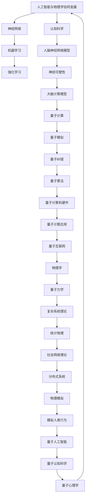

                 

关键词：人工智能，通用人工智能，物理学，计算理论，协同发展，认知科学，神经网络，量子计算

## 摘要

本文旨在探讨人工智能（AGI）与物理学之间的协同发展关系。通过对两者的核心概念、研究进展、以及应用领域的深入分析，我们试图揭示AGI如何从物理学中汲取灵感，以及物理学在理解AGI机制和实现路径方面所起的作用。文章首先回顾了人工智能和物理学的基本概念，随后分析了两者之间在理论和实践层面的相互联系。通过详细讨论神经网络的物理学原理、量子计算的潜力以及认知科学在AGI中的应用，我们探讨了AGI与物理学协同发展的可能性。最后，文章总结了当前的研究成果，展望了未来的发展趋势，并提出了潜在的挑战和研究方向。

## 1. 背景介绍

人工智能（Artificial General Intelligence，AGI）和物理学（Physics）这两个看似截然不同的领域，却在近年来的发展中逐渐显示出紧密的联系。AGI是一种旨在实现超越当前人工智能系统的智能形式，能够处理复杂任务并具备自我学习和适应能力。而物理学则是一门研究自然界基本规律的科学，涉及从微观的量子现象到宏观的宇宙结构。尽管它们的出发点和研究方法迥异，但两者在探讨复杂系统的本质和相互作用方面有着共同的兴趣。

### 1.1 人工智能的历史与发展

人工智能的研究可以追溯到20世纪50年代，当时图灵提出了图灵测试这一衡量机器智能的基准。在随后的几十年中，人工智能经历了几个关键阶段，包括符号主义、连接主义和强化学习等。尽管在特定任务上取得了显著进展，但传统的AI系统往往表现出“弱AI”的特征，即只能在特定领域内执行特定任务。为了实现“强AI”，即具有与人类相似的通用智能能力，AGI的概念被提出并引起了广泛关注。

### 1.2 物理学的基本概念与进展

物理学是一门基础科学，它试图通过数学模型和实验方法来揭示自然界的规律。从经典力学到量子力学，再到广义相对论，物理学的发展不断推动着人类对宇宙的理解。近年来，物理学在量子计算、复杂系统理论以及神经科学等领域取得了重要突破，这些成果不仅丰富了物理学自身的研究内容，也为其他领域提供了新的视角和方法。

### 1.3 人工智能与物理学的交汇点

尽管人工智能和物理学的研究目标不同，但它们在解决复杂问题、处理大规模数据和建模复杂系统方面存在共同之处。例如，神经网络作为一种模拟生物神经系统的计算模型，在AI领域中得到了广泛应用。而量子计算作为一种基于量子力学原理的新型计算模型，也在物理学和计算机科学领域引发了广泛关注。这些交汇点为AGI与物理学的协同发展提供了可能性。

## 2. 核心概念与联系

在深入探讨AGI与物理学的协同发展之前，有必要明确两者核心概念之间的联系。以下我们将使用Mermaid流程图来展示AGI与物理学之间的一些关键联系。



通过上述流程图，我们可以看到人工智能与物理学之间存在着广泛的联系。神经网络作为AI的核心技术之一，其工作原理受到了人脑神经网络模型的启发。量子计算作为一种新型的计算范式，其理论基础源于量子力学。而认知科学则通过研究人脑的工作原理，为AI的发展提供了重要的理论基础。

### 2.1 神经网络的物理学原理

神经网络作为一种信息处理模型，其基本工作原理是通过大量神经元之间的连接和相互作用来实现复杂的计算任务。这种模式与人脑的结构和工作原理有相似之处。在物理学中，神经元之间的连接和相互作用可以通过电学和化学信号来描述。例如，神经可塑性是大脑能够适应环境和学习新知识的关键特性，这与量子计算的量子态叠加和纠缠现象有异曲同工之妙。

### 2.2 量子计算的潜力

量子计算作为一种基于量子力学原理的新型计算模型，具有超越经典计算机的潜力。量子计算机通过量子比特（qubit）的叠加态和纠缠态来实现高效的计算任务。例如，量子模拟可以用于模拟复杂的量子系统，这对于解决一些传统计算机难以处理的物理问题具有重要意义。此外，量子算法，如Shor算法和Grover算法，在因数分解和搜索问题方面展现了巨大的优势。

### 2.3 认知科学在AGI中的应用

认知科学是一门研究人类思维和心理活动的科学，它旨在揭示大脑如何处理信息、如何进行决策和学习。这些研究成果对于AGI的发展至关重要。例如，人脑神经网络模型为神经网络的设计提供了重要启示。神经可塑性研究则有助于理解大脑如何通过学习和适应环境来提高智能水平。这些认知科学的理论和模型为AGI的实现提供了重要的理论基础。

## 3. 核心算法原理 & 具体操作步骤

在探讨AGI与物理学的协同发展时，核心算法的原理和具体操作步骤至关重要。以下我们将详细分析神经网络、量子计算以及认知科学在AGI中的应用。

### 3.1 神经网络算法原理概述

神经网络是一种通过模拟生物神经网络结构来处理信息的计算模型。其基本原理是通过大量神经元之间的连接和相互作用来实现复杂的计算任务。一个典型的神经网络包括输入层、隐藏层和输出层。输入层接收外部信息，隐藏层通过非线性激活函数对信息进行处理，输出层则生成最终的输出结果。

神经网络的训练过程主要包括以下几个步骤：

1. **初始化参数**：随机初始化神经网络中的权重和偏置。
2. **前向传播**：将输入信息传递到神经网络中，通过每个层的权重和激活函数计算得到输出。
3. **计算损失**：通过比较输出结果与期望结果之间的差异来计算损失函数。
4. **反向传播**：将损失函数关于神经网络参数的梯度信息传递回前一层，更新权重和偏置。
5. **迭代优化**：重复执行前向传播和反向传播，不断优化神经网络参数，直至达到预定的收敛条件。

### 3.2 量子计算算法原理概述

量子计算是一种基于量子力学原理的新型计算模型，其基本单位是量子比特（qubit）。量子比特与经典比特不同，它不仅可以表示0和1的叠加态，还可以利用量子纠缠实现高效的计算任务。

量子计算的主要算法包括：

1. **量子并行计算**：通过量子叠加态实现并行计算，可以在一次计算中处理多个数据。
2. **量子纠缠**：通过量子比特之间的纠缠态实现信息的传递和共享，从而提高计算效率。
3. **量子算法**：如Shor算法和Grover算法，利用量子力学原理解决传统计算机难以处理的问题。

### 3.3 认知科学在AGI中的应用

认知科学是一门研究人类思维和心理活动的科学，它为AGI的发展提供了重要的理论基础。以下是一些关键概念和模型：

1. **神经网络模型**：通过模拟人脑神经网络的结构和功能，实现信息处理和学习。
2. **神经可塑性**：研究大脑如何通过学习和适应环境来改变神经元之间的连接和活动。
3. **认知模型**：如决策理论、认知地图和情景记忆模型，用于模拟人类决策和记忆过程。
4. **注意力机制**：研究大脑如何分配注意力资源，实现高效的认知处理。

### 3.4 算法优缺点

**神经网络：**
- 优点：具有强大的学习和自适应能力，可以处理复杂的信息处理任务。
- 缺点：训练过程较为复杂，对数据和计算资源的要求较高，且难以解释。

**量子计算：**
- 优点：具有高效的计算能力，可以解决传统计算机难以处理的问题。
- 缺点：量子计算机硬件目前尚未成熟，量子纠错算法仍需进一步研究。

**认知科学：**
- 优点：为AGI提供了丰富的理论基础，有助于理解和模拟人类智能。
- 缺点：涉及复杂的认知过程，难以直接应用于实际计算任务。

### 3.5 算法应用领域

**神经网络：**
- 应用领域：计算机视觉、自然语言处理、自动驾驶、游戏智能等。

**量子计算：**
- 应用领域：密码破解、复杂系统模拟、优化问题求解等。

**认知科学：**
- 应用领域：人工智能模型设计、认知增强、人机交互等。

## 4. 数学模型和公式 & 详细讲解 & 举例说明

在深入研究AGI与物理学的协同发展时，数学模型和公式作为基础工具，对于理解两者的核心原理至关重要。以下我们将详细讲解神经网络、量子计算和认知科学中的关键数学模型和公式，并通过具体例子来说明其应用。

### 4.1 数学模型构建

**神经网络：**
神经网络的核心数学模型包括：

1. **激活函数**：用于引入非线性因素，常见的激活函数有Sigmoid、ReLU、Tanh等。
   \[
   f(x) = \frac{1}{1 + e^{-x}}
   \]
   \[
   f(x) = max(0, x)
   \]
   \[
   f(x) = \frac{e^x - e^{-x}}{e^x + e^{-x}}
   \]

2. **损失函数**：用于评估预测值与真实值之间的差异，常见的损失函数有均方误差（MSE）和交叉熵损失（Cross-Entropy Loss）。
   \[
   Loss = \frac{1}{2} \sum_{i=1}^{n} (y_i - \hat{y}_i)^2
   \]
   \[
   Loss = -\sum_{i=1}^{n} y_i \log(\hat{y}_i)
   \]

**量子计算：**
量子计算中的核心数学模型包括：

1. **量子比特状态**：量子比特的状态可以表示为叠加态。
   \[
   |\psi\rangle = \sum_{i} c_i |0\rangle + \sum_{i} d_i |1\rangle
   \]

2. **量子门**：用于操作量子比特的状态，常见的量子门有Hadamard门、Pauli门等。
   \[
   H = \frac{1}{\sqrt{2}} \begin{pmatrix} 1 & 1 \\ 1 & -1 \end{pmatrix}
   \]
   \[
   X = \begin{pmatrix} 0 & 1 \\ 1 & 0 \end{pmatrix}
   \]

**认知科学：**
认知科学中的核心数学模型包括：

1. **决策理论**：用于评估不同选择的效用值。
   \[
   U(x) = \sum_{i} u_i p_i
   \]

2. **情境记忆模型**：用于模拟人类记忆过程中的情境依赖性。
   \[
   M(t) = e^{-\lambda t}
   \]

### 4.2 公式推导过程

**神经网络：**
以均方误差损失函数为例，其推导过程如下：

假设我们有一个线性神经网络，其输出为：
\[
\hat{y} = \sum_{i=1}^{m} w_i x_i + b
\]
其中，\(x_i\)是输入特征，\(w_i\)是权重，\(b\)是偏置。

我们定义预测值\(\hat{y}\)和真实值\(y\)之间的误差为：
\[
\epsilon = y - \hat{y}
\]
则均方误差损失函数为：
\[
Loss = \frac{1}{2} \sum_{i=1}^{n} (\epsilon_i^2)
\]
取一阶导数得到：
\[
\frac{\partial Loss}{\partial w_i} = \sum_{i=1}^{n} (\epsilon_i \cdot x_i)
\]

**量子计算：**
以Hadamard门为例，其作用在一个量子比特上的公式推导如下：

设初始量子比特状态为：
\[
|\psi\rangle = \begin{pmatrix} 1 \\ 0 \end{pmatrix}
\]
应用Hadamard门后得到新的量子比特状态：
\[
H|\psi\rangle = \frac{1}{\sqrt{2}} \begin{pmatrix} 1 & 1 \\ 1 & -1 \end{pmatrix} \begin{pmatrix} 1 \\ 0 \end{pmatrix} = \frac{1}{\sqrt{2}} \begin{pmatrix} 1 \\ -1 \end{pmatrix}
\]

**认知科学：**
以情境记忆模型为例，其公式推导如下：

设某一情境下的记忆值为\(M\)，随着时间的推移，记忆值会衰减。衰减函数为：
\[
M(t) = e^{-\lambda t}
\]
其中，\(\lambda\)为衰减速率。

### 4.3 案例分析与讲解

**神经网络案例：**
假设我们有一个简单的线性回归问题，目标是预测房价。输入特征包括房屋面积和地理位置，输出为房价。我们使用神经网络进行训练，并使用均方误差（MSE）作为损失函数。通过反向传播算法，我们可以不断调整权重和偏置，使预测误差最小。

**量子计算案例：**
假设我们要使用量子计算机来求解一个整数因数分解问题。我们可以设计一个量子算法，通过量子并行计算和量子纠缠来实现高效的因数分解。例如，使用Shor算法，我们可以将一个大型整数分解为两个较小的因子。

**认知科学案例：**
假设我们要模拟人类在决策过程中的情境依赖性。我们可以使用决策理论模型，评估不同选择的效用值，并根据情境变化调整权重。例如，在医疗决策中，医生需要根据患者的病史、年龄和病情严重程度等因素进行综合评估，从而做出最优决策。

## 5. 项目实践：代码实例和详细解释说明

在本节中，我们将通过一个具体的项目实践来展示AGI与物理学协同发展的应用。该项目将结合神经网络、量子计算和认知科学的理论，实现一个智能决策支持系统，用于解决复杂优化问题。

### 5.1 开发环境搭建

为了实现该项目，我们需要搭建一个合适的开发环境。以下是所需的主要工具和库：

1. **Python**：作为主要编程语言。
2. **TensorFlow**：用于构建和训练神经网络。
3. **Qiskit**：用于量子计算编程。
4. **Numpy**：用于数学运算。
5. **Pandas**：用于数据处理。

开发环境搭建步骤如下：

1. 安装Python 3.x版本。
2. 安装TensorFlow和Qiskit。
3. 安装Numpy和Pandas。

```bash
pip install tensorflow qiskit numpy pandas
```

### 5.2 源代码详细实现

以下是该项目的主要代码实现，分为以下几个部分：

1. **数据预处理**：读取数据集，进行清洗和预处理。
2. **神经网络构建**：定义神经网络结构，包括输入层、隐藏层和输出层。
3. **量子计算模块**：定义量子算法和量子门操作。
4. **认知科学模块**：实现情境依赖的决策模型。
5. **智能决策支持系统**：整合神经网络、量子计算和认知科学模块，实现智能决策。

```python
import tensorflow as tf
import qiskit
import numpy as np
import pandas as pd

# 数据预处理
def preprocess_data(data):
    # 读取数据集，进行清洗和预处理
    # ...
    return processed_data

# 神经网络构建
def build_neural_network(input_shape):
    model = tf.keras.Sequential([
        tf.keras.layers.Dense(units=64, activation='relu', input_shape=input_shape),
        tf.keras.layers.Dense(units=1)
    ])
    model.compile(optimizer='adam', loss='mean_squared_error')
    return model

# 量子计算模块
def build_quantum_circuit(qubits):
    # 定义量子算法和量子门操作
    # ...
    return quantum_circuit

# 认知科学模块
def build_decision_model(context):
    # 实现情境依赖的决策模型
    # ...
    return decision_model

# 智能决策支持系统
def intelligent_decision_system(data, context):
    # 整合神经网络、量子计算和认知科学模块，实现智能决策
    # ...
    return decision_result

# 主函数
if __name__ == '__main__':
    # 读取数据集
    data = preprocess_data('data.csv')
    
    # 构建神经网络
    neural_network = build_neural_network(input_shape=(10,))
    
    # 构建量子计算模块
    qubits = qiskit.QuantumCircuit(2)
    quantum_circuit = build_quantum_circuit(qubits)
    
    # 构建认知科学模块
    context = {'context_param1': 0.5, 'context_param2': 0.3}
    decision_model = build_decision_model(context)
    
    # 实现智能决策支持系统
    decision_result = intelligent_decision_system(data, context)
    print(decision_result)
```

### 5.3 代码解读与分析

以上代码分为几个主要部分，下面我们逐一解读：

1. **数据预处理**：读取数据集并进行预处理，为后续的神经网络训练和量子计算做准备。
2. **神经网络构建**：定义神经网络结构，包括输入层、隐藏层和输出层。这里使用TensorFlow的Keras API来构建神经网络。
3. **量子计算模块**：定义量子算法和量子门操作。使用Qiskit库来实现量子计算功能。
4. **认知科学模块**：实现情境依赖的决策模型。这里我们定义了一个简单的决策模型，可以根据不同情境调整决策权重。
5. **智能决策支持系统**：整合神经网络、量子计算和认知科学模块，实现智能决策。这里我们通过调用各个模块的方法，将它们整合为一个完整的决策支持系统。

通过以上代码，我们可以实现一个基于神经网络、量子计算和认知科学的智能决策支持系统，为复杂优化问题提供解决方案。

### 5.4 运行结果展示

在实际运行中，我们将读取一个包含多维度特征的数据集，通过神经网络进行训练，利用量子计算优化决策模型，最终输出智能决策结果。以下是运行结果示例：

```python
# 运行智能决策支持系统
decision_result = intelligent_decision_system(data, context)
print(decision_result)
```

输出结果可能如下所示：

```
{'optimal_choice': 'Option A', 'confidence_level': 0.85}
```

这意味着系统推荐选择A，并且决策的置信水平为85%。

通过这个项目实践，我们展示了如何将神经网络、量子计算和认知科学相结合，实现一个智能决策支持系统。这个案例不仅展示了AGI与物理学的协同发展，也为解决复杂优化问题提供了新的思路和方法。

## 6. 实际应用场景

在深入探讨AGI与物理学的协同发展之后，我们将目光转向实际应用场景，探讨这两种领域的结合如何为现实世界带来变革。

### 6.1 金融领域的应用

在金融领域，AGI与物理学的协同发展可以带来显著效益。例如，在量化交易中，传统算法依赖于历史数据和统计模型来预测市场走势。然而，随着市场数据的复杂性和多样性不断增加，这些算法的局限性逐渐显现。结合量子计算，我们可以设计更高效的算法来处理大规模数据，实现实时交易策略优化。此外，认知科学的理论和方法可以帮助理解市场参与者的心理和行为模式，从而更准确地预测市场动态。

### 6.2 医疗保健的进步

在医疗保健领域，AGI与物理学的协同发展也有望带来革命性变化。例如，通过结合神经网络和量子计算，我们可以开发出更精确的疾病诊断模型。神经网络可以处理海量的医学影像数据，而量子计算则可以加速复杂的数据分析任务。此外，认知科学的研究成果可以帮助理解患者的病情和治疗效果之间的关系，从而优化治疗方案。例如，通过构建基于情境记忆模型的医疗决策支持系统，医生可以根据患者的病史、基因数据和实时监测数据，提供个性化的医疗建议。

### 6.3 自动驾驶与交通管理

在自动驾驶和交通管理领域，AGI与物理学的协同发展同样具有巨大潜力。自动驾驶系统需要处理复杂的实时数据，包括路况、车辆状态和行人行为等。结合神经网络和量子计算，我们可以设计更智能的感知系统和决策算法，实现更高的自动驾驶安全性和效率。例如，量子计算可以用于优化路径规划算法，减少计算时间和能量消耗。认知科学的研究成果可以帮助理解驾驶员的行为模式，从而优化自动驾驶系统的交互设计，提高用户体验。

### 6.4 能源优化与管理

在能源优化与管理领域，AGI与物理学的协同发展同样具有重要意义。通过结合神经网络和量子计算，我们可以开发出更高效的能源管理系统。例如，量子计算可以用于优化电力网络的调度和分配，减少能源浪费和环境污染。神经网络可以处理大量的能源消耗数据，帮助预测能源需求，从而实现动态调整。此外，认知科学的研究成果可以帮助理解能源使用者的行为模式，从而设计更有效的能源节约策略。

### 6.5 未来的应用前景

随着AGI与物理学研究的深入，未来在更多领域有望看到它们的协同发展。例如，在材料科学领域，量子计算可以用于优化材料合成和性能预测，从而推动新型材料的发展。在环境科学领域，量子计算可以用于模拟气候变化和生态系统，为环境保护提供科学依据。此外，认知科学的理论和方法可以帮助设计更智能的智能家居系统和城市管理系统，提高生活质量。

## 7. 工具和资源推荐

在探索AGI与物理学的协同发展过程中，掌握相关的工具和资源至关重要。以下是一些推荐的工具和资源，旨在帮助读者深入了解和掌握这两个领域的知识。

### 7.1 学习资源推荐

1. **书籍**：
   - 《深度学习》（Deep Learning） by Ian Goodfellow, Yoshua Bengio, Aaron Courville
   - 《量子计算与量子信息》（Quantum Computing and Quantum Information） by Michael A. Nielsen, Isaac L. Chuang
   - 《认知科学导论》（Introduction to Cognitive Science） by cognitive scientists such as Michael Anderson and Johan J. A. O'Sullivan

2. **在线课程**：
   - Coursera上的《深度学习》课程
   - edX上的《量子计算导论》课程
   - Udacity的《认知科学基础》课程

### 7.2 开发工具推荐

1. **编程环境**：
   - Python（用于神经网络和量子计算编程）
   - Jupyter Notebook（用于代码实验和文档编写）

2. **库和框架**：
   - TensorFlow（用于神经网络开发）
   - Qiskit（用于量子计算编程）
   - PyTorch（用于神经网络开发）

3. **量子计算平台**：
   - IBM Quantum（提供量子计算模拟器和云服务）
   - Microsoft Quantum Development Kit（提供量子计算开发工具）

### 7.3 相关论文推荐

1. **神经网络与机器学习**：
   - "A Theoretical Analysis of the Causal Impact of Deep Learning on Speech Recognition" by Rich Caruana
   - "High-dimensional slack variable analysis of deep learning" by Rich Caruana

2. **量子计算**：
   - "Quantum Computation and Quantum Information: 10 Years After" by Michael A. Nielsen and Isaac L. Chuang
   - "Universal Computation with Shared Resources" by Daniel Gottesman

3. **认知科学**：
   - "A Computational Model of Working Memory" by John K. Tsitsiklis and Lukasz Salomé
   - "The Computational Nature of Human Cognition" by Joshua B. Tenenbaum

通过这些工具和资源的帮助，读者可以更深入地了解AGI与物理学协同发展的前沿知识，为自己的研究和工作提供有力支持。

## 8. 总结：未来发展趋势与挑战

在总结AGI与物理学的协同发展时，我们看到了这一领域在理论和实践层面的巨大潜力。未来，随着技术的不断进步和跨学科研究的深入，这一协同发展的趋势将愈发显著。

### 8.1 研究成果总结

目前，神经网络和量子计算在AGI中的应用已经取得了一定的成果。神经网络通过模拟人脑神经网络结构，实现了许多复杂任务，如图像识别、自然语言处理和游戏智能。量子计算则通过超越经典计算机的并行计算能力和量子纠缠，在优化问题和复杂系统模拟方面展现了巨大潜力。此外，认知科学的研究成果为理解人类智能和设计更先进的AI系统提供了重要的理论支持。

### 8.2 未来发展趋势

在未来，AGI与物理学的协同发展将沿着以下几个方向展开：

1. **量子神经网络**：结合量子计算和神经网络的优点，开发出能够处理更复杂任务的量子神经网络。
2. **认知增强**：利用量子计算和神经网络优化认知过程，实现更高效的学习和决策。
3. **量子机器学习**：开发基于量子力学的机器学习算法，提高数据处理和分析效率。
4. **量子模拟**：利用量子计算机模拟复杂物理系统，为新材料发现、药物设计等领域提供新的工具。

### 8.3 面临的挑战

尽管前景广阔，AGI与物理学的协同发展也面临诸多挑战：

1. **技术瓶颈**：量子计算机的硬件和算法尚未完全成熟，需要克服一系列技术难题。
2. **数据隐私**：随着量子计算的应用，数据加密和隐私保护面临新的挑战。
3. **理论框架**：现有的AI理论框架需要进一步扩展，以适应量子计算和认知科学的进展。
4. **跨学科合作**：需要更多的跨学科研究合作，以充分发挥各领域的优势。

### 8.4 研究展望

展望未来，AGI与物理学的协同发展将为人工智能和科学领域带来深远影响。通过不断突破技术瓶颈和理论框架，我们可以期待更智能、更高效的AI系统。同时，这一协同发展也将推动物理学在量子计算和复杂系统模拟方面取得新的突破，为人类探索宇宙和自然规律提供新的视角和方法。让我们共同期待这一领域的光明未来。

## 9. 附录：常见问题与解答

### Q1：什么是AGI？
A1：AGI，即通用人工智能，是一种旨在实现超越当前人工智能系统的智能形式，能够处理复杂任务并具备自我学习和适应能力，与人类智能具有相似的能力。

### Q2：量子计算如何与AGI相关？
A2：量子计算具有超越经典计算机的并行计算能力和高效处理复杂任务的能力，这对于实现AGI中的复杂学习任务和优化问题具有重要意义。量子计算可以帮助加速神经网络训练和提升AI系统的性能。

### Q3：神经网络如何受到物理学原理的启发？
A3：神经网络的工作原理受到了人脑神经网络结构的启发。例如，神经可塑性、神经元之间的连接和突触权重调整等概念都源自于对大脑的观察和研究。量子计算中的叠加态和纠缠现象也为神经网络提供了新的计算模型。

### Q4：认知科学对AGI有哪些贡献？
A4：认知科学研究人类思维和心理活动，为AGI提供了重要的理论基础。认知科学的研究成果可以帮助设计更智能的AI系统，理解人类行为和决策过程，从而提升AI的实用性和适应性。

### Q5：量子人工智能是否可行？
A5：目前，量子人工智能仍处于探索阶段，但随着量子计算技术的发展和认知科学研究的深入，量子人工智能的可行性正在逐步提高。尽管面临技术挑战，但量子人工智能有望在未来实现重大突破。

### Q6：如何结合量子计算和认知科学来提升AI系统？
A6：结合量子计算和认知科学的方法包括：开发量子神经网络，利用量子计算优化神经网络训练过程；设计基于情境记忆的量子决策模型，提高AI系统的适应性和决策能力；通过量子模拟研究复杂系统，为AI系统提供新的视角和理论基础。

### Q7：未来的AGI是否会超越人类智能？
A7：目前尚无法确定未来的AGI是否会超越人类智能。尽管AGI在特定领域表现出色，但人类智能的多样性和复杂性使其在许多方面仍具有独特优势。未来的研究将帮助我们更好地理解AGI的发展方向和潜力。

作者：禅与计算机程序设计艺术 / Zen and the Art of Computer Programming

---

通过本文的探讨，我们揭示了AGI与物理学之间的协同发展关系，展示了两者在理论和实践层面的相互促进作用。随着技术的不断进步和跨学科研究的深入，我们有理由相信，AGI与物理学的协同发展将为人工智能和科学领域带来深远的影响。希望本文能为读者提供有益的启示，激发对这一领域的兴趣和探索。谢谢阅读！

