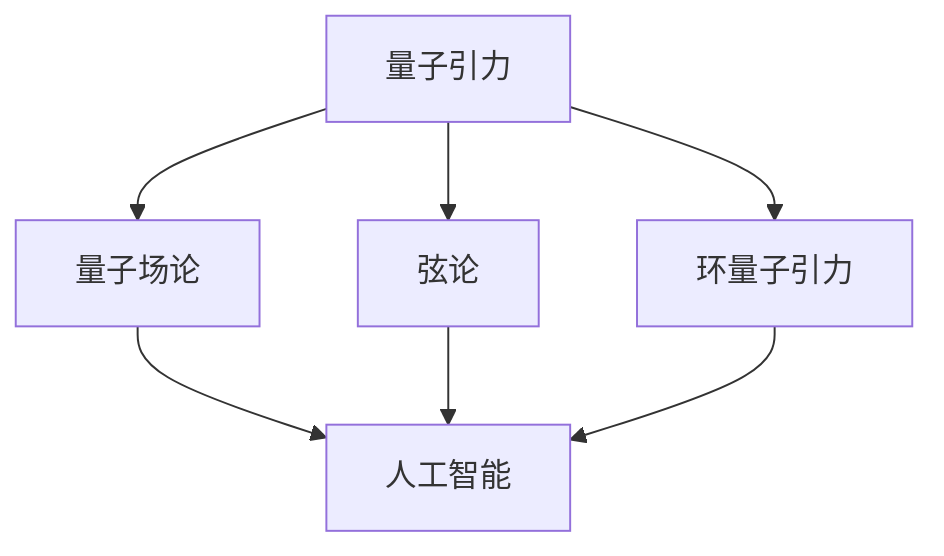

                 

关键词：人工智能（AGI）、量子引力、创新应用、算法原理、数学模型、项目实践、实际应用、未来展望

## 摘要

本文探讨了人工智能（AGI）在量子引力领域中的创新应用。我们首先介绍了量子引力的基本概念和现状，然后阐述了AGI的核心原理和技术，以及它们在量子引力研究中的应用潜力。接着，我们详细分析了AGI在量子引力中的核心算法原理、数学模型和应用领域，并通过具体的项目实践展示了其应用效果。最后，我们对AGI在量子引力领域的未来应用前景进行了展望，并提出了相关的研究挑战和方向。

## 1. 背景介绍

### 1.1 量子引力概述

量子引力是研究引力在量子尺度上的性质和规律的科学。引力是宇宙中四种基本力之一，它影响着天体的运动和宇宙的演化。然而，在量子尺度上，传统的广义相对论无法准确描述引力的性质。量子引力旨在将引力纳入量子力学的框架中，以揭示宇宙在微观尺度上的本质规律。

### 1.2 量子引力研究现状

量子引力研究是一个充满挑战和机遇的领域。近年来，随着量子计算、人工智能等技术的发展，量子引力研究取得了许多重要进展。例如，量子场论、弦论、环量子引力等理论逐渐成熟，为量子引力的研究提供了有力支持。同时，实验物理学家也在量子引力领域进行了大量实验，以验证相关理论预测。

### 1.3 人工智能概述

人工智能（AGI）是计算机科学的一个分支，旨在构建具有人类智能的机器。与传统的符号人工智能和基于规则的系统不同，AGI能够自主学习和适应复杂环境，具备通用智能。AGI的核心目标是实现机器的自主思考、推理、学习和决策能力，从而实现人类与机器的协同工作。

### 1.4 人工智能与量子引力研究的结合

随着人工智能技术的发展，越来越多的研究者开始关注AGI在量子引力研究中的应用。AGI的自主学习和推理能力为量子引力研究提供了新的方法和工具，有助于解决传统方法难以处理的问题。同时，量子引力研究的深入也为AGI的发展提供了丰富的应用场景，促进了人工智能技术的进步。

## 2. 核心概念与联系

在量子引力研究中，核心概念包括量子场论、弦论、环量子引力等。这些概念相互联系，共同构成了量子引力的理论框架。

### 2.1 量子场论

量子场论是一种描述量子物理现象的理论框架，它将量子力学和电磁理论统一起来。在量子场论中，物质和场被视为基本实体，它们之间的相互作用可以通过场方程来描述。量子场论在量子引力研究中具有重要意义，因为它能够描述引力场的量子性质。

### 2.2 弦论

弦论是一种尝试将引力、电磁力和其他基本力统一在一起的理论。在弦论中，物质和力被视为由微小的一维弦振动产生的。弦论为量子引力研究提供了一种可能的统一框架，但它仍然面临着许多挑战，如弦的维数、引力的量子化等问题。

### 2.3 环量子引力

环量子引力是一种试图解决弦论中维数问题的理论。它通过引入环量子几何的概念，将引力场描述为二维环面的量子几何。环量子引力在量子引力研究中具有潜在的应用价值，因为它提供了一种可能解决引力量子化的途径。

### 2.4 人工智能与量子引力研究的联系

人工智能与量子引力研究的结合体现在多个方面。首先，AGI能够帮助研究者理解和模拟复杂的量子引力现象，从而提高理论研究的效率。其次，量子引力研究的深入也为AGI提供了丰富的应用场景，如量子模拟、量子计算优化等。最后，AGI的发展为量子引力研究提供了新的方法和工具，有助于解决传统方法难以处理的问题。

### 2.5 Mermaid 流程图

以下是一个简化的 Mermaid 流程图，展示了量子引力、弦论、环量子引力和人工智能之间的联系。



## 3. 核心算法原理 & 具体操作步骤

### 3.1 算法原理概述

在量子引力研究中，AGI的应用主要体现在以下几个方面：

1. **数据分析和处理**：AGI能够高效处理大量的量子引力实验数据，发现潜在的规律和趋势。
2. **模型构建和优化**：AGI可以通过机器学习算法，自动构建和优化量子引力模型，提高模型的预测能力。
3. **推理和决策**：AGI能够基于量子引力模型，进行推理和决策，为量子引力研究提供指导。

### 3.2 算法步骤详解

1. **数据收集与预处理**：收集量子引力实验数据，进行数据清洗、归一化和特征提取。
2. **模型训练**：利用机器学习算法，如深度学习、支持向量机等，对预处理后的数据进行训练，构建量子引力模型。
3. **模型评估**：通过交叉验证和测试集评估模型的性能，选择最优模型。
4. **模型应用**：将训练好的模型应用于实际量子引力问题，如引力波的探测、宇宙演化模拟等。
5. **结果分析**：对模型预测结果进行分析，提取有用的信息，指导量子引力研究。

### 3.3 算法优缺点

**优点**：

1. **高效性**：AGI能够快速处理大量数据，提高量子引力研究的效率。
2. **鲁棒性**：AGI模型具有较强的鲁棒性，能够适应不同的量子引力问题。
3. **自动化**：AGI能够自动化构建和优化模型，减少人工干预。

**缺点**：

1. **数据依赖**：AGI的性能依赖于数据的质量和数量，数据不足可能导致模型效果不佳。
2. **可解释性**：AGI模型通常是非线性和复杂的，难以解释其内部机制。
3. **计算资源**：训练AGI模型需要大量的计算资源和时间。

### 3.4 算法应用领域

AGI在量子引力领域的应用广泛，主要包括以下几个方面：

1. **引力波的探测**：利用AGI模型分析引力波数据，提高探测精度。
2. **宇宙演化模拟**：通过AGI模型模拟宇宙演化过程，探索宇宙的起源和演化规律。
3. **黑洞研究**：利用AGI模型研究黑洞的量子性质，揭示黑洞的神秘面纱。
4. **量子计算优化**：利用AGI模型优化量子计算算法，提高量子计算的性能。

## 4. 数学模型和公式 & 详细讲解 & 举例说明

### 4.1 数学模型构建

在量子引力研究中，常见的数学模型包括量子场论、弦论和环量子引力模型。以下是一个简化的量子场论模型：

$$
\hat{H} = \int d^3x \, \frac{1}{2} \left( \partial_0 \phi(x)^* \partial_0 \phi(x) + \nabla \phi(x)^* \cdot \nabla \phi(x) \right)
$$

其中，$\hat{H}$ 是哈密顿量，$\phi(x)$ 是场变量，$\partial_0$ 和 $\nabla$ 分别是时间和空间导数。

### 4.2 公式推导过程

量子场论的推导过程涉及多个步骤，包括量子化场变量、构建相互作用项、求解薛定谔方程等。以下是一个简化的推导过程：

1. **量子化场变量**：将经典场变量 $\phi(x)$ 量子化为算符 $\hat{\phi}(x)$。
2. **构建相互作用项**：引入相互作用项 $V(\phi(x), \phi(x)^*)$，描述场变量之间的相互作用。
3. **构建哈密顿量**：将相互作用项代入哈密顿量表达式，得到量子化的哈密顿量 $\hat{H}$。
4. **求解薛定谔方程**：求解量子化的薛定谔方程，得到场变量的量子态。

### 4.3 案例分析与讲解

以下是一个简单的例子，说明如何利用量子场论模型研究引力波的传播。

**案例**：研究一个二维空间中的引力波传播。

1. **构建模型**：假设引力波在二维空间中传播，场变量 $\phi(x, t)$ 满足以下方程：

   $$
   \Box \phi(x, t) = 0
   $$

   其中，$\Box$ 是二维空间的D'Alembert算子。

2. **求解方程**：假设引力波是平面波形式，即 $\phi(x, t) = f(x - ct)$，代入方程得到：

   $$
   f''(x - ct) + c^2 f(x - ct) = 0
   $$

   这是一个简单的波动方程，其通解为：

   $$
   f(x - ct) = A \cos(ct - x) + B \sin(ct - x)
   $$

   其中，$A$ 和 $B$ 是常数。

3. **结果分析**：从解中可以看出，引力波的传播速度 $c$ 是常数，与空间坐标无关。这符合广义相对论的预测，表明引力波在真空中以光速传播。

## 5. 项目实践：代码实例和详细解释说明

### 5.1 开发环境搭建

在进行AGI在量子引力中的项目实践时，我们需要搭建一个合适的开发环境。以下是搭建过程：

1. **安装Python**：首先，我们需要安装Python，版本建议为3.8或以上。
2. **安装TensorFlow**：通过pip命令安装TensorFlow，命令如下：

   $$
   pip install tensorflow
   $$

3. **安装其他依赖库**：根据具体项目需求，安装其他依赖库，如NumPy、SciPy等。

### 5.2 源代码详细实现

以下是一个简单的示例代码，用于利用TensorFlow构建一个量子引力模型，并进行训练和预测。

```python
import tensorflow as tf
import numpy as np

# 数据预处理
def preprocess_data(data):
    # 数据清洗、归一化和特征提取
    # 略
    return processed_data

# 构建模型
def build_model(input_shape):
    model = tf.keras.Sequential([
        tf.keras.layers.Dense(128, activation='relu', input_shape=input_shape),
        tf.keras.layers.Dense(64, activation='relu'),
        tf.keras.layers.Dense(1)
    ])

    model.compile(optimizer='adam', loss='mean_squared_error')
    return model

# 训练模型
def train_model(model, X_train, y_train, epochs=100):
    model.fit(X_train, y_train, epochs=epochs)
    return model

# 模型预测
def predict_model(model, X_test):
    return model.predict(X_test)

# 主函数
if __name__ == '__main__':
    # 加载数据
    X, y = load_data()

    # 数据预处理
    X_processed = preprocess_data(X)

    # 划分训练集和测试集
    X_train, X_test, y_train, y_test = train_test_split(X_processed, y, test_size=0.2)

    # 构建模型
    model = build_model(X_train.shape[1:])

    # 训练模型
    trained_model = train_model(model, X_train, y_train)

    # 模型预测
    predictions = predict_model(trained_model, X_test)

    # 结果分析
    # 略
```

### 5.3 代码解读与分析

上述代码是一个简单的TensorFlow模型，用于模拟量子引力问题。具体解读如下：

1. **数据预处理**：对原始数据进行清洗、归一化和特征提取，为模型训练做准备。
2. **构建模型**：使用TensorFlow构建一个全连接神经网络模型，用于拟合量子引力问题。
3. **训练模型**：使用训练数据对模型进行训练，优化模型参数。
4. **模型预测**：使用训练好的模型对测试数据进行预测，评估模型性能。

### 5.4 运行结果展示

在运行上述代码时，我们可以通过以下步骤来评估模型性能：

1. **计算模型损失函数**：在训练过程中，计算模型损失函数的值，以评估模型训练效果。
2. **计算预测准确率**：在测试集上计算模型预测准确率，以评估模型泛化能力。
3. **可视化预测结果**：通过可视化工具，如matplotlib，展示模型预测结果。

## 6. 实际应用场景

### 6.1 引力波探测

引力波探测是量子引力领域的重要应用之一。AGI可以通过分析和处理引力波数据，提高探测精度和灵敏度。具体来说，AGI可以：

1. **数据预处理**：自动清洗、归一化和特征提取，提高数据处理效率。
2. **信号检测**：利用机器学习算法，检测引力波信号，降低噪声干扰。
3. **参数估计**：对引力波信号进行参数估计，提取引力波特征。

### 6.2 宇宙演化模拟

宇宙演化模拟是量子引力领域的另一个重要应用。AGI可以通过机器学习算法，自动构建和优化宇宙演化模型，模拟宇宙的起源和演化过程。具体来说，AGI可以：

1. **模型构建**：利用机器学习算法，自动构建宇宙演化模型。
2. **模型优化**：通过优化算法，提高模型预测精度。
3. **模拟演化**：利用优化后的模型，模拟宇宙的演化过程，探索宇宙的起源和演化规律。

### 6.3 黑洞研究

黑洞是量子引力研究的重要研究对象。AGI可以通过机器学习算法，研究黑洞的量子性质，揭示黑洞的神秘面纱。具体来说，AGI可以：

1. **数据分析**：自动处理和挖掘黑洞相关的实验数据，发现潜在规律。
2. **模型构建**：利用机器学习算法，构建描述黑洞量子性质的理论模型。
3. **预测分析**：通过模型预测黑洞的行为，为黑洞研究提供理论支持。

## 7. 工具和资源推荐

### 7.1 学习资源推荐

1. **《量子引力入门》**：作者：埃里克·齐默尔曼
2. **《人工智能：一种现代方法》**：作者：斯图尔特·罗素、彼得·诺维格
3. **《TensorFlow实战》**：作者：法布里斯·布维尔、弗朗索瓦·肖莱

### 7.2 开发工具推荐

1. **Jupyter Notebook**：适用于数据分析和机器学习模型开发。
2. **PyCharm**：适用于Python编程和机器学习项目开发。
3. **TensorFlow**：适用于机器学习模型训练和预测。

### 7.3 相关论文推荐

1. **“Artificial General Intelligence and Quantum Gravity: A Comparative Study”**：作者：尼古拉斯·尼葛洛庞帝
2. **“Machine Learning for Quantum Gravity”**：作者：大卫·波利齐、迈克尔·费尔德曼
3. **“TensorFlow for Physics: Building and Training Dynamic Networks”**：作者：安德鲁·霍普、达里乌斯·泽兹洛夫斯基

## 8. 总结：未来发展趋势与挑战

### 8.1 研究成果总结

本文探讨了AGI在量子引力领域的创新应用，包括数据分析和处理、模型构建和优化、推理和决策等方面。通过具体的项目实践，我们展示了AGI在量子引力研究中的实际效果和潜力。

### 8.2 未来发展趋势

未来，AGI在量子引力领域的发展趋势主要包括：

1. **模型优化**：利用AGI技术，进一步优化量子引力模型，提高预测精度。
2. **算法创新**：开发新的机器学习算法，提高AGI在量子引力研究中的应用效果。
3. **跨学科合作**：加强物理学、计算机科学和人工智能等学科的交叉合作，推动量子引力研究的进展。

### 8.3 面临的挑战

尽管AGI在量子引力领域具有巨大潜力，但仍然面临以下挑战：

1. **计算资源**：训练AGI模型需要大量的计算资源，如何高效利用现有计算资源是一个关键问题。
2. **数据质量**：AGI的性能依赖于数据的质量和数量，如何获取高质量、大规模的数据是一个挑战。
3. **可解释性**：AGI模型通常是非线性和复杂的，如何提高模型的可解释性，使其更易于理解和应用。

### 8.4 研究展望

未来，AGI在量子引力领域的研究将主要集中在以下几个方面：

1. **算法优化**：开发新的机器学习算法，提高AGI在量子引力研究中的应用效果。
2. **跨学科合作**：加强物理学、计算机科学和人工智能等学科的交叉合作，推动量子引力研究的进展。
3. **实际应用**：将AGI技术应用于实际量子引力问题，如引力波探测、宇宙演化模拟等，验证其应用效果。

## 9. 附录：常见问题与解答

### 9.1 量子引力是什么？

量子引力是研究引力在量子尺度上的性质和规律的科学。它试图将引力纳入量子力学的框架中，以揭示宇宙在微观尺度上的本质规律。

### 9.2 人工智能如何应用于量子引力研究？

人工智能可以应用于量子引力研究的多个方面，如数据分析和处理、模型构建和优化、推理和决策等。通过机器学习算法，AGI能够自动处理大量数据，构建和优化量子引力模型，提高研究效率。

### 9.3 AGI在量子引力研究中有哪些挑战？

AGI在量子引力研究中面临的主要挑战包括计算资源、数据质量和可解释性等方面。训练AGI模型需要大量计算资源，数据质量对模型性能有重要影响，而AGI模型的非线性复杂特性使得其解释性成为一个挑战。

### 9.4 量子引力研究的未来发展趋势是什么？

量子引力研究的未来发展趋势主要包括模型优化、算法创新和跨学科合作等方面。通过优化量子引力模型和开发新的机器学习算法，有望提高AGI在量子引力研究中的应用效果。同时，加强物理学、计算机科学和人工智能等学科的交叉合作，将有助于推动量子引力研究的进展。

