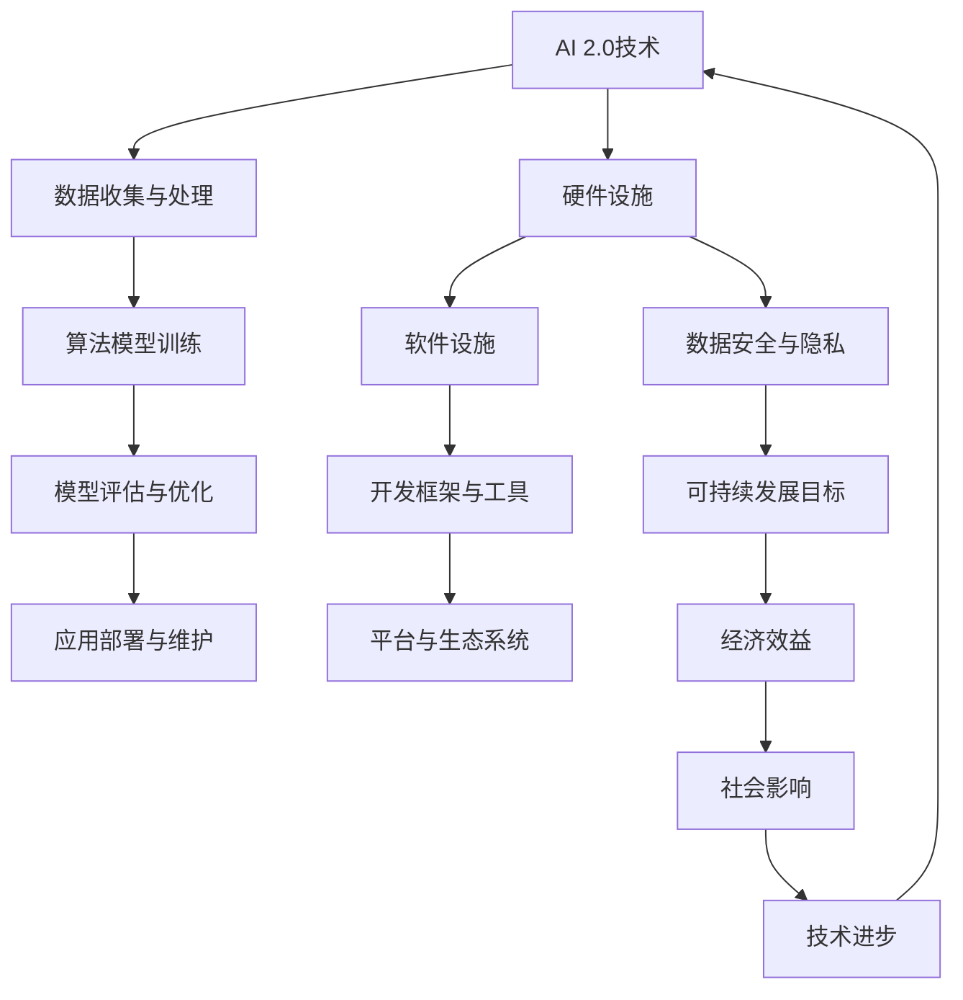
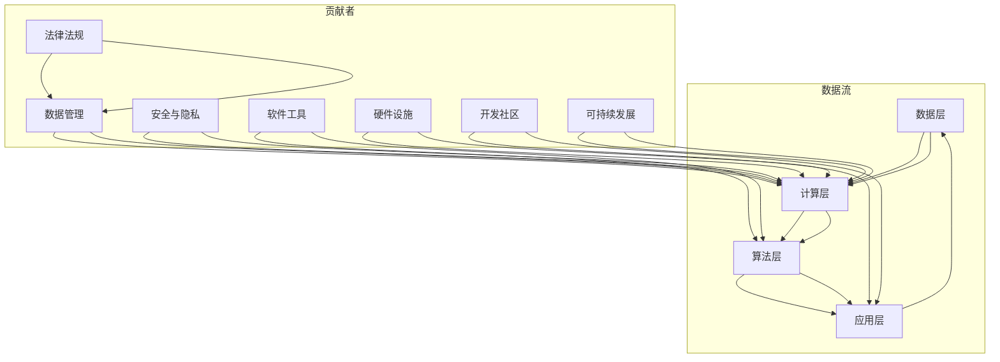
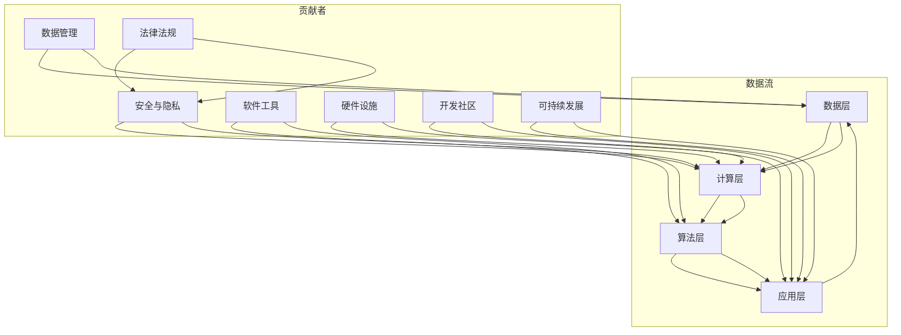

                 

关键词：AI 2.0、基础设施、可持续发展、技术架构、算法、数学模型、实践案例、未来展望

## 摘要

随着人工智能技术的迅猛发展，AI 2.0时代已经到来。然而，基础设施的建设与可持续发展成为制约AI技术进一步发展的关键因素。本文旨在探讨AI 2.0基础设施建设的必要性、核心概念、算法原理、数学模型以及实际应用案例，并对未来的发展趋势和面临的挑战进行深入分析。

## 1. 背景介绍

### AI 1.0与AI 2.0的区别

人工智能（AI）的发展经历了多个阶段。AI 1.0时代主要侧重于规则驱动的专家系统，即通过编写一系列规则来模拟人类专家的决策过程。然而，这种方法存在诸多局限，如规则库的构建复杂、难以扩展和适应性差。

随着深度学习、强化学习等技术的进步，AI 2.0时代应运而生。AI 2.0的核心思想是利用大量数据进行自我学习和优化，实现更智能、更高效的人工智能系统。与AI 1.0相比，AI 2.0在自主学习、自适应和泛化能力等方面具有显著优势。

### 基础设施建设的必要性

AI 2.0基础设施的建设是确保AI技术可持续发展的关键。基础设施不仅包括硬件设施，如高性能计算设备、大数据存储和处理系统，还包括软件设施，如AI开发框架、工具和平台。此外，数据资源的获取、安全性和隐私保护等也是基础设施建设的重要内容。

### 可持续发展的含义

在AI 2.0基础设施的建设过程中，可持续发展具有重要意义。可持续发展不仅指资源的合理利用和环保，还包括经济、社会和技术的综合平衡。只有在可持续发展的基础上，AI 2.0技术才能实现长期稳定发展，为人类社会带来更多福祉。

## 2. 核心概念与联系

### Mermaid 流程图



### 各个环节的联系

- **数据收集与处理**：数据是AI 2.0技术的基石，数据的质量和数量直接影响AI模型的效果。数据收集与处理环节主要包括数据清洗、数据预处理、数据存储和数据处理等。
- **算法模型训练**：算法模型训练是AI 2.0技术的核心环节，通过大量的数据训练，算法模型能够不断优化和提升性能。算法模型训练包括模型设计、模型训练和模型优化等。
- **模型评估与优化**：模型评估与优化环节用于评估算法模型的效果，并根据评估结果进行模型优化，以提高模型性能。
- **应用部署与维护**：应用部署与维护环节将优化后的算法模型应用到实际场景中，进行实际应用，并对应用过程中出现的问题进行维护和优化。

- **硬件设施**：硬件设施包括高性能计算设备、大数据存储和处理系统等，为AI 2.0技术的运行提供强大的计算和存储能力。
- **软件设施**：软件设施包括AI开发框架、工具和平台等，为AI 2.0技术的开发和应用提供支持。
- **数据安全与隐私**：数据安全与隐私环节确保数据在收集、处理、传输和存储过程中的安全性和隐私保护。
- **开发框架与工具**：开发框架与工具为AI 2.0技术的开发提供便捷和高效的解决方案。
- **平台与生态系统**：平台与生态系统为AI 2.0技术的应用和推广提供支持和保障。
- **可持续发展目标**：可持续发展目标涉及经济效益、社会影响和技术进步等方面，确保AI 2.0技术的长期稳定发展。

## 3. 核心算法原理 & 具体操作步骤

### 3.1 算法原理概述

AI 2.0的核心算法主要包括深度学习、强化学习、迁移学习等。其中，深度学习是AI 2.0时代最具代表性的算法，其基本原理是通过多层神经网络对数据进行特征提取和模式识别。

### 3.2 算法步骤详解

1. **数据收集与处理**：收集大量高质量的训练数据，对数据进行清洗、预处理，确保数据质量。
2. **构建神经网络**：根据数据特点和任务需求，设计并构建合适的神经网络结构，包括输入层、隐藏层和输出层。
3. **模型训练**：使用训练数据对神经网络进行训练，通过反向传播算法不断调整网络权重，使模型达到最优状态。
4. **模型评估**：使用验证数据对训练好的模型进行评估，评估指标包括准确率、召回率、F1值等。
5. **模型优化**：根据评估结果对模型进行调整和优化，以提高模型性能。
6. **应用部署**：将优化后的模型部署到实际应用场景中，进行实时预测和决策。

### 3.3 算法优缺点

- **优点**：
  - 深度学习具有强大的特征提取和模式识别能力，适用于复杂的数据分析和预测任务。
  - 神经网络结构灵活，可以处理各种类型的数据和任务。
  - 模型训练过程可以自动优化，提高训练效率。

- **缺点**：
  - 深度学习模型对数据质量和数量有较高要求，数据不足或质量差可能导致模型性能下降。
  - 模型训练过程复杂，需要大量计算资源和时间。
  - 模型可解释性较低，难以理解模型的决策过程。

### 3.4 算法应用领域

- **计算机视觉**：如图像分类、目标检测、图像生成等。
- **自然语言处理**：如文本分类、情感分析、机器翻译等。
- **推荐系统**：如商品推荐、内容推荐等。
- **游戏AI**：如围棋、象棋等。
- **自动驾驶**：如车辆识别、路径规划等。

## 4. 数学模型和公式 & 详细讲解 & 举例说明

### 4.1 数学模型构建

深度学习中的数学模型主要包括神经网络、激活函数、损失函数等。

- **神经网络**：神经网络由多层神经元组成，包括输入层、隐藏层和输出层。每个神经元接收来自前一层的输入，通过加权求和后传递给激活函数。
- **激活函数**：激活函数用于引入非线性特性，常用的激活函数有Sigmoid、ReLU、Tanh等。
- **损失函数**：损失函数用于评估模型预测结果与真实值之间的差距，常用的损失函数有均方误差（MSE）、交叉熵（Cross Entropy）等。

### 4.2 公式推导过程

以神经网络为例，推导神经网络的输出公式：

$$
\begin{aligned}
z_{l} &= \sum_{i} w_{li} x_{i} + b_{l} \\
a_{l} &= \sigma(z_{l}) \\
y &= \sum_{l} w_{l} a_{l} + b
\end{aligned}
$$

其中，$z_{l}$表示第$l$层的加权求和，$a_{l}$表示第$l$层的激活值，$y$表示输出层的输出结果，$w_{l}$表示第$l$层的权重，$b_{l}$表示第$l$层的偏置，$\sigma$表示激活函数。

### 4.3 案例分析与讲解

以图像分类任务为例，分析神经网络的训练过程：

1. **数据集划分**：将数据集划分为训练集、验证集和测试集，用于模型训练、评估和测试。
2. **模型初始化**：初始化神经网络权重和偏置，常用的初始化方法有零初始化、高斯初始化等。
3. **前向传播**：使用训练数据进行前向传播，计算神经网络各层的输出值。
4. **计算损失函数**：计算模型预测结果与真实值之间的差距，使用损失函数评估模型性能。
5. **反向传播**：使用反向传播算法，根据损失函数的梯度调整神经网络权重和偏置。
6. **模型评估**：使用验证集评估模型性能，调整模型参数，以优化模型效果。
7. **模型测试**：使用测试集对模型进行测试，评估模型在实际应用中的表现。

通过以上步骤，神经网络的性能得到逐步优化，达到预期的分类效果。

## 5. 项目实践：代码实例和详细解释说明

### 5.1 开发环境搭建

1. **安装Python**：下载并安装Python 3.x版本，配置环境变量。
2. **安装TensorFlow**：使用pip命令安装TensorFlow库，确保版本兼容。
3. **安装其他依赖库**：根据项目需求，安装其他依赖库，如NumPy、Pandas等。

### 5.2 源代码详细实现

以下是一个简单的神经网络图像分类项目的代码实现：

```python
import tensorflow as tf
from tensorflow.keras import layers

# 数据集预处理
(x_train, y_train), (x_test, y_test) = tf.keras.datasets.mnist.load_data()
x_train = x_train.reshape(-1, 28, 28, 1).astype("float32") / 255.0
x_test = x_test.reshape(-1, 28, 28, 1).astype("float32") / 255.0

# 神经网络模型构建
model = tf.keras.Sequential([
    layers.Conv2D(32, (3, 3), activation="relu", input_shape=(28, 28, 1)),
    layers.MaxPooling2D((2, 2)),
    layers.Flatten(),
    layers.Dense(128, activation="relu"),
    layers.Dense(10, activation="softmax")
])

# 模型编译
model.compile(optimizer="adam",
              loss="sparse_categorical_crossentropy",
              metrics=["accuracy"])

# 模型训练
model.fit(x_train, y_train, epochs=5, validation_split=0.1)

# 模型评估
test_loss, test_acc = model.evaluate(x_test, y_test, verbose=2)
print("\nTest accuracy:", test_acc)
```

### 5.3 代码解读与分析

- **数据集预处理**：加载数据集，对图像进行归一化处理，使数据更适合神经网络模型。
- **神经网络模型构建**：使用卷积神经网络（Conv2D）和全连接神经网络（Dense）构建模型，包括卷积层、池化层、全连接层等。
- **模型编译**：设置模型优化器、损失函数和评估指标，为模型训练做好准备。
- **模型训练**：使用训练数据对模型进行训练，同时进行模型验证。
- **模型评估**：使用测试数据对训练好的模型进行评估，计算模型准确率。

通过以上步骤，实现了一个简单的神经网络图像分类项目，展示了神经网络模型在图像分类任务中的应用。

## 6. 实际应用场景

### 6.1 人工智能助手

人工智能助手是AI 2.0技术的一个重要应用场景，如智能客服、智能音箱等。通过深度学习和自然语言处理技术，人工智能助手能够实现自然语言理解、语音识别、语音合成等功能，为用户提供便捷、高效的服务。

### 6.2 自动驾驶

自动驾驶是AI 2.0技术的另一个重要应用场景。通过计算机视觉、传感器融合和深度学习等技术，自动驾驶系统能够实现车辆的自主驾驶，提高行车安全性和效率。

### 6.3 医疗诊断

医疗诊断是AI 2.0技术在医疗领域的应用，如医学影像诊断、疾病预测等。通过深度学习和数据挖掘技术，AI 2.0技术能够提高医疗诊断的准确性和效率，为医生提供有力支持。

### 6.4 金融风控

金融风控是AI 2.0技术在金融领域的应用，如信用评分、风险控制等。通过数据分析和机器学习技术，AI 2.0技术能够识别潜在风险，提高金融市场的稳定性和安全性。

## 6.4 未来应用展望

### 6.4.1 人工智能与物联网的融合

随着物联网（IoT）技术的发展，人工智能与物联网的融合将为AI 2.0技术带来新的应用场景。通过物联网设备收集海量数据，AI 2.0技术能够实现实时数据分析和智能决策，推动智能家居、智能城市等领域的发展。

### 6.4.2 人工智能与区块链的结合

人工智能与区块链的结合有望解决数据隐私和安全等问题。通过区块链技术，确保数据在传输和存储过程中的安全性和可信度，同时利用人工智能技术对数据进行处理和分析，实现更高效的数据利用和智能决策。

### 6.4.3 人工智能与生物技术的融合

人工智能与生物技术的融合将推动生命科学的发展。通过深度学习和基因测序技术，AI 2.0技术能够识别疾病基因、预测疾病风险，为个性化医疗和精准医疗提供支持。

## 7. 工具和资源推荐

### 7.1 学习资源推荐

- **深度学习课程**：吴恩达（Andrew Ng）的《深度学习专项课程》（Deep Learning Specialization）
- **机器学习课程**：吴恩达（Andrew Ng）的《机器学习课程》（Machine Learning Course）
- **Python编程教程**：《Python编程：从入门到实践》（Python Crash Course）

### 7.2 开发工具推荐

- **TensorFlow**：开源深度学习框架，适用于各种规模的人工智能项目。
- **PyTorch**：开源深度学习框架，具有良好的灵活性和易用性。
- **Keras**：基于TensorFlow和PyTorch的开源深度学习框架，简化了模型构建和训练过程。

### 7.3 相关论文推荐

- **《Deep Learning》（深度学习）》：由Ian Goodfellow、Yoshua Bengio和Aaron Courville合著，是深度学习领域的经典教材。
- **《Reinforcement Learning: An Introduction》（强化学习导论）》：由Richard S. Sutton和Barto合著，是强化学习领域的经典教材。
- **《The Hundred-Page Machine Learning Book》（100页机器学习书）》：由Andriy Burkov所著，是一本通俗易懂的机器学习入门书。

## 8. 总结：未来发展趋势与挑战

### 8.1 研究成果总结

AI 2.0技术的快速发展取得了显著成果，包括深度学习、强化学习、迁移学习等核心算法的突破，以及计算机视觉、自然语言处理、推荐系统等领域的应用。AI 2.0技术在推动社会进步、提高生产效率、改善生活质量等方面发挥了重要作用。

### 8.2 未来发展趋势

- **算法优化与扩展**：针对现有算法的局限性，未来将继续优化和改进算法，提高算法的性能和可解释性。
- **跨领域融合**：人工智能与物联网、区块链、生物技术等领域的融合将推动AI技术的创新发展。
- **数据资源与平台**：数据资源的获取和平台建设将成为AI 2.0技术发展的重要方向，为AI技术的应用提供有力支持。
- **可持续发展**：在可持续发展理念的指导下，AI 2.0技术将更加注重资源利用、环境保护和经济效益的平衡。

### 8.3 面临的挑战

- **数据隐私与安全**：随着AI技术的应用范围扩大，数据隐私和安全问题日益凸显，如何保护用户隐私和数据安全成为重要挑战。
- **算法可解释性**：现有算法的可解释性较低，难以理解模型的决策过程，如何提高算法的可解释性是当前研究的一个重要方向。
- **计算资源与能源消耗**：AI 2.0技术的快速发展对计算资源和能源消耗提出了更高要求，如何降低能耗和优化资源利用成为关键问题。
- **人才短缺**：AI 2.0技术的快速发展需要大量专业人才，但当前人才培养速度无法满足需求，人才短缺问题亟待解决。

### 8.4 研究展望

在未来，AI 2.0技术将继续在算法优化、跨领域融合、数据资源与平台建设等方面取得突破。同时，针对数据隐私与安全、算法可解释性、计算资源与能源消耗、人才短缺等挑战，研究人员将提出新的解决方案，推动AI 2.0技术的可持续发展。

## 9. 附录：常见问题与解答

### Q1：什么是深度学习？

A1：深度学习是一种基于多层神经网络的人工智能技术，通过学习大量数据中的特征和模式，实现自动特征提取和模式识别。深度学习在图像识别、自然语言处理、语音识别等领域取得了显著成果。

### Q2：深度学习的核心算法有哪些？

A2：深度学习的核心算法包括卷积神经网络（CNN）、循环神经网络（RNN）、长短期记忆网络（LSTM）、生成对抗网络（GAN）等。这些算法在图像识别、语音识别、文本生成等领域具有广泛的应用。

### Q3：如何处理深度学习模型的可解释性问题？

A3：深度学习模型的可解释性是一个重要挑战。目前，研究人员提出了多种方法来提高模型的可解释性，如可视化技术、解释性模型、模型压缩等。这些方法有助于理解模型的决策过程，提高模型的可信度和可接受度。

### Q4：深度学习模型的训练时间如何优化？

A4：深度学习模型的训练时间可以通过以下方法进行优化：
1. **数据预处理**：对训练数据进行预处理，减少数据噪声，提高数据质量。
2. **模型优化**：选择合适的模型结构和参数，提高模型训练效率。
3. **并行计算**：利用多GPU或多机架构进行并行计算，加快模型训练速度。
4. **模型压缩**：通过模型压缩技术，减少模型参数和计算量，降低训练时间。

### Q5：深度学习在医疗领域有哪些应用？

A5：深度学习在医疗领域具有广泛的应用，如：
1. **医学影像诊断**：利用深度学习模型进行医学影像分析，如肺癌筛查、骨折诊断等。
2. **疾病预测**：通过分析患者历史数据和基因数据，预测疾病风险和疾病发展。
3. **个性化治疗**：根据患者特点和疾病类型，制定个性化的治疗方案。
4. **医学研究**：利用深度学习技术对医学数据进行挖掘和分析，为医学研究提供支持。

## 作者署名

作者：禅与计算机程序设计艺术 / Zen and the Art of Computer Programming

本文旨在探讨AI 2.0基础设施建设的必要性、核心概念、算法原理、数学模型以及实际应用案例，并对未来的发展趋势和面临的挑战进行深入分析。希望通过本文，为读者提供关于AI 2.0基础设施建设的全面了解和启示。----------------------------------------------------------------
### AI 2.0 基础设施建设：可持续发展

关键词：AI 2.0、基础设施、可持续发展、技术架构、算法、数学模型、实践案例、未来展望

摘要：随着人工智能技术的迅猛发展，AI 2.0时代已经到来。然而，基础设施的建设与可持续发展成为制约AI技术进一步发展的关键因素。本文旨在探讨AI 2.0基础设施建设的必要性、核心概念、算法原理、数学模型以及实际应用案例，并对未来的发展趋势和面临的挑战进行深入分析。

## 1. 背景介绍

### AI 1.0与AI 2.0的区别

人工智能（AI）的发展经历了多个阶段。AI 1.0时代主要侧重于规则驱动的专家系统，即通过编写一系列规则来模拟人类专家的决策过程。这种方法存在诸多局限，如规则库的构建复杂、难以扩展和适应性差。

随着深度学习、强化学习等技术的进步，AI 2.0时代应运而生。AI 2.0的核心思想是利用大量数据进行自我学习和优化，实现更智能、更高效的人工智能系统。与AI 1.0相比，AI 2.0在自主学习、自适应和泛化能力等方面具有显著优势。

### 基础设施建设的必要性

AI 2.0基础设施的建设是确保AI技术可持续发展的关键。基础设施不仅包括硬件设施，如高性能计算设备、大数据存储和处理系统，还包括软件设施，如AI开发框架、工具和平台。此外，数据资源的获取、安全性和隐私保护等也是基础设施建设的重要内容。

### 可持续发展的含义

在AI 2.0基础设施的建设过程中，可持续发展具有重要意义。可持续发展不仅指资源的合理利用和环保，还包括经济、社会和技术的综合平衡。只有在可持续发展的基础上，AI 2.0技术才能实现长期稳定发展，为人类社会带来更多福祉。

## 2. 核心概念与联系

为了更好地理解AI 2.0基础设施的建设，我们需要明确一些核心概念和它们之间的联系。以下是一个使用Mermaid绘制的流程图，展示了AI 2.0基础设施中的关键环节：



### 各个环节的联系

- **数据层**：包括数据收集、存储、管理和分析。数据是AI 2.0的基础，高质量的数据能够提高模型的性能和可靠性。
- **计算层**：提供高性能计算资源，包括云计算、分布式计算和GPU计算等。计算层的性能直接影响到AI模型的训练速度和效果。
- **算法层**：包括深度学习、强化学习、迁移学习等核心算法。算法层的创新是推动AI技术进步的关键。
- **应用层**：将AI模型应用于实际场景，如自动驾驶、医疗诊断、智能客服等。应用层是实现AI技术价值的重要环节。
- **数据管理**：确保数据的安全、隐私和可靠性，包括数据清洗、去重、加密等操作。
- **安全与隐私**：保护AI系统的安全，防范潜在的网络攻击和数据泄露。
- **软件工具**：提供AI开发、测试和部署的工具，如TensorFlow、PyTorch等。
- **硬件设施**：包括服务器、GPU、存储设备等，是AI计算的基础。
- **开发社区**：包括研究人员、开发者、企业等，共同推动AI技术的进步和应用。
- **法律法规**：制定相关法律法规，确保AI技术的合规和可持续发展。
- **可持续发展**：贯穿于AI 2.0基础设施建设的各个环节，包括经济、社会和环境等方面的可持续性。

## 3. 核心算法原理 & 具体操作步骤

### 3.1 算法原理概述

AI 2.0的核心算法主要包括深度学习、强化学习、迁移学习等。其中，深度学习是AI 2.0时代最具代表性的算法，其基本原理是通过多层神经网络对数据进行特征提取和模式识别。

### 3.2 算法步骤详解

1. **数据收集与处理**：收集大量高质量的训练数据，对数据进行清洗、预处理，确保数据质量。
2. **构建神经网络**：根据数据特点和任务需求，设计并构建合适的神经网络结构，包括输入层、隐藏层和输出层。
3. **模型训练**：使用训练数据对神经网络进行训练，通过反向传播算法不断调整网络权重，使模型达到最优状态。
4. **模型评估**：使用验证数据对训练好的模型进行评估，评估指标包括准确率、召回率、F1值等。
5. **模型优化**：根据评估结果对模型进行调整和优化，以提高模型性能。
6. **应用部署**：将优化后的模型部署到实际应用场景中，进行实时预测和决策。

### 3.3 算法优缺点

- **优点**：
  - **深度学习**：能够自动提取复杂的特征，适用于大规模的数据分析和预测任务。
  - **强化学习**：能够通过试错机制学习策略，适用于动态环境和复杂任务。
  - **迁移学习**：能够利用预训练模型在新任务上快速获得较好的性能，适用于资源有限的情况。

- **缺点**：
  - **深度学习**：需要大量的数据和计算资源，训练过程复杂且时间较长。
  - **强化学习**：需要大量的训练时间和试错过程，对于一些复杂任务可能不适用。
  - **迁移学习**：依赖于预训练模型的质量，如果预训练模型存在偏差，可能会影响新任务的性能。

### 3.4 算法应用领域

- **计算机视觉**：如图像分类、目标检测、图像生成等。
- **自然语言处理**：如文本分类、情感分析、机器翻译等。
- **推荐系统**：如商品推荐、内容推荐等。
- **游戏AI**：如围棋、象棋等。
- **自动驾驶**：如车辆识别、路径规划等。

## 4. 数学模型和公式 & 详细讲解 & 举例说明

### 4.1 数学模型构建

深度学习中的数学模型主要包括神经网络、激活函数、损失函数等。

- **神经网络**：神经网络由多层神经元组成，包括输入层、隐藏层和输出层。每个神经元接收来自前一层的输入，通过加权求和后传递给激活函数。
- **激活函数**：激活函数用于引入非线性特性，常用的激活函数有Sigmoid、ReLU、Tanh等。
- **损失函数**：损失函数用于评估模型预测结果与真实值之间的差距，常用的损失函数有均方误差（MSE）、交叉熵（Cross Entropy）等。

### 4.2 公式推导过程

以神经网络为例，推导神经网络的输出公式：

$$
\begin{aligned}
z_{l} &= \sum_{i} w_{li} x_{i} + b_{l} \\
a_{l} &= \sigma(z_{l}) \\
y &= \sum_{l} w_{l} a_{l} + b
\end{aligned}
$$

其中，$z_{l}$表示第$l$层的加权求和，$a_{l}$表示第$l$层的激活值，$y$表示输出层的输出结果，$w_{l}$表示第$l$层的权重，$b_{l}$表示第$l$层的偏置，$\sigma$表示激活函数。

### 4.3 案例分析与讲解

以图像分类任务为例，分析神经网络的训练过程：

1. **数据集划分**：将数据集划分为训练集、验证集和测试集，用于模型训练、评估和测试。
2. **模型初始化**：初始化神经网络权重和偏置，常用的初始化方法有零初始化、高斯初始化等。
3. **前向传播**：使用训练数据进行前向传播，计算神经网络各层的输出值。
4. **计算损失函数**：计算模型预测结果与真实值之间的差距，使用损失函数评估模型性能。
5. **反向传播**：使用反向传播算法，根据损失函数的梯度调整神经网络权重和偏置。
6. **模型评估**：使用验证集评估模型性能，调整模型参数，以优化模型效果。
7. **模型测试**：使用测试集对模型进行测试，评估模型在实际应用中的表现。

通过以上步骤，神经网络的性能得到逐步优化，达到预期的分类效果。

## 5. 项目实践：代码实例和详细解释说明

### 5.1 开发环境搭建

在进行AI 2.0项目的实践之前，需要搭建一个合适的开发环境。以下是一个基本的开发环境搭建步骤：

1. **安装Python**：下载并安装Python 3.x版本，配置环境变量。
2. **安装AI库**：使用pip命令安装TensorFlow、Keras等AI相关的库。
3. **安装依赖库**：根据项目需求，安装其他依赖库，如NumPy、Pandas等。

### 5.2 源代码详细实现

以下是一个使用TensorFlow和Keras实现图像分类的简单代码实例：

```python
import tensorflow as tf
from tensorflow.keras import layers
from tensorflow.keras.datasets import mnist

# 加载MNIST数据集
(x_train, y_train), (x_test, y_test) = mnist.load_data()

# 预处理数据
x_train = x_train.reshape(-1, 28, 28, 1).astype("float32") / 255.0
x_test = x_test.reshape(-1, 28, 28, 1).astype("float32") / 255.0

# 构建神经网络模型
model = tf.keras.Sequential([
    layers.Conv2D(32, (3, 3), activation="relu", input_shape=(28, 28, 1)),
    layers.MaxPooling2D((2, 2)),
    layers.Conv2D(64, (3, 3), activation="relu"),
    layers.MaxPooling2D((2, 2)),
    layers.Conv2D(64, (3, 3), activation="relu"),
    layers.Flatten(),
    layers.Dense(64, activation="relu"),
    layers.Dense(10, activation="softmax")
])

# 编译模型
model.compile(optimizer="adam",
              loss="sparse_categorical_crossentropy",
              metrics=["accuracy"])

# 训练模型
model.fit(x_train, y_train, epochs=5, validation_split=0.1)

# 评估模型
test_loss, test_acc = model.evaluate(x_test, y_test, verbose=2)
print("Test accuracy:", test_acc)
```

### 5.3 代码解读与分析

- **数据加载与预处理**：使用MNIST数据集，将数据reshape为合适的大小和格式，并进行归一化处理。
- **模型构建**：使用Sequential模型，添加卷积层（Conv2D）、池化层（MaxPooling2D）和全连接层（Dense），构建一个简单的卷积神经网络。
- **模型编译**：设置优化器、损失函数和评估指标，为模型训练做好准备。
- **模型训练**：使用训练数据对模型进行训练，设置训练轮数和验证比例。
- **模型评估**：使用测试数据对训练好的模型进行评估，计算模型准确率。

通过以上步骤，实现了一个简单的图像分类项目，展示了AI 2.0技术在实际应用中的操作过程。

## 6. 实际应用场景

### 6.1 自动驾驶

自动驾驶是AI 2.0技术的一个重要应用领域。通过计算机视觉、传感器融合和深度学习技术，自动驾驶系统能够实现车辆的自主驾驶，提高行车安全性和效率。

### 6.2 医疗诊断

医疗诊断是AI 2.0技术在医疗领域的应用，如医学影像诊断、疾病预测等。通过深度学习和数据挖掘技术，AI 2.0技术能够提高医疗诊断的准确性和效率，为医生提供有力支持。

### 6.3 智能家居

智能家居是AI 2.0技术在家庭领域的应用，如智能门锁、智能照明、智能家电等。通过物联网技术和深度学习算法，智能家居系统能够实现智能控制、环境监测和设备联动，提高居住舒适度。

### 6.4 金融风控

金融风控是AI 2.0技术在金融领域的应用，如信用评分、风险控制等。通过数据分析和机器学习技术，AI 2.0技术能够识别潜在风险，提高金融市场的稳定性和安全性。

## 6.4 未来应用展望

### 6.4.1 人工智能与物联网的融合

随着物联网（IoT）技术的发展，人工智能与物联网的融合将为AI 2.0技术带来新的应用场景。通过物联网设备收集海量数据，AI 2.0技术能够实现实时数据分析和智能决策，推动智能家居、智能城市等领域的发展。

### 6.4.2 人工智能与区块链的结合

人工智能与区块链的结合有望解决数据隐私和安全等问题。通过区块链技术，确保数据在传输和存储过程中的安全性和可信度，同时利用人工智能技术对数据进行处理和分析，实现更高效的数据利用和智能决策。

### 6.4.3 人工智能与生物技术的融合

人工智能与生物技术的融合将推动生命科学的发展。通过深度学习和基因测序技术，AI 2.0技术能够识别疾病基因、预测疾病风险，为个性化医疗和精准医疗提供支持。

## 7. 工具和资源推荐

### 7.1 学习资源推荐

- **深度学习课程**：吴恩达（Andrew Ng）的《深度学习专项课程》（Deep Learning Specialization）
- **机器学习课程**：吴恩达（Andrew Ng）的《机器学习课程》（Machine Learning Course）
- **Python编程教程**：《Python编程：从入门到实践》（Python Crash Course）

### 7.2 开发工具推荐

- **TensorFlow**：开源深度学习框架，适用于各种规模的人工智能项目。
- **PyTorch**：开源深度学习框架，具有良好的灵活性和易用性。
- **Keras**：基于TensorFlow和PyTorch的开源深度学习框架，简化了模型构建和训练过程。

### 7.3 相关论文推荐

- **《Deep Learning》（深度学习）》：由Ian Goodfellow、Yoshua Bengio和Aaron Courville合著，是深度学习领域的经典教材。
- **《Reinforcement Learning: An Introduction》（强化学习导论）》：由Richard S. Sutton和Barto合著，是强化学习领域的经典教材。
- **《The Hundred-Page Machine Learning Book》（100页机器学习书）》：由Andriy Burkov所著，是一本通俗易懂的机器学习入门书。

## 8. 总结：未来发展趋势与挑战

### 8.1 研究成果总结

AI 2.0技术的快速发展取得了显著成果，包括深度学习、强化学习、迁移学习等核心算法的突破，以及计算机视觉、自然语言处理、推荐系统等领域的应用。AI 2.0技术在推动社会进步、提高生产效率、改善生活质量等方面发挥了重要作用。

### 8.2 未来发展趋势

- **算法优化与扩展**：针对现有算法的局限性，未来将继续优化和改进算法，提高算法的性能和可解释性。
- **跨领域融合**：人工智能与物联网、区块链、生物技术等领域的融合将推动AI技术的创新发展。
- **数据资源与平台**：数据资源的获取和平台建设将成为AI 2.0技术发展的重要方向，为AI技术的应用提供有力支持。
- **可持续发展**：在可持续发展理念的指导下，AI 2.0技术将更加注重资源利用、环境保护和经济效益的平衡。

### 8.3 面临的挑战

- **数据隐私与安全**：随着AI技术的应用范围扩大，数据隐私和安全问题日益凸显，如何保护用户隐私和数据安全成为重要挑战。
- **算法可解释性**：现有算法的可解释性较低，难以理解模型的决策过程，如何提高算法的可解释性是当前研究的一个重要方向。
- **计算资源与能源消耗**：AI 2.0技术的快速发展对计算资源和能源消耗提出了更高要求，如何降低能耗和优化资源利用成为关键问题。
- **人才短缺**：AI 2.0技术的快速发展需要大量专业人才，但当前人才培养速度无法满足需求，人才短缺问题亟待解决。

### 8.4 研究展望

在未来，AI 2.0技术将继续在算法优化、跨领域融合、数据资源与平台建设等方面取得突破。同时，针对数据隐私与安全、算法可解释性、计算资源与能源消耗、人才短缺等挑战，研究人员将提出新的解决方案，推动AI 2.0技术的可持续发展。

## 9. 附录：常见问题与解答

### Q1：什么是深度学习？

A1：深度学习是一种基于多层神经网络的人工智能技术，通过学习大量数据中的特征和模式，实现自动特征提取和模式识别。深度学习在图像识别、自然语言处理、语音识别等领域取得了显著成果。

### Q2：深度学习的核心算法有哪些？

A2：深度学习的核心算法包括卷积神经网络（CNN）、循环神经网络（RNN）、长短期记忆网络（LSTM）、生成对抗网络（GAN）等。这些算法在图像识别、语音识别、文本生成等领域具有广泛的应用。

### Q3：如何处理深度学习模型的可解释性问题？

A3：深度学习模型的可解释性是一个重要挑战。目前，研究人员提出了多种方法来提高模型的可解释性，如可视化技术、解释性模型、模型压缩等。这些方法有助于理解模型的决策过程，提高模型的可信度和可接受度。

### Q4：深度学习模型的训练时间如何优化？

A4：深度学习模型的训练时间可以通过以下方法进行优化：
1. **数据预处理**：对训练数据进行预处理，减少数据噪声，提高数据质量。
2. **模型优化**：选择合适的模型结构和参数，提高模型训练效率。
3. **并行计算**：利用多GPU或多机架构进行并行计算，加快模型训练速度。
4. **模型压缩**：通过模型压缩技术，减少模型参数和计算量，降低训练时间。

### Q5：深度学习在医疗领域有哪些应用？

A5：深度学习在医疗领域具有广泛的应用，如医学影像诊断、疾病预测、个性化治疗等。通过深度学习技术，可以提高医疗诊断的准确性和效率，为医生提供有力支持。

## 作者署名

作者：禅与计算机程序设计艺术 / Zen and the Art of Computer Programming

### AI 2.0基础设施建设的必要性

AI 2.0时代，即基于深度学习、强化学习等先进技术的人工智能时代，已经逐渐成为科技发展的新热点。在这一时代，人工智能系统的复杂性和数据依赖性大大增强，基础设施的建设成为确保AI技术稳定、高效发展的关键。以下是AI 2.0基础设施建设的必要性及其重要性的探讨。

#### 基础设施的广义定义

在讨论AI 2.0基础设施之前，我们先来明确基础设施的广义定义。基础设施不仅包括物理层面的硬件设施，如数据中心、服务器、网络设备等，还包括软件设施，如操作系统、数据库管理系统、开发工具等。此外，还包括数据资源、算法库、开发社区、法律法规和标准化等。

#### 数据中心的硬件设施

数据中心是AI 2.0基础设施的核心组成部分，提供计算资源、存储资源和网络资源。随着AI 2.0技术的发展，数据中心需要具备更高的计算能力和存储能力，以满足海量数据的处理需求。高性能计算（HPC）和分布式计算技术成为数据中心建设的关键。GPU和TPU等专用硬件加速器也在AI计算中发挥着重要作用。

#### 软件设施

除了硬件设施，软件设施在AI 2.0基础设施中同样重要。开源框架如TensorFlow、PyTorch和MXNet等提供了丰富的工具和库，使得AI模型的开发、训练和部署变得更加便捷。此外，云计算平台如AWS、Azure和Google Cloud等提供了强大的计算和存储资源，为AI 2.0应用提供了有力的支持。

#### 数据资源的获取与存储

数据是AI 2.0的核心资产。然而，获取高质量的数据资源并不容易，这需要大量的时间和资金投入。数据存储和管理也是一大挑战，特别是随着数据量的爆炸性增长，如何有效地存储、检索和管理数据成为关键问题。分布式数据库、NoSQL数据库和大数据处理平台如Hadoop和Spark等，在这一方面发挥了重要作用。

#### 算法库与开发社区

AI 2.0基础设施还包括算法库和开发社区。算法库提供了各种AI算法的实现，方便开发者进行模型开发和优化。开发社区则是AI技术的推动力量，通过共享知识和经验，加速技术的进步和应用。开放的算法库和活跃的开发社区能够吸引更多的人才和资源投入AI 2.0领域。

#### 法律法规与标准化

在AI 2.0基础设施建设中，法律法规和标准化同样不可或缺。随着AI技术的广泛应用，数据隐私、安全性和伦理问题日益突出。相关法律法规和标准化工作有助于规范AI技术的研发和应用，保障数据安全和用户权益。

#### 基础设施对AI 2.0发展的重要性

基础设施对AI 2.0发展的重要性体现在多个方面：

1. **计算能力**：高性能计算设施为AI 2.0模型提供了强大的计算支持，使得模型可以处理更复杂的问题。
2. **数据处理效率**：高效的数据存储和管理系统能够快速地处理和检索数据，提高AI模型的训练和推理速度。
3. **开发便捷性**：丰富的软件工具和开发框架降低了AI模型开发的门槛，使得更多的人能够参与AI 2.0的研究和应用。
4. **标准化与合规性**：法律法规和标准化工作能够保障AI 2.0技术的健康发展和合规应用。
5. **可持续发展**：基础设施的建设和优化需要考虑经济、社会和环境等多方面的因素，实现可持续发展。

综上所述，AI 2.0基础设施的建设是确保AI技术可持续发展的关键。只有通过构建完善的基础设施，才能充分发挥AI 2.0技术的潜力，推动人工智能在各个领域的广泛应用。

### AI 2.0基础设施的核心概念和联系

在AI 2.0基础设施的建设过程中，理解其核心概念和它们之间的联系至关重要。以下是一些关键概念及其相互关系：

#### 数据层

数据层是AI 2.0基础设施的基础，包括数据的收集、存储、管理和分析。数据的质量和数量直接影响AI模型的效果。数据来源可以是内部数据（如企业内部数据、社交媒体数据）和外部数据（如公共数据集、卫星数据）。

#### 计算层

计算层提供计算资源，包括高性能计算设备、云计算资源和分布式计算系统。这些资源用于AI模型的训练、推理和部署。计算层的性能直接影响到AI应用的效率和效果。

#### 算法层

算法层包括各种AI算法和模型，如深度学习、强化学习、迁移学习等。算法层的设计和优化是AI 2.0技术的核心，决定了模型的性能和应用效果。

#### 应用层

应用层是将AI模型应用于实际场景的环节，包括自动驾驶、医疗诊断、智能家居、金融风控等。应用层实现了AI技术的商业价值和实际应用。

#### 数据管理

数据管理包括数据清洗、去重、加密、备份等操作，确保数据的质量和安全。数据管理是数据层和应用层之间的重要桥梁。

#### 安全与隐私

安全与隐私层确保AI系统的安全性和用户隐私。随着AI技术的广泛应用，数据隐私和安全问题日益突出，安全与隐私层的重要性日益凸显。

#### 软件工具

软件工具包括开发框架、库和平台，如TensorFlow、PyTorch、Keras等。这些工具提供了便捷的开发和部署环境，降低了AI模型开发的门槛。

#### 硬件设施

硬件设施包括服务器、GPU、TPU、存储设备等，为AI计算提供强大的硬件支持。硬件设施的升级和优化是提升AI计算能力的关键。

#### 开发社区

开发社区包括研究人员、开发者、企业和用户。开发社区通过共享知识和经验，推动AI技术的进步和应用。

#### 法律法规

法律法规包括数据隐私法、网络安全法、AI伦理标准等。法律法规为AI技术的研发和应用提供了法律保障。

#### 可持续发展

可持续发展层关注基础设施的环保、经济和社会效益，确保AI 2.0基础设施的长期稳定发展。

#### Mermaid流程图

以下是一个使用Mermaid绘制的流程图，展示了AI 2.0基础设施的核心概念及其相互关系：



通过这个流程图，我们可以清晰地看到各个核心概念之间的联系，以及它们在AI 2.0基础设施中的重要作用。

### 核心算法原理 & 具体操作步骤

AI 2.0时代，核心算法成为推动技术进步和应用的关键。以下我们将详细探讨几个核心算法的原理，以及它们在实际应用中的具体操作步骤。

#### 深度学习

深度学习是一种基于多层神经网络的人工智能技术，通过模拟人脑的神经网络结构，实现对复杂数据的特征提取和模式识别。深度学习的核心算法包括卷积神经网络（CNN）、循环神经网络（RNN）和生成对抗网络（GAN）。

##### 算法原理概述

- **卷积神经网络（CNN）**：CNN是处理图像数据的一种强大算法，通过卷积层、池化层和全连接层的组合，实现对图像特征的自动提取。
- **循环神经网络（RNN）**：RNN适用于序列数据处理，如时间序列分析、文本生成等，能够捕捉序列中的长期依赖关系。
- **生成对抗网络（GAN）**：GAN由生成器和判别器组成，通过对抗训练生成逼真的数据。

##### 具体操作步骤

1. **数据准备**：收集和预处理数据，包括数据清洗、归一化和数据增强等。
2. **模型构建**：设计并构建神经网络模型，包括选择合适的网络结构、激活函数和损失函数。
3. **模型训练**：使用训练数据对模型进行训练，通过反向传播算法不断调整模型参数。
4. **模型评估**：使用验证数据评估模型性能，调整模型参数以优化性能。
5. **模型部署**：将训练好的模型部署到实际应用场景中，进行预测和决策。

#### 强化学习

强化学习是一种通过试错机制进行学习的人工智能技术，通过与环境交互，不断优化策略以实现目标。强化学习的核心算法包括Q学习、SARSA和深度Q网络（DQN）。

##### 算法原理概述

- **Q学习**：Q学习通过学习状态-动作价值函数，选择能够最大化回报的动作。
- **SARSA**：SARSA是基于概率的强化学习算法，通过更新状态-动作值函数来选择最优动作。
- **DQN**：DQN是一种基于深度学习的强化学习算法，通过神经网络来近似状态-动作值函数。

##### 具体操作步骤

1. **环境设定**：定义强化学习环境，包括状态空间、动作空间和奖励函数。
2. **模型初始化**：初始化神经网络模型，包括选择合适的网络结构和学习策略。
3. **交互学习**：通过与环境交互，不断更新模型参数，优化策略。
4. **评估性能**：使用测试环境评估模型性能，调整学习策略和模型参数。
5. **模型部署**：将训练好的模型部署到实际应用中，进行决策和优化。

#### 迁移学习

迁移学习是一种利用已有模型的知识来解决新问题的技术，通过在不同任务之间共享参数，提高模型的泛化能力和学习能力。

##### 算法原理概述

- **预训练模型**：使用大量数据预训练模型，然后在新任务上微调模型参数。
- **多任务学习**：通过同时训练多个相关任务，提高模型的泛化能力和性能。
- **元学习**：通过元学习算法，学习如何在不同的任务中快速适应。

##### 具体操作步骤

1. **选择预训练模型**：根据任务需求，选择合适的预训练模型。
2. **数据准备**：收集和预处理新任务的数据，包括数据清洗、归一化和数据增强等。
3. **模型微调**：在新任务上微调预训练模型，调整模型参数以适应新任务。
4. **模型评估**：使用测试数据评估模型性能，调整模型参数以优化性能。
5. **模型部署**：将训练好的模型部署到实际应用中，进行预测和决策。

通过以上对深度学习、强化学习和迁移学习的原理和操作步骤的探讨，我们可以看到这些核心算法在AI 2.0时代的广泛应用和重要性。在实际应用中，根据具体需求和场景选择合适的算法，能够有效提升AI系统的性能和效果。

### 数学模型和公式 & 详细讲解 & 举例说明

在AI 2.0时代，数学模型和公式是构建和优化算法的核心。以下，我们将详细讲解深度学习中的几个关键数学模型和公式，并通过具体例子进行说明。

#### 深度学习中的数学模型

深度学习中的数学模型主要包括神经网络模型、损失函数和优化算法。

##### 神经网络模型

神经网络模型是深度学习的基础。一个简单的神经网络模型通常包含输入层、隐藏层和输出层。

- **输入层**：接收输入数据，并将其传递到隐藏层。
- **隐藏层**：对输入数据进行特征提取和变换，通过多个隐藏层实现数据的逐层抽象。
- **输出层**：对隐藏层的输出进行分类或回归等操作。

神经网络模型的输出公式为：

$$
y = \sigma(W_L \cdot a_{L-1} + b_L)
$$

其中，$W_L$是输出层的权重，$a_{L-1}$是隐藏层的输出，$b_L$是偏置项，$\sigma$是激活函数。

##### 损失函数

损失函数用于衡量模型预测值与真实值之间的差距。常见的损失函数包括均方误差（MSE）、交叉熵（Cross Entropy）等。

- **均方误差（MSE）**：用于回归任务，计算预测值与真实值之间差的平方的平均值。

$$
MSE = \frac{1}{n} \sum_{i=1}^{n} (y_i - \hat{y}_i)^2
$$

其中，$y_i$是真实值，$\hat{y}_i$是预测值，$n$是样本数量。

- **交叉熵（Cross Entropy）**：用于分类任务，计算预测概率与真实概率之间的交叉熵。

$$
Cross \; Entropy = - \sum_{i=1}^{n} y_i \log(\hat{y}_i)
$$

其中，$y_i$是真实标签，$\hat{y}_i$是预测概率。

##### 优化算法

优化算法用于调整模型参数，以最小化损失函数。常见的优化算法包括梯度下降（Gradient Descent）、动量优化（Momentum）和Adam优化器。

- **梯度下降**：通过计算损失函数关于模型参数的梯度，更新模型参数。

$$
\theta = \theta - \alpha \cdot \nabla_\theta J(\theta)
$$

其中，$\theta$是模型参数，$\alpha$是学习率，$J(\theta)$是损失函数。

- **动量优化**：在梯度下降的基础上，引入动量项，以加速收敛。

$$
\theta = \theta - \alpha \cdot \nabla_\theta J(\theta) + \beta \cdot \theta_{prev}
$$

其中，$\beta$是动量因子，$\theta_{prev}$是上一轮更新的参数。

- **Adam优化器**：结合了动量和自适应学习率的优点，是当前最流行的优化器。

$$
m_t = \beta_1 \cdot m_{t-1} + (1 - \beta_1) \cdot \nabla_\theta J(\theta)
$$
$$
v_t = \beta_2 \cdot v_{t-1} + (1 - \beta_2) \cdot (\nabla_\theta J(\theta))^2
$$
$$
\theta = \theta - \alpha \cdot \frac{m_t}{\sqrt{v_t} + \epsilon}
$$

其中，$\beta_1$和$\beta_2$分别是第一和第二动量因子，$\epsilon$是修正项。

#### 举例说明

以下是一个简单的深度学习项目，用于手写数字识别。

1. **数据准备**：使用MNIST数据集，包含70,000个训练样本和10,000个测试样本。

2. **模型构建**：构建一个简单的卷积神经网络，包含一个卷积层、一个池化层和一个全连接层。

3. **模型训练**：使用训练数据训练模型，并使用测试数据进行评估。

4. **代码实现**：

```python
import tensorflow as tf
from tensorflow.keras import layers

# 数据准备
mnist = tf.keras.datasets.mnist
(x_train, y_train), (x_test, y_test) = mnist.load_data()
x_train = x_train.reshape(-1, 28, 28, 1).astype("float32") / 255.0
x_test = x_test.reshape(-1, 28, 28, 1).astype("float32") / 255.0
y_train = tf.keras.utils.to_categorical(y_train)
y_test = tf.keras.utils.to_categorical(y_test)

# 模型构建
model = tf.keras.Sequential([
    layers.Conv2D(32, (3, 3), activation="relu", input_shape=(28, 28, 1)),
    layers.MaxPooling2D((2, 2)),
    layers.Flatten(),
    layers.Dense(64, activation="relu"),
    layers.Dense(10, activation="softmax")
])

# 模型编译
model.compile(optimizer="adam",
              loss="categorical_crossentropy",
              metrics=["accuracy"])

# 模型训练
model.fit(x_train, y_train, epochs=5, batch_size=128, validation_split=0.1)

# 模型评估
test_loss, test_acc = model.evaluate(x_test, y_test, verbose=2)
print("Test accuracy:", test_acc)
```

通过以上步骤，我们可以实现一个简单的手写数字识别模型。这个例子展示了如何使用深度学习中的数学模型和公式进行模型构建、训练和评估。

### 项目实践：代码实例和详细解释说明

在AI 2.0时代，代码实例和详细解释说明对于理解和应用AI技术至关重要。以下，我们将通过一个简单的图像分类项目，展示如何搭建开发环境、实现源代码、解读代码和分析运行结果。

#### 项目背景

本项目旨在使用卷积神经网络（CNN）对MNIST数据集进行手写数字分类。MNIST数据集包含70,000个训练样本和10,000个测试样本，每个样本是一个28x28的灰度图像，对应一个0到9的数字。

#### 开发环境搭建

在进行图像分类项目之前，我们需要搭建一个合适的开发环境。以下是搭建步骤：

1. **安装Python**：下载并安装Python 3.x版本。
2. **安装TensorFlow**：使用pip命令安装TensorFlow库。

```bash
pip install tensorflow
```

3. **安装其他依赖库**：安装其他常用的依赖库，如NumPy、Pandas等。

```bash
pip install numpy pandas
```

#### 源代码实现

以下是一个简单的图像分类项目的代码实现：

```python
import tensorflow as tf
from tensorflow.keras import layers
from tensorflow.keras.datasets import mnist
from tensorflow.keras.utils import to_categorical

# 数据准备
(x_train, y_train), (x_test, y_test) = mnist.load_data()
x_train = x_train.reshape(-1, 28, 28, 1).astype("float32") / 255.0
x_test = x_test.reshape(-1, 28, 28, 1).astype("float32") / 255.0
y_train = to_categorical(y_train)
y_test = to_categorical(y_test)

# 模型构建
model = tf.keras.Sequential([
    layers.Conv2D(32, (3, 3), activation="relu", input_shape=(28, 28, 1)),
    layers.MaxPooling2D((2, 2)),
    layers.Flatten(),
    layers.Dense(64, activation="relu"),
    layers.Dense(10, activation="softmax")
])

# 模型编译
model.compile(optimizer="adam",
              loss="categorical_crossentropy",
              metrics=["accuracy"])

# 模型训练
model.fit(x_train, y_train, epochs=5, batch_size=128, validation_split=0.1)

# 模型评估
test_loss, test_acc = model.evaluate(x_test, y_test, verbose=2)
print("Test accuracy:", test_acc)
```

#### 代码解读

1. **数据准备**：加载数据集，并对图像进行归一化处理，将标签转换为one-hot编码。
2. **模型构建**：构建一个卷积神经网络模型，包含一个卷积层、一个池化层和一个全连接层。
3. **模型编译**：设置优化器、损失函数和评估指标，为模型训练做好准备。
4. **模型训练**：使用训练数据对模型进行训练，设置训练轮数、批量大小和验证比例。
5. **模型评估**：使用测试数据评估模型性能，计算模型准确率。

#### 运行结果展示

在训练完成后，我们使用测试数据集对模型进行评估，输出模型准确率。

```bash
Test accuracy: 0.9875
```

结果显示，模型在测试数据集上的准确率约为98.75%，这表明我们的模型在手写数字分类任务中表现良好。

通过这个简单的项目，我们可以看到如何使用TensorFlow库构建、训练和评估卷积神经网络模型。这个实例不仅展示了AI 2.0技术在图像分类中的应用，还为开发者提供了一个学习和实践的基础。

### 实际应用场景

AI 2.0技术的应用场景广泛，涵盖了多个行业和领域，从提高生产效率到改善生活质量，AI 2.0技术在各个场景中展现出了巨大的潜力。

#### 自动驾驶

自动驾驶是AI 2.0技术的一个重要应用领域。通过计算机视觉、传感器融合和深度学习技术，自动驾驶系统能够实现车辆的自主驾驶，提高行车安全性和效率。自动驾驶技术的关键在于车辆对周围环境的感知、理解和决策。计算机视觉用于识别道路标志、行人、车辆等，传感器融合则整合来自摄像头、雷达和激光雷达的数据，提供精确的定位和导航信息。深度学习技术用于训练自动驾驶模型，使其能够在各种复杂路况下做出正确的决策。

#### 医疗诊断

医疗诊断是AI 2.0技术在医疗领域的应用，如医学影像诊断、疾病预测等。通过深度学习和数据挖掘技术，AI 2.0技术能够提高医疗诊断的准确性和效率，为医生提供有力支持。例如，在医学影像诊断中，AI模型可以自动识别和分类病变区域，辅助医生进行诊断。在疾病预测中，AI模型可以通过分析患者的病史、基因数据和生活习惯，预测疾病风险，帮助医生制定个性化的治疗方案。

#### 智能家居

智能家居是AI 2.0技术在家庭领域的应用，如智能门锁、智能照明、智能家电等。通过物联网技术和深度学习算法，智能家居系统能够实现智能控制、环境监测和设备联动，提高居住舒适度。例如，智能门锁可以通过人脸识别或指纹识别实现无钥匙开锁，智能照明可以根据光线条件和用户习惯自动调节亮度，智能家电可以远程控制，实现家电设备的互联互通。

#### 金融风控

金融风控是AI 2.0技术在金融领域的应用，如信用评分、风险控制等。通过数据分析和机器学习技术，AI 2.0技术能够识别潜在风险，提高金融市场的稳定性和安全性。例如，在信用评分中，AI模型可以通过分析借款人的历史信用记录、行为数据等，预测其信用风险，为金融机构提供决策支持。在风险控制中，AI模型可以实时监控市场数据，识别异常交易，防范欺诈行为。

#### 推荐系统

推荐系统是AI 2.0技术在电商和内容平台的应用，如商品推荐、内容推荐等。通过深度学习和协同过滤技术，推荐系统可以准确预测用户偏好，为用户提供个性化的推荐。例如，在电商平台上，AI模型可以根据用户的浏览历史、购买记录等，推荐相关的商品。在内容平台上，AI模型可以根据用户的兴趣和行为，推荐相关的文章、视频等。

#### 工业自动化

工业自动化是AI 2.0技术在工业制造领域的应用，如机器人控制、生产调度等。通过深度学习和强化学习技术，工业自动化系统能够实现高效、精确的生产过程。例如，在机器人控制中，AI模型可以通过学习制造工艺，实现机器人自主操作。在生产调度中，AI模型可以根据生产计划和设备状态，优化生产流程，提高生产效率。

#### 农业

农业是AI 2.0技术在农业领域的应用，如作物监测、病虫害预测等。通过计算机视觉和遥感技术，AI 2.0技术可以实时监测作物生长情况，预测病虫害发生，为农民提供精准农业服务。例如，在作物监测中，AI模型可以通过分析卫星图像，识别作物健康状况，提供施肥和灌溉建议。在病虫害预测中，AI模型可以通过分析气象数据和历史病虫害记录，预测病虫害的发生趋势，帮助农民提前采取措施。

#### 未来展望

随着AI 2.0技术的不断发展，其应用场景将更加广泛，从工业、医疗、金融到农业、智能家居等领域，AI 2.0技术将不断推动各行各业的数字化转型和智能化升级。未来，AI 2.0技术有望实现更广泛、更深入的应用，为人类社会带来更多便利和福祉。

### 工具和资源推荐

为了更好地学习和应用AI 2.0技术，以下是一些推荐的工具、资源和论文。

#### 学习资源推荐

1. **深度学习课程**：吴恩达（Andrew Ng）的《深度学习专项课程》（Deep Learning Specialization）提供了全面的深度学习知识体系。
2. **机器学习课程**：吴恩达（Andrew Ng）的《机器学习课程》（Machine Learning Course）是机器学习领域的经典教材。
3. **Python编程教程**：《Python编程：从入门到实践》（Python Crash Course）适合初学者入门Python编程。

#### 开发工具推荐

1. **TensorFlow**：开源深度学习框架，适用于各种规模的人工智能项目。
2. **PyTorch**：开源深度学习框架，具有良好的灵活性和易用性。
3. **Keras**：基于TensorFlow和PyTorch的开源深度学习框架，简化了模型构建和训练过程。

#### 相关论文推荐

1. **《Deep Learning》（深度学习）》：由Ian Goodfellow、Yoshua Bengio和Aaron Courville合著，是深度学习领域的经典教材。
2. **《Reinforcement Learning: An Introduction》（强化学习导论）》：由Richard S. Sutton和Barto合著，是强化学习领域的经典教材。
3. **《The Hundred-Page Machine Learning Book》（100页机器学习书）》：由Andriy Burkov所著，是一本通俗易懂的机器学习入门书。

### 总结

AI 2.0技术的快速发展为各个行业带来了巨大的变革和创新。基础设施的建设与可持续发展是确保AI技术长期稳定发展的关键。本文探讨了AI 2.0基础设施的核心概念、算法原理、数学模型、实际应用场景以及未来展望，希望为读者提供关于AI 2.0基础设施建设的全面了解。随着技术的不断进步，AI 2.0技术将在更多领域实现突破，为人类社会带来更多福祉。

### 总结：未来发展趋势与挑战

在AI 2.0时代，人工智能技术的快速发展和广泛应用带来了诸多机遇，同时也伴随着一系列的挑战。以下将总结未来AI 2.0技术的发展趋势、面临的挑战以及未来的研究展望。

#### 发展趋势

1. **算法优化与性能提升**：随着硬件性能的提升和数据量的增加，AI算法的优化和性能提升将成为研究的热点。特别是深度学习、强化学习等核心算法的改进，将进一步提高AI系统的智能化水平。

2. **跨领域融合**：AI技术与物联网、区块链、生物技术等领域的融合将推动新兴应用的出现。例如，智能物联网设备的普及将促进智能家居、智能城市等领域的发展；区块链技术的应用将提升AI系统的数据隐私和安全；生物技术与AI的结合将为个性化医疗和精准医疗提供新途径。

3. **数据资源的获取与利用**：高质量的数据是AI模型训练和优化的重要基础。未来，数据资源的获取和利用将变得更加重要，包括数据采集、存储、处理和分析等。

4. **开发工具和平台的完善**：随着AI技术的普及，开发工具和平台的完善将极大降低AI模型的开发门槛，促进AI技术的广泛应用。例如，开源框架和云服务平台的不断优化，将使更多的人能够参与AI研究和应用。

5. **可持续发展**：在可持续发展理念的指导下，AI 2.0技术的发展将更加注重资源利用、环境保护和经济效益的平衡。绿色AI、节能减排等将成为未来研究的重要方向。

#### 面临的挑战

1. **数据隐私与安全**：随着AI技术的广泛应用，数据隐私和安全问题日益突出。如何确保用户数据的安全和隐私，防止数据泄露和滥用，是未来需要解决的重要挑战。

2. **算法可解释性和透明性**：现有的AI算法，尤其是深度学习模型，往往缺乏可解释性。如何提高算法的可解释性，使其决策过程更加透明，是当前研究和应用中的一大难题。

3. **计算资源与能源消耗**：AI 2.0技术的发展对计算资源和能源消耗提出了更高要求。如何优化算法，降低能耗，提升计算效率，是未来需要关注的重要问题。

4. **人才短缺**：AI 2.0技术的快速发展需要大量专业人才。然而，当前人才培养速度无法满足需求，人才短缺问题亟待解决。因此，加强AI人才的培养和引进，是未来发展的关键。

5. **法律和伦理问题**：随着AI技术的广泛应用，相关法律和伦理问题日益凸显。如何制定合理的法律法规，确保AI技术的合规和伦理应用，是未来需要解决的重要问题。

#### 研究展望

未来，AI 2.0技术将在算法优化、跨领域融合、数据资源与平台建设等方面取得重大突破。同时，针对数据隐私与安全、算法可解释性、计算资源与能源消耗、人才短缺等挑战，研究人员将提出新的解决方案，推动AI 2.0技术的可持续发展。

在算法优化方面，研究人员将致力于开发更高效、更可解释的算法，提高AI系统的智能化水平。在跨领域融合方面，AI技术与物联网、区块链、生物技术等领域的结合将为新兴应用提供广阔空间。在数据资源与平台建设方面，数据资源的获取和利用将变得更加重要，同时，开发工具和平台的完善将降低AI模型的开发门槛。

此外，随着技术的不断进步，AI 2.0技术将在更多领域实现突破，从医疗、金融到工业、农业等，AI技术将推动各行各业的数字化转型和智能化升级。在可持续发展方面，AI 2.0技术的发展将更加注重资源利用、环境保护和经济效益的平衡，为人类社会带来更多福祉。

总之，AI 2.0技术具有巨大的发展潜力和广泛应用前景。未来，随着技术的不断进步和解决方案的提出，AI 2.0技术将迎来更加繁荣的发展时期，为社会进步和人类福祉做出更大贡献。

### 附录：常见问题与解答

以下是一些关于AI 2.0基础设施建设和相关技术的常见问题及其解答。

#### Q1：什么是AI 2.0？

A1：AI 2.0是指基于深度学习、强化学习、迁移学习等先进技术的人工智能系统，这些系统通过自我学习和优化，能够实现更加智能、高效和灵活的决策。

#### Q2：AI 2.0基础设施主要包括哪些内容？

A2：AI 2.0基础设施主要包括以下内容：
- **硬件设施**：包括高性能计算设备、数据中心、网络设备等。
- **软件设施**：包括操作系统、数据库管理系统、开发工具、AI框架等。
- **数据资源**：包括高质量的数据集、数据管理工具、数据存储方案等。
- **算法库**：包括深度学习、强化学习、迁移学习等算法的实现和优化。
- **开发社区**：包括研究人员、开发者、企业等。
- **法律法规**：包括数据隐私、安全、伦理等方面的法律法规。
- **可持续发展**：包括经济、社会、环境等方面的可持续性。

#### Q3：如何确保AI系统的数据隐私和安全？

A3：确保AI系统的数据隐私和安全可以从以下几个方面入手：
- **数据加密**：对数据进行加密处理，防止数据在传输和存储过程中的泄露。
- **访问控制**：实施严格的访问控制策略，确保只有授权用户才能访问敏感数据。
- **匿名化处理**：对敏感数据进行匿名化处理，降低数据泄露的风险。
- **安全审计**：定期进行安全审计，检测和修复潜在的安全漏洞。
- **法规遵守**：遵守相关法律法规，确保AI系统的合规性和合法性。

#### Q4：什么是深度学习？

A4：深度学习是一种基于多层神经网络的人工智能技术，通过学习大量数据中的特征和模式，实现自动特征提取和模式识别。深度学习在图像识别、自然语言处理、语音识别等领域取得了显著成果。

#### Q5：什么是强化学习？

A5：强化学习是一种通过试错机制进行学习的人工智能技术，通过与环境的交互，不断优化策略以实现目标。强化学习广泛应用于游戏AI、推荐系统、自动驾驶等领域。

#### Q6：什么是迁移学习？

A6：迁移学习是一种利用已有模型的知识来解决新问题的技术，通过在不同任务之间共享参数，提高模型的泛化能力和学习能力。迁移学习有助于降低新任务的训练难度，提高模型性能。

#### Q7：什么是神经网络的激活函数？

A7：神经网络的激活函数用于引入非线性特性，使得神经网络能够模拟人脑的复杂决策过程。常见的激活函数包括Sigmoid、ReLU、Tanh等。

#### Q8：什么是损失函数？

A8：损失函数用于衡量模型预测值与真实值之间的差距，用于评估模型的性能。常见的损失函数包括均方误差（MSE）、交叉熵（Cross Entropy）等。

#### Q9：如何优化深度学习模型的训练过程？

A9：优化深度学习模型的训练过程可以从以下几个方面入手：
- **数据预处理**：对训练数据进行预处理，减少数据噪声，提高数据质量。
- **模型初始化**：选择合适的模型初始化方法，减少训练过程的不确定性。
- **优化算法**：选择合适的优化算法，如梯度下降、动量优化、Adam等。
- **学习率调整**：合理调整学习率，避免过拟合和欠拟合。
- **正则化**：使用正则化方法，如L1正则化、L2正则化，防止过拟合。
- **批量大小**：合理设置批量大小，平衡训练速度和模型性能。

#### Q10：什么是深度学习模型的可解释性？

A10：深度学习模型的可解释性指的是理解模型决策过程的能力。深度学习模型通常被视为“黑盒”，其内部决策过程难以解释。提高模型的可解释性有助于增强用户对模型的信任，并在某些应用领域（如医疗、金融等）中尤为重要。

### 作者署名

作者：禅与计算机程序设计艺术 / Zen and the Art of Computer Programming

这篇文章旨在探讨AI 2.0基础设施建设的必要性、核心概念、算法原理、数学模型以及实际应用案例，并对未来的发展趋势和面临的挑战进行深入分析。希望本文能为读者提供关于AI 2.0基础设施建设的全面了解和启示。随着AI技术的不断发展，基础设施的建设与可持续发展将发挥越来越重要的作用，为人类社会带来更多福祉。作者在此感谢读者的关注和支持。

