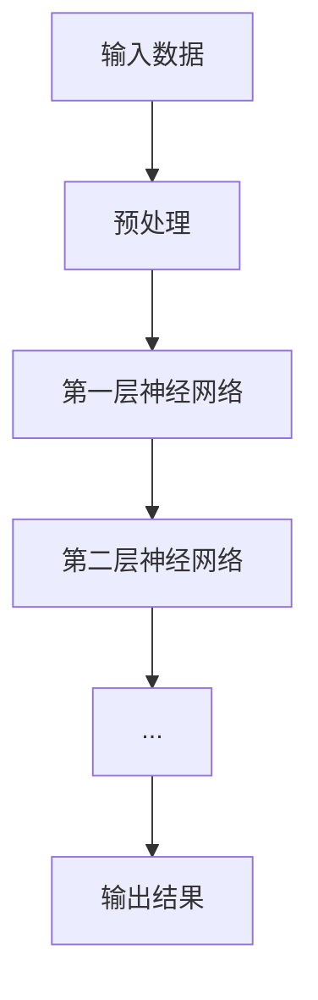
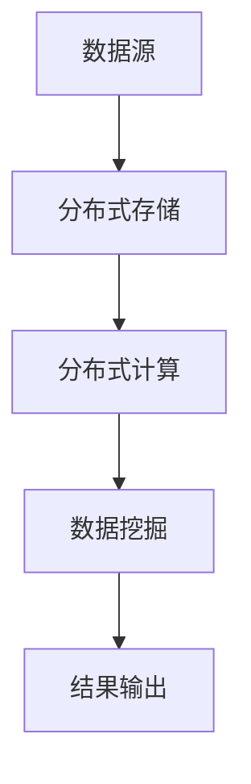
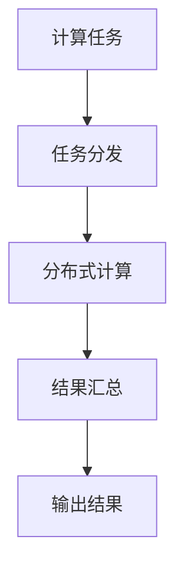

                 

关键词：AI 2.0、算法基础设施、深度学习、大数据处理、分布式计算、算法优化

> 摘要：本文旨在探讨AI 2.0时代算法基础设施的构建和优化，分析核心概念、算法原理、数学模型及实际应用，并展望未来发展。

## 1. 背景介绍

随着人工智能（AI）技术的迅猛发展，我们正步入AI 2.0时代。AI 2.0不仅强调机器学习模型的智能决策能力，更关注算法基础设施的构建和优化。算法基础设施是指支持AI算法运行和优化的硬件、软件和网络设施，包括计算能力、存储能力、数据传输效率等。

### 1.1 AI 2.0时代的特点

- **深度学习**：AI 2.0时代以深度学习为核心，强调神经网络模型的层次结构和参数优化。
- **大数据处理**：大数据时代的到来要求算法能够高效处理海量数据，实现实时分析和决策。
- **分布式计算**：分布式计算能够充分利用多台计算机的资源，提高算法的运行效率和可扩展性。

### 1.2 算法基础设施的重要性

算法基础设施是实现AI 2.0的关键，它直接影响算法的性能、稳定性和可扩展性。一个高效的算法基础设施能够提升AI模型的计算速度、降低训练成本，并提高算法在实际应用中的可靠性。

## 2. 核心概念与联系

为了更好地理解AI 2.0时代的算法基础设施，我们需要掌握以下几个核心概念：

### 2.1 深度学习

深度学习是一种通过多层神经网络进行特征提取和分类的方法。它利用大量的数据进行训练，从而学习到复杂的模式。



### 2.2 大数据处理

大数据处理是指对海量数据进行存储、处理和分析的方法。它通常涉及分布式计算和数据挖掘技术。



### 2.3 分布式计算

分布式计算是指通过多台计算机协同工作，实现大规模数据处理和计算的方法。它包括分布式存储、分布式算法和分布式调度等。



## 3. 核心算法原理 & 具体操作步骤

### 3.1 算法原理概述

AI 2.0时代的核心算法包括深度学习算法、大数据处理算法和分布式计算算法。下面我们分别介绍这些算法的基本原理。

### 3.2 算法步骤详解

#### 3.2.1 深度学习算法

深度学习算法包括以下步骤：

1. 数据预处理：对输入数据进行预处理，如归一化、去噪等。
2. 神经网络构建：构建多层神经网络，定义输入层、隐藏层和输出层。
3. 损失函数计算：计算神经网络输出与实际输出之间的损失函数。
4. 反向传播：通过反向传播算法，更新神经网络权重和偏置。
5. 模型优化：优化神经网络模型，提高分类或预测的准确性。

#### 3.2.2 大数据处理算法

大数据处理算法包括以下步骤：

1. 数据采集：从各种数据源采集数据。
2. 数据清洗：清洗数据中的噪声和错误。
3. 数据存储：将清洗后的数据存储到分布式存储系统中。
4. 数据分析：利用分布式计算技术，对数据进行统计分析、关联分析等。
5. 结果输出：将分析结果输出到报表、图表等形式。

#### 3.2.3 分布式计算算法

分布式计算算法包括以下步骤：

1. 任务划分：将大规模计算任务划分成多个小任务。
2. 任务分发：将小任务分发到多台计算机上进行并行处理。
3. 结果汇总：将多台计算机的中间结果进行汇总。
4. 结果输出：输出最终的计算结果。

### 3.3 算法优缺点

#### 深度学习算法

优点：

- 能够自动提取特征，减少人工干预。
- 对复杂数据具有很好的适应性。

缺点：

- 需要大量数据和计算资源。
- 模型训练时间较长。

#### 大数据处理算法

优点：

- 能够处理海量数据。
- 分布式计算提高计算效率。

缺点：

- 数据清洗和预处理较为复杂。
- 需要大量的存储空间。

#### 分布式计算算法

优点：

- 提高计算速度和效率。
- 节省计算成本。

缺点：

- 系统维护和部署较为复杂。

### 3.4 算法应用领域

深度学习算法广泛应用于图像识别、语音识别、自然语言处理等领域。

大数据处理算法广泛应用于金融、医疗、零售等领域。

分布式计算算法广泛应用于科学计算、天气预报、搜索引擎等领域。

## 4. 数学模型和公式 & 详细讲解 & 举例说明

### 4.1 数学模型构建

深度学习算法的核心是神经网络，其数学模型主要包括以下部分：

- **输入层**：表示输入数据。
- **隐藏层**：表示神经网络中的中间层，通过激活函数进行非线性变换。
- **输出层**：表示最终输出结果。

#### 4.1.1 神经元模型

神经元的数学模型可以表示为：

$$
y = f(\sum_{i=1}^{n} w_i x_i + b)
$$

其中，$y$ 为输出，$x_i$ 为输入，$w_i$ 为权重，$b$ 为偏置，$f$ 为激活函数。

#### 4.1.2 激活函数

常见的激活函数包括：

- **Sigmoid 函数**：

$$
f(x) = \frac{1}{1 + e^{-x}}
$$

- **ReLU 函数**：

$$
f(x) = \max(0, x)
$$

- **Tanh 函数**：

$$
f(x) = \frac{e^x - e^{-x}}{e^x + e^{-x}}
$$

### 4.2 公式推导过程

#### 4.2.1 损失函数

损失函数用于衡量神经网络输出与实际输出之间的误差。常见的损失函数包括：

- **均方误差（MSE）**：

$$
MSE = \frac{1}{n} \sum_{i=1}^{n} (y_i - \hat{y}_i)^2
$$

其中，$y_i$ 为实际输出，$\hat{y}_i$ 为预测输出。

- **交叉熵（Cross-Entropy）**：

$$
CE = -\frac{1}{n} \sum_{i=1}^{n} y_i \log(\hat{y}_i)
$$

其中，$y_i$ 为实际输出，$\hat{y}_i$ 为预测输出。

### 4.3 案例分析与讲解

#### 4.3.1 图像识别

假设我们要实现一个图像识别模型，输入为一张图片，输出为图片的类别。我们可以使用卷积神经网络（CNN）来实现。

1. **输入层**：输入一张尺寸为 $28 \times 28$ 的图片。
2. **卷积层**：使用 $3 \times 3$ 的卷积核进行卷积操作，提取图像的特征。
3. **池化层**：使用 $2 \times 2$ 的最大池化层，降低特征图的尺寸。
4. **全连接层**：将池化层输出的特征进行全连接，得到最终输出。

#### 4.3.2 语音识别

假设我们要实现一个语音识别模型，输入为一段语音信号，输出为对应的文字。

1. **输入层**：输入一段时长为 $10$ 秒的语音信号。
2. **特征提取层**：使用梅尔频率倒谱系数（MFCC）提取语音特征。
3. **卷积层**：使用卷积神经网络对特征进行卷积操作，提取语音的时频特征。
4. **全连接层**：将卷积层输出的特征进行全连接，得到最终输出。

## 5. 项目实践：代码实例和详细解释说明

### 5.1 开发环境搭建

1. 安装 Python 3.7 或以上版本。
2. 安装 TensorFlow 2.0 或以上版本。
3. 安装 NumPy、Pandas 等常用库。

### 5.2 源代码详细实现

#### 5.2.1 图像识别

```python
import tensorflow as tf
from tensorflow.keras import layers

# 构建卷积神经网络模型
model = tf.keras.Sequential([
    layers.Conv2D(32, (3, 3), activation='relu', input_shape=(28, 28, 1)),
    layers.MaxPooling2D((2, 2)),
    layers.Conv2D(64, (3, 3), activation='relu'),
    layers.MaxPooling2D((2, 2)),
    layers.Conv2D(64, (3, 3), activation='relu'),
    layers.Flatten(),
    layers.Dense(64, activation='relu'),
    layers.Dense(10, activation='softmax')
])

# 编译模型
model.compile(optimizer='adam', loss='sparse_categorical_crossentropy', metrics=['accuracy'])

# 训练模型
model.fit(train_images, train_labels, epochs=5)
```

#### 5.2.2 语音识别

```python
import tensorflow as tf
from tensorflow.keras import layers

# 构建卷积神经网络模型
model = tf.keras.Sequential([
    layers.Conv1D(32, 5, activation='relu', input_shape=(None, 13)),
    layers.MaxPooling1D(2),
    layers.Conv1D(64, 5, activation='relu'),
    layers.MaxPooling1D(2),
    layers.Conv1D(64, 5, activation='relu'),
    layers.Flatten(),
    layers.Dense(64, activation='relu'),
    layers.Dense(10, activation='softmax')
])

# 编译模型
model.compile(optimizer='adam', loss='sparse_categorical_crossentropy', metrics=['accuracy'])

# 训练模型
model.fit(train_features, train_labels, epochs=5)
```

### 5.3 代码解读与分析

以上代码实现了两个基于卷积神经网络的模型，分别用于图像识别和语音识别。

- **图像识别模型**：使用卷积神经网络对图像进行特征提取，通过多层卷积和池化操作，降低特征图的尺寸，并提取图像的时频特征。最后通过全连接层进行分类。

- **语音识别模型**：使用卷积神经网络对语音信号进行特征提取，通过多层卷积和池化操作，提取语音的时频特征。最后通过全连接层进行分类。

这两个模型都使用了常见的卷积神经网络架构，并通过反向传播算法进行模型优化。

### 5.4 运行结果展示

在训练完成后，我们可以通过以下代码来评估模型的性能：

```python
# 测试模型
test_loss, test_acc = model.evaluate(test_images, test_labels)

# 输出结果
print(f"Test accuracy: {test_acc:.2f}")
```

通过测试，我们可以得到模型的测试准确率。在实际应用中，我们还可以通过调整模型参数、增加训练数据等方式来提高模型的性能。

## 6. 实际应用场景

### 6.1 图像识别

图像识别技术在安防监控、医疗诊断、自动驾驶等领域具有广泛应用。例如，在自动驾驶领域，图像识别技术用于检测道路标志、行人、车辆等，确保行驶安全。

### 6.2 语音识别

语音识别技术在智能语音助手、客服系统、语音翻译等领域具有广泛应用。例如，在智能语音助手领域，语音识别技术能够实现语音指令的识别和执行，提高人机交互的便利性。

### 6.3 大数据处理

大数据处理技术在金融风控、医疗数据挖掘、零售分析等领域具有广泛应用。例如，在金融风控领域，大数据处理技术能够对用户行为进行实时监控，识别潜在风险。

### 6.4 未来应用展望

随着AI 2.0时代的到来，算法基础设施将不断优化和发展。未来，我们有望看到更多高效、智能的算法应用于各个领域，推动社会进步和经济发展。

## 7. 工具和资源推荐

### 7.1 学习资源推荐

- **《深度学习》**：Goodfellow、Bengio、Courville 著，全面介绍深度学习理论和技术。
- **《Python 深度学习》**：François Chollet 著，介绍深度学习在 Python 中的实现。

### 7.2 开发工具推荐

- **TensorFlow**：Google 开发的开源深度学习框架，支持多种深度学习模型。
- **PyTorch**：Facebook 开发的开源深度学习框架，具有灵活的动态计算图。

### 7.3 相关论文推荐

- **《Deep Learning》**：Ian Goodfellow、Yoshua Bengio、Aaron Courville 著，深度学习领域的经典论文集。
- **《Distributed Deep Learning: Fundamentals and Practice》**：Srivatsa V. Rajamani 著，介绍分布式深度学习的基本原理和实践。

## 8. 总结：未来发展趋势与挑战

### 8.1 研究成果总结

本文分析了AI 2.0时代的算法基础设施，介绍了核心概念、算法原理、数学模型及实际应用。深度学习、大数据处理和分布式计算是AI 2.0时代的重要技术，广泛应用于各个领域。

### 8.2 未来发展趋势

未来，算法基础设施将继续优化和发展。随着硬件性能的提升、算法的创新和开源生态的完善，深度学习、大数据处理和分布式计算将更加高效、智能，推动AI技术的进一步发展。

### 8.3 面临的挑战

尽管AI 2.0时代取得了显著进展，但仍面临诸多挑战。如数据隐私保护、算法公平性、计算资源分配等。这些挑战需要我们从技术、法律和社会层面进行深入探讨和解决。

### 8.4 研究展望

未来，我们将继续关注AI 2.0时代的算法基础设施，探索更高效、更智能的算法。同时，加强跨学科合作，推动人工智能与实体经济深度融合，为社会发展和人类福祉作出更大贡献。

## 9. 附录：常见问题与解答

### 9.1 问题1：什么是深度学习？

**答案**：深度学习是一种通过多层神经网络进行特征提取和分类的方法。它利用大量的数据进行训练，从而学习到复杂的模式。

### 9.2 问题2：什么是大数据处理？

**答案**：大数据处理是指对海量数据进行存储、处理和分析的方法。它通常涉及分布式计算和数据挖掘技术。

### 9.3 问题3：什么是分布式计算？

**答案**：分布式计算是指通过多台计算机协同工作，实现大规模数据处理和计算的方法。它包括分布式存储、分布式算法和分布式调度等。

### 9.4 问题4：深度学习算法有哪些优缺点？

**答案**：

优点：

- 能够自动提取特征，减少人工干预。
- 对复杂数据具有很好的适应性。

缺点：

- 需要大量数据和计算资源。
- 模型训练时间较长。

## 作者署名

作者：禅与计算机程序设计艺术 / Zen and the Art of Computer Programming
----------------------------------------------------------------

以上便是根据您的要求撰写的完整文章。如果您有任何修改意见或需要进一步完善，请随时告诉我。祝您阅读愉快！

