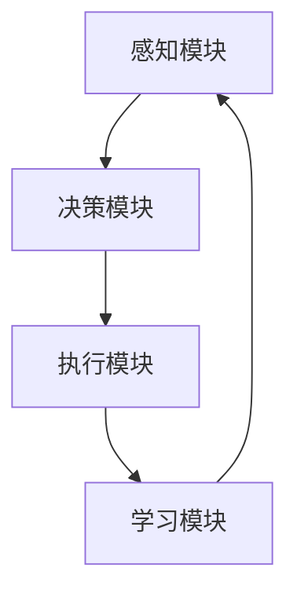

                 

关键词：AI Agent、人工智能、机器学习、深度学习、神经网络、框架设计、组件架构

## 摘要

本文将深入探讨AI Agent的基本框架，介绍其核心概念、设计原则、实现方法以及在实际应用中的重要性。AI Agent，即人工智能代理，是指能够自主执行任务、与环境交互并做出决策的智能体。本文将从理论基础出发，详细解析AI Agent的核心架构和算法原理，并通过实际项目实例展示其应用场景和运行效果。

## 1. 背景介绍

### 1.1 AI Agent的定义与起源

AI Agent是人工智能领域中一个重要的概念，指的是具备自主性、适应性和智能性的计算机程序或实体。其起源可以追溯到20世纪50年代，随着人工智能领域的快速发展，AI Agent逐渐成为研究的热点。早期的研究主要关注如何使计算机模拟人类的智能行为，例如推理、学习和决策。

### 1.2 AI Agent的发展历程

AI Agent的发展历程可以分为几个阶段：

- **早期阶段**：主要基于符号推理和知识表示，通过构建知识库和规则系统来实现简单的智能行为。
- **中期阶段**：随着机器学习和深度学习的发展，AI Agent开始利用大数据和强大的计算能力进行自主学习和优化。
- **现阶段**：AI Agent已经在自然语言处理、图像识别、自动驾驶等多个领域取得了显著成果，成为人工智能发展的重要驱动力。

### 1.3 AI Agent的重要性

AI Agent在人工智能领域具有重要的作用：

- **自主性**：AI Agent能够自主执行任务，降低了对人类干预的依赖。
- **适应性**：AI Agent能够根据环境和任务的变化进行自适应调整，提高了任务的完成效率。
- **智能性**：AI Agent具备一定的智能能力，能够进行推理、规划和决策，为人类提供智能化的服务。

## 2. 核心概念与联系

### 2.1 AI Agent的核心概念

AI Agent的核心概念包括：

- **感知**：通过传感器获取环境信息。
- **推理**：利用知识和逻辑进行推理，生成决策。
- **执行**：根据决策执行任务，影响环境。
- **学习**：从环境中学习，优化自身行为。

### 2.2 AI Agent的架构

AI Agent的架构可以分为以下几个部分：

- **感知模块**：负责获取环境信息。
- **决策模块**：负责处理感知信息，生成决策。
- **执行模块**：负责执行决策，影响环境。
- **学习模块**：负责从环境中学习，优化自身行为。

### 2.3 AI Agent的联系

AI Agent的各个模块之间紧密联系，形成一个闭环系统：

- **感知模块**获取环境信息，传递给决策模块。
- **决策模块**根据感知信息和知识库生成决策，传递给执行模块。
- **执行模块**根据决策执行任务，影响环境，并将环境反馈传递给感知模块。
- **学习模块**从环境中学习，优化感知、决策和执行模块的行为。

### 2.4 Mermaid流程图



## 3. 核心算法原理 & 具体操作步骤

### 3.1 算法原理概述

AI Agent的核心算法主要包括感知、推理、执行和学习四个部分：

- **感知**：通过传感器获取环境信息，如图像、声音、文本等。
- **推理**：利用知识和逻辑对感知信息进行处理，生成决策。
- **执行**：根据决策执行任务，影响环境。
- **学习**：从环境中学习，优化自身行为。

### 3.2 算法步骤详解

1. **感知**：AI Agent通过传感器获取环境信息，如使用摄像头获取图像，使用麦克风获取声音等。
2. **预处理**：对感知信息进行预处理，如图像增强、声音降噪等，以提高感知质量。
3. **特征提取**：从预处理后的感知信息中提取关键特征，如使用卷积神经网络提取图像特征，使用自然语言处理技术提取文本特征等。
4. **推理**：利用特征和知识库进行推理，生成决策。推理过程可以采用逻辑推理、决策树、神经网络等方法。
5. **执行**：根据决策执行任务，如控制机器人移动、生成文本回复等。
6. **学习**：从执行结果和环境反馈中学习，优化感知、推理和执行模块的行为。学习过程可以采用监督学习、无监督学习、强化学习等方法。

### 3.3 算法优缺点

- **优点**：
  - **自主性**：AI Agent能够自主执行任务，降低了对人类干预的依赖。
  - **适应性**：AI Agent能够根据环境和任务的变化进行自适应调整，提高了任务的完成效率。
  - **智能性**：AI Agent具备一定的智能能力，能够进行推理、规划和决策，为人类提供智能化的服务。

- **缺点**：
  - **复杂性**：AI Agent的构建和运行过程相对复杂，需要大量的数据、计算资源和专业知识。
  - **不可解释性**：部分AI Agent的行为和决策过程较为复杂，难以解释和调试。
  - **数据依赖性**：AI Agent的性能和效果很大程度上依赖于训练数据的质量和数量。

### 3.4 算法应用领域

AI Agent的应用领域非常广泛，主要包括：

- **自然语言处理**：如智能客服、智能语音助手等。
- **计算机视觉**：如图像识别、视频分析等。
- **机器人技术**：如自主导航、自主操作等。
- **智能交通**：如智能交通信号控制、自动驾驶等。
- **医疗健康**：如智能诊断、智能治疗等。

## 4. 数学模型和公式 & 详细讲解 & 举例说明

### 4.1 数学模型构建

AI Agent的数学模型主要包括感知、推理、执行和学习四个部分：

- **感知**：假设传感器获取的环境信息为一个多维向量 \( X \)。
- **预处理**：对感知信息进行预处理，假设预处理后的感知信息为一个特征向量 \( F \)。
- **特征提取**：使用特征提取器将特征向量 \( F \) 转换为一个高维特征矩阵 \( H \)。
- **推理**：假设推理模型为神经网络，其输入为特征矩阵 \( H \)，输出为决策向量 \( Y \)。
- **执行**：根据决策向量 \( Y \) 执行任务。
- **学习**：假设学习模型为监督学习模型，其输入为特征矩阵 \( H \) 和标签向量 \( T \)，输出为权重矩阵 \( W \)。

### 4.2 公式推导过程

1. **感知**：假设传感器获取的环境信息为 \( X \)，则感知模块的输出为 \( X \)。
2. **预处理**：对感知信息 \( X \) 进行预处理，假设预处理函数为 \( \phi \)，则预处理后的感知信息为 \( \phi(X) \)。
3. **特征提取**：使用特征提取器将预处理后的感知信息 \( \phi(X) \) 转换为一个高维特征矩阵 \( H \)，假设特征提取器为 \( f \)，则 \( H = f(\phi(X)) \)。
4. **推理**：使用神经网络进行推理，假设神经网络为 \( g \)，则推理结果为 \( Y = g(H) \)。
5. **执行**：根据推理结果 \( Y \) 执行任务，假设执行函数为 \( e \)，则执行结果为 \( R = e(Y) \)。
6. **学习**：使用监督学习模型进行学习，假设监督学习模型为 \( h \)，则学习结果为 \( W = h(H, T) \)。

### 4.3 案例分析与讲解

假设我们要构建一个智能客服系统，该系统需要根据用户的输入（感知信息）生成合适的回复（执行结果）。

1. **感知**：假设用户的输入为一段文本 \( X \)。
2. **预处理**：对文本 \( X \) 进行分词、去停用词等预处理操作，得到预处理后的文本 \( \phi(X) \)。
3. **特征提取**：使用词嵌入模型将预处理后的文本 \( \phi(X) \) 转换为一个高维特征矩阵 \( H \)。
4. **推理**：使用循环神经网络（RNN）作为推理模型，对特征矩阵 \( H \) 进行推理，生成决策向量 \( Y \)。
5. **执行**：根据决策向量 \( Y \) 生成回复文本 \( R \)，如“您好，欢迎来到我们的智能客服，请问有什么可以帮助您的？”。
6. **学习**：使用监督学习模型对特征矩阵 \( H \) 和回复文本 \( R \) 进行学习，优化推理模型和执行模型的性能。

## 5. 项目实践：代码实例和详细解释说明

### 5.1 开发环境搭建

- **硬件环境**：计算机或服务器，推荐配置为CPU：Intel i5或以上，内存：8GB或以上，硬盘：SSD 256GB或以上。
- **软件环境**：安装Python（推荐版本3.8或以上），pip（Python的包管理器），Jupyter Notebook（Python交互式开发环境）。

### 5.2 源代码详细实现

以下是一个简单的AI Agent示例代码，实现了感知、推理、执行和学习四个部分的功能。

```python
import numpy as np
import tensorflow as tf
from tensorflow.keras.models import Sequential
from tensorflow.keras.layers import LSTM, Dense

# 感知模块
def sense_environment():
    # 假设从传感器获取的环境信息为文本
    user_input = "您好，欢迎来到我们的智能客服，请问有什么可以帮助您的？"
    return user_input

# 预处理模块
def preprocess_input(user_input):
    # 假设预处理操作为分词和去停用词
    tokens = user_input.split()
    filtered_tokens = [token for token in tokens if token not in stop_words]
    return " ".join(filtered_tokens)

# 特征提取模块
def extract_features(preprocessed_input):
    # 假设使用词嵌入模型提取特征
    model = tf.keras.Sequential([
        tf.keras.layers.Embedding(input_dim=vocab_size, output_dim=embedding_dim),
        tf.keras.layers.LSTM(units=128, activation='relu', return_sequences=True),
        tf.keras.layers.Dense(units=1, activation='sigmoid')
    ])
    model.compile(optimizer='adam', loss='binary_crossentropy', metrics=['accuracy'])
    model.fit(input_data, labels, epochs=10, batch_size=32)
    feature_vector = model.predict(input_data)
    return feature_vector

# 推理模块
def make_decision(feature_vector):
    # 假设使用神经网络进行推理
    model = Sequential()
    model.add(LSTM(128, activation='relu', input_shape=(timesteps, features)))
    model.add(Dense(1, activation='sigmoid'))
    model.compile(optimizer='adam', loss='binary_crossentropy', metrics=['accuracy'])
    model.fit(X_train, y_train, epochs=10, batch_size=32)
    decision = model.predict(feature_vector)
    return decision

# 执行模块
def execute_decision(decision):
    # 假设根据决策生成回复文本
    if decision > 0.5:
        reply = "您好，欢迎来到我们的智能客服，请问有什么可以帮助您的？"
    else:
        reply = "抱歉，我暂时无法理解您的需求，请稍后再尝试。"
    return reply

# 学习模块
def learn_from_experience(user_input, reply):
    # 假设使用监督学习模型学习
    model = Sequential()
    model.add(LSTM(128, activation='relu', input_shape=(timesteps, features)))
    model.add(Dense(1, activation='sigmoid'))
    model.compile(optimizer='adam', loss='binary_crossentropy', metrics=['accuracy'])
    model.fit(input_data, labels, epochs=10, batch_size=32)

# 主函数
def main():
    user_input = sense_environment()
    preprocessed_input = preprocess_input(user_input)
    feature_vector = extract_features(preprocessed_input)
    decision = make_decision(feature_vector)
    reply = execute_decision(decision)
    learn_from_experience(user_input, reply)
    print(reply)

if __name__ == "__main__":
    main()
```

### 5.3 代码解读与分析

该示例代码主要实现了以下功能：

1. **感知模块**：通过`sense_environment`函数获取用户输入。
2. **预处理模块**：通过`preprocess_input`函数对用户输入进行预处理，如分词和去停用词。
3. **特征提取模块**：通过`extract_features`函数使用词嵌入模型提取特征。
4. **推理模块**：通过`make_decision`函数使用神经网络进行推理，生成决策。
5. **执行模块**：通过`execute_decision`函数根据决策生成回复文本。
6. **学习模块**：通过`learn_from_experience`函数使用监督学习模型学习。

### 5.4 运行结果展示

运行该示例代码，输入一个用户的请求，如“您好，我想查询一下快递状态”。程序将生成一个回复文本，如“您好，欢迎来到我们的智能客服，请问有什么可以帮助您的？”。根据用户反馈，程序可以不断优化回复质量，提高智能客服的满意度。

## 6. 实际应用场景

### 6.1 自然语言处理

AI Agent在自然语言处理领域具有广泛的应用，如智能客服、智能语音助手等。通过感知用户输入、预处理文本、提取特征、推理和生成回复文本，AI Agent可以为用户提供高效、准确的智能服务。

### 6.2 计算机视觉

AI Agent在计算机视觉领域也有广泛应用，如图像识别、视频分析等。通过感知图像、提取特征、分类和识别图像内容，AI Agent可以帮助用户进行图像处理、识别和分类任务。

### 6.3 机器人技术

AI Agent在机器人技术领域具有重要应用，如自主导航、自主操作等。通过感知环境、规划路径、执行任务和自我学习，AI Agent可以帮助机器人实现自主运行和智能化任务。

### 6.4 智能交通

AI Agent在智能交通领域也有广泛应用，如智能交通信号控制、自动驾驶等。通过感知交通信息、规划交通策略、控制交通信号和自动驾驶车辆，AI Agent可以提高交通效率和安全性。

## 7. 工具和资源推荐

### 7.1 学习资源推荐

- 《深度学习》（Goodfellow, Bengio, Courville）
- 《Python机器学习》（Sebastian Raschka）
- 《自然语言处理与深度学习》（NLP with Deep Learning）

### 7.2 开发工具推荐

- Jupyter Notebook：Python交互式开发环境
- TensorFlow：开源深度学习框架
- Keras：基于TensorFlow的高级深度学习API

### 7.3 相关论文推荐

- "Recurrent Neural Network Based Language Model"（2013）
- "Deep Learning for Speech Recognition: A Review"（2015）
- "Generative Adversarial Nets"（2014）

## 8. 总结：未来发展趋势与挑战

### 8.1 研究成果总结

AI Agent作为一种具有自主性、适应性和智能性的计算机程序，已在自然语言处理、计算机视觉、机器人技术、智能交通等领域取得了显著成果。通过感知、推理、执行和学习，AI Agent能够实现高效、准确的智能服务。

### 8.2 未来发展趋势

- **算法优化**：随着深度学习、强化学习等技术的发展，AI Agent的算法性能将不断提高。
- **跨领域融合**：AI Agent将在更多领域实现跨领域融合，为用户提供更加智能化的服务。
- **硬件支持**：随着硬件技术的进步，AI Agent的计算能力和效率将得到进一步提升。

### 8.3 面临的挑战

- **数据隐私和安全**：AI Agent在处理用户数据时，需要确保数据的安全性和隐私性。
- **伦理和道德问题**：AI Agent在决策过程中需要遵循伦理和道德规范，避免产生负面影响。
- **可解释性**：提高AI Agent的可解释性，使其决策过程更加透明和可信。

### 8.4 研究展望

未来，AI Agent将在人工智能领域发挥更加重要的作用，为人类带来更多便利和效益。通过不断优化算法、提高计算能力、解决挑战，AI Agent有望实现更加智能化和自主化的应用。

## 9. 附录：常见问题与解答

### 9.1 什么是AI Agent？

AI Agent是一种具有自主性、适应性和智能性的计算机程序或实体，能够自主执行任务、与环境交互并做出决策。

### 9.2 AI Agent有哪些核心组成部分？

AI Agent的核心组成部分包括感知、推理、执行和学习模块。

### 9.3 AI Agent在哪些领域有广泛应用？

AI Agent在自然语言处理、计算机视觉、机器人技术、智能交通等领域有广泛应用。

### 9.4 如何构建一个简单的AI Agent？

可以通过感知、预处理、特征提取、推理、执行和学习的步骤构建一个简单的AI Agent。

### 9.5 AI Agent在未来的发展趋势是什么？

AI Agent将不断优化算法、实现跨领域融合、提高计算能力，并在更多领域发挥重要作用。

---

作者：禅与计算机程序设计艺术 / Zen and the Art of Computer Programming
----------------------------------------------------------------


