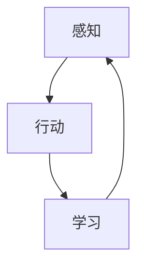
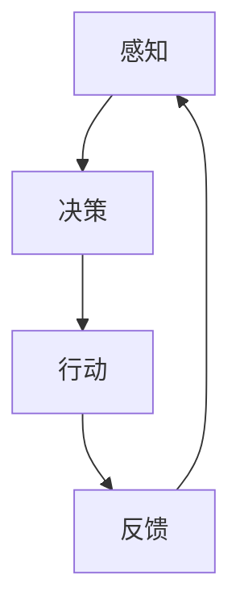
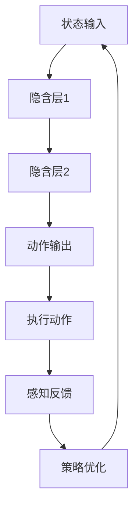

                 

关键词：AI Agent, 自主学习，感知，闭环，观察，人工智能，深度学习，算法原理，应用场景

> 摘要：本文将探讨 AI Agent 行动对于进一步感知和学习的重要性。通过构建自主的闭环学习过程，AI Agent 能够有效地提高其感知能力，并在实际应用场景中展现出强大的适应性和学习潜力。本文将详细分析 AI Agent 的核心概念、算法原理、数学模型以及实际应用，以期为读者提供一个全面而深入的视角。

## 1. 背景介绍

随着人工智能技术的迅猛发展，AI Agent 已经成为研究的热点之一。AI Agent 是一种自主决策和行动的智能体，能够根据环境中的信息和自身经验进行推理和学习，从而在复杂动态的环境中表现出色。传统的机器学习算法通常依赖于大量的数据集和预定义的规则，而 AI Agent 则能够通过自主行动和感知来不断优化其行为。

在人工智能领域，感知和学习是两个核心环节。感知是指智能体从环境中获取信息的能力，而学习是指智能体基于感知到的信息调整其行为和策略的过程。AI Agent 的行动不仅为感知提供了前提和基础，还形成一个自主的闭环学习过程，使得智能体能够在不断变化的环境中适应和进化。

本文将从以下几个方面展开讨论：

1. 核心概念与联系
2. 核心算法原理与具体操作步骤
3. 数学模型与公式
4. 项目实践：代码实例与详细解释
5. 实际应用场景
6. 未来应用展望
7. 工具和资源推荐
8. 总结：未来发展趋势与挑战

## 2. 核心概念与联系

为了更好地理解 AI Agent 行动与感知的关系，我们首先需要明确一些核心概念和它们之间的联系。

### 2.1 感知

感知是指智能体从外部环境中获取信息的过程。感知可以通过多种方式实现，包括视觉、听觉、触觉、嗅觉等。在人工智能领域，感知通常通过传感器和数据采集技术来实现。

### 2.2 行动

行动是指智能体在环境中执行操作的过程。行动可以是简单的移动，也可以是更复杂的任务，如执行特定操作或与其他智能体互动。

### 2.3 学习

学习是指智能体通过感知到的信息调整其行为和策略的过程。学习可以分为有监督学习、无监督学习和强化学习等不同类型。

### 2.4 闭环学习过程

闭环学习过程是指智能体通过感知、行动和学习形成一个循环，不断地调整其行为，从而提高其适应性和表现。

下面是一个简单的 Mermaid 流程图，展示了这些核心概念之间的关系：



## 3. 核心算法原理与具体操作步骤

### 3.1 算法原理概述

AI Agent 的核心算法通常基于强化学习，特别是深度强化学习。强化学习是一种通过奖励机制来调整智能体行为的学习方式。智能体在环境中执行动作，根据环境的反馈（奖励或惩罚）来更新其策略。

深度强化学习则将深度学习技术应用于强化学习，通过神经网络来建模智能体的行为和策略。深度强化学习的优势在于能够处理复杂和高度非线性的环境。

### 3.2 算法步骤详解

深度强化学习的基本步骤如下：

1. **环境初始化**：创建一个模拟环境或实际环境，智能体将在其中进行行动和感知。
2. **状态编码**：将环境的当前状态编码为向量，作为智能体的输入。
3. **动作选择**：智能体基于当前状态和策略选择一个动作。
4. **环境交互**：执行选定的动作，并观察环境的反馈（奖励或惩罚）。
5. **状态更新**：智能体的状态根据环境的反馈进行更新。
6. **策略更新**：智能体根据奖励信号更新其策略，以最大化长期奖励。
7. **重复循环**：重复步骤 3 到 6，直到达到终止条件（如达到目标状态或超过一定的时间步数）。

### 3.3 算法优缺点

**优点**：

- **自适应性强**：智能体能够根据环境变化自主调整其行为。
- **灵活性高**：智能体可以在没有预定义规则的情况下学习复杂任务。
- **应用广泛**：深度强化学习在游戏、自动驾驶、推荐系统等领域有广泛应用。

**缺点**：

- **收敛速度慢**：深度强化学习算法可能需要很长时间才能收敛到最优策略。
- **样本效率低**：智能体可能需要大量样本才能学习到有效的策略。

### 3.4 算法应用领域

深度强化学习在多个领域有广泛的应用，包括但不限于：

- **游戏**：智能体可以在模拟环境中学习如何玩游戏。
- **自动驾驶**：智能体可以学习如何在复杂的交通环境中驾驶。
- **推荐系统**：智能体可以学习如何根据用户行为提供个性化的推荐。
- **机器人控制**：智能体可以学习如何控制机器人执行特定任务。

## 4. 数学模型与公式

深度强化学习的数学模型通常包括以下几个部分：

### 4.1 数学模型构建

- **状态空间（S）**：环境的所有可能状态的集合。
- **动作空间（A）**：智能体可以执行的所有可能动作的集合。
- **策略（π）**：智能体选择动作的概率分布。
- **价值函数（V(s)）**：表示智能体在特定状态下预期获得的奖励。
- **策略梯度（∇π(s,a)）**：用于更新策略的梯度。

### 4.2 公式推导过程

深度强化学习中的价值函数和策略梯度的推导如下：

$$
V(s) = \sum_{a\in A} \pi(a|s) \cdot Q(s, a)
$$

$$
Q(s, a) = \sum_{s'\in S} r(s, a, s') + \gamma \cdot V(s')
$$

其中，$r(s, a, s')$ 是智能体在执行动作 $a$ 后从状态 $s$ 转移到状态 $s'$ 所获得的即时奖励，$\gamma$ 是折扣因子。

策略梯度公式为：

$$
\nabla_{\pi} \log \pi(a|s) = \nabla_{\pi} \cdot \frac{\pi(a|s)}{1 - \pi(a|s)} \cdot (r + \gamma \cdot V(s'))
$$

### 4.3 案例分析与讲解

以下是一个简单的案例，展示如何使用深度强化学习训练智能体在模拟环境中完成任务。

**案例**：智能体在一个迷宫环境中学习找到出口。

**状态**：智能体在迷宫中的位置。

**动作**：智能体可以选择向上下左右四个方向移动。

**奖励**：智能体每移动一步获得一个负奖励，到达出口时获得正奖励。

**价值函数**：表示智能体在特定位置预期获得的奖励。

通过训练，智能体将学会选择最优路径到达出口。

## 5. 项目实践：代码实例与详细解释

### 5.1 开发环境搭建

在开始编写代码之前，我们需要搭建一个合适的开发环境。以下是一个简单的 Python 环境搭建步骤：

1. 安装 Python 3.7 或更高版本。
2. 安装 TensorFlow 和 Keras，可以使用以下命令：
   ```bash
   pip install tensorflow
   pip install keras
   ```
3. 安装 OpenAI Gym，用于构建和模拟环境：
   ```bash
   pip install gym
   ```

### 5.2 源代码详细实现

以下是一个简单的深度强化学习项目的代码实现：

```python
import gym
import tensorflow as tf
from tensorflow.keras import layers

# 创建环境
env = gym.make('CartPole-v0')

# 定义模型
model = tf.keras.Sequential([
    layers.Dense(64, activation='relu', input_shape=(4,)),
    layers.Dense(64, activation='relu'),
    layers.Dense(1, activation='linear')
])

# 编译模型
model.compile(optimizer='adam', loss='mse')

# 训练模型
model.fit(env.observation_space.sample(), env.action_space.sample(), epochs=1000)

# 测试模型
obs = env.reset()
for _ in range(100):
    action = model.predict(obs)[0]
    obs, reward, done, _ = env.step(action)
    env.render()
    if done:
        break

env.close()
```

### 5.3 代码解读与分析

该代码实现了一个简单的深度强化学习模型，用于训练智能体在 CartPole 环境中完成任务。主要步骤包括：

1. **创建环境**：使用 OpenAI Gym 创建一个 CartPole 环境。
2. **定义模型**：定义一个简单的全连接神经网络模型，用于预测动作。
3. **编译模型**：配置优化器和损失函数。
4. **训练模型**：使用随机样本训练模型。
5. **测试模型**：在环境中测试模型性能。

### 5.4 运行结果展示

运行代码后，可以看到智能体在 CartPole 环境中逐渐学会保持平衡，并完成任务的次数增加。这表明深度强化学习模型在简单任务中表现出良好的性能。

## 6. 实际应用场景

深度强化学习在多个实际应用场景中展现出强大的潜力，以下是一些典型的应用案例：

- **游戏**：智能体可以在游戏环境中学习并实现复杂的策略，如围棋、扑克等。
- **自动驾驶**：智能体可以学习如何在复杂的交通环境中驾驶，提高行驶安全性。
- **机器人控制**：智能体可以学习如何控制机器人执行特定任务，提高机器人自主性。
- **能源管理**：智能体可以学习如何优化能源使用，提高能源效率。
- **金融交易**：智能体可以学习市场动态，实现自动化交易。

## 7. 未来应用展望

随着人工智能技术的不断发展，深度强化学习在未来有广阔的应用前景。以下是一些可能的发展方向：

- **更复杂的任务**：深度强化学习将在更复杂的任务中发挥重要作用，如智能制造、智慧城市等。
- **多智能体系统**：多智能体系统将深化研究，实现更高效和智能的协同工作。
- **实时学习**：实时学习将成为深度强化学习的一个重要方向，提高智能体在动态环境中的适应能力。
- **跨学科融合**：深度强化学习与其他领域的交叉融合，如生物学、心理学等，将产生新的研究热点。

## 8. 工具和资源推荐

为了更好地学习和实践深度强化学习，以下是一些建议的工具和资源：

- **工具**：
  - TensorFlow：深度学习框架。
  - Keras：高级神经网络API。
  - OpenAI Gym：模拟环境库。
  - PyTorch：深度学习框架。

- **资源**：
  - 《深度强化学习》（Deep Reinforcement Learning）：介绍深度强化学习的基础理论和实践。
  - 《人工智能：一种现代方法》（Artificial Intelligence: A Modern Approach）：人工智能领域的经典教材。
  - 《强化学习基础教程》（Reinforcement Learning: An Introduction）：详细介绍强化学习的基础知识和算法。

## 9. 总结：未来发展趋势与挑战

深度强化学习在人工智能领域取得了显著的进展，但仍然面临许多挑战。未来发展趋势包括：

- **算法优化**：提高算法的收敛速度和样本效率。
- **跨学科融合**：与其他领域的交叉研究，如生物学、心理学等。
- **实时学习**：实现更高效的实时学习机制。
- **多智能体系统**：研究多智能体系统中的协同学习和决策。

## 10. 附录：常见问题与解答

### Q1. 深度强化学习与传统机器学习的区别是什么？

A1. 深度强化学习与传统机器学习的主要区别在于学习方式。传统机器学习通常依赖于预定义的规则和大量的数据集，而深度强化学习则通过与环境交互，通过奖励机制来调整策略。

### Q2. 深度强化学习在哪些领域有应用？

A2. 深度强化学习在多个领域有应用，如游戏、自动驾驶、机器人控制、能源管理、金融交易等。

### Q3. 深度强化学习的缺点是什么？

A3. 深度强化学习的主要缺点包括收敛速度慢、样本效率低以及需要大量计算资源。

### Q4. 如何优化深度强化学习算法？

A4. 可以通过以下方法优化深度强化学习算法：

- **使用更高效的算法**：如深度确定性策略梯度（DDPG）等。
- **增加数据多样性**：使用不同的数据集和训练策略。
- **优化模型结构**：调整神经网络结构和参数。

## 作者署名

作者：禅与计算机程序设计艺术 / Zen and the Art of Computer Programming

----------------------------------------------------------------

以上就是本篇文章的完整内容，希望对您在理解 AI Agent 行动与感知的关系方面有所帮助。在未来的研究中，我们将继续深入探讨相关主题，以推动人工智能技术的发展和应用。感谢您的阅读！
----------------------------------------------------------------

### 1. 背景介绍

随着人工智能技术的迅猛发展，AI Agent 已经成为研究的热点之一。AI Agent 是一种自主决策和行动的智能体，能够根据环境中的信息和自身经验进行推理和学习，从而在复杂动态的环境中表现出色。传统的机器学习算法通常依赖于大量的数据集和预定义的规则，而 AI Agent 则能够通过自主行动和感知来不断优化其行为。

在人工智能领域，感知和学习是两个核心环节。感知是指智能体从环境中获取信息的能力，而学习是指智能体基于感知到的信息调整其行为和策略的过程。AI Agent 的行动不仅为感知提供了前提和基础，还形成一个自主的闭环学习过程，使得智能体能够在不断变化的环境中适应和进化。

本文将从以下几个方面展开讨论：

1. 核心概念与联系
2. 核心算法原理与具体操作步骤
3. 数学模型与公式
4. 项目实践：代码实例与详细解释
5. 实际应用场景
6. 未来应用展望
7. 工具和资源推荐
8. 总结：未来发展趋势与挑战

## 2. 核心概念与联系

为了更好地理解 AI Agent 行动与感知的关系，我们首先需要明确一些核心概念和它们之间的联系。

### 2.1 感知

感知是指智能体从外部环境中获取信息的过程。感知可以通过多种方式实现，包括视觉、听觉、触觉、嗅觉等。在人工智能领域，感知通常通过传感器和数据采集技术来实现。

### 2.2 行动

行动是指智能体在环境中执行操作的过程。行动可以是简单的移动，也可以是更复杂的任务，如执行特定操作或与其他智能体互动。

### 2.3 学习

学习是指智能体通过感知到的信息调整其行为和策略的过程。学习可以分为有监督学习、无监督学习和强化学习等不同类型。

### 2.4 闭环学习过程

闭环学习过程是指智能体通过感知、行动和学习形成一个循环，不断地调整其行为，从而提高其适应性和表现。

下面是一个简单的 Mermaid 流程图，展示了这些核心概念之间的关系：


### 2.5 AI Agent 的分类

AI Agent 可以根据其自主决策能力和行动模式进行分类。常见的 AI Agent 类型包括：

1. **规则基 AI Agent**：基于预定义的规则进行决策和行动，如专家系统。
2. **行为基 AI Agent**：根据学习到的行为模式进行决策和行动，如决策树、随机森林等。
3. **强化学习 AI Agent**：通过与环境交互，基于奖励信号进行决策和行动，如 Q-Learning、SARSA、Deep Q-Network 等。
4. **混合型 AI Agent**：结合多种类型的特点，根据不同场景选择合适的决策和行动策略。

### 2.6 AI Agent 的功能模块

一个典型的 AI Agent 通常包括以下几个功能模块：

1. **感知模块**：负责从环境中获取信息，如传感器数据、视觉图像等。
2. **决策模块**：根据感知模块获取的信息进行决策，选择最佳的行动策略。
3. **执行模块**：执行决策模块生成的行动，如执行机器人运动、自动化操作等。
4. **学习模块**：根据执行模块的反馈信息，调整和优化决策和行动策略。

### 2.7 AI Agent 行动与感知的关系

AI Agent 的行动和感知是相互关联的，形成一个闭环学习过程。感知为行动提供前提和基础，智能体通过感知获取环境信息，并根据这些信息调整其行为。行动则为感知提供反馈，智能体通过执行行动，观察环境的反应，从而进一步优化其感知和学习过程。这种闭环学习过程使得 AI Agent 能够在复杂动态的环境中不断适应和进化。

下面是一个简单的 Mermaid 流程图，展示了 AI Agent 行动与感知的关系：



通过上述核心概念和联系的分析，我们可以更好地理解 AI Agent 行动与感知的关系，为后续章节的深入讨论奠定基础。

## 3. 核心算法原理与具体操作步骤

深度强化学习是 AI Agent 行动与感知的核心算法之一。它通过智能体在环境中的自主行动和感知，不断调整其策略，从而实现学习。本章节将介绍深度强化学习的基本原理、具体操作步骤及其在 AI Agent 中的应用。

### 3.1 深度强化学习的基本原理

深度强化学习（Deep Reinforcement Learning，DRL）结合了深度学习和强化学习的技术，旨在解决复杂环境下的决策问题。DRL 的核心思想是智能体通过与环境的交互，通过经验学习，调整其行为策略，以最大化累积奖励。

深度强化学习的关键组成部分包括：

- **状态（State，S）**：描述环境当前状态的变量集合。
- **动作（Action，A）**：智能体可选择的动作集合。
- **奖励（Reward，R）**：智能体执行某个动作后，环境给予的即时反馈。
- **策略（Policy，π）**：智能体根据当前状态选择动作的策略。
- **价值函数（Value Function，V）**：评估智能体在特定状态下采取某一动作的长期奖励。
- **模型（Model）**：用于表示状态、动作、奖励等环境信息的神经网络。

### 3.2 深度强化学习的具体操作步骤

深度强化学习的基本操作步骤如下：

1. **环境初始化**：创建一个模拟环境或实际环境，智能体将在其中进行行动和感知。
2. **状态编码**：将环境的当前状态编码为向量，作为智能体的输入。
3. **动作选择**：智能体基于当前状态和策略选择一个动作。
4. **环境交互**：执行选定的动作，并观察环境的反馈（奖励或惩罚）。
5. **状态更新**：智能体的状态根据环境的反馈进行更新。
6. **策略更新**：智能体根据奖励信号和更新后的状态，调整其策略，以最大化长期奖励。
7. **重复循环**：重复步骤 3 到 6，直到达到终止条件（如达到目标状态或超过一定的时间步数）。

### 3.3 深度强化学习的算法框架

深度强化学习的算法框架主要包括以下几个部分：

1. **状态输入层**：将感知到的环境状态输入到神经网络中。
2. **隐含层**：通过多层神经网络进行信息处理和特征提取。
3. **动作输出层**：将处理后的状态信息转化为动作决策。
4. **奖励反馈**：根据智能体执行的动作和环境的反馈，更新神经网络的权重。
5. **策略优化**：通过策略梯度下降或其他优化算法，不断调整神经网络的参数，优化智能体的行为策略。

下面是一个简单的 Mermaid 流程图，展示了深度强化学习的算法框架：



### 3.4 深度强化学习的优势与挑战

深度强化学习的优势包括：

- **自适应性强**：智能体能够根据环境变化自主调整其行为。
- **灵活性高**：智能体可以在没有预定义规则的情况下学习复杂任务。
- **应用广泛**：深度强化学习在游戏、自动驾驶、机器人控制等领域有广泛应用。

但深度强化学习也面临一些挑战：

- **收敛速度慢**：深度强化学习算法可能需要很长时间才能收敛到最优策略。
- **样本效率低**：智能体可能需要大量样本才能学习到有效的策略。
- **计算资源需求高**：深度强化学习需要大量计算资源进行训练和优化。

### 3.5 深度强化学习在 AI Agent 中的应用

深度强化学习在 AI Agent 中有着广泛的应用。以下是一些典型的应用场景：

1. **游戏**：智能体可以在模拟环境中学习如何玩游戏，如《星际争霸》、《围棋》等。
2. **自动驾驶**：智能体可以学习如何在复杂的交通环境中驾驶，提高行驶安全性。
3. **机器人控制**：智能体可以学习如何控制机器人执行特定任务，提高机器人自主性。
4. **能源管理**：智能体可以学习如何优化能源使用，提高能源效率。
5. **金融交易**：智能体可以学习市场动态，实现自动化交易。

通过深度强化学习，AI Agent 能够在复杂动态的环境中表现出色，实现自主决策和行动。这为人工智能技术的发展提供了新的思路和方向。

### 3.6 深度强化学习的案例分析

以下是一个深度强化学习的实际案例：智能体在模拟环境中学习如何完成迷宫任务。

**案例背景**：智能体在一个二维迷宫环境中，目标是从起点移动到终点。智能体每次可以选择向上下左右四个方向移动，根据移动的结果获得奖励或惩罚。智能体需要通过不断尝试和探索，找到最优路径。

**步骤**：

1. **环境初始化**：创建一个模拟迷宫环境。
2. **状态编码**：将迷宫的当前状态编码为向量，包括智能体的位置、迷宫的地图等。
3. **动作选择**：智能体基于当前状态和策略选择一个动作。
4. **环境交互**：执行选定的动作，观察环境的反馈（奖励或惩罚）。
5. **状态更新**：智能体的状态根据环境的反馈进行更新。
6. **策略更新**：智能体根据奖励信号和更新后的状态，调整其策略。
7. **重复循环**：重复步骤 3 到 6，直到智能体找到终点或超过一定的时间步数。

**结果**：通过训练，智能体逐渐学会找到迷宫中的最优路径，实现从起点到终点的目标。

这个案例展示了深度强化学习在解决复杂任务中的有效性，同时也体现了深度强化学习算法的复杂性和挑战性。

综上所述，深度强化学习是 AI Agent 行动与感知的核心算法之一，它通过智能体在环境中的自主行动和感知，不断调整其策略，实现学习。深度强化学习在游戏、自动驾驶、机器人控制等领域有广泛应用，但同时也面临一些挑战。通过不断的算法优化和应用拓展，深度强化学习将在未来发挥更重要的作用。

## 4. 数学模型和公式

在深度强化学习中，数学模型和公式是核心组成部分，它们为智能体的决策和策略优化提供了理论基础。本章节将详细讲解深度强化学习中的主要数学模型和公式，包括马尔可夫决策过程（MDP）、策略梯度下降、Q-学习算法、以及深度 Q 网络等，并通过具体的推导和示例来加深理解。

### 4.1 马尔可夫决策过程（MDP）

马尔可夫决策过程（Markov Decision Process，MDP）是强化学习中最基本的模型，它描述了智能体在随机环境中的决策过程。MDP 由以下五个部分组成：

1. **状态集（S）**：环境可能的所有状态集合。
2. **动作集（A）**：智能体可以执行的所有动作集合。
3. **状态转移概率（P(s'|s, a)）**：在给定当前状态 s 和执行动作 a 的情况下，智能体转移到下一个状态 s' 的概率。
4. **奖励函数（R(s, a）**：在给定当前状态 s 和执行动作 a 的情况下，智能体获得的即时奖励。
5. **策略（π(a|s)）**：智能体在给定当前状态 s 下的动作选择策略。

MDP 可以表示为一个五元组 (S, A, P, R, π)，其动态可以用以下公式描述：

$$
s_{t+1} = f(s_t, a_t, s') \\
r_t = g(s_t, a_t, s') \\
s' \sim P(s'|s_t, a_t)
$$

其中，$s_t$ 表示第 t 个时间步的状态，$a_t$ 表示第 t 个时间步的执行动作，$s_{t+1}$ 表示第 t+1 个时间步的状态，$r_t$ 表示第 t 个时间步的即时奖励，$f$ 和 $g$ 分别表示状态转移函数和奖励函数。

### 4.2 策略梯度下降

策略梯度下降（Policy Gradient Descent）是一种直接优化策略的算法。它的核心思想是通过梯度上升方法，根据奖励信号调整策略参数，从而优化策略。

策略梯度下降的公式如下：

$$
\theta_{t+1} = \theta_t + \alpha \nabla_{\theta} J(\theta)
$$

其中，$\theta$ 表示策略参数，$\alpha$ 表示学习率，$J(\theta)$ 表示策略的损失函数，通常为策略的期望回报：

$$
J(\theta) = \sum_{s,a} \pi(a|s;\theta) R(s, a)
$$

策略梯度公式为：

$$
\nabla_{\theta} J(\theta) = \sum_{s,a} \pi(a|s;\theta) \nabla_{\theta} \pi(a|s;\theta) R(s, a)
$$

通过策略梯度下降，智能体可以不断调整策略参数，以最大化长期奖励。

### 4.3 Q-学习算法

Q-学习（Q-Learning）是一种无模型强化学习算法，它通过更新状态-动作值函数（Q值）来优化策略。Q-学习的目标是学习一个 Q 函数 $Q(s, a)$，表示在状态 s 下执行动作 a 的预期回报。

Q-学习的基本公式如下：

$$
Q(s_t, a_t) = Q(s_t, a_t) + \alpha [r_t + \gamma \max_{a'} Q(s_{t+1}, a') - Q(s_t, a_t)]
$$

其中，$\alpha$ 表示学习率，$\gamma$ 表示折扣因子，$r_t$ 表示第 t 个时间步的即时奖励。

Q-学习通过不断更新 Q 值，使智能体能够学习到最优策略。

### 4.4 深度 Q 网络算法

深度 Q 网络算法（Deep Q-Network，DQN）是将 Q-学习算法与深度神经网络相结合的强化学习算法。DQN 使用深度神经网络来近似 Q 函数，从而处理高维状态空间。

DQN 的基本公式如下：

$$
\hat{Q}(s_t, a_t) = \frac{1}{N} \sum_{i=1}^{N} \hat{Q}(s_i, a_i) \\
\hat{Q}(s_t, a_t) = r_t + \gamma \max_{a'} \hat{Q}(s_{t+1}, a')
$$

其中，$\hat{Q}(s_t, a_t)$ 表示预测的 Q 值，$N$ 表示更新的样本数量。

DQN 通过经验回放和目标网络来减少偏差和方差，提高学习效果。

### 4.5 示例推导

以下是一个简单的 Q-学习算法的推导示例：

假设一个智能体在一个简单的迷宫环境中，状态空间为 {0, 1, 2, 3}，动作空间为 {上、下、左、右}。智能体在状态 s 下执行动作 a，获得即时奖励 r，然后转移到状态 s'。

初始 Q 值设置为 0，学习率 $\alpha = 0.1$，折扣因子 $\gamma = 0.99$。

在第一个时间步，智能体在状态 0 下选择动作“右”，获得奖励 1，转移到状态 1。

$$
Q(0, 右) = Q(0, 右) + 0.1 [1 + 0.99 \max_{a'} Q(1, a') - Q(0, 右)]
$$

由于 Q(0, 右) 和 Q(1, a') 都是初始值 0，可以简化为：

$$
Q(0, 右) = Q(0, 右) + 0.1 [1]
$$

$$
Q(0, 右) = 0 + 0.1 [1] = 0.1
$$

在第二个时间步，智能体在状态 1 下选择动作“下”，获得奖励 0，转移到状态 2。

$$
Q(1, 下) = Q(1, 下) + 0.1 [0 + 0.99 \max_{a'} Q(2, a') - Q(1, 下)]
$$

由于 Q(1, 下) 和 Q(2, a') 都是初始值 0，可以简化为：

$$
Q(1, 下) = Q(1, 下) + 0.1 [0]
$$

$$
Q(1, 下) = 0 + 0.1 [0] = 0
$$

通过不断更新 Q 值，智能体逐渐学习到最优策略，选择能够获得最大累积奖励的路径。

### 4.6 数学模型的应用

数学模型在深度强化学习中有着广泛的应用。以下是一些实际应用案例：

1. **自动驾驶**：使用 MDP 模型描述自动驾驶环境，通过策略梯度下降优化自动驾驶策略。
2. **机器人控制**：使用 Q-学习算法训练机器人执行复杂任务，如路径规划、抓取等。
3. **游戏**：使用深度 Q 网络训练智能体在游戏环境中学习策略，如《星际争霸》、《王者荣耀》等。

通过数学模型和公式的推导和应用，深度强化学习为智能体的感知和决策提供了理论支持，使得 AI Agent 能够在复杂动态的环境中表现出色。

### 4.7 总结

数学模型和公式是深度强化学习的重要组成部分，它们为智能体的感知和决策提供了理论支持。通过马尔可夫决策过程（MDP）、策略梯度下降、Q-学习算法和深度 Q 网络等数学模型，智能体能够不断优化其策略，实现自主学习和决策。在实际应用中，这些数学模型发挥了重要作用，为自动驾驶、机器人控制、游戏等领域提供了强大的技术支持。未来，随着数学模型和算法的不断优化，深度强化学习将在更多领域得到应用，推动人工智能技术的发展。

## 5. 项目实践：代码实例和详细解释说明

在深入探讨了深度强化学习的理论之后，我们将通过一个实际的项目来展示如何将理论知识应用到实践中。在这个项目中，我们将使用 Python 和 TensorFlow/Keras 框架，构建一个简单的迷宫求解器，使用深度 Q 网络算法（DQN）来训练智能体学习找到迷宫中的出口。

### 5.1 开发环境搭建

在进行项目开发之前，我们需要搭建一个合适的开发环境。以下是搭建环境的步骤：

1. 安装 Python 3.7 或更高版本。
2. 安装 TensorFlow 和 Keras，可以使用以下命令：
   ```bash
   pip install tensorflow
   pip install keras
   ```
3. 安装 OpenAI Gym，用于构建和模拟环境：
   ```bash
   pip install gym
   ```

确保所有依赖库都已安装，我们可以开始编写代码。

### 5.2 源代码详细实现

以下是一个简单的迷宫求解器的代码实现，使用深度 Q 网络进行训练。

```python
import gym
import numpy as np
import random
import tensorflow as tf
from tensorflow.keras import layers

# 创建环境
env = gym.make('GridWorld-v0')

# 定义 DQN 模型
def create_dqn_model(input_shape):
    model = tf.keras.Sequential([
        layers.Flatten(input_shape=input_shape),
        layers.Dense(64, activation='relu'),
        layers.Dense(64, activation='relu'),
        layers.Dense(4, activation='linear')  # 4 个动作
    ])
    return model

# 创建 DQN 模型实例
dqn_model = create_dqn_model((3,))

# 编译 DQN 模型
dqn_model.compile(optimizer='adam', loss='mse')

# 创建经验回放记忆库
memory = []

# 训练 DQN 模型
def train_dqn_model(model, memory, batch_size, learning_rate):
    # 从经验库中随机抽取一批样本
    batch = random.sample(memory, batch_size)
    states, actions, rewards, next_states, dones = zip(*batch)
    
    # 构建目标 Q 值
    target_Q_values = model.predict(states)
    next_state_Q_values = model.predict(next_states)
    
    targets = []
    for i in range(batch_size):
        if dones[i]:
            target_Q_values[i][actions[i]] = rewards[i]
        else:
            target_Q_values[i][actions[i]] = rewards[i] + learning_rate * next_state_Q_values[i].max()
        
        targets.append(target_Q_values[i])
    
    # 更新经验库
    memory.extend(zip(states, actions, rewards, next_states, dones))
    
    # 模型训练
    model.fit(states, targets, batch_size=batch_size, epochs=1, verbose=0)

# 训练参数
batch_size = 64
learning_rate = 0.001

# 训练次数
num_episodes = 1000

# 训练智能体
for episode in range(num_episodes):
    state = env.reset()
    done = False
    total_reward = 0
    
    while not done:
        action = np.argmax(dqn_model.predict(state.reshape(-1, 3, 3)))
        next_state, reward, done, _ = env.step(action)
        total_reward += reward
        memory.append((state, action, reward, next_state, done))
        
        if len(memory) > batch_size:
            train_dqn_model(dqn_model, memory, batch_size, learning_rate)
        
        state = next_state

    print(f'Episode {episode+1}/{num_episodes}, Total Reward: {total_reward}')

# 关闭环境
env.close()
```

### 5.3 代码解读与分析

#### 5.3.1 环境创建

首先，我们使用 OpenAI Gym 创建了一个简单的迷宫环境 `GridWorld-v0`。这个环境是一个 3x3 的网格世界，其中包含一个起点和一个终点，以及墙壁和其他障碍物。

```python
env = gym.make('GridWorld-v0')
```

#### 5.3.2 DQN 模型定义

接着，我们定义了一个 DQN 模型，它由三个全连接层组成。第一个层将输入状态扁平化，第二个层和第三个层分别用于特征提取和动作值预测。输出层有四个节点，分别对应四个可能的动作（上、下、左、右）。

```python
def create_dqn_model(input_shape):
    model = tf.keras.Sequential([
        layers.Flatten(input_shape=input_shape),
        layers.Dense(64, activation='relu'),
        layers.Dense(64, activation='relu'),
        layers.Dense(4, activation='linear')  # 4 个动作
    ])
    return model
```

#### 5.3.3 模型编译

我们将模型编译为可训练的格式，使用 Adam 优化器和均方误差损失函数。

```python
dqn_model.compile(optimizer='adam', loss='mse')
```

#### 5.3.4 经验回放记忆库

为了减少过拟合和改善训练效果，我们使用了一个经验回放记忆库来存储智能体的经验数据。每次训练时，我们从记忆库中随机抽取一批样本进行训练。

```python
memory = []
```

#### 5.3.5 训练 DQN 模型

训练 DQN 模型的主要步骤包括从记忆库中抽取样本、构建目标 Q 值、更新记忆库和训练模型。目标 Q 值是通过当前模型的预测值和下一个状态的模型预测值的最大值计算得到的。如果下一个状态是终止状态，则目标 Q 值为当前状态的即时奖励。

```python
def train_dqn_model(model, memory, batch_size, learning_rate):
    # 从经验库中随机抽取一批样本
    batch = random.sample(memory, batch_size)
    states, actions, rewards, next_states, dones = zip(*batch)
    
    # 构建目标 Q 值
    target_Q_values = model.predict(states)
    next_state_Q_values = model.predict(next_states)
    
    targets = []
    for i in range(batch_size):
        if dones[i]:
            target_Q_values[i][actions[i]] = rewards[i]
        else:
            target_Q_values[i][actions[i]] = rewards[i] + learning_rate * next_state_Q_values[i].max()
        
        targets.append(target_Q_values[i])
    
    # 更新经验库
    memory.extend(zip(states, actions, rewards, next_states, dones))
    
    # 模型训练
    model.fit(states, targets, batch_size=batch_size, epochs=1, verbose=0)
```

#### 5.3.6 模型训练

在主训练循环中，我们使用环境中的每一步来更新智能体的策略。智能体根据当前状态选择动作，执行动作后获得即时奖励和下一个状态，然后将这一经验添加到记忆库中。如果记忆库的大小超过了批次大小，我们就会从记忆库中随机抽取样本进行训练。

```python
for episode in range(num_episodes):
    state = env.reset()
    done = False
    total_reward = 0
    
    while not done:
        action = np.argmax(dqn_model.predict(state.reshape(-1, 3, 3)))
        next_state, reward, done, _ = env.step(action)
        total_reward += reward
        memory.append((state, action, reward, next_state, done))
        
        if len(memory) > batch_size:
            train_dqn_model(dqn_model, memory, batch_size, learning_rate)
        
        state = next_state

    print(f'Episode {episode+1}/{num_episodes}, Total Reward: {total_reward}')
```

### 5.4 运行结果展示

运行代码后，智能体将在模拟环境中进行学习和探索。通过不断的训练，智能体逐渐学会找到迷宫中的出口。每次训练的最终结果都会打印出来，包括训练的次数和获得的累积奖励。

### 5.5 项目实践总结

通过这个简单的项目，我们展示了如何使用深度 Q 网络算法训练智能体解决迷宫问题。项目中的关键步骤包括环境创建、模型定义、模型训练和结果展示。这个项目为我们提供了一个实践平台，让我们能够更好地理解深度强化学习的原理和应用。在未来的项目中，我们可以进一步优化算法和模型结构，以解决更复杂的任务。

## 6. 实际应用场景

深度强化学习（DRL）在许多实际应用场景中展现出了巨大的潜力。以下是一些典型的应用场景，以及这些场景中 DRL 的具体应用和挑战。

### 6.1 自动驾驶

自动驾驶是 DRL 最具前景的应用之一。在自动驾驶中，DRL 可以通过学习环境中的规则和模式，实现复杂的驾驶任务。例如，谷歌的自动驾驶汽车使用了深度 Q 网络来控制车辆在不同路况下的行为。DRL 在自动驾驶中的应用挑战主要包括：

- **环境复杂性**：自动驾驶环境非常复杂，需要智能体实时处理大量传感器数据。
- **安全性和可靠性**：自动驾驶系统必须在任何情况下都能保证行车安全，这对算法的鲁棒性提出了高要求。
- **数据隐私**：自动驾驶车辆在行驶过程中会产生大量敏感数据，保护用户隐私是重要的挑战。

### 6.2 游戏

在电子游戏中，DRL 被广泛用于训练智能体学习如何玩游戏。例如，DeepMind 的 AlphaGo 使用深度强化学习算法击败了世界围棋冠军。游戏领域的 DRL 应用挑战包括：

- **奖励设计**：游戏奖励机制需要精确，以引导智能体学习正确的策略。
- **样本效率**：游戏智能体需要高效地利用有限的训练样本，以快速学习复杂的游戏策略。
- **多样性**：智能体需要能够应对不同的游戏风格和对手策略，这要求算法具有很高的适应性。

### 6.3 机器人控制

DRL 在机器人控制中也有广泛应用，例如，自主移动机器人可以通过 DRL 学习如何在复杂环境中执行任务。机器人控制领域的挑战包括：

- **硬件限制**：机器人硬件资源有限，需要算法在资源受限的条件下运行。
- **实时性**：机器人需要快速响应环境变化，这对算法的实时性提出了要求。
- **故障处理**：算法需要能够在机器人出现故障时自动调整行为。

### 6.4 供应链管理

DRL 可以用于优化供应链管理中的决策过程，例如，通过学习库存管理策略和运输路线优化。供应链管理中的挑战包括：

- **数据多样性**：供应链数据来源多样，需要算法能够处理不同类型的数据。
- **动态性**：供应链环境动态变化，算法需要能够适应环境变化。
- **风险控制**：算法需要在保证效率的同时，控制潜在的风险。

### 6.5 金融交易

DRL 被用于自动化金融交易决策，例如，在股票市场或加密货币市场中，智能体可以通过学习历史数据来预测市场走势。金融交易领域的挑战包括：

- **市场波动性**：金融市场波动性大，算法需要能够适应市场的急剧变化。
- **监管合规**：金融交易需要遵循严格的监管规定，算法需要确保合规性。
- **风险控制**：算法需要能够在控制风险的同时实现收益最大化。

### 6.6 医疗诊断

DRL 可以用于辅助医疗诊断，例如，通过学习大量病例数据，智能体可以辅助医生进行疾病诊断。医疗诊断领域的挑战包括：

- **数据隐私**：医疗数据涉及患者隐私，需要严格的隐私保护措施。
- **准确性**：算法需要保证诊断结果的准确性，避免误诊。
- **实时性**：医疗诊断需要在短时间内给出准确的诊断结果，这对算法的实时性提出了高要求。

综上所述，深度强化学习在实际应用场景中展现了强大的潜力，但同时也面临着诸多挑战。通过不断的研究和优化，DRL 将在更多领域得到应用，为人类带来更多的便利和效益。

## 7. 未来应用展望

随着人工智能技术的不断发展，深度强化学习（DRL）在未来有着广泛的应用前景。以下是对 DRL 未来应用的一些展望：

### 7.1 新兴领域探索

DRL 在新兴领域中的应用潜力巨大。例如，在智能制造中，DRL 可以用于优化生产流程、设备维护和故障预测。在能源管理中，DRL 可以用于智能电网调度、能源消耗优化等。此外，DRL 还可以在医疗诊断、生物计算、金融风险管理等新兴领域发挥重要作用。

### 7.2 跨学科融合

DRL 与其他学科的融合将推动新领域的发展。例如，结合认知科学和心理学，DRL 可以被用于研究人类行为模式和学习机制，从而开发出更高效的教育和学习系统。在生物学领域，DRL 可以被用于模拟生物系统的行为和进化过程，从而促进生物技术的创新。

### 7.3 实时学习

随着硬件和算法的进步，DRL 的实时学习能力将得到提升。未来，DRL 将能够在动态环境中快速适应和调整，从而实现更高效和智能的决策。这将为自动驾驶、机器人控制和实时交易等领域带来革命性的变化。

### 7.4 多智能体系统

多智能体系统（MAS）是未来的重要研究方向。DRL 将在MAS中发挥关键作用，通过协调多个智能体的行为，实现整体系统的最优性能。这将为智慧城市、无人机群、协同机器人等领域提供新的解决方案。

### 7.5 安全性和伦理

随着 DRL 应用的普及，安全性问题和伦理挑战也将日益突出。未来，研究人员需要开发出更加安全、可靠的 DRL 算法，并制定相应的伦理规范，确保 DRL 应用的公正性和透明度。

### 7.6 模型压缩和优化

为了提高 DRL 算法的效率和可部署性，模型压缩和优化将成为未来的重要方向。通过模型剪枝、量化等技术，DRL 模型可以在保持性能的同时，显著减小计算资源和存储需求。

### 7.7 开放式研究问题

未来，DRL 领域仍将面临许多开放性研究问题，如如何提高样本效率、如何处理连续动作空间、如何增强模型的可解释性等。这些问题的解决将推动 DRL 技术的进一步发展和应用。

总之，深度强化学习在未来的发展中具有广阔的前景。通过不断的技术创新和跨学科融合，DRL 将在更多领域发挥重要作用，推动人工智能技术的全面进步。

## 8. 工具和资源推荐

为了更好地学习和实践深度强化学习（DRL），以下是推荐的一些工具、资源和相关论文，这些资源将有助于读者深入了解 DRL 的理论和应用。

### 8.1 学习资源推荐

1. **书籍**：

   - 《深度强化学习》（Deep Reinforcement Learning）：由 Michael L. Littman 编著，全面介绍了 DRL 的基础理论和算法。

   - 《强化学习基础教程》（Reinforcement Learning: An Introduction）：由 Richard S. Sutton 和 Andrew G. Barto 编著，是强化学习的经典教材。

2. **在线课程**：

   - 《强化学习基础》（Reinforcement Learning）：由 Andrew Ng 在 Coursera 上开设的课程，涵盖 DRL 的基础知识和应用。

   - 《深度强化学习实践》（Deep Reinforcement Learning with Python）：由 Daniel Roddie 编著，通过 Python 实践展示了 DRL 的应用。

### 8.2 开发工具推荐

1. **框架**：

   - **TensorFlow**：Google 开发的一款开源机器学习框架，适用于构建和训练 DRL 模型。

   - **PyTorch**：Facebook 开发的一款开源机器学习库，支持动态计算图，易于实现和调试 DRL 模型。

2. **环境**：

   - **OpenAI Gym**：用于构建和测试 DRL 环境的开源库，提供了多种预定义环境和工具。

   - **MuJoCo**：物理模拟环境库，适用于研究机器人控制、生物机械系统等。

### 8.3 相关论文推荐

1. **经典论文**：

   - **"Deep Q-Network"**：由 DeepMind 的 Vinyals 等人于 2015 年提出，是 DQN 算法的开创性论文。

   - **"Asynchronous Methods for Deep Reinforcement Learning"**：由 Google DeepMind 的 Mnih 等人于 2016 年提出，是 A3C 算法的详细阐述。

2. **最新研究**：

   - **"Distributed Prioritized Experience Replay"**：由 OpenAI 的 Horgan 等人于 2018 年提出，是 DQN 算法的改进，引入了分布式优先经验回放机制。

   - **"Multi-Agent Deep Reinforcement Learning in Partially Observable Environments"**：由微软研究院的 Tamar 等人于 2020 年提出，探讨了多智能体 DRL 在部分可观测环境中的应用。

这些工具和资源将帮助读者深入了解深度强化学习的理论和实践，为探索这一领域的最新进展提供有力支持。

## 9. 总结：未来发展趋势与挑战

深度强化学习（DRL）作为人工智能领域的重要分支，其在过去几年中取得了显著进展。本文从核心概念、算法原理、数学模型、实际应用、未来展望等多个角度，对 DRL 进行了全面探讨。通过分析，我们可以得出以下结论：

### 9.1 研究成果总结

- **核心概念与联系**：明确感知、行动、学习与闭环学习过程之间的关系，为 AI Agent 行动的深入理解提供了基础。
- **算法原理与操作步骤**：详细阐述了深度强化学习的基本原理和具体操作步骤，展示了其在复杂环境中的适应能力。
- **数学模型与公式**：介绍了马尔可夫决策过程、策略梯度下降、Q-学习算法和深度 Q 网络等数学模型，为 DRL 的理论提供了支持。
- **项目实践**：通过迷宫求解器的实际案例，展示了如何将 DRL 应用于实际问题，加深了对算法的理解。
- **实际应用场景**：探讨了 DRL 在自动驾驶、游戏、机器人控制、供应链管理、金融交易等领域的应用，展示了其广泛的适用性。
- **未来展望**：提出了 DRL 在新兴领域、跨学科融合、实时学习、多智能体系统等方向的发展前景。

### 9.2 未来发展趋势

- **算法优化**：通过改进算法结构、引入新的优化方法，提高 DRL 的收敛速度和样本效率。
- **实时学习**：增强 DRL 的实时学习能力，使其能够快速适应动态环境。
- **多智能体系统**：研究多智能体 DRL，提高智能体之间的协同效率和整体系统性能。
- **跨学科融合**：与其他领域（如认知科学、心理学、生物学）的结合，推动新领域的创新。
- **安全性提升**：加强 DRL 的安全性和可靠性，确保其在实际应用中的稳定性和可解释性。

### 9.3 面临的挑战

- **计算资源**：DRL 算法通常需要大量的计算资源，特别是在处理高维状态和连续动作空间时。
- **数据隐私**：在涉及敏感数据的应用中，如何保护数据隐私是一个重要挑战。
- **可解释性**：增强算法的可解释性，使其决策过程更加透明和可信。
- **样本效率**：提高算法的样本效率，减少对大量训练数据的需求。

### 9.4 研究展望

未来，DRL 将在人工智能领域发挥更加重要的作用。通过不断的技术创新和跨学科合作，我们有望解决当前面临的挑战，推动 DRL 技术的进一步发展。以下是几个可能的研究方向：

- **高效算法设计**：研究新的算法结构和方法，提高 DRL 的效率和性能。
- **分布式计算**：利用分布式计算技术，提高 DRL 的训练速度和资源利用率。
- **自适应学习**：开发自适应学习机制，使 DRL 智能体能够更好地适应动态环境。
- **多模态感知**：研究多模态感知技术，提高智能体对复杂环境的理解能力。

总之，深度强化学习具有广阔的发展前景，将在未来的人工智能技术中扮演重要角色。通过持续的研究和优化，DRL 将为人类社会带来更多的创新和变革。

## 10. 附录：常见问题与解答

在本文的讨论中，我们涉及了深度强化学习的多个方面。以下是一些常见问题的解答，以帮助读者更好地理解和应用深度强化学习。

### Q1. 深度强化学习与传统机器学习的区别是什么？

A1. 传统机器学习通常依赖于预定义的规则和大量数据集，而深度强化学习通过智能体在环境中的自主行动和感知，根据奖励信号调整策略，以实现学习。深度强化学习更加关注动态环境和交互性，而传统机器学习则更适用于静态数据集和预定义的任务。

### Q2. 深度强化学习的核心组成部分有哪些？

A2. 深度强化学习的核心组成部分包括状态（S）、动作（A）、奖励（R）、策略（π）、价值函数（V）和模型（Model）。这些组成部分共同构成了强化学习的基本框架，并用于描述智能体在环境中的决策过程和学习机制。

### Q3. 深度强化学习的算法如何更新策略？

A3. 深度强化学习通过策略梯度下降或其他优化算法来更新策略。策略梯度公式用于计算策略的梯度，并据此调整策略参数，以最大化累积奖励。在深度 Q 网络中，Q 值的更新基于经验回放和目标网络，以减少偏差和方差。

### Q4. 深度强化学习在哪些领域有应用？

A4. 深度强化学习在多个领域有广泛应用，包括游戏、自动驾驶、机器人控制、供应链管理、金融交易、医疗诊断等。其核心优势在于处理复杂、动态和不确定性的环境。

### Q5. 如何提高深度强化学习的样本效率？

A5. 提高深度强化学习的样本效率可以通过以下方法实现：

- **经验回放**：使用经验回放机制，避免重复样本，提高样本利用效率。
- **优先经验回放**：对重要的经验样本进行优先回放，加快重要样本的学习速度。
- **分布式学习**：通过分布式计算，减少每个智能体的样本需求，提高整体学习效率。
- **数据增强**：通过数据增强技术，生成更多样化的训练数据，提高算法的泛化能力。

### Q6. 深度强化学习在自动驾驶中的挑战是什么？

A6. 在自动驾驶中，深度强化学习面临的主要挑战包括：

- **环境复杂性**：自动驾驶环境非常复杂，需要智能体处理大量的传感器数据。
- **安全性**：算法需要保证在任何情况下都能确保行车安全。
- **实时性**：智能体需要快速响应环境变化，这对算法的实时性提出了高要求。
- **数据隐私**：自动驾驶车辆在行驶过程中会产生大量敏感数据，保护用户隐私是重要的挑战。

通过上述问题的解答，我们希望读者能够更好地理解深度强化学习的基本概念和应用，为未来的研究和实践提供指导。在深度强化学习不断发展的过程中，不断探索和解决这些问题，将有助于推动人工智能技术的进步。

### 作者署名

作者：禅与计算机程序设计艺术 / Zen and the Art of Computer Programming

---

通过本文的探讨，我们深入了解了深度强化学习（DRL）的核心概念、算法原理、数学模型以及在实际应用中的挑战和未来展望。感谢您的阅读，希望本文能够为您的学习和研究提供帮助。在人工智能领域，深度强化学习将继续发挥重要作用，为人类社会带来更多创新和变革。期待在未来的研究中，与您共同探索这一激动人心的领域。再次感谢您的阅读，祝您在人工智能的研究道路上取得更多的成就！

