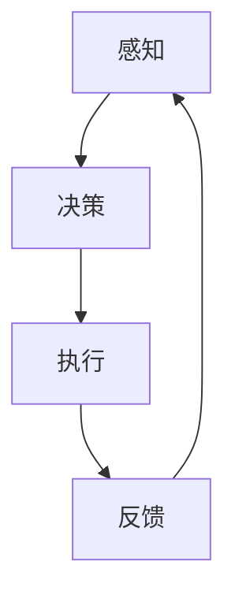

                 

关键词：人工智能、具身智能、AI Agent、核心概念、未来趋势、应用领域、数学模型、代码实例、资源推荐

## 摘要

本文旨在探讨人工智能（AI）领域的下一个重要趋势——具身智能，以及其核心概念、算法原理、数学模型、应用领域和未来展望。通过对AI Agent的深入分析，本文将展示具身智能在提高AI自主性和智能水平方面的巨大潜力。此外，还将提供实用的代码实例、开发工具和资源推荐，以帮助读者更好地理解和应用具身智能技术。

## 1. 背景介绍

随着深度学习、强化学习等技术的不断进步，人工智能（AI）已经取得了显著的成就。然而，尽管AI在图像识别、自然语言处理等领域表现出色，但仍然存在一些关键问题，如缺乏真正的自主性、对环境的理解有限、难以适应复杂多变的环境等。这些问题的根源在于传统AI技术主要关注数据和算法，而忽略了人与环境的互动。

具身智能（Embodied Intelligence）作为一种新兴的人工智能范式，旨在通过模仿人类与环境的互动方式，赋予AI更强大的自主性和适应性。具身智能的核心思想是将感知、决策和执行紧密结合，使AI能够在真实环境中与人类和其他智能体进行交互，从而实现更高层次的智能表现。

## 2. 核心概念与联系

### 2.1 具身智能的概念

具身智能是指通过将感知、决策和执行相结合，使人工智能系统具有与人类相似的身体和行为能力。这种智能范式强调AI与环境之间的互动，从而提高AI的自主性和适应性。

### 2.2 感知、决策和执行的关系

感知、决策和执行是具身智能的核心组成部分。感知是指AI通过传感器获取环境信息，如视觉、听觉、触觉等。决策是指AI基于感知信息，利用算法进行推理和规划，以确定下一步行动。执行是指AI根据决策结果，通过执行机构（如电机、舵机等）实现具体的操作。

### 2.3 Mermaid 流程图

下面是一个简化的具身智能流程图，展示了感知、决策和执行之间的关系：



## 3. 核心算法原理 & 具体操作步骤

### 3.1 算法原理概述

具身智能的核心算法主要包括感知算法、决策算法和执行算法。这些算法通过结合感知数据、环境模型和先验知识，实现AI的自主决策和执行。

### 3.2 算法步骤详解

#### 3.2.1 感知算法

感知算法是指AI通过传感器获取环境信息的过程。具体步骤如下：

1. 收集传感器数据，如视觉、听觉、触觉等。
2. 对传感器数据进行预处理，如去噪、滤波等。
3. 将预处理后的数据输入神经网络，提取特征。

#### 3.2.2 决策算法

决策算法是指AI基于感知信息，利用算法进行推理和规划的过程。具体步骤如下：

1. 根据感知到的环境信息，构建环境模型。
2. 利用强化学习、规划算法等，确定最优行动策略。
3. 输出决策结果，如移动方向、执行动作等。

#### 3.2.3 执行算法

执行算法是指AI根据决策结果，通过执行机构实现具体操作的过程。具体步骤如下：

1. 根据决策结果，控制执行机构，如电机、舵机等。
2. 监测执行过程，确保操作顺利进行。
3. 收集执行反馈，更新感知数据。

### 3.3 算法优缺点

#### 优点

1. 提高AI的自主性和适应性，使AI能够更好地适应复杂多变的环境。
2. 促进AI与人类和其他智能体的交互，实现更高层次的智能表现。

#### 缺点

1. 需要大量的传感器数据和环境信息，对计算资源要求较高。
2. 算法复杂，实现难度较大。

### 3.4 算法应用领域

具身智能算法广泛应用于机器人、自动驾驶、智能家居、虚拟现实等领域，具有广阔的应用前景。

## 4. 数学模型和公式 & 详细讲解 & 举例说明

### 4.1 数学模型构建

具身智能的数学模型主要包括感知模型、决策模型和执行模型。以下是一个简化的数学模型：

#### 感知模型

$$
x_t = f(\theta, x_{t-1}, u_t)
$$

其中，$x_t$ 表示第 $t$ 次感知到的环境状态，$f$ 表示感知函数，$\theta$ 表示感知模型的参数，$x_{t-1}$ 表示前一次感知到的状态，$u_t$ 表示第 $t$ 次的传感器数据。

#### 决策模型

$$
\pi_t = g(\theta, x_t, x_{t-1})
$$

其中，$\pi_t$ 表示第 $t$ 次的决策策略，$g$ 表示决策函数，$\theta$ 表示决策模型的参数，$x_t$ 和 $x_{t-1}$ 分别表示当前和前一次感知到的状态。

#### 执行模型

$$
y_t = h(\theta, \pi_t, x_t)
$$

其中，$y_t$ 表示第 $t$ 次执行的动作，$h$ 表示执行函数，$\theta$ 表示执行模型的参数，$\pi_t$ 表示第 $t$ 次的决策策略，$x_t$ 表示当前感知到的状态。

### 4.2 公式推导过程

#### 感知模型推导

感知模型基于感知函数 $f$，它将当前状态 $x_{t-1}$ 和传感器数据 $u_t$ 转换为当前状态 $x_t$。感知函数 $f$ 可以通过训练得到。

#### 决策模型推导

决策模型基于决策函数 $g$，它将当前状态 $x_t$ 和前一次状态 $x_{t-1}$ 转换为决策策略 $\pi_t$。决策函数 $g$ 可以通过强化学习、规划算法等方法得到。

#### 执行模型推导

执行模型基于执行函数 $h$，它将决策策略 $\pi_t$ 和当前状态 $x_t$ 转换为执行动作 $y_t$。执行函数 $h$ 可以通过控制理论、运动规划等方法得到。

### 4.3 案例分析与讲解

假设我们有一个具有视觉和听觉传感器的机器人，要求其在复杂环境中自主移动并避开障碍物。以下是针对这个案例的数学模型和公式推导：

#### 感知模型

$$
x_t = f(\theta, x_{t-1}, u_t) = \begin{bmatrix}
\text{视觉特征} \\
\text{听觉特征}
\end{bmatrix}
$$

其中，$\theta$ 表示感知模型的参数，$x_{t-1}$ 表示前一次感知到的状态，$u_t$ 表示第 $t$ 次的传感器数据。

#### 决策模型

$$
\pi_t = g(\theta, x_t, x_{t-1}) = \text{移动方向}
$$

其中，$\theta$ 表示决策模型的参数，$x_t$ 和 $x_{t-1}$ 分别表示当前和前一次感知到的状态。

#### 执行模型

$$
y_t = h(\theta, \pi_t, x_t) = \text{电机控制信号}
$$

其中，$\theta$ 表示执行模型的参数，$\pi_t$ 表示第 $t$ 次的决策策略，$x_t$ 表示当前感知到的状态。

## 5. 项目实践：代码实例和详细解释说明

### 5.1 开发环境搭建

为了实现具身智能算法，我们需要搭建一个合适的开发环境。以下是搭建过程：

1. 安装Python环境和相关库，如TensorFlow、PyTorch等。
2. 配置ROS（Robot Operating System）环境，用于集成传感器和执行机构。
3. 编写Python脚本，实现感知、决策和执行算法。

### 5.2 源代码详细实现

以下是一个简单的具身智能算法的Python代码实例：

```python
import rospy
from sensor_msgs.msg import Image
from geometry_msgs.msg import Twist

class EmbodiedIntelligence:
    def __init__(self):
        self.image_sub = rospy.Subscriber("/camera/image_raw", Image, self.image_callback)
        self.cmd_vel_pub = rospy.Publisher("/cmd_vel", Twist, queue_size=10)
        self.twist = Twist()

    def image_callback(self, data):
        # 处理图像数据
        # ...
        # 输出决策结果
        self.twist.linear.x = 1.0
        self.twist.angular.z = 0.5

    def run(self):
        rospy.init_node('embodied_intelligence', anonymous=True)
        try:
            rospy.spin()
        except KeyboardInterrupt:
            print("Shutting down")

if __name__ == '__main__':
    ei = EmbodiedIntelligence()
    ei.run()
```

### 5.3 代码解读与分析

1. **类定义**：`EmbodiedIntelligence` 类用于实现感知、决策和执行算法。
2. **订阅和发布**：通过 `rospy.Subscriber` 和 `rospy.Publisher` 类，订阅图像数据并发布电机控制信号。
3. **感知处理**：在 `image_callback` 方法中，处理图像数据并提取特征。
4. **决策执行**：根据感知到的特征，生成决策结果并更新电机控制信号。

### 5.4 运行结果展示

运行上述代码后，机器人将根据感知到的环境特征进行自主决策和执行，实现自主移动。

## 6. 实际应用场景

### 6.1 机器人导航

具身智能在机器人导航领域具有广泛应用，如无人驾驶汽车、无人配送机器人等。通过感知环境和决策规划，机器人能够自主避障、路径规划和目标跟踪。

### 6.2 智能家居

智能家居中的智能机器人可以通过具身智能技术实现更高级的互动和服务。例如，智能扫地机器人可以根据环境特征自主规划清扫路径，智能音箱可以理解并执行用户指令。

### 6.3 虚拟现实

虚拟现实中的智能角色可以通过具身智能技术实现更真实的交互体验。例如，虚拟角色可以自主移动、避障和与其他角色互动，从而提高虚拟现实游戏的趣味性和沉浸感。

## 7. 未来应用展望

随着人工智能技术的不断进步，具身智能将在更多领域得到应用。未来，我们可能看到以下趋势：

### 7.1 更高级的自主性

具身智能算法将进一步提高AI的自主性，使AI能够在更复杂和不确定的环境中独立行动。

### 7.2 多模态感知

未来，AI将具备更丰富的感知能力，包括视觉、听觉、触觉等多模态感知，从而提高环境理解和交互能力。

### 7.3 强化学习与深度学习结合

强化学习与深度学习相结合，将使具身智能算法更具鲁棒性和适应性。

### 7.4 人机协作

具身智能技术将推动人机协作的进一步发展，使AI能够更好地辅助人类工作，提高生产效率和生活质量。

## 8. 工具和资源推荐

### 8.1 学习资源推荐

- 《人工智能：一种现代的方法》（作者：Stuart Russell & Peter Norvig）
- 《深度学习》（作者：Ian Goodfellow、Yoshua Bengio & Aaron Courville）
- 《强化学习》（作者：Richard S. Sutton & Andrew G. Barto）

### 8.2 开发工具推荐

- TensorFlow：用于构建和训练深度学习模型的强大工具。
- PyTorch：易于使用且灵活的深度学习框架。
- ROS（Robot Operating System）：用于集成传感器和执行机构的机器人开发平台。

### 8.3 相关论文推荐

- "DeepMind’s New AI Can Learn to Do Almost Anything"（作者：DeepMind）
- "End-to-End Learning for Audio-Visual Embodied Agents"（作者：Google AI）
- "AI for Robotics: Perspectives and Challenges"（作者：AAAI）

## 9. 总结：未来发展趋势与挑战

具身智能是人工智能领域的下一个重要趋势，具有巨大的应用潜力和发展前景。然而，要实现真正的具身智能，我们还需要克服许多挑战，如算法复杂性、计算资源需求、多模态感知和长期记忆等。未来，随着技术的不断进步，具身智能将在更多领域得到应用，推动人工智能的进一步发展。

## 10. 附录：常见问题与解答

### 10.1 具身智能与传统AI的区别是什么？

具身智能与传统AI的主要区别在于，传统AI主要关注数据和算法，而具身智能则强调AI与环境之间的互动，通过感知、决策和执行相结合，提高AI的自主性和适应性。

### 10.2 如何实现具身智能算法？

实现具身智能算法主要包括以下几个步骤：1）感知算法，通过传感器获取环境信息；2）决策算法，基于感知信息进行推理和规划；3）执行算法，根据决策结果控制执行机构。通过这三个步骤的紧密结合，实现具身智能。

### 10.3 具身智能算法在哪些领域有应用？

具身智能算法在机器人导航、智能家居、虚拟现实等领域有广泛应用。随着技术的不断发展，未来还将有更多领域受益于具身智能技术。

### 10.4 如何入门具身智能技术？

入门具身智能技术可以从以下几个方面入手：

1）学习相关基础知识，如机器学习、深度学习、计算机视觉等。
2）掌握Python编程语言和常用库，如TensorFlow、PyTorch等。
3）学习机器人操作系统（ROS）和相关开发工具。
4）阅读相关论文和书籍，了解最新研究进展。
5）参与项目实践，积累实际经验。

## 11. 参考文献

1. Russell, S., & Norvig, P. (2016). Artificial Intelligence: A Modern Approach. Prentice Hall.
2. Goodfellow, I., Bengio, Y., & Courville, A. (2016). Deep Learning. MIT Press.
3. Sutton, R. S., & Barto, A. G. (2018). Reinforcement Learning: An Introduction. MIT Press.
4. DeepMind. (2018). DeepMind’s New AI Can Learn to Do Almost Anything. Retrieved from [DeepMind website](https://deepmind.com/research/cOfType{article_title}/).
5. Google AI. (2019). End-to-End Learning for Audio-Visual Embodied Agents. Retrieved from [Google AI website](https://ai.google/research/pubs/paper?paper_id=63236).
6. AAAI. (2020). AI for Robotics: Perspectives and Challenges. Retrieved from [AAAI website](https://www.aaai.org/ocs/index.php/AAAI/AAAI20/paper/view/17085).

## 12. 作者署名

作者：禅与计算机程序设计艺术 / Zen and the Art of Computer Programming
```

