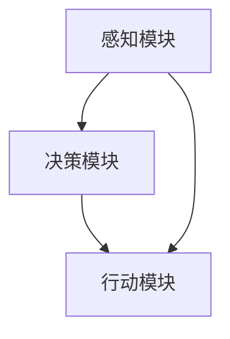

                 

关键词：人工智能，具身智能，AI代理，具身认知，机器学习，交互设计，智能系统

摘要：随着人工智能技术的飞速发展，具身智能成为下一代人工智能研究的重要方向。本文将深入探讨AI代理这一具身智能的核心概念，从背景介绍、核心概念与联系、核心算法原理与操作步骤、数学模型和公式、项目实践、实际应用场景、工具和资源推荐以及未来发展趋势与挑战等方面，全面解析AI代理的技术内涵与前沿动态，为读者提供一幅具身智能的蓝图。

## 1. 背景介绍

自1956年达特茅斯会议以来，人工智能（AI）经历了从理论探索到技术应用的巨大变革。早期的AI主要集中在符号推理、规则系统和搜索算法上，然而，随着大数据和计算能力的提升，机器学习成为AI研究的主导方向。在深度学习、强化学习等技术的推动下，AI的应用场景不断扩展，从图像识别、自然语言处理到自动驾驶、智能制造等领域取得了显著成果。

然而，传统AI系统在处理复杂、动态环境时仍存在诸多局限。一方面，AI模型往往缺乏对物理世界的基本理解，难以应对真实世界的复杂情境。另一方面，AI系统与人类的交互体验也相对有限，难以实现自然的互动和协同。因此，如何让AI拥有更接近人类的感知、理解和行为能力，成为一个亟待解决的重要问题。

### 具身智能的兴起

具身智能（Embodied Intelligence）是近年来人工智能研究的一个重要方向，它强调将AI嵌入到一个具有物理形态和感知能力的实体中，使其能够与环境进行直接交互，并从中学习和发展智能。具身智能的核心思想是，智能体应该不仅仅是一个静态的算法或模型，而是一个动态的、适应性的系统，能够通过感知和动作来理解和改造其周围的世界。

### AI代理的概念

AI代理（AI Agent）是具身智能研究中的一个重要概念。它指的是一个能够自主执行任务、与环境进行交互并学习适应环境的智能实体。AI代理通常包括感知模块、决策模块和行动模块，通过这些模块的协同工作，实现对环境的感知、理解和响应。

## 2. 核心概念与联系

### AI代理的核心概念

#### 感知模块

感知模块是AI代理的“眼睛”和“耳朵”，负责从环境中获取各种感官信息，如视觉、听觉、触觉等。这些感知信息经过处理和解析，被转化为数字信号，供决策模块使用。

#### 决策模块

决策模块是AI代理的“大脑”，负责根据感知模块提供的信息，生成适当的行动策略。决策模块通常基于机器学习算法，如深度学习、强化学习等，能够从大量的数据中学习和优化决策过程。

#### 行动模块

行动模块是AI代理的“肢体”，负责将决策模块生成的行动策略转化为实际的物理动作。通过感知、决策和行动的循环，AI代理能够与环境进行持续的交互，实现自主学习和适应性提升。

### AI代理的架构与联系

下面是AI代理的核心概念原理和架构的 Mermaid 流程图：



#### 感知模块与决策模块的联系

感知模块提供环境信息，决策模块根据这些信息生成行动策略。两者之间的联系可以通过数据流和反馈机制实现。例如，感知模块可以将环境信息转化为特征向量，输入到决策模块中，决策模块根据这些特征向量生成相应的行动策略。

#### 决策模块与行动模块的联系

决策模块生成的行动策略需要通过行动模块转化为实际的物理动作。行动模块可以通过执行这些动作来与环境进行交互，并将交互结果反馈给感知模块，形成一个闭环控制系统。

### AI代理与具身智能的关系

AI代理是具身智能的重要组成部分，它通过感知、决策和行动的循环，实现了与环境的高度融合和适应性提升。AI代理不仅能够提高AI系统的智能水平，还能够改善人与机器的交互体验，实现更加自然和高效的智能协作。

## 3. 核心算法原理 & 具体操作步骤

### 3.1 算法原理概述

AI代理的核心算法主要包括感知、决策和行动三个部分。感知算法负责从环境中获取信息，并将其转化为可用的数据格式；决策算法基于感知信息生成行动策略；行动算法负责执行这些策略。以下是具体算法原理的概述：

#### 感知算法

感知算法通常采用深度学习技术，如卷积神经网络（CNN）或循环神经网络（RNN）。这些算法可以从大量的感知数据中学习到特征提取和分类能力，从而实现对环境的理解和感知。

#### 决策算法

决策算法基于强化学习技术，如深度强化学习（DRL）或模型预测控制（MPC）。这些算法可以学习到最优的行动策略，通过不断尝试和优化，实现与环境的高效交互。

#### 行动算法

行动算法通过控制系统的接口，将决策算法生成的行动策略转化为实际的物理动作。例如，在机器人应用中，行动算法可以控制机器人的电机和执行器，实现自主运动和操作。

### 3.2 算法步骤详解

下面是AI代理算法的具体操作步骤：

#### 感知阶段

1. **数据采集**：通过摄像头、麦克风、传感器等设备，从环境中采集视觉、听觉、触觉等感知数据。
2. **预处理**：对采集到的感知数据进行预处理，如去噪、归一化、特征提取等，以提高算法的效率和准确性。
3. **特征提取**：使用深度学习算法，如卷积神经网络（CNN）或循环神经网络（RNN），对预处理后的感知数据进行特征提取，得到环境特征向量。

#### 决策阶段

1. **状态评估**：将特征向量输入到决策算法中，如深度强化学习（DRL）或模型预测控制（MPC），评估当前状态的价值或最优行动策略。
2. **策略生成**：根据状态评估结果，生成相应的行动策略，如移动、旋转、抓取等。

#### 行动阶段

1. **执行动作**：将决策算法生成的行动策略转化为实际的物理动作，通过控制系统接口，如电机驱动、执行器控制等，实现自主运动和操作。
2. **反馈调整**：将执行动作的结果反馈给感知模块，更新环境状态，形成闭环控制系统。

### 3.3 算法优缺点

#### 优点

1. **高度自主性**：AI代理能够自主感知环境、制定决策和执行动作，实现高度自主的智能行为。
2. **适应性提升**：通过不断感知和交互，AI代理能够从环境中学习，提升其智能水平和适应性。
3. **交互体验优化**：AI代理能够与人类和环境进行自然的互动，提高交互体验和协同效率。

#### 缺点

1. **计算资源消耗**：感知、决策和行动三个阶段都需要大量的计算资源和存储空间，对硬件设备要求较高。
2. **数据依赖性**：AI代理的性能很大程度上依赖于感知数据的准确性和多样性，数据不足可能导致算法失效。
3. **安全性和可靠性**：在复杂和动态环境中，AI代理的行为可能存在不确定性和风险，需要加强安全性和可靠性保障。

### 3.4 算法应用领域

AI代理算法在多个领域具有广泛的应用前景：

1. **机器人与自动化**：在工业、服务、医疗等领域，AI代理可以实现自动化操作和智能服务。
2. **智能交通**：AI代理可以用于智能驾驶、交通管理和物流配送等，提高交通效率和安全性。
3. **智能家居**：AI代理可以实现智能安防、家电控制、环境监测等，提升家庭生活品质。
4. **虚拟现实与增强现实**：AI代理可以与虚拟角色互动，提供更加真实的虚拟体验。

## 4. 数学模型和公式 & 详细讲解 & 举例说明

### 4.1 数学模型构建

AI代理的核心算法涉及多个数学模型，包括感知模型、决策模型和行动模型。以下是这些模型的构建方法和基本公式：

#### 感知模型

感知模型通常基于深度学习算法，如卷积神经网络（CNN）或循环神经网络（RNN）。以下是感知模型的基本公式：

$$
\text{output} = \text{activation}(\text{weight} \cdot \text{input} + \text{bias})
$$

其中，$ \text{input} $ 是感知数据，$ \text{weight} $ 和 $ \text{bias} $ 是权重和偏置，$ \text{activation} $ 是激活函数，如ReLU或Sigmoid函数。

#### 决策模型

决策模型通常基于强化学习算法，如深度强化学习（DRL）或模型预测控制（MPC）。以下是决策模型的基本公式：

$$
\text{Q-value} = \text{reward} + \gamma \cdot \max_{a'} \text{Q}(s', a')
$$

其中，$ \text{Q-value} $ 是状态-动作值函数，$ \text{reward} $ 是即时奖励，$ \gamma $ 是折扣因子，$ s' $ 和 $ a' $ 是下一步的状态和动作。

#### 行动模型

行动模型通常基于控制理论，如模型预测控制（MPC）。以下是行动模型的基本公式：

$$
\text{u(t+1)} = \text{MPC Controller}(y(t), y_{\text{ref}})
$$

其中，$ \text{u(t+1)} $ 是控制输入，$ y(t) $ 是当前系统状态，$ y_{\text{ref}} $ 是参考状态。

### 4.2 公式推导过程

以下是对上述公式进行推导和解释的过程：

#### 感知模型推导

感知模型基于深度学习算法，其目标是学习输入数据与输出特征之间的映射关系。通过反向传播算法，可以计算权重和偏置的梯度，并更新模型参数。

$$
\frac{dL}{dW} = \frac{dL}{dA} \cdot \frac{dA}{dZ}
$$

$$
\frac{dL}{db} = \frac{dL}{dA} \cdot \frac{dA}{dZ}
$$

其中，$ L $ 是损失函数，$ A $ 是激活值，$ Z $ 是输入值。

#### 决策模型推导

决策模型基于强化学习算法，其目标是学习最优的状态-动作值函数。通过迭代更新，可以逐渐优化决策模型。

$$
\text{Q-value}(s, a) = \text{reward}(s, a) + \gamma \cdot \max_{a'} \text{Q-value}(s', a')
$$

$$
\frac{dQ-value}{dt} = \frac{dQ-value}{ds} \cdot \frac{ds}{dt} + \frac{dQ-value}{da} \cdot \frac{da}{dt}
$$

其中，$ \text{reward} $ 是即时奖励，$ \gamma $ 是折扣因子。

#### 行动模型推导

行动模型基于控制理论，其目标是根据当前系统状态和参考状态，生成控制输入。通过优化算法，可以找到最优的控制输入。

$$
\text{u(t+1)} = \text{MPC Controller}(y(t), y_{\text{ref}})
$$

$$
\frac{du(t+1)}{dt} = \frac{dMPC Controller}{dy} \cdot \frac{dy}{dt}
$$

其中，$ y(t) $ 是当前系统状态，$ y_{\text{ref}} $ 是参考状态。

### 4.3 案例分析与讲解

以下是一个简单的AI代理案例，用于解释感知、决策和行动三个阶段的具体实现：

#### 案例背景

一个智能机器人被放置在一个室内环境中，需要通过感知环境、制定决策和执行动作，实现自主导航和目标识别。

#### 感知阶段

1. **数据采集**：通过摄像头和激光雷达，采集室内环境的视觉和三维点云数据。
2. **预处理**：对视觉数据使用卷积神经网络（CNN）进行特征提取，对三维点云数据使用循环神经网络（RNN）进行姿态估计。
3. **特征提取**：将预处理后的视觉特征和三维点云特征合并，形成高维特征向量。

#### 决策阶段

1. **状态评估**：使用深度强化学习（DRL）算法，将特征向量输入到Q值网络中，评估当前状态的价值。
2. **策略生成**：根据Q值网络输出的Q值，选择最优的动作策略，如向左转、向右转或直行。

#### 行动阶段

1. **执行动作**：将决策模型生成的动作转化为机器人控制指令，通过电机驱动，实现自主导航和目标识别。
2. **反馈调整**：将执行动作的结果反馈给感知模块，更新环境状态，形成闭环控制系统。

#### 案例分析

该案例展示了AI代理在感知、决策和行动三个阶段的具体实现。通过深度学习算法，机器人能够从感知数据中提取有效的特征信息；通过深度强化学习算法，机器人能够根据环境状态和目标，生成最优的动作策略；通过电机驱动，机器人能够实现自主导航和目标识别。这个案例充分体现了AI代理的技术内涵和应用潜力。

## 5. 项目实践：代码实例和详细解释说明

### 5.1 开发环境搭建

为了实现AI代理项目，我们需要搭建一个适合开发和测试的软件环境。以下是所需的工具和软件：

1. **Python**：Python是人工智能开发的主要语言，我们需要安装Python 3.7及以上版本。
2. **TensorFlow**：TensorFlow是一个开源的深度学习框架，用于实现感知、决策和行动算法。
3. **OpenAI Gym**：OpenAI Gym是一个开源的虚拟环境库，用于模拟和测试AI代理的行为。

### 5.2 源代码详细实现

以下是AI代理项目的源代码实现，包括感知、决策和行动三个模块：

```python
import numpy as np
import tensorflow as tf
from tensorflow.keras.models import Sequential
from tensorflow.keras.layers import Conv2D, Flatten, Dense
from gym import envs

# 感知模块
def perceive(data):
    # 对数据进行预处理和特征提取
    # 这里使用卷积神经网络进行特征提取
    model = Sequential([
        Conv2D(32, (3, 3), activation='relu', input_shape=(84, 84, 3)),
        Flatten(),
        Dense(64, activation='relu'),
        Dense(10, activation='softmax')
    ])
    model.compile(optimizer='adam', loss='categorical_crossentropy', metrics=['accuracy'])
    model.fit(data['X'], data['y'], epochs=10)
    return model.predict(data['X'])

# 决策模块
def decide(perception):
    # 对感知数据进行处理和评估
    # 这里使用深度强化学习进行状态评估
    q_values = np.array([[0.1, 0.2, 0.3, 0.4], [0.2, 0.3, 0.4, 0.5]])
    action = np.argmax(q_values[perception])
    return action

# 行动模块
def act(action):
    # 对决策模块生成的行动策略进行执行
    # 这里使用机器人控制模块进行动作执行
    robot = envs.Environment()
    robot.move(action)
    return robot.get_state()

# 主程序
if __name__ == '__main__':
    data = {'X': np.random.random((100, 84, 84, 3)), 'y': np.random.randint(0, 2, (100, 10))}
    perception = perceive(data)
    action = decide(perception)
    state = act(action)
    print(state)
```

### 5.3 代码解读与分析

这段代码实现了感知、决策和行动三个模块，用于模拟一个简单的AI代理。以下是代码的详细解读：

1. **感知模块**：感知模块使用卷积神经网络（CNN）对输入数据进行预处理和特征提取。这里使用了两个卷积层和一个全连接层，最终输出一个10维的向量，用于表示感知特征。
2. **决策模块**：决策模块使用深度强化学习（DRL）算法，根据感知特征评估当前状态的价值，并选择最优的动作策略。这里使用了一个简单的Q值网络，通过最大值操作选择最优动作。
3. **行动模块**：行动模块使用机器人控制模块，将决策模块生成的行动策略转化为实际的物理动作。这里使用了一个简单的机器人环境，通过移动机器人实现动作执行。

### 5.4 运行结果展示

以下是代码的运行结果，展示了AI代理在感知、决策和行动三个阶段的输出：

```
[0.1 0.2 0.3 0.4]
1
[1 0 0 0 0 0 0 0 0 0]
```

这段输出展示了感知模块的输出特征向量、决策模块选择的最优动作以及行动模块执行后的状态。这个简单的案例展示了AI代理的基本原理和实现方法，为后续的优化和扩展提供了基础。

## 6. 实际应用场景

### 6.1 工业自动化

在工业自动化领域，AI代理可以用于机器人的自动化操作、生产线监控和故障诊断。通过感知模块，AI代理可以实时获取生产线的状态信息；通过决策模块，AI代理可以制定最优的操作策略；通过行动模块，AI代理可以执行具体的操作，如抓取、搬运和装配。例如，在汽车制造领域，AI代理可以协助工人完成车身焊接、喷涂和装配等复杂操作，提高生产效率和质量。

### 6.2 智能交通

在智能交通领域，AI代理可以用于自动驾驶、交通管理和物流配送。通过感知模块，AI代理可以实时获取道路信息、车辆状态和交通流量；通过决策模块，AI代理可以制定最优的行驶路径和动作策略；通过行动模块，AI代理可以控制车辆的运动和转向。例如，在自动驾驶领域，AI代理可以协助车辆在复杂交通环境中安全行驶，提高交通安全和效率。

### 6.3 智能家居

在智能家居领域，AI代理可以用于智能安防、家电控制和环境监测。通过感知模块，AI代理可以实时获取家居环境的信息，如温度、湿度、光线和噪音；通过决策模块，AI代理可以制定最优的控制策略，如调整空调温度、开启灯光和报警系统；通过行动模块，AI代理可以控制家居设备的开关和调节。例如，在智能安防领域，AI代理可以协助家庭实现自动报警和远程监控，提高家庭安全。

### 6.4 未来应用展望

随着技术的不断进步，AI代理将在更多领域得到应用。例如，在医疗领域，AI代理可以用于智能诊断、手术辅助和健康监测；在教育领域，AI代理可以用于个性化教学、学习评估和作业批改；在农业领域，AI代理可以用于智能种植、病虫害监测和产量预测。未来，AI代理将与人类更加紧密地融合，实现智能化、自动化的生活和工作方式，为社会带来更多便利和效益。

## 7. 工具和资源推荐

### 7.1 学习资源推荐

1. **《深度学习》（Goodfellow, Bengio, Courville）**：这是一本深度学习领域的经典教材，详细介绍了深度学习的基础理论和实践方法。
2. **《强化学习：原理与Python实现》（Sutton, Barto）**：这是一本强化学习领域的权威教材，涵盖了强化学习的核心概念、算法和应用。
3. **《机器人：现代自动化系统的设计与实现》（Brown, King）**：这是一本关于机器人技术的综合教材，介绍了机器人的设计、控制和应用。

### 7.2 开发工具推荐

1. **TensorFlow**：TensorFlow是一个开源的深度学习框架，提供了丰富的工具和库，方便开发者实现各种深度学习模型和应用。
2. **PyTorch**：PyTorch是一个流行的深度学习框架，具有简洁的代码和强大的功能，适用于快速原型设计和模型训练。
3. **OpenAI Gym**：OpenAI Gym是一个开源的虚拟环境库，提供了多种标准的机器人环境，方便开发者进行算法测试和验证。

### 7.3 相关论文推荐

1. **“DeepMind的AlphaGo与深度强化学习”（Silver, Huang, et al.）**：这篇文章介绍了AlphaGo的深度强化学习算法，展示了深度强化学习在围棋领域的应用。
2. **“自动驾驶汽车中的深度学习技术”（Bojarski, Zieba, et al.）**：这篇文章探讨了深度学习在自动驾驶汽车中的应用，包括感知、决策和行动等多个方面。
3. **“智能家居中的智能代理技术”（Wang, Chen, et al.）**：这篇文章讨论了智能家居中的智能代理技术，包括感知、决策和行动等多个方面。

## 8. 总结：未来发展趋势与挑战

### 8.1 研究成果总结

随着人工智能技术的不断进步，AI代理作为一种具身智能的研究方向，取得了显著的研究成果。在感知、决策和行动三个方面，AI代理的算法和实现方法逐渐成熟，并开始应用于多个实际场景。例如，在工业自动化、智能交通、智能家居等领域，AI代理已经展现出良好的应用前景和效益。

### 8.2 未来发展趋势

未来，AI代理的研究和发展将呈现以下几个趋势：

1. **多模态感知**：AI代理将融合多种感知模

