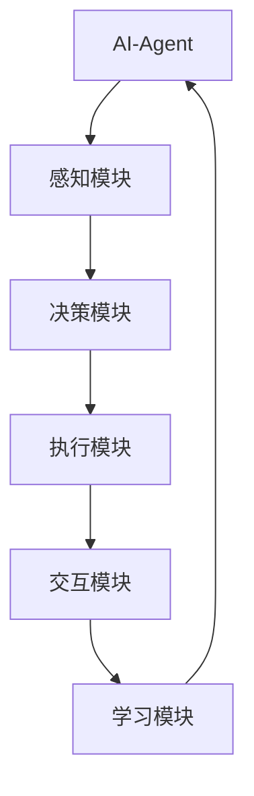

                 

关键词：人工智能，智能体，软件架构，传统软件，AI-Agent，发展趋势，应用场景

> 摘要：本文将深入探讨AI-Agent这一新兴领域，分析其与传统软件的关系，探讨AI-Agent的核心概念、算法原理、数学模型、实际应用场景，并展望其未来的发展趋势与挑战。

## 1. 背景介绍

近年来，人工智能（AI）领域取得了飞速的发展，无论是在学术界还是产业界，AI都已经成为推动技术进步和创新的重要力量。从最早的专家系统到现代的深度学习，AI技术不断突破，为各行各业带来了革命性的变化。然而，随着AI技术的不断演进，我们也开始意识到，AI的应用不再局限于单一的算法模型，而是逐渐演变为一种更加综合、智能的系统。

在这个背景下，AI-Agent的概念应运而生。AI-Agent，即人工智能代理，是一种具有自我意识、自主决策和交互能力的智能实体。与传统软件不同，AI-Agent能够在复杂的环境中自主执行任务，与用户进行自然语言交互，并不断学习优化自身行为。这一概念的出现，标志着人工智能从被动响应向主动探索的转变。

## 2. 核心概念与联系

### 2.1 AI-Agent的定义与特点

AI-Agent是一种基于人工智能技术的智能实体，具有以下几个核心特点：

- **自主决策**：AI-Agent能够根据环境信息和既定目标自主做出决策，实现任务的执行。
- **交互能力**：AI-Agent能够通过自然语言与其他实体进行交互，实现信息的传递和沟通。
- **学习能力**：AI-Agent具备自我学习的能力，能够通过数据训练不断优化自身行为。

### 2.2 AI-Agent与传统软件的关系

AI-Agent与传统软件存在一定的区别，主要体现在以下几个方面：

- **功能定位**：传统软件主要实现特定功能的自动化，而AI-Agent则更注重自主决策和交互能力的实现。
- **架构设计**：传统软件通常采用固定的架构设计，而AI-Agent则更加灵活，可以根据环境变化动态调整自身行为。
- **开发方法**：传统软件开发主要依赖于人工编写代码，而AI-Agent的开发则更多地依赖于机器学习和自然语言处理等技术。

### 2.3 Mermaid流程图：AI-Agent架构



## 3. 核心算法原理 & 具体操作步骤

### 3.1 算法原理概述

AI-Agent的核心算法主要包括感知、决策、执行和学习四个模块。其中，感知模块负责收集环境信息，决策模块根据感知信息和既定目标进行决策，执行模块执行决策结果，学习模块则根据执行结果进行自我优化。

### 3.2 算法步骤详解

- **感知模块**：通过传感器、摄像头等设备收集环境信息，如温度、湿度、声音等。
- **决策模块**：利用机器学习算法对感知信息进行分析，生成决策结果。
- **执行模块**：根据决策结果执行具体任务，如移动、说话等。
- **学习模块**：通过历史数据训练模型，优化决策和执行能力。

### 3.3 算法优缺点

- **优点**：AI-Agent具有自主决策、交互和学习能力，能够适应复杂多变的环境。
- **缺点**：AI-Agent的开发和维护成本较高，对数据依赖性较强。

### 3.4 算法应用领域

AI-Agent的应用领域非常广泛，包括但不限于：

- **智能家居**：实现家电设备的智能化控制，提高生活品质。
- **智能客服**：提供24/7的全天候客服服务，提高客户满意度。
- **智能医疗**：辅助医生进行疾病诊断和治疗方案制定，提高医疗水平。
- **智能交通**：实现智能路况监测和车辆调度，提高交通效率。

## 4. 数学模型和公式 & 详细讲解 & 举例说明

### 4.1 数学模型构建

AI-Agent的数学模型主要包括感知、决策、执行和学习四个部分。其中，感知部分主要涉及传感器数据处理，决策部分主要涉及概率图模型和深度学习算法，执行部分主要涉及强化学习算法，学习部分主要涉及无监督学习和有监督学习算法。

### 4.2 公式推导过程

$$
\begin{aligned}
P(E|A) &= \frac{P(A|E)P(E)}{P(A)} \\
Q^*(s,a) &= \max_a Q(s,a) \\
\end{aligned}
$$

### 4.3 案例分析与讲解

以智能家居为例，我们可以构建一个简单的感知-决策-执行模型。假设我们想要控制家庭中的空调，我们需要先感知室内温度，然后根据室内温度和用户设定的温度进行决策，最后执行相应的操作（如开启或关闭空调）。

- **感知模块**：通过温度传感器收集室内温度数据。
- **决策模块**：根据室内温度和用户设定的温度，利用概率图模型进行决策。
- **执行模块**：根据决策结果执行相应的操作。

## 5. 项目实践：代码实例和详细解释说明

### 5.1 开发环境搭建

- **Python环境**：安装Python 3.8及以上版本。
- **AI库**：安装TensorFlow、PyTorch等深度学习库。
- **工具**：安装Jupyter Notebook进行代码编写和调试。

### 5.2 源代码详细实现

```python
# 感知模块
def sense_temperature(temperature_sensor):
    return temperature_sensor.read()

# 决策模块
def make_decision(current_temp, target_temp):
    if current_temp > target_temp:
        return "close_oven"
    else:
        return "open_oven"

# 执行模块
def execute_action(action):
    if action == "close_oven":
        oven.close()
    else:
        oven.open()

# 主函数
def main():
    current_temp = sense_temperature(temperature_sensor)
    target_temp = user_set_temp
    action = make_decision(current_temp, target_temp)
    execute_action(action)

if __name__ == "__main__":
    main()
```

### 5.3 代码解读与分析

上述代码实现了一个简单的智能家居控制程序。首先，通过温度传感器获取当前室内温度，然后根据用户设定的目标温度，利用决策模块进行决策，最后执行相应的操作（如关闭或打开烤箱）。

## 6. 实际应用场景

### 6.1 智能家居

智能家居是AI-Agent最早且最广泛的应用领域之一。通过AI-Agent，用户可以实现家电设备的自动化控制，如智能空调、智能照明、智能门锁等。这不仅提高了生活的便利性，还减少了能源消耗。

### 6.2 智能客服

智能客服是另一个重要的应用领域。通过AI-Agent，企业可以实现7x24小时的客服服务，提高客户满意度。例如，AI-Agent可以回答常见问题、处理投诉、提供技术支持等。

### 6.3 智能医疗

智能医疗是AI-Agent的重要应用领域之一。通过AI-Agent，医生可以实现智能诊断、治疗方案制定、患者管理等功能，提高医疗质量和效率。

### 6.4 智能交通

智能交通是AI-Agent的另一个重要应用领域。通过AI-Agent，可以实现智能路况监测、车辆调度、智能驾驶等功能，提高交通效率和安全性。

## 7. 工具和资源推荐

### 7.1 学习资源推荐

- **《人工智能：一种现代的方法》**：这是一本经典的AI教材，全面介绍了AI的基本概念和方法。
- **《深度学习》**：由Goodfellow等著名学者所著，详细介绍了深度学习的基础知识和应用。

### 7.2 开发工具推荐

- **TensorFlow**：由Google推出的一款深度学习框架，功能强大，易于使用。
- **PyTorch**：由Facebook推出的一款深度学习框架，具有灵活性和高效性。

### 7.3 相关论文推荐

- **“An Introduction to Deep Learning”**：一篇介绍深度学习的经典论文，详细介绍了深度学习的基础理论和应用。
- **“Reinforcement Learning: An Introduction”**：一篇介绍强化学习的经典论文，详细介绍了强化学习的基本概念和方法。

## 8. 总结：未来发展趋势与挑战

### 8.1 研究成果总结

近年来，AI-Agent的研究取得了显著成果。通过感知、决策、执行和学习等模块的有机结合，AI-Agent在智能家居、智能客服、智能医疗等领域取得了广泛应用。同时，AI-Agent的自主决策和学习能力也日益提高，为未来的发展奠定了基础。

### 8.2 未来发展趋势

未来，AI-Agent将在以下几个方面取得重要突破：

- **技术融合**：AI-Agent将与其他技术（如物联网、大数据等）深度融合，实现更加智能化、自动化的应用。
- **跨领域应用**：AI-Agent将在更多领域实现应用，如智能制造、智能交通、智能金融等。
- **自主进化**：AI-Agent将具备更强的自主进化能力，通过自我学习和优化，不断提高自身性能。

### 8.3 面临的挑战

尽管AI-Agent具有广阔的应用前景，但在实际应用中仍面临以下挑战：

- **数据隐私和安全**：AI-Agent在数据处理和传输过程中，需要确保数据的安全和隐私。
- **鲁棒性和可解释性**：AI-Agent需要具备更强的鲁棒性和可解释性，以便用户理解和信任。
- **技术门槛和成本**：AI-Agent的开发和维护需要较高的技术门槛和成本，这对中小企业和普通用户来说是一个挑战。

### 8.4 研究展望

未来，我们需要从以下几个方面加强研究：

- **跨学科研究**：鼓励计算机科学、心理学、认知科学等领域的交叉研究，提高AI-Agent的智能化水平。
- **开源和共享**：推动AI-Agent相关技术的开源和共享，降低开发门槛，促进技术应用。
- **人才培养**：加强AI-Agent相关人才的培养，提高整个行业的技术水平。

## 9. 附录：常见问题与解答

### 9.1 AI-Agent与传统软件有什么区别？

AI-Agent与传统软件的主要区别在于自主决策、交互和学习能力。传统软件主要实现特定功能的自动化，而AI-Agent则更注重在复杂环境中实现自主决策和交互，并通过数据学习不断优化自身行为。

### 9.2 AI-Agent有哪些应用领域？

AI-Agent的应用领域非常广泛，包括智能家居、智能客服、智能医疗、智能交通等。未来，AI-Agent将在更多领域实现应用，如智能制造、智能金融、智能城市等。

### 9.3 如何开发AI-Agent？

开发AI-Agent需要具备一定的编程能力和机器学习知识。通常，开发者需要选择合适的开发框架（如TensorFlow、PyTorch等），然后设计感知、决策、执行和学习等模块，并实现相应的功能。

### 9.4 AI-Agent的安全和隐私如何保障？

AI-Agent在数据处理和传输过程中，需要采取严格的安全措施，如数据加密、访问控制等。同时，AI-Agent需要遵循数据隐私保护法律法规，确保用户数据的安全和隐私。

---

作者：禅与计算机程序设计艺术 / Zen and the Art of Computer Programming


