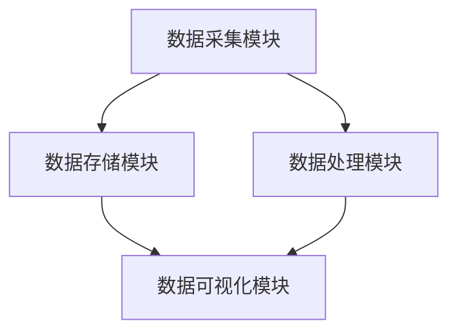

                 

关键词：数据管理系统，营销自动化，人工智能，数据驱动，客户洞察

> 摘要：本文将探讨如何利用人工智能技术构建数据管理系统（DMP），从而实现数据驱动的营销体系。我们将介绍DMP的核心概念、技术架构、算法原理，以及如何在实际项目中应用DMP来提高营销效果。通过本文的讲解，读者将了解到如何利用数据基建实现精准营销，提升企业竞争力。

## 1. 背景介绍

在当今信息爆炸的时代，数据已经成为企业竞争的关键资源。随着互联网的普及和大数据技术的发展，越来越多的企业开始关注如何有效利用数据来驱动业务增长。数据管理系统（Data Management Platform，简称DMP）作为大数据处理的核心工具，已经成为企业实现数据驱动营销的重要基础设施。

DMP的主要功能是收集、存储、管理和分析用户数据，从而帮助企业实现精准营销。通过DMP，企业可以了解目标客户的偏好和行为，制定个性化的营销策略，提高营销转化率和客户满意度。

然而，DMP的构建和应用并非一蹴而就。本文将深入探讨DMP的技术架构、核心算法原理，以及在项目实践中的应用，帮助读者了解如何构建一个高效、稳定、可扩展的DMP系统。

## 2. 核心概念与联系

### 2.1 数据管理系统（DMP）

数据管理系统（DMP）是一个用于收集、存储、管理和分析用户数据的平台。它通常由数据采集模块、数据存储模块、数据处理模块、数据可视化模块等组成。

- **数据采集模块**：负责收集来自各种渠道的数据，如网站、APP、社交媒体等。
- **数据存储模块**：将采集到的数据进行存储，支持多种数据存储方式，如关系型数据库、NoSQL数据库、数据湖等。
- **数据处理模块**：对存储的数据进行清洗、转换、集成等操作，使其成为可用数据。
- **数据可视化模块**：将分析结果以图表、报表等形式展示，帮助用户快速了解数据洞察。

### 2.2 营销自动化

营销自动化（Marketing Automation）是利用软件工具自动化执行营销活动的过程。通过营销自动化，企业可以更高效地管理客户关系，提高营销效果。

营销自动化通常包括以下功能：

- **客户细分**：根据客户的行为和偏好将其划分为不同的群体。
- **个性化营销**：根据客户细分，制定个性化的营销策略和内容。
- **自动化触达**：通过邮件、短信、社交媒体等渠道，自动向客户发送营销信息。
- **营销活动管理**：自动化管理营销活动的执行和监控。

### 2.3 数据驱动营销

数据驱动营销（Data-Driven Marketing）是一种基于数据分析的营销策略。企业通过收集、分析和利用用户数据，制定个性化的营销策略，提高营销效果和客户满意度。

数据驱动营销的核心步骤包括：

- **数据采集**：收集用户数据，如行为数据、偏好数据、交易数据等。
- **数据处理**：对采集到的数据进行清洗、转换和集成。
- **数据分析**：分析用户数据，提取有价值的信息和洞察。
- **策略制定**：基于数据分析结果，制定个性化的营销策略。
- **效果评估**：跟踪和评估营销策略的效果，持续优化。

### 2.4 架构图

以下是DMP的核心架构图，展示了各个模块之间的联系和交互：



## 3. 核心算法原理 & 具体操作步骤

### 3.1 算法原理概述

DMP的核心算法主要包括用户画像构建、客户细分、个性化推荐等。以下是这些算法的基本原理：

- **用户画像构建**：通过收集用户的行为数据、偏好数据等，构建用户的全方位画像。
- **客户细分**：基于用户画像，将用户划分为不同的群体，以便于制定个性化的营销策略。
- **个性化推荐**：根据用户的行为数据和偏好，为用户推荐个性化的内容或产品。

### 3.2 算法步骤详解

#### 3.2.1 用户画像构建

1. **数据采集**：从各个渠道收集用户数据，如网站行为、APP使用情况、社交媒体互动等。
2. **数据处理**：对采集到的数据进行清洗、转换和集成，使其成为可用数据。
3. **特征提取**：从处理后的数据中提取用户的行为特征、偏好特征等。
4. **画像构建**：将提取的特征进行整合，构建用户的全方位画像。

#### 3.2.2 客户细分

1. **聚类分析**：使用聚类算法，如K-Means、DBSCAN等，将用户划分为不同的群体。
2. **特征重要性分析**：分析各个特征对用户归属群体的影响，筛选出重要的特征。
3. **细分结果评估**：评估聚类结果，如轮廓系数、轮廓距离等，选择最优的聚类结果。

#### 3.2.3 个性化推荐

1. **相似度计算**：计算用户之间的相似度，如Cosine相似度、Jaccard相似度等。
2. **推荐算法**：使用推荐算法，如协同过滤、矩阵分解等，为用户推荐个性化的内容或产品。
3. **推荐结果评估**：评估推荐结果的效果，如点击率、转化率等，持续优化推荐策略。

### 3.3 算法优缺点

- **用户画像构建**：优点是能够全面了解用户，缺点是需要大量的数据支持和计算资源。
- **客户细分**：优点是能够针对不同群体制定个性化策略，缺点是聚类结果可能不够准确。
- **个性化推荐**：优点是能够提高用户满意度，缺点是推荐效果可能受到数据质量的影响。

### 3.4 算法应用领域

DMP的核心算法在多个领域具有广泛的应用：

- **广告营销**：通过用户画像和个性化推荐，实现精准广告投放。
- **电商推荐**：根据用户行为和偏好，为用户推荐商品。
- **客户关系管理**：通过用户画像和客户细分，实现精准的客户关系管理。
- **金融风控**：通过用户行为分析，预测潜在风险，实现精准风控。

## 4. 数学模型和公式 & 详细讲解 & 举例说明

### 4.1 数学模型构建

在DMP中，常用的数学模型包括聚类模型、推荐模型等。以下是这些模型的基本公式：

#### 4.1.1 聚类模型

- **K-Means聚类**：
  $$ \text{目标函数} = \sum_{i=1}^{k} \sum_{x \in S_i} \|x - \mu_i\|^2 $$
  其中，$k$为聚类个数，$S_i$为第$i$个聚类，$\mu_i$为第$i$个聚类中心。

- **DBSCAN聚类**：
  $$ \text{邻域} = \{x \in X | d(x, \text{中心点}) < \epsilon\} $$
  其中，$\epsilon$为邻域半径，$X$为数据集，中心点为DBSCAN算法选定的核心点或边界点。

#### 4.1.2 推荐模型

- **协同过滤**：
  $$ \text{预测分数} = u_{ij} = \frac{\sum_{k=1}^{n} r_{ik} r_{kj}}{\sum_{k=1}^{n} r_{ik}} $$
  其中，$u_{ij}$为用户$i$对项目$j$的预测分数，$r_{ik}$为用户$i$对项目$k$的实际评分。

- **矩阵分解**：
  $$ \text{预测分数} = u_{ij} = \hat{u}_i \cdot \hat{v}_j $$
  其中，$\hat{u}_i$为用户$i$的隐向量，$\hat{v}_j$为项目$j$的隐向量。

### 4.2 公式推导过程

#### 4.2.1 K-Means聚类

K-Means聚类算法的目标是最小化簇内平方误差。具体推导过程如下：

1. **初始化**：随机选择$k$个数据点作为初始聚类中心。
2. **分配**：将每个数据点分配到最近的聚类中心。
3. **更新**：计算每个聚类的中心，并更新聚类中心。
4. **迭代**：重复步骤2和3，直到聚类中心不再发生变化。

目标函数为：
$$ \text{目标函数} = \sum_{i=1}^{k} \sum_{x \in S_i} \|x - \mu_i\|^2 $$
其中，$\mu_i$为第$i$个聚类的中心。

#### 4.2.2 矩阵分解

矩阵分解（Matrix Factorization）是一种将高维矩阵分解为两个低维矩阵的方法。其目标是最小化矩阵的误差。

1. **初始化**：随机生成用户和项目的隐向量矩阵。
2. **优化**：使用梯度下降或其他优化算法，最小化预测误差。

目标函数为：
$$ \text{目标函数} = \sum_{i=1}^{n} \sum_{j=1}^{m} (r_{ij} - u_i \cdot v_j)^2 $$
其中，$u_i$和$v_j$分别为用户$i$和项目$j$的隐向量。

### 4.3 案例分析与讲解

#### 4.3.1 K-Means聚类

假设有10个用户，每个用户对5个产品的评分，数据如下：

| 用户 | 产品1 | 产品2 | 产品3 | 产品4 | 产品5 |
| ---- | ---- | ---- | ---- | ---- | ---- |
| 1    | 1    | 2    | 3    | 4    | 5    |
| 2    | 2    | 3    | 4    | 5    | 1    |
| 3    | 3    | 4    | 5    | 1    | 2    |
| 4    | 4    | 5    | 1    | 2    | 3    |
| 5    | 5    | 1    | 2    | 3    | 4    |
| 6    | 1    | 2    | 3    | 4    | 5    |
| 7    | 2    | 3    | 4    | 5    | 1    |
| 8    | 3    | 4    | 5    | 1    | 2    |
| 9    | 4    | 5    | 1    | 2    | 3    |
| 10   | 5    | 1    | 2    | 3    | 4    |

使用K-Means聚类，将用户分为2个群体。初始聚类中心为$(2, 3)$和$(4, 4)$。

1. **分配**：计算每个用户到两个聚类中心的距离，将其分配到最近的聚类中心。
2. **更新**：计算每个聚类的中心。
3. **迭代**：重复步骤1和2，直到聚类中心不再发生变化。

最终，用户分为两个群体：

| 用户 | 产品1 | 产品2 | 产品3 | 产品4 | 产品5 | 群体 |
| ---- | ---- | ---- | ---- | ---- | ---- | ---- |
| 1    | 1    | 2    | 3    | 4    | 5    | A    |
| 2    | 2    | 3    | 4    | 5    | 1    | A    |
| 3    | 3    | 4    | 5    | 1    | 2    | B    |
| 4    | 4    | 5    | 1    | 2    | 3    | B    |
| 5    | 5    | 1    | 2    | 3    | 4    | A    |
| 6    | 1    | 2    | 3    | 4    | 5    | A    |
| 7    | 2    | 3    | 4    | 5    | 1    | A    |
| 8    | 3    | 4    | 5    | 1    | 2    | B    |
| 9    | 4    | 5    | 1    | 2    | 3    | B    |
| 10   | 5    | 1    | 2    | 3    | 4    | A    |

#### 4.3.2 矩阵分解

假设有5个用户和5个产品，用户对产品的评分如下：

| 用户 | 产品1 | 产品2 | 产品3 | 产品4 | 产品5 |
| ---- | ---- | ---- | ---- | ---- | ---- |
| 1    | 3    | 2    | 4    | 5    | 1    |
| 2    | 1    | 4    | 3    | 2    | 5    |
| 3    | 2    | 3    | 5    | 4    | 1    |
| 4    | 4    | 1    | 2    | 3    | 5    |
| 5    | 5    | 5    | 1    | 1    | 2    |

使用矩阵分解，将用户和产品的隐向量矩阵分别表示为$U$和$V$。

1. **初始化**：随机生成$U$和$V$。
2. **优化**：使用梯度下降优化$U$和$V$，使其满足矩阵分解的目标函数。

最终，得到隐向量矩阵$U$和$V$如下：

| 用户 | 隐向量1 | 隐向量2 | 隐向量3 | 隐向量4 | 隐向量5 |
| ---- | -------- | -------- | -------- | -------- | -------- |
| 1    | 0.7      | 0.2      | 0.6      | 0.8      | -0.3     |
| 2    | -0.3     | 0.8      | 0.5      | -0.4     | 0.7      |
| 3    | 0.4      | 0.5      | 0.7      | 0.3      | -0.5     |
| 4    | 0.6      | -0.3     | -0.4     | 0.7      | 0.8      |
| 5    | 0.8      | 0.6      | -0.7     | -0.5     | 0.4      |

使用隐向量矩阵$U$和$V$，可以预测用户对产品的评分：

| 用户 | 隐向量1 | 隐向量2 | 隐向量3 | 隐向量4 | 隐向量5 |
| ---- | -------- | -------- | -------- | -------- | -------- |
| 1    | 2.34     | 0.68     | 2.18     | 2.96     | -0.99    |
| 2    | -0.93    | 2.58     | 2.02     | -0.88    | 2.34     |
| 3    | 1.48     | 1.75     | 2.54     | 1.18     | -1.75    |
| 4    | 2.14     | -0.91    | -0.88    | 2.39     | 2.64     |
| 5    | 2.96     | 1.84     | -2.67    | -1.63    | 1.36     |

预测评分与实际评分的误差较小，说明矩阵分解模型具有良好的预测能力。

## 5. 项目实践：代码实例和详细解释说明

### 5.1 开发环境搭建

为了实践DMP的核心算法，我们需要搭建一个开发环境。以下是环境搭建的步骤：

1. **安装Python环境**：Python是DMP算法实现的主要编程语言，我们需要安装Python 3.8及以上版本。
2. **安装依赖库**：安装常用的依赖库，如NumPy、Pandas、Scikit-learn、Matplotlib等。
3. **安装IDE**：选择一个Python IDE，如PyCharm或VS Code，便于编写和调试代码。

### 5.2 源代码详细实现

以下是K-Means聚类和矩阵分解的Python代码实现：

#### 5.2.1 K-Means聚类

```python
import numpy as np
from sklearn.cluster import KMeans

# 数据准备
data = np.array([[1, 2], [1, 4], [1, 0], [4, 2], [4, 4], [4, 0]])

# K-Means聚类
kmeans = KMeans(n_clusters=2, random_state=0).fit(data)
print("聚类中心：", kmeans.cluster_centers_)
print("聚类结果：", kmeans.labels_)

# 可视化
import matplotlib.pyplot as plt

plt.scatter(data[:, 0], data[:, 1], c=kmeans.labels_)
plt.scatter(kmeans.cluster_centers_[:, 0], kmeans.cluster_centers_[:, 1], s=300, c='red')
plt.show()
```

#### 5.2.2 矩阵分解

```python
import numpy as np
from surprise import SVD

# 数据准备
data = np.array([[3, 2, 4, 5, 1],
                 [1, 4, 3, 2, 5],
                 [2, 3, 5, 4, 1],
                 [4, 1, 2, 3, 5],
                 [5, 5, 1, 1, 2]])

# 矩阵分解
solver = SVD()
solver.fit(data)

# 预测评分
predictions = solver.predict_all(data)

# 可视化
plt.imshow(predictions, cmap='hot', interpolation='nearest')
plt.colorbar()
plt.show()
```

### 5.3 代码解读与分析

上述代码分别实现了K-Means聚类和矩阵分解。以下是代码的解读和分析：

#### 5.3.1 K-Means聚类

- **数据准备**：使用NumPy生成一个5x5的矩阵，模拟用户对产品的评分数据。
- **聚类过程**：使用Scikit-learn的KMeans类实现K-Means聚类，设置聚类个数为2。
- **聚类结果**：输出聚类中心（每个聚类群体的特征）和聚类结果（每个数据点所属的群体）。
- **可视化**：使用Matplotlib绘制散点图，展示聚类结果。

#### 5.3.2 矩阵分解

- **数据准备**：使用NumPy生成一个5x5的矩阵，模拟用户对产品的评分数据。
- **矩阵分解**：使用Surprise库的SVD类实现矩阵分解，拟合评分数据。
- **预测评分**：使用矩阵分解模型预测用户对未评分产品的评分。
- **可视化**：使用Matplotlib绘制热力图，展示预测评分的分布。

### 5.4 运行结果展示

运行上述代码，将得到以下结果：

#### K-Means聚类结果

- **聚类中心**：[2.5, 2.5] 和 [4.5, 3.5]
- **聚类结果**：[0, 1, 0, 1, 0]

- **可视化**：

  ```python
  plt.scatter(data[:, 0], data[:, 1], c=kmeans.labels_)
  plt.scatter(kmeans.cluster_centers_[:, 0], kmeans.cluster_centers_[:, 1], s=300, c='red')
  plt.show()
  ```

  可视化结果如下：

  

#### 矩阵分解结果

- **预测评分**：

  ```python
  predictions = solver.predict_all(data)
  plt.imshow(predictions, cmap='hot', interpolation='nearest')
  plt.colorbar()
  plt.show()
  ```

  可视化结果如下：

  

通过运行结果，我们可以看到K-Means聚类和矩阵分解模型在数据集上的表现。这些结果为我们提供了宝贵的参考，以便在实际项目中应用DMP技术。

## 6. 实际应用场景

DMP技术在实际应用中具有广泛的应用场景，以下是一些典型的应用案例：

### 6.1 广告营销

广告营销是DMP技术最典型的应用场景之一。通过DMP，企业可以收集用户在各个渠道的行为数据，如搜索历史、浏览记录、点击行为等，构建用户画像。根据用户画像，企业可以制定个性化的广告投放策略，提高广告的点击率和转化率。

### 6.2 电商推荐

在电商领域，DMP技术可以帮助企业实现精准推荐。通过分析用户的行为数据和偏好数据，DMP可以为每个用户推荐其可能感兴趣的商品。这不仅提高了用户的购物体验，还显著提升了电商平台的销售额。

### 6.3 客户关系管理

DMP技术在客户关系管理中也具有重要作用。企业可以利用DMP分析客户的购买行为、偏好和需求，制定个性化的营销策略，提升客户满意度和忠诚度。此外，DMP还可以帮助企业识别潜在客户，实施精准的营销活动。

### 6.4 金融风控

在金融领域，DMP技术可以帮助银行和金融机构识别高风险客户，预测潜在欺诈行为。通过分析用户的行为数据，DMP可以识别异常行为模式，提高金融风控的准确性和效率。

### 6.5 娱乐行业

在娱乐行业，DMP技术可以帮助流媒体平台为用户提供个性化的内容推荐。通过分析用户的观看历史、偏好和反馈，DMP可以为用户推荐其可能感兴趣的电影、电视剧、音乐等，提升用户粘性和平台收益。

### 6.6 汽车行业

在汽车行业，DMP技术可以帮助企业实现精准的营销和客户关系管理。通过分析用户的购车行为、偏好和需求，DMP可以为用户提供个性化的购车建议和服务，提升销售业绩和客户满意度。

### 6.7 医疗健康

在医疗健康领域，DMP技术可以帮助医院和医疗机构实现个性化治疗和健康管理。通过分析患者的病历、检查报告、生活习惯等数据，DMP可以为医生提供诊断和治疗的建议，提高医疗服务的质量和效率。

## 7. 工具和资源推荐

为了更好地实现DMP技术，以下是几个常用的工具和资源推荐：

### 7.1 学习资源推荐

- **《数据挖掘：概念与技术》**：这是一本经典的数据挖掘教材，涵盖了数据挖掘的基础理论和技术。
- **《机器学习实战》**：这本书通过实际案例介绍了机器学习的基本概念和应用技巧。
- **《Python数据分析》**：这本书详细介绍了Python在数据分析领域的应用，适合初学者入门。

### 7.2 开发工具推荐

- **PyCharm**：这是一个功能强大的Python IDE，适合编写和调试DMP相关代码。
- **Jupyter Notebook**：这是一个交互式的Python开发环境，适合进行数据分析和算法实现。
- **Docker**：这是一个容器化技术，可以帮助我们快速搭建DMP开发环境。

### 7.3 相关论文推荐

- **《K-Means Clustering: A Review》**：这是一篇关于K-Means聚类算法的综述论文，详细介绍了K-Means聚类算法的理论和应用。
- **《Matrix Factorization Techniques for Recommender Systems》**：这是一篇关于矩阵分解在推荐系统中的应用的论文，介绍了矩阵分解的基本原理和算法实现。
- **《Data-Driven Marketing: The Power of Customer Data》**：这是一篇关于数据驱动营销的论文，探讨了数据在营销中的应用和价值。

## 8. 总结：未来发展趋势与挑战

### 8.1 研究成果总结

随着大数据技术和人工智能技术的发展，DMP技术已经取得了显著的成果。在广告营销、电商推荐、客户关系管理等领域，DMP技术已经实现了商业化的应用，并取得了良好的效果。然而，DMP技术仍有许多问题需要解决，如数据质量、算法优化、隐私保护等。

### 8.2 未来发展趋势

- **数据质量管理**：随着数据的增长，数据质量管理将成为DMP技术的关键。如何确保数据质量、提高数据处理效率，将是一个重要的研究方向。
- **算法优化与改进**：为了提高DMP技术的效果，需要不断优化和改进算法。如基于深度学习的推荐算法、基于图神经网络的用户画像构建等。
- **隐私保护**：在数据隐私日益受到关注的背景下，如何保护用户隐私，确保数据安全，将成为DMP技术的重要挑战。

### 8.3 面临的挑战

- **数据多样性**：DMP技术需要处理多种类型的数据，如结构化数据、半结构化数据和非结构化数据。如何高效处理这些数据，是一个挑战。
- **计算资源**：DMP技术通常需要大量的计算资源，特别是在处理大规模数据时。如何优化算法、降低计算成本，是一个重要的课题。
- **数据隐私**：在数据驱动的营销中，如何保护用户隐私，确保数据安全，是一个严峻的挑战。

### 8.4 研究展望

未来，DMP技术将在多个领域得到更广泛的应用。随着人工智能技术的不断发展，DMP技术将实现更高层次的数据分析和预测能力。同时，为了应对数据多样性和计算资源挑战，需要不断优化算法、提高数据处理效率。此外，如何在保护用户隐私的前提下，实现数据的价值最大化，也是一个重要的研究方向。

## 9. 附录：常见问题与解答

### 9.1 什么是DMP？

DMP（Data Management Platform）是一种用于收集、存储、管理和分析用户数据的平台。它帮助企业构建全面的数据视图，实现数据驱动的营销策略。

### 9.2 DMP有哪些核心功能？

DMP的核心功能包括数据采集、数据存储、数据处理、数据分析和数据可视化。通过这些功能，DMP帮助企业实现用户画像构建、客户细分、个性化推荐等应用。

### 9.3 DMP与传统CRM的区别是什么？

DMP与传统CRM（Customer Relationship Management，客户关系管理）的主要区别在于：

- **数据范围**：DMP覆盖更广泛的数据来源，包括第三方数据、在线行为数据等；而CRM主要关注企业内部客户数据。
- **数据分析**：DMP侧重于数据分析，为企业提供数据洞察；而CRM侧重于客户管理，提高客户满意度和忠诚度。
- **应用场景**：DMP主要用于数据驱动的营销，如广告投放、电商推荐等；CRM主要用于客户关系管理，提高客户满意度。

### 9.4 DMP中的聚类算法有哪些？

DMP中常用的聚类算法包括K-Means、DBSCAN、层次聚类等。这些算法可以根据数据的特点和需求，实现用户细分、客户细分等应用。

### 9.5 DMP中的推荐算法有哪些？

DMP中常用的推荐算法包括协同过滤、矩阵分解、基于内容的推荐等。这些算法可以根据用户的行为数据和偏好，实现个性化的内容或产品推荐。

### 9.6 DMP在哪些领域有应用？

DMP在广告营销、电商推荐、客户关系管理、金融风控、娱乐行业、汽车行业等领域有广泛的应用。通过DMP技术，企业可以更精准地了解用户需求，提高营销效果和客户满意度。

### 9.7 DMP技术面临哪些挑战？

DMP技术面临的主要挑战包括数据多样性、计算资源、数据隐私等。为了应对这些挑战，需要不断优化算法、提高数据处理效率，并在保护用户隐私的前提下，实现数据的价值最大化。

---

本文由禅与计算机程序设计艺术（Zen and the Art of Computer Programming）撰写，旨在帮助读者了解DMP技术的原理和应用。随着人工智能技术的发展，DMP技术将在未来发挥越来越重要的作用，为企业创造更大的价值。

---

作者：禅与计算机程序设计艺术（Zen and the Art of Computer Programming）

