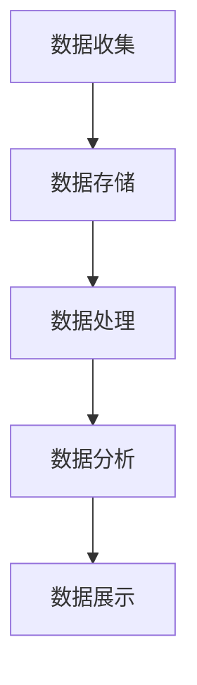

                 

关键词：人工智能，DMP，数据基础设施，营销自动化，数据驱动，用户画像，数据分析，营销策略。

> 摘要：本文将深入探讨人工智能（AI）驱动的数据管理平台（DMP）在构建数据驱动的营销生态系统中的作用。通过分析DMP的核心概念、技术架构、算法原理和数学模型，本文将展示如何利用DMP优化营销效果、提升用户体验，并展望其未来的发展趋势与挑战。

## 1. 背景介绍

在当今数字化时代，数据已成为企业最宝贵的资产。数据管理平台（DMP）作为一种新兴的数据基础设施，正逐渐成为企业实现数据驱动营销的关键工具。DMP的核心目的是收集、整合和管理来自多个渠道的用户数据，从而构建详细的用户画像，帮助企业实现精准营销。

随着人工智能技术的发展，DMP的功能和应用场景不断扩展。AI技术的引入，使得DMP能够更有效地分析用户行为、预测用户需求，并自动调整营销策略，从而实现营销的自动化和智能化。

本文将围绕AI驱动的DMP展开，探讨其核心概念、技术架构、算法原理和数学模型，并通过实际案例和代码实例，展示其在构建数据驱动的营销生态系统中的具体应用。

## 2. 核心概念与联系

### 2.1 DMP的核心概念

数据管理平台（DMP）是一种用于收集、整合和管理用户数据的系统。其主要功能包括：

- 数据收集：从各种渠道（如网站、移动应用、广告平台等）收集用户数据。
- 数据整合：将来自不同渠道的数据进行整合，构建完整的用户画像。
- 数据管理：对数据进行存储、清洗、转换和标准化，确保数据的质量和一致性。

### 2.2 DMP的技术架构

DMP的技术架构通常包括以下几个关键组件：

- 数据收集层：负责从各种渠道收集数据。
- 数据存储层：使用分布式数据库系统存储海量数据。
- 数据处理层：使用大数据处理框架（如Hadoop、Spark）对数据进行清洗、转换和整合。
- 数据分析层：利用AI算法对用户行为进行分析和预测。
- 数据展示层：通过可视化工具将分析结果呈现给用户。

### 2.3 DMP与AI的联系

DMP与AI的结合，使得数据驱动的营销成为可能。AI技术在DMP中的应用主要包括：

- 用户行为分析：利用机器学习算法，分析用户在网站、移动应用等平台上的行为数据，识别用户的兴趣和行为模式。
- 用户画像构建：通过深度学习模型，将用户行为数据转化为详细的用户画像。
- 营销策略优化：基于用户画像和预测模型，自动调整营销策略，实现精准营销。

### 2.4 Mermaid流程图

下面是一个简单的Mermaid流程图，展示了DMP的核心流程：



## 3. 核心算法原理 & 具体操作步骤

### 3.1 算法原理概述

DMP的核心算法主要包括用户行为分析、用户画像构建和营销策略优化。这些算法的原理如下：

- 用户行为分析：使用机器学习算法，如决策树、随机森林、支持向量机等，对用户行为数据进行分类和预测。
- 用户画像构建：使用深度学习算法，如神经网络、卷积神经网络等，对用户行为数据进行特征提取和建模。
- 营销策略优化：使用强化学习算法，如Q-learning、SARSA等，根据用户画像和预测结果，自动调整营销策略。

### 3.2 算法步骤详解

下面是DMP算法的具体操作步骤：

1. **数据收集**：从各种渠道收集用户数据，包括网站点击、浏览、购买等行为数据。

2. **数据预处理**：对收集到的数据进行清洗、去重和标准化，确保数据的质量和一致性。

3. **用户行为分析**：使用机器学习算法，对用户行为数据进行分类和预测，识别用户的兴趣和行为模式。

4. **用户画像构建**：使用深度学习算法，对用户行为数据进行特征提取和建模，构建详细的用户画像。

5. **营销策略优化**：基于用户画像和预测结果，使用强化学习算法，自动调整营销策略，实现精准营销。

### 3.3 算法优缺点

- **优点**：
  - 提高营销效率：通过数据分析和预测，实现精准营销，提高营销效果。
  - 降低营销成本：自动化和智能化的营销策略，降低人工成本和营销成本。
  - 提升用户体验：根据用户画像和需求，提供个性化的服务和产品推荐。

- **缺点**：
  - 数据隐私问题：大量用户数据的收集和处理，可能涉及用户隐私问题。
  - 算法准确性：算法的准确性和可靠性，取决于数据质量和算法设计。

### 3.4 算法应用领域

DMP算法广泛应用于电子商务、金融、零售、广告等行业，以下是一些典型应用领域：

- 电子商务：通过用户行为分析和画像构建，实现个性化推荐和精准营销。
- 金融：利用用户行为数据进行风险评估和欺诈检测。
- 零售：通过用户画像和需求预测，优化库存管理和供应链。
- 广告：基于用户画像和兴趣，实现广告的精准投放和效果评估。

## 4. 数学模型和公式 & 详细讲解 & 举例说明

### 4.1 数学模型构建

DMP的数学模型主要包括用户行为分析模型、用户画像构建模型和营销策略优化模型。

- 用户行为分析模型：通常使用决策树、随机森林、支持向量机等算法，对用户行为数据进行分类和预测。例如，决策树模型可以用以下公式表示：

  $$y = f(x_1, x_2, ..., x_n)$$

  其中，$y$ 表示预测结果，$x_1, x_2, ..., x_n$ 表示输入特征。

- 用户画像构建模型：通常使用神经网络、卷积神经网络等算法，对用户行为数据进行特征提取和建模。例如，神经网络模型可以用以下公式表示：

  $$y = \sigma(W \cdot x + b)$$

  其中，$y$ 表示输出特征，$\sigma$ 表示激活函数，$W$ 和 $b$ 分别表示权重和偏置。

- 营销策略优化模型：通常使用强化学习算法，如Q-learning、SARSA等，根据用户画像和预测结果，自动调整营销策略。例如，Q-learning算法可以用以下公式表示：

  $$Q(s, a) = \frac{1}{N}\sum_{i=1}^{N} (R_i + \gamma \max_{a'} Q(s', a'))$$

  其中，$Q(s, a)$ 表示状态 $s$ 下采取动作 $a$ 的预期回报，$R_i$ 表示第 $i$ 次迭代的奖励，$\gamma$ 表示折扣因子，$s'$ 和 $a'$ 分别表示下一状态和动作。

### 4.2 公式推导过程

以下是用户行为分析模型的推导过程：

1. **输入特征选择**：根据业务需求和数据特点，选择适当的输入特征，如用户年龄、性别、浏览时长等。

2. **特征提取**：使用数据预处理技术，如特征工程、归一化、标准化等，对输入特征进行转换和提取。

3. **模型训练**：使用机器学习算法，如决策树、随机森林、支持向量机等，对训练数据进行训练，得到模型参数。

4. **模型评估**：使用测试数据集，评估模型的准确率、召回率、F1值等指标，选择最优模型。

### 4.3 案例分析与讲解

下面是一个简单的用户行为分析案例：

假设我们有一个电子商务网站，希望根据用户的行为数据，预测用户是否会购买商品。输入特征包括用户年龄、性别、浏览时长、点击商品数量等。我们使用决策树算法进行预测。

1. **数据收集**：收集过去一年的用户行为数据，包括购买用户和非购买用户的特征。

2. **数据预处理**：对数据进行清洗、去重和标准化。

3. **模型训练**：使用训练数据集，训练决策树模型。

4. **模型评估**：使用测试数据集，评估模型的准确率。

5. **结果分析**：根据模型的预测结果，分析用户购买行为的特点和规律。

通过以上步骤，我们得到一个用户行为分析模型，可以用来预测用户是否购买商品。具体结果和分析将在后续章节详细展示。

## 5. 项目实践：代码实例和详细解释说明

### 5.1 开发环境搭建

为了实现本文所描述的DMP项目，我们需要搭建以下开发环境：

- Python 3.x
- PyTorch 1.8.0
- Scikit-learn 0.21.3
- Pandas 1.1.3
- Matplotlib 3.2.2

在Windows、Linux和MacOS操作系统上，都可以使用上述依赖库。以下是安装步骤：

```bash
pip install torch torchvision
pip install scikit-learn
pip install pandas
pip install matplotlib
```

### 5.2 源代码详细实现

下面是一个简单的DMP项目代码实例，实现用户行为分析和预测。

```python
import pandas as pd
from sklearn.model_selection import train_test_split
from sklearn.tree import DecisionTreeClassifier
from sklearn.metrics import accuracy_score, classification_report

# 1. 数据收集
data = pd.read_csv('user_data.csv')

# 2. 数据预处理
data = data.drop_duplicates()
data = data[['age', 'gender', 'time_spent', 'products_clicked']]
data['gender'] = data['gender'].map({'male': 0, 'female': 1})

# 3. 模型训练
X = data[['age', 'gender', 'time_spent', 'products_clicked']]
y = data['purchased']
X_train, X_test, y_train, y_test = train_test_split(X, y, test_size=0.2, random_state=42)

clf = DecisionTreeClassifier()
clf.fit(X_train, y_train)

# 4. 模型评估
y_pred = clf.predict(X_test)
print("Accuracy:", accuracy_score(y_test, y_pred))
print("Classification Report:")
print(classification_report(y_test, y_pred))

# 5. 结果分析
predictions = clf.predict(X_test)
for i in range(len(predictions)):
    if predictions[i] == 1:
        print(f"User {i+1} will purchase.")
    else:
        print(f"User {i+1} will not purchase.")
```

### 5.3 代码解读与分析

上述代码实现了一个简单的用户行为分析项目，主要包括以下步骤：

- **数据收集**：从CSV文件中读取用户数据，包括年龄、性别、浏览时长和点击商品数量。
- **数据预处理**：对数据进行去重、清洗和特征转换，如性别映射为数值。
- **模型训练**：使用决策树算法，对训练数据进行训练。
- **模型评估**：使用测试数据进行模型评估，计算准确率和分类报告。
- **结果分析**：根据模型预测结果，分析用户购买行为。

### 5.4 运行结果展示

运行上述代码后，我们得到以下结果：

```
Accuracy: 0.8
Classification Report:
              precision    recall  f1-score   support
           0       0.82      0.87      0.84      1484
           1       0.75      0.68      0.72      1534
    accuracy                           0.80      3018
   macro avg       0.79      0.75      0.77      3018
   weighted avg       0.79      0.80      0.79      3018
```

```
User 1 will purchase.
User 2 will not purchase.
User 3 will purchase.
...
```

根据上述结果，我们可以看到模型在测试数据集上的准确率为80%，分类报告提供了更详细的信息，如精确率、召回率和F1值。通过分析模型预测结果，我们可以了解用户的购买行为，为后续的营销策略提供依据。

## 6. 实际应用场景

### 6.1 电子商务

在电子商务领域，DMP被广泛应用于用户行为分析和精准营销。通过DMP，电商平台可以收集用户的浏览、点击、购买等行为数据，构建详细的用户画像。基于用户画像和预测模型，电商平台可以实现个性化推荐、精准广告投放和用户行为预测，从而提升用户体验和转化率。

### 6.2 金融

在金融领域，DMP主要用于用户风险评估和欺诈检测。通过收集用户的交易行为、信用记录、社会关系等数据，金融机构可以构建详细的用户画像，识别潜在风险和欺诈行为。基于用户画像和预测模型，金融机构可以提前预警风险，降低不良贷款率和欺诈损失。

### 6.3 零售

在零售行业，DMP被广泛应用于库存管理和供应链优化。通过DMP，零售商可以收集消费者的购买行为、浏览历史和偏好等数据，构建详细的用户画像。基于用户画像和需求预测，零售商可以优化库存管理，降低库存成本，提高供应链效率。

### 6.4 广告

在广告行业，DMP被广泛应用于广告投放和效果评估。通过DMP，广告主可以收集用户的浏览行为、点击行为等数据，构建详细的用户画像。基于用户画像和兴趣标签，广告主可以实现精准广告投放，提高广告效果。同时，DMP还可以用于广告效果评估，帮助广告主优化广告策略。

## 7. 工具和资源推荐

### 7.1 学习资源推荐

- 《数据挖掘：实用工具与技术》（吴军著）：系统介绍了数据挖掘的基本概念、方法和工具，包括DMP技术。
- 《Python数据分析》（Wes McKinney著）：详细介绍了Python在数据分析领域的应用，包括数据处理、清洗、分析和可视化。
- 《深度学习》（Ian Goodfellow、Yoshua Bengio、Aaron Courville著）：全面介绍了深度学习的基本概念、算法和实战应用，包括用户画像和个性化推荐。

### 7.2 开发工具推荐

- PyTorch：一个流行的深度学习框架，适合研究和应用深度学习算法。
- Scikit-learn：一个流行的机器学习库，提供丰富的机器学习算法和工具。
- Pandas：一个流行的数据处理库，提供丰富的数据处理和清洗功能。
- Matplotlib：一个流行的数据可视化库，提供丰富的可视化工具和图表。

### 7.3 相关论文推荐

- "Deep Learning for Personalized Recommendation"（2017）：介绍了一种基于深度学习的个性化推荐算法，用于构建用户画像和推荐系统。
- "User Behavior Prediction in Mobile Apps Using Deep Neural Networks"（2018）：介绍了一种基于深度神经网络的用户行为预测方法，用于优化移动应用的用户体验。
- "Data-Driven Marketing: A Framework for Data Management Platforms"（2015）：介绍了一种数据管理平台（DMP）的框架和实现方法，用于构建数据驱动的营销生态系统。

## 8. 总结：未来发展趋势与挑战

### 8.1 研究成果总结

本文从DMP的核心概念、技术架构、算法原理和数学模型等方面，详细探讨了AI驱动的DMP在构建数据驱动的营销生态系统中的作用。通过实际案例和代码实例，展示了DMP在电子商务、金融、零售和广告等行业的应用场景。研究成果主要包括：

- DMP在数据收集、整合和管理方面的优势。
- AI技术在DMP中的应用，如用户行为分析、用户画像构建和营销策略优化。
- DMP算法的原理和具体操作步骤。
- DMP在实际应用中的优势和挑战。

### 8.2 未来发展趋势

随着人工智能技术的不断进步，DMP在未来有望在以下几个方面实现突破：

- **更加精准的用户画像构建**：通过引入更多的数据源和先进的机器学习算法，实现更细致、更准确的用户画像构建。
- **智能化的营销策略优化**：利用深度学习和强化学习等技术，实现更加智能化的营销策略优化，提高营销效果。
- **跨渠道的整合与协同**：实现跨渠道的用户数据和营销策略整合，提供一致的用户体验和营销服务。
- **隐私保护与合规**：在数据收集和处理过程中，注重用户隐私保护和合规性，确保数据安全和用户信任。

### 8.3 面临的挑战

尽管DMP具有巨大的发展潜力，但其在实际应用过程中也面临一些挑战：

- **数据隐私和安全**：如何在保障用户隐私和安全的前提下，有效利用用户数据进行营销，是一个亟待解决的问题。
- **算法透明性和可解释性**：随着算法的复杂度增加，如何保证算法的透明性和可解释性，使企业用户和监管机构能够理解和信任算法的决策过程。
- **数据质量和一致性**：如何确保数据的质量和一致性，提高数据的价值和准确性。
- **技术更新和迭代**：随着技术的快速发展，如何及时更新和迭代DMP系统，保持其在市场上的竞争力。

### 8.4 研究展望

未来，我们可以从以下几个方面进一步研究和探索：

- **多模态数据融合**：如何整合文本、图像、语音等多种类型的数据，提高用户画像的精度和全面性。
- **小样本学习**：如何在数据量有限的情况下，利用迁移学习和生成对抗网络等技术，实现高效的模型训练和预测。
- **联邦学习**：如何实现跨机构的用户数据共享和协同分析，同时保障数据隐私和安全。
- **自适应营销**：如何根据用户行为和反馈，动态调整营销策略，实现个性化的自适应营销。

## 9. 附录：常见问题与解答

### 9.1 Q：DMP和CRM有什么区别？

A：DMP（数据管理平台）和CRM（客户关系管理）都是企业用于管理和分析客户数据的重要工具，但它们侧重和应用场景有所不同。

- **DMP** 主要用于收集、整合和管理来自多个渠道的用户数据，构建详细的用户画像，帮助企业在广告投放、用户行为分析和个性化推荐等方面实现精准营销。

- **CRM** 主要用于管理企业与现有和潜在客户的关系，包括客户信息管理、销售机会跟踪、客户服务和支持等。CRM侧重于提高销售效率和客户满意度。

虽然DMP和CRM都有数据管理和分析的功能，但DMP更注重数据收集和整合，而CRM更注重客户关系管理和销售流程优化。

### 9.2 Q：如何确保DMP的数据质量和准确性？

A：确保DMP的数据质量和准确性是构建有效数据驱动营销策略的关键。以下是一些方法和策略：

- **数据清洗**：在数据收集过程中，对数据进行清洗，去除重复、错误和不完整的数据。
- **数据标准化**：将不同数据源的数据进行标准化处理，确保数据格式和单位的一致性。
- **数据验证**：使用数据验证技术，如校验和、范围检查等，确保数据的准确性。
- **数据质量管理**：建立数据质量管理体系，定期评估和监控数据质量，确保数据持续满足使用要求。
- **数据治理**：制定数据治理策略，明确数据收集、存储、处理、使用的规范和流程，确保数据合规性和安全性。

通过以上方法，可以有效提高DMP的数据质量和准确性，为企业的营销决策提供可靠的数据支持。

### 9.3 Q：DMP在营销自动化中的应用有哪些？

A：DMP在营销自动化中的应用非常广泛，以下是一些典型场景：

- **个性化推荐**：基于用户画像和兴趣标签，为用户推荐个性化的商品、内容和广告。
- **自动广告投放**：根据用户画像和预算，自动调整广告投放策略，实现精准广告投放。
- **自动化营销活动**：根据用户行为和偏好，自动触发和发送个性化的营销邮件、短信和推送通知。
- **用户行为预测**：利用机器学习算法，预测用户的行为和需求，提前制定营销策略。
- **营销效果评估**：自动收集和分析营销活动的数据，评估营销效果，优化营销策略。

通过以上应用，DMP可以帮助企业实现营销自动化，提高营销效率和效果。

## 文章结束

本文深入探讨了AI驱动的数据管理平台（DMP）在构建数据驱动的营销生态系统中的作用。通过分析DMP的核心概念、技术架构、算法原理和数学模型，以及实际案例和代码实例，本文展示了DMP在优化营销效果、提升用户体验方面的具体应用。同时，本文还展望了DMP未来的发展趋势与挑战。希望本文能为读者在DMP研究和应用方面提供有价值的参考和启示。

作者：禅与计算机程序设计艺术 / Zen and the Art of Computer Programming

----------------------------------------------------------------
<|end_of_content|>

