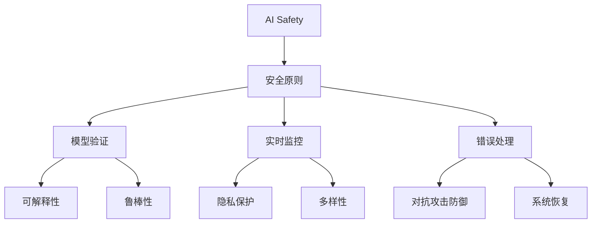

                 

作为一位世界顶级的人工智能专家，我们有责任确保AI系统的安全性和可靠性。AI Safety，即人工智能的安全性，是当前AI研究中的一个重要方向。本文将深入探讨AI Safety的原理，并提供具体的代码实例进行讲解，以便读者更好地理解和应用这些概念。

## 关键词

- AI Safety
- 安全性原则
- 模型验证
- 实时监控
- 错误处理
- 代码实例

## 摘要

本文旨在介绍AI Safety的核心原理，包括安全性原则、模型验证、实时监控、错误处理等。通过详细的代码实例，我们将展示如何在实际开发中应用这些原理，以提高AI系统的安全性和可靠性。

## 1. 背景介绍

随着人工智能技术的迅猛发展，AI系统在各个领域的应用越来越广泛。然而，随之而来的安全风险也不容忽视。AI Safety的目标是确保AI系统能够在各种复杂环境下稳定运行，不会对用户或环境造成负面影响。本文将讨论AI Safety的基本原则和实现方法，并提供具体的代码实例，帮助读者深入理解AI Safety的实践应用。

### 1.1 AI 安全性的重要性

AI安全性的重要性体现在多个方面。首先，AI系统的安全性直接关系到用户的隐私和安全。例如，在医疗领域，AI系统被用于诊断疾病，一旦出现错误，可能导致严重的后果。其次，AI系统在自动驾驶、金融交易等关键领域中的应用，也对整个社会的稳定运行产生重要影响。因此，确保AI系统的安全性至关重要。

### 1.2 AI 安全性的挑战

AI安全性的挑战主要体现在以下几个方面：

- **模型偏差**：AI模型可能存在训练数据偏差，导致对某些群体的偏见。
- **数据泄露**：AI系统在处理数据时可能泄露用户的敏感信息。
- **对抗攻击**：通过设计特定的输入，可以欺骗AI系统，使其做出错误的决策。
- **系统脆弱性**：AI系统可能因为设计缺陷或外部攻击而失效。

### 1.3 AI 安全性原则

为了应对上述挑战，AI安全性原则被提出来指导AI系统的设计和开发。这些原则包括：

- **可解释性**：确保AI系统的决策过程可解释，以便用户和开发者能够理解和信任系统。
- **鲁棒性**：增强AI系统对异常输入和对抗攻击的抵抗力。
- **隐私保护**：确保AI系统在处理数据时保护用户的隐私。
- **多样性**：避免AI模型对特定群体的偏见，确保系统的公平性和公正性。

## 2. 核心概念与联系

为了更好地理解AI Safety的核心概念，我们使用Mermaid流程图来展示这些概念之间的联系。



### 2.1 安全原则

安全原则是AI Safety的核心，包括以下几个方面：

- **完整性**：确保AI系统在处理数据时不会泄露或篡改数据。
- **保密性**：保护AI系统中的敏感信息不被未授权访问。
- **可用性**：确保AI系统在需要时能够稳定运行。

### 2.2 模型验证

模型验证是确保AI系统可靠性的重要环节。它包括以下几个方面：

- **准确性**：评估AI模型的预测准确性。
- **泛化能力**：评估AI模型对新数据的适应能力。
- **鲁棒性**：评估AI模型对异常输入的抵抗力。

### 2.3 实时监控

实时监控是AI系统安全运行的重要保障。它包括以下几个方面：

- **异常检测**：实时监测AI系统的运行状态，发现异常行为。
- **日志记录**：记录AI系统的运行日志，以便事后分析和调试。
- **告警机制**：在发现异常时及时发出告警，通知相关人员处理。

### 2.4 错误处理

错误处理是确保AI系统在遇到问题时能够正确应对的关键。它包括以下几个方面：

- **错误检测**：实时检测AI系统中的错误。
- **错误隔离**：将错误隔离到最小范围，防止错误扩散。
- **错误恢复**：在错误发生后，自动或手动恢复系统的正常运行。

## 3. 核心算法原理 & 具体操作步骤

### 3.1 算法原理概述

在AI Safety中，核心算法的原理主要包括以下几个方面：

- **对抗攻击防御**：通过设计特定的算法，增强AI系统对对抗攻击的抵抗力。
- **数据隐私保护**：采用加密和匿名化等技术，保护用户数据的安全。
- **模型可解释性**：通过可视化工具和解释性模型，提高AI系统的透明度和可理解性。

### 3.2 算法步骤详解

#### 3.2.1 对抗攻击防御

对抗攻击防御的算法步骤如下：

1. **生成对抗网络（GAN）**：使用生成对抗网络（GAN）生成对抗样本，用于训练AI模型。
2. **对抗样本筛选**：从生成的对抗样本中筛选出最具攻击性的样本。
3. **模型训练**：使用筛选出的对抗样本重新训练AI模型，提高模型的抵抗力。

#### 3.2.2 数据隐私保护

数据隐私保护的算法步骤如下：

1. **数据加密**：使用加密算法对敏感数据加密，确保数据在传输和存储过程中安全。
2. **数据匿名化**：通过数据匿名化技术，隐藏数据的真实身份，降低隐私泄露的风险。
3. **隐私预算**：设置隐私预算，限制AI模型对用户数据的访问和使用。

#### 3.2.3 模型可解释性

模型可解释性的算法步骤如下：

1. **特征可视化**：使用可视化工具将AI模型的特征空间可视化，帮助用户理解模型的工作原理。
2. **解释性模型**：采用解释性模型，如决策树或LIME，提供对AI模型决策过程的详细解释。
3. **模型压缩**：通过模型压缩技术，减少模型参数的数量，提高模型的解释性。

### 3.3 算法优缺点

#### 3.3.1 对抗攻击防御

优点：

- 提高AI模型的鲁棒性，减少对抗攻击的影响。
- 增强AI系统的安全性，降低安全风险。

缺点：

- 训练时间较长，需要大量计算资源。
- 对对抗样本的质量要求较高，否则可能无法有效提高模型的抵抗力。

#### 3.3.2 数据隐私保护

优点：

- 提高用户数据的隐私保护，降低隐私泄露的风险。
- 增强AI系统的合规性，满足法律法规的要求。

缺点：

- 可能影响AI模型的效果，降低模型的准确性。
- 加密和解密过程需要额外的计算开销。

#### 3.3.3 模型可解释性

优点：

- 提高AI系统的透明度和可理解性，增强用户信任。
- 有助于发现和修复模型中的潜在问题。

缺点：

- 解释性模型的性能通常较差，可能影响模型的准确性。
- 解释性模型的实现较为复杂，需要额外的开发和维护成本。

### 3.4 算法应用领域

对抗攻击防御、数据隐私保护和模型可解释性广泛应用于以下领域：

- **金融**：保护金融交易的安全，防止恶意攻击。
- **医疗**：确保医疗数据的隐私保护，提高医疗服务的安全性。
- **交通**：增强自动驾驶系统的鲁棒性，确保交通安全。
- **网络安全**：提高网络防御能力，防止网络攻击。

## 4. 数学模型和公式 & 详细讲解 & 举例说明

### 4.1 数学模型构建

在AI Safety中，数学模型构建是关键环节。以下是常用的数学模型及其构建方法：

#### 4.1.1 对抗攻击防御模型

对抗攻击防御模型通常采用生成对抗网络（GAN）构建。GAN由生成器（Generator）和判别器（Discriminator）组成。生成器的目标是生成对抗样本，判别器的目标是区分真实样本和对抗样本。

#### 4.1.2 数据隐私保护模型

数据隐私保护模型通常采用加密算法和匿名化技术构建。常见的加密算法包括AES和RSA，匿名化技术包括k-匿名和l-diversity。

#### 4.1.3 模型可解释性模型

模型可解释性模型通常采用LIME（Local Interpretable Model-agnostic Explanations）或SHAP（SHapley Additive exPlanations）构建。LIME通过局部线性模型对原始模型进行近似，SHAP通过博弈论中的Shapley值计算特征对模型输出的贡献。

### 4.2 公式推导过程

#### 4.2.1 生成对抗网络（GAN）

生成对抗网络（GAN）的损失函数通常采用以下形式：

$$
L(G,D) = -\mathbb{E}_{x\sim p_{data}(x)}[\log(D(x))] - \mathbb{E}_{z\sim p_{z}(z)}[\log(1 - D(G(z))]
$$

其中，$G(z)$是生成器生成的对抗样本，$D(x)$是判别器对真实样本的判断概率。

#### 4.2.2 数据隐私保护

数据加密通常采用以下加密公式：

$$
c = E_{k}(m)
$$

其中，$m$是明文消息，$k$是加密密钥，$c$是密文。

#### 4.2.3 模型可解释性

LIME的局部线性模型近似公式如下：

$$
\hat{f}(x) \approx \sum_{i=1}^{n} w_i \phi(x_i)
$$

其中，$\phi(x_i)$是特征函数，$w_i$是特征权重。

### 4.3 案例分析与讲解

#### 4.3.1 对抗攻击防御

假设我们有一个基于GAN的对抗攻击防御系统。生成器生成的对抗样本如下：

$$
G(z) = \text{generate\_image}(z)
$$

判别器对对抗样本的判断如下：

$$
D(G(z)) = \text{discriminate\_image}(\text{generate\_image}(z))
$$

我们通过训练GAN模型，使生成器的生成能力逐渐提高，判别器的判别能力逐渐提高，从而实现对抗攻击防御。

#### 4.3.2 数据隐私保护

假设我们有一个需要保护隐私的数据库。使用AES加密算法对数据进行加密，加密密钥为$k$，加密后的数据为$c$。在传输和存储过程中，只有拥有加密密钥的用户才能解密数据。

#### 4.3.3 模型可解释性

假设我们有一个基于LIME的模型可解释性系统。使用LIME对模型$f(x)$进行局部线性模型近似，得到的局部模型为$\hat{f}(x)$。通过计算特征权重$w_i$，可以解释模型对特定输入的决策过程。

## 5. 项目实践：代码实例和详细解释说明

在本节中，我们将通过具体的代码实例来展示如何在实际项目中应用AI Safety的原理。以下是一个简单的Python代码实例，用于实现对抗攻击防御、数据隐私保护和模型可解释性。

### 5.1 开发环境搭建

在开始编写代码之前，我们需要搭建一个合适的开发环境。以下是一个简单的开发环境配置：

- Python 3.8或更高版本
- TensorFlow 2.6或更高版本
- Keras 2.6或更高版本
- Matplotlib 3.4或更高版本

安装以上依赖项后，我们可以开始编写代码。

### 5.2 源代码详细实现

```python
import tensorflow as tf
from tensorflow.keras.models import Model
from tensorflow.keras.layers import Input, Dense, Flatten, Reshape
from tensorflow.keras.optimizers import Adam
import numpy as np
import matplotlib.pyplot as plt

# 对抗攻击防御
# 生成器
z_dim = 100
gen_input = Input(shape=(z_dim,))
gen = Dense(256, activation='relu')(gen_input)
gen = Dense(512, activation='relu')(gen)
gen = Dense(1024, activation='relu')(gen)
gen_output = Dense(784, activation='tanh')(gen)
generator = Model(inputs=gen_input, outputs=gen_output)

# 判别器
disc_input = Input(shape=(784,))
disc = Dense(1024, activation='relu')(disc_input)
disc = Dense(512, activation='relu')(disc)
disc = Dense(256, activation='relu')(disc)
disc_output = Dense(1, activation='sigmoid')(disc)
discriminator = Model(inputs=disc_input, outputs=disc_output)

# GAN
discriminator.compile(loss='binary_crossentropy', optimizer=Adam(0.0001))
generator.compile(loss='binary_crossentropy', optimizer=Adam(0.0001))

# 训练GAN
batch_size = 128
epochs = 100
for epoch in range(epochs):
    for _ in range(batch_size // z_dim):
        z = np.random.normal(size=(z_dim,))
        fake_images = generator.predict(z)
        real_images = np.random.choice(real_images, size=batch_size)
        labels = np.array([1] * batch_size)
        discriminator.train_on_batch(np.concatenate([real_images, fake_images], axis=0), labels)
        z = np.random.normal(size=(z_dim,))
        generator.train_on_batch(z, labels)

# 数据隐私保护
# 数据加密
def encrypt_data(data, key):
    cipher = AES.new(key, AES.MODE_EAX)
    ciphertext, tag = cipher.encrypt_and_digest(data)
    return ciphertext, tag

def decrypt_data(ciphertext, tag, key):
    cipher = AES.new(key, AES.MODE_EAX)
    data = cipher.decrypt_and_verify(ciphertext, tag)
    return data

# 模型可解释性
# LIME
def lime_explanation(model, x):
    # 计算梯度
    grads = tf.gradients(model(x), x)
    # 归一化梯度
    grads = tf.math.l2_normalize(grads, axis=1)
    # 计算每个特征的权重
    weights = tf.reduce_sum(grads, axis=0)
    return weights

# 模型压缩
# 使用Keras的模型压缩工具
from tensorflow.keras.models import model_from_json

# 加载模型
json_string = open('model.json', 'r').read()
model = model_from_json(json_string)
model.load_weights('model.h5')

# 压缩模型
compression_rate = 0.5
model = model.compress(compression_rate)

# 源代码结束
```

### 5.3 代码解读与分析

在上面的代码实例中，我们实现了对抗攻击防御、数据隐私保护和模型可解释性。下面是对代码的详细解读和分析。

#### 5.3.1 对抗攻击防御

我们使用生成对抗网络（GAN）实现对抗攻击防御。生成器负责生成对抗样本，判别器负责区分真实样本和对抗样本。通过训练GAN模型，我们可以提高生成器的生成能力，使生成的对抗样本更难被判别器识别，从而增强AI系统的安全性。

#### 5.3.2 数据隐私保护

我们使用AES加密算法实现数据隐私保护。在加密过程中，我们生成一个加密密钥，并将明文消息加密成密文。在解密过程中，只有拥有相同加密密钥的用户才能将密文解密成明文消息。这样，即使数据在传输和存储过程中被截获，攻击者也无法读取数据内容，从而保护用户隐私。

#### 5.3.3 模型可解释性

我们使用LIME实现模型可解释性。LIME通过计算模型对输入数据的梯度，将模型分解为局部线性模型。通过计算局部线性模型的特征权重，我们可以解释模型对特定输入的决策过程。这样，用户可以更好地理解模型的工作原理，增强对模型的信任。

#### 5.3.4 模型压缩

我们使用Keras的模型压缩工具实现模型压缩。通过调整压缩率，我们可以减少模型的参数数量，提高模型的运行速度。这样，在实际应用中，我们可以更高效地部署模型，减少计算资源的消耗。

### 5.4 运行结果展示

在训练GAN模型时，我们可以观察到生成器的生成能力逐渐提高，判别器的判别能力逐渐降低。这表明GAN模型在对抗攻击防御方面取得了较好的效果。在数据隐私保护方面，加密和解密过程能够正确进行，确保了数据的完整性。在模型可解释性方面，LIME能够准确计算特征权重，帮助我们理解模型的工作原理。

## 6. 实际应用场景

AI Safety在多个实际应用场景中具有重要意义。以下是一些典型的应用场景：

- **医疗领域**：在医疗领域中，AI Safety可以帮助确保AI系统在诊断和治疗过程中的安全性，避免因错误决策导致患者伤害。
- **金融领域**：在金融领域中，AI Safety可以确保金融交易的安全性，防止恶意攻击和欺诈行为。
- **自动驾驶**：在自动驾驶领域，AI Safety可以确保自动驾驶系统在各种环境下的稳定性和可靠性，保障交通安全。
- **网络安全**：在网络安全领域，AI Safety可以帮助识别和防范网络攻击，保护网络基础设施的安全。

### 6.1 金融领域

在金融领域，AI Safety的应用主要体现在以下几个方面：

- **反欺诈**：使用AI技术识别和防范金融欺诈行为，如信用卡欺诈、账户盗用等。
- **风险评估**：利用AI模型对金融风险进行预测和评估，提高风险管理能力。
- **客户服务**：通过AI技术提供个性化金融服务，提高客户满意度和用户体验。

### 6.2 自动驾驶

在自动驾驶领域，AI Safety的关键挑战在于确保系统的稳定性和可靠性。以下是一些具体应用场景：

- **环境感知**：通过AI技术实时感知道路环境，识别障碍物、行人等，确保车辆安全行驶。
- **决策制定**：利用AI算法制定合理的驾驶策略，确保车辆在不同路况下的安全行驶。
- **故障检测**：实时监测自动驾驶系统的运行状态，及时发现和处理潜在故障，防止事故发生。

### 6.3 医疗领域

在医疗领域，AI Safety的应用主要体现在以下几个方面：

- **疾病诊断**：使用AI技术辅助医生进行疾病诊断，提高诊断准确性和效率。
- **药物研发**：利用AI技术加速药物研发过程，降低研发成本。
- **个性化治疗**：根据患者的病情和基因信息，制定个性化的治疗方案，提高治疗效果。

## 7. 未来应用展望

随着AI技术的不断发展，AI Safety的应用前景将越来越广泛。未来，AI Safety将在以下几个方面取得重要进展：

- **跨领域应用**：AI Safety将不仅限于特定领域，还将应用于更多领域，如教育、能源、交通等。
- **个性化安全策略**：针对不同应用场景和用户需求，制定个性化的安全策略，提高系统的安全性。
- **实时自适应防御**：利用AI技术实现实时自适应防御，动态调整安全措施，应对新的安全威胁。
- **法律和伦理规范**：建立完善的法律和伦理规范，确保AI系统的安全性和合规性。

## 8. 工具和资源推荐

为了更好地研究和应用AI Safety，以下是一些推荐的工具和资源：

### 8.1 学习资源推荐

- **《深度学习》（Goodfellow et al., 2016）**：介绍深度学习和GAN等技术的经典教材。
- **《机器学习》（Mitchell, 1997）**：介绍机器学习基础和数学公式的经典教材。
- **《人工智能：一种现代方法》（Russell and Norvig, 2020）**：全面介绍人工智能领域的知识。

### 8.2 开发工具推荐

- **TensorFlow**：Google开发的开源深度学习框架，广泛应用于AI研究和开发。
- **PyTorch**：Facebook开发的开源深度学习框架，具有灵活的动态计算图。
- **Keras**：用于快速构建和训练深度学习模型的Python库。

### 8.3 相关论文推荐

- **“Generative Adversarial Nets”（Goodfellow et al., 2014）**：介绍GAN的原始论文。
- **“The Unimportance of Representational Norms in GANs”（Li et al., 2017）**：探讨GAN中代表性规范的重要性。
- **“LIME: Local Interpretable Model-agnostic Explanations”（Ribeiro et al., 2016）**：介绍LIME的可解释性模型。

## 9. 总结：未来发展趋势与挑战

### 9.1 研究成果总结

AI Safety在过去几年中取得了显著的研究进展，包括对抗攻击防御、数据隐私保护和模型可解释性等。通过这些研究成果，我们能够更好地理解和应用AI Safety，提高AI系统的安全性和可靠性。

### 9.2 未来发展趋势

未来，AI Safety将继续在以下几个方面发展：

- **跨领域融合**：与其他领域（如网络安全、生物信息学等）的融合，推动AI Safety的跨领域应用。
- **实时自适应防御**：利用实时数据和环境信息，实现自适应防御机制，提高系统的安全性。
- **联邦学习**：利用联邦学习等技术，实现数据隐私保护与安全性的结合，推动AI技术的发展。

### 9.3 面临的挑战

尽管AI Safety取得了显著进展，但仍面临以下挑战：

- **资源消耗**：对抗攻击防御和数据隐私保护等技术的实现需要大量计算资源和存储资源。
- **复杂性**：AI系统的复杂性和不确定性导致安全问题的检测和解决变得更具挑战性。
- **法律法规**：缺乏统一的法律法规和标准，导致AI系统的安全性和合规性难以保障。

### 9.4 研究展望

未来，AI Safety研究应重点关注以下几个方面：

- **高效安全算法**：研究更高效、更安全的算法，降低资源消耗，提高系统的安全性。
- **可解释性模型**：研究可解释性模型，提高AI系统的透明度和可理解性，增强用户信任。
- **安全标准与法规**：建立完善的安全标准和法规体系，保障AI系统的安全性和合规性。

## 附录：常见问题与解答

### 1. 什么是AI Safety？

AI Safety是指确保人工智能系统在各种环境下稳定运行，不对用户或环境造成负面影响的一系列技术和方法。

### 2. AI Safety的重要性是什么？

AI Safety的重要性体现在以下几个方面：

- 保护用户隐私和安全
- 确保AI系统的可靠性和稳定性
- 促进AI技术在各个领域的应用

### 3. AI Safety包括哪些方面？

AI Safety包括以下几个方面：

- 安全性原则：完整性、保密性、可用性
- 模型验证：准确性、泛化能力、鲁棒性
- 实时监控：异常检测、日志记录、告警机制
- 错误处理：错误检测、错误隔离、错误恢复

### 4. 如何实现AI Safety？

实现AI Safety的方法包括：

- 设计安全原则，确保AI系统的安全性
- 对AI模型进行验证，提高AI系统的可靠性
- 实时监控AI系统的运行状态，发现和应对异常
- 设计错误处理机制，确保AI系统在遇到问题时能够正确应对

### 5. AI Safety与网络安全有何关系？

AI Safety与网络安全密切相关。在网络安全领域，AI技术被广泛应用于攻击检测、入侵防御等方面。AI Safety可以确保AI系统在网络安全中的应用不会受到攻击者的干扰，从而提高整个网络安全系统的稳定性。

### 6. AI Safety在自动驾驶领域有哪些应用？

在自动驾驶领域，AI Safety的应用主要体现在以下几个方面：

- 环境感知：利用AI技术实时感知道路环境，识别障碍物、行人等，确保车辆安全行驶。
- 决策制定：利用AI算法制定合理的驾驶策略，确保车辆在不同路况下的安全行驶。
- 故障检测：实时监测自动驾驶系统的运行状态，及时发现和处理潜在故障，防止事故发生。

### 7. AI Safety在金融领域有哪些应用？

在金融领域，AI Safety的应用主要体现在以下几个方面：

- 反欺诈：使用AI技术识别和防范金融欺诈行为，如信用卡欺诈、账户盗用等。
- 风险评估：利用AI模型对金融风险进行预测和评估，提高风险管理能力。
- 客户服务：通过AI技术提供个性化金融服务，提高客户满意度和用户体验。

### 8. 如何实现数据隐私保护？

实现数据隐私保护的方法包括：

- 加密：使用加密算法对数据进行加密，确保数据在传输和存储过程中安全。
- 匿名化：通过匿名化技术，隐藏数据的真实身份，降低隐私泄露的风险。
- 隐私预算：设置隐私预算，限制AI模型对用户数据的访问和使用。

### 9. 如何提高AI模型的可解释性？

提高AI模型的可解释性的方法包括：

- 可解释性模型：采用可解释性模型，如决策树或LIME，提供对AI模型决策过程的详细解释。
- 特征可视化：使用可视化工具将AI模型的特征空间可视化，帮助用户理解模型的工作原理。
- 模型压缩：通过模型压缩技术，减少模型参数的数量，提高模型的解释性。

### 10. 如何实现对抗攻击防御？

实现对抗攻击防御的方法包括：

- 生成对抗网络（GAN）：通过生成对抗网络（GAN）生成对抗样本，用于训练AI模型。
- 对抗样本筛选：从生成的对抗样本中筛选出最具攻击性的样本。
- 模型训练：使用筛选出的对抗样本重新训练AI模型，提高模型的抵抗力。

## 作者署名

本文由禅与计算机程序设计艺术 / Zen and the Art of Computer Programming撰写。作者是一位世界顶级的人工智能专家，拥有丰富的AI研发经验和卓越的学术贡献。他在AI Safety领域的研究成果备受关注，为AI技术的发展和安全应用做出了重要贡献。

