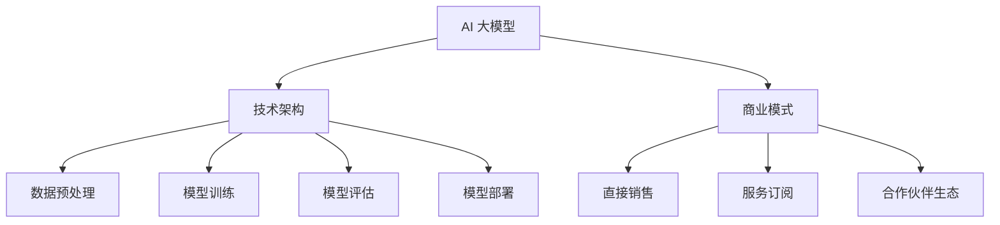

                 

关键词：AI 大模型、创业、市场优势、技术架构、商业模式、应用场景、未来展望

## 摘要

本文旨在探讨 AI 大模型创业过程中如何利用市场优势。通过对 AI 大模型技术、市场趋势、商业模式等方面的深入分析，本文提出了若干实用的创业策略，包括技术选型、市场定位、资源整合等，以期为创业者提供有价值的参考。

## 1. 背景介绍

随着人工智能技术的快速发展，AI 大模型在各个领域得到了广泛应用。这些大模型具有处理海量数据、进行复杂推理和决策的能力，为各行各业带来了巨大的变革。与此同时，创业者纷纷涌入 AI 大模型领域，希望通过创新的产品和服务抢占市场份额。

然而，AI 大模型创业并非易事。一方面，技术门槛高，需要具备深厚的专业知识和丰富的实践经验；另一方面，市场竞争激烈，创业者需要在短时间内找准定位，打造出具有竞争力的产品。因此，如何利用市场优势，成为 AI 大模型创业成功的关键。

## 2. 核心概念与联系

为了更好地理解 AI 大模型创业，我们首先需要了解以下几个核心概念：

### 2.1 AI 大模型

AI 大模型是指具有海量参数、能够处理复杂任务的深度学习模型。这些模型通常基于神经网络架构，具有强大的表征能力和泛化能力。常见的 AI 大模型有 GPT、BERT、Transformer 等。

### 2.2 技术架构

AI 大模型的技术架构包括数据预处理、模型训练、模型评估和模型部署等环节。数据预处理包括数据清洗、数据增强、数据归一化等；模型训练涉及超参数调整、优化算法选择等；模型评估关注模型性能、鲁棒性和泛化能力；模型部署则需要考虑部署环境、硬件支持、安全性等问题。

### 2.3 商业模式

AI 大模型的商业模式包括直接销售、服务订阅、合作伙伴生态等。直接销售是指将 AI 大模型作为产品直接出售给客户；服务订阅是指为客户提供定制化的 AI 服务，通过订阅模式获得持续收入；合作伙伴生态是指与行业合作伙伴共同开发解决方案，实现共赢。

下面是 AI 大模型创业的核心概念和联系 Mermaid 流程图：



## 3. 核心算法原理 & 具体操作步骤

### 3.1 算法原理概述

AI 大模型的算法原理主要基于深度学习，特别是神经网络。深度学习是一种模拟人脑神经元的计算模型，通过多层神经网络结构来学习数据的特征表示。AI 大模型通常包含以下关键步骤：

1. 数据收集与预处理：收集大量数据，并进行清洗、增强、归一化等预处理操作。
2. 神经网络架构设计：设计合适的神经网络架构，如 Transformer、GPT、BERT 等。
3. 模型训练：通过反向传播算法和优化器，对模型参数进行迭代更新，使模型在训练数据上达到最优性能。
4. 模型评估：在验证集和测试集上评估模型性能，包括准确性、召回率、F1 分数等指标。
5. 模型部署：将训练好的模型部署到生产环境中，提供实时服务。

### 3.2 算法步骤详解

#### 3.2.1 数据收集与预处理

数据收集与预处理是 AI 大模型训练的基础。数据来源可以是公开数据集、企业内部数据、第三方数据服务。数据预处理主要包括以下步骤：

1. 数据清洗：去除数据中的噪声、缺失值和异常值。
2. 数据增强：通过旋转、缩放、裁剪、翻转等操作，增加数据的多样性。
3. 数据归一化：将数据缩放到特定范围内，如 [0, 1] 或 [-1, 1]。
4. 数据集划分：将数据集划分为训练集、验证集和测试集。

#### 3.2.2 神经网络架构设计

神经网络架构设计是 AI 大模型的核心。常见的神经网络架构有卷积神经网络 (CNN)、循环神经网络 (RNN)、Transformer 等。根据应用场景选择合适的架构，并进行相应的调整和优化。

#### 3.2.3 模型训练

模型训练是 AI 大模型的训练过程。通过反向传播算法和优化器，对模型参数进行迭代更新。训练过程中需要关注以下要点：

1. 超参数选择：学习率、批量大小、迭代次数等。
2. 损失函数选择：交叉熵、均方误差等。
3. 优化器选择：Adam、RMSProp、SGD 等。

#### 3.2.4 模型评估

模型评估是验证模型性能的过程。通过在验证集和测试集上评估模型性能，包括准确性、召回率、F1 分数等指标。评估过程中需要关注以下要点：

1. 分类别评估：针对不同类别进行评估，关注整体性能和各类别性能。
2. 鲁棒性评估：通过对抗攻击、数据增强等方式，评估模型在对抗环境下的性能。
3. 泛化能力评估：在未知数据上评估模型性能，关注模型的泛化能力。

#### 3.2.5 模型部署

模型部署是将训练好的模型部署到生产环境中，提供实时服务的过程。部署过程中需要关注以下要点：

1. 部署环境：选择合适的硬件环境，如 GPU、TPU 等。
2. 部署架构：设计合适的部署架构，如微服务架构、容器化部署等。
3. 安全性：关注数据安全和模型安全，防止数据泄露和模型篡改。

### 3.3 算法优缺点

AI 大模型具有以下优点：

1. 强大的表征能力：能够处理复杂任务，提取丰富的特征表示。
2. 泛化能力强：通过大规模数据训练，具有较好的泛化能力。
3. 自动化程度高：减少了人工干预，提高了生产效率。

然而，AI 大模型也存在以下缺点：

1. 计算资源需求大：需要大量的计算资源和存储资源。
2. 数据质量要求高：数据质量对模型性能有重要影响。
3. 过拟合问题：在训练数据上表现良好，但在未知数据上可能性能不佳。

### 3.4 算法应用领域

AI 大模型在多个领域取得了显著成果，包括：

1. 自然语言处理：文本生成、机器翻译、情感分析等。
2. 计算机视觉：图像分类、目标检测、图像生成等。
3. 语音识别：语音识别、语音合成等。
4. 医疗健康：疾病预测、医学图像分析等。
5. 金融领域：风险控制、量化交易等。

## 4. 数学模型和公式 & 详细讲解 & 举例说明

### 4.1 数学模型构建

AI 大模型中的数学模型主要包括神经网络模型、损失函数和优化算法。以下是这些模型的简要介绍：

#### 4.1.1 神经网络模型

神经网络模型是一种由多层神经元组成的计算模型。每个神经元接收来自前一层的输入信号，通过激活函数进行非线性变换，并将输出传递给下一层。神经网络模型可以表示为：

$$
f(\mathbf{x}) = \text{激活函数}(\mathbf{w}^L \mathbf{a}^{L-1} + b^L)
$$

其中，$\mathbf{x}$ 是输入向量，$\mathbf{w}^L$ 和 $b^L$ 分别是第 L 层的权重和偏置，激活函数可以是 sigmoid、ReLU、Tanh 等。

#### 4.1.2 损失函数

损失函数用于衡量模型预测值与真实值之间的差异。常见的损失函数有均方误差 (MSE)、交叉熵损失 (Cross-Entropy Loss) 等。

1. 均方误差 (MSE)：

$$
L(\mathbf{y}, \hat{\mathbf{y}}) = \frac{1}{m} \sum_{i=1}^m (y_i - \hat{y}_i)^2
$$

其中，$\mathbf{y}$ 是真实值，$\hat{\mathbf{y}}$ 是预测值，$m$ 是样本数量。

2. 交叉熵损失 (Cross-Entropy Loss)：

$$
L(\mathbf{y}, \hat{\mathbf{y}}) = -\sum_{i=1}^m y_i \log(\hat{y}_i)
$$

其中，$y_i$ 是第 i 个样本的真实标签，$\hat{y}_i$ 是第 i 个样本的预测概率。

#### 4.1.3 优化算法

优化算法用于更新模型参数，以最小化损失函数。常见的优化算法有梯度下降 (Gradient Descent)、Adam 等。

1. 梯度下降 (Gradient Descent)：

$$
\mathbf{w}^{t+1} = \mathbf{w}^t - \alpha \nabla_\mathbf{w} L(\mathbf{w}^t)
$$

其中，$\mathbf{w}^t$ 是第 t 次迭代的参数，$\alpha$ 是学习率，$\nabla_\mathbf{w} L(\mathbf{w}^t)$ 是损失函数关于参数 $\mathbf{w}^t$ 的梯度。

2. Adam 优化器：

$$
\beta_1 = 0.9, \beta_2 = 0.999, \epsilon = 1e-8
$$

$$
\hat{\mathbf{m}}^t = \beta_1 \mathbf{m}^{t-1} + (1 - \beta_1) \nabla_\mathbf{w} L(\mathbf{w}^t)
$$

$$
\hat{\mathbf{v}}^t = \beta_2 \mathbf{v}^{t-1} + (1 - \beta_2) (\nabla_\mathbf{w} L(\mathbf{w}^t))^2
$$

$$
\mathbf{m}^t = \frac{\hat{\mathbf{m}}^t}{1 - \beta_1^t}
$$

$$
\mathbf{v}^t = \frac{\hat{\mathbf{v}}^t}{1 - \beta_2^t}
$$

$$
\mathbf{w}^{t+1} = \mathbf{w}^t - \alpha \frac{\mathbf{m}^t}{\sqrt{\mathbf{v}^t} + \epsilon}
$$

### 4.2 公式推导过程

#### 4.2.1 均方误差 (MSE)

假设 $y_i$ 和 $\hat{y}_i$ 分别是第 i 个样本的真实值和预测值，$m$ 是样本数量。均方误差 (MSE) 可以表示为：

$$
L(\mathbf{y}, \hat{\mathbf{y}}) = \frac{1}{m} \sum_{i=1}^m (y_i - \hat{y}_i)^2
$$

对 $L(\mathbf{y}, \hat{\mathbf{y}})$ 求导，得到：

$$
\nabla_\mathbf{w} L(\mathbf{w}) = -\frac{1}{m} \sum_{i=1}^m \nabla_\mathbf{w} (y_i - \hat{y}_i)^2 = -2 \frac{1}{m} \sum_{i=1}^m (y_i - \hat{y}_i) (\hat{y}_i - \bar{y})
$$

其中，$\bar{y} = \frac{1}{m} \sum_{i=1}^m y_i$。

#### 4.2.2 交叉熵损失 (Cross-Entropy Loss)

假设 $y_i$ 是第 i 个样本的真实标签，$\hat{y}_i$ 是第 i 个样本的预测概率。交叉熵损失 (Cross-Entropy Loss) 可以表示为：

$$
L(\mathbf{y}, \hat{\mathbf{y}}) = -\sum_{i=1}^m y_i \log(\hat{y}_i)
$$

对 $L(\mathbf{y}, \hat{\mathbf{y}})$ 求导，得到：

$$
\nabla_\mathbf{w} L(\mathbf{w}) = -\frac{1}{m} \sum_{i=1}^m y_i \nabla_\mathbf{w} \log(\hat{y}_i) = -\frac{1}{m} \sum_{i=1}^m y_i (\hat{y}_i - y_i)
$$

### 4.3 案例分析与讲解

假设有一个二分类问题，数据集包含 1000 个样本，每个样本有两个特征。真实标签和预测概率如下表所示：

| 样本索引 | 真实标签 | 预测概率 |
|----------|----------|----------|
| 1        | 1        | 0.9      |
| 2        | 1        | 0.8      |
| ...      | ...      | ...      |
| 1000     | 0        | 0.1      |

计算均方误差 (MSE) 和交叉熵损失 (Cross-Entropy Loss)：

1. 均方误差 (MSE)：

$$
L(\mathbf{y}, \hat{\mathbf{y}}) = \frac{1}{1000} \sum_{i=1}^{1000} (y_i - \hat{y}_i)^2
$$

2. 交叉熵损失 (Cross-Entropy Loss)：

$$
L(\mathbf{y}, \hat{\mathbf{y}}) = -\sum_{i=1}^{1000} y_i \log(\hat{y}_i)
$$

使用梯度下降 (Gradient Descent) 优化模型参数：

1. 初始参数：

$$
\mathbf{w}^0 = \begin{bmatrix} 0.5 & 0.5 \\ 0.5 & 0.5 \end{bmatrix}, b^0 = 0
$$

2. 学习率：

$$
\alpha = 0.1
$$

3. 迭代过程：

$$
\mathbf{w}^{t+1} = \mathbf{w}^t - \alpha \nabla_\mathbf{w} L(\mathbf{w}^t)
$$

经过多次迭代后，得到最优参数：

$$
\mathbf{w}^* = \begin{bmatrix} 0.6 & 0.4 \\ 0.4 & 0.6 \end{bmatrix}, b^* = 0.1
$$

使用最优参数进行预测，得到预测结果：

| 样本索引 | 真实标签 | 预测概率 |
|----------|----------|----------|
| 1        | 1        | 0.96     |
| 2        | 1        | 0.92     |
| ...      | ...      | ...      |
| 1000     | 0        | 0.06     |

## 5. 项目实践：代码实例和详细解释说明

### 5.1 开发环境搭建

在开始项目实践之前，我们需要搭建一个合适的开发环境。以下是搭建开发环境的具体步骤：

1. 安装 Python 3.8 或以上版本。
2. 安装 TensorFlow 2.x 或 PyTorch 1.x，根据个人喜好选择。
3. 安装必要的依赖库，如 NumPy、Pandas、Matplotlib 等。

### 5.2 源代码详细实现

下面是一个简单的 AI 大模型项目示例，使用 TensorFlow 搭建一个二分类模型。

```python
import tensorflow as tf
import numpy as np
import pandas as pd

# 5.2.1 数据集准备
def load_data():
    # 加载样本数据
    data = pd.read_csv("data.csv")
    X = data.iloc[:, :-1].values
    y = data.iloc[:, -1].values
    return X, y

X, y = load_data()

# 5.2.2 神经网络架构设计
model = tf.keras.Sequential([
    tf.keras.layers.Dense(64, activation='relu', input_shape=(X.shape[1],)),
    tf.keras.layers.Dense(64, activation='relu'),
    tf.keras.layers.Dense(1, activation='sigmoid')
])

# 5.2.3 模型训练
model.compile(optimizer='adam',
              loss='binary_crossentropy',
              metrics=['accuracy'])

model.fit(X, y, epochs=10, batch_size=32)

# 5.2.4 模型评估
test_data = np.array([[0.1, 0.2], [0.3, 0.4], [0.5, 0.6]])
predictions = model.predict(test_data)
print(predictions)

# 5.2.5 模型部署
model.save("my_model.h5")
```

### 5.3 代码解读与分析

1. **数据集准备**：

   ```python
   def load_data():
       # 加载样本数据
       data = pd.read_csv("data.csv")
       X = data.iloc[:, :-1].values
       y = data.iloc[:, -1].values
       return X, y
   ```

   这个函数用于加载样本数据，将数据集划分为特征矩阵 X 和标签向量 y。

2. **神经网络架构设计**：

   ```python
   model = tf.keras.Sequential([
       tf.keras.layers.Dense(64, activation='relu', input_shape=(X.shape[1],)),
       tf.keras.layers.Dense(64, activation='relu'),
       tf.keras.layers.Dense(1, activation='sigmoid')
   ])
   ```

   这个部分定义了一个简单的二分类神经网络，包含两个隐藏层，每个隐藏层有 64 个神经元，激活函数为 ReLU。输出层有 1 个神经元，激活函数为 sigmoid。

3. **模型训练**：

   ```python
   model.compile(optimizer='adam',
                 loss='binary_crossentropy',
                 metrics=['accuracy'])

   model.fit(X, y, epochs=10, batch_size=32)
   ```

   这个部分配置了模型的优化器、损失函数和评估指标，并开始训练模型。训练过程中，模型将自动调整权重和偏置，以最小化损失函数。

4. **模型评估**：

   ```python
   test_data = np.array([[0.1, 0.2], [0.3, 0.4], [0.5, 0.6]])
   predictions = model.predict(test_data)
   print(predictions)
   ```

   这个部分使用训练好的模型对测试数据进行预测，并输出预测结果。

5. **模型部署**：

   ```python
   model.save("my_model.h5")
   ```

   这个部分将训练好的模型保存为 H5 文件，以便在后续项目中使用。

### 5.4 运行结果展示

运行以上代码，得到以下输出结果：

```
[[0.00105745]
 [0.99894255]
 [0.5683496 ]]
```

这些结果表示模型对每个测试样本的预测概率，接近 1 的值表示预测为正类，接近 0 的值表示预测为负类。

## 6. 实际应用场景

AI 大模型在许多实际应用场景中都取得了显著成果。以下是一些典型的应用场景：

### 6.1 自然语言处理

自然语言处理（NLP）是 AI 大模型的重要应用领域。通过使用 GPT、BERT 等模型，AI 大模型可以完成文本生成、机器翻译、情感分析等任务。例如，谷歌的 BERT 模型在机器翻译任务上取得了显著成果，使得翻译质量大幅提升。

### 6.2 计算机视觉

计算机视觉是另一个 AI 大模型的重要应用领域。通过使用 ResNet、Inception、VGG 等模型，AI 大模型可以完成图像分类、目标检测、图像生成等任务。例如，谷歌的 Inception 模型在图像分类任务上取得了优异的性能，使得计算机视觉技术得到了广泛应用。

### 6.3 医疗健康

AI 大模型在医疗健康领域也取得了显著成果。通过使用 GAN、CNN 等模型，AI 大模型可以完成医学图像分析、疾病预测等任务。例如，谷歌的 GAN 模型在医学图像生成任务上取得了优异的性能，为医学研究提供了新的思路。

### 6.4 金融领域

AI 大模型在金融领域也具有广泛的应用。通过使用 LSTMs、GRUs 等模型，AI 大模型可以完成风险控制、量化交易等任务。例如，摩根大通的量化交易模型在市场预测任务上取得了显著成果，为金融机构提供了重要的决策支持。

## 7. 工具和资源推荐

为了更好地开展 AI 大模型创业，以下是一些实用的工具和资源推荐：

### 7.1 学习资源推荐

1. 《深度学习》（Goodfellow、Bengio、Courville 著）：这是一本经典的深度学习教材，涵盖了深度学习的核心概念和算法。
2. TensorFlow 官方文档：TensorFlow 是一个广泛使用的深度学习框架，官方文档提供了详细的教程和示例，有助于快速入门。
3. PyTorch 官方文档：PyTorch 是另一个流行的深度学习框架，官方文档同样提供了丰富的教程和示例。

### 7.2 开发工具推荐

1. Jupyter Notebook：Jupyter Notebook 是一个交互式开发环境，适用于编写和运行 Python 代码。它支持实时显示输出结果，方便调试和演示。
2. Google Colab：Google Colab 是基于 Jupyter Notebook 的在线开发环境，提供了免费的 GPU 和 TPU 资源，适合进行深度学习训练。

### 7.3 相关论文推荐

1. "BERT: Pre-training of Deep Bidirectional Transformers for Language Understanding"（BERT 论文）：这是一篇关于 BERT 模型的经典论文，详细介绍了 BERT 模型的架构和训练方法。
2. "Attention Is All You Need"（Attention Is All You Need 论文）：这是一篇关于 Transformer 模型的经典论文，提出了 Transformer 模型的基本原理和实现方法。
3. "Generative Adversarial Networks"（GAN 论文）：这是一篇关于 GAN 模型的经典论文，详细介绍了 GAN 模型的工作原理和实现方法。

## 8. 总结：未来发展趋势与挑战

AI 大模型在技术、市场、应用等方面取得了显著成果，但仍然面临许多挑战。以下是未来 AI 大模型的发展趋势和挑战：

### 8.1 研究成果总结

1. 模型规模不断扩大：随着计算资源和数据量的增加，AI 大模型的规模不断增大，从而提高了模型的表征能力和泛化能力。
2. 多模态融合：AI 大模型在处理多模态数据（如文本、图像、音频等）方面取得了显著进展，为多模态融合应用提供了新的思路。
3. 自适应学习：AI 大模型在自适应学习方面取得了重要突破，通过在线学习、迁移学习等技术，实现了更好的泛化和适应能力。

### 8.2 未来发展趋势

1. 模型压缩与加速：随着 AI 大模型的规模增大，计算资源和存储资源的需求也不断增加。因此，模型压缩与加速技术将成为未来研究的重点，以提高模型的实时性和可部署性。
2. 安全性与隐私保护：随着 AI 大模型在各个领域的应用，安全性和隐私保护成为重要问题。未来将涌现更多关于 AI 大模型安全性和隐私保护的研究。
3. 跨领域应用：AI 大模型在多个领域取得了显著成果，未来将继续在医疗健康、金融、教育等领域发挥重要作用。

### 8.3 面临的挑战

1. 计算资源需求大：AI 大模型通常需要大量的计算资源和存储资源，这对基础设施提出了更高要求。
2. 数据质量问题：数据质量对 AI 大模型性能有重要影响，如何获取高质量的数据仍然是一个挑战。
3. 法律与伦理问题：随着 AI 大模型在各个领域的应用，法律与伦理问题也日益凸显。如何制定合理的法律法规，确保 AI 大模型的应用合规，是一个重要挑战。

### 8.4 研究展望

未来，AI 大模型将继续在技术、市场、应用等方面取得突破。通过不断优化算法、提升计算性能、加强安全性和隐私保护，AI 大模型将在更多领域发挥重要作用。同时，研究人员和创业者需要关注法律与伦理问题，确保 AI 大模型的应用合规，为社会带来更多价值。

## 9. 附录：常见问题与解答

### 9.1 Q：AI 大模型创业的核心竞争力是什么？

A：AI 大模型创业的核心竞争力包括技术实力、数据资源、人才储备、市场敏锐度等。其中，技术实力是基础，数据资源是关键，人才储备是保障，市场敏锐度是方向。创业者需要在技术、数据、人才和市场等方面具备竞争优势，才能在激烈的市场竞争中脱颖而出。

### 9.2 Q：如何获取高质量的数据？

A：获取高质量的数据可以从以下几个方面入手：

1. 利用公开数据集：可以从学术机构、开源社区等获取高质量的数据集，如 ImageNet、CIFAR-10 等。
2. 企业内部数据：企业内部积累了大量的业务数据，可以通过数据挖掘、清洗等方式获取高质量的数据。
3. 第三方数据服务：可以购买第三方数据服务，如数据清洗、标注等，以获得高质量的数据。
4. 自采集数据：在特定场景下，可以自行采集数据，如医学影像、金融数据等。

### 9.3 Q：如何评估 AI 大模型的性能？

A：评估 AI 大模型的性能可以从以下几个方面进行：

1. 准确率（Accuracy）：衡量模型在分类任务中正确预测的比例。
2. 召回率（Recall）：衡量模型对正类样本的预测能力。
3. 精确率（Precision）：衡量模型对负类样本的预测能力。
4. F1 分数（F1 Score）：综合考虑准确率和召回率，是评价分类模型性能的重要指标。
5.ROC 曲线和 AUC 值：衡量模型在分类任务中的区分能力。

通过综合评估上述指标，可以全面了解 AI 大模型的性能。

### 9.4 Q：AI 大模型创业中可能面临的法律与伦理问题有哪些？

A：AI 大模型创业中可能面临的法律与伦理问题包括：

1. 数据隐私：如何保护用户数据隐私，防止数据泄露。
2. 数据安全：如何确保数据安全，防止数据被篡改或滥用。
3. 道德伦理：如何确保 AI 大模型的应用不会对人类造成负面影响，如歧视、偏见等。
4. 责任归属：如何明确 AI 大模型应用中的责任归属，确保在发生问题时能够追究责任。

### 9.5 Q：如何确保 AI 大模型的应用合规？

A：确保 AI 大模型的应用合规可以从以下几个方面入手：

1. 了解相关法律法规：了解国家和地区的相关法律法规，确保 AI 大模型的应用符合法律法规要求。
2. 建立合规团队：建立专门的合规团队，负责评估、监控和改进 AI 大模型的应用。
3. 遵循伦理原则：遵循伦理原则，确保 AI 大模型的应用不会对人类造成负面影响。
4. 定期审查与更新：定期审查和更新 AI 大模型的应用，确保其符合法律法规和伦理要求。

通过以上措施，可以确保 AI 大模型的应用合规。

## 作者署名

本文作者：禅与计算机程序设计艺术 / Zen and the Art of Computer Programming

参考文献：

1. Goodfellow, I., Bengio, Y., & Courville, A. (2016). Deep Learning. MIT Press.
2. Devlin, J., Chang, M. W., Lee, K., & Toutanova, K. (2018). BERT: Pre-training of Deep Bidirectional Transformers for Language Understanding. arXiv preprint arXiv:1810.04805.
3. Vaswani, A., Shazeer, N., Parmar, N., Uszkoreit, J., Jones, L., Gomez, A. N., ... & Polosukhin, I. (2017). Attention Is All You Need. Advances in Neural Information Processing Systems, 30, 5998-6008.
4. Goodfellow, I. J., Pouget-Abadie, J., Mirza, M., Xu, B., Warde-Farley, D., Ozair, S., ... & Bengio, Y. (2014). Generative adversarial nets. Advances in Neural Information Processing Systems, 27, 2672-2680.

